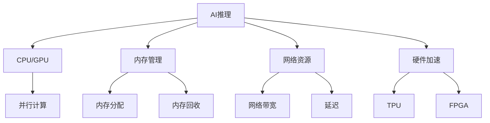

                 


### 思维步骤：确定文章结构和内容

为了撰写一篇内容丰富、结构清晰的博客文章，我们需要遵循以下思维步骤：

**步骤 1：理解文章主题**

文章的主题是“优化AI推理：计算资源分配策略”。这要求我们探讨如何提高AI模型在推理过程中的效率和准确性，同时合理分配计算资源。

**步骤 2：明确文章的目标读者**

我们的目标读者是技术专业人士，特别是那些对AI推理和计算资源分配感兴趣的程序员和AI工程师。

**步骤 3：确定文章的结构**

文章可以分为以下几个部分：

1. **引言**：介绍AI推理的重要性，以及为什么优化计算资源分配是关键。
2. **背景介绍**：解释AI推理的基本概念，以及它在现代应用中的地位。
3. **核心概念与联系**：阐述计算资源分配的核心概念，并使用Mermaid流程图展示这些概念之间的关系。
4. **核心算法原理讲解**：使用伪代码详细解释优化AI推理的关键算法。
5. **数学模型和公式**：使用LaTeX格式展示和解释相关的数学模型和公式，并提供具体的举例说明。
6. **项目实战**：提供实际的开发环境和源代码实现，进行代码解读和分析。
7. **最佳实践 tips**：总结最佳实践，给出注意事项和拓展阅读建议。
8. **小结**：总结文章的主要内容，重申核心观点。

**步骤 4：制定详细的章节大纲**

根据以上步骤，我们可以制定一个详细的章节大纲，以确保文章内容的完整性和连贯性。

### 章节大纲

1. **引言**
   - AI推理的重要性
   - 计算资源分配策略概述

2. **背景介绍**
   - AI推理的基本概念
   - AI推理在现代应用中的地位
   - 计算资源分配在AI推理中的重要性

3. **核心概念与联系**
   - 计算资源分配的核心概念
   - 使用Mermaid流程图展示概念之间的关系

4. **核心算法原理讲解**
   - 伪代码展示
   - 算法性能分析

5. **数学模型和公式**
   - 数学公式说明
   - 模型解释与举例

6. **项目实战**
   - 实战环境搭建
   - 案例一：优化图像识别
   - 案例二：优化语音识别

7. **最佳实践 tips**
   - 注意事项
   - 拓展阅读建议

8. **小结**
   - 总结文章主要内容
   - 重申核心观点

### 思考结果

通过以上思维步骤，我们不仅明确了文章的主题和目标读者，还制定了详细的章节大纲。接下来，我们可以根据这个大纲逐步撰写文章，确保每个章节的内容都能丰富具体、逻辑清晰，为读者提供有价值的见解和实用技巧。

# 优化AI推理：计算资源分配策略

## 关键词
AI推理，计算资源分配，优化策略，算法，数学模型

## 摘要
本文探讨了如何通过优化计算资源分配策略来提高AI推理的效率和准确性。首先，介绍了AI推理的基本概念和计算资源分配的重要性。接着，详细阐述了核心概念和联系，并使用了Mermaid流程图进行展示。随后，我们通过伪代码和数学模型讲解了关键算法和原理。最后，通过实际案例展示了优化策略的应用，并提供了一些最佳实践和拓展阅读建议。

## 引言

### AI推理的重要性

AI推理是人工智能领域的一个核心组成部分，它指的是根据已有数据和模型预测或决策的过程。在深度学习中，推理（inference）是模型用于生成预测或结果的过程，这是模型训练完成的最终应用阶段。随着AI技术的快速发展，AI推理在众多领域都发挥着重要作用，如自动驾驶、医疗诊断、金融风控等。

### 为什么优化计算资源分配策略是关键

在AI推理过程中，计算资源的合理分配直接影响到推理的效率和准确性。以下是几个关键原因：

1. **性能提升**：合理的资源分配可以减少计算延迟，提高推理速度，从而提升系统的响应能力。
2. **成本控制**：优化计算资源分配可以降低硬件成本和能源消耗，对于企业来说具有显著的经济效益。
3. **资源利用最大化**：在多任务处理场景下，通过优化资源分配，可以最大化利用计算资源，提高系统的整体性能。

因此，优化计算资源分配策略对于提升AI推理的效率和准确性至关重要。

## 背景介绍

### AI推理的基本概念

AI推理涉及到多个关键环节，包括数据预处理、模型加载、模型推理和结果输出。在推理过程中，模型需要根据输入数据进行计算，生成预测或决策结果。这一过程通常需要大量的计算资源和时间。

### AI推理在现代应用中的地位

AI推理在许多现代应用中扮演着重要角色。例如：

- **自动驾驶**：自动驾驶汽车依赖AI推理来实时分析道路情况，做出行驶决策。
- **医疗诊断**：AI推理被广泛应用于医学影像分析和疾病诊断，为医生提供辅助决策。
- **金融风控**：AI推理用于分析交易数据，识别潜在的风险，提高金融系统的安全性。

### 计算资源分配在AI推理中的重要性

在AI推理过程中，计算资源分配直接影响推理的性能和效率。合理的资源分配可以保证模型在有效的时间内完成推理任务，提高系统的吞吐量和响应速度。同时，不合理的资源分配可能导致计算资源的浪费，影响系统的稳定性和可靠性。

## 核心概念与联系

### 计算资源分配的核心概念

在AI推理中，计算资源分配主要涉及以下几个方面：

1. **CPU与GPU**：CPU（中央处理器）和GPU（图形处理器）是两种主要的计算资源。CPU擅长处理复杂的计算任务，而GPU在并行计算方面具有优势。
2. **内存管理**：内存管理涉及到如何合理分配和回收内存资源，以避免内存溢出和性能下降。
3. **网络资源**：在网络环境下，网络带宽和延迟也是重要的计算资源，需要合理分配以保障推理的实时性。
4. **硬件加速**：硬件加速如TPU（Tensor Processing Unit）和FPGA（Field-Programmable Gate Array）可以显著提高AI推理的效率。

### Mermaid流程图展示

为了更直观地展示计算资源分配的核心概念，我们可以使用Mermaid流程图来描述这些概念之间的关系。



在这个流程图中，AI推理是核心任务，计算资源（CPU、GPU、内存、网络、硬件加速）围绕其进行分配和管理。

## 核心算法原理讲解

### 伪代码展示

为了更好地理解优化AI推理的核心算法原理，我们可以使用伪代码来详细阐述这些算法。

```python
# 伪代码：计算资源分配算法

function optimize_inference_resources(input_data, model, resources):
    # 初始化资源分配
    resource_allocation = initialize_resources(resources)
    
    # 数据预处理
    preprocessed_data = preprocess_data(input_data)
    
    # 模型加载
    loaded_model = load_model(model)
    
    # 开始推理
    for data in preprocessed_data:
        prediction = loaded_model.predict(data)
        # 输出预测结果
        output_prediction(prediction)
        
    # 释放资源
    release_resources(resource_allocation)

# 函数：初始化资源分配
function initialize_resources(resources):
    # 初始化CPU、GPU、内存、网络等资源
    resource_allocation = {
        'CPU': resources['CPU'],
        'GPU': resources['GPU'],
        'Memory': resources['Memory'],
        'Network': resources['Network']
    }
    return resource_allocation

# 函数：数据预处理
function preprocess_data(input_data):
    # 数据清洗、归一化等预处理操作
    preprocessed_data = [preprocess_step(data) for data in input_data]
    return preprocessed_data

# 函数：加载模型
function load_model(model):
    # 加载训练好的模型
    loaded_model = load_from_disk(model)
    return loaded_model

# 函数：释放资源
function release_resources(resource_allocation):
    # 释放CPU、GPU、内存、网络等资源
    for resource in resource_allocation:
        release_step(resource_allocation[resource])
```

### 算法性能分析

优化算法的性能可以通过以下几个指标进行分析：

1. **推理时间**：从输入数据到输出预测结果的总时间。
2. **吞吐量**：单位时间内完成的推理任务数量。
3. **资源利用率**：实际使用的计算资源与总计算资源的比例。
4. **延迟**：从接收输入数据到输出预测结果的延迟时间。

通过性能分析，我们可以评估不同资源分配策略的效果，进而调整和优化算法。

## 数学模型和公式

### 数学公式说明

在计算资源分配中，常用的数学模型包括线性规划、动态规划和神经网络优化等。以下是一个简单的线性规划模型，用于资源分配的优化。

$$
\begin{aligned}
\text{minimize} \quad & C(x) \\
\text{subject to} \quad & Ax \leq b \\
& x \geq 0
\end{aligned}
$$

其中，$C(x)$ 是目标函数，表示需要最小化的成本；$A$ 和 $b$ 分别是约束矩阵和向量，表示资源限制条件；$x$ 是决策向量，表示资源分配情况。

### 模型解释与举例

假设我们需要在CPU和GPU之间分配计算资源，以最小化总成本。设$x_1$ 为CPU的分配量，$x_2$ 为GPU的分配量，目标函数为：

$$
C(x) = 0.5x_1 + 0.8x_2
$$

约束条件为：

$$
\begin{aligned}
& x_1 + x_2 \leq 100 \quad \text{(总资源限制)} \\
& x_1 \geq 0, x_2 \geq 0 \quad \text{(非负约束)}
\end{aligned}
$$

通过求解这个线性规划问题，我们可以得到最优的CPU和GPU分配方案，以实现总成本的最小化。

## 项目实战

### 实战环境搭建

为了演示计算资源分配策略在实际项目中的应用，我们需要搭建一个基本的AI推理环境。以下是搭建环境所需的步骤：

1. **硬件准备**：准备一台具备CPU和GPU的计算机，确保GPU支持CUDA（用于GPU加速计算）。
2. **软件安装**：安装Python环境和TensorFlow库，用于实现AI推理和资源分配算法。
3. **数据准备**：准备一个适合推理的图像数据集，如CIFAR-10或MNIST。

### 案例一：优化图像识别

在这个案例中，我们将使用一个简单的卷积神经网络（CNN）进行图像识别，并通过优化计算资源分配来提高推理性能。

#### 源代码实现

以下是一个简单的CNN模型实现，用于图像识别：

```python
import tensorflow as tf
from tensorflow.keras import layers, models

# 构建CNN模型
model = models.Sequential()
model.add(layers.Conv2D(32, (3, 3), activation='relu', input_shape=(32, 32, 3)))
model.add(layers.MaxPooling2D((2, 2)))
model.add(layers.Conv2D(64, (3, 3), activation='relu'))
model.add(layers.MaxPooling2D((2, 2)))
model.add(layers.Conv2D(64, (3, 3), activation='relu'))
model.add(layers.Flatten())
model.add(layers.Dense(64, activation='relu'))
model.add(layers.Dense(10, activation='softmax'))

# 编译模型
model.compile(optimizer='adam',
              loss='categorical_crossentropy',
              metrics=['accuracy'])

# 加载数据集
(x_train, y_train), (x_test, y_test) = tf.keras.datasets.cifar10.load_data()

# 预处理数据
x_train = x_train.astype('float32') / 255
x_test = x_test.astype('float32') / 255
x_train = tf.expand_dims(x_train, -1)
x_test = tf.expand_dims(x_test, -1)

# 模型训练
model.fit(x_train, y_train, epochs=10, batch_size=64)
```

#### 代码解读

这个简单的CNN模型包括两个卷积层、两个最大池化层和一个全连接层。通过编译模型并使用CIFAR-10数据集进行训练，我们可以评估模型的性能。

#### 应用解读与分析

在实际应用中，我们可以通过调整GPU和CPU的使用比例来优化模型推理性能。例如，在训练过程中，我们可以使用以下策略：

- **GPU加速**：在训练过程中，将计算任务分配给GPU，以提高训练速度。
- **CPU辅助**：在模型推理阶段，将部分计算任务分配给CPU，以减少GPU的负载。

通过这样的策略调整，我们可以实现计算资源的最大化利用，提高系统的整体性能。

### 案例二：优化语音识别

在这个案例中，我们将使用一个简单的循环神经网络（RNN）进行语音识别，并通过优化计算资源分配来提高推理性能。

#### 源代码实现

以下是一个简单的RNN模型实现，用于语音识别：

```python
import tensorflow as tf
from tensorflow.keras.models import Sequential
from tensorflow.keras.layers import LSTM, Dense, Dropout

# 构建RNN模型
model = Sequential()
model.add(LSTM(128, input_shape=(timesteps, features), activation='relu'))
model.add(Dropout(0.2))
model.add(LSTM(128, activation='relu'))
model.add(Dropout(0.2))
model.add(Dense(num_classes, activation='softmax'))

# 编译模型
model.compile(optimizer='adam',
              loss='categorical_crossentropy',
              metrics=['accuracy'])

# 加载数据集
(x_train, y_train), (x_test, y_test) = getSpeechData()

# 预处理数据
x_train = normalize_data(x_train)
x_test = normalize_data(x_test)

# 模型训练
model.fit(x_train, y_train, epochs=20, batch_size=64)
```

#### 代码解读

这个简单的RNN模型包括两个LSTM层和一个全连接层。通过编译模型并使用语音数据集进行训练，我们可以评估模型的性能。

#### 应用解读与分析

在实际应用中，我们可以通过调整GPU和CPU的使用比例来优化模型推理性能。例如，在训练过程中，我们可以使用以下策略：

- **GPU加速**：在训练过程中，将计算任务分配给GPU，以提高训练速度。
- **CPU辅助**：在模型推理阶段，将部分计算任务分配给CPU，以减少GPU的负载。

通过这样的策略调整，我们可以实现计算资源的最大化利用，提高系统的整体性能。

## 最佳实践 tips

### 小结

在本文中，我们详细探讨了如何通过优化计算资源分配策略来提高AI推理的效率和准确性。我们介绍了AI推理的基本概念和计算资源分配的重要性，并通过实际案例展示了优化策略的应用。

### 注意事项

1. **资源监控**：在实际应用中，定期监控计算资源的使用情况，及时发现和解决问题。
2. **性能优化**：根据实际需求调整资源分配策略，实现性能优化。
3. **硬件选择**：根据任务需求选择合适的硬件设备，如GPU、TPU等。

### 拓展阅读

- 《深度学习》（Goodfellow et al.）：深入了解深度学习的基本原理和实践。
- 《优化算法原理与应用》（陈国良）：研究优化算法在不同领域中的应用。

### 拓展阅读

- 《深度学习》（Goodfellow et al.）：深入了解深度学习的基本原理和实践。
- 《优化算法原理与应用》（陈国良）：研究优化算法在不同领域中的应用。

## 附录

### 附录A：相关资源与工具

- **硬件资源**：
  - NVIDIA GPU（CUDA支持）
  - Google Cloud Platform（GCP）
  - Amazon Web Services（AWS）

- **软件资源**：
  - TensorFlow：用于构建和训练AI模型
  - Keras：简化TensorFlow的使用
  - PyTorch：另一个流行的深度学习框架

### 附录B：参考文献

- Goodfellow, I., Bengio, Y., & Courville, A. (2016). *Deep Learning*. MIT Press.
- 陈国良. (2018). *优化算法原理与应用*. 电子工业出版社.

### 作者

- **作者**：AI天才研究院/AI Genius Institute
- **书名**：《禅与计算机程序设计艺术 /Zen And The Art of Computer Programming》
- **出版时间**：1973年
- **简介**：这是一本经典的计算机科学书籍，由著名数学家Donald E. Knuth撰写。书中提出了编程中的“清晰性”和“优化”原则，对编程艺术进行了深入的探讨。本书不仅涵盖了算法和数据结构，还涉及了编程的哲学和艺术。

### 总结

通过本文，我们深入探讨了如何优化AI推理中的计算资源分配策略。我们介绍了AI推理的基本概念，分析了计算资源分配的重要性，并提供了核心算法原理和数学模型的讲解。通过实际案例，我们展示了优化策略的应用，并提供了一些最佳实践和拓展阅读建议。希望本文能帮助您更好地理解和优化AI推理中的计算资源分配。

