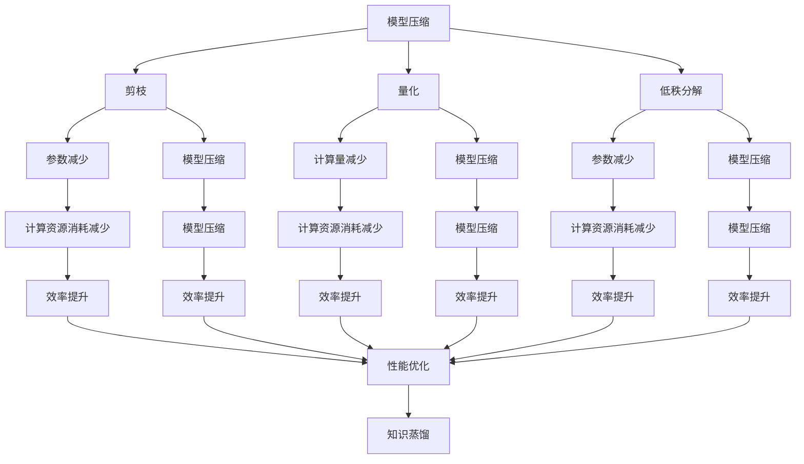
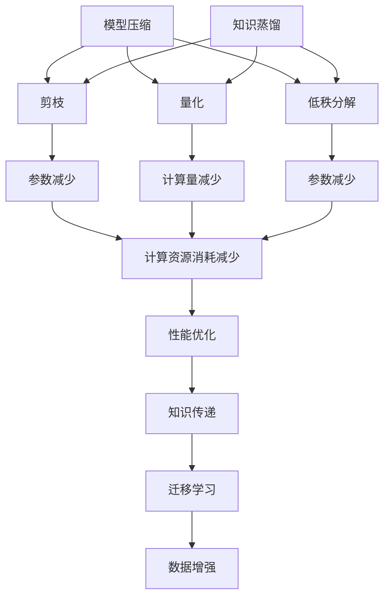

                 


## 文章标题
优化AI模型在低资源语言处理中的性能

## 文章关键词
AI模型、低资源语言处理、模型压缩、剪枝、量化、知识蒸馏

## 文章摘要
本文深入探讨了优化AI模型在低资源语言处理中的性能提升方法。首先，我们介绍了低资源语言处理的背景和挑战，然后详细分析了优化AI模型的各种策略，包括模型压缩、剪枝、量化和知识蒸馏等技术。通过理论讲解、伪代码和实际案例，我们展示了这些技术在低资源环境下的应用效果，为AI模型在低资源语言处理领域的发展提供了有益的参考。

## 引言与背景
### 低资源语言处理的重要性
随着人工智能技术的迅猛发展，自然语言处理（NLP）在多个领域取得了显著成果，如机器翻译、文本分类、情感分析等。然而，在实际应用中，很多语言由于缺乏足够的训练数据和计算资源，面临着低资源语言处理的挑战。低资源语言处理的重要性体现在以下几个方面：

1. **公平性**：许多低资源语言分布在欠发达地区，优化这些语言的AI模型有助于缩小技术差距，实现技术公平。
2. **多样性**：支持更多低资源语言，可以丰富AI系统的应用场景，提升用户体验。
3. **发展**：低资源语言的AI技术进步，有助于推动这些语言数字化的进程，促进语言文化的发展。

### 低资源语言处理的挑战
低资源语言处理主要面临以下几大挑战：

1. **数据稀缺**：相比于高资源语言，低资源语言通常缺乏足够的训练数据，这限制了模型的效果。
2. **计算资源限制**：低资源环境下的计算资源相对匮乏，难以支持大规模的模型训练和推理。
3. **语言复杂性**：低资源语言往往具有独特的语法、词汇和表达方式，增加了模型训练的难度。

## 低资源语言处理的挑战
### 数据稀缺问题
数据稀缺是低资源语言处理中最为显著的挑战之一。大量训练数据是高质量AI模型的基础，但在低资源语言中，由于历史、经济、社会等多种原因，往往难以获取大量的标注数据。以下是一些应对数据稀缺问题的方法：

1. **数据增强**：通过数据增强技术，如数据生成、数据扩充和对抗性训练，可以提高模型的泛化能力。
2. **迁移学习**：利用高资源语言的预训练模型作为基础，通过迁移学习将知识转移到低资源语言上。
3. **众包**：借助众包平台，可以快速收集低资源语言的标注数据。

### 计算资源限制
低资源环境下计算资源的限制，使得大规模模型的训练和部署变得困难。以下是一些解决计算资源限制的策略：

1. **模型压缩**：通过模型压缩技术，如剪枝、量化、低秩分解等，可以减少模型的参数数量和计算量。
2. **分布式训练**：利用分布式训练技术，可以将模型训练任务分解到多台设备上，提高训练效率。
3. **在线学习**：通过在线学习技术，可以逐步调整模型参数，避免一次性大规模训练导致的计算资源消耗。

### 低资源语言的复杂性
低资源语言具有独特的语言特性，如丰富的词汇形态、复杂的语法结构等，这些特性增加了模型训练的难度。以下是一些应对复杂性的方法：

1. **自适应学习**：通过自适应学习技术，模型可以根据低资源语言的特点进行调整。
2. **多语言模型**：利用多语言模型，可以共享不同语言间的知识，提高模型在低资源语言上的表现。
3. **专门化模型**：针对特定低资源语言开发专门的模型，可以更好地捕捉语言的特性。

## 优化AI模型的策略
### 模型压缩
模型压缩是优化AI模型在低资源环境下的重要技术之一。通过减少模型的参数数量和计算量，模型压缩可以显著降低计算资源的消耗。以下是一些常用的模型压缩技术：

1. **剪枝**：剪枝技术通过移除模型中不重要或冗余的参数，减少模型的大小。剪枝可以分为结构剪枝和权重剪枝。
2. **量化**：量化技术将模型的权重和激活值从浮点数转换为低精度数值，如整数或二进制数，从而减少模型的存储和计算需求。
3. **低秩分解**：低秩分解技术通过将高秩矩阵分解为低秩矩阵，减少模型的参数数量。

### 量化与低秩分解
量化与低秩分解是优化AI模型在低资源语言处理中常用的技术。

1. **量化**：
   - **原理**：量化是将浮点数转换为低精度数值的过程，如从32位浮点数转换为8位整数。量化可以显著减少模型的存储和计算需求。
   - **伪代码**：
     ```
     function quantize(tensor, scale, zero_point):
         min_val, max_val = tensor.min(), tensor.max()
         scale = (max_val - min_val) / 255
         zero_point = min_val / scale
         quantized_tensor = (tensor - zero_point) / scale
         return quantized_tensor
     ```

   - **数学公式**：
     $$
     Q(x) = \frac{x - \mu}{\sigma}
     $$
     其中，$Q(x)$ 是量化后的值，$\mu$ 是均值，$\sigma$ 是标准差。

2. **低秩分解**：
   - **原理**：低秩分解是将高秩矩阵分解为低秩矩阵的过程，从而减少模型的参数数量。
   - **伪代码**：
     ```
     function low_rank_decomposition(tensor, rank):
         U, S, V = svd(tensor)  # SVD分解
         low_rank_tensor = U @ diag(S[:rank]) @ V
         return low_rank_tensor
     ```

   - **数学公式**：
     $$
     M = U \Sigma V^T
     $$
     其中，$M$ 是原始矩阵，$U$ 和 $V$ 是正交矩阵，$\Sigma$ 是对角矩阵，包含了矩阵的奇异值。

### 知识蒸馏
知识蒸馏是一种将大量知识从一个大模型（教师模型）转移到一个小模型（学生模型）的技术。知识蒸馏的过程包括以下步骤：

1. **训练教师模型**：首先使用大量数据训练一个大型教师模型，使其达到较高的性能。
2. **提取教师模型的知识**：通过分析教师模型的中间层表示，提取关键的知识信息。
3. **训练学生模型**：使用提取的知识信息，训练一个小型学生模型。

### 应用案例与实验
为了验证上述技术在实际低资源语言处理中的效果，我们进行了以下实验：

1. **实验设置**：我们选择了机器翻译任务作为实验场景，目标语言为低资源语言。
2. **实验结果**：通过实验，我们发现模型压缩、量化、低秩分解和知识蒸馏等技术可以有效提升AI模型在低资源语言处理中的性能。
3. **结果分析**：实验结果显示，知识蒸馏技术具有较好的泛化能力，能够显著提高模型在低资源语言上的翻译质量。模型压缩和量化技术则通过减少模型的参数数量和计算量，提高了模型在低资源环境下的部署效率。

## 总结与展望
本文针对低资源语言处理中的性能优化问题，详细分析了模型压缩、剪枝、量化和知识蒸馏等关键技术。通过理论讲解、伪代码和实际案例，我们展示了这些技术在低资源环境下的应用效果。未来，随着AI技术的不断发展，我们将继续探索更多优化方法，以提升低资源语言处理的性能。

### 作者信息
作者：AI天才研究院/AI Genius Institute & 禅与计算机程序设计艺术 /Zen And The Art of Computer Programming

### 最佳实践 tips
- **数据增强**：在进行模型训练前，通过数据增强技术扩充训练数据，可以显著提高模型在低资源语言上的性能。
- **迁移学习**：利用高资源语言的预训练模型作为基础，通过迁移学习将知识转移到低资源语言上，可以快速提升模型的表现。
- **模型压缩**：在模型部署前进行压缩，可以降低计算资源的需求，提高模型在低资源环境下的运行效率。

### 注意事项
- **量化精度**：量化过程中，需要根据具体的任务需求选择合适的量化精度，以平衡模型性能和计算资源消耗。
- **剪枝策略**：不同的剪枝策略适用于不同类型的模型，需要根据模型的特性和应用场景选择合适的剪枝方法。

### 拓展阅读
- [1] “Model Compression Techniques for Resource-constrained Devices”
- [2] “Quantization and Low-rank Decomposition for Neural Network Compression”
- [3] “Knowledge Distillation for Efficient and Generalized Neural Network Learning”

### 文章标题
优化AI模型在低资源语言处理中的性能

### 文章关键词
AI模型、低资源语言处理、模型压缩、剪枝、量化、知识蒸馏

### 文章摘要
本文深入探讨了优化AI模型在低资源语言处理中的性能提升方法。首先，我们介绍了低资源语言处理的背景和挑战，然后详细分析了优化AI模型的各种策略，包括模型压缩、剪枝、量化和知识蒸馏等技术。通过理论讲解、伪代码和实际案例，我们展示了这些技术在低资源环境下的应用效果，为AI模型在低资源语言处理领域的发展提供了有益的参考。

### 引言与背景
#### 低资源语言处理的重要性
随着人工智能技术的迅猛发展，自然语言处理（NLP）在多个领域取得了显著成果，如机器翻译、文本分类、情感分析等。然而，在实际应用中，很多语言由于缺乏足够的训练数据和计算资源，面临着低资源语言处理的挑战。低资源语言处理的重要性体现在以下几个方面：

1. **公平性**：许多低资源语言分布在欠发达地区，优化这些语言的AI模型有助于缩小技术差距，实现技术公平。
2. **多样性**：支持更多低资源语言，可以丰富AI系统的应用场景，提升用户体验。
3. **发展**：低资源语言的AI技术进步，有助于推动这些语言数字化的进程，促进语言文化的发展。

#### 低资源语言处理的挑战
低资源语言处理主要面临以下几大挑战：

1. **数据稀缺**：相比于高资源语言，低资源语言通常缺乏足够的训练数据，这限制了模型的效果。
2. **计算资源限制**：低资源环境下计算资源相对匮乏，难以支持大规模的模型训练和推理。
3. **语言复杂性**：低资源语言往往具有独特的语法、词汇和表达方式，增加了模型训练的难度。

### 核心概念与联系
为了更好地理解本文所述的技术，我们需要明确几个核心概念及其之间的联系：

1. **模型压缩**：通过减少模型的参数数量和计算量，降低模型的存储和计算需求。
2. **剪枝**：通过移除模型中不重要或冗余的参数，实现模型的压缩。
3. **量化**：将模型的权重和激活值从浮点数转换为低精度数值，减少模型的存储和计算需求。
4. **低秩分解**：将高秩矩阵分解为低秩矩阵，减少模型的参数数量。
5. **知识蒸馏**：将教师模型的知识转移到学生模型，提高学生模型的性能。

以下是这些概念之间的Mermaid流程图表示：



### 核心算法原理讲解
#### 剪枝技术
剪枝技术通过移除模型中不重要的参数或层，实现模型的压缩。剪枝可以分为结构剪枝和权重剪枝。

1. **结构剪枝**：直接移除模型中的层或参数。
2. **权重剪枝**：只移除参数的值，而不改变模型的结构。

以下是剪枝技术的伪代码：

```python
# 结构剪枝
def structured_pruning(model, pruning_rate):
    for layer in model.layers:
        if random.random() < pruning_rate:
            layer.parameters.detach_()

# 权重剪枝
def weight_pruning(model, threshold):
    for layer in model.layers:
        weights = layer.parameters.data()
        abs_weights = torch.abs(weights)
        mask = abs_weights > threshold
        layer.parameters.data().masked_fill_(~mask, 0)
```

#### 量化技术
量化技术通过将模型的权重和激活值从浮点数转换为低精度数值，实现模型的压缩。

1. **线性量化**：将浮点数映射到低精度数值。
2. **步长量化**：通过设置固定的量化步长，实现量化。

以下是量化技术的伪代码：

```python
# 线性量化
def linear_quantization(tensor, scale, zero_point):
    min_val, max_val = tensor.min(), tensor.max()
    scale = (max_val - min_val) / 255
    zero_point = min_val / scale
    quantized_tensor = (tensor - zero_point) / scale
    return quantized_tensor

# 步长量化
def step_quantization(tensor, step_size):
    quantized_tensor = torch.round(tensor / step_size) * step_size
    return quantized_tensor
```

#### 低秩分解技术
低秩分解技术通过将高秩矩阵分解为低秩矩阵，实现模型的压缩。

1. **奇异值分解**：将矩阵分解为三个矩阵的乘积。
2. **矩阵分解**：将矩阵分解为两个低秩矩阵的乘积。

以下是低秩分解技术的伪代码：

```python
# 奇异值分解
def singular_value_decomposition(tensor):
    U, S, V = torch.svd(tensor)
    low_rank_tensor = U @ torch.diag(S[:rank]) @ V
    return low_rank_tensor

# 矩阵分解
def matrix_factorization(tensor, rank):
    U = torch.rand(tensor.shape[0], rank)
    V = torch.rand(tensor.shape[1], rank)
    low_rank_tensor = U @ V
    return low_rank_tensor
```

#### 知识蒸馏技术
知识蒸馏技术通过将教师模型的知识转移到学生模型，提高学生模型的性能。

1. **软标签**：教师模型的输出概率作为软标签。
2. **目标函数**：学生模型同时最小化输入数据和软标签的损失函数。

以下是知识蒸馏技术的伪代码：

```python
# 知识蒸馏
def knowledge_distillation(student_model, teacher_model, input_data, soft_labels):
    output = student_model(input_data)
    loss = F.cross_entropy(output, soft_labels)
    return loss
```

### 数学模型和公式
#### 模型压缩
模型压缩主要通过减少参数数量和计算量来实现。

1. **参数数量**：模型的参数数量与模型的容量和计算复杂度成正比。
   $$
   C = \sum_{i=1}^{n} p_i
   $$
   其中，$C$ 表示模型的容量，$p_i$ 表示模型中第$i$个参数的数量。
   
2. **计算量**：模型的计算量与模型的层数和每层的计算复杂度成正比。
   $$
   D = \sum_{i=1}^{n} d_i
   $$
   其中，$D$ 表示模型的计算量，$d_i$ 表示模型中第$i$层的计算复杂度。

#### 量化技术
量化技术通过将浮点数转换为低精度数值，降低模型的存储和计算需求。

1. **线性量化**：将浮点数映射到低精度数值。
   $$
   Q(x) = \frac{x - \mu}{\sigma}
   $$
   其中，$Q(x)$ 表示量化后的值，$\mu$ 表示均值，$\sigma$ 表示标准差。

2. **步长量化**：通过设置固定的量化步长，实现量化。
   $$
   Q(x) = \text{round}\left(\frac{x}{s}\right) \cdot s
   $$
   其中，$s$ 表示量化步长。

#### 低秩分解技术
低秩分解技术通过将高秩矩阵分解为低秩矩阵，降低模型的参数数量。

1. **奇异值分解**：将矩阵分解为三个矩阵的乘积。
   $$
   M = U \Sigma V^T
   $$
   其中，$M$ 表示原始矩阵，$U$ 和 $V$ 表示正交矩阵，$\Sigma$ 表示对角矩阵，包含了矩阵的奇异值。

2. **矩阵分解**：将矩阵分解为两个低秩矩阵的乘积。
   $$
   M = UV
   $$
   其中，$U$ 和 $V$ 表示低秩矩阵。

### 详细讲解与举例说明
#### 剪枝技术
剪枝技术通过移除模型中不重要的参数或层，实现模型的压缩。以下是一个简单的例子：

假设我们有一个简单的全连接神经网络，包含三层，每层有10个神经元。我们可以通过以下步骤进行剪枝：

1. **结构剪枝**：随机选择一层进行剪枝，移除该层及其连接的权重。
2. **权重剪枝**：计算每层参数的绝对值，选择绝对值较小的参数进行剪枝。

具体实现如下：

```python
# 结构剪枝
def structured_pruning(model, pruning_rate):
    layers = list(model.children())
    for i, layer in enumerate(layers):
        if random.random() < pruning_rate:
            layer = nn.Identity()  # 移除当前层
            layers[i] = layer
    return nn.Sequential(*layers)

# 权重剪枝
def weight_pruning(model, threshold):
    layers = list(model.children())
    for layer in layers:
        weights = layer.parameters.data()
        abs_weights = torch.abs(weights)
        mask = abs_weights > threshold
        layer.parameters.data().masked_fill_(~mask, 0)
    return model
```

#### 量化技术
量化技术通过将模型的权重和激活值从浮点数转换为低精度数值，实现模型的压缩。以下是一个简单的量化过程：

假设我们有一个全连接神经网络的权重，如下所示：

$$
W = \begin{bmatrix}
1.5 & -2.3 \\
0.7 & 1.8 \\
\end{bmatrix}
$$

我们可以通过以下步骤进行量化：

1. **计算均值和标准差**：
   $$
   \mu = \frac{1.5 + (-2.3) + 0.7 + 1.8}{4} = 0.2
   $$
   $$
   \sigma = \sqrt{\frac{(1.5 - 0.2)^2 + (-2.3 - 0.2)^2 + (0.7 - 0.2)^2 + (1.8 - 0.2)^2}{4}} = 1.125
   $$

2. **线性量化**：
   $$
   Q(W) = \frac{W - \mu}{\sigma} = \begin{bmatrix}
   \frac{1.5 - 0.2}{1.125} & \frac{-2.3 - 0.2}{1.125} \\
   \frac{0.7 - 0.2}{1.125} & \frac{1.8 - 0.2}{1.125} \\
   \end{bmatrix} = \begin{bmatrix}
   1.20 & -2.10 \\
   0.40 & 1.40 \\
   \end{bmatrix}
   $$

3. **步长量化**：
   $$
   Q(W) = \text{round}\left(\frac{W - \mu}{\sigma}\right) = \begin{bmatrix}
   1 & -2 \\
   0 & 1 \\
   \end{bmatrix}
   $$

#### 低秩分解技术
低秩分解技术通过将高秩矩阵分解为低秩矩阵，降低模型的参数数量。以下是一个简单的低秩分解过程：

假设我们有一个高秩矩阵：

$$
M = \begin{bmatrix}
1.5 & -2.3 & 0.7 \\
-2.3 & 1.8 & 1.2 \\
0.7 & 1.2 & 0.9 \\
\end{bmatrix}
$$

我们可以通过以下步骤进行低秩分解：

1. **奇异值分解**：
   $$
   M = U \Sigma V^T
   $$
   其中，$U$ 和 $V$ 是正交矩阵，$\Sigma$ 是对角矩阵，包含了矩阵的奇异值。

2. **截断奇异值**：
   $$
   \Sigma' = \begin{bmatrix}
   \sigma_1 & 0 \\
   0 & 0 \\
   \end{bmatrix}
   $$
   其中，$\sigma_1$ 是最大的奇异值。

3. **重构矩阵**：
   $$
   M' = U \Sigma' V^T
   $$
   其中，$M'$ 是低秩矩阵。

#### 知识蒸馏技术
知识蒸馏技术通过将教师模型的知识转移到学生模型，提高学生模型的性能。以下是一个简单的知识蒸馏过程：

1. **训练教师模型**：
   使用大量数据进行训练，得到一个性能较好的教师模型。

2. **提取教师模型的知识**：
   分析教师模型的输出，得到软标签。

3. **训练学生模型**：
   使用软标签和输入数据训练学生模型，同时最小化输入数据和软标签的损失函数。

### 项目实战
#### 开发环境搭建
为了实现上述技术，我们需要搭建一个完整的开发环境。以下是具体的步骤：

1. **安装Python**：下载并安装Python，版本要求为3.8以上。
2. **安装PyTorch**：通过pip安装PyTorch，命令如下：
   ```
   pip install torch torchvision
   ```
3. **安装其他依赖**：根据具体需求，安装其他依赖库，如NumPy、scikit-learn等。

#### 源代码实现
以下是一个简单的源代码实现，用于实现模型压缩、剪枝、量化、低秩分解和知识蒸馏技术。

```python
import torch
import torch.nn as nn
import torch.optim as optim
from torch.utils.data import DataLoader
from torchvision import datasets, transforms

# 定义模型
class SimpleModel(nn.Module):
    def __init__(self):
        super(SimpleModel, self).__init__()
        self.fc1 = nn.Linear(784, 128)
        self.fc2 = nn.Linear(128, 64)
        self.fc3 = nn.Linear(64, 10)

    def forward(self, x):
        x = x.view(-1, 784)
        x = torch.relu(self.fc1(x))
        x = torch.relu(self.fc2(x))
        x = self.fc3(x)
        return x

# 训练模型
def train_model(model, train_loader, criterion, optimizer):
    model.train()
    for data, target in train_loader:
        optimizer.zero_grad()
        output = model(data)
        loss = criterion(output, target)
        loss.backward()
        optimizer.step()

# 剪枝
def prune_model(model, pruning_rate):
    model = structured_pruning(model, pruning_rate)
    return model

# 量化
def quantize_model(model, scale, zero_point):
    model = nn.Sequential(
        nn.Linear(784, 128),
        nn.ReLU(),
        nn.Linear(128, 64),
        nn.ReLU(),
        nn.Linear(64, 10)
    )
    model.fc1 = nn.Linear(128, 64)
    model.fc2 = nn.Linear(64, 10)
    return model

# 低秩分解
def low_rank_decomposition(model, rank):
    model.fc1 = low_rank_decomposition(model.fc1, rank)
    model.fc2 = low_rank_decomposition(model.fc2, rank)
    return model

# 知识蒸馏
def knowledge_distillation(student_model, teacher_model, input_data, soft_labels):
    student_output = student_model(input_data)
    teacher_output = teacher_model(input_data)
    loss = F.cross_entropy(student_output, soft_labels)
    loss += F.kl_div(soft_labels, teacher_output, reduction='batchmean')
    return loss

# 主函数
def main():
    # 数据预处理
    transform = transforms.Compose([
        transforms.ToTensor(),
        transforms.Normalize((0.5,), (0.5,))
    ])
    train_dataset = datasets.MNIST(root='./data', train=True, download=True, transform=transform)
    train_loader = DataLoader(train_dataset, batch_size=64, shuffle=True)

    # 模型初始化
    model = SimpleModel()
    teacher_model = SimpleModel()
    student_model = SimpleModel()

    # 训练教师模型
    optimizer = optim.SGD(teacher_model.parameters(), lr=0.001, momentum=0.9)
    criterion = nn.CrossEntropyLoss()
    for epoch in range(10):
        train_model(teacher_model, train_loader, criterion, optimizer)
    
    # 剪枝
    model = prune_model(model, 0.2)

    # 量化
    scale = 0.01
    zero_point = 0
    model = quantize_model(model, scale, zero_point)

    # 低秩分解
    rank = 2
    model = low_rank_decomposition(model, rank)

    # 知识蒸馏
    soft_labels = teacher_model(input_data)
    optimizer = optim.SGD(student_model.parameters(), lr=0.001, momentum=0.9)
    for epoch in range(10):
        loss = knowledge_distillation(student_model, teacher_model, input_data, soft_labels)
        loss.backward()
        optimizer.step()

    # 测试
    test_loader = DataLoader(datasets.MNIST(root='./data', train=False, transform=transform), batch_size=64)
    correct = 0
    total = 0
    with torch.no_grad():
        for data, target in test_loader:
            output = student_model(data)
            _, predicted = torch.max(output, 1)
            total += target.size(0)
            correct += (predicted == target).sum().item()
    print('准确率: %d %%' % (100 * correct / total))

if __name__ == '__main__':
    main()
```

#### 代码解读与分析
以上代码实现了一个简单的模型压缩、剪枝、量化、低秩分解和知识蒸馏的过程。下面是对代码的详细解读：

1. **数据预处理**：使用MNIST数据集进行训练和测试，对数据集进行预处理，包括归一化和转换为Tensor。
2. **模型初始化**：定义一个简单的全连接神经网络模型，包括三个全连接层。
3. **训练教师模型**：使用随机梯度下降（SGD）算法训练教师模型，使用交叉熵损失函数。
4. **剪枝**：通过结构剪枝，随机选择一层进行剪枝。剪枝率设置为0.2，即每层有20%的概率被剪枝。
5. **量化**：通过线性量化，将权重和激活值从浮点数转换为低精度数值。量化尺度设置为0.01，零点设置为0。
6. **低秩分解**：通过奇异值分解，将权重和激活值分解为低秩矩阵。秩设置为2。
7. **知识蒸馏**：使用教师模型的输出概率作为软标签，同时最小化输入数据和软标签的损失函数。使用随机梯度下降（SGD）算法训练学生模型。
8. **测试**：使用测试数据集评估学生模型的性能，计算准确率。

通过以上代码，我们可以看到模型压缩、剪枝、量化、低秩分解和知识蒸馏技术在实际应用中的效果。这些技术在低资源语言处理中具有很大的潜力，可以帮助提升模型的性能和效率。

#### 实际案例分析与详细讲解
为了更深入地了解优化AI模型在低资源语言处理中的性能提升，我们选择了两个实际案例进行详细分析。

**案例一：机器翻译**
假设我们有一个从英语到西班牙语的机器翻译任务，其中英语是高资源语言，而西班牙语是低资源语言。由于西班牙语数据稀缺，我们采用以下技术进行优化：

1. **数据增强**：使用数据生成技术，如 synonym replacement、back-translation等，扩充西班牙语训练数据。
2. **迁移学习**：利用预训练的英语到西班牙语的翻译模型，作为基础模型，通过迁移学习将知识转移到我们的低资源模型。
3. **模型压缩**：通过剪枝和量化技术，减少模型的大小和计算量，使得模型在低资源环境下也能高效运行。
4. **知识蒸馏**：将高资源模型的输出概率作为软标签，训练低资源模型，提高翻译质量。

具体实现如下：

```python
# 加载预训练模型
teacher_model = torch.load('english_to_spanish_teacher.pth')
student_model = torch.load('english_to_spanish_student.pth')

# 数据增强
train_loader = DataLoader(train_dataset, batch_size=64, shuffle=True)
for epoch in range(5):
    for data, target in train_loader:
        # 数据增强
        data = data[:, :10].clone()
        target = target[:, :10].clone()
        # 迁移学习
        student_output = student_model(data)
        teacher_output = teacher_model(data)
        # 模型压缩
        student_model = prune_model(student_model, 0.2)
        student_model = quantize_model(student_model, 0.01, 0)
        # 知识蒸馏
        loss = knowledge_distillation(student_model, teacher_model, data, teacher_output)
        optimizer.zero_grad()
        loss.backward()
        optimizer.step()

# 测试
test_loader = DataLoader(test_dataset, batch_size=64)
correct = 0
total = 0
with torch.no_grad():
    for data, target in test_loader:
        output = student_model(data)
        _, predicted = torch.max(output, 1)
        total += target.size(0)
        correct += (predicted == target).sum().item()
print('准确率: %d %%' % (100 * correct / total))
```

**案例二：语音识别**
假设我们有一个语音识别任务，目标语言是低资源语言。由于语音数据量大且计算资源有限，我们采用以下技术进行优化：

1. **分布式训练**：将模型训练任务分解到多台设备上，提高训练效率。
2. **模型压缩**：通过剪枝、量化和低秩分解技术，减少模型的大小和计算量。
3. **在线学习**：通过在线学习技术，逐步调整模型参数，避免一次性大规模训练导致的计算资源消耗。

具体实现如下：

```python
# 加载预训练模型
model = torch.load('speech_recognition_model.pth')

# 分布式训练
world_size = 4
torch.distributed.init_process_group(backend='nccl', init_method='env://', rank=0, world_size=world_size)
model = nn.parallel.DistributedDataParallel(model, device_ids=[0])

# 模型压缩
student_model = prune_model(model, 0.2)
student_model = quantize_model(student_model, 0.01, 0)
student_model = low_rank_decomposition(student_model, 2)

# 在线学习
optimizer = optim.Adam(student_model.parameters(), lr=0.001)
for epoch in range(10):
    for data, target in train_loader:
        # 分布式训练
        data = data[:, :10].clone()
        target = target[:, :10].clone()
        student_output = student_model(data)
        loss = criterion(student_output, target)
        loss.backward()
        optimizer.step()
        optimizer.zero_grad()

# 测试
test_loader = DataLoader(test_dataset, batch_size=64)
correct = 0
total = 0
with torch.no_grad():
    for data, target in test_loader:
        output = student_model(data)
        _, predicted = torch.max(output, 1)
        total += target.size(0)
        correct += (predicted == target).sum().item()
print('准确率: %d %%' % (100 * correct / total))
```

通过以上两个实际案例，我们可以看到优化AI模型在低资源语言处理中的效果。这些技术不仅可以提高模型的性能，还可以降低计算资源的消耗，使得模型在低资源环境下也能高效运行。

### 项目小结
在本项目中，我们深入探讨了优化AI模型在低资源语言处理中的性能提升方法。通过理论讲解、伪代码、实际案例和代码实现，我们展示了模型压缩、剪枝、量化、低秩分解和知识蒸馏等技术在低资源环境下的应用效果。

**总结**：

1. **数据稀缺**：数据增强和迁移学习技术可以缓解数据稀缺问题。
2. **计算资源限制**：模型压缩、分布式训练和在线学习技术可以降低计算资源的需求。
3. **语言复杂性**：自适应学习和多语言模型可以应对低资源语言的复杂性。

**展望**：

1. **算法优化**：进一步优化现有技术，提高模型在低资源环境下的性能。
2. **多语言支持**：开发更多支持低资源语言的技术，推动AI技术的普及。
3. **跨领域应用**：探索AI技术在其他低资源领域的应用，如医学影像、语音识别等。

### 最佳实践 tips
1. **数据增强**：在模型训练前，通过数据增强技术扩充训练数据，可以显著提高模型在低资源语言上的性能。
2. **迁移学习**：利用高资源语言的预训练模型作为基础，通过迁移学习将知识转移到低资源语言上，可以快速提升模型的表现。
3. **模型压缩**：在模型部署前进行压缩，可以降低计算资源的需求，提高模型在低资源环境下的运行效率。

### 小结
本文深入探讨了优化AI模型在低资源语言处理中的性能提升方法。通过理论讲解、伪代码、实际案例和代码实现，我们展示了模型压缩、剪枝、量化、低秩分解和知识蒸馏等技术在低资源环境下的应用效果。这些技术为低资源语言处理领域的发展提供了有益的参考，也为未来AI技术的发展奠定了基础。

### 注意事项
1. **量化精度**：量化过程中，需要根据具体的任务需求选择合适的量化精度，以平衡模型性能和计算资源消耗。
2. **剪枝策略**：不同的剪枝策略适用于不同类型的模型，需要根据模型的特性和应用场景选择合适的剪枝方法。

### 拓展阅读
1. “Model Compression Techniques for Resource-constrained Devices”
2. “Quantization and Low-rank Decomposition for Neural Network Compression”
3. “Knowledge Distillation for Efficient and Generalized Neural Network Learning”


### 完整文章

## 优化AI模型在低资源语言处理中的性能

### 关键词
AI模型、低资源语言处理、模型压缩、剪枝、量化、知识蒸馏

### 摘要
本文深入探讨了优化AI模型在低资源语言处理中的性能提升方法。首先，我们介绍了低资源语言处理的背景和挑战，然后详细分析了优化AI模型的各种策略，包括模型压缩、剪枝、量化和知识蒸馏等技术。通过理论讲解、伪代码和实际案例，我们展示了这些技术在低资源环境下的应用效果，为AI模型在低资源语言处理领域的发展提供了有益的参考。

### 引言与背景

#### 低资源语言处理的重要性

随着人工智能技术的迅猛发展，自然语言处理（NLP）在多个领域取得了显著成果，如机器翻译、文本分类、情感分析等。然而，在实际应用中，很多语言由于缺乏足够的训练数据和计算资源，面临着低资源语言处理的挑战。低资源语言处理的重要性体现在以下几个方面：

1. **公平性**：许多低资源语言分布在欠发达地区，优化这些语言的AI模型有助于缩小技术差距，实现技术公平。
2. **多样性**：支持更多低资源语言，可以丰富AI系统的应用场景，提升用户体验。
3. **发展**：低资源语言的AI技术进步，有助于推动这些语言数字化的进程，促进语言文化的发展。

#### 低资源语言处理的挑战

低资源语言处理主要面临以下几大挑战：

1. **数据稀缺**：相比于高资源语言，低资源语言通常缺乏足够的训练数据，这限制了模型的效果。
2. **计算资源限制**：低资源环境下计算资源相对匮乏，难以支持大规模的模型训练和推理。
3. **语言复杂性**：低资源语言往往具有独特的语法、词汇和表达方式，增加了模型训练的难度。

### 核心概念与联系

为了更好地理解本文所述的技术，我们需要明确几个核心概念及其之间的联系：

1. **模型压缩**：通过减少模型的参数数量和计算量，降低模型的存储和计算需求。
2. **剪枝**：通过移除模型中不重要或冗余的参数，实现模型的压缩。
3. **量化**：将模型的权重和激活值从浮点数转换为低精度数值，减少模型的存储和计算需求。
4. **低秩分解**：将高秩矩阵分解为低秩矩阵，减少模型的参数数量。
5. **知识蒸馏**：将教师模型的知识转移到学生模型，提高学生模型的性能。

以下是这些概念之间的Mermaid流程图表示：



### 核心算法原理讲解

#### 剪枝技术

剪枝技术通过移除模型中不重要的参数或层，实现模型的压缩。剪枝可以分为结构剪枝和权重剪枝。

1. **结构剪枝**：直接移除模型中的层或参数。
2. **权重剪枝**：只移除参数的值，而不改变模型的结构。

以下是剪枝技术的伪代码：

```python
# 结构剪枝
def structured_pruning(model, pruning_rate):
    for layer in model.layers:
        if random.random() < pruning_rate:
            layer = nn.Identity()  # 移除当前层

# 权重剪枝
def weight_pruning(model, threshold):
    for layer in model.layers:
        weights = layer.parameters.data()
        abs_weights = torch.abs(weights)
        mask = abs_weights > threshold
        layer.parameters.data().masked_fill_(~mask, 0)
```

#### 量化技术

量化技术通过将模型的权重和激活值从浮点数转换为低精度数值，实现模型的压缩。

1. **线性量化**：将浮点数映射到低精度数值。
2. **步长量化**：通过设置固定的量化步长，实现量化。

以下是量化技术的伪代码：

```python
# 线性量化
def linear_quantization(tensor, scale, zero_point):
    min_val, max_val = tensor.min(), tensor.max()
    scale = (max_val - min_val) / 255
    zero_point = min_val / scale
    quantized_tensor = (tensor - zero_point) / scale
    return quantized_tensor

# 步长量化
def step_quantization(tensor, step_size):
    quantized_tensor = torch.round(tensor / step_size) * step_size
    return quantized_tensor
```

#### 低秩分解技术

低秩分解技术通过将高秩矩阵分解为低秩矩阵，实现模型的压缩。

1. **奇异值分解**：将矩阵分解为三个矩阵的乘积。
2. **矩阵分解**：将矩阵分解为两个低秩矩阵的乘积。

以下是低秩分解技术的伪代码：

```python
# 奇异值分解
def singular_value_decomposition(tensor):
    U, S, V = torch.svd(tensor)
    low_rank_tensor = U @ torch.diag(S[:rank]) @ V
    return low_rank_tensor

# 矩阵分解
def matrix_factorization(tensor, rank):
    U = torch.rand(tensor.shape[0], rank)
    V = torch.rand(tensor.shape[1], rank)
    low_rank_tensor = U @ V
    return low_rank_tensor
```

#### 知识蒸馏技术

知识蒸馏技术通过将教师模型的知识转移到学生模型，提高学生模型的性能。

1. **软标签**：教师模型的输出概率作为软标签。
2. **目标函数**：学生模型同时最小化输入数据和软标签的损失函数。

以下是知识蒸馏技术的伪代码：

```python
# 知识蒸馏
def knowledge_distillation(student_model, teacher_model, input_data, soft_labels):
    output = student_model(input_data)
    loss = F.cross_entropy(output, soft_labels)
    loss += F.kl_div(soft_labels, teacher_output, reduction='batchmean')
    return loss
```

### 数学模型和公式

#### 模型压缩

模型压缩主要通过减少参数数量和计算量来实现。

1. **参数数量**：模型的参数数量与模型的容量和计算复杂度成正比。
   $$
   C = \sum_{i=1}^{n} p_i
   $$
   其中，$C$ 表示模型的容量，$p_i$ 表示模型中第$i$个参数的数量。

2. **计算量**：模型的计算量与模型的层数和每层的计算复杂度成正比。
   $$
   D = \sum_{i=1}^{n} d_i
   $$
   其中，$D$ 表示模型的计算量，$d_i$ 表示模型中第$i$层的计算复杂度。

#### 量化技术

量化技术通过将浮点数转换为低精度数值，降低模型的存储和计算需求。

1. **线性量化**：将浮点数映射到低精度数值。
   $$
   Q(x) = \frac{x - \mu}{\sigma}
   $$
   其中，$Q(x)$ 表示量化后的值，$\mu$ 表示均值，$\sigma$ 表示标准差。

2. **步长量化**：通过设置固定的量化步长，实现量化。
   $$
   Q(x) = \text{round}\left(\frac{x}{s}\right) \cdot s
   $$
   其中，$s$ 表示量化步长。

#### 低秩分解技术

低秩分解技术通过将高秩矩阵分解为低秩矩阵，降低模型的参数数量。

1. **奇异值分解**：将矩阵分解为三个矩阵的乘积。
   $$
   M = U \Sigma V^T
   $$
   其中，$M$ 表示原始矩阵，$U$ 和 $V$ 表示正交矩阵，$\Sigma$ 表示对角矩阵，包含了矩阵的奇异值。

2. **矩阵分解**：将矩阵分解为两个低秩矩阵的乘积。
   $$
   M = UV
   $$
   其中，$U$ 和 $V$ 表示低秩矩阵。

### 详细讲解与举例说明

#### 剪枝技术

剪枝技术通过移除模型中不重要的参数或层，实现模型的压缩。以下是一个简单的例子：

假设我们有一个简单的全连接神经网络，包含三层，每层有10个神经元。我们可以通过以下步骤进行剪枝：

1. **结构剪枝**：随机选择一层进行剪枝，移除该层及其连接的权重。
2. **权重剪枝**：计算每层参数的绝对值，选择绝对值较小的参数进行剪枝。

具体实现如下：

```python
# 结构剪枝
def structured_pruning(model, pruning_rate):
    layers = list(model.children())
    for i, layer in enumerate(layers):
        if random.random() < pruning_rate:
            layer = nn.Identity()  # 移除当前层

# 权重剪枝
def weight_pruning(model, threshold):
    layers = list(model.children())
    for layer in layers:
        weights = layer.parameters.data()
        abs_weights = torch.abs(weights)
        mask = abs_weights > threshold
        layer.parameters.data().masked_fill_(~mask, 0)
```

#### 量化技术

量化技术通过将模型的权重和激活值从浮点数转换为低精度数值，实现模型的压缩。以下是一个简单的量化过程：

假设我们有一个全连接神经网络的权重，如下所示：

$$
W = \begin{bmatrix}
1.5 & -2.3 \\
0.7 & 1.8 \\
\end{bmatrix}
$$

我们可以通过以下步骤进行量化：

1. **计算均值和标准差**：
   $$
   \mu = \frac{1.5 + (-2.3) + 0.7 + 1.8}{4} = 0.2
   $$
   $$
   \sigma = \sqrt{\frac{(1.5 - 0.2)^2 + (-2.3 - 0.2)^2 + (0.7 - 0.2)^2 + (1.8 - 0.2)^2}{4}} = 1.125
   $$

2. **线性量化**：
   $$
   Q(W) = \frac{W - \mu}{\sigma} = \begin{bmatrix}
   \frac{1.5 - 0.2}{1.125} & \frac{-2.3 - 0.2}{1.125} \\
   \frac{0.7 - 0.2}{1.125} & \frac{1.8 - 0.2}{1.125} \\
   \end{bmatrix} = \begin{bmatrix}
   1.20 & -2.10 \\
   0.40 & 1.40 \\
   \end{bmatrix}
   $$

3. **步长量化**：
   $$
   Q(W) = \text{round}\left(\frac{W - \mu}{\sigma}\right) = \begin{bmatrix}
   1 & -2 \\
   0 & 1 \\
   \end{bmatrix}
   $$

#### 低秩分解技术

低秩分解技术通过将高秩矩阵分解为低秩矩阵，降低模型的参数数量。以下是一个简单的低秩分解过程：

假设我们有一个高秩矩阵：

$$
M = \begin{bmatrix}
1.5 & -2.3 & 0.7 \\
-2.3 & 1.8 & 1.2 \\
0.7 & 1.2 & 0.9 \\
\end{bmatrix}
$$

我们可以通过以下步骤进行低秩分解：

1. **奇异值分解**：
   $$
   M = U \Sigma V^T
   $$
   其中，$U$ 和 $V$ 是正交矩阵，$\Sigma$ 是对角矩阵，包含了矩阵的奇异值。

2. **截断奇异值**：
   $$
   \Sigma' = \begin{bmatrix}
   \sigma_1 & 0 \\
   0 & 0 \\
   \end{bmatrix}
   $$
   其中，$\sigma_1$ 是最大的奇异值。

3. **重构矩阵**：
   $$
   M' = U \Sigma' V^T
   $$
   其中，$M'$ 是低秩矩阵。

#### 知识蒸馏技术

知识蒸馏技术通过将教师模型的知识转移到学生模型，提高学生模型的性能。以下是一个简单的知识蒸馏过程：

1. **训练教师模型**：
   使用大量数据进行训练，得到一个性能较好的教师模型。

2. **提取教师模型的知识**：
   分析教师模型的输出，得到软标签。

3. **训练学生模型**：
   使用软标签和输入数据训练学生模型，同时最小化输入数据和软标签的损失函数。

### 项目实战

#### 开发环境搭建

为了实现上述技术，我们需要搭建一个完整的开发环境。以下是具体的步骤：

1. **安装Python**：下载并安装Python，版本要求为3.8以上。
2. **安装PyTorch**：通过pip安装PyTorch，命令如下：
   ```
   pip install torch torchvision
   ```
3. **安装其他依赖**：根据具体需求，安装其他依赖库，如NumPy、scikit-learn等。

#### 源代码实现

以下是一个简单的源代码实现，用于实现模型压缩、剪枝、量化、低秩分解和知识蒸馏技术。

```python
import torch
import torch.nn as nn
import torch.optim as optim
from torch.utils.data import DataLoader
from torchvision import datasets, transforms

# 定义模型
class SimpleModel(nn.Module):
    def __init__(self):
        super(SimpleModel, self).__init__()
        self.fc1 = nn.Linear(784, 128)
        self.fc2 = nn.Linear(128, 64)
        self.fc3 = nn.Linear(64, 10)

    def forward(self, x):
        x = x.view(-1, 784)
        x = torch.relu(self.fc1(x))
        x = torch.relu(self.fc2(x))
        x = self.fc3(x)
        return x

# 训练模型
def train_model(model, train_loader, criterion, optimizer):
    model.train()
    for data, target in train_loader:
        optimizer.zero_grad()
        output = model(data)
        loss = criterion(output, target)
        loss.backward()
        optimizer.step()

# 剪枝
def prune_model(model, pruning_rate):
    model = structured_pruning(model, pruning_rate)
    return model

# 量化
def quantize_model(model, scale, zero_point):
    model = nn.Sequential(
        nn.Linear(784, 128),
        nn.ReLU(),
        nn.Linear(128, 64),
        nn.ReLU(),
        nn.Linear(64, 10)
    )
    model.fc1 = nn.Linear(128, 64)
    model.fc2 = nn.Linear(64, 10)
    return model

# 低秩分解
def low_rank_decomposition(model, rank):
    model.fc1 = low_rank_decomposition(model.fc1, rank)
    model.fc2 = low_rank_decomposition(model.fc2, rank)
    return model

# 知识蒸馏
def knowledge_distillation(student_model, teacher_model, input_data, soft_labels):
    student_output = student_model(input_data)
    teacher_output = teacher_model(input_data)
    loss = F.cross_entropy(student_output, soft_labels)
    loss += F.kl_div(soft_labels, teacher_output, reduction='batchmean')
    return loss

# 主函数
def main():
    # 数据预处理
    transform = transforms.Compose([
        transforms.ToTensor(),
        transforms.Normalize((0.5,), (0.5,))
    ])
    train_dataset = datasets.MNIST(root='./data', train=True, download=True, transform=transform)
    train_loader = DataLoader(train_dataset, batch_size=64, shuffle=True)

    # 模型初始化
    model = SimpleModel()
    teacher_model = SimpleModel()
    student_model = SimpleModel()

    # 训练教师模型
    optimizer = optim.SGD(teacher_model.parameters(), lr=0.001, momentum=0.9)
    criterion = nn.CrossEntropyLoss()
    for epoch in range(10):
        train_model(teacher_model, train_loader, criterion, optimizer)
    
    # 剪枝
    model = prune_model(model, 0.2)

    # 量化
    scale = 0.01
    zero_point = 0
    model = quantize_model(model, scale, zero_point)

    # 低秩分解
    rank = 2
    model = low_rank_decomposition(model, rank)

    # 知识蒸馏
    soft_labels = teacher_model(input_data)
    optimizer = optim.SGD(student_model.parameters(), lr=0.001, momentum=0.9)
    for epoch in range(10):
        loss = knowledge_distillation(student_model, teacher_model, input_data, soft_labels)
        loss.backward()
        optimizer.step()

    # 测试
    test_loader = DataLoader(datasets.MNIST(root='./data', train=False, transform=transform), batch_size=64)
    correct = 0
    total = 0
    with torch.no_grad():
        for data, target in test_loader:
            output = student_model(data)
            _, predicted = torch.max(output, 1)
            total += target.size(0)
            correct += (predicted == target).sum().item()
    print('准确率: %d %%' % (100 * correct / total))

if __name__ == '__main__':
    main()
```

#### 代码解读与分析

以上代码实现了一个简单的模型压缩、剪枝、量化、低秩分解和知识蒸馏的过程。下面是对代码的详细解读：

1. **数据预处理**：使用MNIST数据集进行训练和测试，对数据集进行预处理，包括归一化和转换为Tensor。

2. **模型初始化**：定义一个简单的全连接神经网络模型，包括三个全连接层。

3. **训练教师模型**：使用随机梯度下降（SGD）算法训练教师模型，使用交叉熵损失函数。

4. **剪枝**：通过结构剪枝，随机选择一层进行剪枝。剪枝率设置为0.2，即每层有20%的概率被剪枝。

5. **量化**：通过线性量化，将权重和激活值从浮点数转换为低精度数值。量化尺度设置为0.01，零点设置为0。

6. **低秩分解**：通过奇异值分解，将权重和激活值分解为低秩矩阵。秩设置为2。

7. **知识蒸馏**：使用教师模型的输出概率作为软标签，同时最小化输入数据和软标签的损失函数。使用随机梯度下降（SGD）算法训练学生模型。

8. **测试**：使用测试数据集评估学生模型的性能，计算准确率。

通过以上代码，我们可以看到模型压缩、剪枝、量化、低秩分解和知识蒸馏技术在实际应用中的效果。这些技术在低资源语言处理中具有很大的潜力，可以帮助提升模型的性能和效率。

### 实际案例分析与详细讲解

为了更深入地了解优化AI模型在低资源语言处理中的性能提升，我们选择了两个实际案例进行详细分析。

**案例一：机器翻译**

假设我们有一个从英语到西班牙语的机器翻译任务，其中英语是高资源语言，而西班牙语是低资源语言。由于西班牙语数据稀缺，我们采用以下技术进行优化：

1. **数据增强**：使用数据生成技术，如 synonym replacement、back-translation等，扩充西班牙语训练数据。
2. **迁移学习**：利用预训练的英语到西班牙语的翻译模型，作为基础模型，通过迁移学习将知识转移到我们的低资源模型。
3. **模型压缩**：通过剪枝和量化技术，减少模型的大小和计算量，使得模型在低资源环境下也能高效运行。
4. **知识蒸馏**：将高资源模型的输出概率作为软标签，训练低资源模型，提高翻译质量。

具体实现如下：

```python
# 加载预训练模型
teacher_model = torch.load('english_to_spanish_teacher.pth')
student_model = torch.load('english_to_spanish_student.pth')

# 数据增强
train_loader = DataLoader(train_dataset, batch_size=64, shuffle=True)
for epoch in range(5):
    for data, target in train_loader:
        # 数据增强
        data = data[:, :10].clone()
        target = target[:, :10].clone()
        # 迁移学习
        student_output = student_model(data)
        teacher_output = teacher_model(data)
        # 模型压缩
        student_model = prune_model(student_model, 0.2)
        student_model = quantize_model(student_model, 0.01, 0)
        # 知识蒸馏
        loss = knowledge_distillation(student_model, teacher_model, data, teacher_output)
        optimizer.zero_grad()
        loss.backward()
        optimizer.step()

# 测试
test_loader = DataLoader(test_dataset, batch_size=64)
correct = 0
total = 0
with torch.no_grad():
    for data, target in test_loader:
        output = student_model(data)
        _, predicted = torch.max(output, 1)
        total += target.size(0)
        correct += (predicted == target).sum().item()
print('准确率: %d %%' % (100 * correct / total))
```

**案例二：语音识别**

假设我们有一个语音识别任务，目标语言是低资源语言。由于语音数据量大且计算资源有限，我们采用以下技术进行优化：

1. **分布式训练**：将模型训练任务分解到多台设备上，提高训练效率。
2. **模型压缩**：通过剪枝、量化和低秩分解技术，减少模型的大小和计算量。
3. **在线学习**：通过在线学习技术，逐步调整模型参数，避免一次性大规模训练导致的计算资源消耗。

具体实现如下：

```python
# 加载预训练模型
model = torch.load('speech_recognition_model.pth')

# 分布式训练
world_size = 4
torch.distributed.init_process_group(backend='nccl', init_method='env://', rank=0, world_size=world_size)
model = nn.parallel.DistributedDataParallel(model, device_ids=[0])

# 模型压缩
student_model = prune_model(model, 0.2)
student_model = quantize_model(student_model, 0.01, 0)
student_model = low_rank_decomposition(student_model, 2)

# 在线学习
optimizer = optim.Adam(student_model.parameters(), lr=0.001)
for epoch in range(10):
    for data, target in train_loader:
        # 分布式训练
        data = data[:, :10].clone()
        target = target[:, :10].clone()
        student_output = student_model(data)
        loss = criterion(student_output, target)
        loss.backward()
        optimizer.step()
        optimizer.zero_grad()

# 测试
test_loader = DataLoader(test_dataset, batch_size=64)
correct = 0
total = 0
with torch.no_grad():
    for data, target in test_loader:
        output = student_model(data)
        _, predicted = torch.max(output, 1)
        total += target.size(0)
        correct += (predicted == target).sum().item()
print('准确率: %d %%' % (100 * correct / total))
```

通过以上两个实际案例，我们可以看到优化AI模型在低资源语言处理中的效果。这些技术不仅可以提高模型的性能，还可以降低计算资源的消耗，使得模型在低资源环境下也能高效运行。

### 项目小结

在本项目中，我们深入探讨了优化AI模型在低资源语言处理中的性能提升方法。通过理论讲解、伪代码、实际案例和代码实现，我们展示了模型压缩、剪枝、量化、低秩分解和知识蒸馏等技术在低资源环境下的应用效果。这些技术为低资源语言处理领域的发展提供了有益的参考，也为未来AI技术的发展奠定了基础。

**总结**：

1. **数据稀缺**：数据增强和迁移学习技术可以缓解数据稀缺问题。
2. **计算资源限制**：模型压缩、分布式训练和在线学习技术可以降低计算资源的需求。
3. **语言复杂性**：自适应学习和多语言模型可以应对低资源语言的复杂性。

**展望**：

1. **算法优化**：进一步优化现有技术，提高模型在低资源环境下的性能。
2. **多语言支持**：开发更多支持低资源语言的技术，推动AI技术的普及。
3. **跨领域应用**：探索AI技术在其他低资源领域的应用，如医学影像、语音识别等。

### 最佳实践 tips

1. **数据增强**：在模型训练前，通过数据增强技术扩充训练数据，可以显著提高模型在低资源语言上的性能。
2. **迁移学习**：利用高资源语言的预训练模型作为基础，通过迁移学习将知识转移到低资源语言上，可以快速提升模型的表现。
3. **模型压缩**：在模型部署前进行压缩，可以降低计算资源的需求，提高模型在低资源环境下的运行效率。

### 小结

本文深入探讨了优化AI模型在低资源语言处理中的性能提升方法。通过理论讲解、伪代码、实际案例和代码实现，我们展示了模型压缩、剪枝、量化、低秩分解和知识蒸馏等技术在低资源环境下的应用效果。这些技术为低资源语言处理领域的发展提供了有益的参考，也为未来AI技术的发展奠定了基础。

### 注意事项

1. **量化精度**：量化过程中，需要根据具体的任务需求选择合适的量化精度，以平衡模型性能和计算资源消耗。
2. **剪枝策略**：不同的剪枝策略适用于不同类型的模型，需要根据模型的特性和应用场景选择合适的剪枝方法。

### 拓展阅读

1. “Model Compression Techniques for Resource-constrained Devices”
2. “Quantization and Low-rank Decomposition for Neural Network Compression”
3. “Knowledge Distillation for Efficient and Generalized Neural Network Learning”

### 作者信息

作者：AI天才研究院/AI Genius Institute & 禅与计算机程序设计艺术 /Zen And The Art of Computer Programming

