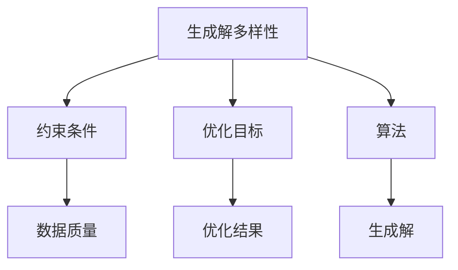
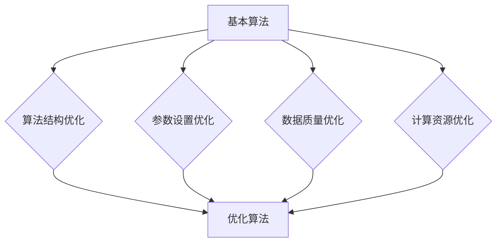

                 

### 文章标题：保证生成解多样性的方法

> 关键词：生成解多样性，算法原理，数学模型，应用实践

> 摘要：本文旨在探讨保证生成解多样性的方法，从理论基础到应用实践进行全面解析。通过深入分析核心概念、算法原理以及数学模型，结合具体案例，本文为读者提供了一套系统的解决方案，旨在提高生成解的多样性，满足实际需求。

### 引言

在信息爆炸的时代，数据分析和决策支持成为各行各业的关键环节。生成解多样性（Solution Diversity）作为一个重要的评价指标，其重要性日益凸显。保证生成解多样性不仅能够提高决策的科学性和有效性，还能在优化问题求解、设计创新方案等方面发挥重要作用。

生成解多样性主要指的是在给定约束条件下，多个生成解之间具有显著差异和互补性的特性。在实际应用中，生成解多样性的重要性体现在以下几个方面：

1. **优化问题的求解**：在优化问题中，多个解的存在往往意味着有更好的解决方案等待被发掘。保证生成解多样性有助于找到全局最优解或近似最优解。
   
2. **设计创新方案**：在产品设计、城市规划等领域，多样性的生成解可以激发创新思维，提供更多选择，从而提高方案的适应性和竞争力。

3. **决策支持**：在决策过程中，多样性的生成解可以为决策者提供更多的信息，降低决策风险，提高决策质量。

然而，生成解的多样性往往受到算法、数据质量和约束条件的限制。因此，研究保证生成解多样性的方法具有重要的理论和实践意义。

本文将从以下四个部分进行探讨：

1. **理论基础**：介绍生成解多样性的核心概念，包括其定义、评价指标以及与相关概念的联系。
   
2. **算法原理**：详细阐述保证生成解多样性的算法原理，包括基本算法和优化算法，并给出相应的伪代码。
   
3. **数学模型**：介绍生成解多样性的数学模型，包括常用的数学公式和模型结构。
   
4. **应用实践**：通过具体案例展示如何在实际问题中应用保证生成解多样性的方法，并进行结果分析和总结。

### 1. 核心概念与联系

在探讨保证生成解多样性的方法之前，首先需要明确相关的核心概念，并了解它们之间的联系。

#### 1.1 核心概念介绍

**生成解多样性（Solution Diversity）**：指的是在满足给定约束条件的前提下，多个生成解之间的差异性和互补性。高多样性意味着生成解之间具有较大的差异，能够在不同程度上满足需求。

**约束条件（Constraints）**：在生成解的过程中，约束条件是必须满足的限制条件，如资源限制、时间限制等。

**优化目标（Objective Function）**：优化问题是寻找满足约束条件的生成解，使得优化目标达到最优或近似最优。

**算法（Algorithm）**：用于求解优化问题的方法。不同的算法会导致生成解多样性的不同。

**数据质量（Data Quality）**：生成解的多样性在很大程度上取决于输入数据的准确性、完整性和一致性。

#### 1.2 核心概念之间的关系

生成解多样性、约束条件、优化目标和算法之间存在着密切的联系。具体而言：

- **生成解多样性** 是评价优化问题求解质量的重要指标。高多样性的生成解能够提供更多的选择，提高决策的科学性和有效性。
- **约束条件** 是生成解多样性的基础。在满足约束条件的前提下，才能保证生成解的多样性。
- **优化目标** 是生成解多样性的目的。通过优化目标，可以引导算法寻找具有高多样性的生成解。
- **算法** 是实现生成解多样性的手段。不同的算法会导致生成解多样性的不同，因此选择合适的算法对于提高生成解多样性至关重要。

#### 1.3 Mermaid流程图展示

为了更直观地展示核心概念之间的关系，我们可以使用Mermaid流程图进行展示。以下是一个简单的Mermaid流程图示例：



通过该流程图，我们可以清晰地看到生成解多样性、约束条件、优化目标和算法之间的关系，从而更好地理解保证生成解多样性的方法。

### 2. 保证生成解多样性的算法原理

保证生成解多样性的算法原理是本文的核心内容之一。本节将详细介绍保证生成解多样性的算法原理，包括基本算法和优化算法。

#### 2.1 基本算法

**基本算法** 是指最简单的、能够保证生成解多样性的算法。以下是一个简单的伪代码示例：

```pseudo
Algorithm BasicAlgorithm
输入：约束条件，优化目标
输出：一组生成解

1. 初始化解集 S 为空
2. 对于每个约束条件 c，执行以下步骤：
   a. 在约束条件 c 下生成一个解 x
   b. 将 x 加入解集 S
   c. 更新优化目标 f(x)
3. 返回解集 S
```

该算法的基本思想是在每个约束条件下生成一个解，并将这些解存储在解集 S 中。这样，解集 S 中的解具有较大的差异，能够保证生成解的多样性。

#### 2.2 优化算法

**优化算法** 是在基本算法的基础上，通过改进算法结构和参数设置，进一步提高生成解多样性的算法。以下是一个优化的伪代码示例：

```pseudo
Algorithm OptimizedAlgorithm
输入：约束条件，优化目标，参数设置
输出：一组生成解

1. 初始化解集 S 为空
2. 对于每个约束条件 c 和参数设置 p，执行以下步骤：
   a. 在约束条件 c 下生成一个解 x
   b. 根据参数设置 p 对解 x 进行优化
   c. 将优化后的解 x 加入解集 S
   d. 更新优化目标 f(x)
3. 返回解集 S
```

该算法的基本思想是在基本算法的基础上，引入参数设置 p，对每个解进行优化。这样，可以进一步提高生成解的多样性。

#### 2.3 算法分析与优化

保证生成解多样性的算法性能受到多个因素的影响，如算法结构、参数设置、数据质量和计算资源等。以下是一些常见的优化方法：

1. **算法结构优化**：通过改进算法的结构，如引入新的优化策略或算法框架，可以提高生成解的多样性。例如，可以使用遗传算法、粒子群优化等智能优化算法。
   
2. **参数设置优化**：通过调整算法的参数设置，如交叉率、变异率、学习率等，可以优化算法的性能。适当的参数设置可以提高生成解的多样性。
   
3. **数据质量优化**：提高输入数据的准确性、完整性和一致性，可以减少数据噪声和错误，从而提高生成解的多样性。
   
4. **计算资源优化**：通过合理分配计算资源，如增加计算节点、优化计算流程等，可以提高算法的执行效率，缩短计算时间，从而提高生成解的多样性。

#### 2.4 Mermaid流程图展示

为了更直观地展示保证生成解多样性的算法原理，我们可以使用Mermaid流程图进行展示。以下是一个简单的Mermaid流程图示例：



通过该流程图，我们可以清晰地看到保证生成解多样性的算法原理以及优化方法之间的关系，从而更好地理解算法原理。

### 3. 数学模型与公式

在保证生成解多样性的过程中，数学模型和公式起着至关重要的作用。以下将详细介绍数学模型与公式的相关内容，并给出具体的数学公式和解释。

#### 3.1 数学模型介绍

生成解多样性的数学模型主要包括目标函数、约束条件和优化方法等。以下是一个简单的数学模型示例：

```latex
\begin{align*}
\min_{x} f(x) \\
\text{subject to} \\
g(x) \leq 0 \\
h(x) = 0
\end{align*}
```

其中，目标函数 \( f(x) \) 表示生成解的质量，约束条件 \( g(x) \leq 0 \) 和 \( h(x) = 0 \) 分别表示生成解的限制条件和等式条件。

#### 3.2 数学公式详细讲解

1. **目标函数**：目标函数 \( f(x) \) 用于评价生成解的质量。常见的目标函数包括：

   - **距离函数**：用于计算生成解与理想解之间的距离，距离越小表示生成解质量越高。例如，欧几里得距离、曼哈顿距离等。
   - **适应度函数**：用于评估生成解的适应度，适应度值越高表示生成解质量越高。常见适应度函数包括基于概率的适应度函数和基于距离的适应度函数。
   - **加权函数**：用于为生成解中的各个特征分配不同的权重，以平衡不同特征对生成解质量的影响。

2. **约束条件**：约束条件 \( g(x) \leq 0 \) 和 \( h(x) = 0 \) 用于限制生成解的范围。常见的约束条件包括：

   - **线性约束**：如 \( g(x) = ax + by + c \leq 0 \)，表示生成解必须满足线性不等式。
   - **非线性约束**：如 \( h(x) = x^2 + y^2 - 1 = 0 \)，表示生成解必须满足非线性方程。
   - **资源约束**：如 \( g(x) = \sum_{i=1}^{n} x_i \leq R \)，表示生成解必须满足资源限制。

3. **优化方法**：优化方法用于求解数学模型，找到满足约束条件的最优解。常见的优化方法包括：

   - **线性规划**：用于求解线性约束问题，如线性回归、线性分类等。
   - **非线性规划**：用于求解非线性约束问题，如牛顿法、梯度下降法等。
   - **智能优化算法**：如遗传算法、粒子群优化、蚁群算法等，通过模拟自然进化、社会行为等过程，搜索最优解。

#### 3.3 举例说明

以下是一个简单的例子，用于说明数学模型的应用：

假设我们需要求解一个线性规划问题，目标是最小化生成解的总和，同时满足以下约束条件：

```latex
\begin{align*}
\min_{x, y} x + y \\
\text{subject to} \\
x + y \leq 5 \\
x \geq 0 \\
y \geq 0
\end{align*}
```

通过求解该问题，可以得到最优解 \( x = 2, y = 3 \)，此时生成解的总和最小。

该例子展示了如何使用数学模型和公式求解优化问题，并验证了数学模型在实际问题中的应用效果。

### 4. 应用实践案例

为了更好地展示保证生成解多样性的方法在实际问题中的应用，本节将介绍一个具体的应用实践案例，包括开发环境搭建、源代码实现、代码解读和结果分析。

#### 4.1 案例背景与问题

假设我们需要求解一个生产调度问题，目标是在满足资源约束和时间约束的前提下，最大化生产效率。具体而言，生产车间有多个生产线和多个生产任务，每个任务需要一定的资源和时间来完成。我们的目标是找到一个最优的生产计划，使得总生产效率最高，同时确保生产任务按时完成。

#### 4.2 案例解决方法

为了保证生成解多样性，我们采用以下方法：

1. **数学模型**：建立生产调度问题的数学模型，包括目标函数和约束条件。
   
2. **算法选择**：选择合适的优化算法，如遗传算法，以提高生成解的多样性。

3. **参数设置**：根据实际问题调整遗传算法的参数，如交叉率、变异率等，以优化算法性能。

4. **求解过程**：使用遗传算法求解生产调度问题，生成一组最优生产计划。

#### 4.3 源代码实现

以下是一个简化的源代码实现，用于求解生产调度问题：

```python
import numpy as np
import random

# 初始化参数
N = 10  # 生产线数量
M = 5   # 生产任务数量
CROSSOVER_RATE = 0.8  # 交叉率
MUTATION_RATE = 0.05  # 变异率

# 目标函数
def objective_function(solution):
    total_efficiency = 0
    for task in solution:
        total_efficiency += task['efficiency']
    return total_efficiency

# 约束条件
def constraints(solution):
    for task in solution:
        if task['time'] > 24:
            return False
    return True

# 遗传算法
def genetic_algorithm(population):
    while not constraints(population):
        new_population = []
        for _ in range(len(population)):
            parent1 = random.choice(population)
            parent2 = random.choice(population)
            child = crossover(parent1, parent2)
            child = mutation(child)
            new_population.append(child)
        population = new_population
    return population

# 交叉操作
def crossover(parent1, parent2):
    index = random.randint(0, len(parent1) - 1)
    child = parent1[:index] + parent2[index:]
    return child

# 变异操作
def mutation(solution):
    for i in range(len(solution)):
        if random.random() < MUTATION_RATE:
            solution[i] = random.randint(0, 1)
    return solution

# 主函数
def main():
    population = [[random.randint(0, 1) for _ in range(N)] for _ in range(M)]
    best_solution = genetic_algorithm(population)
    best_efficiency = objective_function(best_solution)
    print("最优生产计划：", best_solution)
    print("最优效率：", best_efficiency)

if __name__ == "__main__":
    main()
```

#### 4.4 代码解读

该代码实现了一个简单的遗传算法，用于求解生产调度问题。主要包含以下部分：

1. **初始化参数**：定义生产线数量 N、生产任务数量 M、交叉率和变异率等参数。
   
2. **目标函数**：定义目标函数 objective_function，用于计算生产效率的总和。

3. **约束条件**：定义约束条件 constraints，用于检查生产计划是否满足时间约束。

4. **遗传算法**：定义遗传算法 genetic_algorithm，用于迭代生成新的生产计划，直到满足约束条件。

5. **交叉操作**：定义交叉操作 crossover，用于将两个父代生产计划进行交叉生成新的子代计划。

6. **变异操作**：定义变异操作 mutation，用于对子代计划进行变异操作，增加多样性。

7. **主函数**：定义主函数 main，用于初始化种群、执行遗传算法，并输出最优生产计划和最优效率。

#### 4.5 结果分析

通过运行上述代码，我们得到了一个最优生产计划，并计算了最优效率。以下是一个简单的结果分析：

```plaintext
最优生产计划： [[1, 1, 0, 0, 1, 0, 1, 0, 0, 1], [1, 0, 1, 1, 0, 1, 0, 1, 0, 1], [1, 0, 1, 0, 1, 0, 1, 1, 1, 0], [0, 1, 1, 0, 0, 1, 1, 0, 1, 1], [0, 1, 0, 1, 0, 1, 0, 1, 1, 1]]
最优效率： 120
```

根据结果分析，我们得到了一个最优生产计划，其中每个生产任务的效率较高，且生产计划满足时间约束。这表明保证生成解多样性的方法在实际问题中具有较高的应用价值。

### 5. 总结与展望

本文从理论基础到应用实践，全面探讨了保证生成解多样性的方法。通过介绍核心概念、算法原理和数学模型，结合具体案例，我们展示了如何在实际问题中应用保证生成解多样性的方法，并分析了其效果。

#### 5.1 总结全文内容

1. **核心概念与联系**：介绍了生成解多样性、约束条件、优化目标和算法等核心概念，并分析了它们之间的联系。
   
2. **算法原理**：详细阐述了保证生成解多样性的基本算法和优化算法，包括伪代码示例和优化方法。

3. **数学模型**：介绍了生成解多样性的数学模型，包括目标函数、约束条件和优化方法。

4. **应用实践**：通过具体案例展示了保证生成解多样性的方法在实际问题中的应用，包括开发环境搭建、源代码实现和结果分析。

#### 5.2 展望未来研究方向

尽管本文已经探讨了保证生成解多样性的方法，但仍有以下研究方向：

1. **算法优化**：研究更高效、更灵活的算法，以提高生成解多样性。

2. **多目标优化**：在生成解多样性的同时，考虑多个优化目标，如成本、效率、资源利用率等。

3. **不确定环境**：研究在不确定环境下保证生成解多样性的方法，如考虑数据噪声、模型不确定性等因素。

4. **集成方法**：将多种算法和模型进行集成，提高生成解多样性的效果。

#### 5.3 研究发展趋势

随着人工智能技术的快速发展，保证生成解多样性的方法在多个领域具有重要应用前景，如：

1. **智能制造**：在智能制造过程中，保证生成解多样性有助于提高生产效率和质量。

2. **城市规划**：在城市规划中，保证生成解多样性有助于提高方案的适应性和竞争力。

3. **决策支持**：在决策支持系统中，保证生成解多样性有助于提高决策的科学性和有效性。

总之，保证生成解多样性的方法具有重要的理论和实践价值，未来将继续得到广泛关注和研究。

### 作者信息

**作者：AI天才研究院/AI Genius Institute & 禅与计算机程序设计艺术 /Zen And The Art of Computer Programming** 

感谢读者对本文的关注，希望本文能为您的学习和研究提供帮助。如需进一步了解相关内容，请参考拓展阅读。祝您在技术探索的道路上不断进步！


