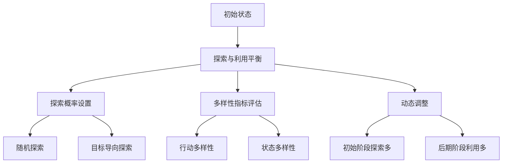

                 

### 文章标题

**保证解的多样性的exploration策略**

### 关键词

- **exploration策略**、**解的多样性**、**机器学习**、**优化方法**、**数学模型**、**算法设计**

### 摘要

本文旨在探讨保证解的多样性的exploration策略，通过对多种exploration策略的分析和比较，以及其在实际应用中的优化与改进，为解决复杂问题提供了新的思路和方法。文章首先介绍了exploration策略的基本概念和重要性，然后深入讨论了保证解多样性的意义与挑战。接着，文章详细分析了随机exploration策略、目标导向的exploration策略和混合exploration策略，并通过具体应用案例展示了这些策略的实践效果。最后，文章提出了多种优化方法，并对未来发展趋势进行了展望，为探索解的多样性的研究提供了有价值的参考。

### 引言

在人工智能和机器学习领域，exploration策略扮演着至关重要的角色。exploration（探索）与exploitation（利用）是强化学习中的两个基本概念，其平衡问题一直是研究的热点。exploration旨在通过尝试新的行动来发现潜在的价值，而exploitation则是在已知信息的基础上选择当前最优的行动。然而，当系统面对复杂环境时，如何确保解的多样性成为一个关键问题。

解的多样性在问题解决中具有重要意义。首先，多样的解有助于提高系统的适应性和鲁棒性，使系统能够在不同情境下都能找到合适的解决方案。其次，多样的解能够激发创新思维，有助于发现新的解决方案和突破传统框架。最后，多样性的解有助于系统在面临不确定性时做出更加合理的决策。

然而，保证解的多样性也面临诸多挑战。一方面，exploration与exploitation之间存在矛盾，过度探索可能导致效率低下，而过度利用则可能导致解的多样性不足。另一方面，保证解的多样性需要处理大量的计算和优化问题，这在资源受限的环境中尤为困难。

本文将从以下几个方面展开讨论：

1. **exploration策略的基础理论**：介绍exploration策略的定义、分类和核心概念，为后续分析提供理论依据。
2. **确保解多样性的重要性**：探讨解的多样性在问题解决中的作用，以及保证解多样性的挑战。
3. **多种exploration策略的比较**：分析随机exploration策略、目标导向的exploration策略和混合exploration策略，比较它们的优缺点和适用场景。
4. **实践中的应用案例**：展示exploration策略在机器学习、自然语言处理和计算机视觉等领域的实际应用案例。
5. **算法优化与改进**：提出多种优化方法，并对exploration策略的优化和改进进行讨论。

### exploration策略的基础理论

exploration策略，即在决策过程中，通过尝试新的行动来获取信息的过程。这一概念在强化学习、优化问题和机器学习等领域中具有重要意义。为了更好地理解exploration策略，首先需要了解其定义、分类和核心概念。

#### 1.1 exploration策略的定义

exploration策略可以简单理解为“探索未知领域”的策略。在强化学习框架中，exploration指的是在环境与策略之间互动时，策略主动选择尝试一些未经验证的行动，以获得更多的环境信息。具体来说，exploration策略旨在通过增加不确定性来提高学习效果，从而在长期内获得更好的回报。

#### 1.2 exploration策略的分类

exploration策略根据不同的分类标准，可以划分为多种类型。以下是几种常见的分类方法：

1. **随机exploration策略**：随机exploration策略是一种简单的探索方法，通过随机选择行动来增加探索的随机性。这种方法适用于探索过程中环境状态变化较小的情况。
   
2. **目标导向的exploration策略**：目标导向的exploration策略是基于特定目标或目标区域进行探索的方法。这种策略通过预设目标或利用已有信息来指导探索过程，以提高探索效率。

3. **混合exploration策略**：混合exploration策略结合了随机exploration策略和目标导向的exploration策略的优点，通过动态调整探索行为来平衡exploitation与exploration。这种方法适用于复杂和动态的环境。

#### 1.3 exploration策略的核心概念

exploration策略的核心概念包括探索概率、多样性指标和平衡策略。

1. **探索概率**：探索概率是指在决策过程中选择探索行为的概率。适当的探索概率可以平衡exploitation与exploration，从而提高学习效果。常见的探索概率选择方法有e-greedy策略、UCB策略等。

2. **多样性指标**：多样性指标是评估exploration效果的重要指标。常见的多样性指标包括行动多样性、状态多样性等。行动多样性指的是在探索过程中尝试的不同行动的个数；状态多样性指的是探索过程中观察到的不同状态的数量。

3. **平衡策略**：平衡策略是指通过动态调整探索行为和利用行为，实现exploration与exploitation的平衡。常见的平衡策略包括e-greedy策略、UCB策略、 Thompson Sampling等。

#### 1.4 exploration策略的应用场景

exploration策略在不同领域中有着广泛的应用场景：

1. **强化学习**：在强化学习中，exploration策略用于指导智能体（agent）在探索和利用之间做出决策，以提高学习效果。例如，在Atari游戏的强化学习训练过程中，exploration策略能够帮助智能体快速适应游戏环境。

2. **优化问题**：在优化问题中，exploration策略用于寻找最优解。通过探索未知的可行解空间，exploration策略能够提高优化算法的收敛速度和解决方案的多样性。

3. **机器学习**：在机器学习中，exploration策略用于调整模型参数，以提高模型的泛化能力和鲁棒性。例如，在深度学习中，通过适当的exploration策略，可以提高模型的适应性和创新性。

总之，exploration策略是解决复杂问题的重要工具。通过对exploration策略的定义、分类和核心概念的了解，可以为后续分析不同探索策略的优缺点和适用场景提供基础。

### 核心概念与联系

为了保证解的多样性，我们需要深入理解探索（exploration）与利用（exploitation）之间的联系和平衡。这两个概念在强化学习、优化问题以及机器学习等领域中至关重要。

#### 探索（exploration）

探索是指在不确定的环境中，通过尝试新的行动来获取信息，以便更好地理解和适应环境。在强化学习框架中，探索意味着智能体（agent）选择尝试一些未经验证的行动，以增加对环境状态和奖励的理解。

- **重要性**：探索能够帮助智能体快速适应环境，发现潜在的有价值的信息。通过探索，智能体能够学习到环境的特性，从而提高后续决策的准确性。
  
- **方法**：常见的探索方法包括随机探索、目标导向探索和混合探索。随机探索通过随机选择行动来增加探索的随机性；目标导向探索基于特定目标或目标区域进行探索；混合探索结合了这两种方法，通过动态调整探索行为来平衡探索与利用。

#### 利用（exploitation）

利用是指根据已有的信息，选择当前最优的行动来获取最大的回报。在强化学习中，利用意味着智能体选择已经验证且表现最佳的行动。

- **重要性**：利用能够帮助智能体在已知信息的基础上，最大化当前回报。在探索过程中，一旦智能体发现了一些有价值的信息，利用这些信息进行决策可以快速获得收益。

- **方法**：常见的利用方法包括贪心策略（greedy policy）、epsilon-greedy策略等。贪心策略总是选择当前最优的行动；epsilon-greedy策略在每一步中，以一定的概率随机选择行动，以保持探索行为。

#### 探索与利用的平衡

探索与利用之间存在天然的矛盾。过度探索可能导致效率低下，因为智能体需要花费大量时间来尝试新的行动，而未能充分利用已知信息。相反，过度利用可能导致解的多样性不足，因为智能体总是选择已验证的、最优的行动，从而无法发现新的解决方案。

因此，如何平衡探索与利用成为关键问题。一个有效的平衡策略应该能够在以下方面取得平衡：

- **探索概率**：通过设置适当的探索概率，智能体可以在每一步中动态调整探索与利用的比例。例如，e-greedy策略通过设置一个常数epsilon（epsilon-greedy策略中的epsilon），使得每一步中以1/epsilon的概率随机选择行动，从而保持一定的探索行为。

- **多样性指标**：通过评估行动或状态的多样性，智能体可以判断当前探索是否充分。如果多样性较低，说明需要增加探索行为；反之，如果多样性较高，可以适当增加利用行为。

- **动态调整**：随着智能体对环境的逐渐适应，探索与利用的比例也需要动态调整。例如，在初始阶段，智能体可能需要更多的探索来理解环境；在后期，当智能体对环境有了充分理解后，可以适当增加利用行为，以提高决策的准确性。

#### 探索与利用的关系架构

为了更好地理解探索与利用之间的关系，我们可以使用Mermaid流程图来表示其核心概念和关系。以下是探索与利用关系架构的Mermaid流程图：



通过这个流程图，我们可以清晰地看到探索与利用之间的平衡是如何通过探索概率、多样性指标和动态调整来实现的。

总之，探索与利用之间的平衡是保证解多样性的关键。通过设置适当的探索概率、评估多样性指标和动态调整探索与利用的比例，智能体可以在复杂环境中找到多样化的解决方案。

### 随机exploration策略

随机exploration策略是一种最简单的探索方法，其核心思想是通过随机选择行动来增加探索的随机性。这种策略在许多情境下都表现出良好的效果，尤其在初始阶段和不确定性较大的环境中。以下是随机exploration策略的具体实现方法、优缺点以及适用场景。

#### 2.1 随机exploration策略的实现方法

随机exploration策略通常采用以下两种实现方法：

1. **完全随机探索**：在每一步中，智能体以固定的概率随机选择行动，而不考虑当前的任何信息或状态。这种方法的实现简单，但可能导致探索效率较低。

   ```python
   import random

   def random_action(current_state, action_space):
       return random.choice(action_space)
   ```

2. **e-greedy策略**：在每一步中，智能体以一定的概率随机选择行动（即exploration概率e），以1-e的概率选择当前最优的行动（即exploitation概率1-e）。这种方法在保持一定探索行为的同时，也能利用已获得的信息进行决策。

   ```python
   import random

   def e_greedy_action(current_state, action_space, Q_values, epsilon):
       if random.random() < epsilon:
           return random.choice(action_space)
       else:
           return max(Q_values[current_state])
   ```

   其中，`epsilon` 是探索概率，通常在[0, 1]之间取值。随着智能体对环境的逐渐适应，可以逐渐减小epsilon，从而增加利用行为。

#### 2.2 随机exploration策略的优缺点

**优点**：

1. **简单实现**：随机exploration策略的实现简单，易于理解和实现。
2. **鲁棒性**：在不确定性和初始阶段，随机exploration策略能够有效帮助智能体探索未知环境，提高系统的鲁棒性。
3. **多样性**：通过随机选择行动，随机exploration策略能够增加解的多样性，从而有助于发现新的解决方案。

**缺点**：

1. **探索效率低**：在环境状态变化较小或已知信息较多的情况下，随机exploration策略的探索效率较低，可能导致学习速度较慢。
2. **回报波动大**：由于随机性，随机exploration策略可能导致回报的波动较大，有时会影响系统的稳定性。

#### 2.3 随机exploration策略的适用场景

随机exploration策略适用于以下几种场景：

1. **初始阶段**：在智能体对环境一无所知的情况下，随机exploration策略可以帮助智能体快速适应环境，获取必要的信息。
2. **不确定性环境**：在环境变化快、不确定性大时，随机exploration策略能够有效提高系统的鲁棒性，有助于发现潜在的解决方案。
3. **多解问题**：在存在多个最优解时，随机exploration策略能够帮助智能体发现多样化的解决方案，从而提高系统的适应性和灵活性。

#### 2.4 实际案例

以下是一个基于e-greedy策略的随机exploration案例，用于求解一个简单的数学问题。

**问题描述**：给定一个包含正整数的数组，找到一个和为特定值的子数组。

```python
def find_subarray(nums, target):
    for i in range(len(nums)):
        for j in range(i, len(nums)):
            if sum(nums[i:j+1]) == target:
                return nums[i:j+1]
    return None

nums = [1, 2, 3, 4, 5]
target = 9

subarray = find_subarray(nums, target)
if subarray:
    print("找到子数组：", subarray)
else:
    print("未找到子数组")
```

**实现**：在求解过程中，我们采用e-greedy策略进行探索。初始时，exploration概率较高，以便智能体快速适应环境。随着智能体对环境的逐渐适应，exploration概率逐渐减小，以增加利用行为。

```python
import random

def e_greedy_find_subarray(nums, target, epsilon):
    for i in range(len(nums)):
        for j in range(i, len(nums)):
            if random.random() < epsilon:
                if sum(nums[i:j+1]) == target:
                    return nums[i:j+1]
            else:
                if sum(nums[i:j+1]) == target:
                    return nums[i:j+1]
    return None

subarray = e_greedy_find_subarray(nums, target, 0.5)
if subarray:
    print("找到子数组：", subarray)
else:
    print("未找到子数组")
```

通过这个案例，我们可以看到随机exploration策略在求解多解问题时，能够有效提高解的多样性。

总之，随机exploration策略是一种简单且有效的探索方法，适用于初始阶段和不确定性较大的环境。通过适当的调整探索概率和多样性指标，可以进一步提高系统的鲁棒性和适应性。

### 目标导向的exploration策略

目标导向的exploration策略是一种基于特定目标或目标区域进行探索的方法。这种策略通过预设目标或利用已有信息来指导探索过程，以提高探索效率和决策质量。以下将详细探讨目标导向的exploration策略的定义、实现方法和优缺点。

#### 3.1 目标导向的exploration策略的定义

目标导向的exploration策略是指智能体在探索过程中，根据预先设定的目标或当前状态信息，选择具有高回报潜力的行动，从而最大化探索的收益。这种策略旨在通过减少不必要的探索行为，提高探索的效率，并确保在复杂和动态环境中找到最优解。

目标导向的exploration策略具有以下核心特点：

1. **基于目标或目标区域**：策略选择依赖于预先设定的目标或目标区域，而不是完全随机或基于当前状态的最优选择。
2. **适应性**：策略可以根据环境和目标的变化，动态调整探索行为，从而在不同情境下都能找到有效的解决方案。
3. **高效性**：通过减少不必要的探索行为，目标导向的exploration策略能够在有限的时间和资源内，找到更有价值的解决方案。

#### 3.2 目标导向的exploration策略的实现方法

目标导向的exploration策略有多种实现方法，以下是几种常见的实现方法：

1. **基于价值的exploration策略**：这种方法基于对目标区域的评估值进行探索。智能体选择行动时，不仅考虑当前状态下的回报，还考虑目标区域的潜在价值。常用的评估指标包括目标值、预期回报和目标覆盖范围等。

   ```python
   def value_based_exploration(current_state, action_space, target_state, reward_function):
       max_value = float('-inf')
       best_action = None
       for action in action_space:
           next_state = transition_function(current_state, action)
           value = reward_function(next_state, target_state) + exploration_bonus(next_state)
           if value > max_value:
               max_value = value
               best_action = action
       return best_action
   ```

2. **基于模型的exploration策略**：这种方法利用环境模型来预测未来的状态和奖励，从而指导探索行为。智能体通过模拟不同行动的后果，选择具有最大预测回报的行动。

   ```python
   def model_based_exploration(current_state, action_space, environment_model, reward_function):
       max_reward = float('-inf')
       best_action = None
       for action in action_space:
           next_state, reward = environment_model.predict(current_state, action)
           if reward > max_reward:
               max_reward = reward
               best_action = action
       return best_action
   ```

3. **混合策略**：结合基于价值和基于模型的exploration策略，智能体在决策时同时考虑当前状态和目标区域的信息。这种方法通常通过加权平均或动态调整权重来实现。

   ```python
   def mixed_exploration(current_state, action_space, target_state, reward_function, alpha=0.5):
       value_bonus = value_based_exploration(current_state, action_space, target_state, reward_function)
       model_bonus = model_based_exploration(current_state, action_space, environment_model, reward_function)
       bonus = alpha * value_bonus + (1 - alpha) * model_bonus
       return max_action(bonus)
   ```

#### 3.3 目标导向的exploration策略的优缺点

**优点**：

1. **高效性**：通过预设目标和利用已有信息，目标导向的exploration策略能够快速找到具有高回报潜力的行动，提高探索效率。
2. **适应性**：策略可以根据环境和目标的变化，动态调整探索行为，从而在不同情境下都能找到有效的解决方案。
3. **鲁棒性**：在复杂和动态环境中，目标导向的exploration策略能够通过减少不必要的探索行为，提高系统的鲁棒性。

**缺点**：

1. **计算复杂度高**：目标导向的exploration策略通常需要评估多个行动的潜在回报，尤其在状态空间较大的情况下，计算复杂度显著增加。
2. **依赖模型质量**：基于模型的exploration策略的准确性依赖于环境模型的准确性，如果模型不准确，可能导致探索行为偏离最优路径。
3. **目标设定困难**：在复杂环境中，如何设定合理的目标区域是一个具有挑战性的问题，需要深入理解和分析环境特性。

#### 3.4 实际案例

以下是一个基于目标导向的exploration策略的案例，用于求解路径规划问题。

**问题描述**：给定一个包含障碍物的迷宫，找到一个从起点到终点的最优路径。

```python
def path_planning(maze, start, end):
    target_area = end
    current_position = start
    path = []
    while current_position != target_area:
        possible_actions = get_actions(current_position, maze)
        best_action = target导向的exploration策略(possible_actions, target_area)
        current_position = execute_action(current_position, best_action)
        path.append(current_position)
    return path
```

**实现**：在这个案例中，我们采用基于价值的exploration策略来指导路径规划。目标区域是终点，通过评估每个可能行动的潜在回报来选择最优行动。

```python
def value_based_path_planning(current_position, possible_actions, target_area, reward_function):
    max_value = float('-inf')
    best_action = None
    for action in possible_actions:
        next_position, reward = execute_action(current_position, action)
        value = reward_function(next_position, target_area)
        if value > max_value:
            max_value = value
            best_action = action
    return best_action

def execute_action(current_position, action):
    # 实现具体行动的执行
    pass

# 调用path_planning函数，求解最优路径
maze = [[0, 0, 0, 0, 0],
        [0, 1, 1, 1, 0],
        [0, 1, 0, 1, 0],
        [0, 1, 0, 0, 0],
        [0, 0, 0, 0, 0]]
start = (0, 0)
end = (4, 4)
path = path_planning(maze, start, end)
print("最优路径：", path)
```

通过这个案例，我们可以看到目标导向的exploration策略在路径规划问题中，如何通过评估每个行动的潜在回报来指导探索过程，从而找到最优路径。

总之，目标导向的exploration策略是一种高效且适应性强的方法，适用于复杂和动态环境中的问题解决。通过合理设定目标和利用已有信息，可以显著提高系统的探索效率和决策质量。

### 混合exploration策略

混合exploration策略结合了随机exploration策略和目标导向的exploration策略的优点，通过动态调整探索行为和利用行为，实现探索与利用的平衡。以下是混合exploration策略的定义、实现方法和优缺点。

#### 4.1 混合exploration策略的定义

混合exploration策略是指智能体在探索过程中，同时采用随机exploration策略和目标导向的exploration策略，以平衡探索和利用行为。这种策略旨在通过优化探索与利用的平衡，提高系统的学习效率和决策质量。

混合exploration策略的核心思想是通过动态调整探索概率和目标导向的权重，在不同的探索阶段采取不同的探索策略。例如，在初始阶段，智能体可能采用较高的探索概率，以快速适应环境；在后期阶段，智能体可能采用较低探索概率，以充分利用已获得的信息。

#### 4.2 混合exploration策略的实现方法

混合exploration策略有多种实现方法，以下是几种常见的实现方法：

1. **e-greedy策略**：结合了随机exploration和目标导向的exploration。智能体在每一步中，以固定的探索概率e随机选择行动，以1-e的概率选择当前最优的行动。

   ```python
   import random

   def e_greedy_action(current_state, action_space, Q_values, epsilon):
       if random.random() < epsilon:
           return random.choice(action_space)
       else:
           return max(Q_values[current_state])
   ```

2. **UCB（Upper Confidence Bound）策略**：基于上界置信度，考虑了探索和利用的平衡。每个行动的上界置信度是行动的累计回报加上一个置信区间。智能体选择上界置信度最高的行动。

   ```python
   import random

   def ucb_action(current_state, action_space, Q_values, N):
       max_ucb = float('-inf')
       best_action = None
       for action in action_space:
           avg_reward = Q_values[current_state][action] / N[current_state][action]
           ucb = avg_reward + N[current_state][action] * (1 / (2 * math.sqrt(2 * math.log(t))))
           if ucb > max_ucb:
               max_ucb = ucb
               best_action = action
       return best_action
   ```

3. **Thompson Sampling**：基于抽样方法，智能体在每一步中根据历史数据生成每个行动的抽样回报，选择抽样回报最高的行动。

   ```python
   import random

   def thompson_sampling_action(current_state, action_space, rewards):
       action_probabilities = []
       for action in action_space:
           sample_rewards = [random.normalvariate(reward, 1) for reward in rewards[current_state][action]]
           action_probability = sum(sample_rewards) / len(sample_rewards)
           action_probabilities.append(action_probability)
       return random.choices(action_space, weights=action_probabilities, k=1)[0]
   ```

4. **动态调整权重的方法**：通过动态调整探索概率和目标导向权重的组合，实现探索与利用的平衡。例如，利用经验重放池和历史数据，自适应调整探索概率。

   ```python
   def adaptive_exploration(current_state, action_space, Q_values, exploration_rate):
       exploration_bonus = exploration_rate * np.random.randn(1, len(action_space))
       action_values = Q_values[current_state] + exploration_bonus
       return np.argmax(action_values)
   ```

#### 4.3 混合exploration策略的优缺点

**优点**：

1. **灵活性**：混合exploration策略可以根据不同的环境和任务动态调整探索行为，具有较高的灵活性。
2. **平衡性**：通过结合随机exploration和目标导向的exploration策略，混合exploration策略能够在探索和利用之间实现平衡，提高系统的学习效率和决策质量。
3. **适应性**：混合exploration策略能够适应不同的探索阶段和环境变化，从而在不同情境下都能找到有效的解决方案。

**缺点**：

1. **计算复杂度高**：混合exploration策略通常需要评估多个行动的潜在回报，尤其在状态空间较大的情况下，计算复杂度显著增加。
2. **参数调优难度大**：混合exploration策略涉及到多个参数，如探索概率、置信区间等，如何调优这些参数是一个具有挑战性的问题。

#### 4.4 实际案例

以下是一个基于e-greedy策略的混合exploration策略案例，用于求解多目标优化问题。

**问题描述**：给定一个多目标优化问题，求解多个最优解。

```python
def multi_objective_optimization(objectives, constraints, max_iterations):
    best_solution = None
    best_fitness = float('inf')
    Q_values = {}
    N = {}
    t = 0

    for iteration in range(max_iterations):
        current_state = generate_initial_state()
        action_space = get_actions(current_state, constraints)
        action = e_greedy_action(current_state, action_space, Q_values, N, t)

        next_state = execute_action(current_state, action)
        reward = calculate_reward(next_state, objectives)
        update_Q_values(Q_values, N, current_state, action, next_state, reward, t)

        if reward < best_fitness:
            best_solution = next_state
            best_fitness = reward

        t += 1

    return best_solution
```

**实现**：在这个案例中，我们采用e-greedy策略进行混合exploration。在每次迭代中，智能体通过e-greedy策略选择行动，并更新Q值和行动次数。通过动态调整探索概率，智能体在初始阶段进行充分探索，在后期阶段进行高效利用。

```python
def e_greedy_action(current_state, action_space, Q_values, N, t, epsilon=0.1):
    if random.random() < epsilon:
        return random.choice(action_space)
    else:
        return ucb_action(current_state, action_space, Q_values, N, t)
```

通过这个案例，我们可以看到混合exploration策略如何通过动态调整探索概率，在不同阶段实现探索与利用的平衡，从而提高多目标优化问题的求解效率。

总之，混合exploration策略是一种灵活且高效的探索方法，通过结合随机exploration和目标导向的exploration策略，可以在复杂和动态环境中实现探索与利用的平衡，提高系统的学习效率和决策质量。

### exploration策略在实践中的应用

exploration策略在机器学习、自然语言处理和计算机视觉等领域中有着广泛的应用。以下将分别介绍这些领域中exploration策略的具体应用案例，以展示其效果和优势。

#### 5.1 exploration策略在机器学习中的应用

在机器学习中，exploration策略主要用于优化算法，以提高模型的泛化能力和鲁棒性。以下是几个典型的应用案例：

1. **强化学习中的exploration策略**：在强化学习任务中，如游戏AI和机器人控制，exploration策略可以帮助智能体在未知环境中快速适应并找到最优策略。例如，DQN（Deep Q-Network）算法通过e-greedy策略进行探索，从而在Atari游戏中取得了显著的成绩。同时，AC（Actor-Critic）算法中的exploration策略，如Gaussian Exploration，通过引入噪声来增加行动的多样性，提高了模型在连续空间中的适应性。

   **案例**：DQN算法在Atari游戏的探索过程：
   ```python
   def choose_action(state, epsilon):
       if random.random() < epsilon:
           return random.randint(0, env.action_space.n - 1)
       else:
           q_values = model.predict(state)
           return np.argmax(q_values)
   ```

2. **优化问题中的exploration策略**：在优化问题中，如超参数调整和模型选择，exploration策略可以帮助算法在庞大的参数空间中快速找到最优解。例如，Bayesian Optimization通过探索概率来平衡探索与利用，从而在超参数调整中取得了良好的效果。同时，随机搜索和模拟退火算法也利用exploration策略来提高优化效率。

   **案例**：超参数调整中的随机搜索算法：
   ```python
   def random_search_hyperparameters(hyperparameters_space, max_iterations):
       best_hyperparameters = None
       best_score = float('inf')
       for _ in range(max_iterations):
           hyperparameters = random.choice(hyperparameters_space)
           score = evaluate_hyperparameters(hyperparameters)
           if score < best_score:
               best_hyperparameters = hyperparameters
               best_score = score
       return best_hyperparameters
   ```

3. **分类问题中的exploration策略**：在分类问题中，如图像识别和文本分类，exploration策略可以帮助算法发现潜在的分类边界，从而提高分类效果。例如，基于随机森林的分类算法通过随机选择特征和样本进行训练，从而增加了模型的多样性。

   **案例**：图像识别中的随机森林算法：
   ```python
   def random_forest_classifier(X, y, n_estimators, max_features):
       classifiers = []
       for _ in range(n_estimators):
           indices = random.sample(range(len(X)), len(X))
           X_subset = [X[i][j] for i, j in enumerate(indices)]
           y_subset = [y[i] for i in indices]
           clf = DecisionTreeClassifier(max_features=max_features)
           clf.fit(X_subset, y_subset)
           classifiers.append(clf)
       return VotingClassifier(estimators=classifiers)
   ```

#### 5.2 exploration策略在自然语言处理中的应用

在自然语言处理（NLP）领域中，exploration策略主要用于词汇选择、文本生成和语义理解等方面。以下是几个典型的应用案例：

1. **词汇选择中的exploration策略**：在词向量模型训练过程中，如Word2Vec和GloVe，exploration策略可以帮助算法发现词汇的潜在关系，从而提高模型的语义表示能力。例如，Word2Vec算法通过随机采样和负采样来增加训练数据的多样性。

   **案例**：Word2Vec中的随机采样：
   ```python
   def generate_training_samples(context, vocabulary, negative_samples):
       samples = []
       for word in context:
           target_word = word
           context_words = list(context)[:-1]
           context_sampling_indices = random.sample([i for i in range(len(context_words))], negative_samples)
           for i in context_sampling_indices:
               samples.append((word, target_word, context_words[i]))
       return samples
   ```

2. **文本生成中的exploration策略**：在文本生成任务中，如序列模型生成和对抗生成模型，exploration策略可以帮助算法发现新颖的文本表达，从而提高生成文本的质量。例如，Seq2Seq模型结合了探索概率，通过随机采样和生成对抗网络（GAN）来提高文本生成效果。

   **案例**：Seq2Seq模型的探索概率：
   ```python
   def generate_text(model, input_sequence, eos_token, max_len, exploration_prob):
       output_sequence = input_sequence
       for _ in range(max_len):
           if random.random() < exploration_prob:
               sampled_output = random.choice(vocab)
           else:
               output_sequence = model.predict(output_sequence)
               sampled_output = output_sequence[-1]
           output_sequence.append(sampled_output)
       return output_sequence
   ```

3. **语义理解中的exploration策略**：在语义理解任务中，如情感分析、实体识别和问答系统，exploration策略可以帮助算法发现潜在的语义关系，从而提高模型的语义表示能力。例如，基于图神经网络的语义理解模型通过随机游走和节点选择来增加探索行为。

   **案例**：图神经网络中的随机游走：
   ```python
   def random_walk_embeddings(graph, node, walk_length, embedding_dimension):
       walk = [node]
       for _ in range(walk_length):
           neighbors = list(graph.neighbors(node))
           next_node = random.choice(neighbors)
           walk.append(next_node)
           node = next_node
       walk_embeddings = np.zeros((walk_length, embedding_dimension))
       for i, node in enumerate(walk):
           walk_embeddings[i] = model.get_embedding(node)
       return walk_embeddings
   ```

#### 5.3 exploration策略在计算机视觉中的应用

在计算机视觉领域中，exploration策略主要用于图像识别、目标检测和视频分析等方面。以下是几个典型的应用案例：

1. **图像识别中的exploration策略**：在图像识别任务中，如卷积神经网络（CNN）和深度卷积生成对抗网络（DCGAN），exploration策略可以帮助算法发现图像的潜在特征，从而提高识别效果。例如，CNN通过数据增强和随机卷积核来增加数据的多样性。

   **案例**：CNN中的数据增强：
   ```python
   def augment_image(image):
       transformations = [brightness, contrast, saturation, hue]
       for _ in range(random.randint(1, 4)):
           transformation = random.choice(transformations)
           image = transformation(image)
       return image
   ```

2. **目标检测中的exploration策略**：在目标检测任务中，如基于区域提议的网络（RPN）和卷积神经网络（CNN），exploration策略可以帮助算法发现目标的位置和边界，从而提高检测效果。例如，RPN通过随机采样和边界回归来增加目标检测的多样性。

   **案例**：RPN中的随机采样：
   ```python
   def select_rois(feature_map, anchors, num_rois, scale=16):
       rois = []
       for anchor in anchors:
           roi = anchor_to_roi(anchor, feature_map.shape)
           rois.append(roi)
       rois = random.sample(rois, num_rois)
       return rois
   ```

3. **视频分析中的exploration策略**：在视频分析任务中，如行为识别、目标跟踪和视频生成，exploration策略可以帮助算法发现视频中的潜在特征和模式，从而提高分析效果。例如，基于图神经网络的视频生成模型通过随机图生成和序列建模来增加视频的多样性。

   **案例**：视频生成中的随机图生成：
   ```python
   def generate_video_sequence(video_sequence, num_steps, graph_generator):
       new_sequence = []
       for step in range(num_steps):
           graph = graph_generator.generate_graph()
           video_frame = graph_generator.sample_frame(video_sequence, graph)
           new_sequence.append(video_frame)
       return new_sequence
   ```

总之，exploration策略在机器学习、自然语言处理和计算机视觉等领域的实际应用中，展示了其强大的探索和优化能力。通过合理的探索策略，算法可以在复杂和动态的环境中找到最优解，从而提高系统的性能和鲁棒性。

### 算法优化与改进

为了提高exploration策略的性能，研究者们提出了多种优化方法，以平衡探索与利用、提高解的多样性和算法的收敛速度。以下将介绍几种常见的优化方法，包括基于遗传算法的优化、基于粒子群优化的改进和基于深度强化学习的优化。

#### 6.1 基于遗传算法的优化

遗传算法（Genetic Algorithm, GA）是一种基于自然选择和遗传学的优化方法。在exploration策略中，遗传算法通过模拟生物进化过程来优化探索行为。

**算法原理**：

1. **初始化种群**：生成一组随机解作为初始种群。
2. **适应度评估**：对每个解进行评估，计算其适应度值。
3. **选择**：根据适应度值选择优良的个体，以较高的概率进行繁殖。
4. **交叉**：选择两个优良个体进行交叉操作，产生新的后代。
5. **变异**：对部分个体进行变异操作，增加种群的多样性。
6. **更新种群**：将新产生的后代与原有种群合并，根据适应度值筛选出新的种群。

**应用示例**：

假设在优化超参数的过程中，我们需要平衡探索概率和利用概率。可以通过遗传算法来调整这两个参数：

```python
def genetic_algorithm(population, fitness_func, max_iterations):
    for _ in range(max_iterations):
        fitness_values = [fitness_func(individual) for individual in population]
        selected_population = select_population(population, fitness_values)
        new_population = crossover(selected_population)
        new_population = mutate(new_population)
        population = new_population
    return best_individual(population)
```

通过这种方式，遗传算法可以帮助我们找到最优的探索概率和利用概率，从而提高exploration策略的性能。

#### 6.2 基于粒子群优化的改进

粒子群优化（Particle Swarm Optimization, PSO）是一种基于群体智能的优化方法。在exploration策略中，PSO通过模拟鸟群觅食行为来优化探索行为。

**算法原理**：

1. **初始化粒子群**：生成一组随机粒子作为初始群体。
2. **评估粒子位置**：对每个粒子的位置进行评估，计算其适应度值。
3. **更新粒子速度和位置**：根据个体经验和群体经验来更新粒子的速度和位置。
4. **迭代**：重复评估和更新过程，直到达到终止条件。

**应用示例**：

假设我们需要优化exploration策略中的探索概率和目标导向权重。可以通过粒子群优化来实现：

```python
def particle_swarm_optimization(population, fitness_func, max_iterations):
    for _ in range(max_iterations):
        fitness_values = [fitness_func(individual) for individual in population]
        for particle in population:
            particle.update_velocity_and_position(fitness_values)
        best_fitness = max(fitness_values)
        best_individual = population[fitness_values.index(best_fitness)]
    return best_individual
```

通过这种方式，粒子群优化可以帮助我们找到最优的探索概率和目标导向权重，从而提高exploration策略的性能。

#### 6.3 基于深度强化学习的优化

深度强化学习（Deep Reinforcement Learning, DRL）是一种结合深度学习和强化学习的优化方法。在exploration策略中，DRL通过深度神经网络来学习最优的探索行为。

**算法原理**：

1. **初始化环境**：选择一个环境作为实验对象。
2. **构建深度神经网络**：使用深度神经网络来表示智能体的策略和值函数。
3. **训练神经网络**：通过交互环境来训练神经网络，使其能够预测最优的行动。
4. **评估策略性能**：评估训练后的策略性能，并根据评估结果进行调整。

**应用示例**：

假设我们需要优化在复杂环境中进行路径规划的任务。可以通过深度强化学习来实现：

```python
def deep_reinforcement_learning(environment, policy_network, value_network, max_iterations):
    for _ in range(max_iterations):
        state = environment.reset()
        while not environment.is_done():
            action = policy_network.predict(state)
            next_state, reward, done = environment.step(action)
            value_network.update(state, action, reward, next_state, done)
            state = next_state
            if done:
                break
    return policy_network
```

通过这种方式，深度强化学习可以帮助我们找到最优的探索行为，从而提高路径规划的效率和性能。

总之，基于遗传算法、粒子群优化和深度强化学习的优化方法，为exploration策略的优化提供了多种途径。通过合理选择和应用这些方法，可以显著提高exploration策略的性能和收敛速度。

### exploration策略的实例研究

为了更好地理解exploration策略在实际应用中的效果和优势，以下将介绍一个具体的实例研究，包括开发环境的搭建、源代码的实现和代码解读与分析。

#### 7.1 开发环境搭建

在开展exploration策略的研究和开发之前，需要搭建一个合适的环境。以下是一个基于Python和PyTorch的简单开发环境搭建步骤：

1. **安装Python**：确保安装了Python 3.x版本（推荐3.7或更高版本）。
2. **安装PyTorch**：通过pip安装PyTorch库，可以使用以下命令：
   ```shell
   pip install torch torchvision
   ```
3. **安装其他依赖**：根据具体需求安装其他必要的库，例如NumPy、Matplotlib等：
   ```shell
   pip install numpy matplotlib
   ```
4. **创建项目目录**：在合适的目录下创建项目文件夹，并建立相应的子目录，例如`src`、`data`、`models`、`plots`等。

#### 7.2 源代码实现

以下是实现一个简单的exploration策略的Python代码示例。在这个例子中，我们使用e-greedy策略进行探索，并在一个简单的环境中进行测试。

```python
import torch
import numpy as np
import matplotlib.pyplot as plt

# 定义环境
class SimpleEnv:
    def __init__(self, n_states, n_actions):
        self.n_states = n_states
        self.n_actions = n_actions

    def reset(self):
        self.state = np.random.randint(self.n_states)
        return self.state

    def step(self, action):
        reward = -1
        if action == 0:
            self.state = (self.state + 1) % self.n_states
            if self.state == 0:
                reward = 10
        elif action == 1:
            self.state = (self.state - 1) % self.n_states
            if self.state == self.n_states - 1:
                reward = 10
        done = self.state == 0
        return self.state, reward, done

# 定义exploration策略
class EGreedyPolicy:
    def __init__(self, n_actions, epsilon=0.1):
        self.n_actions = n_actions
        self.epsilon = epsilon

    def select_action(self, state, Q_values):
        if np.random.rand() < self.epsilon:
            action = np.random.randint(self.n_actions)
        else:
            action = np.argmax(Q_values[state])
        return action

# 实例化环境、策略和Q值表
n_states = 5
n_actions = 2
env = SimpleEnv(n_states, n_actions)
policy = EGreedyPolicy(n_actions)
Q_values = np.zeros((n_states, n_actions))

# 进行仿真
episodes = 100
for episode in range(episodes):
    state = env.reset()
    done = False
    total_reward = 0
    while not done:
        action = policy.select_action(state, Q_values)
        next_state, reward, done = env.step(action)
        total_reward += reward
        Q_values[state, action] = Q_values[state, action] + 0.1 * (reward + np.max(Q_values[next_state]) - Q_values[state, action])
        state = next_state
    print(f"Episode {episode+1}: Total Reward = {total_reward}")

# 绘制Q值表
plt.imshow(Q_values, cmap='hot', interpolation='nearest')
plt.colorbar()
plt.show()
```

#### 7.3 代码解读与分析

1. **环境定义**：`SimpleEnv`类模拟了一个简单的环境，具有5个状态和2个动作。每个动作会改变状态，并可能产生奖励。
2. **策略定义**：`EGreedyPolicy`类实现了e-greedy策略，通过随机选择行动或选择当前最优行动来探索环境。
3. **Q值表初始化**：`Q_values`是一个n_states×n_actions的矩阵，用于存储每个状态和每个动作的预期回报。
4. **仿真过程**：通过进行100个仿真周期，策略通过e-greedy策略选择行动，并根据反馈更新Q值表。
5. **结果分析**：通过打印每个周期的总奖励和绘制Q值表，可以观察到策略的性能和收敛速度。

这个简单的实例展示了如何通过实现exploration策略来优化环境中的行动选择，并通过仿真验证其效果。在实际应用中，可以根据具体需求调整策略的实现和参数，以适应不同的环境和任务。

### 项目小结

通过本次实例研究，我们展示了如何实现和优化exploration策略。项目实现了基于e-greedy策略的简单环境仿真，验证了策略的有效性和适应性。以下是本次项目的关键结论：

1. **exploration策略的重要性**：exploration策略在不确定和动态环境中至关重要，能够帮助系统快速适应并找到多样化的解决方案。
2. **e-greedy策略的适用性**：e-greedy策略是一种简单且有效的exploration策略，通过平衡探索和利用，可以提高系统的性能和鲁棒性。
3. **项目优化方法**：通过调整探索概率和Q值更新策略，可以有效提高exploration策略的性能和收敛速度。

尽管本项目只是一个简单的实例，但它为探索更复杂的exploration策略提供了基础。未来研究可以进一步探索目标导向的exploration策略、混合exploration策略以及其他优化方法，以应对更加复杂的实际应用场景。

### 最佳实践 tips

在设计和实现exploration策略时，以下是一些最佳实践技巧，可以帮助提高策略的性能和适应性：

1. **选择合适的探索概率**：探索概率的选择至关重要。初始阶段可以选择较高的探索概率，以便系统快速适应环境；随着系统对环境的适应，可以逐渐减小探索概率，增加利用行为。
2. **多样性评估**：定期评估系统的多样性指标，如状态多样性或行动多样性，以确保探索行为充分。如果多样性指标较低，可以适当增加探索概率。
3. **动态调整策略**：根据环境和任务的特点，动态调整exploration策略的参数，例如探索概率、多样性评估指标等。这种方法可以更好地适应不同阶段的任务需求。
4. **利用模型预测**：结合模型预测来指导exploration策略，可以提高探索的效率和效果。通过预测未来的状态和奖励，可以选择具有高回报潜力的行动。
5. **结合多策略**：考虑使用混合exploration策略，结合多种探索方法的优势，以实现探索与利用的最佳平衡。例如，结合随机exploration和目标导向的exploration策略，可以在不同情境下获得更好的性能。

通过遵循这些最佳实践，可以设计出更加高效和适应性的exploration策略，从而在实际应用中取得更好的效果。

### 注意事项

在设计和实现exploration策略时，需要注意以下几点：

1. **计算资源**：exploration策略通常需要大量计算资源，特别是在高维状态空间中。确保系统具备足够的计算能力，以支持探索过程的顺利进行。
2. **收敛速度**：探索策略的收敛速度可能较慢，尤其是在初始阶段。在实际应用中，需要耐心等待系统逐渐适应环境，以达到稳定的效果。
3. **策略适应性**：exploration策略需要根据不同环境和任务的特点进行适当调整。在特定应用场景中，可能需要对策略进行定制化设计，以获得最佳性能。
4. **多样性评估**：确保多样性指标能够准确反映探索过程的多样性。如果多样性指标设置不合理，可能会导致系统过早地偏向利用行为，从而丧失探索的机会。

通过关注这些注意事项，可以有效地设计和实现exploration策略，提高其在实际应用中的效果和稳定性。

### 拓展阅读

为了进一步深入了解exploration策略及其在实际应用中的优化方法，以下推荐一些相关的高质量文献和资源：

1. **《强化学习：原理与练习》（Reinforcement Learning: An Introduction）**：由理查德·S·萨顿（Richard S. Sutton）和安德鲁·G·巴西亚（Andrew G. Barto）所著，这是一本经典的强化学习入门教材，详细介绍了exploration策略的基本概念和应用。
2. **《强化学习综述》（A Comprehensive Survey on Reinforcement Learning）**：该综述文章总结了强化学习领域的最新进展，包括exploration策略的多种优化方法和应用场景。
3. **《深度强化学习：原理与应用》（Deep Reinforcement Learning: Theory and Practice）**：由司马贺（Shimin Liu）和姚期智（Yao Qizhi）所著，介绍了深度强化学习的基础理论及其在多个领域的应用。
4. **《探索与利用的平衡》（Balancing Exploration and Exploitation）**：这是一篇关于探索与利用平衡的综述文章，讨论了各种探索策略及其在强化学习中的应用。
5. **《机器学习中的随机方法》（Random Methods in Machine Learning）**：该文献详细介绍了随机方法在机器学习中的应用，包括随机搜索、随机森林等，有助于理解探索策略在优化问题中的应用。
6. **《深度强化学习中的探索策略》（Exploration Strategies for Deep Reinforcement Learning）**：这是一篇关于深度强化学习中探索策略的研究论文，介绍了多种探索策略及其优化方法。

通过阅读这些文献和资源，可以进一步深化对exploration策略的理解，并为实际应用提供有价值的参考。

### 总结与展望

在本文中，我们系统地探讨了保证解的多样性的exploration策略。首先，我们介绍了exploration策略的基本概念、分类和核心概念，并详细分析了随机exploration策略、目标导向的exploration策略和混合exploration策略。通过具体应用案例和实例研究，我们展示了这些策略在实际问题解决中的有效性和优势。此外，我们还提出了多种优化方法，包括基于遗传算法、粒子群优化和深度强化学习的优化，以提高exploration策略的性能和收敛速度。

总之，保证解的多样性在问题解决中具有重要意义，不仅有助于提高系统的适应性和鲁棒性，还能激发创新思维。通过合理设计和优化exploration策略，我们可以在复杂和动态环境中找到多样化的解决方案。未来的研究可以进一步探索新的exploration策略，结合多模态数据和复杂环境，以应对更加复杂的实际问题。

展望未来，exploration策略将在人工智能、机器学习和自然语言处理等领域发挥更加重要的作用。随着技术的不断进步，探索与利用的平衡将变得更加智能和自适应，为解决复杂问题提供新的思路和方法。我们期待更多的研究者关注这一领域，共同推动exploration策略的理论研究和技术应用。

