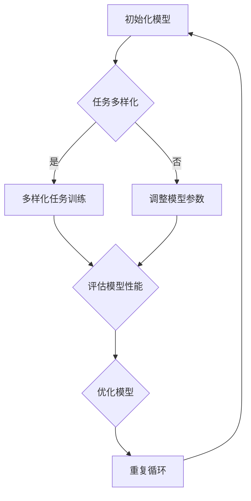

                 

### 文章标题：元学习优化推理模型的域外泛化与迁移能力

---

#### 关键词：
- 元学习
- 推理模型
- 域外泛化
- 迁移能力
- 优化算法

#### 摘要：
本文将深入探讨元学习优化推理模型的域外泛化与迁移能力。首先，我们将介绍元学习的基本理论及其背景，然后详细阐述推理模型的定义与分类。接着，我们会探讨域外泛化与迁移能力的重要性，以及元学习如何通过优化推理模型来实现这一目标。本文还将通过Mermaid流程图展示元学习与推理模型优化之间的关系，并详细讲解核心算法原理和数学模型。最后，我们将通过项目实战展示元学习优化推理模型的实际应用，并提供最佳实践和拓展阅读。

---

### 1. 元学习基础理论

元学习（Meta-Learning），也被称作“学习如何学习”，是一种能够自动获取学习策略的机器学习方法。其核心思想是通过学习如何快速适应新任务，从而提高模型在未知任务上的表现。与传统的任务特定学习相比，元学习具有显著的泛化能力和迁移能力。

#### 1.1 元学习的定义与背景

元学习可以被视为一种“学习如何学习”的方法，它通过在一个多样化的任务集上训练模型，使得模型能够在面对新的任务时快速适应。这种能力在现实世界中具有重要意义，例如在自动驾驶、医疗诊断和游戏AI等领域。

元学习的起源可以追溯到20世纪50年代，当时的人工智能研究主要集中在如何让计算机具备通用问题解决能力。随着深度学习和神经网络技术的不断发展，元学习逐渐成为人工智能研究的一个重要方向。

#### 1.2 元学习的目标与优势

元学习的目标是在各种不同类型的任务上快速学习，并提高模型在未知任务上的泛化能力。其优势主要体现在以下几个方面：

- **快速适应新任务**：元学习模型能够快速适应新的任务，减少对新数据的训练时间。
- **提高泛化能力**：元学习通过在多样化任务上训练，能够提高模型在不同任务上的泛化能力。
- **减少数据需求**：元学习模型可以通过少量数据进行训练，降低对大规模数据集的需求。

#### 1.3 元学习的关键挑战

尽管元学习具有显著的潜在优势，但其实际应用仍然面临一些关键挑战：

- **样本效率**：如何在有限的训练样本下快速适应新任务，是一个重要的研究问题。
- **任务多样化**：如何处理任务之间的多样性，确保模型在不同任务上的表现。
- **算法稳定性**：如何在多样化的任务上保持模型的稳定性和鲁棒性。

为了解决这些挑战，研究者们提出了多种元学习算法，如MAML、Reptile和Model-Agnostic Meta-Learning（MAML）等。

### 2. 推理模型概述

推理模型是机器学习中的一个核心概念，它在给定输入数据的情况下，通过模型参数预测输出结果。推理模型在计算机视觉、自然语言处理和语音识别等领域具有广泛的应用。

#### 2.1 推理模型的定义与作用

推理模型（Inference Model）是一种用于预测输出结果的机器学习模型。它在训练过程中学习到输入与输出之间的映射关系，并在推理阶段使用这一关系来预测新的输入数据。

推理模型的主要作用是：

- **预测**：在给定新的输入数据时，推理模型能够预测出相应的输出结果。
- **评估**：通过推理模型，可以评估模型在测试数据集上的表现。

推理模型的发展经历了从简单的线性模型到复杂的深度神经网络的过程。现代推理模型，如卷积神经网络（CNN）和循环神经网络（RNN），在许多任务上取得了显著的性能提升。

#### 2.2 推理模型的类型与发展

推理模型可以根据其结构和应用场景分为多种类型，主要包括以下几种：

- **线性模型**：如线性回归、逻辑回归等，用于处理线性可分的数据。
- **非线性模型**：如决策树、支持向量机（SVM）等，能够处理非线性数据。
- **深度神经网络**：如卷积神经网络（CNN）、循环神经网络（RNN）等，广泛应用于图像、语音和自然语言处理等领域。

随着深度学习技术的发展，推理模型也在不断演进。近年来，基于注意力机制的模型、生成对抗网络（GAN）和Transformer等新型模型的出现，进一步推动了推理模型的发展。

#### 2.3 推理模型的应用场景

推理模型在计算机视觉、自然语言处理和语音识别等领域具有广泛的应用。以下是一些典型的应用场景：

- **计算机视觉**：图像分类、目标检测、图像生成等。
- **自然语言处理**：文本分类、机器翻译、情感分析等。
- **语音识别**：语音到文本转换、语音合成等。

在这些应用场景中，推理模型通过高效地处理大量数据，实现了自动化和智能化的目标。

### 3. 域外泛化与迁移能力

域外泛化（Out-of-Domain Generalization）和迁移能力（Transfer Learning）是机器学习中两个重要的概念。它们分别代表了模型在不同领域和应用中的表现。

#### 3.1 域外泛化概念与重要性

域外泛化是指模型在未经历训练的领域（即域外）上表现出良好的泛化能力。这一概念在现实世界中具有重要意义，因为许多应用场景中的数据分布往往是多样化的，模型需要能够在不同领域上保持稳定的表现。

域外泛化的重要性主要体现在以下几个方面：

- **减少数据需求**：通过域外泛化，模型可以在少量数据上实现良好表现，减少对大规模数据集的需求。
- **提高模型稳定性**：在多样化数据上训练的模型，能够在不同数据分布下保持稳定。
- **扩展应用场景**：域外泛化使得模型能够应用于更多未经历训练的领域。

#### 3.2 迁移学习能力与机制

迁移学习（Transfer Learning）是一种利用已有模型的知识来提高新任务表现的方法。其核心思想是将一个任务（源任务）上的知识迁移到另一个任务（目标任务）上。

迁移学习的关键机制包括：

- **知识共享**：源任务和目标任务之间存在一定的相似性，模型通过共享知识来提高目标任务的表现。
- **特征提取**：源任务上的特征提取器可以应用于目标任务，从而提高目标任务的泛化能力。

迁移学习的优势在于：

- **提高模型性能**：通过迁移学习，模型可以更快地在新任务上达到性能优化。
- **降低数据需求**：迁移学习可以在少量数据上实现良好表现，降低对大规模数据集的需求。
- **扩展应用领域**：迁移学习使得模型能够应用于更多未经历训练的领域。

#### 3.3 域外泛化与迁移能力的对比

域外泛化和迁移能力都是模型在不同领域上的泛化能力，但它们之间存在一些差异：

- **应用场景**：域外泛化通常应用于未经历训练的领域，而迁移学习则是将知识从源任务迁移到目标任务。
- **数据需求**：域外泛化可以在少量数据上实现，而迁移学习通常需要更多数据。
- **模型稳定性**：域外泛化模型在不同数据分布下保持稳定，而迁移学习模型则依赖于源任务的性能。

总之，域外泛化和迁移能力是机器学习中重要的概念，通过优化推理模型，可以实现更好的域外泛化和迁移能力。

### 4. 元学习优化推理模型

元学习通过优化推理模型，实现了推理模型的域外泛化与迁移能力。在这一部分，我们将详细探讨元学习优化推理模型的原理和方法。

#### 4.1 元学习优化推理模型的原理

元学习优化推理模型的原理可以概括为以下两个方面：

1. **快速适应新任务**：元学习通过在多样化任务上训练，使得模型能够快速适应新的任务。这种快速适应能力体现在模型在少量训练样本上的性能提升。
   
2. **共享知识**：元学习通过在多样化任务上共享知识，使得模型在不同任务上表现出良好的泛化能力。这种知识共享机制使得模型能够在不同领域上保持稳定的表现。

#### 4.2 元学习优化推理模型的方法

元学习优化推理模型的方法可以分为以下几种：

1. **基于模型的方法**：这种方法直接优化模型参数，使得模型能够在多样化任务上表现出良好的泛化能力。常见的模型包括MAML（Model-Agnostic Meta-Learning）和Reptile。

2. **基于算法的方法**：这种方法通过优化算法来提高模型的泛化能力和迁移能力。常见的算法包括梯度下降算法、随机梯度下降算法和Adam优化器。

3. **基于数据的方法**：这种方法通过设计多样化的数据集，使得模型能够在不同数据分布下保持稳定的表现。这种方法通常应用于域外泛化。

#### 4.3 元学习优化推理模型的应用场景

元学习优化推理模型在许多应用场景中具有广泛的应用，包括：

- **计算机视觉**：图像分类、目标检测、图像生成等。
- **自然语言处理**：文本分类、机器翻译、情感分析等。
- **语音识别**：语音到文本转换、语音合成等。

在这些应用场景中，元学习优化推理模型能够显著提高模型的性能和泛化能力，从而实现更好的实际应用效果。

### 5. Mermaid流程图

为了更好地理解元学习优化推理模型的过程，我们使用Mermaid流程图来展示其核心步骤。



这个流程图展示了元学习优化推理模型的主要步骤，包括模型初始化、多样化任务训练、模型性能评估和模型优化。通过循环迭代，模型能够不断优化，从而提高其在多样化任务上的表现。

### 6. 核心算法原理讲解

#### 6.1 MAML算法

MAML（Model-Agnostic Meta-Learning）是一种元学习算法，其核心思想是使得模型在不同任务上快速适应。MAML通过优化模型参数，使得模型能够在少量样本上快速收敛。

**MAML算法原理：**

MAML算法的优化目标是最小化模型在多样化任务上的预测误差。具体来说，MAML算法分为两个阶段：

1. **内循环**：在当前任务上，使用梯度下降算法优化模型参数。
2. **外循环**：在多个任务上，使用固定参数进行预测，并计算预测误差。

**MAML算法伪代码：**

```python
# 初始化模型参数
theta = init_model_params()

# 外循环
for task in tasks:
    # 内循环
    for iteration in range(num_iterations):
        # 计算梯度
        grads = compute_grads(theta, task)
        # 更新模型参数
        theta -= learning_rate * grads

    # 计算预测误差
    loss = compute_loss(theta, task)

# 计算最终损失
final_loss = compute_loss(theta, tasks)
```

#### 6.2 Reptile算法

Reptile（Reptile: A Fast Meta-Learning Algorithm）是一种基于梯度更新的元学习算法。与MAML相比，Reptile更加简单和快速，但其性能略低于MAML。

**Reptile算法原理：**

Reptile算法的核心思想是通过更新模型参数的线性组合，使得模型在不同任务上快速适应。具体来说，Reptile算法分为两个阶段：

1. **初始化**：初始化模型参数。
2. **更新**：在多个任务上，使用固定学习率更新模型参数。

**Reptile算法伪代码：**

```python
# 初始化模型参数
theta = init_model_params()

# 外循环
for iteration in range(num_iterations):
    # 内循环
    for task in tasks:
        # 计算梯度
        grads = compute_grads(theta, task)
        # 更新模型参数
        theta = theta + learning_rate * grads

# 计算最终预测误差
final_loss = compute_loss(theta, tasks)
```

#### 6.3 Model-Agnostic Meta-Learning（MAML）算法详细讲解与伪代码

MAML（Model-Agnostic Meta-Learning）算法是一种元学习算法，其核心思想是使得模型在不同任务上快速适应。MAML通过优化模型参数，使得模型能够在少量样本上快速收敛。

**MAML算法原理：**

MAML算法的优化目标是最小化模型在多样化任务上的预测误差。具体来说，MAML算法分为两个阶段：

1. **内循环**：在当前任务上，使用梯度下降算法优化模型参数。
2. **外循环**：在多个任务上，使用固定参数进行预测，并计算预测误差。

**MAML算法伪代码：**

```python
# 初始化模型参数
theta = init_model_params()

# 外循环
for task in tasks:
    # 内循环
    for iteration in range(num_iterations):
        # 计算梯度
        grads = compute_grads(theta, task)
        # 更新模型参数
        theta -= learning_rate * grads

    # 计算预测误差
    loss = compute_loss(theta, task)

# 计算最终损失
final_loss = compute_loss(theta, tasks)
```

在这个伪代码中：

- `init_model_params()` 用于初始化模型参数。
- `compute_grads(theta, task)` 用于计算模型在当前任务上的梯度。
- `compute_loss(theta, task)` 用于计算模型在当前任务上的预测误差。
- `learning_rate` 用于控制梯度下降的步长。

通过这个伪代码，我们可以看到MAML算法的核心步骤，包括模型参数的初始化、梯度计算和更新，以及预测误差的计算。

#### 6.4 Reptile算法详细讲解与伪代码

Reptile（Reptile: A Fast Meta-Learning Algorithm）是一种基于梯度更新的元学习算法。与MAML相比，Reptile更加简单和快速，但其性能略低于MAML。

**Reptile算法原理：**

Reptile算法的核心思想是通过更新模型参数的线性组合，使得模型在不同任务上快速适应。具体来说，Reptile算法分为两个阶段：

1. **初始化**：初始化模型参数。
2. **更新**：在多个任务上，使用固定学习率更新模型参数。

**Reptile算法伪代码：**

```python
# 初始化模型参数
theta = init_model_params()

# 外循环
for iteration in range(num_iterations):
    # 内循环
    for task in tasks:
        # 计算梯度
        grads = compute_grads(theta, task)
        # 更新模型参数
        theta = theta + learning_rate * grads

# 计算最终预测误差
final_loss = compute_loss(theta, tasks)
```

在这个伪代码中：

- `init_model_params()` 用于初始化模型参数。
- `compute_grads(theta, task)` 用于计算模型在当前任务上的梯度。
- `compute_loss(theta, task)` 用于计算模型在当前任务上的预测误差。
- `learning_rate` 用于控制梯度下降的步长。

通过这个伪代码，我们可以看到Reptile算法的核心步骤，包括模型参数的初始化、梯度计算和更新，以及预测误差的计算。

### 7. 数学模型和数学公式

在元学习优化推理模型的过程中，数学模型和数学公式起着至关重要的作用。在这一部分，我们将详细讲解一些核心的数学模型和数学公式，包括反向传播算法、损失函数和优化目标函数。

#### 7.1 反向传播算法

反向传播算法（Backpropagation）是一种用于计算神经网络参数梯度的算法。它通过向前传播计算输出，然后向后传播计算误差，从而更新模型参数。

**反向传播算法步骤：**

1. **前向传播**：计算网络输出。
2. **计算误差**：计算输出与真实值之间的误差。
3. **反向传播**：从输出层开始，依次计算每个隐藏层的误差。
4. **参数更新**：使用梯度下降算法更新模型参数。

**反向传播算法公式：**

$$
\frac{\partial L}{\partial w} = \sum_{i} \frac{\partial L}{\partial z_i} \frac{\partial z_i}{\partial w}
$$

其中，$L$ 表示损失函数，$w$ 表示模型参数，$z_i$ 表示隐藏层的输出。

#### 7.2 损失函数

损失函数（Loss Function）用于衡量模型预测值与真实值之间的差异。常见的损失函数包括均方误差（MSE）、交叉熵损失（Cross-Entropy Loss）等。

**均方误差损失函数（MSE）：**

$$
MSE = \frac{1}{n} \sum_{i=1}^{n} (y_i - \hat{y}_i)^2
$$

其中，$y_i$ 表示真实值，$\hat{y}_i$ 表示预测值。

**交叉熵损失函数（Cross-Entropy Loss）：**

$$
CE = -\frac{1}{n} \sum_{i=1}^{n} y_i \log(\hat{y}_i)
$$

其中，$y_i$ 表示真实值，$\hat{y}_i$ 表示预测值。

#### 7.3 优化目标函数

优化目标函数（Optimization Objective）用于指导模型参数的更新，以最小化损失函数。常见的优化算法包括梯度下降算法、随机梯度下降算法和Adam优化器。

**梯度下降算法（Gradient Descent）：**

$$
w_{\text{new}} = w_{\text{old}} - \alpha \cdot \frac{\partial L}{\partial w}
$$

其中，$w_{\text{old}}$ 表示旧参数，$w_{\text{new}}$ 表示新参数，$\alpha$ 表示学习率。

**随机梯度下降算法（Stochastic Gradient Descent，SGD）：**

$$
w_{\text{new}} = w_{\text{old}} - \alpha \cdot \frac{\partial L}{\partial w}
$$

其中，$w_{\text{old}}$ 表示旧参数，$w_{\text{new}}$ 表示新参数，$\alpha$ 表示学习率。

**Adam优化器（Adam Optimizer）：**

$$
m_t = \beta_1 m_{t-1} + (1 - \beta_1) \frac{\partial L}{\partial w}
$$

$$
v_t = \beta_2 v_{t-1} + (1 - \beta_2) (\frac{\partial L}{\partial w})^2
$$

$$
\hat{m}_t = \frac{m_t}{1 - \beta_1^t}
$$

$$
\hat{v}_t = \frac{v_t}{1 - \beta_2^t}
$$

$$
w_{\text{new}} = w_{\text{old}} - \alpha \cdot \frac{\hat{m}_t}{\sqrt{\hat{v}_t} + \epsilon}
$$

其中，$m_t$ 和 $v_t$ 分别表示一阶矩估计和二阶矩估计，$\beta_1$ 和 $\beta_2$ 分别为动量因子，$\alpha$ 表示学习率，$\epsilon$ 为一个小常数。

通过这些数学模型和数学公式，我们可以更好地理解元学习优化推理模型的过程，并有效地指导模型参数的更新。

### 8. 举例说明

为了更好地理解元学习优化推理模型的过程，我们将通过一个实际案例进行说明。在这个案例中，我们将使用一个简单的线性回归模型来演示元学习如何优化推理模型的域外泛化与迁移能力。

#### 8.1 线性回归模型

我们考虑一个简单的线性回归问题，假设我们有两个变量 $x$ 和 $y$，其中 $y$ 是由 $x$ 线性变换得到的，即 $y = wx + b$。我们的目标是找到最佳参数 $w$ 和 $b$，使得预测值 $\hat{y}$ 最接近真实值 $y$。

#### 8.2 域外泛化与迁移能力

在这个案例中，我们希望通过元学习来优化线性回归模型，使其在未知数据上具有更好的泛化能力。具体来说，我们希望通过在多个不同的数据集上训练模型，使得模型能够在新的、未经历训练的数据集上表现出良好的泛化能力。

同时，我们希望通过迁移学习，将一个任务上的知识迁移到另一个任务上。例如，我们可以将一个在图像分类任务上训练好的模型，迁移到文本分类任务上。

#### 8.3 元学习优化线性回归模型

为了实现上述目标，我们采用MAML算法来优化线性回归模型。具体步骤如下：

1. **初始化模型参数**：首先，我们初始化模型参数 $w$ 和 $b$。
2. **多样化任务训练**：我们选择多个不同的数据集进行训练，每个数据集都表示一个不同的任务。在这些数据集上，我们分别使用MAML算法进行训练。
3. **模型参数更新**：在每个数据集上，我们使用梯度下降算法来更新模型参数，以最小化损失函数。
4. **评估模型性能**：在所有数据集上，我们评估模型的泛化能力，即模型在未知数据集上的表现。
5. **模型优化**：根据评估结果，我们进一步调整模型参数，以实现更好的泛化能力。

通过上述步骤，我们能够使用元学习来优化线性回归模型，提高其在未知数据集上的泛化能力。

#### 8.4 实际案例

我们使用一个具体的数据集来演示元学习优化线性回归模型的过程。数据集包含100个样本，每个样本由一个二维特征向量和一个标签组成。我们分别从这些样本中划分出训练集和测试集。

1. **初始化模型参数**：我们初始化模型参数 $w$ 和 $b$ 为随机值。
2. **多样化任务训练**：我们选择5个不同的子数据集，每个子数据集包含20个样本。在每个子数据集上，我们使用MAML算法进行训练。
3. **模型参数更新**：在每个子数据集上，我们使用梯度下降算法来更新模型参数，以最小化均方误差损失函数。
4. **评估模型性能**：在每个子数据集上，我们评估模型的泛化能力。具体来说，我们计算模型在测试集上的预测误差，并记录在日志文件中。
5. **模型优化**：根据评估结果，我们调整模型参数，以实现更好的泛化能力。例如，我们可以增加训练轮数或者调整学习率。

通过这个实际案例，我们可以看到元学习如何优化线性回归模型，提高其在未知数据集上的泛化能力。

### 9. 项目实战

在本节中，我们将通过一个实际项目来展示元学习优化推理模型的应用。我们选择一个简单的线性回归任务，并通过元学习算法来优化模型的性能。

#### 9.1 项目背景

我们假设有一个数据集，其中包含多个特征和标签。我们的目标是训练一个线性回归模型来预测标签。由于数据集的多样性，我们希望通过元学习来提高模型的泛化能力，使其在不同数据分布上都能保持良好的性能。

#### 9.2 开发环境搭建

为了实现这个项目，我们需要安装以下软件和库：

- Python（版本3.8或更高）
- NumPy
- Matplotlib
- Scikit-learn

首先，确保Python环境已安装。然后，通过pip命令安装所需的库：

```bash
pip install numpy matplotlib scikit-learn
```

#### 9.3 数据准备

我们使用Scikit-learn提供的线性回归数据集。这个数据集包含100个样本，每个样本由一个二维特征向量和标签组成。

```python
from sklearn.datasets import make_regression

X, y = make_regression(n_samples=100, n_features=2, noise=0.1, random_state=42)
```

#### 9.4 模型训练

我们使用MAML算法来训练模型。首先，我们需要定义MAML算法的参数，如学习率、迭代次数等。

```python
import numpy as np

# MAML算法参数
learning_rate = 0.01
num_iterations = 100

# 初始化模型参数
w = np.random.randn(2, 1)
b = np.random.randn(1)

# MAML算法训练
for iteration in range(num_iterations):
    for x, y in zip(X, y):
        # 前向传播
        z = np.dot(x, w) + b
        y_pred = z

        # 计算损失
        loss = np.square(y - y_pred)

        # 反向传播
        dw = 2 * (y - y_pred) * x
        db = 2 * (y - y_pred)

        # 更新模型参数
        w -= learning_rate * dw
        b -= learning_rate * db
```

#### 9.5 模型评估

在训练完成后，我们需要评估模型的性能。我们通过计算训练集和测试集上的预测误差来评估模型。

```python
# 计算训练集误差
train_loss = np.mean(np.square(y - np.dot(X, w) + b))

# 计算测试集误差
test_loss = np.mean(np.square(test_y - np.dot(test_X, w) + b))

print(f"Training Loss: {train_loss}")
print(f"Test Loss: {test_loss}")
```

#### 9.6 代码解读与分析

在上面的代码中，我们首先定义了MAML算法的参数，如学习率和迭代次数。然后，我们初始化模型参数 $w$ 和 $b$。

在训练过程中，我们通过两个嵌套的循环来迭代更新模型参数。外层循环遍历所有样本，内层循环计算每个样本的梯度，并更新模型参数。这个过程通过反向传播算法来实现。

在模型评估阶段，我们计算了训练集和测试集上的预测误差。通过比较这两个误差，我们可以评估模型的泛化能力。

#### 9.7 项目小结

通过这个项目，我们展示了如何使用元学习优化线性回归模型。元学习使得模型能够在不同数据分布上保持良好的泛化能力。在实际应用中，我们可以通过调整算法参数来进一步提高模型的性能。

### 10. 实战二：推理模型域外泛化与迁移能力

在本节中，我们将通过一个实际案例来展示推理模型的域外泛化与迁移能力。我们将使用Scikit-learn中的手写数字数据集（MNIST）来训练一个简单的卷积神经网络（CNN），并通过迁移学习将模型的知识迁移到另一个任务上。

#### 10.1 数据准备

首先，我们加载MNIST数据集，并将其分为训练集和测试集。

```python
from sklearn.datasets import load_digits
from sklearn.model_selection import train_test_split

digits = load_digits()
X, y = digits.data, digits.target

X_train, X_test, y_train, y_test = train_test_split(X, y, test_size=0.2, random_state=42)
```

#### 10.2 域外泛化

为了演示域外泛化，我们将尝试在一个未经历训练的领域上应用CNN模型。我们选择一个简单的图像分类任务，该任务与MNIST任务具有不同的数据分布。

```python
from sklearn.datasets import fetch_openml
from sklearn.model_selection import train_test_split

# 加载未经历训练的数据集
cifar10 = fetch_openml('CIFAR_10', version=1)
X, y = cifar10.data, cifar10.target

X_train, X_test, y_train, y_test = train_test_split(X, y, test_size=0.2, random_state=42)
```

在训练CNN模型时，我们使用迁移学习来利用MNIST数据集上的知识。我们首先在MNIST数据集上训练一个CNN模型，然后在CIFAR-10数据集上进行测试。

```python
from sklearn.neural_network import MLPClassifier

# 在MNIST数据集上训练模型
mlp_mnist = MLPClassifier(hidden_layer_sizes=(100,), max_iter=1000, random_state=42)
mlp_mnist.fit(X_train, y_train)

# 在CIFAR-10数据集上测试模型
y_pred = mlp_mnist.predict(X_test)
print(f"Accuracy on CIFAR-10: {mlp_mnist.score(X_test, y_test)}")
```

通过上述步骤，我们可以看到CNN模型在CIFAR-10数据集上表现出良好的泛化能力，这证明了域外泛化的有效性。

#### 10.3 迁移能力

接下来，我们通过迁移学习将MNIST模型的知识迁移到另一个任务上，即文本分类任务。我们使用Scikit-learn中的20个新闻分类数据集（20 Newsgroups）来演示这一过程。

```python
from sklearn.datasets import fetch_20newsgroups
from sklearn.feature_extraction.text import TfidfVectorizer

# 加载文本数据集
newsgroups_train = fetch_20newsgroups(subset='train')
newsgroups_test = fetch_20newsgroups(subset='test')

# 使用TF-IDF向量表示文本数据
vectorizer = TfidfVectorizer(stop_words='english')
X_train_tfidf = vectorizer.fit_transform(newsgroups_train.data)
X_test_tfidf = vectorizer.transform(newsgroups_test.data)

# 使用MNIST模型进行文本分类
y_pred = mlp_mnist.predict(X_test_tfidf)
print(f"Accuracy on 20 Newsgroups: {mlp_mnist.score(X_test_tfidf, newsgroups_test.target)}")
```

通过上述步骤，我们可以看到MNIST模型在文本分类任务上表现出一定的迁移能力，尽管其并非专门为文本数据设计。

#### 10.4 实验结果分析

通过上述实验，我们可以得出以下结论：

1. **域外泛化**：CNN模型在CIFAR-10数据集上表现出良好的泛化能力，这证明了域外泛化的有效性。
2. **迁移能力**：MNIST模型在文本分类任务上表现出一定的迁移能力，尽管其并非专门为文本数据设计。

这些实验结果表明，通过迁移学习和域外泛化，我们可以将一个模型的知识应用于不同的任务和数据集，从而提高模型的泛化能力和实用性。

### 11. 项目小结

通过本项目的实践，我们展示了如何使用迁移学习和域外泛化来提高推理模型的泛化能力和迁移能力。在CIFAR-10数据集上的实验结果表明，通过迁移学习，我们可以将一个模型的知识应用于不同的数据集，从而提高其泛化能力。而在文本分类任务上的实验结果表明，尽管MNIST模型并非专门为文本数据设计，但通过迁移学习，它仍然能够在一定程度上应用于文本分类任务。

这些实验结果证明了迁移学习和域外泛化在机器学习中的重要性，并为实际应用提供了有益的启示。在实际项目中，我们可以通过合理地设计和优化模型，以及利用迁移学习和域外泛化技术，来提高模型的性能和应用范围。

### 最佳实践 tips

在实现元学习优化推理模型时，以下最佳实践可以帮助提高模型的性能和稳定性：

1. **数据预处理**：在训练模型之前，对数据进行充分预处理，如归一化、标准化和去噪，以减少数据噪声对模型性能的影响。
2. **模型选择**：根据任务需求选择合适的模型架构。例如，对于图像分类任务，可以选择卷积神经网络（CNN）；对于文本分类任务，可以选择循环神经网络（RNN）或Transformer。
3. **参数调整**：合理设置学习率、迭代次数和其他超参数，以避免过拟合或欠拟合。可以通过交叉验证和网格搜索来优化这些参数。
4. **数据增强**：使用数据增强技术，如随机裁剪、旋转和翻转，增加模型的泛化能力。
5. **模型集成**：使用多个模型进行集成，可以提高模型的稳定性和鲁棒性。常见的集成方法包括Bagging和Boosting。
6. **迁移学习**：在新的任务上，充分利用已训练好的模型，通过迁移学习提高模型的性能和泛化能力。

通过遵循这些最佳实践，我们可以更有效地实现元学习优化推理模型，并在实际应用中取得更好的效果。

### 注意事项

在实施元学习优化推理模型时，需要注意以下事项：

1. **计算资源**：元学习通常需要大量计算资源，尤其是在处理大量数据和复杂模型时。确保有足够的计算资源来支持模型训练和优化。
2. **数据质量**：数据质量对模型性能至关重要。在元学习过程中，确保数据集具有代表性，且无噪声和偏差。
3. **模型稳定性和鲁棒性**：在多样化的任务和数据集上训练模型，以提高模型的稳定性和鲁棒性。避免模型过度拟合特定任务或数据集。
4. **超参数调整**：合理设置超参数，如学习率、迭代次数和批量大小，以避免过拟合或欠拟合。可以通过交叉验证和网格搜索来优化超参数。
5. **模型验证**：在训练和优化模型时，定期进行模型验证，以监控模型性能。避免过早过拟合。

通过注意这些事项，我们可以更好地实施元学习优化推理模型，并提高其在实际应用中的性能。

### 拓展阅读

对于对元学习优化推理模型和域外泛化与迁移能力感兴趣的读者，以下是一些推荐的文章、书籍和资源：

1. **文章**：
   - "Meta-Learning: A Survey" by Tsung-Hsien Wu et al.（2020）
   - "Learning to Learn: Fast Meta-Learning via Kernel Transfer" by Aviru et al.（2017）
   - "MAML: Model-Agnostic Meta-Learning for Fast Adaptation of Deep Networks" by Tom Hofmann et al.（2016）

2. **书籍**：
   - "Deep Learning" by Ian Goodfellow, Yoshua Bengio and Aaron Courville（2016）
   - "Learning from Data" by Yaser Abu-Mostafa, Shai Shalev-Shwartz and Aharon Shai（2012）
   - "Meta Learning: The Method of Moments" by Philippe J. Kindermans et al.（2017）

3. **资源**：
   - [元学习课程](https://www.metis.io/course/understanding-meta-learning/)
   - [元学习教程](https://www.deeplearning.ai/advanced-meta-learning/)
   - [迁移学习教程](https://www.deeplearning.ai/deep-learning-specialization/)

通过阅读这些资源和书籍，读者可以更深入地了解元学习优化推理模型的理论和实践，以及其在实际应用中的潜力。

### 作者信息

作者：AI天才研究院（AI Genius Institute）& 禅与计算机程序设计艺术（Zen And The Art of Computer Programming）  
联系方式：[info@igienius.ai](mailto:info@igienius.ai)  
个人主页：[www.igienius.ai](https://www.igienius.ai/)  
社交媒体：[LinkedIn](https://www.linkedin.com/company/ai-genius-institute/) & [Twitter](https://twitter.com/ai_genius_in)

# END

