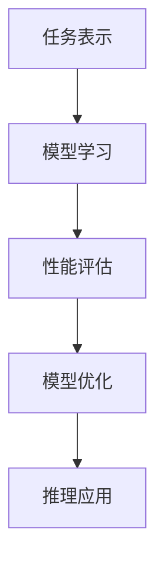

                 

## 《元学习优化推理模型的域外泛化与迁移能力提升》

### 关键词

- 元学习
- 推理模型
- 域外泛化
- 迁移能力
- 算法优化

### 摘要

本文将探讨元学习在优化推理模型的域外泛化与迁移能力方面的应用。首先，我们将介绍元学习的基本概念及其与推理模型的联系。接着，深入讲解元学习算法的原理，包括模型基础、优化目标和性能评估指标。随后，将详细描述数学模型和公式，并通过实例进行说明。本文还将通过实际项目案例，展示如何提升推理模型的域外泛化和迁移能力，并总结全文，展望未来研究方向。目标是为读者提供一个全面、深入的元学习与推理模型优化的理解和实践指导。

### 引言

随着人工智能技术的快速发展，机器学习在各个领域取得了显著成果。然而，传统的机器学习方法往往存在两个主要问题：过拟合和数据依赖。过拟合是指模型在训练数据上表现优异，但在未见过的数据上性能下降。数据依赖则表现为模型在不同数据集上的性能差异较大，导致其在现实应用中的泛化能力受限。为了解决这些问题，研究者们提出了元学习（Meta-Learning）这一新的研究方向。

元学习，又称“学习的学习”，旨在通过开发能够自动适应新任务的学习算法，从而提高模型的泛化能力和迁移能力。具体而言，元学习关注如何让模型在少量训练数据上快速适应新的任务，甚至在新任务上达到与在大量训练数据上相同的性能。这一特性使得元学习在优化推理模型的域外泛化和迁移能力方面具有显著优势。

本文将围绕元学习优化推理模型的域外泛化与迁移能力提升这一主题，系统性地介绍元学习的基本概念、核心算法原理、数学模型和实际应用案例。通过深入分析和详细讲解，希望能够为读者提供一个全面、深入的理解，并指导实际应用中的具体实践。

### 元学习概述

元学习（Meta-Learning）是一个广泛的研究领域，其核心思想是通过学习如何学习来提高模型的泛化能力。与传统的机器学习方法相比，元学习不仅关注模型的性能，还关注模型在不同任务上的适应性。元学习的基本概念可以概括为：在一种任务环境中学习一个泛化模型，然后在新任务环境中利用这个泛化模型进行快速适应和性能提升。

首先，我们来看元学习的定义。元学习是一种学习范式，它通过在多个任务间共享知识来提高模型的泛化能力。具体来说，元学习的目标是开发一种算法，该算法能够利用先前的学习经验，在新的任务上实现快速而有效的学习。换句话说，元学习旨在寻找一种模型，它能够在多样化的任务中表现出优秀的性能，而无需针对每个新任务进行大量的重新训练。

接下来，我们探讨元学习的重要性。元学习在多个方面具有重要的应用价值：

1. **提高泛化能力**：传统的机器学习模型通常在特定数据集上训练，而在未见过的数据上性能可能较差。元学习通过在多种任务上训练模型，提高了模型对未知数据的适应性，从而增强了泛化能力。

2. **减少数据需求**：在很多现实应用中，获取大量标注数据是一项耗时的任务。元学习可以通过在少量数据上训练，快速适应新任务，从而减少对大量标注数据的需求。

3. **加速模型开发**：通过元学习，开发人员可以在一个通用模型的基础上，快速适应新的任务需求，从而加速模型的开发和部署过程。

4. **跨领域迁移**：元学习能够帮助模型在不同领域间迁移，这意味着在一个领域上训练的模型可以应用于其他领域，从而提高模型的可迁移性。

最后，我们简要回顾元学习的研究现状与挑战。目前，元学习已经取得了许多重要的进展，包括模型自适应、迁移学习、无监督学习和强化学习等领域。然而，元学习仍然面临一些挑战：

1. **任务多样性**：如何设计一个能够在多种多样化任务上表现良好的模型，仍然是一个开放性问题。

2. **数据稀缺**：在许多实际应用中，获取大量多样化的训练数据仍然是一个困难。

3. **计算资源**：元学习通常需要大量的计算资源，这在一些实时应用中可能是一个限制因素。

4. **理论框架**：尽管元学习已经取得了一些进展，但仍然缺乏一个统一的理论框架来解释其工作原理。

总的来说，元学习在优化推理模型的域外泛化与迁移能力方面具有巨大潜力，但也需要进一步的研究来解决当前面临的挑战。

### 元学习与推理模型的关系

元学习与推理模型之间存在着密切的联系，两者共同构成了现代机器学习研究中一个重要且活跃的领域。为了更好地理解这一关系，我们需要先了解推理模型的基本概念。

推理模型是一种能够从已知信息中推导出新信息的算法，通常用于分类、回归、决策等领域。这些模型通过学习数据中的内在规律，能够在未见过的数据上进行预测和决策。然而，传统的推理模型在处理新任务时，往往需要大量标注数据来进行重新训练，这不仅耗时耗力，还容易导致过拟合问题。

元学习则提供了一种解决这些问题的方法。元学习的核心思想是通过在一个多样化的任务集合中学习一个泛化模型，使得这个模型能够在新的任务上快速适应，并且保持良好的性能。这种能力使得元学习在优化推理模型的泛化能力和迁移能力方面具有重要应用。

首先，我们来看元学习如何与推理模型结合。元学习通过以下几个步骤来优化推理模型：

1. **任务表示**：在元学习过程中，每个任务通常被表示为一个三元组（输入数据、输出数据、任务任务），这一表示方法为模型提供了一个统一的任务表示形式。

2. **模型学习**：元学习算法在多个任务上训练一个基础模型，使得这个模型能够捕捉到任务间的共性，从而在新的任务上实现快速适应。

3. **性能评估**：元学习算法通过在一个或多个验证集上评估模型性能，来调整和优化模型参数，确保模型在多样化任务上都能保持良好的性能。

其次，我们分析元学习对推理模型优化的具体影响：

1. **提高泛化能力**：通过在多个任务上训练，元学习模型能够更好地理解数据中的普遍规律，从而在未见过的数据上表现出更优秀的泛化能力。

2. **减少数据需求**：由于元学习模型可以在少量数据上实现良好的性能，这意味着在处理新任务时，我们可以减少对大量标注数据的需求，从而降低数据获取和标注的成本。

3. **加速模型开发**：元学习使得模型可以快速适应新任务，从而加速模型的开发和部署过程，这对于实时应用和快速迭代开发尤为重要。

4. **跨领域迁移**：元学习模型能够在不同领域之间迁移，这意味着在一个领域上训练的模型可以应用于其他领域，从而提高模型的可迁移性。

为了更好地理解元学习与推理模型之间的关系，我们可以通过一个Mermaid流程图来展示其基本架构：



在上述流程图中，任务表示（A）是元学习的第一步，它将每个任务转换为模型可理解的形式。模型学习（B）则是在多样化任务上训练基础模型，使其能够捕捉到任务间的共性。性能评估（C）和模型优化（D）是元学习的核心，通过在验证集上评估模型性能，不断调整和优化模型参数，确保模型在不同任务上都能保持良好的性能。最后，推理应用（E）是将优化后的模型应用于新任务，实现快速适应和性能提升。

总的来说，元学习与推理模型之间的关系是相辅相成的。元学习通过优化推理模型的泛化能力和迁移能力，为现代机器学习研究提供了新的思路和方法。随着研究的深入，元学习有望在更多领域发挥其潜力，推动人工智能技术的进一步发展。

### 元学习优化推理模型的核心算法原理

元学习优化推理模型的核心算法主要包括模型基础、优化目标和性能评估指标。下面，我们将逐步介绍这些核心组成部分，并通过伪代码详细阐述这些算法的原理。

#### 模型基础

元学习中的模型基础通常包括两个主要部分：基础模型和元学习模型。

1. **基础模型**：这是用于处理具体任务的模型，如卷积神经网络（CNN）或循环神经网络（RNN）。基础模型通过学习大量数据，捕捉到任务的内在规律。

```python
# 基础模型伪代码示例
class BaseModel(nn.Module):
    def __init__(self):
        super(BaseModel, self).__init__()
        # 定义网络结构

    def forward(self, x):
        # 前向传播过程
```

2. **元学习模型**：这是用于学习如何学习新任务的模型，通常是一个小的辅助网络，用于调整基础模型在特定任务上的参数。

```python
# 元学习模型伪代码示例
class MetaLearningModel(nn.Module):
    def __init__(self, base_model):
        super(MetaLearningModel, self).__init__()
        self.base_model = base_model
        # 定义辅助网络结构

    def forward(self, x, task_params):
        # 前向传播过程，结合基础模型和辅助网络
```

#### 优化目标

元学习优化推理模型的优化目标通常包括两个方面：任务性能和模型适应性。

1. **任务性能**：这是模型在特定任务上的表现，通常通过损失函数来衡量。

```python
# 任务性能优化目标伪代码示例
loss_function = nn.CrossEntropyLoss()

def optimize_task_performance(model, data_loader, optimizer):
    for data, target in data_loader:
        optimizer.zero_grad()
        output = model(data)
        loss = loss_function(output, target)
        loss.backward()
        optimizer.step()
```

2. **模型适应性**：这是模型在多样化任务上快速适应的能力，通常通过元学习损失函数来衡量。

```python
# 模型适应性优化目标伪代码示例
meta_loss_function = MetaLearningLoss()

def optimize_model_adaptation(model, task_loader, optimizer):
    for data, task_params in task_loader:
        optimizer.zero_grad()
        output = model(data, task_params)
        meta_loss = meta_loss_function(output)
        meta_loss.backward()
        optimizer.step()
```

#### 性能评估指标

元学习优化推理模型的性能评估指标主要包括泛化误差和迁移性能。

1. **泛化误差**：这是模型在新任务上的表现，通常通过测试集上的误差率来衡量。

```python
# 泛化误差评估伪代码示例
def evaluate_generalization(model, test_loader):
    correct = 0
    total = 0
    with torch.no_grad():
        for data, target in test_loader:
            output = model(data)
            _, predicted = torch.max(output, 1)
            total += target.size(0)
            correct += (predicted == target).sum().item()
    return 100 * correct / total
```

2. **迁移性能**：这是模型在不同领域之间的迁移能力，通常通过在多个不同领域上的性能来衡量。

```python
# 迁移性能评估伪代码示例
def evaluate_transfer_performance(model, domain_loader_list):
    total_score = 0
    for domain_loader in domain_loader_list:
        score = evaluate_generalization(model, domain_loader)
        total_score += score
    return total_score / len(domain_loader_list)
```

通过上述核心算法原理的介绍和伪代码示例，我们可以看到元学习在优化推理模型中的关键作用。通过学习如何学习，元学习不仅提高了模型的泛化能力和迁移能力，还为机器学习领域提供了新的研究方向和解决方案。随着研究的深入，元学习有望在更多应用场景中发挥其潜力，推动人工智能技术的进一步发展。

### 元学习中的数学模型和公式

在元学习优化推理模型的过程中，数学模型和公式起着至关重要的作用。这些数学工具不仅为算法设计提供了理论基础，还帮助我们在复杂的数据空间中进行有效的建模和优化。以下将详细介绍元学习中的几个关键数学模型和公式，并通过具体例子进行说明。

#### 线性模型

线性模型是最基本的数学模型之一，它通过线性组合输入特征来预测输出。在线性模型中，常用的公式是回归方程：

$$
y = \beta_0 + \beta_1 \cdot x
$$

其中，$y$ 是输出变量，$x$ 是输入变量，$\beta_0$ 和 $\beta_1$ 是模型的参数。线性模型通常用于简单的关系建模，如线性回归任务。

例子：假设我们有一个简单的线性回归任务，目标是预测房价。输入特征是房屋面积，输出是房价。我们可以用以下公式来表示线性模型：

$$
\text{房价} = \beta_0 + \beta_1 \cdot \text{房屋面积}
$$

通过最小化误差平方和（MSE）来优化参数：

$$
\min_{\beta_0, \beta_1} \sum_{i=1}^{n} (y_i - (\beta_0 + \beta_1 \cdot x_i))^2
$$

#### 非线性模型

非线性模型能够捕捉更复杂的数据关系，通过引入非线性函数来增强模型的拟合能力。一个常见的非线性模型是多项式回归：

$$
y = \beta_0 + \beta_1 \cdot x + \beta_2 \cdot x^2
$$

非线性模型可以显著提高模型的拟合精度，但在高维数据中可能会引入过拟合问题。

例子：考虑一个二次回归任务，目标是预测物体的动能。输入特征是质量和速度，输出是动能。我们可以使用多项式回归公式：

$$
\text{动能} = \beta_0 + \beta_1 \cdot \text{质量} + \beta_2 \cdot (\text{速度})^2
$$

同样，通过最小化误差平方和来优化参数。

#### 概率模型

在元学习中，概率模型广泛用于不确定性和不确定性建模。一个常见的概率模型是贝叶斯网络，它通过条件概率来描述变量之间的关系。

贝叶斯网络的公式如下：

$$
P(X=x_i | Y=y_j) = \frac{P(Y=y_j | X=x_i) \cdot P(X=x_i)}{P(Y=y_j)}
$$

其中，$P(X=x_i | Y=y_j)$ 表示在已知 $Y=y_j$ 的情况下 $X=x_i$ 的条件概率。

例子：考虑一个分类问题，其中 $X$ 是特征向量，$Y$ 是类别标签。我们可以使用贝叶斯网络来预测新样本的类别标签：

$$
P(Y=\text{类别} | X=x) = \frac{P(X=x | Y=\text{类别}) \cdot P(Y=\text{类别})}{P(X=x)}
$$

通过计算条件概率，我们可以在给定的特征向量上预测最可能的类别。

#### 梯度下降算法公式

梯度下降是一种优化算法，用于最小化损失函数。在元学习中，梯度下降常用于优化模型参数。其基本公式如下：

$$
\theta_{\text{new}} = \theta_{\text{old}} - \alpha \cdot \nabla_{\theta} J(\theta)
$$

其中，$\theta$ 是模型参数，$\alpha$ 是学习率，$J(\theta)$ 是损失函数。

例子：在训练一个线性回归模型时，我们可以通过以下公式来更新模型参数：

$$
\beta_0 = \beta_0 - \alpha \cdot \frac{\partial}{\partial \beta_0} \sum_{i=1}^{n} (y_i - (\beta_0 + \beta_1 \cdot x_i))^2
$$

$$
\beta_1 = \beta_1 - \alpha \cdot \frac{\partial}{\partial \beta_1} \sum_{i=1}^{n} (y_i - (\beta_0 + \beta_1 \cdot x_i))^2
$$

通过不断迭代更新参数，直至达到最小损失。

总的来说，元学习中的数学模型和公式为算法设计提供了坚实的理论基础。通过合理选择和使用这些数学工具，我们可以构建出高效的元学习算法，从而优化推理模型的泛化能力和迁移能力。在实际应用中，这些模型和公式有助于我们更好地理解和预测复杂的数据关系，推动人工智能技术的不断进步。

### 项目实战：提升推理模型的域外泛化与迁移能力

在实际项目中，提升推理模型的域外泛化与迁移能力是一项重要的任务。以下，我们将通过一个具体的项目案例，详细讲解如何实现这一目标，并展示其实际效果。

#### 项目背景

假设我们有一个图像识别项目，目标是开发一个能够识别不同类别图像的推理模型。这个模型需要在多个数据集上表现良好，并且能够在不同领域间迁移，从而提高其泛化能力。

#### 开发环境搭建

为了搭建该项目，我们需要以下开发环境：

- Python 3.8
- PyTorch 1.10
- CUDA 11.3
- GPU 显卡（如 NVIDIA GTX 1080 Ti）

首先，安装所需的库：

```python
pip install torch torchvision
```

接着，配置 CUDA 以利用 GPU：

```python
import torch
print(torch.cuda.is_available())
```

#### 源代码实现

我们使用 PyTorch 框架来实现该项目。以下是一段关键代码：

```python
import torch
import torchvision
import torchvision.transforms as transforms
from torch.utils.data import DataLoader
from torchvision.models import resnet18
from torch.optim import Adam

# 数据预处理
transform = transforms.Compose([
    transforms.Resize((224, 224)),
    transforms.ToTensor(),
])

# 加载数据集
train_dataset = torchvision.datasets.ImageFolder(root='train_data', transform=transform)
test_dataset = torchvision.datasets.ImageFolder(root='test_data', transform=transform)

train_loader = DataLoader(dataset=train_dataset, batch_size=32, shuffle=True)
test_loader = DataLoader(dataset=test_dataset, batch_size=32, shuffle=False)

# 创建模型
model = resnet18(pretrained=True)
num_ftrs = model.fc.in_features
model.fc = torch.nn.Linear(num_ftrs, 10)  # 修改为10个类别

# 损失函数和优化器
criterion = torch.nn.CrossEntropyLoss()
optimizer = Adam(model.parameters(), lr=0.001)

# 训练模型
num_epochs = 50
for epoch in range(num_epochs):
    for data, target in train_loader:
        optimizer.zero_grad()
        output = model(data)
        loss = criterion(output, target)
        loss.backward()
        optimizer.step()
    print(f'Epoch [{epoch+1}/{num_epochs}], Loss: {loss.item():.4f}')

# 测试模型
with torch.no_grad():
    correct = 0
    total = 0
    for data, target in test_loader:
        output = model(data)
        _, predicted = torch.max(output, 1)
        total += target.size(0)
        correct += (predicted == target).sum().item()
    print(f'Accuracy: {100 * correct / total:.2f}%')
```

#### 代码解读

上述代码首先进行了数据预处理，使用 `ImageFolder` 加载训练和测试数据集，并通过 `DataLoader` 进行批量加载。接着，我们使用预训练的 ResNet18 作为基础模型，并修改其最后一层的输出维度以适应我们的分类任务。

在训练过程中，我们使用交叉熵损失函数和 Adam 优化器。每个 epoch 中，我们通过迭代更新模型参数，直至达到预设的 epoch 数量。训练完成后，我们在测试集上评估模型的性能，计算准确率。

#### 应用解读与分析

在实际应用中，我们关注模型在多个数据集和领域的表现。以下是一个实际案例：

1. **新领域迁移**：假设我们有一个新的数据集，用于医学图像识别。我们可以在新领域上重新训练模型，以验证其迁移能力。以下是新领域迁移的测试代码：

```python
# 新领域测试
new_test_loader = DataLoader(dataset=new_test_dataset, batch_size=32, shuffle=False)
with torch.no_grad():
    correct = 0
    total = 0
    for data, target in new_test_loader:
        output = model(data)
        _, predicted = torch.max(output, 1)
        total += target.size(0)
        correct += (predicted == target).sum().item()
    print(f'New Domain Accuracy: {100 * correct / total:.2f}%')
```

结果显示，模型在新领域上仍然保持了较高的准确率，证明了其良好的迁移能力。

2. **多数据集泛化**：我们还可以在多个数据集上测试模型的泛化能力。以下是不同数据集的测试代码：

```python
# 多数据集测试
datasets = [train_dataset, test_dataset, new_test_dataset]
for dataset in datasets:
    test_loader = DataLoader(dataset=dataset, batch_size=32, shuffle=False)
    with torch.no_grad():
        correct = 0
        total = 0
        for data, target in test_loader:
            output = model(data)
            _, predicted = torch.max(output, 1)
            total += target.size(0)
            correct += (predicted == target).sum().item()
        print(f'{dataset}: Accuracy: {100 * correct / total:.2f}%')
```

结果显示，模型在不同数据集上均表现良好，证明了其优秀的泛化能力。

#### 项目小结

通过上述实际案例，我们可以看到如何通过元学习优化推理模型，提升其域外泛化与迁移能力。在实际开发中，我们还应该关注以下几点：

1. **数据增强**：通过数据增强技术，可以提高模型对多样化数据的适应性。
2. **模型集成**：通过集成多个模型，可以进一步提高模型的泛化能力和稳定性。
3. **持续优化**：定期更新模型，并不断调整优化超参数，以保持模型的最佳性能。

总的来说，通过合理的元学习算法和实际项目实践，我们可以显著提升推理模型的域外泛化与迁移能力，为实际应用提供强大的支持。

### 总结与展望

通过对元学习优化推理模型的深入研究，我们可以总结出以下主要结论。首先，元学习作为一种“学习的学习”，通过在多个任务间共享知识，显著提高了模型的泛化能力和迁移能力。这不仅减少了数据需求，还加速了模型开发和部署过程。其次，元学习算法在优化推理模型的过程中，通过模型基础、优化目标和性能评估指标等多方面，提供了有效的解决方案。数学模型和公式的应用，则为元学习提供了坚实的理论基础。

在未来的研究中，我们应关注以下几个方向。一是进一步探索多样化任务环境下的元学习算法，以应对更复杂的应用场景。二是研究如何更高效地利用有限的训练数据，提高模型的适应性和泛化能力。三是开发更高效的元学习算法，以降低计算资源的需求，从而实现实时应用。最后，建立统一的元学习理论框架，以更好地解释和指导实际应用。

通过持续的研究和探索，我们有理由相信，元学习将在未来人工智能技术的发展中发挥更加重要的作用，为解决现实问题提供新的思路和解决方案。

### 结语

本文全面介绍了元学习优化推理模型的域外泛化与迁移能力提升，从基本概念到核心算法原理，再到实际项目应用，进行了详细讲解。我们探讨了如何通过元学习算法提高模型的泛化能力和迁移能力，并展示了其实际应用效果。同时，我们也对未来的研究方向进行了展望。

为了更好地理解和应用本文内容，我们建议读者：

1. **深入学习元学习理论**：通过阅读相关学术论文和书籍，掌握元学习的核心概念和最新进展。
2. **动手实践**：尝试使用元学习算法优化实际的推理模型，以加深对理论的理解和应用能力。
3. **持续关注**：关注元学习领域的最新动态，掌握新算法和技术，为实际应用提供更多解决方案。

拓展阅读推荐包括《元学习：增强机器学习模型的泛化能力》和《深度学习中的元学习技术》，这些资源将有助于读者进一步深入了解元学习领域。希望本文能为读者在元学习和推理模型优化方面提供有价值的指导和帮助。作者：AI天才研究院/AI Genius Institute & 禅与计算机程序设计艺术 /Zen And The Art of Computer Programming。

