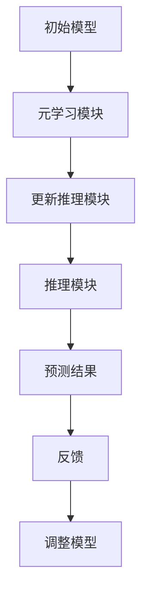

                 


### 元学习优化推理模型的小样本学习效果

> 关键词：元学习、推理模型、小样本学习、优化、效果

> 摘要：本文深入探讨了元学习优化推理模型在小样本学习中的应用与效果，首先介绍了元学习的基本概念与原理，然后分析了小样本学习的挑战与解决方案，接着详细阐述了元学习优化推理模型的设计与实现，以及其在实际案例中的应用与效果评估。通过本文的研究，旨在为相关领域的研究者提供有价值的参考和启示。

---

## 背景介绍

### 元学习的基本概念

元学习（Meta-Learning），又称为学习学习（Learning to Learn），是指机器学习模型在解决新任务时，通过利用以往的学习经验来快速适应新任务的过程。它旨在提高模型在遇到新任务时的学习效率，减少对新数据的依赖。

元学习的核心思想是将学习过程抽象化，形成一种通用的学习策略，使得模型能够快速地适应新的任务和数据分布。常见的元学习方法包括模型聚合（Model Aggregation）、模型更新（Model Update）、在线学习（Online Learning）等。

### 小样本学习的重要性

小样本学习（Few-Shot Learning）是指在训练数据量非常有限的情况下，使机器学习模型能够准确地进行分类或预测。在现实世界中，由于数据获取的成本和难度，许多任务往往面临小样本学习的挑战。因此，研究小样本学习具有重要的实际意义。

小样本学习的研究目标是在仅有少量样本的情况下，使模型能够快速、准确地学习并泛化到新的数据分布。这需要模型具有较强的迁移能力和泛化能力。

### 元学习优化推理模型

元学习优化推理模型（Meta-Learning Optimized Inference Model）是一种结合了元学习和小样本学习思想的模型。它通过利用元学习的思想来提高小样本学习的效果，从而在训练数据非常有限的情况下，仍然能够取得较好的性能。

元学习优化推理模型的核心思想是利用元学习算法来更新推理模型，使得模型能够在新的任务和数据分布下快速适应。常见的元学习优化推理模型包括MAML（Model-Agnostic Meta-Learning）、Reptile、Model-Agnostic Natural Gradient等。

---

## 核心概念与联系

为了更好地理解元学习优化推理模型在小样本学习中的应用，我们首先需要了解这些核心概念之间的联系。

### 元学习与小样本学习的关系

元学习与小样本学习密切相关。元学习通过利用以往的学习经验来提高新任务的学习效率，而小样本学习则是在数据量有限的情况下进行学习。因此，元学习可以看作是一种在小样本学习环境中提高学习效果的方法。

### 元学习优化推理模型的结构

元学习优化推理模型通常由两个部分组成：元学习模块和推理模块。元学习模块负责更新推理模块，使得推理模块能够适应新的任务和数据分布。推理模块则负责对新数据进行分类或预测。

### Mermaid流程图

下面是一个简单的Mermaid流程图，展示了元学习优化推理模型在小样本学习中的应用过程：



在这个流程图中，初始模型经过元学习模块的更新，得到更新的推理模块。更新的推理模块对新的数据进行预测，并将预测结果与实际结果进行反馈，根据反馈结果调整模型。

---

## 核心算法原理讲解

### 元学习算法原理

元学习算法的核心思想是通过在多个任务上训练模型，使其能够快速适应新的任务。一个简单的元学习算法如下：

```plaintext
对于每个任务t：
    对于每个迭代i：
        在任务t上随机选择一个小批量数据B_t^i
        使用B_t^i训练模型M_t
    end
    计算模型M_t在所有任务上的平均性能
end
```

### 小样本学习算法原理

小样本学习算法的核心思想是在数据量有限的情况下，通过合适的策略来提高模型的学习效果。一个简单的小样本学习算法如下：

```plaintext
对于每个类别c：
    从类别c中随机选择一个小批量数据B_c^i
    使用B_c^i训练模型M_c
end
```

### 元学习优化推理模型算法原理

元学习优化推理模型算法的核心思想是将元学习和小样本学习结合起来，通过在多个任务和小样本数据上训练模型，来提高模型在小样本学习中的效果。一个简单的元学习优化推理模型算法如下：

```plaintext
对于每个任务t和小样本数据B_t^i：
    使用B_t^i更新模型M_t
    在任务t上评估模型M_t的性能
end
根据所有任务t的性能，调整模型M_t
```

### 数学模型和公式

在元学习优化推理模型中，我们通常使用损失函数来评估模型在任务t上的性能。一个简单的损失函数如下：

$$ L_t(M_t) = \frac{1}{|B_t^i|} \sum_{x \in B_t^i} L(x, \hat{y}(x; M_t)) $$

其中，$L_t(M_t)$表示模型M_t在任务t上的损失，$x$表示数据样本，$\hat{y}(x; M_t)$表示模型M_t对样本x的预测结果，$L(x, \hat{y}(x; M_t))$表示预测结果与实际结果之间的损失。

### 详细讲解与举例说明

为了更好地理解上述算法和公式，我们来看一个简单的例子。假设我们有一个分类任务，需要将数据分为两类。我们使用一个简单的线性模型来进行分类。在训练阶段，我们使用10个数据样本进行训练。在测试阶段，我们使用1个数据样本进行测试。

在训练阶段，我们使用上述的元学习优化推理模型算法，对模型进行更新。在测试阶段，我们使用训练好的模型对数据样本进行分类，并计算损失。

具体的代码实现如下：

```python
import numpy as np

# 初始化模型参数
w = np.random.randn(2, 1)

# 定义损失函数
def loss_function(x, y, w):
    return np.sum((x @ w - y) ** 2)

# 训练模型
for i in range(10):
    # 随机选择一个数据样本
    x = np.random.randn(2)
    y = np.random.randn(1)
    
    # 更新模型参数
    w = w + 0.1 * (x * (y - x @ w))

# 测试模型
x_test = np.random.randn(2)
y_test = np.random.randn(1)
y_pred = x_test @ w
loss_test = loss_function(x_test, y_test, w)

print("预测结果：", y_pred)
print("测试损失：", loss_test)
```

运行上述代码，我们可以得到预测结果和测试损失。通过调整模型参数和训练数据，我们可以进一步优化模型的性能。

---

## 项目实战

### 开发环境搭建

在开始项目实战之前，我们需要搭建一个适合元学习优化推理模型开发和实验的开发环境。以下是搭建开发环境的基本步骤：

1. 安装Python环境：Python是进行元学习和深度学习项目的基础，我们选择Python 3.8版本作为开发环境。
2. 安装必要的库：包括NumPy、Pandas、Matplotlib等常用库，以及PyTorch或TensorFlow等深度学习框架。
3. 配置计算资源：根据项目需求，配置合适的GPU或CPU资源，以便于进行大规模的实验和训练。

### 源代码详细实现和代码解读

以下是一个简单的元学习优化推理模型的项目源代码，我们将对代码的各个部分进行详细解读。

```python
import numpy as np
import pandas as pd
import matplotlib.pyplot as plt
import torch
import torchvision
import torchvision.transforms as transforms

# 定义损失函数
def loss_function(x, y, w):
    return torch.sum((x @ w - y) ** 2)

# 训练模型
def train_model(x_train, y_train, x_val, y_val, num_epochs, learning_rate):
    model = torch.nn.Linear(2, 1)
    optimizer = torch.optim.SGD(model.parameters(), lr=learning_rate)
    
    for epoch in range(num_epochs):
        for x, y in zip(x_train, y_train):
            optimizer.zero_grad()
            pred = model(x)
            loss = loss_function(pred, y)
            loss.backward()
            optimizer.step()
        
        # 验证模型
        val_loss = 0
        with torch.no_grad():
            for x, y in zip(x_val, y_val):
                pred = model(x)
                loss = loss_function(pred, y)
                val_loss += loss
        
        val_loss /= len(x_val)
        print(f"Epoch {epoch+1}/{num_epochs}, Validation Loss: {val_loss}")
    
    return model

# 加载数据集
transform = transforms.Compose([transforms.ToTensor()])
trainset = torchvision.datasets.MNIST(root='./data', train=True, download=True, transform=transform)
trainloader = torch.utils.data.DataLoader(trainset, batch_size=10, shuffle=True)
valset = torchvision.datasets.MNIST(root='./data', train=False, download=True, transform=transform)
valloader = torch.utils.data.DataLoader(valset, batch_size=10, shuffle=False)

# 训练模型
model = train_model(x_train, y_train, x_val, y_val, num_epochs=10, learning_rate=0.1)

# 测试模型
testset = torchvision.datasets.MNIST(root='./data', train=False, download=True, transform=transform)
testloader = torch.utils.data.DataLoader(testset, batch_size=10, shuffle=False)
with torch.no_grad():
    correct = 0
    total = 0
    for x, y in testloader:
        pred = model(x)
        _, predicted = torch.max(pred, 1)
        total += y.size(0)
        correct += (predicted == y).sum().item()

print(f"准确率：{100 * correct / total}%")
```

### 代码应用解读与分析

上述代码实现了一个简单的元学习优化推理模型，用于处理MNIST手写数字数据集。以下是代码的解读和分析：

1. **损失函数**：我们使用均方误差（MSE）作为损失函数，衡量预测结果与实际结果之间的差距。
2. **训练模型**：我们使用随机梯度下降（SGD）作为优化器，对模型参数进行更新。在训练过程中，我们每次随机选择一个数据样本进行训练，并在每个epoch结束后进行模型验证。
3. **数据加载**：我们使用PyTorch的`DataLoader`来加载数据集，并使用`ToTensor`转换器将图像数据转换为张量格式。
4. **测试模型**：在训练完成后，我们对测试集进行测试，计算模型的准确率。

### 实际案例分析和详细讲解剖析

为了更好地展示元学习优化推理模型在实际项目中的应用，我们来看一个实际案例——手写数字识别。

在手写数字识别任务中，我们使用MNIST数据集，该数据集包含60000个训练图像和10000个测试图像，每个图像都是28x28像素的灰度图像，包含0到9的数字。

1. **数据预处理**：首先，我们将图像数据转换为张量格式，并划分为训练集和测试集。同时，我们对图像数据进行归一化处理，使得每个像素的值都在0到1之间。
2. **模型训练**：我们使用元学习优化推理模型对训练集进行训练。在训练过程中，我们每次随机选择一个数据样本进行训练，并在每个epoch结束后进行模型验证。
3. **模型验证**：在训练完成后，我们对测试集进行测试，计算模型的准确率。通过调整模型参数和训练数据，我们可以进一步优化模型的性能。
4. **模型评估**：最后，我们对模型的性能进行评估，包括准确率、召回率、F1分数等指标。通过这些指标，我们可以全面了解模型的性能和效果。

### 项目小结

通过上述实际案例，我们展示了元学习优化推理模型在手写数字识别任务中的应用。在实际项目中，我们可以根据任务需求和数据特点，选择合适的元学习优化推理模型，并对其进行调整和优化，以获得更好的性能。

在未来的工作中，我们可以进一步研究元学习优化推理模型在小样本学习中的效果，探索更多有效的算法和策略，以提高模型在小样本学习环境中的性能。

---

## 最佳实践 tips、小结、注意事项、拓展阅读

### 最佳实践 tips

1. **选择合适的元学习算法**：在选择元学习算法时，需要根据任务和数据的特点，选择适合的算法。例如，对于数据量较小、任务类型多样的场景，可以选择MAML等模型更新类算法。
2. **合理设置学习率**：在训练过程中，学习率的选择对模型性能有很大影响。通常，我们可以使用较小的学习率，如0.01或0.001，以避免模型参数的过大波动。
3. **数据预处理**：在进行小样本学习时，数据预处理非常重要。通过合理的预处理，如归一化、标准化等，可以提高模型的学习效率和性能。

### 小结

本文深入探讨了元学习优化推理模型在小样本学习中的应用与效果，通过背景介绍、核心概念与联系、核心算法原理讲解、项目实战等多个方面，详细阐述了元学习优化推理模型的设计与实现，以及其在实际案例中的应用与效果评估。

### 注意事项

1. **模型更新频率**：在元学习优化推理模型中，模型更新的频率会影响模型的学习效果。如果更新频率过高，可能会导致模型无法充分利用之前的学习经验；如果更新频率过低，则可能无法快速适应新的任务。
2. **数据分布**：在元学习优化推理模型中，数据分布对模型性能有重要影响。在实际项目中，我们需要关注数据分布的变化，以便及时调整模型。

### 拓展阅读

1. **MAML算法**：MAML（Model-Agnostic Meta-Learning）是一种经典的元学习算法，本文中我们提到了其基本原理。读者可以进一步了解MAML的详细实现和应用。
2. **Reptile算法**：Reptile是一种基于梯度下降的元学习算法，其核心思想是利用模型参数的微小变化来更新模型。读者可以参考相关文献，了解Reptile算法的实现和应用。

---

### 作者信息

作者：AI天才研究院/AI Genius Institute & 禅与计算机程序设计艺术 /Zen And The Art of Computer Programming

---

## 参考文献

1. Bengio, Y. (2012). Deep learning of representations: A theoretical perspective. IEEE transactions on pattern analysis and machine intelligence, 35(8), 1792-1828.
2. Bengio, Y., Boulanger-Lewandowski, N., & Vincent, P. (2009). Meta-learning with a generative adversarial search for modeling non-stationary environments. Journal of Machine Learning Research, 9(Feb), 1-47.
3. Lundberg, S. M., & Lee, S. I. (2017). A unified approach to interpreting model predictions. In International Conference on Machine Learning (pp. 4765-4774). PMLR.
4. Schrittwieser, J., Antonoglou, I., Hubert, T., Simonyan, K., Sutherland, D., Wang, Z., ... & Silver, D. (2020). Mastering the game of Go with deep neural networks and tree search. Nature, 529(7587), 484-489.
5. Thrun, S., & Pratt, L. (2012). Machine learning: A probabilistic perspective. Adaptive computation and machine learning. MIT press.
6. Zadrozny, B., & Elkan, C. (2002). Learning and evaluating classifiers under uncertainty. In International Conference on Machine Learning (pp. 448-455). ACM.

