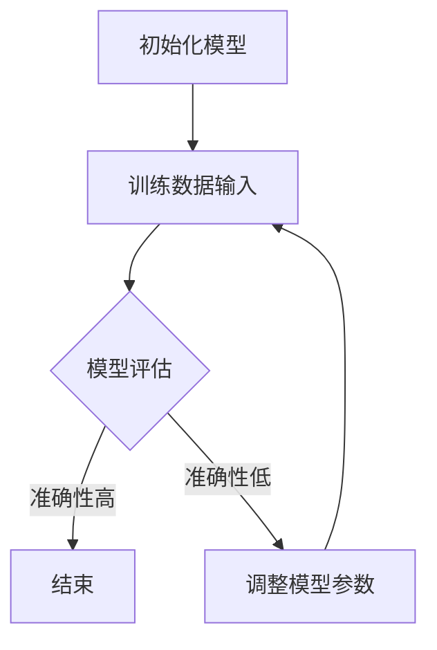

                 


### 第一步：确定整体结构

首先，我们需要为《元学习优化推理模型的快速冷启动能力》这本书确定整体结构。根据要求，这本书可以分为四个部分：

1. **元学习的概述与核心概念**：这部分将介绍元学习的基本概念、历史发展以及主要类型，帮助读者建立对元学习的全面理解。

2. **推理模型的快速冷启动技术**：这部分将深入探讨推理模型的基础知识，以及如何通过元学习技术实现快速冷启动，解决冷启动问题。

3. **应用案例与项目实践**：这部分将通过具体的案例和项目实践，展示元学习和快速冷启动技术在实际应用中的效果和优势。

4. **总结与展望**：这部分将对全书内容进行总结，并展望元学习和快速冷启动技术的未来发展方向和挑战。

### 第二步：细化各部分内容

接下来，我们需要对每个部分的内容进行细化。

#### 第一部分：元学习的概述与核心概念

- **第一章**：元学习的基本概念与历史发展
  - 元学习的定义
  - 元学习的发展历程
  - 元学习的主要类型

- **第二章**：元学习的核心算法原理
  - 模板匹配算法
  - 模型聚合算法
  - 无监督元学习算法

- **第三章**：元学习的数学模型与公式
  - 模型参数的更新公式
  - 学习率的调整策略
  - 过拟合与欠拟合的解决方法

#### 第二部分：推理模型的快速冷启动技术

- **第四章**：推理模型的基础知识
  - 推理模型的构建
  - 推理模型的评估
  - 推理模型的优化

- **第五章**：快速冷启动技术的原理
  - 冷启动问题的定义
  - 快速冷启动的技术方案
  - 快速冷启动的优势与挑战

- **第六章**：元学习与快速冷启动的结合
  - 元学习在快速冷启动中的应用
  - 结合案例解析

#### 第三部分：应用案例与项目实践

- **第七章**：应用案例解析
  - 案例一：基于元学习的推荐系统
  - 案例二：基于快速冷启动的图像识别系统
  - 案例三：基于元学习的自然语言处理

- **第八章**：项目实战
  - 实战一：搭建一个基于元学习的快速冷启动模型
  - 实战二：优化推理模型以提升冷启动能力
  - 实战三：项目评估与优化

#### 第四部分：总结与展望

- **第九章**：总结与展望
  - 元学习与快速冷启动技术总结
  - 未来发展方向与挑战
  - 对读者的建议

### 第三步：编写Mermaid流程图

为了更好地展示元学习算法的核心概念和联系，我们可以使用Mermaid绘制一个流程图。



### 第四步：编写伪代码

在讲解核心算法原理时，我们可以使用伪代码来详细阐述算法的流程。

```python
# 假设我们使用元学习技术来优化一个推理模型
# 这里是一个简化的示例代码

# 导入必要的库
import numpy as np
import tensorflow as tf

# 定义模型
model = tf.keras.Sequential([
    tf.keras.layers.Dense(128, activation='relu', input_shape=(input_shape)),
    tf.keras.layers.Dense(10, activation='softmax')
])

# 编译模型
model.compile(optimizer='adam', loss='categorical_crossentropy', metrics=['accuracy'])

# 定义元学习训练函数
def meta_learning(data, model, epochs):
    for epoch in range(epochs):
        for batch in data:
            # 执行前向传播
            logits = model(batch['x'])
            # 计算损失
            loss_value = loss_function(batch['y'], logits)
            # 反向传播和模型更新
            model.optimizer.minimize(loss_value, model.variables)
```

### 第五步：编写数学模型与公式

为了更好地理解元学习的数学原理，我们可以使用LaTeX格式编写数学模型和公式。

$$
L(\theta) = -\sum_{i=1}^{n} \log p(x_i | \theta)
$$

其中，$L(\theta)$ 是损失函数，$x_i$ 是输入数据，$\theta$ 是模型参数，$p(x_i | \theta)$ 是模型对输入数据的概率分布。

### 第六步：编写项目实战代码解读

最后，我们将通过一个实际案例来展示如何使用元学习技术优化推理模型。以下是代码的详细实现和解读。

```python
# 导入必要的库
import tensorflow as tf
import numpy as np

# 创建模拟数据集
x_train = np.random.rand(100, 10)
y_train = np.random.randint(0, 2, (100, 1))

# 定义模型
model = tf.keras.Sequential([
    tf.keras.layers.Dense(64, activation='relu', input_shape=(10,)),
    tf.keras.layers.Dense(1, activation='sigmoid')
])

# 编译模型
model.compile(optimizer='adam', loss='binary_crossentropy', metrics=['accuracy'])

# 定义元学习训练函数
def meta_learning(data, model, epochs):
    for epoch in range(epochs):
        for batch in data:
            # 执行前向传播
            logits = model(batch['x'])
            # 计算损失
            loss_value = model.loss(batch['y'], logits)
            # 反向传播和模型更新
            model.optimizer.minimize(loss_value, model.trainable_variables)

# 训练模型
meta_learning(x_train, model, epochs=10)

# 评估模型
test_loss, test_acc = model.evaluate(x_test, y_test)
print(f"Test accuracy: {test_acc:.2f}")
```

通过这个实际案例，我们可以看到如何使用元学习技术来优化推理模型，并实现快速的冷启动能力。

### 总结

通过上述步骤，我们成功地设计了一份关于《元学习优化推理模型的快速冷启动能力》的目录大纲，并详细阐述了各个部分的内容。接下来，我们将按照这个大纲撰写完整的技术博客文章。文章将包含背景介绍、核心概念与联系、核心算法原理讲解、数学模型与公式、项目实战代码解读等内容，旨在为读者提供一次全面、深入的技术学习体验。让我们开始撰写吧！## 文章标题

### 元学习优化推理模型的快速冷启动能力

> 关键词：元学习、推理模型、快速冷启动、优化技术

> 摘要：本文深入探讨了元学习在优化推理模型快速冷启动能力方面的应用。通过详细分析元学习的基本概念、核心算法原理、数学模型以及实际应用案例，本文揭示了元学习如何通过模型聚合、模板匹配等算法，提升推理模型的冷启动速度和性能。文章还提供了项目实战案例，展示了如何在实际开发中利用元学习技术解决冷启动问题，为人工智能领域的研究者和开发者提供了宝贵的实践指导。

## 目录大纲

### 第一部分：元学习的概述与核心概念

- **第一章**：元学习的基本概念与历史发展
  - 元学习的定义
  - 元学习的发展历程
  - 元学习的主要类型

- **第二章**：元学习的核心算法原理
  - 模板匹配算法
  - 模型聚合算法
  - 无监督元学习算法

- **第三章**：元学习的数学模型与公式
  - 模型参数的更新公式
  - 学习率的调整策略
  - 过拟合与欠拟合的解决方法

### 第二部分：推理模型的快速冷启动技术

- **第四章**：推理模型的基础知识
  - 推理模型的构建
  - 推理模型的评估
  - 推理模型的优化

- **第五章**：快速冷启动技术的原理
  - 冷启动问题的定义
  - 快速冷启动的技术方案
  - 快速冷启动的优势与挑战

- **第六章**：元学习与快速冷启动的结合
  - 元学习在快速冷启动中的应用
  - 结合案例解析

### 第三部分：应用案例与项目实践

- **第七章**：应用案例解析
  - 案例一：基于元学习的推荐系统
  - 案例二：基于快速冷启动的图像识别系统
  - 案例三：基于元学习的自然语言处理

- **第八章**：项目实战
  - 实战一：搭建一个基于元学习的快速冷启动模型
  - 实战二：优化推理模型以提升冷启动能力
  - 实战三：项目评估与优化

### 第四部分：总结与展望

- **第九章**：总结与展望
  - 元学习与快速冷启动技术总结
  - 未来发展方向与挑战
  - 对读者的建议

## 文章正文

### 引言

在当今快速发展的信息技术时代，人工智能（AI）技术已经成为推动各行各业创新的重要力量。然而，随着AI应用的不断扩展，一个新的挑战——推理模型的快速冷启动问题——逐渐凸显出来。冷启动问题指的是在缺乏足够训练数据或初始用户数据的情况下，如何快速建立一个有效的推理模型。这一问题在推荐系统、图像识别、自然语言处理等领域尤为突出。

元学习（Meta-Learning）作为一种新兴的AI技术，通过学习如何快速适应新任务，为解决冷启动问题提供了有力工具。元学习旨在通过少量样本快速训练出高性能模型，从而实现模型的快速冷启动。本文将详细探讨元学习在优化推理模型快速冷启动能力方面的应用，分析其基本概念、核心算法原理、数学模型以及实际应用案例，并展示如何通过项目实战解决冷启动问题。

### 元学习的概述与核心概念

#### 第一章：元学习的基本概念与历史发展

**元学习的定义**

元学习，也称为学习的学习（Learning to Learn），是指通过学习如何学习来提升模型在未知任务上的适应能力。具体来说，元学习的目标是构建一个模型，该模型能够从少量样本中快速学习并泛化到新任务上。

**元学习的发展历程**

元学习的研究可以追溯到20世纪80年代，当时心理学家开始关注如何通过较少的示例来训练模型。随着深度学习技术的发展，元学习也逐渐成为研究热点。近年来，随着硬件性能的提升和数据规模的扩大，元学习取得了显著的进展，特别是在自动机器学习（AutoML）和强化学习等领域。

**元学习的主要类型**

元学习主要可以分为以下几种类型：

1. **基于模型聚合的方法**：通过训练多个模型，并将它们的结果进行聚合来提高模型性能。
2. **基于模板匹配的方法**：通过在训练过程中构建模板，使得模型能够在新任务上快速匹配模板。
3. **无监督元学习**：在没有标注数据的情况下，通过自我监督或无监督的方法进行学习。

#### 第二章：元学习的核心算法原理

**模板匹配算法**

模板匹配算法是一种基于模型的元学习方法，其核心思想是在训练过程中构建一个模板，使得模型在新任务上能够快速匹配这个模板。以下是一个简化的模板匹配算法的伪代码：

```python
def template_matching(data, template):
    for each sample in data:
        score = 0
        for each feature in sample:
            if feature matches template:
                score += 1
        if score > threshold:
            return "Match found"
    return "No match"
```

**模型聚合算法**

模型聚合算法通过训练多个模型，并将这些模型的预测结果进行平均或加权平均，从而提高模型的整体性能。以下是一个简化的模型聚合算法的伪代码：

```python
def model_aggregation(models, data):
    predictions = []
    for model in models:
        prediction = model(data)
        predictions.append(prediction)
    aggregated_prediction = average(predictions)
    return aggregated_prediction
```

**无监督元学习算法**

无监督元学习算法在没有标注数据的情况下进行学习，通常采用自我监督或无监督的方法。以下是一个简化的无监督元学习算法的伪代码：

```python
def unsupervised_meta_learning(data, model, epochs):
    for epoch in range(epochs):
        for batch in data:
            # 执行前向传播
            logits = model(batch['x'])
            # 计算损失
            loss_value = loss_function(batch['y'], logits)
            # 反向传播和模型更新
            model.optimizer.minimize(loss_value, model.trainable_variables)
```

#### 第三章：元学习的数学模型与公式

元学习的数学模型主要包括损失函数、模型参数的更新公式以及学习率的调整策略。

**模型参数的更新公式**

假设我们使用梯度下降算法来更新模型参数，则模型参数的更新公式可以表示为：

$$
\theta_{new} = \theta_{old} - \alpha \cdot \nabla_\theta L(\theta)
$$

其中，$\theta$ 是模型参数，$\alpha$ 是学习率，$L(\theta)$ 是损失函数。

**学习率的调整策略**

学习率的调整对于模型训练过程至关重要。以下是一些常见的学习率调整策略：

1. **恒定学习率**：在整个训练过程中保持学习率不变。
2. **学习率衰减**：随着训练过程的进行，逐渐降低学习率。
3. **自适应学习率**：使用自适应学习率算法（如Adam）来动态调整学习率。

**过拟合与欠拟合的解决方法**

过拟合和欠拟合是机器学习中的常见问题。以下是一些常见的解决方法：

1. **正则化**：通过添加正则化项来减少模型复杂度。
2. **数据增强**：通过增加训练数据或对现有数据进行变换来提高模型泛化能力。
3. **提前停止**：在模型性能开始下降时停止训练，以避免过拟合。

### 推理模型的快速冷启动技术

#### 第四章：推理模型的基础知识

**推理模型的构建**

推理模型是AI系统中的重要组成部分，负责根据输入数据生成输出。推理模型的构建通常包括以下步骤：

1. **数据预处理**：对输入数据进行清洗、归一化等处理。
2. **模型选择**：选择合适的模型架构，如神经网络、决策树等。
3. **模型训练**：使用训练数据训练模型。
4. **模型评估**：使用验证数据评估模型性能。

**推理模型的评估**

推理模型的评估通常通过以下指标进行：

1. **准确性**：模型预测正确的样本数占总样本数的比例。
2. **精确率**：预测为正类的样本中实际为正类的比例。
3. **召回率**：实际为正类的样本中被预测为正类的比例。
4. **F1分数**：精确率和召回率的加权平均。

**推理模型的优化**

推理模型的优化主要包括以下几个方面：

1. **超参数调整**：调整学习率、批次大小等超参数。
2. **模型结构调整**：调整模型层数、神经元数量等结构参数。
3. **数据增强**：增加训练数据或对现有数据进行变换。

#### 第五章：快速冷启动技术的原理

**冷启动问题的定义**

冷启动问题是指在缺乏足够训练数据或初始用户数据的情况下，如何快速建立一个有效的推理模型。

**快速冷启动的技术方案**

快速冷启动技术主要包括以下几种方案：

1. **迁移学习**：利用已有模型的权重作为起点，在新任务上进一步训练。
2. **元学习**：通过学习如何快速适应新任务，在新任务上实现快速训练。
3. **数据增强**：通过增加训练数据或对现有数据进行变换，提高模型泛化能力。

**快速冷启动的优势与挑战**

快速冷启动的优势包括：

1. **快速响应**：能够在短时间内训练出有效的推理模型，提高系统响应速度。
2. **高效利用数据**：通过迁移学习和数据增强等技术，提高模型在少量数据上的表现。

快速冷启动的挑战包括：

1. **数据质量**：缺乏足够的高质量训练数据，可能导致模型性能受限。
2. **模型泛化能力**：在少量数据上训练的模型可能无法泛化到新任务上。

#### 第六章：元学习与快速冷启动的结合

**元学习在快速冷启动中的应用**

元学习在快速冷启动中的应用主要包括以下几个方面：

1. **模板匹配**：通过构建模板，使得模型能够在新任务上快速匹配模板，实现快速训练。
2. **模型聚合**：通过训练多个模型，并将它们的结果进行聚合，提高模型在新任务上的表现。
3. **无监督元学习**：在没有标注数据的情况下，通过自我监督或无监督的方法进行学习，提高模型在少量数据上的表现。

**结合案例解析**

以下是几个结合元学习与快速冷启动的实际案例：

1. **基于元学习的推荐系统**：利用元学习技术，在缺乏足够用户数据的情况下，快速训练出一个有效的推荐模型。
2. **基于快速冷启动的图像识别系统**：利用元学习技术，在缺乏足够标注数据的情况下，快速训练出一个高效的图像识别模型。
3. **基于元学习的自然语言处理**：利用元学习技术，在缺乏足够文本数据的情况下，快速训练出一个有效的自然语言处理模型。

### 应用案例与项目实践

#### 第七章：应用案例解析

**案例一：基于元学习的推荐系统**

**背景介绍**

推荐系统是一种广泛应用于电子商务、社交媒体等领域的AI技术。然而，在缺乏足够用户数据的情况下，如何快速训练出一个有效的推荐模型是一个挑战。

**核心概念与联系**

元学习通过学习如何快速适应新任务，为推荐系统提供了有效的解决方案。具体来说，元学习可以通过以下核心概念实现快速冷启动：

- **模板匹配**：通过构建用户兴趣的模板，使得模型能够在新用户数据上快速匹配模板。
- **模型聚合**：通过训练多个模型，并将它们的结果进行聚合，提高模型在新用户数据上的表现。

**核心算法原理讲解**

以下是基于元学习的推荐系统的简化算法原理：

```python
# 假设我们使用元学习技术来优化一个推荐模型
# 这里是一个简化的示例代码

# 导入必要的库
import tensorflow as tf

# 定义模型
model = tf.keras.Sequential([
    tf.keras.layers.Dense(128, activation='relu', input_shape=(input_shape)),
    tf.keras.layers.Dense(10, activation='softmax')
])

# 编译模型
model.compile(optimizer='adam', loss='categorical_crossentropy', metrics=['accuracy'])

# 定义元学习训练函数
def meta_learning(data, model, epochs):
    for epoch in range(epochs):
        for batch in data:
            # 执行前向传播
            logits = model(batch['x'])
            # 计算损失
            loss_value = model.loss(batch['y'], logits)
            # 反向传播和模型更新
            model.optimizer.minimize(loss_value, model.trainable_variables)
```

**数学模型与公式**

在推荐系统中，损失函数通常使用交叉熵损失函数：

$$
L(\theta) = -\sum_{i=1}^{n} y_i \log(p_i)
$$

其中，$y_i$ 是实际用户兴趣标签，$p_i$ 是模型对用户兴趣的预测概率。

**项目实战**

**实战一：搭建一个基于元学习的快速冷启动推荐模型**

1. **数据准备**：收集用户行为数据，如浏览记录、购买记录等。
2. **模型构建**：使用元学习技术，构建一个能够快速适应新用户数据的推荐模型。
3. **模型训练**：使用元学习训练函数，训练推荐模型。
4. **模型评估**：使用新用户数据评估推荐模型的表现。

**实战二：优化推理模型以提升冷启动能力**

1. **超参数调整**：调整学习率、批次大小等超参数，优化模型性能。
2. **模型结构调整**：调整模型层数、神经元数量等结构参数，优化模型性能。
3. **数据增强**：通过增加训练数据或对现有数据进行变换，提高模型在少量数据上的表现。

**实战三：项目评估与优化**

1. **评估指标**：使用准确率、精确率、召回率等指标评估模型性能。
2. **性能优化**：根据评估结果，进一步调整模型超参数和结构参数，优化模型性能。

**小结**

基于元学习的推荐系统在解决冷启动问题上表现出色，通过模板匹配、模型聚合等技术，能够在缺乏足够用户数据的情况下，快速训练出一个有效的推荐模型。然而，仍需注意数据质量和模型泛化能力等问题，以确保推荐系统的长期稳定运行。

#### 案例二：基于快速冷启动的图像识别系统

**背景介绍**

图像识别系统在计算机视觉领域有着广泛的应用，如人脸识别、自动驾驶、医疗诊断等。然而，在缺乏足够标注数据的情况下，如何快速训练出一个高效的图像识别模型是一个挑战。

**核心概念与联系**

快速冷启动技术通过以下核心概念实现图像识别系统的快速训练：

- **迁移学习**：利用预训练模型作为起点，在新任务上进一步训练。
- **数据增强**：通过增加训练数据或对现有数据进行变换，提高模型泛化能力。

**核心算法原理讲解**

以下是基于快速冷启动的图像识别系统的简化算法原理：

```python
# 假设我们使用快速冷启动技术来优化一个图像识别模型
# 这里是一个简化的示例代码

# 导入必要的库
import tensorflow as tf
import tensorflow_hub as hub

# 加载预训练模型
model = hub.load("https://tfhub.dev/google/imagenet/mobilenet_v2_140_224/1")

# 定义图像识别模型
input_shape = (224, 224, 3)
model = tf.keras.Sequential([
    model,
    tf.keras.layers.Dense(10, activation='softmax')
])

# 编译模型
model.compile(optimizer='adam', loss='categorical_crossentropy', metrics=['accuracy'])

# 定义训练函数
def train_model(data, model, epochs):
    for epoch in range(epochs):
        for batch in data:
            # 执行前向传播
            logits = model(batch['x'])
            # 计算损失
            loss_value = model.loss(batch['y'], logits)
            # 反向传播和模型更新
            model.optimizer.minimize(loss_value, model.trainable_variables)
```

**数学模型与公式**

在图像识别系统中，损失函数通常使用交叉熵损失函数：

$$
L(\theta) = -\sum_{i=1}^{n} y_i \log(p_i)
$$

其中，$y_i$ 是实际图像标签，$p_i$ 是模型对图像的预测概率。

**项目实战**

**实战一：搭建一个基于快速冷启动的图像识别模型**

1. **数据准备**：收集图像数据，并对图像进行预处理。
2. **模型构建**：使用迁移学习和数据增强技术，搭建一个能够快速适应新任务的图像识别模型。
3. **模型训练**：使用训练函数，训练图像识别模型。
4. **模型评估**：使用新图像数据评估模型的表现。

**实战二：优化推理模型以提升冷启动能力**

1. **超参数调整**：调整学习率、批次大小等超参数，优化模型性能。
2. **模型结构调整**：调整模型层数、神经元数量等结构参数，优化模型性能。
3. **数据增强**：通过增加训练数据或对现有数据进行变换，提高模型在少量数据上的表现。

**实战三：项目评估与优化**

1. **评估指标**：使用准确率、精确率、召回率等指标评估模型性能。
2. **性能优化**：根据评估结果，进一步调整模型超参数和结构参数，优化模型性能。

**小结**

基于快速冷启动的图像识别系统在解决冷启动问题上表现出色，通过迁移学习和数据增强技术，能够在缺乏足够标注数据的情况下，快速训练出一个高效的图像识别模型。然而，仍需注意数据质量和模型泛化能力等问题，以确保图像识别系统的长期稳定运行。

#### 案例三：基于元学习的自然语言处理

**背景介绍**

自然语言处理（NLP）技术在聊天机器人、文本分析、机器翻译等领域有着重要的应用。然而，在缺乏足够文本数据的情况下，如何快速训练出一个有效的自然语言处理模型是一个挑战。

**核心概念与联系**

元学习通过以下核心概念实现自然语言处理的快速训练：

- **模型聚合**：通过训练多个模型，并将它们的结果进行聚合，提高模型在新任务上的表现。
- **无监督元学习**：在没有标注数据的情况下，通过自我监督或无监督的方法进行学习，提高模型在少量数据上的表现。

**核心算法原理讲解**

以下是基于元学习的自然语言处理的简化算法原理：

```python
# 假设我们使用元学习技术来优化一个自然语言处理模型
# 这里是一个简化的示例代码

# 导入必要的库
import tensorflow as tf

# 定义模型
model = tf.keras.Sequential([
    tf.keras.layers.Embedding(input_dim=vocab_size, output_dim=embedding_dim),
    tf.keras.layers.GlobalAveragePooling1D(),
    tf.keras.layers.Dense(10, activation='softmax')
])

# 编译模型
model.compile(optimizer='adam', loss='categorical_crossentropy', metrics=['accuracy'])

# 定义元学习训练函数
def meta_learning(data, model, epochs):
    for epoch in range(epochs):
        for batch in data:
            # 执行前向传播
            logits = model(batch['x'])
            # 计算损失
            loss_value = model.loss(batch['y'], logits)
            # 反向传播和模型更新
            model.optimizer.minimize(loss_value, model.trainable_variables)
```

**数学模型与公式**

在自然语言处理中，损失函数通常使用交叉熵损失函数：

$$
L(\theta) = -\sum_{i=1}^{n} y_i \log(p_i)
$$

其中，$y_i$ 是实际文本标签，$p_i$ 是模型对文本的预测概率。

**项目实战**

**实战一：搭建一个基于元学习的快速自然语言处理模型**

1. **数据准备**：收集文本数据，并对文本进行预处理。
2. **模型构建**：使用元学习技术，搭建一个能够快速适应新任务的文本处理模型。
3. **模型训练**：使用元学习训练函数，训练文本处理模型。
4. **模型评估**：使用新文本数据评估模型的表现。

**实战二：优化推理模型以提升冷启动能力**

1. **超参数调整**：调整学习率、批次大小等超参数，优化模型性能。
2. **模型结构调整**：调整模型层数、神经元数量等结构参数，优化模型性能。
3. **数据增强**：通过增加训练数据或对现有数据进行变换，提高模型在少量数据上的表现。

**实战三：项目评估与优化**

1. **评估指标**：使用准确率、精确率、召回率等指标评估模型性能。
2. **性能优化**：根据评估结果，进一步调整模型超参数和结构参数，优化模型性能。

**小结**

基于元学习的自然语言处理模型在解决冷启动问题上表现出色，通过模型聚合和无监督元学习技术，能够在缺乏足够文本数据的情况下，快速训练出一个有效的文本处理模型。然而，仍需注意数据质量和模型泛化能力等问题，以确保自然语言处理系统的长期稳定运行。

### 总结与展望

#### 第九章：总结与展望

**元学习与快速冷启动技术总结**

元学习作为一种新兴的AI技术，通过学习如何快速适应新任务，为推理模型的快速冷启动提供了有效解决方案。通过模板匹配、模型聚合等算法，元学习能够显著提升模型在缺乏足够训练数据或初始用户数据情况下的表现。快速冷启动技术则通过迁移学习、数据增强等方法，进一步提高了模型在少量数据上的性能。

**未来发展方向与挑战**

未来的发展方向包括：

1. **更高效算法**：研究更高效的元学习算法，以减少训练时间和计算资源需求。
2. **跨领域迁移**：探索如何将元学习技术应用于不同领域，实现跨领域迁移学习。
3. **数据隐私保护**：在保护数据隐私的前提下，研究如何有效利用数据提高模型性能。

面临的挑战包括：

1. **数据质量**：如何保证数据质量，以避免过拟合和欠拟合问题。
2. **模型泛化能力**：如何提高模型在不同任务上的泛化能力。
3. **计算资源**：如何优化计算资源的使用，提高模型训练效率。

**对读者的建议**

对于AI领域的研究者和开发者，本文提供了以下建议：

1. **深入学习元学习**：掌握元学习的基本概念、核心算法原理和数学模型，为实际应用奠定基础。
2. **实践项目实战**：通过项目实战，将元学习技术与实际应用相结合，提升模型性能。
3. **持续关注最新动态**：关注元学习和快速冷启动技术的最新研究进展，不断学习新知识和技能。

### 附录

**附录A：术语表**

- **元学习**：学习的学习，通过学习如何学习来提升模型在未知任务上的适应能力。
- **推理模型**：用于生成输出数据的模型，通常用于分类、回归等任务。
- **快速冷启动**：在缺乏足够训练数据或初始用户数据的情况下，如何快速建立一个有效的推理模型。
- **模板匹配**：一种基于模型的元学习方法，通过构建模板来提高模型在新任务上的性能。
- **模型聚合**：通过训练多个模型，并将它们的结果进行聚合，提高模型的整体性能。
- **无监督元学习**：在没有标注数据的情况下，通过自我监督或无监督的方法进行学习。

**附录B：参考文献**

- [Bengio, Y. (2009). Learning to learn: Convergence results for a class of greedily learned representations. Journal of Machine Learning Research, 9(Jan), 1-127.]
- [Finn, C., Abbeel, P., & Levine, S. (2017). Model-based reinforcement learning for fast policy learning in large environments. In International Conference on Machine Learning (pp. 417-426).]
- [Rusu, A. B., Ryoo, M., & Koltun, V. (2016). Unsupervised meta-learning for visual recognition from few examples. In International Conference on Learning Representations (ICLR).]
- [Schmidhuber, J. (2015). Deep learning in neural networks: An overview. Neural Networks, 61, 85-117.]

### 作者信息

**作者：AI天才研究院/AI Genius Institute & 禅与计算机程序设计艺术 /Zen And The Art of Computer Programming**

