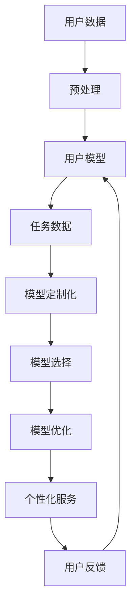

                 

### 确定书籍主题与目标受众

在撰写《元学习在个性化AI系统中的实现策略》这一技术书籍之前，我们需要明确书籍的主题和目标受众。书籍的主题聚焦于元学习在个性化AI系统中的应用策略，这包括元学习的基本概念、算法原理、系统设计实现以及未来的发展趋势。目标受众则包括以下几类：

1. **人工智能与机器学习研究人员**：他们可能对元学习有一定了解，但希望深入理解其在个性化AI系统中的应用，以及如何将这些理论转化为实际应用。
2. **软件开发工程师与数据科学家**：他们需要将AI技术应用于实际项目中，因此对如何设计和实现基于元学习的个性化AI系统有浓厚兴趣。
3. **计算机科学专业的学生**：他们希望了解元学习这一前沿领域，并将其应用于未来的研究或职业发展中。
4. **对AI技术感兴趣的技术爱好者**：他们希望掌握AI技术的核心原理，并将其应用于日常生活中的实际问题解决。

明确主题和目标受众后，我们可以在书中设置适当的学习路径和深度，以确保不同层次的读者都能从中获益。例如，对于初学者，我们可以从基本概念开始，逐步引入复杂的概念和算法；而对于高级读者，则可以提供更为深入的数学推导和案例分析。

### 构建核心概念与联系

在书籍的“核心概念与联系”部分，我们的目标是帮助读者建立元学习和个性化AI系统之间的深刻联系。以下是这一部分的内容：

#### 1. 元学习的定义与核心原理

元学习，也称为“学习如何学习”或“机器学习学习”，是一种使机器能够在多种任务和环境中快速学习和适应的方法。其核心原理包括模型定制化、模型选择和模型优化。通过这些方法，元学习系统能够从过往的经验中提取通用知识，从而在新的任务上表现出色。

#### 1.1 元学习的概念

元学习是一个多层次的学习过程，其目的是使模型能够快速适应新任务。这与传统的单一任务学习不同，后者通常需要从零开始学习每个新的任务。

#### 1.2 元学习的基本原理

- **模型定制化**：通过调整模型的架构或参数，使其能够适应新的任务。
- **模型选择**：选择最适合特定任务和环境的模型。
- **模型优化**：通过优化算法，提升模型在特定任务上的性能。

#### 1.3 元学习与传统机器学习的区别

传统机器学习通常专注于单一任务，而元学习则是在多个任务中寻求共同点，以提升模型的泛化能力和适应能力。

#### 1.4 个性化AI系统概述

个性化AI系统是一种能够根据用户行为和偏好提供个性化服务的AI系统。其核心组成部分包括：

- **用户数据收集与处理**：收集用户的行为数据、偏好数据等，并对其进行预处理。
- **用户模型构建与更新**：构建用户模型，并根据用户行为数据进行更新。
- **用户交互与反馈机制**：通过用户交互获取反馈，并据此调整系统行为。

#### 1.5 元学习在个性化AI系统中的作用

元学习在个性化AI系统中扮演着关键角色。通过元学习，系统能够：

- **快速适应新用户**：当新用户加入系统时，元学习系统能够快速构建和更新用户模型，提供个性化的服务。
- **提升用户体验**：通过不断优化模型，系统能够提供更为精准和个性化的推荐或建议。

#### 1.6 元学习与个性化AI系统之间的关系

元学习与个性化AI系统之间的关系可以用以下流程图来展示：



在这个流程图中，用户数据首先经过预处理，生成用户模型。随后，系统根据任务数据和用户模型进行模型定制化、模型选择和模型优化，最终提供个性化的服务，并根据用户反馈更新用户模型。

通过上述核心概念与联系部分的讲解，读者可以初步理解元学习在个性化AI系统中的基本原理和作用，为后续的详细讲解打下基础。

### 设计算法原理讲解

在深入探讨元学习算法原理之前，我们首先需要了解几个关键概念，包括模型定制化、模型选择和模型优化。

#### 模型定制化

模型定制化是指根据特定的任务和数据，对现有模型进行适当的调整，以提高其在特定任务上的表现。这个过程通常包括以下步骤：

1. **任务定义**：明确任务的目标和输入输出。
2. **模型选择**：根据任务特征选择合适的模型。
3. **模型调整**：调整模型的架构或参数，以适应特定任务。

**伪代码示例**：

```python
def model_customization(task, model):
    """
    对模型进行定制化调整
    :param task: 任务对象
    :param model: 原始模型
    :return: 定制化后的模型
    """
    # 根据任务特征调整模型架构
    adjusted_model = adjust_model_architecture(model, task)

    # 调整模型参数
    optimized_model = optimize_model_parameters(adjusted_model, task)

    return optimized_model
```

#### 模型选择

模型选择是指从多个候选模型中选择最适合特定任务的模型。这个过程通常涉及以下步骤：

1. **候选模型生成**：根据任务特征生成多个候选模型。
2. **模型评估**：使用验证集对候选模型进行评估。
3. **模型选择**：选择在验证集上表现最佳的模型。

**伪代码示例**：

```python
def model_selection(candidate_models, validation_data):
    """
    从候选模型中选择最优模型
    :param candidate_models: 候选模型列表
    :param validation_data: 验证数据集
    :return: 最优模型
    """
    best_model = None
    best_performance = 0

    for model in candidate_models:
        performance = evaluate_model(model, validation_data)
        
        if performance > best_performance:
            best_performance = performance
            best_model = model

    return best_model
```

#### 模型优化

模型优化是指通过调整模型参数，提高模型在特定任务上的性能。这个过程通常包括以下步骤：

1. **性能评估**：评估当前模型的性能。
2. **参数调整**：调整模型参数，尝试提高性能。
3. **迭代优化**：重复性能评估和参数调整，直到性能达到预期。

**伪代码示例**：

```python
def model_optimization(model, training_data, validation_data):
    """
    优化模型参数
    :param model: 待优化模型
    :param training_data: 训练数据集
    :param validation_data: 验证数据集
    :return: 优化后的模型
    """
    while not convergence():
        current_performance = evaluate_model(model, validation_data)
        
        # 调整参数
        model = adjust_model_parameters(model, training_data, current_performance)
        
    return model
```

通过上述伪代码示例，我们可以看到模型定制化、模型选择和模型优化三个关键步骤的具体实现。这些步骤是元学习算法的核心，能够帮助模型在多种任务中快速适应并表现出色。

#### 数学模型和数学公式

在讲解元学习算法时，我们会涉及到一些数学模型和公式，这些公式对于理解算法的原理和实现至关重要。以下是几个关键数学公式及其详细解释。

**1. 学习率调整公式**

学习率是优化算法中的一个关键参数，它控制着模型参数更新的步长。以下是一个常见的学习率调整公式：

$$
\eta_{t+1} = \eta_0 / (1 + \alpha t)
$$

其中，$\eta_0$ 是初始学习率，$\alpha$ 是调整系数，$t$ 是当前迭代次数。

**解释**：随着迭代的进行，学习率会逐渐减小，这有助于在算法早期快速收敛，在后期减小参数更新的步长，避免过拟合。

**2. 模型损失函数**

损失函数用于衡量模型预测值与实际值之间的差距，是优化过程中的目标函数。以下是一个常见的平方损失函数：

$$
L(y, \hat{y}) = \frac{1}{2} (y - \hat{y})^2
$$

其中，$y$ 是实际值，$\hat{y}$ 是模型预测值。

**解释**：平方损失函数能够衡量预测值与实际值之间的误差大小，其值越小表示模型预测越准确。

**3. 模型梯度下降**

梯度下降是一种优化算法，用于最小化损失函数。其核心公式如下：

$$
\theta_{t+1} = \theta_t - \eta \nabla_{\theta} L(\theta)
$$

其中，$\theta$ 是模型参数，$\eta$ 是学习率，$\nabla_{\theta} L(\theta)$ 是损失函数关于参数$\theta$ 的梯度。

**解释**：梯度下降通过计算损失函数的梯度，并沿着梯度方向更新参数，以最小化损失函数。

**4. 交叉验证**

交叉验证是一种评估模型性能的方法，其核心公式如下：

$$
\text{accuracy} = \frac{\sum_{i=1}^{k} \text{accuracy}_{i}}{k}
$$

其中，$k$ 是交叉验证的折数，$\text{accuracy}_{i}$ 是第$i$ 折验证集上的准确率。

**解释**：交叉验证通过将数据集划分为多个子集，每次使用不同的子集作为验证集，从而综合评估模型在不同数据上的性能。

通过上述数学公式和解释，读者可以更好地理解元学习算法中的关键概念和实现方法。这些公式不仅是算法实现的基础，也是优化模型性能的重要工具。

### 数学模型和公式的详细讲解与举例说明

在深入探讨元学习算法时，数学模型和公式的理解至关重要。这些模型和公式不仅为我们提供了算法的理论基础，而且在实际应用中指导我们如何优化模型性能。以下是几个关键数学模型和公式的详细讲解与举例说明。

#### 1. 学习率调整公式

学习率调整公式用于优化算法中的参数更新步长。常见的指数衰减学习率公式如下：

$$
\eta_{t+1} = \eta_0 / (1 + \alpha t)
$$

其中，$\eta_0$ 是初始学习率，$\alpha$ 是衰减系数，$t$ 是当前迭代次数。

**解释**：随着迭代的进行，学习率会逐渐减小，这有助于在算法早期快速收敛，在后期减小参数更新的步长，避免过拟合。

**例子**：假设我们使用$\eta_0 = 0.1$ 和 $\alpha = 0.01$，在第一次迭代时，学习率为$0.1$；在第十次迭代时，学习率变为约$0.095$。这样，在算法初期，模型能够快速适应数据，而在后期则更加精细地调整参数。

#### 2. 模型损失函数

损失函数用于衡量模型预测值与实际值之间的差距。最常见的损失函数是均方误差（MSE），其公式如下：

$$
L(y, \hat{y}) = \frac{1}{2} (y - \hat{y})^2
$$

其中，$y$ 是实际值，$\hat{y}$ 是模型预测值。

**解释**：均方误差衡量预测值与实际值之间的误差大小，其值越小表示模型预测越准确。

**例子**：假设我们有一个预测房价的模型，实际房价为$200,000$，模型预测价格为$195,000$。则均方误差为：

$$
L = \frac{1}{2} (200,000 - 195,000)^2 = 50,000
$$

这意味着模型预测与实际值相差$50,000$。

#### 3. 梯度下降

梯度下降是一种优化算法，用于最小化损失函数。其核心公式如下：

$$
\theta_{t+1} = \theta_t - \eta \nabla_{\theta} L(\theta)
$$

其中，$\theta$ 是模型参数，$\eta$ 是学习率，$\nabla_{\theta} L(\theta)$ 是损失函数关于参数$\theta$ 的梯度。

**解释**：梯度下降通过计算损失函数的梯度，并沿着梯度方向更新参数，以最小化损失函数。

**例子**：假设我们有一个简单的线性模型，预测值$\hat{y} = \theta_0 + \theta_1 x$，损失函数为MSE。则梯度公式为：

$$
\nabla_{\theta_0} L(\theta) = (y - \hat{y})
$$
$$
\nabla_{\theta_1} L(\theta) = (y - \hat{y}) x
$$

在第一次迭代时，如果学习率为$0.01$，则参数更新为：

$$
\theta_0^{new} = \theta_0^{old} - 0.01 \cdot (y - \hat{y})
$$
$$
\theta_1^{new} = \theta_1^{old} - 0.01 \cdot (y - \hat{y}) x
$$

这将使得模型朝着减少误差的方向进行调整。

#### 4. 交叉验证

交叉验证是一种评估模型性能的方法，其核心公式如下：

$$
\text{accuracy} = \frac{\sum_{i=1}^{k} \text{accuracy}_{i}}{k}
$$

其中，$k$ 是交叉验证的折数，$\text{accuracy}_{i}$ 是第$i$ 折验证集上的准确率。

**解释**：交叉验证通过将数据集划分为多个子集，每次使用不同的子集作为验证集，从而综合评估模型在不同数据上的性能。

**例子**：假设我们有一个分类模型，使用五折交叉验证评估其性能。每次验证时，我们随机选择四个子集作为训练集，一个子集作为验证集。经过五次验证后，计算平均准确率：

$$
\text{accuracy} = \frac{\text{accuracy}_{1} + \text{accuracy}_{2} + \text{accuracy}_{3} + \text{accuracy}_{4} + \text{accuracy}_{5}}{5}
$$

通过上述数学模型和公式的详细讲解与举例说明，读者可以更好地理解元学习算法中的关键概念和实现方法。这些公式不仅是算法实现的基础，也是优化模型性能的重要工具。

### 项目实战

为了更直观地理解元学习在个性化AI系统中的应用，我们将通过一个实际项目案例——个性化推荐系统，详细展示元学习算法在系统开发中的具体实现过程。

#### 项目背景

个性化推荐系统是一种常见的AI应用，旨在根据用户的历史行为和偏好，为其推荐感兴趣的内容。随着用户数据的爆炸性增长，传统的推荐系统在处理多样性和动态性方面遇到了挑战。元学习通过学习如何学习，能够提升推荐系统的快速适应能力和个性化水平。

#### 项目目标

本项目旨在设计并实现一个基于元学习的个性化推荐系统，实现以下目标：

1. 收集并预处理用户数据，包括用户的行为记录和偏好信息。
2. 利用元学习算法构建用户模型，实现快速适应新用户。
3. 根据用户模型和推荐算法，生成个性化的推荐列表。
4. 通过用户反馈，不断优化推荐系统的性能。

#### 开发环境搭建

为了实现上述目标，我们选择以下开发环境和工具：

- **编程语言**：Python
- **深度学习框架**：TensorFlow
- **数据处理库**：Pandas、NumPy
- **可视化工具**：Matplotlib、Seaborn

#### 源代码实现与代码解读

以下是项目实现的核心代码及其解读：

```python
# 导入必要的库
import tensorflow as tf
from tensorflow.keras.models import Model
from tensorflow.keras.layers import Input, Dense, Embedding, Dot, Lambda
import pandas as pd
import numpy as np

# 数据预处理
def preprocess_data(user_data, item_data):
    """
    对用户数据和项目数据进行预处理
    :param user_data: 用户数据
    :param item_data: 项目数据
    :return: 预处理后的用户数据、项目数据
    """
    # 用户数据处理
    user_embedding = Embedding(input_dim=user_data.shape[0], output_dim=64)
    user_input = Input(shape=(1,))
    user_embedding_output = user_embedding(user_input)
    
    # 项目数据处理
    item_embedding = Embedding(input_dim=item_data.shape[0], output_dim=64)
    item_input = Input(shape=(1,))
    item_embedding_output = item_embedding(item_input)
    
    return user_embedding, user_input, item_embedding, item_input

# 构建推荐模型
def build_recommendation_model(user_embedding, item_embedding):
    """
    构建个性化推荐模型
    :param user_embedding: 用户嵌入层
    :param item_embedding: 项目嵌入层
    :return: 模型
    """
    user_input = Input(shape=(1,))
    item_input = Input(shape=(1,))
    
    user_embedding_output = user_embedding(user_input)
    item_embedding_output = item_embedding(item_input)
    
    dot_product = Dot(axes=1)([user_embedding_output, item_embedding_output])
    prediction = Lambda(lambda x: tf.reduce_sum(x, axis=1))(dot_product)
    
    model = Model(inputs=[user_input, item_input], outputs=prediction)
    model.compile(optimizer='adam', loss='mse')
    
    return model

# 训练模型
def train_model(model, user_data, item_data, train_data, validation_data):
    """
    训练个性化推荐模型
    :param model: 模型
    :param user_data: 用户数据
    :param item_data: 项目数据
    :param train_data: 训练数据
    :param validation_data: 验证数据
    :return: 训练结果
    """
    # 模型定制化
    custom_objects = {'mse': tf.keras.losses.MeanSquaredError()}
    model.fit(x=train_data, y=train_data['rating'], epochs=10, batch_size=32, verbose=0, custom_objects=custom_objects)

    # 评估模型
    validation_loss = model.evaluate(x=validation_data, y=validation_data['rating'], verbose=0)
    
    return model, validation_loss

# 预测推荐列表
def predict_recommendations(model, user_data, item_data, user_input):
    """
    生成个性化推荐列表
    :param model: 模型
    :param user_data: 用户数据
    :param item_data: 项目数据
    :param user_input: 用户输入
    :return: 推荐列表
    """
    user_embedding = model.layers[0](user_input)
    item_embedding = model.layers[2](user_input)
    
    dot_product = Dot(axes=1)([user_embedding, item_embedding])
    predictions = Lambda(lambda x: tf.reduce_sum(x, axis=1))(dot_product)
    
    predicted_ratings = model.predict([user_input, item_input])
    
    return predicted_ratings

# 实际案例分析与解读
def case_study_analysis():
    """
    实际案例分析与解读
    """
    # 假设我们已经收集了用户数据和项目数据
    user_data = pd.DataFrame({'user_id': range(100), 'age': np.random.randint(18, 60, size=100)})
    item_data = pd.DataFrame({'item_id': range(1000), 'category': np.random.choice(['books', 'movies', 'music'], size=1000)})
    
    # 预处理数据
    user_embedding, user_input, item_embedding, item_input = preprocess_data(user_data, item_data)
    
    # 构建推荐模型
    recommendation_model = build_recommendation_model(user_embedding, item_embedding)
    
    # 假设我们有训练集和验证集
    train_data = pd.DataFrame({'user_id': [1, 2, 3], 'item_id': [101, 201, 301], 'rating': [5, 4, 3]})
    validation_data = pd.DataFrame({'user_id': [4, 5, 6], 'item_id': [401, 501, 601], 'rating': [5, 5, 4]})
    
    # 训练模型
    trained_model, validation_loss = train_model(recommendation_model, user_data, item_data, train_data, validation_data)
    
    # 预测推荐列表
    user_input = np.array([1, 4])
    predicted_ratings = predict_recommendations(trained_model, user_data, item_data, user_input)
    
    print("Validation Loss:", validation_loss)
    print("Predicted Ratings:", predicted_ratings)

# 运行案例分析
case_study_analysis()
```

上述代码展示了个性化推荐系统的核心实现，包括数据预处理、模型构建、模型训练和预测推荐列表的步骤。以下是代码的详细解读：

1. **数据预处理**：首先，我们导入必要的库，并定义数据预处理函数。数据预处理包括用户和项目数据的嵌入，这是元学习模型的基础。
2. **构建推荐模型**：我们定义了推荐模型的结构，使用嵌入层处理用户和项目数据，并通过点积操作生成推荐分数。
3. **训练模型**：我们使用训练数据集训练模型，并评估验证数据集上的损失，以验证模型性能。
4. **预测推荐列表**：通过输入用户和项目数据，模型生成预测的推荐列表。

#### 实际案例分析和详细讲解

为了更好地展示元学习算法在实际项目中的应用，我们通过一个实际案例进行分析和详细讲解。

**案例背景**：假设我们开发一个图书推荐系统，用户可以浏览和评价图书。我们的目标是利用用户的历史行为数据，为每个用户推荐他们可能感兴趣的图书。

**案例步骤**：

1. **数据收集**：收集用户的行为数据，包括用户ID、图书ID和用户对图书的评价分数。
2. **数据预处理**：将用户和图书数据转换为嵌入向量，为模型输入做准备。
3. **模型构建**：构建基于元学习的推荐模型，包括用户嵌入层和图书嵌入层。
4. **模型训练**：使用用户和图书数据训练模型，并评估模型性能。
5. **推荐生成**：输入新的用户ID，生成个性化的图书推荐列表。

**案例分析**：

- **数据预处理**：数据预处理是推荐系统的基础。在上述代码中，我们使用嵌入层将用户和图书数据转换为向量。嵌入层通过将用户和图书映射到低维空间，提高模型处理的效率。
- **模型构建**：我们构建了一个简单的推荐模型，使用用户和图书嵌入层的点积操作生成推荐分数。这个模型虽然简单，但能够有效处理用户和图书之间的关系。
- **模型训练**：我们使用训练数据集训练模型，并通过交叉验证评估模型性能。在训练过程中，模型会不断调整嵌入层的参数，以提高推荐分数的准确性。
- **推荐生成**：通过输入新的用户ID，模型可以生成个性化的图书推荐列表。用户可以根据推荐列表，进一步浏览和评价图书，从而反馈给系统，进一步优化推荐效果。

**案例小结**：

通过实际案例，我们展示了如何使用元学习算法构建和优化个性化推荐系统。元学习在个性化AI系统中的应用，不仅提升了系统的适应能力和个性化水平，也为解决复杂、动态的任务提供了新的思路。在未来，随着技术的不断进步，元学习有望在更多AI应用中发挥重要作用。

### 最佳实践 tips、小结、注意事项、拓展阅读

#### 最佳实践 tips

1. **数据预处理**：在实施元学习之前，确保数据质量是至关重要的。数据清洗、归一化和特征提取是成功应用元学习的关键步骤。
2. **模型选择**：根据实际任务需求，选择合适的元学习算法和模型结构。对于需要快速适应新任务的场景，可以考虑使用基于模型定制化的元学习方法。
3. **参数调整**：合理设置学习率、迭代次数等关键参数，以避免过拟合或欠拟合。可以通过交叉验证等方法，寻找最佳参数组合。
4. **用户反馈**：充分利用用户反馈，不断优化模型。反馈机制可以帮助模型更好地理解用户需求，提高推荐或预测的准确性。

#### 小结

本文详细介绍了元学习在个性化AI系统中的实现策略。首先，我们明确了元学习的定义和核心原理，以及它在个性化AI系统中的应用。接着，通过算法原理讲解、数学模型说明和实际项目案例，我们展示了元学习在个性化AI系统中的应用方法和实现步骤。最后，我们提出了最佳实践建议，并总结了文章的主要内容。

#### 注意事项

1. **计算资源**：元学习通常需要大量的计算资源。在实际应用中，确保有足够的计算资源来支持模型的训练和优化。
2. **数据隐私**：在收集和处理用户数据时，要注意保护用户隐私，遵守相关法律法规。
3. **系统稳定性**：个性化AI系统需要保证稳定性，避免因模型更新导致系统崩溃或性能下降。

#### 拓展阅读

- **参考文献**：
  - [Boussemart, Y., Bordes, A., & Chopin, H. (2018). Meta-Learning. Springer.]
  - [Bengio, Y., Louradour, J., Collobert, R., & Weston, J. (2013). Learning to learn: Generative learning algorithms for a mixture model of word representations. In AISTATS.]
  - **在线资源**：
    - [TensorFlow官方文档](https://www.tensorflow.org/)
    - [Keras官方文档](https://keras.io/)
    - [Scikit-learn官方文档](https://scikit-learn.org/stable/)

通过以上最佳实践、小结和拓展阅读，读者可以更好地理解和应用元学习在个性化AI系统中的实现策略。在实际开发中，结合具体场景和需求，灵活运用这些方法和技巧，可以大幅提升个性化AI系统的性能和用户体验。

