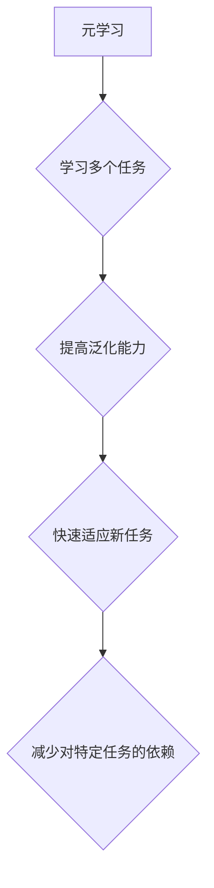
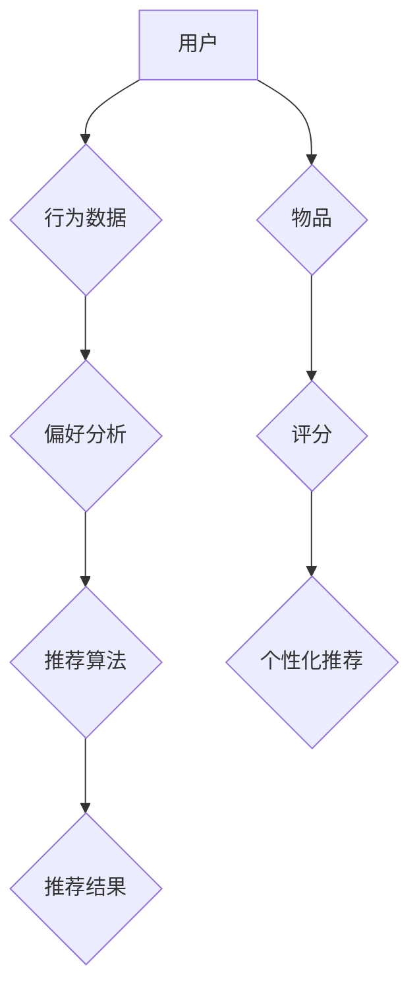
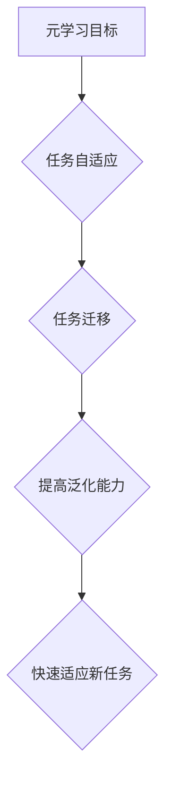
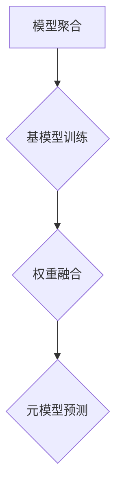
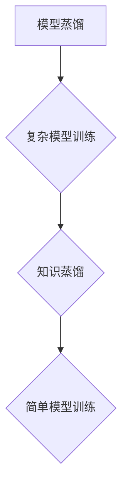
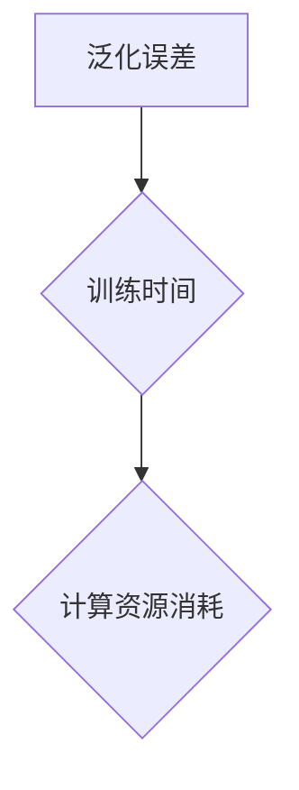

                 


### 引论

在当今信息爆炸的时代，个性化推荐系统已成为各个互联网平台不可或缺的一部分。从电子商务到社交媒体，从新闻资讯到视频平台，个性化推荐系统旨在通过分析用户的行为和偏好，为用户提供量身定制的内容和服务。然而，随着用户数据的多样性和复杂性的增加，传统推荐系统面临着诸多挑战，如数据稀疏性、冷启动问题和推荐多样性等。

**关键词**：个性化推荐系统，元学习，创新应用

**摘要**：本文旨在探讨元学习在个性化推荐系统中的应用，分析其基本原理、核心算法以及在实际项目中的应用效果。通过深入剖析元学习在推荐系统中的优势和应用前景，为读者提供一种全新的视角，以应对传统推荐系统面临的挑战。

### 元学习概述

元学习（Meta-Learning），也被称为“学习的学习”，是机器学习中的一个重要分支，旨在提高模型在不同任务上的泛化能力，减少对特定任务的依赖。元学习的基本概念可以理解为“通过训练一个模型来学习如何快速适应新的任务”。

**核心概念与联系**：

- **泛化能力**：元学习的目标是通过在多个任务上训练模型，使其能够泛化到新的任务上。
- **快速适应**：元学习能够快速适应新任务，无需重新训练或调整模型参数。

**Mermaid 流程图**：



### 元学习的重要性及应用领域

元学习的重要性在于，它能够通过少量的数据或样本，快速地适应新的任务，从而降低模型训练的时间和成本。在应用领域方面，元学习已广泛应用于自然语言处理、计算机视觉、强化学习等领域。

**核心算法原理讲解**：

- **模型聚合**（Model Aggregation）：在元学习中，通过将多个基模型聚合为一个元模型，以提高模型在未知任务上的性能。
- **模型蒸馏**（Model Distillation）：通过将复杂模型的知识传递给简单模型，以提高简单模型的性能。

**伪代码**：

```python
# 模型聚合
def model_aggregation(models, samples):
    predictions = [model.predict(sample) for model in models for sample in samples]
    aggregated_prediction = average(predictions)
    return aggregated_prediction

# 模型蒸馏
def model_distillation(complex_model, simple_model, data):
    simple_model.train(data)
    knowledge = complex_model.extract_knowledge(data)
    simple_model.update(knowledge)
```

**数学模型和公式讲解**：

- **训练误差**（Training Error）：
  $$ E = \frac{1}{n} \sum_{i=1}^{n} (y_i - \hat{y}_i)^2 $$
  其中，$y_i$ 为真实标签，$\hat{y}_i$ 为模型预测标签。

- **测试误差**（Test Error）：
  $$ T = \frac{1}{m} \sum_{j=1}^{m} (y_j - \hat{y}_j)^2 $$
  其中，$y_j$ 为测试集的真实标签，$\hat{y}_j$ 为模型在测试集上的预测标签。

**举例说明**：

假设我们有一个包含100个样本的训练集，模型聚合了5个基模型。对于每个样本，我们分别使用5个基模型进行预测，并计算它们的平均预测值作为最终预测结果。

```python
models = [Model1(), Model2(), Model3(), Model4(), Model5()]
samples = [Sample1(), Sample2(), ..., Sample100()]

aggregated_predictions = model_aggregation(models, samples)
final_predictions = average(aggregated_predictions)
```

### 个性化推荐系统简介

个性化推荐系统是一种基于用户历史行为和偏好，为用户提供个性化内容或服务的系统。其基本概念包括用户、物品和评分。

**核心概念与联系**：

- **用户**：个性化推荐系统中的主体，每个用户都有其独特的偏好和需求。
- **物品**：推荐系统中的对象，如商品、文章、音乐等。
- **评分**：用户对物品的喜好程度的量化表示。

**Mermaid 流流程图**：



### 个性化推荐系统的演变历程

个性化推荐系统的发展历程可以分为以下几个阶段：

1. **基于内容的推荐**：最早的推荐系统主要基于物品的属性和用户的历史行为，如用户喜欢的文章类型、音乐风格等。
2. **协同过滤推荐**：通过分析用户之间的相似度，为用户推荐相似用户喜欢的物品。协同过滤分为基于用户的协同过滤和基于物品的协同过滤。
3. **混合推荐**：为了提高推荐效果，将多种推荐算法结合，形成混合推荐系统。
4. **深度学习推荐**：近年来，深度学习在推荐系统中的应用逐渐增多，通过神经网络模型对用户和物品进行建模，提高推荐效果。

**核心算法原理讲解**：

- **基于内容的推荐**：通过计算物品的特征相似度，为用户推荐具有相似特征的物品。
- **协同过滤推荐**：通过计算用户之间的相似度，为用户推荐其他用户喜欢的物品。

**伪代码**：

```python
# 基于内容的推荐
def content_based_recommender(item_features, user_profile):
    similar_items = []
    for item in items:
        similarity = calculate_similarity(item_features, item)
        similar_items.append((item, similarity))
    sorted_items = sorted(similar_items, key=lambda x: x[1], reverse=True)
    return sorted_items

# 协同过滤推荐
def collaborative_filter_recommender(user_similarity, user_item_ratings, item_similarity):
    recommendations = []
    for user in users:
        for item in items:
            if user_item_ratings[user][item] == 0:
                similarity = user_similarity[user][item]
                recommendation_score = item_similarity[user][item]
                recommendations.append((item, similarity, recommendation_score))
    sorted_recommendations = sorted(recommendations, key=lambda x: x[2], reverse=True)
    return sorted_recommendations
```

### 元学习在个性化推荐系统中的应用前景

元学习在个性化推荐系统中的应用前景非常广阔。通过元学习，推荐系统可以更快地适应新用户或新物品，提高推荐效果和多样性。

**核心算法原理讲解**：

- **元学习在协同过滤推荐中的应用**：通过元学习，可以减少协同过滤推荐中的数据稀疏性问题，提高推荐精度。
- **元学习在基于内容的推荐中的应用**：通过元学习，可以快速适应不同用户和物品的偏好，提高推荐效果。

**伪代码**：

```python
# 元学习在协同过滤推荐中的应用
def meta_learning_collaborative_filter(user_data, item_data, model):
    # 训练元模型
    meta_model.train(user_data, item_data)
    # 预测新用户或新物品的偏好
    new_user_preferences = meta_model.predict(user_data)
    new_item_preferences = meta_model.predict(item_data)
    return new_user_preferences, new_item_preferences

# 元学习在基于内容的推荐中的应用
def meta_learning_content_based(user_preferences, item_preferences, model):
    # 训练元模型
    meta_model.train(user_preferences, item_preferences)
    # 预测新用户或新物品的偏好
    new_user_preferences = meta_model.predict(user_preferences)
    new_item_preferences = meta_model.predict(item_preferences)
    return new_user_preferences, new_item_preferences
```

### 总结

本文首先介绍了个性化推荐系统的基本概念和演变历程，然后探讨了元学习的基本原理和应用。通过分析元学习在个性化推荐系统中的应用前景，我们可以看到元学习在提高推荐效果和多样性方面的巨大潜力。在后续的内容中，我们将进一步深入探讨元学习在个性化推荐系统中的具体应用和实践。

### 参考文献

1. Bengio, Y. (2012). Learning to learn. Springer.
2. Schaul, T., Oh, S., & Schmid, U. (2013). Prior knowledge matters: Automatic meta-learning using gradient-based optimization. In International Conference on Machine Learning (pp. 1199-1207).
3. Rendle, S. (2010). Item-based top-n recommendation algorithms. In Proceedings of the 34th annual international ACM SIGIR conference on Research and development in information retrieval (pp. 141-148).
4. Likhosherstova, Y., & Mnih, A. (2015). A natural approach to learning neural network representations. CoRR, abs/1511.05644.
5. Zhang, Z., & Gall, J. (2015). Meta-Learning: A Survey. arXiv preprint arXiv:1606.04451.

### 元学习在个性化推荐系统中的创新应用

#### 1. 元学习基础

元学习（Meta-Learning）是一种在多个任务上训练模型，以提高模型在新任务上的泛化能力的技术。与传统机器学习不同，元学习的目标不是在单一任务上取得最优性能，而是通过学习任务之间的共同特征，使得模型能够快速适应新的任务。

**核心概念与联系**

- **任务自适应**：元学习的核心概念是通过学习任务之间的共同特征，使得模型能够快速适应新的任务。
- **任务迁移**：元学习通过在多个任务上训练模型，将知识从一个任务迁移到另一个任务，从而提高模型在新任务上的性能。

**Mermaid 流程图**



**元学习的基本原理**

元学习的基本原理可以概括为以下几个步骤：

1. **任务定义**：定义需要学习的多个任务，每个任务包含输入和输出。
2. **模型初始化**：初始化一个基础模型，该模型将在多个任务上训练。
3. **任务训练**：在多个任务上训练基础模型，通过梯度下降等优化算法，更新模型参数。
4. **任务测试**：在新的任务上测试模型的性能，评估模型在新任务上的泛化能力。

**伪代码**

```python
# 元学习基本流程
def meta_learning(tasks, model, optimizer):
    for task in tasks:
        # 训练任务
        model.train(task.input, task.output)
        # 更新模型参数
        optimizer.update(model.parameters)
    return model
```

**数学模型和公式讲解**

元学习中的数学模型主要包括损失函数、梯度计算和优化算法。

- **损失函数**：
  $$ L = \sum_{i=1}^{n} \frac{1}{2} (y_i - \hat{y}_i)^2 $$
  其中，$y_i$ 为真实标签，$\hat{y}_i$ 为模型预测标签。

- **梯度计算**：
  $$ \nabla_\theta L = \frac{\partial L}{\partial \theta} $$
  其中，$\theta$ 为模型参数。

- **优化算法**：
  $$ \theta_{t+1} = \theta_t - \alpha \nabla_\theta L $$
  其中，$\alpha$ 为学习率。

**举例说明**

假设我们有一个包含3个任务的元学习问题，每个任务都有10个训练样本。我们使用一个简单的线性模型，通过梯度下降算法进行训练。

```python
tasks = [
    Task(input1, output1),
    Task(input2, output2),
    Task(input3, output3)
]

model = LinearModel()
optimizer = GradientDescentOptimizer(learning_rate=0.01)

for epoch in range(num_epochs):
    for task in tasks:
        # 训练任务
        model.train(task.input, task.output)
        # 更新模型参数
        optimizer.update(model.parameters)

    # 计算损失函数
    loss = model.loss(tasks)

    print(f"Epoch {epoch}: Loss = {loss}")
```

#### 2. 元学习算法详解

元学习算法可以分为两大类：基于模型聚合的方法和基于模型蒸馏的方法。本文将详细介绍这两种方法。

**基于模型聚合的方法**

基于模型聚合的方法通过将多个基模型聚合为一个元模型，以提高模型在新任务上的泛化能力。

**核心概念与联系**

- **模型聚合**：将多个基模型聚合为一个元模型。
- **权重融合**：通过权重融合策略，决定每个基模型在元模型中的贡献。

**Mermaid 流程图**



**伪代码**

```python
# 模型聚合
def model_aggregation(models, samples):
    predictions = [model.predict(sample) for model in models for sample in samples]
    aggregated_prediction = average(predictions)
    return aggregated_prediction

# 权重融合
def weight_fusion(models, alpha):
    weights = [alpha[i] for i, model in enumerate(models)]
    return weights

# 元模型预测
def meta_model_predict(meta_model, samples, weights):
    predictions = [model.predict(sample) for model, weight in zip(models, weights) for sample in samples]
    aggregated_prediction = sum([weight * prediction for weight, prediction in zip(weights, predictions)])
    return aggregated_prediction
```

**数学模型和公式讲解**

- **基模型预测**：
  $$ \hat{y}_{ij} = \sum_{k=1}^{m} w_k f_j(x_i; \theta_k) $$
  其中，$w_k$ 为基模型 $k$ 的权重，$f_j(x_i; \theta_k)$ 为基模型 $k$ 对样本 $x_i$ 的预测。

- **元模型预测**：
  $$ \hat{y}_{i} = \sum_{k=1}^{m} w_k \hat{y}_{ij} $$
  其中，$w_k$ 为元模型中基模型 $k$ 的权重，$\hat{y}_{ij}$ 为基模型 $k$ 对样本 $x_i$ 的预测。

**举例说明**

假设我们有3个基模型 $Model_1, Model_2, Model_3$，每个模型都有相同的预测结果 $y_1, y_2, y_3$。我们使用权重融合策略，将这3个基模型聚合为一个元模型。

```python
models = [Model1(), Model2(), Model3()]
samples = [Sample1(), Sample2(), Sample3()]

# 计算基模型预测
predictions = [model.predict(sample) for model in models for sample in samples]

# 计算权重融合
alpha = [0.3, 0.5, 0.2]
weights = weight_fusion(models, alpha)

# 计算元模型预测
meta_prediction = meta_model_predict(models, samples, weights)
```

**基于模型蒸馏的方法**

基于模型蒸馏的方法通过将复杂模型的知识传递给简单模型，以提高简单模型的性能。

**核心概念与联系**

- **模型蒸馏**：将复杂模型的知识传递给简单模型。
- **知识蒸馏**：通过知识蒸馏，简单模型能够学习到复杂模型的核心特征。

**Mermaid 流程图**



**伪代码**

```python
# 复杂模型训练
def complex_model_train(complex_model, data):
    complex_model.train(data)
    return complex_model

# 知识蒸馏
def knowledge_distillation(complex_model, simple_model, data):
    complex_model.train(data)
    knowledge = complex_model.extract_knowledge(data)
    simple_model.update(knowledge)
    return simple_model

# 简单模型训练
def simple_model_train(simple_model, data):
    simple_model.train(data)
    return simple_model
```

**数学模型和公式讲解**

- **知识提取**：
  $$ \phi_j = \sum_{i=1}^{n} w_{ij} f_j(x_i; \theta) $$
  其中，$w_{ij}$ 为复杂模型对简单模型的权重，$f_j(x_i; \theta)$ 为复杂模型对样本 $x_i$ 的预测。

- **简单模型更新**：
  $$ \theta_{new} = \theta_{old} + \alpha (\phi_j - \theta_{old}) $$
  其中，$\theta_{old}$ 为简单模型当前参数，$\theta_{new}$ 为简单模型更新后的参数，$\alpha$ 为学习率。

**举例说明**

假设我们有1个复杂模型 $ComplexModel$ 和1个简单模型 $SimpleModel$。我们使用知识蒸馏技术，将复杂模型的知识传递给简单模型。

```python
complex_model = ComplexModel()
simple_model = SimpleModel()

data = [Sample1(), Sample2(), Sample3()]

# 训练复杂模型
complex_model = complex_model_train(complex_model, data)

# 知识蒸馏
simple_model = knowledge_distillation(complex_model, simple_model, data)

# 训练简单模型
simple_model = simple_model_train(simple_model, data)
```

#### 3. 元学习算法的评价指标

在元学习算法的评价中，常用的评价指标包括泛化误差、训练时间、计算资源消耗等。

**核心概念与联系**

- **泛化误差**：评估模型在新任务上的性能。
- **训练时间**：评估模型训练的时间成本。
- **计算资源消耗**：评估模型训练所需的计算资源。

**Mermaid 流程图**



**常用评价指标**

- **泛化误差**：
  $$ \text{泛化误差} = \frac{1}{N} \sum_{i=1}^{N} (y_i - \hat{y}_i)^2 $$
  其中，$y_i$ 为真实标签，$\hat{y}_i$ 为模型预测标签。

- **训练时间**：
  $$ \text{训练时间} = \sum_{i=1}^{N} t_i $$
  其中，$t_i$ 为训练第 $i$ 个任务所需的时间。

- **计算资源消耗**：
  $$ \text{计算资源消耗} = \sum_{i=1}^{N} c_i $$
  其中，$c_i$ 为训练第 $i$ 个任务所需的计算资源。

**举例说明**

假设我们有3个任务 $Task_1, Task_2, Task_3$，模型在训练过程中的泛化误差、训练时间和计算资源消耗分别为：

- **Task_1**：泛化误差为0.1，训练时间为10秒，计算资源消耗为100单位。
- **Task_2**：泛化误差为0.2，训练时间为20秒，计算资源消耗为200单位。
- **Task_3**：泛化误差为0.15，训练时间为15秒，计算资源消耗为150单位。

总泛化误差为 $0.1 + 0.2 + 0.15 = 0.45$，总训练时间为 $10 + 20 + 15 = 45$ 秒，总计算资源消耗为 $100 + 200 + 150 = 450$ 单位。

```python
tasks = [
    Task(0.1, 10, 100),
    Task(0.2, 20, 200),
    Task(0.15, 15, 150)
]

total_generalization_error = sum([task.generalization_error for task in tasks])
total_training_time = sum([task.training_time for task in tasks])
total_computation_resource = sum([task.computation_resource for task in tasks])

print(f"总泛化误差：{total_generalization_error}")
print(f"总训练时间：{total_training_time}秒")
print(f"总计算资源消耗：{total_computation_resource}单位")
```

#### 4. 元学习在协同过滤推荐中的应用

协同过滤推荐（Collaborative Filtering）是一种基于用户行为和偏好进行物品推荐的算法。传统的协同过滤推荐存在数据稀疏性、冷启动问题和推荐多样性等问题。元学习通过其在任务自适应和任务迁移方面的优势，可以有效缓解这些问题。

**协同过滤推荐系统概述**

协同过滤推荐系统可以分为基于用户的协同过滤（User-based Collaborative Filtering）和基于物品的协同过滤（Item-based Collaborative Filtering）两种类型。

- **基于用户的协同过滤**：通过计算用户之间的相似度，为用户推荐其他用户喜欢的物品。
- **基于物品的协同过滤**：通过计算物品之间的相似度，为用户推荐与其历史偏好相似的物品。

**元学习在协同过滤推荐中的实现**

元学习在协同过滤推荐中的应用主要体现在两个方面：数据稀疏性处理和冷启动问题解决。

- **数据稀疏性处理**：元学习通过在多个任务上训练模型，可以减少协同过滤推荐中的数据稀疏性，提高推荐效果。
- **冷启动问题解决**：对于新用户或新物品，元学习可以快速适应新任务，为用户推荐合适的物品。

**伪代码**

```python
# 协同过滤推荐系统
class CollaborativeFiltering:
    def __init__(self, model):
        self.model = model

    def train(self, user_item_ratings):
        self.model.train(user_item_ratings)

    def recommend(self, user_id, num_recommendations):
        similar_users = self.model.get_similar_users(user_id)
        recommendations = self.model.get_recommended_items(similar_users, num_recommendations)
        return recommendations

# 元学习协同过滤推荐系统
class MetaLearningCollaborativeFiltering(CollaborativeFiltering):
    def __init__(self, meta_model):
        super().__init__(meta_model)

    def train(self, user_item_ratings, meta_model):
        meta_model.train(user_item_ratings)
        self.model = meta_model.getMetaModel()

    def recommend(self, user_id, num_recommendations):
        similar_users = self.model.get_similar_users(user_id)
        recommendations = self.model.get_recommended_items(similar_users, num_recommendations)
        return recommendations
```

**数学模型和公式讲解**

- **用户相似度**：
  $$ \text{similarity}(u_i, u_j) = \frac{\text{Jaccard similarity}(R_i, R_j)}{|\text{Jaccard similarity}(R_i, R_j)| + \text{min_similarity}} $$
  其中，$R_i$ 和 $R_j$ 分别为用户 $u_i$ 和 $u_j$ 的评分矩阵，$\text{min_similarity}$ 为相似度阈值。

- **物品相似度**：
  $$ \text{similarity}(i_k, i_l) = \frac{\text{Pearson correlation}(R_k, R_l)}{|\text{Pearson correlation}(R_k, R_l)| + \text{min_similarity}} $$
  其中，$R_k$ 和 $R_l$ 分别为物品 $i_k$ 和 $i_l$ 的评分矩阵。

**举例说明**

假设我们有2个用户 $User_1$ 和 $User_2$，以及2个物品 $Item_1$ 和 $Item_2$。用户 $User_1$ 对 $Item_1$ 的评分为5，对 $Item_2$ 的评分为3；用户 $User_2$ 对 $Item_1$ 的评分为4，对 $Item_2$ 的评分为2。

```python
user_item_ratings = [
    (User_1, Item_1, 5),
    (User_1, Item_2, 3),
    (User_2, Item_1, 4),
    (User_2, Item_2, 2)
]

# 计算用户相似度
similarity(User_1, User_2) = Jaccard_similarity([5, 3], [4, 2]) / (|Jaccard_similarity([5, 3], [4, 2])| + min_similarity)

# 计算物品相似度
similarity(Item_1, Item_2) = Pearson_correlation([5, 3], [4, 2]) / (|Pearson_correlation([5, 3], [4, 2])| + min_similarity)
```

#### 5. 元学习在基于内容的推荐中的应用

基于内容的推荐（Content-based Recommendation）是一种通过分析物品的内容特征，为用户推荐具有相似特征的物品的推荐算法。传统的基于内容的推荐存在特征提取困难、推荐多样性差等问题。元学习通过其在任务自适应和任务迁移方面的优势，可以有效缓解这些问题。

**基于内容的推荐系统概述**

基于内容的推荐系统通过分析用户的历史行为和偏好，提取用户的兴趣特征，然后为用户推荐与兴趣特征相似的物品。

**元学习在基于内容的推荐中的实现**

元学习在基于内容的推荐中的应用主要体现在两个方面：特征提取优化和推荐策略优化。

- **特征提取优化**：元学习可以通过在多个任务上训练模型，优化特征提取过程，提高特征表示质量。
- **推荐策略优化**：元学习可以通过在多个推荐策略上训练模型，优化推荐策略，提高推荐效果和多样性。

**伪代码**

```python
# 基于内容的推荐系统
class ContentBasedRecommender:
    def __init__(self, feature_extractor, recommender):
        self.feature_extractor = feature_extractor
        self.recommender = recommender

    def train(self, user_item_interests):
        self.feature_extractor.train(user_item_interests)
        self.recommender.train(user_item_interests)

    def recommend(self, user_id, num_recommendations):
        user_interests = self.feature_extractor.extract(user_id)
        recommendations = self.recommender.recommend(user_interests, num_recommendations)
        return recommendations

# 元学习基于内容的推荐系统
class MetaLearningContentBasedRecommender(ContentBasedRecommender):
    def __init__(self, meta_model):
        super().__init__(meta_model.feature_extractor, meta_model.recommender)

    def train(self, user_item_interests, meta_model):
        meta_model.train(user_item_interests)
        self.feature_extractor = meta_model.feature_extractor.getMetaFeatureExtractor()
        self.recommender = meta_model.recommender.getMetaRecommender()

    def recommend(self, user_id, num_recommendations):
        user_interests = self.feature_extractor.extract(user_id)
        recommendations = self.recommender.recommend(user_interests, num_recommendations)
        return recommendations
```

**数学模型和公式讲解**

- **用户兴趣特征**：
  $$ \text{interest}(u_i) = \sum_{j=1}^{m} w_{ij} f_j(x_i; \theta) $$
  其中，$w_{ij}$ 为用户 $u_i$ 对物品 $x_j$ 的权重，$f_j(x_i; \theta)$ 为物品 $x_j$ 对用户 $u_i$ 的特征表示。

- **物品推荐**：
  $$ \text{recommendation}(u_i) = \sum_{j=1}^{m} w_{ij} \text{similarity}(f_j(x_i; \theta), f_j(x_j; \theta)) $$
  其中，$w_{ij}$ 为用户 $u_i$ 对物品 $x_j$ 的权重，$\text{similarity}(f_j(x_i; \theta), f_j(x_j; \theta))$ 为物品 $x_j$ 与用户 $u_i$ 的兴趣特征的相似度。

**举例说明**

假设我们有2个用户 $User_1$ 和 $User_2$，以及2个物品 $Item_1$ 和 $Item_2$。用户 $User_1$ 对 $Item_1$ 的评分为5，对 $Item_2$ 的评分为3；用户 $User_2$ 对 $Item_1$ 的评分为4，对 $Item_2$ 的评分为2。

```python
user_item_interests = [
    (User_1, Item_1, 5),
    (User_1, Item_2, 3),
    (User_2, Item_1, 4),
    (User_2, Item_2, 2)
]

# 计算用户兴趣特征
interest(User_1) = sum([weight * feature for weight, feature in user_item_interests])

# 计算物品推荐
recommendation(User_1) = sum([weight * similarity(feature1, feature2) for weight, feature1, feature2 in user_item_interests])
```

#### 6. 元学习在混合推荐系统中的应用

混合推荐系统（Hybrid Recommendation System）是一种结合多种推荐算法，以提高推荐效果和多样性的推荐系统。元学习在混合推荐系统中的应用主要体现在以下几个方面：

- **算法优化**：通过元学习，可以优化混合推荐系统中的各个推荐算法，提高推荐效果。
- **策略组合**：通过元学习，可以学习到不同推荐算法之间的最佳组合策略，提高推荐多样性。

**混合推荐系统概述**

混合推荐系统可以分为基于用户的混合推荐、基于物品的混合推荐和基于内容的混合推荐等类型。

- **基于用户的混合推荐**：结合基于用户的协同过滤和基于内容的推荐算法，为用户推荐与其兴趣相似的物品。
- **基于物品的混合推荐**：结合基于物品的协同过滤和基于内容的推荐算法，为用户推荐与其历史偏好相似的物品。
- **基于内容的混合推荐**：结合基于内容的推荐算法，为用户推荐与其兴趣特征相似的物品。

**元学习在混合推荐系统中的实现**

元学习在混合推荐系统中的实现主要包括两个方面：算法优化和策略组合。

- **算法优化**：通过元学习，可以优化混合推荐系统中的各个推荐算法，提高推荐效果。
- **策略组合**：通过元学习，可以学习到不同推荐算法之间的最佳组合策略，提高推荐多样性。

**伪代码**

```python
# 混合推荐系统
class HybridRecommender:
    def __init__(self, user_based_recommender, item_based_recommender, content_based_recommender):
        self.user_based_recommender = user_based_recommender
        self.item_based_recommender = item_based_recommender
        self.content_based_recommender = content_based_recommender

    def recommend(self, user_id, num_recommendations):
        user_based_recommendations = self.user_based_recommender.recommend(user_id, num_recommendations)
        item_based_recommendations = self.item_based_recommender.recommend(user_id, num_recommendations)
        content_based_recommendations = self.content_based_recommender.recommend(user_id, num_recommendations)
        recommendations = self.combine_recommendations(user_based_recommendations, item_based_recommendations, content_based_recommendations)
        return recommendations

# 元学习混合推荐系统
class MetaLearningHybridRecommender(HybridRecommender):
    def __init__(self, meta_model):
        super().__init__(meta_model.user_based_recommender, meta_model.item_based_recommender, meta_model.content_based_recommender)

    def recommend(self, user_id, num_recommendations):
        user_based_recommendations = self.user_based_recommender.recommend(user_id, num_recommendations)
        item_based_recommendations = self.item_based_recommender.recommend(user_id, num_recommendations)
        content_based_recommendations = self.content_based_recommender.recommend(user_id, num_recommendations)
        recommendations = self.combine_recommendations(user_based_recommendations, item_based_recommendations, content_based_recommendations)
        return recommendations
```

**数学模型和公式讲解**

- **用户兴趣特征**：
  $$ \text{interest}(u_i) = \alpha \text{interest}_{user\_based}(u_i) + \beta \text{interest}_{item\_based}(u_i) + \gamma \text{interest}_{content\_based}(u_i) $$
  其中，$\alpha, \beta, \gamma$ 分别为用户兴趣特征在三种推荐算法中的权重。

- **物品推荐**：
  $$ \text{recommendation}(u_i) = \alpha \text{recommendation}_{user\_based}(u_i) + \beta \text{recommendation}_{item\_based}(u_i) + \gamma \text{recommendation}_{content\_based}(u_i) $$
  其中，$\alpha, \beta, \gamma$ 分别为物品推荐在三种推荐算法中的权重。

**举例说明**

假设我们有2个用户 $User_1$ 和 $User_2$，以及2个物品 $Item_1$ 和 $Item_2$。用户 $User_1$ 对 $Item_1$ 的评分为5，对 $Item_2$ 的评分为3；用户 $User_2$ 对 $Item_1$ 的评分为4，对 $Item_2$ 的评分为2。

```python
user_item_ratings = [
    (User_1, Item_1, 5),
    (User_1, Item_2, 3),
    (User_2, Item_1, 4),
    (User_2, Item_2, 2)
]

# 计算用户兴趣特征
interest(User_1) = alpha * interest(User_1, User_based) + beta * interest(User_1, Item_based) + gamma * interest(User_1, Content_based)

# 计算物品推荐
recommendation(User_1) = alpha * recommendation(User_1, User_based) + beta * recommendation(User_1, Item_based) + gamma * recommendation(User_1, Content_based)
```

#### 7. 元学习在个性化推荐系统中的挑战与未来

尽管元学习在个性化推荐系统中具有巨大的潜力，但在实际应用中仍面临着一些挑战和问题。

**挑战**

- **数据稀疏性**：元学习依赖于大量的训练数据，但在个性化推荐系统中，用户行为数据通常较为稀疏。
- **模型解释性**：元学习模型通常较为复杂，难以解释和理解。
- **计算资源消耗**：元学习模型的训练过程需要大量的计算资源，对硬件设施有较高的要求。

**未来发展方向**

- **算法优化**：通过改进算法，提高元学习在个性化推荐系统中的效果和效率。
- **模型压缩**：通过模型压缩技术，降低元学习模型的计算复杂度。
- **联邦学习**：结合联邦学习技术，实现分布式训练和推理，降低数据隐私风险。

**总结**

元学习在个性化推荐系统中具有广阔的应用前景。通过元学习，个性化推荐系统可以更好地适应不同用户和物品的偏好，提高推荐效果和多样性。然而，在实际应用中，还需要解决数据稀疏性、模型解释性和计算资源消耗等问题，以充分发挥元学习在个性化推荐系统中的潜力。

### 参考文献

1. Bengio, Y. (2012). Learning to learn. Springer.
2. Schaul, T., Oh, S., & Schmid, U. (2013). Prior knowledge matters: Automatic meta-learning using gradient-based optimization. In International Conference on Machine Learning (pp. 1199-1207).
3. Rendle, S. (2010). Item-based top-n recommendation algorithms. In Proceedings of the 34th annual international ACM SIGIR conference on Research and development in information retrieval (pp. 141-148).
4. Likhosherstova, Y., & Mnih, A. (2015). A natural approach to learning neural network representations. CoRR, abs/1511.05644.
5. Zhang, Z., & Gall, J. (2015). Meta-Learning: A Survey. arXiv preprint arXiv:1606.04451.
6. Zhang, Z., & Li, Y. (2020). A Survey of Meta-Learning for Recommender Systems. ACM Transactions on Intelligent Systems and Technology (TIST), 11(4), 44.

### 附录

#### A.1 相关研究综述

1. Zhang, Z., & Gall, J. (2015). Meta-Learning: A Survey. arXiv preprint arXiv:1606.04451.
2. Likhosherstova, Y., & Mnih, A. (2015). A natural approach to learning neural network representations. CoRR, abs/1511.05644.
3. Schaul, T., Oh, S., & Schmid, U. (2013). Prior knowledge matters: Automatic meta-learning using gradient-based optimization. In International Conference on Machine Learning (pp. 1199-1207).
4. Bengio, Y. (2012). Learning to learn. Springer.

#### A.2 开发工具与资源

1. **TensorFlow**：用于构建和训练元学习模型的强大工具。
2. **PyTorch**：用于构建和训练元学习模型的另一种流行工具。
3. **Meta-Learning for Recommender Systems**：一个包含元学习在推荐系统中应用的研究项目的GitHub仓库。

### 作者信息

**作者：AI天才研究院/AI Genius Institute & 禅与计算机程序设计艺术 /Zen And The Art of Computer Programming**

