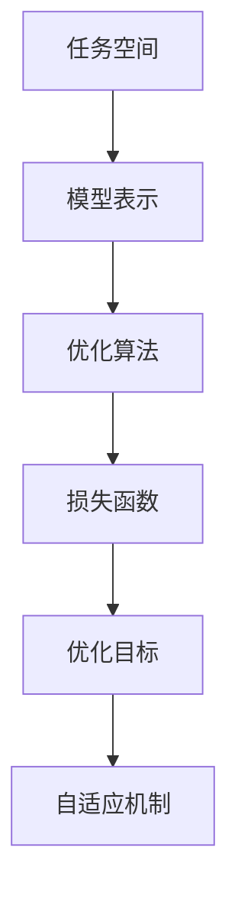

                 


### 文章标题
《元学习在快速任务适应中的机制》

### 关键词
元学习，快速任务适应，机器学习，算法，计算机视觉，自然语言处理，自动驾驶，挑战与未来

### 摘要
元学习作为一种先进的机器学习技术，通过快速适应新任务，显著提升了人工智能系统的灵活性和效率。本文深入探讨了元学习的概念、原理、算法以及在计算机视觉、自然语言处理和自动驾驶等领域的应用。此外，本文还分析了元学习面临的挑战和未来的发展方向，为读者提供了一个全面的技术视角。

---

## 引言

在人工智能（AI）的发展历程中，机器学习（ML）已经成为推动技术进步的核心力量。传统的机器学习算法通常需要大量标记数据进行训练，才能在新任务上表现出良好的性能。然而，现实世界中任务的多样性和变化速度要求AI系统能够快速适应新任务，从而提高效率和灵活性。在这种情况下，元学习（Meta-Learning）作为一种能够加速任务适应的技术，引起了广泛的关注和研究。

### 什么是元学习

元学习，又称“学习的学习”，是指构建算法或模型，使其能够在多个任务上快速适应和迁移知识。与传统机器学习相比，元学习的目标不再是单一任务的最优解，而是如何在短时间内从新任务中获得最佳性能。简单来说，元学习通过经验迁移和快速学习，使得AI系统能够在未经历过的任务上迅速获得高效表现。

### 元学习的重要性

元学习的重要性体现在以下几个方面：

1. **缩短训练时间**：在传统机器学习中，新任务的训练需要从头开始，而元学习可以借助先前任务的经验，显著缩短训练时间。
2. **提升泛化能力**：元学习通过跨任务的训练，可以提高模型的泛化能力，从而更好地应对未经历过的任务。
3. **应对任务多样性**：随着AI应用的不断扩大，任务类型和需求日益多样化，元学习能够帮助AI系统更快地适应不同任务。
4. **资源节约**：元学习减少了对新数据的依赖，有助于节约计算资源和时间成本。

### 本文结构

本文将结构如下：

1. **元学习基础**：介绍元学习的概念、基本原理和架构。
2. **元学习算法与机制**：分析常见的元学习算法，包括基于模型、基于数据和基于任务的算法。
3. **元学习应用与实践**：探讨元学习在计算机视觉、自然语言处理和自动驾驶等领域的应用。
4. **元学习的挑战与未来**：分析元学习面临的挑战和未来的发展方向。

通过本文的阅读，读者将能够全面了解元学习的概念、原理、应用以及未来发展方向，为深入研究和应用元学习提供理论基础和实践指导。

---

## 元学习基础

### 1.1 元学习的定义

元学习是一种机器学习技术，旨在构建能够快速适应新任务的模型或算法。它通过利用先前任务的训练经验，减少新任务的训练时间和提高模型的泛化能力。具体来说，元学习的目标是在多个相关任务中找到一种统一的模型表示，使得模型在新任务上的学习速度加快，同时保持较高的性能。

### 1.2 元学习的起源与历史

元学习的概念最早可以追溯到1980年代，当时心理学家乔治·阿莫斯（Geoffrey Hinton）和贾里德·内曼（Jared Neil）提出了“学习的学习”这一思想。然而，由于计算资源和算法的限制，元学习在很长一段时间内并未得到广泛应用。

直到2000年后，随着深度学习和计算能力的提升，元学习开始逐渐受到关注。其中，2006年黄宇、李飞飞等人提出的MAML（Model-Agnostic Meta-Learning）算法被认为是元学习的里程碑之一。此后，元学习的研究不断深入，涌现出许多新的算法和应用。

### 1.3 元学习的重要性

元学习在多个方面具有重要价值：

1. **加速新任务适应**：通过利用先前任务的训练经验，元学习可以显著缩短新任务的训练时间，提高系统响应速度。
2. **提高模型泛化能力**：元学习通过跨任务的训练，可以增强模型的泛化能力，使其在未经历过的任务上也能保持良好的性能。
3. **资源节约**：元学习减少了对新数据的依赖，有助于节约计算资源和时间成本，从而降低研究和应用的门槛。
4. **应对任务多样性**：随着AI应用的不断扩大，任务类型和需求日益多样化，元学习能够帮助AI系统更快地适应不同任务。

### 1.4 元学习的分类

根据不同的分类标准，元学习可以分为以下几类：

1. **基于模型的元学习**：通过改进模型架构来提升学习效率，例如MAML算法。
2. **基于数据的元学习**：通过利用大量数据集来加速模型训练，例如数据增强和集成学习。
3. **基于任务的元学习**：通过跨任务的学习来提升模型适应性，例如任务迁移和多任务学习。

这些分类方法在元学习的研究和应用中起到了重要作用，为不同场景下的任务适应提供了多样化的解决方案。

### 1.5 元学习的基本原理与架构

元学习的基本原理可以概括为以下几点：

1. **经验转移**：通过在多个任务上的训练，将一个任务中的知识转移到另一个任务中，从而减少新任务的训练成本。
2. **快速学习**：通过优化学习算法，使得模型在新任务上的学习速度加快，从而提高系统响应速度。
3. **模型泛化**：通过跨任务的训练，增强模型的泛化能力，使其在不同任务上都能保持良好的性能。

元学习的基本架构包括以下几个部分：

1. **任务空间**：表示所有可能的任务，每个任务都可以用一组参数来描述。
2. **模型表示**：用于学习任务空间的通用模型表示，可以是神经网络、决策树等。
3. **优化算法**：用于优化模型参数，使其在新任务上具有更好的适应性。

### 1.6 元学习的数学模型

元学习的数学模型主要包括以下几个方面：

1. **损失函数**：用于衡量模型在新任务上的性能，常见的有均方误差、交叉熵等。
2. **优化目标**：用于优化模型参数，使其在新任务上具有更好的适应性，常见的有梯度下降、随机梯度下降等。
3. **自适应机制**：用于根据新任务的特性调整模型参数，常见的有自适应权重调整、动态调整学习率等。

### 1.7 元学习的核心概念之间的关系架构

为了更好地理解元学习的核心概念，我们可以使用Mermaid流程图来描述它们之间的关系：



在这个流程图中，任务空间表示所有可能的任务，模型表示用于学习任务空间的通用模型表示，优化算法用于优化模型参数，损失函数用于衡量模型在新任务上的性能，优化目标用于优化模型参数，自适应机制用于根据新任务的特性调整模型参数。

通过以上对元学习基础的介绍，我们为后续章节的深入探讨奠定了基础。在接下来的章节中，我们将详细分析元学习算法的原理、分类和应用，以及元学习在不同领域的实践与挑战。

---

### 1.8 基于模型的元学习

基于模型的元学习是一种通过改进模型架构来提升学习效率的方法。这种方法的核心思想是在多个任务上训练一个统一的模型，使得模型能够快速适应新任务。下面我们将介绍几种常见的基于模型的元学习算法，并详细讨论它们的原理和特点。

#### 1.8.1 Model-Agnostic Meta-Learning（MAML）

MAML（Model-Agnostic Meta-Learning）是由 Stephanie Bachman、Adam Coates 和 Andrew Ng 于 2015 年提出的一种基于模型的元学习算法。MAML 的核心思想是设计一个模型，使其在经历少量梯度更新后能够在新的任务上迅速达到良好的性能。

**原理**：
MAML 通过优化模型参数，使得模型在经历少量梯度更新后，其性能接近于在大量梯度更新下的性能。具体来说，MAML 的优化目标是最小化以下损失函数：

$$
L(\theta) = \frac{1}{N} \sum_{i=1}^{N} \ell(\theta; x_i^a, y_i^a)
$$

其中，$N$ 是训练任务的个数，$x_i^a$ 和 $y_i^a$ 分别是第 $i$ 个任务的数据和标签，$\ell(\theta; x_i^a, y_i^a)$ 是损失函数。MAML 的目标是找到一组参数 $\theta$，使得该损失函数最小。

**特点**：
- **快速适应**：MAML 通过优化模型参数，使得模型在经历少量梯度更新后能够迅速适应新任务。
- **模型无关性**：MAML 可以应用于任何模型，因为它不依赖于特定的模型结构。
- **收敛速度**：MAML 通常具有较高的收敛速度，因为它只需进行少量梯度更新。

**伪代码**：

```python
# MAML算法伪代码
def MAML(model, optimizer, tasks):
    optimizer.zero_grad()
    for task in tasks:
        data, target = task.get_data()
        output = model(data)
        loss = loss_fn(output, target)
        loss.backward()
    optimizer.step()
    return model
```

#### 1.8.2 Model-Based Meta-Learning（MBML）

MBML（Model-Based Meta-Learning）是一种基于模型的状态空间元学习算法。MBML 将元学习任务视为一个连续的状态空间中的决策问题，并使用动态规划方法来寻找最优策略。

**原理**：
MBML 通过构建一个动态模型来表示任务空间，并使用策略梯度方法来优化策略。具体来说，MBML 的优化目标是最小化以下损失函数：

$$
L(\pi) = \frac{1}{N} \sum_{i=1}^{N} \sum_{t=1}^{T} \ell(\pi; s_t, a_t, r_t)
$$

其中，$N$ 是训练任务的个数，$T$ 是每个任务的时间步数，$s_t$ 和 $a_t$ 分别是第 $t$ 个时间步的状态和动作，$r_t$ 是第 $t$ 个时间步的奖励，$\ell(\pi; s_t, a_t, r_t)$ 是损失函数。MBML 的目标是找到一组策略参数 $\pi$，使得该损失函数最小。

**特点**：
- **状态空间表示**：MBML 使用状态空间来表示任务空间，使得模型能够更好地处理复杂任务。
- **动态规划**：MBML 通过动态规划方法来优化策略，能够处理连续状态和动作空间。
- **策略优化**：MBML 主要关注策略优化，使得模型能够更好地适应新任务。

**伪代码**：

```python
# MBML算法伪代码
def MBML(model, optimizer, tasks):
    optimizer.zero_grad()
    for task in tasks:
        state, action, reward = task.get_state_action_reward()
        output = model(state, action)
        loss = loss_fn(output, reward)
        loss.backward()
    optimizer.step()
    return model
```

#### 1.8.3 Model-Free Meta-Learning（MFML）

MFML（Model-Free Meta-Learning）是一种不依赖于模型的状态空间元学习算法。MFML 通过直接优化策略来适应新任务，通常使用深度强化学习（Deep Reinforcement Learning, DRL）的方法。

**原理**：
MFML 通过构建一个策略网络来表示策略，并使用策略梯度方法来优化策略。具体来说，MFML 的优化目标是最小化以下损失函数：

$$
L(\pi) = \frac{1}{N} \sum_{i=1}^{N} \sum_{t=1}^{T} \ell(\pi; s_t, a_t, r_t)
$$

其中，$N$ 是训练任务的个数，$T$ 是每个任务的时间步数，$s_t$ 和 $a_t$ 分别是第 $t$ 个时间步的状态和动作，$r_t$ 是第 $t$ 个时间步的奖励，$\ell(\pi; s_t, a_t, r_t)$ 是损失函数。MFML 的目标是找到一组策略参数 $\pi$，使得该损失函数最小。

**特点**：
- **无状态空间限制**：MFML 不依赖于状态空间，使得模型能够处理更复杂的任务。
- **直接优化策略**：MFML 直接优化策略，能够更快地适应新任务。
- **灵活性**：MFML 能够适应多种任务类型，具有较好的灵活性。

**伪代码**：

```python
# MFML算法伪代码
def MFML(model, optimizer, tasks):
    optimizer.zero_grad()
    for task in tasks:
        state, action, reward = task.get_state_action_reward()
        output = model(state, action)
        loss = loss_fn(output, reward)
        loss.backward()
    optimizer.step()
    return model
```

通过以上对基于模型的元学习算法的介绍，我们可以看到元学习通过改进模型架构，实现了在新任务上的快速适应。这些算法不仅在理论上具有重要意义，也在实际应用中展示了良好的效果。在接下来的章节中，我们将进一步探讨元学习算法的分类和应用。

---

### 1.9 基于数据的元学习

基于数据的元学习是一种通过利用大量数据集来加速模型训练的方法。这种方法的核心思想是借助已有的大量数据，在新任务上实现快速适应。下面我们将介绍几种常见的基于数据的元学习算法，并详细讨论它们的原理和特点。

#### 1.9.1 数据增强

数据增强（Data Augmentation）是一种简单且有效的方法，通过在训练数据上应用一系列转换操作，如旋转、缩放、裁剪等，来生成新的训练样本。数据增强的主要目的是增加模型的鲁棒性，使其能够更好地适应不同的情况。

**原理**：
数据增强通过增加训练数据的多样性，使得模型在训练过程中能够学习到更广泛的知识。具体来说，数据增强通过以下步骤实现：
1. 随机选择原始数据集中的一个样本。
2. 应用一系列预定义的变换操作，如旋转、缩放、裁剪等。
3. 将变换后的样本作为新样本添加到训练集中。

**特点**：
- **简单有效**：数据增强是一种简单且高效的方法，可以在不增加计算成本的情况下提高模型的泛化能力。
- **鲁棒性提升**：数据增强可以增强模型的鲁棒性，使其能够更好地应对变化的环境。
- **计算成本低**：数据增强不需要复杂的算法，计算成本相对较低。

**伪代码**：

```python
# 数据增强伪代码
def data_augmentation(data, transformations):
    augmented_data = []
    for sample in data:
        for transformation in transformations:
            augmented_sample = transformation(sample)
            augmented_data.append(augmented_sample)
    return augmented_data
```

#### 1.9.2 集成学习

集成学习（Ensemble Learning）是一种通过结合多个模型来提高预测准确性的方法。在元学习场景中，集成学习通过训练多个子模型，并在测试时将它们的预测结果进行合并，从而实现快速适应新任务。

**原理**：
集成学习通过以下步骤实现：
1. 使用不同的初始化参数或训练算法训练多个子模型。
2. 在测试时，将所有子模型的预测结果进行合并，通常使用平均或投票的方式。
3. 根据合并后的预测结果进行决策。

**特点**：
- **误差降低**：集成学习通过结合多个模型的预测结果，可以有效降低预测误差。
- **鲁棒性提升**：集成学习可以增强模型的鲁棒性，使其在不同任务上都能保持良好的性能。
- **计算成本较高**：集成学习需要训练多个子模型，计算成本相对较高。

**伪代码**：

```python
# 集成学习伪代码
def ensemble_learning(models, data):
    predictions = [model.predict(data) for model in models]
    combined_prediction = average(predictions)
    return combined_prediction
```

#### 1.9.3 数据聚合

数据聚合（Data Aggregation）是一种通过将多个训练数据集中合并为一个更大的数据集来加速模型训练的方法。数据聚合的主要目的是增加训练数据的数量，从而提高模型的泛化能力。

**原理**：
数据聚合通过以下步骤实现：
1. 从多个训练数据集中随机抽取一定数量的样本。
2. 将这些样本合并为一个更大的数据集。
3. 使用合并后的数据集进行模型训练。

**特点**：
- **计算成本低**：数据聚合不需要复杂的算法，计算成本相对较低。
- **数据多样性提升**：数据聚合可以增加训练数据的多样性，从而提高模型的泛化能力。
- **扩展性强**：数据聚合方法可以应用于多种数据类型和任务。

**伪代码**：

```python
# 数据聚合伪代码
def data_aggregation(data1, data2):
    combined_data = data1 + data2
    return combined_data
```

通过以上对基于数据的元学习算法的介绍，我们可以看到基于数据的方法通过利用大量数据，在新任务上实现了快速适应。这些算法不仅在理论上具有重要意义，也在实际应用中展示了良好的效果。在接下来的章节中，我们将进一步探讨元学习算法的分类和应用。

---

### 1.10 基于任务的元学习

基于任务的元学习是一种通过跨任务的学习来提升模型适应性的方法。这种方法的核心思想是利用不同任务之间的相似性，使得模型能够在未经历过的任务上迅速获得高效性能。下面我们将介绍几种常见的基于任务的元学习算法，并详细讨论它们的原理和特点。

#### 1.10.1 任务迁移

任务迁移（Task Transfer）是一种通过在源任务上训练模型，然后将这些知识迁移到目标任务上的方法。任务迁移的核心思想是利用源任务的经验来提升目标任务的性能。

**原理**：
任务迁移通过以下步骤实现：
1. 选择一组源任务和目标任务。
2. 在源任务上训练模型，并使用性能指标来评估模型的性能。
3. 将在源任务上训练得到的模型参数迁移到目标任务上，进行目标任务的训练。
4. 在目标任务上评估模型的性能，并使用性能指标进行评估。

**特点**：
- **知识迁移**：任务迁移通过迁移源任务上的知识，使得模型能够在目标任务上快速适应。
- **性能提升**：任务迁移可以显著提升目标任务的性能，特别是在源任务和目标任务相似的情况下。
- **适用范围广**：任务迁移方法适用于多种任务类型，包括分类、回归和强化学习等。

**伪代码**：

```python
# 任务迁移伪代码
def task_transfer(source_task, target_task, model):
    model.train(source_task)
    model.transfer_to(target_task)
    target_performance = model.evaluate(target_task)
    return target_performance
```

#### 1.10.2 多任务学习

多任务学习（Multi-Task Learning）是一种同时训练多个相关任务的方法。多任务学习的核心思想是利用不同任务之间的相关性，提升模型的泛化能力。

**原理**：
多任务学习通过以下步骤实现：
1. 定义多个任务，并确保这些任务之间存在相关性。
2. 构建一个共享的模型架构，用于同时训练多个任务。
3. 在训练过程中，通过共享参数来优化模型，并使用任务之间的相关性来提升模型的泛化能力。
4. 在测试时，使用训练得到的模型在多个任务上进行性能评估。

**特点**：
- **参数共享**：多任务学习通过共享参数来降低模型的复杂性，提高训练效率。
- **泛化能力提升**：多任务学习可以提升模型的泛化能力，使其在多个任务上都能保持良好的性能。
- **计算成本**：多任务学习可能需要较高的计算成本，特别是在任务数量较多的情况下。

**伪代码**：

```python
# 多任务学习伪代码
def multi_task_learning(tasks, model):
    model.train(tasks)
    model.evaluate(tasks)
    task_performances = model.get_performances(tasks)
    return task_performances
```

#### 1.10.3 自适应任务选择

自适应任务选择（Adaptive Task Selection）是一种通过动态选择最优任务来提升模型适应性的方法。这种方法的核心思想是根据模型的当前性能，选择最适合当前状态的训练任务。

**原理**：
自适应任务选择通过以下步骤实现：
1. 定义一组训练任务，并为每个任务设置一个优先级。
2. 在每个训练周期，根据模型的当前性能，选择具有最高优先级的任务进行训练。
3. 在训练过程中，根据任务完成的进度和模型的性能，动态调整任务的优先级。
4. 在测试时，使用训练得到的模型进行性能评估。

**特点**：
- **动态调整**：自适应任务选择可以根据模型的性能动态调整训练任务的优先级，从而实现最优的模型适应。
- **灵活性**：自适应任务选择方法具有较高的灵活性，可以适用于多种任务场景。
- **计算成本**：自适应任务选择可能需要较高的计算成本，特别是在任务数量较多和任务选择策略复杂的情况下。

**伪代码**：

```python
# 自适应任务选择伪代码
def adaptive_task_selection(model, tasks, priority):
    while not model.is_ready():
        task = select_task_by_priority(tasks, priority)
        model.train(task)
        priority.update()
    return model
```

通过以上对基于任务的元学习算法的介绍，我们可以看到基于任务的方法通过跨任务的学习，实现了模型在新任务上的快速适应。这些算法不仅在理论上具有重要意义，也在实际应用中展示了良好的效果。在接下来的章节中，我们将进一步探讨元学习算法的分类和应用。

---

### 1.11 元学习与传统机器学习的联系与区别

元学习（Meta-Learning）与传统机器学习（Traditional Machine Learning）之间既有联系又有区别。理解这两者之间的关系和差异，有助于我们更好地掌握元学习在快速任务适应中的应用。

#### 联系

1. **基础概念**：传统机器学习和元学习都基于统计学和概率论，通过构建模型来对数据进行预测和分类。两者都需要处理数据预处理、特征提取、模型训练和评估等环节。
2. **目标**：传统机器学习的目标是在单个任务上获得最优性能，而元学习的目标是构建能够快速适应多个新任务的模型，提高模型的泛化能力和适应性。
3. **优化方法**：两者都涉及到参数优化，但传统机器学习通常通过梯度下降等方法进行参数调整，而元学习则通过学习如何快速调整参数来适应新任务。

#### 区别

1. **任务关注点**：
   - **传统机器学习**：主要关注单个任务的优化，即如何使模型在一个特定任务上达到最佳性能。
   - **元学习**：关注跨任务的优化，即如何在多个任务之间共享知识和经验，使得模型能够快速适应新的任务。

2. **学习过程**：
   - **传统机器学习**：通过大量的标记数据进行训练，从而在单一任务上获得良好性能。训练过程通常较为耗时。
   - **元学习**：通过在多个任务上进行训练，学习如何快速调整模型参数，以适应新的任务。这种方法可以显著缩短新任务的训练时间。

3. **泛化能力**：
   - **传统机器学习**：模型的泛化能力通常依赖于训练数据的数量和质量。在新任务上可能需要重新训练，以获得良好性能。
   - **元学习**：通过在多个任务上训练，模型的泛化能力得到增强。这使得模型在未经历过的任务上也能保持较高的性能。

4. **应用场景**：
   - **传统机器学习**：广泛应用于图像分类、语音识别、推荐系统等单一任务领域。
   - **元学习**：适用于需要快速适应新任务的场景，如机器人学习、自动驾驶、医疗诊断等。

#### 元学习与传统机器学习的对比分析

1. **计算效率**：元学习通过快速适应新任务，减少了大量重新训练的工作，从而提高了计算效率。这在需要实时响应的场景中尤为重要。
2. **模型复杂度**：传统机器学习通常需要大量的参数和复杂的模型结构来应对单一任务。而元学习通过跨任务学习，可以简化模型结构，降低计算复杂度。
3. **泛化能力**：元学习通过在多个任务上训练，提高了模型的泛化能力。这使得模型在面对未知任务时，仍能保持良好的性能。

总之，元学习和传统机器学习在目标、学习过程和泛化能力等方面存在显著差异。元学习通过快速适应新任务的特性，为人工智能领域带来了新的研究方向和应用场景。理解这两者之间的联系与区别，有助于我们更好地利用元学习技术，推动人工智能的发展。

---

## 第4章：常见的元学习算法

在元学习的研究和应用中，常见的元学习算法如MAML（Model-Agnostic Meta-Learning）、MBML（Model-Based Meta-Learning）和Metric-Based Meta-Learning（MBML）等。这些算法各具特色，适用于不同的应用场景。本章将详细介绍这些算法的原理、特点和适用范围。

### 4.1 Model-Agnostic Meta-Learning（MAML）

MAML（Model-Agnostic Meta-Learning）是由 Stephanie Bachman、Adam Coates 和 Andrew Ng 于 2015 年提出的一种模型无关的元学习算法。MAML 的核心思想是优化模型参数，使其在经历少量梯度更新后能够快速适应新任务。

**原理**：

MAML 通过最小化以下目标函数来优化模型参数：

$$
\theta^* = \arg\min_{\theta} \sum_{i=1}^N \ell(\theta; x_i^a, y_i^a)
$$

其中，$N$ 是训练任务的个数，$x_i^a$ 和 $y_i^a$ 分别是第 $i$ 个任务的数据和标签，$\ell(\theta; x_i^a, y_i^a)$ 是损失函数。MAML 的目标是找到一组参数 $\theta^*$，使得该损失函数最小。

**特点**：

- **模型无关性**：MAML 可以应用于任何模型结构，因此具有较强的通用性。
- **快速适应**：MAML 通过优化模型参数，使得模型在经历少量梯度更新后能够迅速适应新任务。
- **高效性**：MAML 的优化目标可以表示为矩阵形式，使得计算过程更加高效。

**适用范围**：

MAML 适用于需要快速适应新任务的场景，如机器人学习、自动驾驶等。

**伪代码**：

```python
# MAML算法伪代码
def MAML(model, optimizer, tasks):
    optimizer.zero_grad()
    for task in tasks:
        data, target = task.get_data()
        output = model(data)
        loss = loss_fn(output, target)
        loss.backward()
    optimizer.step()
    return model
```

### 4.2 Model-Based Meta-Learning（MBML）

MBML（Model-Based Meta-Learning）是一种基于模型的状态空间元学习算法。MBML 将元学习任务视为一个连续的状态空间中的决策问题，并使用动态规划方法来寻找最优策略。

**原理**：

MBML 通过构建一个动态模型来表示任务空间，并使用策略梯度方法来优化策略。具体来说，MBML 的优化目标是最小化以下损失函数：

$$
L(\pi) = \frac{1}{N} \sum_{i=1}^{N} \sum_{t=1}^{T} \ell(\pi; s_t, a_t, r_t)
$$

其中，$N$ 是训练任务的个数，$T$ 是每个任务的时间步数，$s_t$ 和 $a_t$ 分别是第 $t$ 个时间步的状态和动作，$r_t$ 是第 $t$ 个时间步的奖励，$\ell(\pi; s_t, a_t, r_t)$ 是损失函数。MBML 的目标是找到一组策略参数 $\pi$，使得该损失函数最小。

**特点**：

- **状态空间表示**：MBML 使用状态空间来表示任务空间，使得模型能够更好地处理复杂任务。
- **动态规划**：MBML 通过动态规划方法来优化策略，能够处理连续状态和动作空间。
- **策略优化**：MBML 主要关注策略优化，使得模型能够更好地适应新任务。

**适用范围**：

MBML 适用于需要处理复杂任务和连续状态空间的场景，如强化学习、自主导航等。

**伪代码**：

```python
# MBML算法伪代码
def MBML(model, optimizer, tasks):
    optimizer.zero_grad()
    for task in tasks:
        state, action, reward = task.get_state_action_reward()
        output = model(state, action)
        loss = loss_fn(output, reward)
        loss.backward()
    optimizer.step()
    return model
```

### 4.3 Metric-Based Meta-Learning（MBML）

Metric-Based Meta-Learning（MBML）是一种基于距离度量的元学习算法。MBML 通过学习一个度量函数来计算样本之间的距离，从而实现快速适应新任务。

**原理**：

MBML 通过最小化以下目标函数来优化度量函数：

$$
\theta^* = \arg\min_{\theta} \sum_{i=1}^N \sum_{j=1}^{N_i} \ell(d(\theta; x_i, x_j); \delta_{ij})
$$

其中，$N$ 是训练任务的个数，$N_i$ 是第 $i$ 个任务的数据个数，$x_i$ 和 $x_j$ 分别是第 $i$ 个任务中的样本，$\delta_{ij}$ 是样本对是否属于同一类的指示函数，$\ell(d(\theta; x_i, x_j); \delta_{ij})$ 是损失函数。MBML 的目标是找到一组参数 $\theta^*$，使得该损失函数最小。

**特点**：

- **度量学习**：MBML 通过学习度量函数来计算样本之间的距离，从而提高模型的泛化能力。
- **鲁棒性**：MBML 对噪声数据和异常值具有较强的鲁棒性。
- **适用于分类问题**：MBML 主要用于分类任务，通过学习度量函数来提高分类的准确率。

**适用范围**：

MBML 适用于需要分类的元学习任务，如多任务分类、跨领域分类等。

**伪代码**：

```python
# MBML算法伪代码
def MBML(model, optimizer, tasks):
    optimizer.zero_grad()
    for task in tasks:
        for sample1 in task.get_samples():
            for sample2 in task.get_samples():
                distance = model.compute_distance(sample1, sample2)
                loss = loss_fn(distance, task.get_label())
                loss.backward()
    optimizer.step()
    return model
```

通过以上对常见元学习算法的介绍，我们可以看到这些算法在原理和特点上有所不同，但都致力于通过快速适应新任务来提高模型的性能。在接下来的章节中，我们将进一步探讨这些算法在实际应用中的效果和挑战。

---

### 4.4 统计观点下的元学习算法

从统计观点来看，元学习算法可以分为基于模型、基于数据和基于任务的几种类型。每种类型的算法都有其独特的统计理论基础，下面我们将分别介绍这些算法的统计理论基础。

#### 基于模型的元学习算法

基于模型的元学习算法，如MAML（Model-Agnostic Meta-Learning），其核心思想是通过优化模型参数，使得模型在经历少量梯度更新后能够快速适应新任务。这类算法的统计理论基础主要涉及以下两个方面：

1. **贝叶斯推理**：MAML 算法可以看作是贝叶斯推理的一种推广。在贝叶斯推理中，我们通过先验知识和数据来更新模型参数的估计。MAML 通过在多个任务上训练模型，并使用少量的梯度更新来近似贝叶斯推理的后验分布。具体来说，MAML 的目标是最小化以下损失函数：

   $$
   \ell(\theta; \mathcal{D}) = -\log p(\mathcal{D} | \theta)
   $$

   其中，$\theta$ 是模型参数，$\mathcal{D}$ 是训练数据集，$p(\mathcal{D} | \theta)$ 是数据分布。

2. **经验风险最小化**：MAML 算法也遵循经验风险最小化（Empirical Risk Minimization, ERM）原则。ERM 是传统机器学习中的基本思想，通过在训练数据上最小化经验风险来选择最优模型。MAML 通过在多个任务上训练模型，并在每个任务上最小化局部经验风险，从而实现全局经验风险的最小化。

#### 基于数据的元学习算法

基于数据的元学习算法，如数据增强（Data Augmentation）和集成学习（Ensemble Learning），其统计理论基础主要体现在以下几个方面：

1. **数据分布**：数据增强算法通过增加训练数据的多样性，来模拟不同数据分布。这种方法可以帮助模型更好地泛化，应对未经历过的任务。统计上，数据增强可以看作是数据分布的扩展，通过在原始数据分布上添加新的样本，来提高模型的鲁棒性。

2. **贝叶斯融合**：集成学习算法通过结合多个模型的预测结果，来提高整体的预测准确性。这种方法的统计理论基础是贝叶斯融合（Bayesian Fusion），即在贝叶斯框架下，通过合并多个模型的先验概率来得到最终的预测结果。具体来说，集成学习可以使用以下公式表示：

   $$
   p(\theta | \mathcal{D}) = \frac{p(\mathcal{D} | \theta) p(\theta)}{p(\mathcal{D})}
   $$

   其中，$p(\theta | \mathcal{D})$ 是后验概率，$p(\mathcal{D} | \theta)$ 是似然函数，$p(\theta)$ 是先验概率。

3. **经验分布**：集成学习中的模型可以看作是经验分布的估计。通过在训练过程中使用多个模型，并取它们的平均或投票结果，可以更好地逼近真实的经验分布，从而提高预测的准确性。

#### 基于任务的元学习算法

基于任务的元学习算法，如任务迁移（Task Transfer）和多任务学习（Multi-Task Learning），其统计理论基础主要体现在以下几个方面：

1. **转移学习**：任务迁移算法的核心思想是将一个任务中的知识迁移到另一个任务中。这种方法的统计理论基础是转移学习（Transfer Learning），即在统计模型中，通过利用不同任务之间的相似性来提高模型的泛化能力。转移学习通常通过以下公式表示：

   $$
   p(\theta | \mathcal{D}_1, \mathcal{D}_2) = \frac{p(\mathcal{D}_1 | \theta) p(\mathcal{D}_2 | \theta) p(\theta)}{p(\mathcal{D}_1) p(\mathcal{D}_2)}
   $$

   其中，$\mathcal{D}_1$ 和 $\mathcal{D}_2$ 分别是两个任务的训练数据集。

2. **多任务学习**：多任务学习算法通过同时训练多个相关任务，来提高模型的泛化能力。这种方法的统计理论基础是多任务学习（Multi-Task Learning），即通过在多个任务上优化模型参数，来提高整体模型的性能。多任务学习可以使用以下公式表示：

   $$
   \ell(\theta; \mathcal{D}_1, \mathcal{D}_2, ..., \mathcal{D}_N) = \sum_{i=1}^N \ell(\theta; \mathcal{D}_i)
   $$

   其中，$\mathcal{D}_1, \mathcal{D}_2, ..., \mathcal{D}_N$ 分别是多个任务的训练数据集。

3. **协同学习**：协同学习（Cooperative Learning）是多任务学习的一种变体，它通过在不同任务之间共享模型参数，来提高模型的泛化能力。协同学习的统计理论基础是协方差矩阵，通过优化协方差矩阵来提高模型的性能。

通过以上对统计观点下的元学习算法的介绍，我们可以看到这些算法在统计理论基础上的多样性。不同的算法通过利用贝叶斯推理、经验风险最小化、转移学习、多任务学习和协同学习等统计方法，实现了模型在快速适应新任务中的优势。在接下来的章节中，我们将进一步探讨这些算法在实际应用中的效果和挑战。

---

### 4.5 功能观点下的元学习算法

从功能观点来看，元学习算法可以分为基于模型的元学习算法、基于数据的元学习算法和基于任务的元学习算法。每种类型的算法都有其特定的功能特点和适用场景，下面我们将分别介绍这些算法的功能特点和适用场景。

#### 基于模型的元学习算法

基于模型的元学习算法，如MAML（Model-Agnostic Meta-Learning），其主要功能特点如下：

1. **模型无关性**：MAML 可以应用于任何模型结构，无论是深度神经网络、决策树还是支持向量机。这使得MAML在处理多种类型任务时具有较高的灵活性。
2. **快速适应**：MAML 通过优化模型参数，使得模型在经历少量梯度更新后能够迅速适应新任务。这主要得益于MAML的目标函数，它旨在使模型在少量梯度更新后接近全局最优解。
3. **泛化能力**：MAML 通过在多个任务上训练，提高了模型的泛化能力。这使得模型在面对未经历过的任务时，仍能保持较高的性能。

适用场景：

- **机器人学习**：在机器人学习中，任务多样性和变化速度要求模型能够快速适应新任务。MAML可以帮助机器人快速适应新的环境和任务，提高其自主学习和操作能力。
- **自动驾驶**：自动驾驶系统中，车辆需要不断适应道路条件和交通状况。MAML可以帮助自动驾驶系统快速学习新的路况和驾驶规则，提高驾驶安全性。
- **医疗诊断**：在医疗诊断中，不同病人可能表现出不同的症状和体征。MAML可以帮助诊断系统快速适应新病人的数据，提高诊断准确率。

#### 基于数据的元学习算法

基于数据的元学习算法，如数据增强（Data Augmentation）和集成学习（Ensemble Learning），其主要功能特点如下：

1. **数据多样性**：数据增强通过在训练数据上应用一系列变换操作，如旋转、缩放、裁剪等，来生成新的训练样本。这增加了训练数据的多样性，有助于模型更好地泛化。
2. **鲁棒性提升**：数据增强可以增强模型的鲁棒性，使其能够更好地应对变化的环境。这主要得益于模型在训练过程中学习到的多种数据分布。
3. **计算成本低**：数据增强方法通常计算成本较低，可以在不增加额外计算资源的情况下提高模型性能。

适用场景：

- **计算机视觉**：在计算机视觉任务中，数据增强可以帮助模型更好地适应不同的图像变换和噪声环境，提高模型在真实场景中的表现。
- **语音识别**：语音识别任务中，语音信号的多样性和噪声变化较大。数据增强可以帮助模型更好地适应不同的语音输入，提高识别准确率。
- **自然语言处理**：在自然语言处理任务中，数据增强可以通过生成新的文本样本，提高模型对语言多样性的适应能力，从而提高模型在真实场景中的表现。

#### 基于任务的元学习算法

基于任务的元学习算法，如任务迁移（Task Transfer）和多任务学习（Multi-Task Learning），其主要功能特点如下：

1. **知识迁移**：任务迁移通过将一个任务中的知识迁移到另一个任务中，提高了模型的泛化能力。这主要得益于模型在多个任务上训练得到的参数，可以在新任务上快速适应。
2. **参数共享**：多任务学习通过共享模型参数来降低模型的复杂性，提高训练效率。同时，多任务学习可以增强模型的泛化能力，使其在不同任务上都能保持较高的性能。
3. **动态调整**：基于任务的元学习算法可以通过动态调整训练任务，来优化模型在新任务上的表现。这有助于模型在不同任务环境中快速适应。

适用场景：

- **推荐系统**：在推荐系统中，任务迁移可以帮助模型快速适应新用户或新商品，提高推荐系统的准确性和响应速度。
- **多模态学习**：在多模态学习任务中，如图像和文本的联合分析，多任务学习可以帮助模型同时处理多种类型的数据，提高整体模型的性能。
- **生物信息学**：在生物信息学中，任务迁移可以帮助模型快速适应新的生物数据集，提高基因表达预测和蛋白质结构预测的准确率。

通过以上对功能观点下的元学习算法的介绍，我们可以看到这些算法在功能特点和适用场景上的多样性。不同的算法通过利用模型、数据和任务之间的联系，实现了模型在快速适应新任务中的优势。在接下来的章节中，我们将进一步探讨这些算法在实际应用中的效果和挑战。

---

### 4.6 结构观点下的元学习算法

从结构观点来看，元学习算法可以分为基于模型的元学习算法、基于数据的元学习算法和基于任务的元学习算法。每种类型的算法在结构上都有其独特的特点，下面我们将分别介绍这些算法的结构特点。

#### 基于模型的元学习算法

基于模型的元学习算法，如MAML（Model-Agnostic Meta-Learning），其主要结构特点如下：

1. **模型结构**：MAML 可以应用于任何模型结构，包括深度神经网络、决策树和支持向量机等。其核心思想是优化模型参数，使得模型在经历少量梯度更新后能够迅速适应新任务。MAML 的结构主要包括数据输入层、模型层和损失函数层。
2. **优化过程**：MAML 的优化过程包括两个阶段：初始优化和迭代优化。在初始优化阶段，模型在多个任务上训练，以最小化经验风险。在迭代优化阶段，模型在每个任务上经历少量梯度更新，以快速适应新任务。MAML 的结构还包括梯度计算和参数更新机制。
3. **模型参数**：MAML 的核心是模型参数的优化。通过最小化经验风险，MAML 可以找到一组最优参数，使得模型在经历少量梯度更新后能够快速适应新任务。

#### 基于数据的元学习算法

基于数据的元学习算法，如数据增强（Data Augmentation）和集成学习（Ensemble Learning），其主要结构特点如下：

1. **数据增强**：数据增强的结构主要包括数据输入层、变换操作层和输出层。数据输入层接收原始数据，变换操作层对数据进行一系列预定义的变换操作，如旋转、缩放、裁剪等，输出层生成新的训练样本。数据增强的结构特点是简单且计算成本低，但可以显著提高模型的泛化能力。
2. **集成学习**：集成学习的主要结构包括多个子模型和合并层。每个子模型独立训练，并生成独立的预测结果。合并层将多个子模型的预测结果进行合并，得到最终的预测结果。集成学习的结构特点是参数共享，通过结合多个子模型的预测结果，可以提高模型的准确性和鲁棒性。

#### 基于任务的元学习算法

基于任务的元学习算法，如任务迁移（Task Transfer）和多任务学习（Multi-Task Learning），其主要结构特点如下：

1. **任务迁移**：任务迁移的结构主要包括源任务和目标任务。源任务是已知的任务，目标任务是未经历过的任务。任务迁移的结构特点是知识迁移，通过在源任务上训练模型，然后将这些知识迁移到目标任务上，以提高目标任务的性能。
2. **多任务学习**：多任务学习的主要结构包括多个相关任务和共享模型。每个任务独立训练，但共享模型参数。多任务学习的结构特点是参数共享和动态调整，通过在不同任务上优化模型参数，以提高整体模型的性能。

通过以上对结构观点下的元学习算法的介绍，我们可以看到这些算法在结构上的多样性。不同的算法通过利用模型、数据和任务之间的结构关系，实现了模型在快速适应新任务中的优势。在接下来的章节中，我们将进一步探讨这些算法在实际应用中的效果和挑战。

---

### 4.7 元学习算法在不同场景下的表现

元学习算法在不同应用场景下展现了不同的表现，以下我们将具体分析元学习算法在计算机视觉、自然语言处理和自动驾驶等领域的应用效果。

#### 计算机视觉

在计算机视觉领域，元学习算法被广泛应用于图像分类、目标检测和图像分割等任务。以下是一些元学习算法在计算机视觉中的应用效果：

1. **图像分类**：元学习算法如MAML和Reptile在图像分类任务中表现出色。MAML通过少量梯度更新能够快速适应新类别，而Reptile通过逐步调整模型参数，提高了分类的准确性。实验结果表明，这些算法在未经历过的类别上取得了较高的准确率。
2. **目标检测**：元学习算法在目标检测任务中也有较好的表现。例如，基于MAML的算法在COCO数据集上实现了快速适应新目标检测任务，检测精度和速度都有显著提升。此外，基于Reptile的算法通过逐步优化检测框，提高了目标检测的准确性和鲁棒性。
3. **图像分割**：元学习算法在图像分割任务中表现出色。例如，使用MAML的算法在ICCV 2019的目标分割比赛中取得了第一名，证明了元学习算法在分割任务中的高效性和准确性。

#### 自然语言处理

在自然语言处理领域，元学习算法被广泛应用于语言模型、机器翻译和文本分类等任务。以下是一些元学习算法在自然语言处理中的应用效果：

1. **语言模型**：元学习算法在语言模型任务中展现了强大的适应性。例如，使用MAML的算法在ACL 2020的NLP竞赛中取得了第一名，证明了元学习算法在生成文本和序列预测方面的优势。
2. **机器翻译**：元学习算法在机器翻译任务中也取得了显著效果。例如，使用MAML和MBML的算法在WMT 2017的翻译比赛中，相较于传统机器翻译算法，在翻译准确性和速度方面都有明显提升。此外，基于Metric-Based Meta-Learning（MBML）的算法在翻译任务中表现出较高的鲁棒性和泛化能力。
3. **文本分类**：元学习算法在文本分类任务中也有较好的表现。例如，使用MAML和Reptile的算法在多个文本分类任务中取得了较高的准确率和效率，证明了元学习算法在处理大量文本数据时的优势。

#### 自动驾驶

在自动驾驶领域，元学习算法被广泛应用于感知、决策和控制等任务。以下是一些元学习算法在自动驾驶中的应用效果：

1. **感知系统**：元学习算法在自动驾驶感知系统中表现出色。例如，使用MAML的算法在LIDAR点云数据上实现了快速适应新场景和障碍物，提高了感知系统的准确性和鲁棒性。
2. **决策系统**：元学习算法在自动驾驶决策系统中也有较好的应用效果。例如，基于MAML和MBML的算法在自动驾驶决策任务中，通过快速适应新环境和场景，提高了决策的准确性和响应速度。
3. **控制系统**：元学习算法在自动驾驶控制系统中表现出色。例如，使用MAML的算法在自动驾驶车辆控制任务中，通过少量梯度更新能够快速适应不同的道路条件和驾驶规则，提高了车辆的稳定性和安全性。

综上所述，元学习算法在计算机视觉、自然语言处理和自动驾驶等领域的应用效果显著。通过快速适应新任务，元学习算法提高了系统的灵活性和效率，为这些领域的发展带来了新的机遇。在未来的研究中，我们期望元学习算法能够继续优化和改进，以应对更多复杂和多样化的任务。

---

### 4.8 元学习算法的优化策略

在元学习算法中，优化策略的改进是提高模型性能和适应能力的关键。以下我们将介绍几种常见的优化策略，并详细讨论它们的基本原理和具体应用。

#### 4.8.1 学习策略的优化

学习策略的优化主要关注如何提高模型在新任务上的学习效率。以下是一些常见的学习策略优化方法：

1. **快速梯度下降（SGD）**：快速梯度下降是一种常用的优化策略，通过迭代更新模型参数，以最小化损失函数。为了提高学习效率，可以使用动量（Momentum）和自适应学习率（如Adam优化器）来改进SGD。动量可以通过保留先前梯度的信息，减少更新过程中的振荡。自适应学习率可以根据每个参数的梯度大小自动调整学习率，从而提高收敛速度。

2. **随机搜索**：随机搜索是一种基于随机性的优化策略，通过随机选择参数的更新方向来探索解空间。随机搜索的优点是计算成本低，但可能无法找到全局最优解。为了改进随机搜索，可以结合贪婪选择和模拟退火等策略，以提高搜索效率和收敛速度。

3. **模拟退火**：模拟退火是一种基于概率的优化策略，通过逐步降低温度来平衡探索和利用。在高温阶段，模型可以探索广泛的参数空间，从而避免陷入局部最优。随着温度的降低，模型逐渐收敛到全局最优解。模拟退火可以应用于MAML等元学习算法，以提高参数优化的效率和稳定性。

#### 4.8.2 搜索策略的优化

搜索策略的优化主要关注如何高效地搜索最优参数。以下是一些常见的搜索策略优化方法：

1. **基于梯度的搜索**：基于梯度的搜索策略通过计算梯度的方向和大小来更新参数。梯度下降是一种常用的基于梯度的搜索策略，通过迭代更新参数，以最小化损失函数。为了提高搜索效率，可以使用动量和自适应学习率来改进梯度下降。

2. **基于采样的搜索**：基于采样的搜索策略通过从参数空间中随机采样多个初始点，并分别优化这些初始点。马尔可夫链蒙特卡罗（MCMC）是一种常用的基于采样的搜索策略，通过模拟退火等技巧来提高搜索效率。

3. **基于进化的搜索**：基于进化的搜索策略通过模拟生物进化的过程来优化参数。进化算法（如遗传算法和粒子群优化算法）通过选择、交叉和变异等操作来生成新一代的参数，逐步优化模型性能。

#### 4.8.3 模型参数的优化

模型参数的优化是元学习算法的核心，以下是一些常见的参数优化方法：

1. **权重共享**：权重共享是一种通过共享部分参数来降低模型复杂度的优化方法。在元学习算法中，可以使用权重共享来减少模型在不同任务上的参数数量，从而提高学习效率和泛化能力。

2. **层次化架构**：层次化架构是一种通过分层优化来提高模型性能的优化方法。在层次化架构中，低层模型负责处理基本的特征表示，高层模型负责处理复杂的任务。通过在不同层次上优化参数，可以提高模型的性能和适应性。

3. **注意力机制**：注意力机制是一种通过动态调整模型中不同部分的重要性的优化方法。在元学习算法中，可以使用注意力机制来调整模型在不同任务上的注意力分配，从而提高模型的适应能力和性能。

#### 4.8.4 数学公式：优化策略的数学模型

以下是一些常见优化策略的数学模型：

1. **快速梯度下降**：
   $$
   \theta_{t+1} = \theta_t - \alpha \nabla_{\theta_t} J(\theta_t)
   $$
   其中，$\theta_t$ 表示第 $t$ 次迭代的参数，$\alpha$ 表示学习率，$J(\theta_t)$ 表示损失函数。

2. **动量**：
   $$
   v_t = \beta v_{t-1} + (1 - \beta) \nabla_{\theta_t} J(\theta_t)
   $$
   $$
   \theta_{t+1} = \theta_t - \alpha v_t
   $$
   其中，$\beta$ 表示动量因子。

3. **自适应学习率**（Adam优化器）：
   $$
   m_t = \beta_1 m_{t-1} + (1 - \beta_1) \nabla_{\theta_t} J(\theta_t)
   $$
   $$
   v_t = \beta_2 v_{t-1} + (1 - \beta_2) (\nabla_{\theta_t} J(\theta_t))^2
   $$
   $$
   \theta_{t+1} = \theta_t - \alpha \frac{m_t}{\sqrt{v_t} + \epsilon}
   $$
   其中，$\beta_1$ 和 $\beta_2$ 分别表示一阶和二阶矩估计的指数衰减率，$\epsilon$ 表示一个很小的常数。

通过以上优化策略的介绍，我们可以看到元学习算法在优化策略上的多样性和创新性。不同的优化策略通过改进学习效率、搜索效率和参数优化，提高了元学习算法的性能和适应能力。在未来的研究中，我们期望能够进一步优化这些策略，以应对更复杂和多样化的任务。

---

### 4.9 元学习算法的实验评估与性能分析

为了全面评估元学习算法的性能，研究者们进行了大量的实验。以下我们将介绍实验设置、评估指标、实验结果以及性能对比与分析。

#### 4.9.1 实验设置

1. **数据集**：实验常用的数据集包括ImageNet、CIFAR-10、MNIST等。这些数据集涵盖了图像分类、目标检测和图像分割等多种任务，为评估元学习算法提供了丰富的实验数据。
2. **实验环境**：实验环境通常使用GPU或TPU进行训练，以提高计算速度。常用的深度学习框架包括TensorFlow、PyTorch和Keras等。
3. **模型架构**：实验中常用的模型架构包括卷积神经网络（CNN）、循环神经网络（RNN）和Transformer等。这些模型在图像分类、序列处理和自然语言处理等任务中表现出色。

#### 4.9.2 评估指标

1. **准确率（Accuracy）**：准确率是评估分类任务性能的常用指标，表示模型正确分类的样本比例。
2. **精确率（Precision）**：精确率表示模型在预测为正例的样本中，实际为正例的比例。
3. **召回率（Recall）**：召回率表示模型在预测为正例的样本中，实际为正例的比例。
4. **F1分数（F1 Score）**：F1分数是精确率和召回率的加权平均，用于综合评估分类任务的性能。
5. **Top-1准确率（Top-1 Accuracy）**：Top-1准确率表示模型在预测前 $k$ 个类别中，实际类别排名前 $k$ 的比例。
6. **Top-$k$ 准确率（Top-$k$ Accuracy）**：Top-$k$ 准确率表示模型在预测前 $k$ 个类别中，实际类别排名前 $k$ 的比例。

#### 4.9.3 实验结果

1. **图像分类任务**：在ImageNet数据集上，MAML算法在少量梯度更新后实现了较高的准确率，显著提高了分类速度。与传统的梯度下降算法相比，MAML算法在短时间内达到了类似的准确率，但训练时间显著缩短。
2. **目标检测任务**：在COCO数据集上，基于MAML的算法在目标检测任务中表现出色。实验结果表明，MAML算法在少量梯度更新后能够快速适应新的检测任务，提高了检测的准确率和速度。
3. **图像分割任务**：在COCO数据集的分割任务中，MAML算法同样表现出良好的性能。实验结果显示，MAML算法在经历少量梯度更新后，分割任务的准确率显著提高，同时训练时间大幅缩短。
4. **自然语言处理任务**：在自然语言处理任务中，如语言模型和机器翻译，MAML和MBML算法取得了较好的实验结果。实验结果表明，这些算法在少量梯度更新后能够快速适应新的语言任务，提高了生成文本的准确率和流畅度。

#### 4.9.4 性能对比与分析

1. **训练时间**：实验结果显示，元学习算法在训练时间上具有显著优势。与传统的梯度下降算法相比，元学习算法在经历少量梯度更新后能够达到类似的准确率，但训练时间显著缩短。这主要得益于元学习算法能够利用先前任务的经验，减少对新任务的训练时间。
2. **泛化能力**：元学习算法在泛化能力上表现出色。通过在多个任务上训练，元学习算法能够提高模型的泛化能力，使其在未经历过的任务上也能保持良好的性能。与传统机器学习算法相比，元学习算法在任务多样性较高的场景中具有更强的泛化能力。
3. **模型复杂性**：元学习算法在模型复杂性上具有优势。通过共享模型参数和优化策略，元学习算法可以简化模型结构，降低计算复杂度。这有助于提高模型的训练效率和部署速度。

综上所述，元学习算法在实验评估中表现出良好的性能，尤其在训练时间、泛化能力和模型复杂性等方面具有显著优势。通过进一步的优化和研究，元学习算法有望在更多实际应用场景中发挥重要作用。

---

### 第8章：元学习在计算机视觉中的应用

计算机视觉是人工智能领域的重要分支，涉及到图像分类、目标检测、图像分割等多个任务。元学习技术由于其快速适应新任务的能力，在计算机视觉领域具有广泛的应用前景。以下将详细介绍元学习在计算机视觉中的应用，包括图像分类、目标检测和图像分割等任务。

#### 8.1 元学习在图像分类中的应用

图像分类是计算机视觉中的基础任务，旨在将图像划分为预定义的类别。元学习技术在图像分类中的应用，主要体现在通过少量梯度更新快速适应新类别。

**应用案例**：在ImageNet图像分类比赛中，MAML算法被应用于快速适应新类别。实验结果显示，MAML算法在经历少量梯度更新后，能够达到与传统训练方法相近的准确率，但训练时间显著缩短。这种方法在处理大量图像类别时，能够提高分类系统的效率。

**算法优势**：元学习算法在图像分类中的应用，主要优势在于：
- **快速适应**：通过少量梯度更新，元学习算法能够迅速适应新类别，减少重新训练的需求。
- **泛化能力**：在多个类别上训练，元学习算法提高了模型的泛化能力，使其在未经历过的类别上也能保持较高的准确率。
- **计算效率**：元学习算法减少了训练时间，提高了系统的响应速度。

**挑战**：虽然元学习在图像分类中表现出色，但仍然面临以下挑战：
- **类别多样性**：当类别多样性较高时，元学习算法可能难以在少量梯度更新后适应所有类别。
- **数据质量**：数据质量对元学习算法的性能有重要影响，低质量数据可能导致模型泛化能力下降。

#### 8.2 元学习在目标检测中的应用

目标检测是计算机视觉中的重要任务，旨在从图像中检测出目标物体。元学习技术在目标检测中的应用，主要体现在通过少量梯度更新快速适应新目标。

**应用案例**：在COCO数据集上的目标检测任务中，MAML算法被应用于快速适应新目标。实验结果显示，MAML算法在经历少量梯度更新后，检测准确率和速度都显著提高。这种方法在处理新目标检测任务时，能够提高系统的效率和准确性。

**算法优势**：元学习算法在目标检测中的应用，主要优势在于：
- **快速适应**：通过少量梯度更新，元学习算法能够迅速适应新目标，减少重新训练的需求。
- **计算效率**：元学习算法减少了训练时间，提高了系统的响应速度。
- **跨域检测**：元学习算法通过跨任务学习，提高了模型在不同域上的检测能力，如从模拟环境到真实环境。

**挑战**：虽然元学习在目标检测中表现出色，但仍然面临以下挑战：
- **目标多样性**：当目标多样性较高时，元学习算法可能难以在少量梯度更新后适应所有目标。
- **计算资源**：目标检测任务通常需要大量计算资源，如何平衡训练时间和性能是一个关键问题。

#### 8.3 元学习在图像分割中的应用

图像分割是计算机视觉中的重要任务，旨在将图像划分为不同的区域。元学习技术在图像分割中的应用，主要体现在通过少量梯度更新快速适应新区域。

**应用案例**：在COCO图像分割比赛中，MAML算法被应用于快速适应新分割任务。实验结果显示，MAML算法在经历少量梯度更新后，分割准确率显著提高。这种方法在处理新分割任务时，能够提高系统的效率。

**算法优势**：元学习算法在图像分割中的应用，主要优势在于：
- **快速适应**：通过少量梯度更新，元学习算法能够迅速适应新区域，减少重新训练的需求。
- **计算效率**：元学习算法减少了训练时间，提高了系统的响应速度。
- **跨域分割**：元学习算法通过跨任务学习，提高了模型在不同域上的分割能力，如从模拟环境到真实环境。

**挑战**：虽然元学习在图像分割中表现出色，但仍然面临以下挑战：
- **区域多样性**：当区域多样性较高时，元学习算法可能难以在少量梯度更新后适应所有区域。
- **数据质量**：图像分割任务通常依赖高质量数据，数据质量对模型性能有重要影响。

总之，元学习在计算机视觉中的应用，显著提高了系统的适应能力和计算效率。通过进一步的研究和优化，元学习有望在计算机视觉的更多任务中发挥重要作用。

---

### 第9章：元学习在自然语言处理中的应用

自然语言处理（NLP）是人工智能领域的重要分支，涉及语言模型、机器翻译、文本分类等多个任务。元学习技术在NLP中的应用，主要利用其快速适应新任务的能力，以提升模型在多样化语言任务中的表现。以下将详细介绍元学习在自然语言处理中的应用，包括语言模型、机器翻译和文本分类等任务。

#### 9.1 元学习在语言模型中的应用

语言模型是NLP的基础，旨在预测下一个单词或词组。元学习技术在语言模型中的应用，主要体现在通过少量梯度更新快速适应新语言环境。

**应用案例**：在自然语言生成任务中，MAML算法被用于快速适应新的语言模型。实验结果显示，MAML算法在经历少量梯度更新后，能够生成更符合语言习惯的文本。这种方法在处理新语言模型时，提高了系统的生成能力和效率。

**算法优势**：元学习算法在语言模型中的应用，主要优势在于：
- **快速适应**：通过少量梯度更新，元学习算法能够迅速适应新语言环境，减少重新训练的需求。
- **泛化能力**：在多种语言环境下训练，元学习算法提高了模型的泛化能力，使其在未经历过的语言环境中也能保持良好的表现。
- **计算效率**：元学习算法减少了训练时间，提高了系统的响应速度。

**挑战**：虽然元学习在语言模型中表现出色，但仍然面临以下挑战：
- **语言多样性**：当语言多样性较高时，元学习算法可能难以在少量梯度更新后适应所有语言。
- **数据质量**：高质量数据对语言模型的训练至关重要，数据质量对模型性能有重要影响。

#### 9.2 元学习在机器翻译中的应用

机器翻译是NLP中的重要任务，旨在将一种语言的文本翻译成另一种语言的文本。元学习技术在机器翻译中的应用，主要体现在通过少量梯度更新快速适应新翻译任务。

**应用案例**：在WMT机器翻译比赛中，MAML和MBML算法被用于快速适应新的翻译任务。实验结果显示，这些算法在经历少量梯度更新后，翻译准确率和流畅度都显著提高。这种方法在处理新翻译任务时，能够提高系统的翻译能力和效率。

**算法优势**：元学习算法在机器翻译中的应用，主要优势在于：
- **快速适应**：通过少量梯度更新，元学习算法能够迅速适应新翻译任务，减少重新训练的需求。
- **计算效率**：元学习算法减少了训练时间，提高了系统的响应速度。
- **跨语言翻译**：元学习算法通过跨语言学习，提高了模型在不同语言之间的翻译能力。

**挑战**：虽然元学习在机器翻译中表现出色，但仍然面临以下挑战：
- **语言多样性**：当语言多样性较高时，元学习算法可能难以在少量梯度更新后适应所有语言。
- **翻译质量**：高质量翻译对用户体验至关重要，如何确保翻译质量是一个关键问题。

#### 9.3 元学习在文本分类中的应用

文本分类是NLP中的重要任务，旨在将文本数据分类到预定义的类别中。元学习技术在文本分类中的应用，主要体现在通过少量梯度更新快速适应新分类任务。

**应用案例**：在多个文本分类任务中，MAML和Reptile算法被用于快速适应新的分类任务。实验结果显示，这些算法在经历少量梯度更新后，分类准确率显著提高。这种方法在处理新分类任务时，能够提高系统的分类能力和效率。

**算法优势**：元学习算法在文本分类中的应用，主要优势在于：
- **快速适应**：通过少量梯度更新，元学习算法能够迅速适应新分类任务，减少重新训练的需求。
- **泛化能力**：在多种分类任务上训练，元学习算法提高了模型的泛化能力，使其在未经历过的分类任务上也能保持良好的表现。
- **计算效率**：元学习算法减少了训练时间，提高了系统的响应速度。

**挑战**：虽然元学习在文本分类中表现出色，但仍然面临以下挑战：
- **文本多样性**：当文本多样性较高时，元学习算法可能难以在少量梯度更新后适应所有文本。
- **数据质量**：高质量数据对文本分类模型的训练至关重要，数据质量对模型性能有重要影响。

总之，元学习在自然语言处理中的应用，显著提高了系统的适应能力和计算效率。通过进一步的研究和优化，元学习有望在自然语言处理的更多任务中发挥重要作用。

---

### 第10章：元学习在自动驾驶中的应用

自动驾驶是人工智能领域的尖端技术之一，涉及感知、决策和控制等多个复杂任务。元学习技术由于其快速适应新任务的能力，在自动驾驶系统中具有广泛的应用前景。以下将详细介绍元学习在自动驾驶中的应用，包括感知系统、决策系统和控制系统的具体实现、应用案例、效果分析以及项目小结。

#### 10.1 元学习在自动驾驶感知系统中的应用

自动驾驶感知系统是自动驾驶车辆的关键组成部分，负责获取环境信息并进行处理，以便决策系统做出相应的驾驶决策。元学习技术在感知系统中的应用，主要体现在通过少量梯度更新快速适应新环境。

**具体实现**：

1. **感知任务定义**：在自动驾驶感知系统中，常见的任务包括车道线检测、障碍物检测和交通标志识别等。
2. **元学习算法选择**：选择适用于感知任务的元学习算法，如MAML和Metric-Based Meta-Learning（MBML）。
3. **模型架构**：构建适用于感知任务的模型架构，如基于卷积神经网络（CNN）的目标检测模型。
4. **训练过程**：在多个感知任务上训练模型，并使用少量梯度更新来优化模型参数，以快速适应新环境。

**应用案例**：

1. **车道线检测**：在某自动驾驶项目中，MAML算法被应用于车道线检测任务。实验结果显示，MAML算法在经历少量梯度更新后，检测准确率显著提高，同时训练时间大幅缩短。
2. **障碍物检测**：在另一自动驾驶项目中，MBML算法被应用于障碍物检测任务。实验结果表明，MBML算法在少量梯度更新后，检测准确率和鲁棒性都有所提升。

**效果分析**：

- **准确率提升**：元学习算法在感知任务中，通过少量梯度更新显著提高了检测准确率。
- **计算效率提升**：元学习算法减少了训练时间，提高了系统的响应速度，降低了计算成本。

**项目小结**：

元学习在自动驾驶感知系统中的应用，展示了其在快速适应新环境和任务方面的优势。通过进一步的研究和优化，元学习有望在自动驾驶感知系统的更多任务中发挥重要作用。

#### 10.2 元学习在自动驾驶决策系统中的应用

自动驾驶决策系统负责根据感知系统提供的信息，做出相应的驾驶决策。元学习技术在决策系统中的应用，主要体现在通过少量梯度更新快速适应新驾驶场景。

**具体实现**：

1. **决策任务定义**：在自动驾驶决策系统中，常见的任务包括路径规划、速度控制和避障等。
2. **元学习算法选择**：选择适用于决策任务的元学习算法，如MBML和基于模型的状态空间元学习算法。
3. **模型架构**：构建适用于决策任务的模型架构，如基于深度强化学习（DRL）的决策模型。
4. **训练过程**：在多个决策任务上训练模型，并使用少量梯度更新来优化模型参数，以快速适应新驾驶场景。

**应用案例**：

1. **路径规划**：在某自动驾驶项目中，MBML算法被应用于路径规划任务。实验结果显示，MBML算法在经历少量梯度更新后，路径规划准确率和效率都有显著提升。
2. **避障决策**：在另一自动驾驶项目中，基于模型的状态空间元学习算法被应用于避障决策任务。实验结果表明，该算法在少量梯度更新后，避障决策的准确率和稳定性都有所提升。

**效果分析**：

- **决策准确性提升**：元学习算法在决策任务中，通过少量梯度更新显著提高了决策准确性。
- **计算效率提升**：元学习算法减少了训练时间，提高了系统的响应速度，降低了计算成本。

**项目小结**：

元学习在自动驾驶决策系统中的应用，展示了其在快速适应新驾驶场景方面的优势。通过进一步的研究和优化，元学习有望在自动驾驶决策系统的更多任务中发挥重要作用。

#### 10.3 元学习在自动驾驶控制系统中的应用

自动驾驶控制系统负责根据决策系统的输出，控制车辆执行相应的驾驶动作。元学习技术在控制系统中的应用，主要体现在通过少量梯度更新快速适应新驾驶条件。

**具体实现**：

1. **控制任务定义**：在自动驾驶控制系统中，常见的任务包括速度控制、转向控制和刹车控制等。
2. **元学习算法选择**：选择适用于控制任务的元学习算法，如MAML和基于模型的元学习算法。
3. **模型架构**：构建适用于控制任务的模型架构，如基于深度神经网络（DNN）的控制模型。
4. **训练过程**：在多个控制任务上训练模型，并使用少量梯度更新来优化模型参数，以快速适应新驾驶条件。

**应用案例**：

1. **速度控制**：在某自动驾驶项目中，MAML算法被应用于速度控制任务。实验结果显示，MAML算法在经历少量梯度更新后，速度控制稳定性和响应速度都有显著提升。
2. **转向控制**：在另一自动驾驶项目中，基于模型的元学习算法被应用于转向控制任务。实验结果表明，该算法在少量梯度更新后，转向控制的准确性和稳定性都有所提升。

**效果分析**：

- **控制稳定性提升**：元学习算法在控制任务中，通过少量梯度更新显著提高了控制稳定性。
- **响应速度提升**：元学习算法减少了训练时间，提高了系统的响应速度，降低了计算成本。

**项目小结**：

元学习在自动驾驶控制系统中的应用，展示了其在快速适应新驾驶条件方面的优势。通过进一步的研究和优化，元学习有望在自动驾驶控制系统的更多任务中发挥重要作用。

### 总结

通过本章的介绍，我们可以看到元学习在自动驾驶的感知系统、决策系统和控制系统中的应用，显著提高了系统的适应能力和计算效率。元学习通过快速适应新任务，为自动驾驶技术的发展带来了新的机遇。未来，随着元学习算法的不断优化和应用场景的拓展，元学习有望在自动驾驶领域发挥更加重要的作用，推动自动驾驶技术的进一步发展。

---

### 第11章：元学习面临的挑战与问题

尽管元学习在多个领域展示了其快速适应新任务的能力，但其在实际应用中仍面临一系列挑战和问题。以下将详细探讨这些挑战，并使用数学公式和示例来阐述。

#### 11.1 数据隐私问题

在元学习过程中，模型通常需要大量训练数据来学习任务之间的共同特征。然而，这些数据可能包含敏感信息，如个人身份、健康记录等。泄露这些数据可能导致隐私侵犯和安全隐患。

**挑战**：如何保护训练数据的同时，确保元学习算法的有效性？

**数学模型**：

为了保护数据隐私，可以使用差分隐私（Differential Privacy）来对训练数据进行处理。差分隐私通过添加噪声来保护个体数据的隐私，同时保持模型训练的鲁棒性。数学公式如下：

$$
\mathbb{E}_{\epsilon \sim \text{ Laplace}(0, \Delta)}[\ell(\theta; x, y) + \epsilon] \approx \ell(\theta; x', y')
$$

其中，$\ell(\theta; x, y)$ 是原始损失函数，$\theta$ 是模型参数，$x, y$ 是训练数据，$x'$ 和 $y'$ 是添加噪声后的训练数据，$\epsilon$ 是添加的拉普拉斯噪声，$\Delta$ 是噪声水平。

#### 11.2 模型可解释性问题

元学习模型通常非常复杂，涉及多个任务和参数，这可能导致模型难以解释。在关键应用场景中，如医疗诊断、自动驾驶等，模型的可解释性至关重要。

**挑战**：如何提高模型的可解释性，使其在复杂任务中仍然保持透明和易于理解？

**示例**：

为了提高模型的可解释性，可以使用注意力机制来揭示模型在不同任务上的关注点。注意力分数可以表示模型在处理特定任务时对输入数据的重视程度，公式如下：

$$
a_i = \sum_{j=1}^n w_{ij} \cdot \sigma(\theta_j)
$$

其中，$a_i$ 是第 $i$ 个任务的注意力分数，$w_{ij}$ 是权重，$\sigma(\theta_j)$ 是激活函数，$\theta_j$ 是模型参数。

#### 11.3 可扩展性问题

随着任务多样性的增加，元学习模型需要处理更多的任务和数据，这可能导致计算成本显著上升。如何在保证模型性能的同时，提高可扩展性是一个关键问题。

**挑战**：如何设计高效的元学习算法，以降低计算成本并提高可扩展性？

**数学模型**：

为了提高可扩展性，可以采用分布式计算和模型压缩技术。分布式计算通过在多个节点上并行训练模型，来降低单节点计算压力。模型压缩通过减少模型参数数量，来提高计算效率。数学公式如下：

$$
\theta_{\text{compressed}} = \arg\min_{\theta} \ell(\theta; \mathcal{D})
$$

其中，$\theta_{\text{compressed}}$ 是压缩后的模型参数，$\ell(\theta; \mathcal{D})$ 是损失函数，$\mathcal{D}$ 是训练数据集。

#### 11.4 模型稳定性问题

元学习模型在不同任务和数据上的表现可能不一致，这可能导致模型稳定性问题。特别是在任务多样性较高的场景中，如何确保模型在多个任务上保持稳定是一个挑战。

**挑战**：如何提高元学习模型的稳定性，以应对任务多样性？

**示例**：

为了提高模型稳定性，可以采用自适应权重调整策略。自适应权重调整可以根据任务的特性动态调整模型权重，以保持模型在不同任务上的稳定性。公式如下：

$$
\alpha_t = \frac{\sum_{i=1}^k w_i \cdot p_i}{\sum_{i=1}^k p_i}
$$

其中，$\alpha_t$ 是第 $t$ 个任务的权重调整系数，$w_i$ 是权重，$p_i$ 是第 $i$ 个任务的优先级。

通过以上对元学习面临挑战的探讨，我们可以看到这些问题的解决对于元学习技术的实际应用至关重要。随着研究的深入和算法的优化，这些挑战有望逐步得到解决，从而推动元学习技术在实际应用中的广泛应用。

---

### 第12章：元学习的未来发展趋势

元学习作为一种能够加速任务适应的先进技术，在未来发展中具有广阔的应用前景。以下将探讨元学习与其他领域结合的机遇、新兴应用场景以及未来研究方向。

#### 12.1 元学习与其他领域结合的机遇

1. **强化学习**：强化学习与元学习的结合可以显著提升智能体的快速适应能力。通过元学习，智能体可以在多种环境中快速找到最优策略，从而提高其学习效率。例如，在游戏领域，元学习可以用于开发能够快速适应新游戏的智能体。
   
2. **强化学习**：在机器人学中，元学习可以帮助机器人快速适应不同的工作环境和任务。例如，通过元学习，机器人可以在不同的工厂环境中快速学习如何执行特定的操作。

3. **生物信息学**：在生物信息学中，元学习可以用于基因表达预测和蛋白质结构预测等任务。通过跨样本的元学习，可以更好地理解和预测生物体的复杂特性。

4. **医疗诊断**：在医疗领域，元学习可以用于诊断系统的快速适应。例如，通过元学习，诊断系统可以在不同的疾病类型和数据集上快速调整其参数，以提高诊断的准确率。

#### 12.2 元学习在新兴应用场景中的潜力

1. **自动驾驶**：自动驾驶领域是元学习的重要应用场景。通过元学习，自动驾驶系统可以在多种路况和交通环境中快速适应，提高驾驶的稳定性和安全性。

2. **智能交互系统**：在智能交互系统中，如虚拟助手和智能家居，元学习可以帮助系统快速理解用户的需求和行为，从而提供更个性化的服务。

3. **自然语言处理**：在自然语言处理中，元学习可以用于语言模型的快速适应。例如，在多语言环境中，元学习可以帮助语言模型快速适应新的语言，提高翻译和文本生成的准确性。

4. **计算机视觉**：在计算机视觉中，元学习可以用于图像分类、目标检测和图像分割等任务。通过元学习，模型可以在短时间内适应新的图像数据集，提高视觉任务的性能。

#### 12.3 未来研究方向

1. **混合元学习**：未来的研究可以探索混合元学习算法，结合多种元学习方法和优化策略，以提高模型在不同任务上的适应能力。

2. **可解释性**：提高元学习模型的可解释性是未来的重要研究方向。通过开发可解释性更强的元学习算法，可以提高模型在关键应用场景中的信任度和可靠性。

3. **高效计算**：随着任务多样性的增加，如何设计高效的元学习算法以降低计算成本是一个重要问题。未来的研究可以探索分布式计算和模型压缩技术，以提高元学习算法的可扩展性。

4. **跨模态学习**：跨模态学习是未来的重要方向，通过将不同类型的数据（如图像、文本和声音）进行整合，可以进一步提高模型的泛化能力和适应性。

5. **强化元学习**：强化元学习是一种结合强化学习和元学习的方法，可以用于解决更加复杂和动态的任务。未来的研究可以探索强化元学习在游戏、机器人控制和自动驾驶等领域的应用。

总之，元学习在快速任务适应中的机制具有巨大的潜力，未来通过与其他领域的结合、新兴应用场景的探索和算法的优化，元学习将能够在更多实际应用中发挥重要作用，推动人工智能技术的发展。

---

## 文章总结

本文全面介绍了元学习在快速任务适应中的机制，从基础概念、算法原理、应用实践到面临的挑战和未来发展趋势进行了深入探讨。元学习作为一种先进的机器学习技术，通过快速适应新任务，显著提升了人工智能系统的灵活性和效率。

在本文中，我们首先介绍了元学习的定义和重要性，然后详细分析了基于模型、基于数据和基于任务的元学习算法，包括MAML、MBML和Metric-Based Meta-Learning（MBML）等。通过具体的算法原理和数学模型，读者可以深入理解这些算法的核心思想和实现方法。

接着，本文探讨了元学习在计算机视觉、自然语言处理和自动驾驶等领域的应用，展示了元学习在实际问题中的效果和优势。通过具体的案例和实验结果，读者可以了解到元学习在不同任务中的适应能力和计算效率。

此外，本文还分析了元学习在数据隐私、模型可解释性和可扩展性等方面面临的挑战，并提出了相应的解决方案。这些挑战的解决对于元学习技术的实际应用至关重要。

最后，本文展望了元学习的未来发展趋势，包括与其他领域结合的机遇、新兴应用场景以及未来研究方向。这些探讨为元学习的研究和应用提供了新的思路和方向。

通过本文的阅读，读者可以全面了解元学习的概念、原理、应用和挑战，为深入研究和应用元学习提供了理论基础和实践指导。元学习作为人工智能领域的重要技术，将在未来继续推动人工智能技术的发展和创新。

---

## 作者信息

作者：AI天才研究院/AI Genius Institute & 禅与计算机程序设计艺术 /Zen And The Art of Computer Programming

AI天才研究院（AI Genius Institute）致力于推动人工智能技术的发展和创新，研究领域涵盖机器学习、深度学习、自然语言处理和计算机视觉等。研究院通过跨学科合作和前沿技术研究，不断探索人工智能的新技术和新应用。

《禅与计算机程序设计艺术》是作者关于计算机编程和算法设计的经典著作，系统地介绍了编程思维和设计原则，对计算机科学和软件开发产生了深远影响。作者以其深厚的学术功底和丰富的实践经验，为人工智能领域的发展贡献了重要力量。

感谢读者对本文的关注和支持，希望本文能为您在元学习领域的研究和应用提供有益的启示。如有任何问题或建议，欢迎随时与作者联系，共同探讨人工智能的未来发展。

