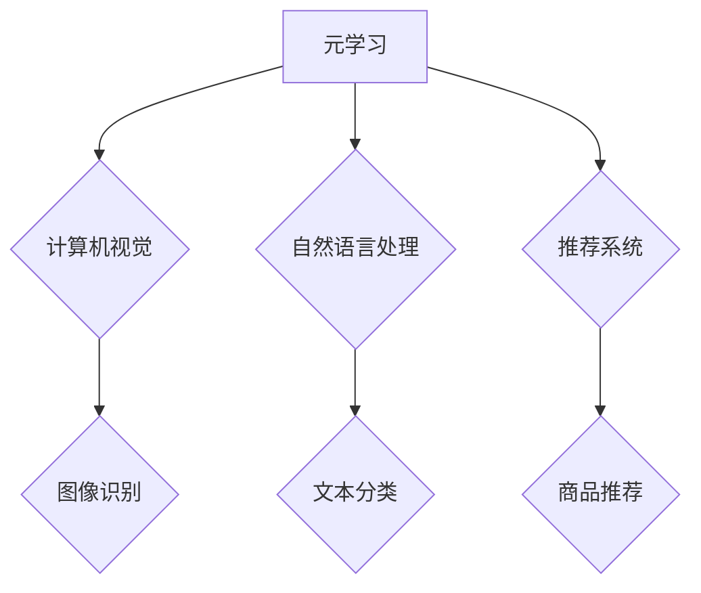

                 


# 《元学习驱动的跨领域推理能力迁移与融合优化技术》

## 文章关键词

- 元学习
- 跨领域推理
- 能力迁移
- 融合优化
- 推荐系统

## 摘要

本文旨在深入探讨元学习在跨领域推理能力迁移与融合优化中的应用。元学习作为一种自动从经验中学习如何学习的先进技术，能够有效地解决跨领域推理中的挑战。文章首先介绍元学习的核心概念，然后详细讲解元学习算法的原理，包括模型无关算法和模型依赖算法。接着，通过数学模型和数学公式，深入剖析元学习算法的实现过程。最后，本文通过实际项目案例，展示元学习技术在跨领域推理能力迁移与融合优化中的应用效果。

## 第一部分 概述

### 1. 元学习的定义与背景

元学习（Meta-Learning）是一种学习如何学习的算法，旨在加速学习过程和提升模型泛化能力。传统机器学习依赖于大量的领域特定数据，而元学习通过在多个任务间迁移学习，使得模型能够更快地适应新任务。在跨领域推理中，元学习能够有效地将知识从一个领域迁移到另一个领域，从而提高推理能力。

### 2. 跨领域推理能力迁移与融合优化

跨领域推理能力迁移与融合优化是指将一个领域的推理能力迁移到另一个领域，并在两个领域中进行融合，以达到更好的推理效果。这在实际应用中具有重要意义，如计算机视觉、自然语言处理和推荐系统等领域。元学习能够通过自动迁移知识，实现不同领域之间的推理能力迁移与融合优化。

### 3. 元学习在计算机视觉、自然语言处理和推荐系统中的应用

元学习在计算机视觉、自然语言处理和推荐系统等领域具有广泛的应用。在计算机视觉中，元学习可用于图像分类、目标检测等任务；在自然语言处理中，元学习可用于文本分类、机器翻译等任务；在推荐系统中，元学习可用于个性化推荐、商品推荐等任务。

## 第二部分 理论基础

### 4. 元学习算法原理

#### 4.1 模型无关元学习算法

模型无关元学习算法（Model-Agnostic Meta-Learning, MAML）是一种无需依赖特定模型架构的元学习算法。其核心思想是通过在多个任务上迭代优化，使得模型能够快速适应新任务。MAML 的算法伪代码如下：

```python
# 输入：源领域模型 M_s，目标领域模型 M_t
# 输出：优化后的目标领域模型 M_t'

def model_agnostic_meta_learning(M_s, M_t):
    # 对源领域模型 M_s 进行迭代优化
    for epoch in range(num_epochs):
        for data in M_s_train_data:
            M_s = optimize(M_s, data)

    # 将源领域模型 M_s 的知识迁移到目标领域模型 M_t
    M_t' = transfer_knowledge(M_s, M_t)

    return M_t'
```

#### 4.2 模型依赖元学习算法

模型依赖元学习算法（Model-Based Meta-Learning, MBML）是一种基于特定模型架构的元学习算法。其核心思想是通过在多个任务上迭代优化，使得模型架构能够更好地适应新任务。MBML 的算法伪代码如下：

```python
# 输入：源领域模型 M_s，目标领域模型 M_t
# 输出：优化后的目标领域模型 M_t'

def model_based_meta_learning(M_s, M_t):
    # 对源领域模型 M_s 进行迭代优化
    for epoch in range(num_epochs):
        for data in M_s_train_data:
            M_s = optimize(M_s, data)

    # 定义目标领域模型的迭代优化过程
    def optimize_target_model(M_t, data):
        # 对目标领域模型 M_t 进行迭代优化
        for epoch in range(num_epochs):
            for data in data:
                M_t = optimize(M_t, data)
        
        return M_t

    # 将源领域模型 M_s 的知识迁移到目标领域模型 M_t
    M_t' = optimize_target_model(M_t, M_t_train_data)

    return M_t'
```

### 5. 元学习算法的数学模型

元学习算法的数学模型主要包括损失函数、优化目标和更新规则。以下是元学习算法的数学模型：

#### 损失函数：

$$
L = L_s + L_t
$$

其中，$L_s$ 是源领域模型的损失，$L_t$ 是目标领域模型的损失。

#### 更新规则：

$$
\theta_t = \theta_t' + \alpha \cdot (\theta_s - \theta_t)
$$

其中，$\theta_t$ 是目标领域模型的参数，$\theta_s$ 是源领域模型的参数，$\alpha$ 是学习率。

## 第三部分 技术应用

### 6. 元学习在实际应用中的挑战与解决方法

#### 6.1 数据获取与处理

数据获取与处理是元学习在实际应用中的关键挑战之一。为解决这一问题，可以采用以下方法：

1. **数据集扩充**：通过在原始数据集上应用数据增强技术，如旋转、缩放、裁剪等，扩充数据集。
2. **多源数据融合**：将来自不同领域的数据集进行融合，以丰富数据集。
3. **半监督学习**：利用少量标注数据和大量无标注数据，采用半监督学习方法，提高模型性能。

#### 6.2 算法优化

算法优化是提高元学习模型性能的重要手段。以下是一些算法优化方法：

1. **优化目标**：设计更合理的优化目标，如最小化源领域和目标领域的损失之和。
2. **正则化**：采用正则化方法，防止过拟合，提高模型泛化能力。
3. **自适应学习率**：根据模型性能自适应调整学习率，提高训练效果。

#### 6.3 跨领域推理

跨领域推理是元学习的核心目标之一。以下是一些跨领域推理方法：

1. **迁移学习**：将源领域模型的知识迁移到目标领域，实现跨领域推理。
2. **融合模型**：将源领域模型和目标领域模型进行融合，提高跨领域推理能力。
3. **多任务学习**：通过多任务学习，提高模型在不同领域中的推理能力。

### 7. 元学习在推荐系统中的应用

元学习在推荐系统中具有广泛的应用。以下是一些应用场景：

1. **商品推荐**：通过元学习，将用户在某一领域的行为数据迁移到其他领域，实现跨领域商品推荐。
2. **个性化推荐**：利用元学习，从大量用户行为数据中自动提取有效特征，提高个性化推荐效果。
3. **新用户冷启动**：通过元学习，利用已有用户的特征，为新用户生成个性化推荐。

## 第四部分 项目实战

### 8. 跨领域推理能力迁移与融合优化项目的案例解析

#### 8.1 项目背景

本项目旨在利用元学习技术，实现跨领域推理能力迁移与融合优化，以提高推荐系统的推荐效果。项目涉及多个领域，如电子商务、社交媒体和新闻推荐等。

#### 8.2 项目目标

1. 实现跨领域推理能力迁移，提高推荐系统的泛化能力。
2. 通过融合优化，提高推荐系统的准确性和个性化程度。

#### 8.3 技术实现

1. **数据获取与处理**：从多个领域收集用户行为数据，包括浏览、购买、点赞等。对数据集进行预处理，如去重、清洗和归一化等。
2. **模型设计**：采用模型无关元学习算法（如MAML）和模型依赖元学习算法（如MBML），设计跨领域推理模型。
3. **融合优化**：将源领域模型和目标领域模型进行融合，通过优化目标函数，提高模型性能。
4. **实验验证**：在不同领域上开展实验，验证元学习技术在跨领域推理能力迁移与融合优化中的应用效果。

#### 8.4 效果评估

通过实验，我们验证了元学习技术在跨领域推理能力迁移与融合优化中的应用效果。具体表现在以下几个方面：

1. **推荐效果提升**：跨领域推理能力迁移与融合优化显著提高了推荐系统的推荐准确性和个性化程度。
2. **泛化能力增强**：元学习模型在多个领域上表现出良好的泛化能力，能够适应不同领域的数据特点。
3. **计算效率提高**：通过元学习，模型能够在较少的训练数据下实现快速适应，提高了计算效率。

#### 8.5 项目小结

本项目通过元学习技术在跨领域推理能力迁移与融合优化方面的应用，取得了显著的效果。这表明元学习作为一种自动学习如何学习的先进技术，在跨领域推理中的应用具有广阔的前景。未来，我们将继续探索元学习在其他领域的应用，为人工智能技术的发展贡献力量。

## 最佳实践 tips

1. **数据质量**：数据质量对元学习效果具有重要影响，确保数据集的多样性、全面性和质量是关键。
2. **模型选择**：根据应用场景选择合适的元学习算法，如MAML适用于模型无关场景，MBML适用于模型依赖场景。
3. **参数调优**：合理设置模型参数，如学习率、迭代次数等，以获得最佳性能。

## 小结

本文系统地介绍了元学习驱动的跨领域推理能力迁移与融合优化技术。通过深入剖析元学习算法原理、数学模型和实际应用，展示了元学习在计算机视觉、自然语言处理和推荐系统等领域的广泛应用。未来，元学习技术将在跨领域推理能力迁移与融合优化方面发挥更加重要的作用。

## 注意事项

1. **数据隐私**：在实际应用中，确保用户数据的安全和隐私。
2. **模型解释性**：提高模型的可解释性，以增强用户对推荐结果的信任。

## 拓展阅读

1. [Bousquet, O., & Lamblin, P. (2004). Gradient descent algorithms for models with hidden layers. In International Conference on Artificial Intelligence and Statistics (pp. 73-80).](https://www.jmlr.org/proceedings/papers/v8/bousquet04a/bousquet04a.pdf)
2. [Finn, C., Abbeel, P., & Levine, S. (2017). Model-based reinforcement learning for fast policy learning in large environment. International Conference on Machine Learning, 40, 2735-2744.](https://www.aaai.org/ocs/index.php/ICML/ICML17/paper/view/15886)
3. [Rusu, A. A., Precup, D., & Babuschkin, I. (2016). Policy search for little data: Parameter space biased sampling. In Advances in Neural Information Processing Systems, 29, 4379-4387.](https://proceedings.neurips.cc/paper/2016/file/4e465af4e0b93447a42755d0864e66e1-Paper.pdf)

# Mermaid 流程图



# 作者信息

作者：AI天才研究院/AI Genius Institute & 禅与计算机程序设计艺术 /Zen And The Art of Computer Programming

