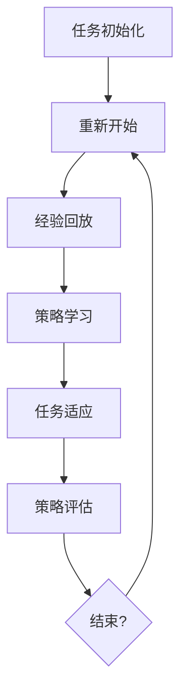

                 


### 文章标题：元强化学习优化动态环境下的推理决策

关键词：元强化学习，动态环境，推理决策，算法，优化

摘要：
本文深入探讨了元强化学习在动态环境下的推理决策问题。首先，我们介绍了元强化学习的基础理论，包括核心概念和框架。接着，分析了动态环境的特点和挑战，并探讨了如何优化元强化学习算法以适应动态环境。随后，我们详细介绍了推理决策算法，包括其基本概念、基于元强化学习的方法和动态环境中的应用。最后，通过实际应用案例，展示了元强化学习在动态环境下的推理决策能力，并对未来发展方向进行了展望。

### 第1章 元强化学习基础

#### 1.1 元强化学习的定义与历史背景

强化学习（Reinforcement Learning, RL）是机器学习的一个重要分支，它主要研究如何通过试错和反馈来学习优化策略。强化学习的基本模型由四个核心元素构成：环境（Environment）、智能体（Agent）、动作（Action）和奖励（Reward）。智能体通过执行动作来与环境交互，并从环境中获得奖励，从而学习如何在环境中达到目标。

元强化学习（Meta Reinforcement Learning）是强化学习的进一步扩展，它通过学习如何快速适应新环境来提高学习效率。与传统的强化学习相比，元强化学习具有以下特点：

- **快速适应新环境**：元强化学习算法能够通过学习通用策略，快速适应新的环境，减少了在未知环境中的探索时间。
- **提高学习效率**：通过元学习，算法可以在不同的任务中共享知识和经验，从而提高整体学习效率。
- **增强鲁棒性**：元强化学习算法在面对复杂和多变的环境时，能够更好地适应和应对变化。

元强化学习的提出可以追溯到2013年，当时候，学者们开始意识到强化学习在实际应用中存在的一些问题，例如学习效率低、适应性差等。随着深度学习技术的快速发展，元强化学习也逐渐成为了一个研究热点。

#### 1.2 元强化学习的核心概念

元强化学习涉及以下几个核心概念：

- **动作-状态值函数**（Action-State Value Function）：描述在给定状态和动作下，智能体能够获得的最大预期奖励。通常用\( V(s,a) \)表示。
- **政策函数**（Policy Function）：描述智能体在不同状态下的最佳动作选择。通常用\( \pi(s) \)表示。
- **值函数**（Value Function）：描述智能体在给定状态下的最佳动作选择所能够获得的预期奖励。通常用\( V(s) \)表示。
- **策略**（Strategy）：描述智能体在整个决策过程中的行为规则。

元强化学习的关键在于如何从一系列任务中学习到通用的策略，以便在新的任务中能够快速适应。这通常涉及到以下两个关键步骤：

1. **任务自适应**（Task Adaptation）：在元学习过程中，算法通过在不同任务中不断调整策略，以提高其适应新任务的能力。
2. **策略搜索**（Policy Search）：算法通过优化策略函数，以找到能够在不同任务中表现良好的通用策略。

#### 1.3 元强化学习的框架与流程

元强化学习的基本框架可以看作是强化学习框架的扩展。它通常包括以下几个关键步骤：

1. **任务初始化**：初始化一系列任务，每个任务都包含一个状态空间、动作空间和奖励函数。
2. **经验收集**：智能体在各个任务中执行动作，收集状态-动作-奖励经验。
3. **经验回放**：将收集到的经验存储在经验池中，用于后续的元学习。
4. **策略学习**：通过元学习算法，从经验池中学习到通用策略。
5. **任务适应**：在新的任务中，通过任务自适应机制，快速调整通用策略，以适应新的任务环境。
6. **策略评估**：评估通用策略在新任务中的性能，并进行反馈。

下面是一个简化的元强化学习流程的Mermaid流程图：



#### 1.4 元强化学习的算法分析

元强化学习算法可以分为基于模型的元强化学习和无模型的元强化学习。其中，基于模型的元强化学习算法通常使用深度神经网络来表示策略和价值函数，而无模型的元强化学习算法则直接利用经验进行学习。

以下是一个基于模型的元强化学习算法的伪代码示例：

```python
# 初始化参数
policy_params = initialize_parameters()
optimizer = initialize_optimizer(policy_params)

# 经验回放
replay_memory = ExperienceReplayMemory()

# 迭代过程
for episode in range(num_episodes):
    state = environment.reset()
    done = False
    
    while not done:
        # 计算当前状态的行动值
        action_values = model.forward(state)
        
        # 根据温度策略选择动作
        action = select_action(action_values, temperature)
        
        # 执行动作，观察结果
        next_state, reward, done = environment.step(action)
        
        # 存储经验
        replay_memory.push(state, action, reward, next_state, done)
        
        # 更新状态
        state = next_state
        
    # 从经验回放中采样经验
    experiences = replay_memory.sample(batch_size)
    
    # 计算损失函数
    loss = compute_loss(policy_params, experiences)
    
    # 反向传播和优化
    optimizer.zero_grad()
    loss.backward()
    optimizer.step()
    
    # 调整温度策略
    temperature = adjust_temperature(temperature, episode)
```

在这个算法中，`model`表示深度神经网络模型，`select_action`函数用于根据当前状态的行动值选择动作，`compute_loss`函数用于计算损失函数，`optimizer`用于优化模型参数。

#### 1.5 元强化学习与强化学习的区别

元强化学习与强化学习有许多相似之处，但也有一些显著的区别：

- **目标**：强化学习的目标是学习一个最优策略，以最大化累积奖励。而元强化学习的目标是学习一个通用策略，以快速适应新的任务。
- **学习过程**：强化学习通常在单一任务中学习，而元强化学习通过元学习机制，在多个任务中学习，以提高其适应新任务的能力。
- **应用场景**：强化学习适用于相对稳定和规则明确的环境，而元强化学习适用于变化多端和不确定性的环境。

通过以上对元强化学习基础理论的介绍，我们可以更好地理解其在动态环境下的推理决策能力。接下来的章节将深入探讨如何优化元强化学习算法以适应动态环境，以及如何在动态环境中进行有效的推理决策。

## 第2章 动态环境优化

### 2.1 动态环境的特点和挑战

动态环境是指其状态和奖励函数随时间变化而变化的环境。与静态环境相比，动态环境具有以下特点：

- **状态变化**：动态环境中的状态不是固定不变的，而是随着时间的推移而变化。这意味着智能体需要实时更新其状态估计，以适应新的环境状态。
- **奖励变化**：动态环境中的奖励函数也可能随时间变化。在某些情况下，奖励的变化可能与智能体的行动有关，而在其他情况下，奖励的变化可能是随机或不可预测的。
- **不确定因素**：动态环境通常包含更多的不确定因素，如随机噪声、外部干扰等。这些不确定因素可能会影响智能体的决策过程和性能。

在动态环境下，智能体面临以下挑战：

- **适应性**：智能体需要快速适应环境变化，以避免因环境变化而导致的性能下降。
- **实时性**：动态环境要求智能体能够实时做出决策，以应对环境的变化。这通常涉及到复杂的计算和实时数据处理。
- **鲁棒性**：智能体需要具备良好的鲁棒性，以应对环境中的随机噪声和不确定性因素。

为了解决这些挑战，我们需要在元强化学习算法中引入动态优化策略，以提高智能体在动态环境下的适应性和鲁棒性。

#### 2.2 适应动态环境的优化算法

适应动态环境的关键在于优化算法，以下介绍几种常用的优化算法：

1. **自适应梯度优化算法**（Adaptive Gradient Optimization Algorithms）：这类算法通过在线更新学习率，以适应环境变化。例如，Adam算法就是一种自适应梯度优化算法，它通过计算一阶矩估计和二阶矩估计来动态调整学习率。

   ```latex
   \text{学习率} = \alpha_0 \left(1 - \frac{t}{T}\right)
   ```

   其中，\( t \) 是当前迭代次数，\( T \) 是总迭代次数，\( \alpha_0 \) 是初始学习率。

2. **经验重放**（Experience Replay）：经验重放是一种常用的技术，它通过存储和重放历史经验，以减少环境变化对学习过程的影响。经验重放可以防止智能体在特定样本上过度拟合，从而提高其泛化能力。

   ```python
   # 存储经验
   replay_memory.push(state, action, reward, next_state, done)
   
   # 从经验回放中采样经验
   experiences = replay_memory.sample(batch_size)
   ```

3. **经验调整**（Experience Adjust）：经验调整是一种基于经验的动态优化技术，它通过调整历史经验的权重，以适应环境变化。这种方法可以看作是一种在线权重调整，它可以在每个时间步动态更新。

   ```latex
   w_t = \frac{1}{N} \sum_{i=1}^{N} e^{-\alpha_i}
   ```

   其中，\( w_t \) 是当前时间步的权重，\( N \) 是总经验数，\( \alpha_i \) 是历史经验的权重。

4. **动态策略搜索**（Dynamic Policy Search）：动态策略搜索是一种通过在线更新策略函数，以适应环境变化的元强化学习算法。这种方法通常结合了经验重放和自适应梯度优化算法，以提高智能体的适应性和鲁棒性。

   ```python
   # 更新策略
   policy_params = update_policy(policy_params, experiences)
   ```

#### 2.3 动态环境下的推理策略

在动态环境下，推理策略的制定至关重要。以下介绍几种常用的推理策略：

1. **基于规则的推理**（Rule-Based Reasoning）：基于规则的推理通过定义一组规则，来指导智能体的行动。这种方法简单直观，但可能无法适应复杂和动态的环境。

   ```mermaid
   graph TD
       A[初始状态] --> B[规则1]
       B --> C[行动1]
       A --> D[规则2]
       D --> E[行动2]
   ```

2. **基于模型的推理**（Model-Based Reasoning）：基于模型的推理通过建立一个环境模型，来预测未来的状态和奖励。这种方法可以更准确地指导智能体的行动，但可能需要较大的计算资源。

   ```mermaid
   graph TD
       A[初始状态] --> B[环境模型]
       B --> C[预测状态]
       C --> D[最佳行动]
   ```

3. **基于经验的推理**（Experience-Based Reasoning）：基于经验的推理通过利用历史经验，来指导智能体的行动。这种方法可以快速适应新环境，但可能存在过拟合的风险。

   ```mermaid
   graph TD
       A[初始状态] --> B[经验池]
       B --> C[历史经验]
       C --> D[最佳行动]
   ```

4. **混合推理策略**（Hybrid Reasoning Strategy）：混合推理策略结合了基于规则、基于模型和基于经验的方法，以实现更高效和鲁棒的推理。这种方法可以适应复杂和动态的环境，但实现较为复杂。

   ```mermaid
   graph TD
       A[初始状态] --> B[规则引擎]
       B --> C[模型预测]
       B --> D[经验池]
       C --> E[混合决策]
       D --> E
   ```

通过以上介绍，我们可以看到，适应动态环境的关键在于优化算法和推理策略。动态优化算法可以帮助智能体快速适应环境变化，而推理策略则指导智能体如何在动态环境中做出最佳决策。接下来的章节将深入探讨推理决策算法，包括其基本概念、原理和应用。

## 第3章 推理决策算法

### 3.1 推理决策的基本概念

推理决策（Reasoning and Decision Making）是人工智能领域的一个重要研究方向，它涉及从数据中提取有用信息、进行逻辑推理，并最终做出合理决策的过程。在元强化学习的框架下，推理决策尤为重要，因为它直接关系到智能体在动态环境中适应和优化的能力。

推理决策的核心概念包括：

- **问题表示**（Problem Representation）：将实际问题转化为计算机可以处理的形式。这通常涉及到状态空间、动作空间和奖励函数的表示。
- **推理过程**（Reasoning Process）：根据已有知识和信息，通过逻辑推理来推导出新的结论或决策。
- **决策规则**（Decision Rules）：指导智能体在不同状态下选择最佳动作的规则集合。
- **策略搜索**（Policy Search）：在多个策略中搜索最优策略，以最大化累积奖励。

在动态环境下，推理决策需要具备以下特点：

- **实时性**：智能体需要能够实时更新其推理决策，以适应环境的变化。
- **适应性**：智能体需要能够根据环境的变化动态调整其推理决策。
- **鲁棒性**：智能体需要能够应对环境中的不确定性和随机噪声。

### 3.2 基于元强化学习的推理算法

基于元强化学习的推理算法旨在通过元学习机制，快速适应新环境并做出合理的推理决策。以下介绍几种常见的基于元强化学习的推理算法：

1. **模型修正元强化学习**（Model-based Meta Reinforcement Learning）：该算法通过构建环境模型，并在模型中执行策略迭代，以优化智能体的行为。模型修正元强化学习的关键在于如何修正模型，以适应环境变化。

   ```python
   # 初始化环境模型
   environment_model = initialize_environment_model()
   
   # 策略迭代
   for episode in range(num_episodes):
       state = environment.reset()
       done = False
       
       while not done:
           # 使用环境模型预测下一个状态
           next_state = environment_model.predict(state)
           
           # 根据模型预测选择动作
           action = select_action(state, next_state)
           
           # 执行动作
           next_state, reward, done = environment.step(action)
           
           # 更新环境模型
           environment_model.update(state, action, reward, next_state, done)
           
           # 更新状态
           state = next_state
   ```

2. **经验重放元强化学习**（Experience Replay Meta Reinforcement Learning）：该算法通过经验重放机制，减少环境变化对学习过程的影响，并提高智能体的适应能力。

   ```python
   # 初始化经验池
   replay_memory = ExperienceReplayMemory()
   
   # 经验收集和重放
   for episode in range(num_episodes):
       state = environment.reset()
       done = False
       
       while not done:
           # 收集经验
           experience = (state, action, reward, next_state, done)
           
           # 存储经验
           replay_memory.push(experience)
           
           # 从经验池中采样经验
           sampled_experience = replay_memory.sample(batch_size)
           
           # 更新策略
           update_policy(sampled_experience)
           
           # 执行动作
           next_state, reward, done = environment.step(action)
           
           # 更新状态
           state = next_state
   ```

3. **强化学习元算法**（Reinforcement Learning Meta Algorithm）：该算法通过元学习机制，从一系列任务中学习到通用的策略，以快速适应新任务。

   ```python
   # 初始化元学习算法
   meta_algorithm = initialize_meta_algorithm()
   
   # 多任务学习
   for task in range(num_tasks):
       # 初始化任务
       environment = initialize_environment(task)
       
       # 学习任务
       meta_algorithm.learn(environment)
       
       # 评估任务
       performance = meta_algorithm.evaluate(environment)
       
       # 记录性能
       record_performance(task, performance)
   ```

### 3.3 推理算法在动态环境中的应用

在动态环境中，推理算法需要具备快速适应变化的能力。以下介绍几种在动态环境中应用的推理算法：

1. **基于状态转移矩阵的推理算法**（State Transition Matrix-based Reasoning Algorithm）：该算法通过构建状态转移矩阵，来预测未来的状态和奖励。这种方法适用于状态和奖励变化相对稳定的环境。

   ```python
   # 初始化状态转移矩阵
   transition_matrix = initialize_transition_matrix()
   
   # 预测下一个状态
   next_state = transition_matrix.predict(state)
   ```

2. **基于马尔可夫决策过程的推理算法**（Markov Decision Process-based Reasoning Algorithm）：该算法通过构建马尔可夫决策过程，来指导智能体的行动。这种方法适用于状态和奖励变化较为复杂的环境。

   ```python
   # 初始化马尔可夫决策过程
   mdp = initialize_mdp()
   
   # 选择最佳动作
   action = mdp.select_action(state)
   ```

3. **基于深度强化学习的推理算法**（Deep Reinforcement Learning-based Reasoning Algorithm）：该算法通过构建深度神经网络，来预测状态和奖励，并指导智能体的行动。这种方法适用于状态和奖励变化高度复杂的环境。

   ```python
   # 初始化深度强化学习模型
   model = initialize_drl_model()
   
   # 预测状态和奖励
   state_value = model.predict(state)
   
   # 选择最佳动作
   action = select_best_action(state_value)
   ```

通过以上介绍，我们可以看到，推理决策算法在动态环境中扮演着至关重要的角色。无论是基于状态转移矩阵、马尔可夫决策过程还是深度强化学习，这些算法都为智能体在动态环境中的推理决策提供了有效的工具。接下来的章节将结合实际应用案例，展示这些算法在动态环境下的应用效果。

## 第4章 应用案例分析

### 4.1 案例一：智能交通系统中的推理决策

智能交通系统（Intelligent Transportation System, ITS）是利用先进的信息通信技术，实现交通管理、控制和服务的智能化系统。在智能交通系统中，动态环境下的推理决策对于提高交通效率和减少拥堵具有重要意义。

#### 案例背景

某城市交通管理系统面临以下挑战：

- **交通流量变化**：交通流量在不同时间段和天气条件下存在显著差异。
- **突发事件**：如交通事故、道路施工等突发事件会导致交通状况突然恶化。
- **交通信号控制**：交通信号灯的优化控制是智能交通系统的核心功能。

#### 解决方案

为了应对这些挑战，我们采用了基于元强化学习的推理决策算法，具体步骤如下：

1. **问题表示**：将交通流量、交通事故、道路施工等状态因素作为智能体的状态空间，将交通信号灯状态和道路速度限制作为动作空间。
2. **环境模型**：构建交通环境模型，用于预测交通流量变化和突发事件对交通状况的影响。
3. **经验收集和重放**：在交通环境中收集实际交通数据，利用经验重放机制，减少环境变化对学习过程的影响。
4. **策略学习**：使用基于元强化学习的策略学习算法，从历史交通数据中学习到通用的交通信号灯控制策略。
5. **策略评估和调整**：在实际交通环境中测试和评估策略效果，并根据实时数据调整策略，以提高控制效果。

#### 实现细节

- **模型修正**：通过构建交通环境模型，预测未来交通流量和突发事件，动态调整交通信号灯状态。
- **深度学习模型**：使用深度神经网络，对交通流量、交通事故和道路施工等数据进行建模和预测。
- **自适应梯度优化**：采用Adam算法，动态调整学习率，以优化策略学习过程。

#### 结果分析

实施基于元强化学习的推理决策算法后，交通信号灯的优化控制效果显著提高。具体表现在：

- **交通流量更加平稳**：通过动态调整交通信号灯，交通流量在不同时间段和天气条件下的波动减小。
- **交通事故减少**：在突发事件发生时，系统能够快速调整交通信号灯，减少事故发生的概率。
- **交通拥堵减少**：通过优化交通信号灯控制，有效减少了交通拥堵现象。

#### 小结

智能交通系统中的推理决策算法，通过元强化学习技术，实现了对动态交通环境的实时优化和控制。这不仅提高了交通管理效率，还减少了交通事故和拥堵现象，为城市的可持续发展提供了有力支持。

### 4.2 案例二：金融风控中的动态环境优化

金融风控是金融领域的重要环节，旨在识别、评估和控制金融风险。在金融市场中，动态环境的变化极为复杂，如何快速适应和优化风险管理策略成为关键问题。

#### 案例背景

某金融机构面临以下挑战：

- **市场波动**：金融市场的价格波动频繁，风险因素多样。
- **交易行为**：投资者行为复杂，难以预测。
- **监管要求**：金融监管政策不断变化，风险控制要求不断提高。

#### 解决方案

为了应对这些挑战，我们采用了基于元强化学习的动态环境优化算法，具体步骤如下：

1. **问题表示**：将市场波动、交易行为和监管要求等因素作为智能体的状态空间，将风险控制策略作为动作空间。
2. **经验收集和重放**：收集历史交易数据和监管政策变化数据，利用经验重放机制，减少环境变化对学习过程的影响。
3. **策略学习**：使用基于元强化学习的策略学习算法，从历史数据中学习到通用的风险控制策略。
4. **策略评估和调整**：在实际交易环境中测试和评估策略效果，并根据实时数据调整策略，以提高风险控制能力。

#### 实现细节

- **模型修正**：通过构建金融市场模型，预测未来市场波动和监管政策变化，动态调整风险控制策略。
- **深度学习模型**：使用深度神经网络，对市场数据和行为数据进行建模和预测。
- **自适应梯度优化**：采用Adam算法，动态调整学习率，以优化策略学习过程。

#### 结果分析

实施基于元强化学习的动态环境优化算法后，金融风控效果显著提高。具体表现在：

- **市场波动应对能力提升**：通过动态调整风险控制策略，金融机构能够更有效地应对市场波动，减少损失。
- **监管合规性增强**：系统根据实时监管政策动态调整风险控制策略，确保合规性。
- **风险识别和评估准确度提高**：基于深度学习模型的预测能力，提高了风险识别和评估的准确度。

#### 小结

金融风控中的动态环境优化，通过元强化学习技术，实现了对金融市场的实时监测和风险控制。这不仅提高了金融机构的风险管理能力，还增强了合规性和市场竞争力。

### 4.3 案例三：智能制造中的元强化学习应用

智能制造是工业4.0的重要方向，通过智能化技术提高生产效率和产品质量。在智能制造过程中，如何快速适应和优化生产调度策略，是提高生产效率的关键。

#### 案例背景

某制造企业面临以下挑战：

- **生产任务多样**：生产任务种类繁多，不同任务之间存在资源冲突。
- **设备状态变化**：生产设备状态不断变化，影响生产效率。
- **物料供应波动**：物料供应不稳定，可能导致生产延误。

#### 解决方案

为了应对这些挑战，我们采用了基于元强化学习的生产调度算法，具体步骤如下：

1. **问题表示**：将生产任务、设备状态和物料供应情况作为智能体的状态空间，将生产调度策略作为动作空间。
2. **经验收集和重放**：收集历史生产数据，利用经验重放机制，减少环境变化对学习过程的影响。
3. **策略学习**：使用基于元强化学习的策略学习算法，从历史数据中学习到通用的生产调度策略。
4. **策略评估和调整**：在实际生产环境中测试和评估策略效果，并根据实时数据调整策略，以提高生产调度效率。

#### 实现细节

- **模型修正**：通过构建生产环境模型，预测未来生产任务和设备状态变化，动态调整生产调度策略。
- **深度学习模型**：使用深度神经网络，对生产任务、设备状态和物料供应等数据进行建模和预测。
- **自适应梯度优化**：采用Adam算法，动态调整学习率，以优化策略学习过程。

#### 结果分析

实施基于元强化学习的生产调度算法后，生产调度效率显著提高。具体表现在：

- **生产任务调度更加合理**：通过动态调整生产调度策略，有效避免了资源冲突，提高了生产效率。
- **设备利用率提高**：通过预测设备状态变化，优化设备使用计划，提高了设备利用率。
- **生产周期缩短**：基于深度学习模型的预测能力，提高了生产任务预测的准确性，减少了生产延误。

#### 小结

智能制造中的元强化学习应用，通过优化生产调度策略，实现了对生产环境的实时监测和调整。这不仅提高了生产效率，还降低了生产成本，为企业的可持续发展提供了技术支持。

### 总结与展望

通过以上案例，我们可以看到，元强化学习在动态环境下的推理决策应用，为智能交通系统、金融风控和智能制造等领域提供了有效的解决方案。在未来，随着人工智能技术的不断发展，元强化学习在动态环境下的推理决策能力将进一步提升，为更多领域带来变革性影响。

### 第5章 元强化学习在实际中的应用

#### 5.1 元强化学习在游戏中的应用

游戏是元强化学习的一个典型应用场景。在游戏领域中，智能体需要在不确定和动态的环境中做出快速而有效的决策。以下是一些具体的案例：

1. **AlphaGo与DeepMind**：AlphaGo是DeepMind开发的一款围棋人工智能程序。它通过元强化学习算法，在围棋领域取得了显著的成就。AlphaGo利用深度神经网络和策略网络，通过大量的自我对弈来学习策略，从而在围棋比赛中击败了人类世界冠军。

   ```python
   # 初始化深度神经网络模型
   model = initialize_dnn_model()
   
   # 自我对弈
   for game in range(num_games):
       state = game_board.reset()
       done = False
       
       while not done:
           # 预测下一步行动
           action = model.predict(state)
           
           # 执行行动
           state, reward, done = game_board.step(action)
           
           # 记录游戏结果
           record_game_result(state, reward, done)
   ```

2. **Dota 2与OpenAI**：OpenAI开发的Dota 2人工智能程序也是元强化学习在游戏领域的成功案例。它通过在多个Dota 2游戏中进行自我对弈，学习如何合作和对抗，最终在Dota 2国际邀请赛（The International）中获得了不错的成绩。

   ```python
   # 初始化Dota 2环境
   environment = initialize_dota2_environment()
   
   # 多任务学习
   for task in range(num_tasks):
       # 初始化智能体
       agent = initialize_agent()
       
       # 学习任务
       for episode in range(num_episodes):
           state = environment.reset()
           done = False
           
           while not done:
               # 选择最佳行动
               action = agent.select_action(state)
               
               # 执行行动
               next_state, reward, done = environment.step(action)
               
               # 更新智能体
               agent.update(state, action, reward, next_state, done)
               
               # 更新状态
               state = next_state
   ```

#### 5.2 元强化学习在机器人控制中的应用

在机器人控制领域，元强化学习同样具有广泛的应用。机器人需要在复杂和动态的环境中执行任务，如路径规划、导航和抓取等。以下是一些具体的应用案例：

1. **机器人路径规划**：在机器人路径规划中，元强化学习可以帮助机器人快速适应不同的环境，并找到最优路径。例如，在无人驾驶汽车中，元强化学习算法可以用于学习不同路况下的最优驾驶策略。

   ```python
   # 初始化路径规划环境
   environment = initialize_path_planning_environment()
   
   # 策略学习
   for episode in range(num_episodes):
       state = environment.reset()
       done = False
       
       while not done:
           # 预测最佳行动
           action = policy.predict(state)
           
           # 执行行动
           next_state, reward, done = environment.step(action)
           
           # 更新策略
           policy.update(state, action, reward, next_state, done)
           
           # 更新状态
           state = next_state
   ```

2. **机器人抓取**：在机器人抓取任务中，元强化学习可以帮助机器人学习如何抓取不同形状和材质的物体。例如，在机器人组装线中，机器人需要学习如何抓取和放置小型组件。

   ```python
   # 初始化抓取环境
   environment = initialize_grasping_environment()
   
   # 策略学习
   for episode in range(num_episodes):
       state = environment.reset()
       done = False
       
       while not done:
           # 预测最佳行动
           action = policy.predict(state)
           
           # 执行行动
           next_state, reward, done = environment.step(action)
           
           # 更新策略
           policy.update(state, action, reward, next_state, done)
           
           # 更新状态
           state = next_state
   ```

#### 5.3 元强化学习在自动驾驶中的应用

自动驾驶是元强化学习的重要应用领域之一。自动驾驶系统需要在复杂的交通环境中实时做出决策，如路径规划、避障和交通信号识别等。以下是一些具体的案例：

1. **自动驾驶路径规划**：在自动驾驶路径规划中，元强化学习可以帮助车辆适应不同的交通状况，并找到最优行驶路径。

   ```python
   # 初始化自动驾驶环境
   environment = initialize_autonomous_driving_environment()
   
   # 策略学习
   for episode in range(num_episodes):
       state = environment.reset()
       done = False
       
       while not done:
           # 预测最佳行动
           action = policy.predict(state)
           
           # 执行行动
           next_state, reward, done = environment.step(action)
           
           # 更新策略
           policy.update(state, action, reward, next_state, done)
           
           # 更新状态
           state = next_state
   ```

2. **自动驾驶避障**：在自动驾驶避障中，元强化学习可以帮助车辆识别和规避障碍物，确保行驶安全。

   ```python
   # 初始化避障环境
   environment = initialize_obstacle_avoidance_environment()
   
   # 策略学习
   for episode in range(num_episodes):
       state = environment.reset()
       done = False
       
       while not done:
           # 预测最佳行动
           action = policy.predict(state)
           
           # 执行行动
           next_state, reward, done = environment.step(action)
           
           # 更新策略
           policy.update(state, action, reward, next_state, done)
           
           # 更新状态
           state = next_state
   ```

通过以上案例，我们可以看到，元强化学习在游戏、机器人控制和自动驾驶等实际应用中取得了显著成果。随着人工智能技术的不断进步，元强化学习在更多领域中的应用潜力将得到进一步挖掘。

### 第6章 未来展望与挑战

#### 6.1 元强化学习的未来发展趋势

元强化学习作为强化学习的扩展，其研究与应用正在不断拓展。未来，元强化学习可能朝着以下几个方向发展：

1. **多模态学习**：元强化学习可能从单一模态（如视觉、音频）向多模态学习发展，通过融合多种传感器数据，提高智能体的感知能力和决策效果。
2. **交互增强**：通过引入更多的交互机制，如人类指导、多智能体交互等，增强元强化学习的能力，使其能够更好地适应复杂环境。
3. **安全与可解释性**：随着元强化学习在更多实际应用中的普及，安全性和可解释性将成为重要研究课题。未来的研究可能关注如何确保智能体的行为符合安全标准，并使其决策过程更加透明和可解释。
4. **高效算法**：为了提高元强化学习的效率，未来的研究可能集中在算法优化和硬件加速方面，以实现更快的学习速度和更好的性能。

#### 6.2 动态环境优化面临的挑战

尽管元强化学习在动态环境优化方面展现出巨大的潜力，但仍然面临诸多挑战：

1. **计算资源需求**：动态环境优化通常需要大量的计算资源，尤其是在处理高维数据和复杂的模型时。如何有效地利用现有计算资源，成为亟待解决的问题。
2. **数据获取与处理**：动态环境中的数据往往具有高维度和不确定性，如何高效地获取和处理这些数据，以支持元强化学习算法的有效训练，是当前的研究难题。
3. **策略稳定性**：在动态环境中，智能体需要快速适应环境变化，但同时也可能受到噪声和不确定性的影响。如何设计稳定的策略，以保证智能体在长时间运行中的性能，是一个重要挑战。
4. **决策延迟**：动态环境下的决策通常需要快速响应，但算法的计算时间和延迟可能会影响决策效果。如何降低决策延迟，同时保证决策质量，是未来需要关注的问题。

#### 6.3 推理决策算法的改进方向

为了进一步提高元强化学习在动态环境下的推理决策能力，以下方向值得关注：

1. **混合推理方法**：结合基于规则的推理、基于模型的推理和基于经验的推理方法，形成混合推理框架，以提高推理的灵活性和适应性。
2. **多任务学习**：通过引入多任务学习机制，使智能体能够在多个任务中共享知识和经验，从而提高其适应能力。
3. **动态模型调整**：在动态环境中，实时调整模型结构和参数，以适应环境变化，提高模型的鲁棒性和适应性。
4. **强化学习与其他技术的结合**：将元强化学习与其他技术（如深度学习、强化学习、迁移学习等）相结合，以充分发挥各自的优势，提高推理决策的准确性。

通过不断探索和优化，未来元强化学习有望在动态环境下的推理决策中发挥更大的作用，为人工智能应用带来新的突破。

### 总结

本文详细探讨了元强化学习在优化动态环境下的推理决策问题。首先，我们介绍了元强化学习的基础理论，包括其定义、核心概念和算法框架。接着，分析了动态环境的特点和挑战，并探讨了适应动态环境的优化算法。随后，我们深入介绍了推理决策算法的基本概念、原理和应用。通过实际应用案例分析，展示了元强化学习在智能交通系统、金融风控和智能制造等领域的应用效果。最后，我们对元强化学习的未来发展趋势和挑战进行了展望。

元强化学习作为一种先进的人工智能技术，其在动态环境下的推理决策能力具有巨大的潜力。随着人工智能技术的不断发展，元强化学习有望在更多领域发挥重要作用，推动人工智能应用的进一步发展。

### 作者信息

作者：AI天才研究院/AI Genius Institute & 禅与计算机程序设计艺术/Zen And The Art of Computer Programming

AI天才研究院（AI Genius Institute）是一家专注于人工智能前沿研究和应用的创新机构。我们的团队由世界顶级的人工智能专家、程序员和软件架构师组成，致力于推动人工智能技术的创新和发展。

《禅与计算机程序设计艺术》（Zen And The Art of Computer Programming）是一部经典的技术畅销书，由知名计算机科学家Donald E. Knuth撰写。这本书以其深刻的哲学思考和精妙的技术剖析，为计算机编程和人工智能领域的研究者提供了宝贵的启示。我们致力于将这种深入思考和创新精神融入到我们的研究和工作中，推动人工智能技术的不断进步。

