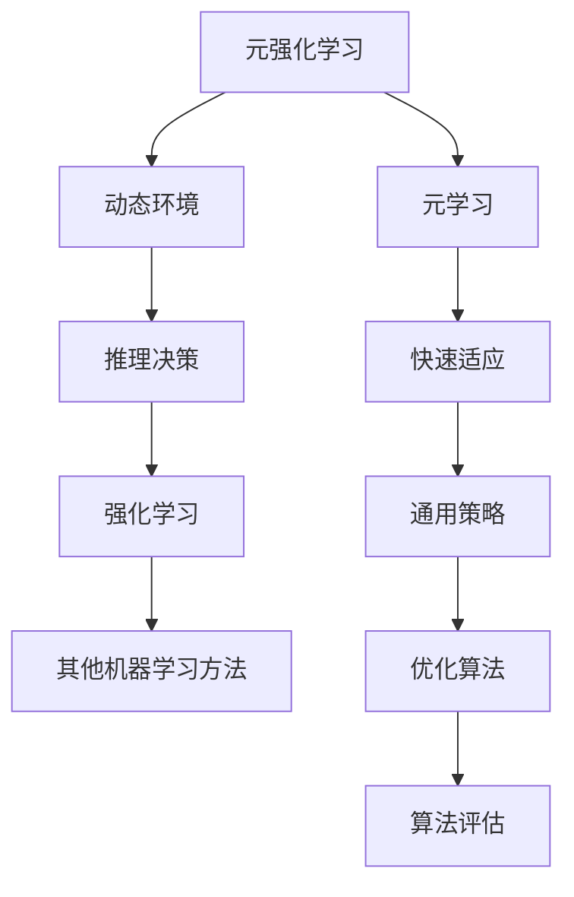

                 

### 文章标题

# 元强化学习优化动态环境下的推理决策机制设计

在当今飞速发展的信息技术时代，人工智能（AI）技术已成为推动社会进步的关键力量。其中，强化学习（Reinforcement Learning, RL）作为一种重要的机器学习方法，已在自动驾驶、游戏、推荐系统等多个领域取得了显著的应用成果。然而，随着环境动态性和复杂性的增加，传统的强化学习算法在应对动态环境时表现出一定的局限性。为了解决这一问题，元强化学习（Meta Reinforcement Learning）应运而生，它通过学习如何学习，提高了算法在不同环境下的适应能力和推理决策能力。

本文将围绕“元强化学习优化动态环境下的推理决策机制设计”这一主题，系统地探讨以下几个核心问题：

1. **元强化学习的理论基础**：介绍元强化学习的定义、发展历程、核心概念以及与其他机器学习方法的联系。
2. **动态环境下的优化策略**：探讨在动态环境下如何进行优化，包括算法设计、算法评估等。
3. **推理决策机制**：介绍推理决策的原理，包括决策模型的设计、决策策略的优化等。
4. **实际应用案例**：通过案例研究展示元强化学习在动态环境下的推理决策机制的实践应用。

通过本文的阅读，读者将能够深入了解元强化学习在动态环境下的推理决策机制设计，为相关领域的理论研究和技术实践提供参考。

### 关键词

- 元强化学习
- 动态环境
- 推理决策
- 优化策略
- 算法设计

### 摘要

本文从元强化学习的理论基础出发，探讨了在动态环境下优化推理决策机制的设计。首先，介绍了元强化学习的定义、核心概念和与其他机器学习方法的联系。接着，分析了动态环境下的优化策略，包括算法设计和评估方法。然后，详细阐述了推理决策机制的原理，包括决策模型的设计和策略优化。最后，通过实际应用案例，展示了元强化学习在动态环境下的推理决策机制的实践效果。本文旨在为元强化学习在动态环境下的应用提供理论指导和实践参考。

### 核心概念与联系

在探讨元强化学习优化动态环境下的推理决策机制设计之前，首先需要理解几个核心概念及其相互关系。

#### 1.1 元强化学习的定义

元强化学习（Meta Reinforcement Learning）是强化学习的一个分支，它旨在通过学习如何学习来提高算法在不同环境下的适应能力。与传统的强化学习相比，元强化学习不依赖于特定环境，而是通过在不同环境中快速适应和学习，形成一种通用的学习策略。这种能力使得元强化学习在动态环境中具有显著的优势。

#### 1.2 动态环境的特点

动态环境是指其状态和动作集不断变化的环境。在动态环境中，状态转移概率和奖励函数可能随时间发生变化，导致传统强化学习算法难以适应。因此，研究如何优化算法以适应动态环境成为了一个重要的研究方向。

#### 1.3 推理决策

推理决策是指在面对不确定性时，通过分析信息、评估风险和收益，做出最优选择的过程。在动态环境中，推理决策的复杂性和难度显著增加，因为需要考虑更多的因素和可能的未来变化。

#### 1.4 元强化学习与强化学习的区别与联系

元强化学习与强化学习的主要区别在于学习目标和方法。强化学习旨在通过与环境交互来学习最优策略，而元强化学习则关注如何在不同环境中快速适应和学习。两者之间的联系在于，元强化学习可以看作是强化学习的扩展和深化，通过引入元学习的概念，使其能够更好地应对动态环境。

#### 1.5 Mermaid 流程图

为了更直观地理解上述核心概念之间的联系，可以使用Mermaid流程图进行展示。以下是元强化学习在动态环境下的推理决策机制的Mermaid流程图：



该流程图展示了元强化学习在动态环境下的推理决策机制中，各个核心概念之间的相互关系，有助于读者更好地理解本文的结构和内容。

### 核心算法原理讲解

在了解元强化学习及其在动态环境下的应用后，接下来我们将详细讲解核心算法原理，包括算法设计、算法实现以及数学模型和公式。

#### 2.1 算法设计

元强化学习的核心目标是学习一种通用策略，使其在不同环境中都能表现出良好的适应性。为了实现这一目标，元强化学习采用了两种主要方法：基于模型的方法和基于算法的方法。

##### 2.1.1 基于模型的方法

基于模型的方法主要通过构建一个元学习模型来模拟和优化学习过程。该模型通常包含两个部分：行为策略（Behavior Policy）和价值函数（Value Function）。行为策略用于选择环境中的动作，价值函数用于评估不同动作的预期回报。具体算法流程如下：

1. 初始化行为策略 $\pi(\theta)$ 和价值函数 $V(s; \theta)$。
2. 在不同环境中进行交互，收集经验数据。
3. 更新行为策略和价值函数，使其在目标环境中获得更好的表现。

更新公式如下：

$$
\theta_{t+1} = \arg\min_{\theta} L(\theta) = \arg\min_{\theta} \sum_{s,a} \pi(\theta)(s,a) \times \left[ R(s,a) + \gamma V(s'; \theta) - V(s; \theta) \right]
$$

其中，$L(\theta)$ 是损失函数，$R(s,a)$ 是动作奖励，$V(s'; \theta)$ 是下一个状态的价值函数，$\gamma$ 是折扣因子。

##### 2.1.2 基于算法的方法

基于算法的方法主要通过优化学习算法本身来提高元强化学习的效果。该方法通常采用梯度上升或梯度下降等方法，对算法参数进行迭代优化。具体算法流程如下：

1. 初始化算法参数 $\theta$。
2. 在不同环境中进行多次迭代，更新参数 $\theta$。
3. 评估算法在目标环境中的性能。

更新公式如下：

$$
\theta_{t+1} = \theta_t + \alpha \nabla_{\theta} J(\theta)
$$

其中，$\alpha$ 是学习率，$J(\theta)$ 是算法性能评估函数。

#### 2.2 算法实现

为了实现上述算法，需要使用适当的编程语言和工具。以下是使用Python实现的元强化学习算法框架：

```python
import numpy as np
import gym

# 初始化环境
env = gym.make('CartPole-v0')

# 初始化参数
theta = np.random.randn(num_params)

# 设置学习率
alpha = 0.01

# 设置折扣因子
gamma = 0.99

# 算法迭代
for episode in range(num_episodes):
    # 初始化状态
    state = env.reset()
    
    # 执行动作
    action = select_action(theta, state)
    next_state, reward, done, _ = env.step(action)
    
    # 更新经验
    experience = (state, action, reward, next_state, done)
    
    # 更新参数
    theta = update_theta(theta, experience, alpha, gamma)
    
    # 评估性能
    performance = evaluate_performance(theta)
    
    # 输出性能
    print(f"Episode: {episode}, Performance: {performance}")
```

#### 2.3 数学模型和公式

在元强化学习中，数学模型和公式是算法实现的核心。以下是一些关键公式及其解释：

1. **价值函数**：用于评估状态的价值，公式如下：

$$
V(s; \theta) = \sum_{a} \pi(\theta)(a|s) \times Q(s, a; \theta)
$$

其中，$Q(s, a; \theta)$ 是状态-动作值函数，$\pi(\theta)(a|s)$ 是行为策略。

2. **策略梯度**：用于更新策略参数，公式如下：

$$
\nabla_{\theta} J(\theta) = \nabla_{\theta} \sum_{s,a} \pi(\theta)(s,a) \times (R(s,a) + \gamma V(s'; \theta) - V(s; \theta))
$$

3. **策略迭代**：用于优化策略参数，公式如下：

$$
\theta_{t+1} = \theta_t + \alpha \nabla_{\theta} J(\theta_t)
$$

#### 2.4 举例说明

为了更好地理解上述公式和算法，以下是一个简单的例子：

假设我们使用深度神经网络（DNN）来表示价值函数和策略参数。网络输入为状态向量 $s$，输出为价值函数 $V(s; \theta)$ 和策略概率 $\pi(\theta)(a|s)$。

1. **初始化网络参数**：随机初始化网络参数 $\theta$。
2. **训练网络**：使用收集到的经验数据，通过反向传播算法更新网络参数。
3. **评估性能**：在测试环境中评估网络性能，计算平均奖励和平均回报。

通过以上步骤，我们能够实现一个简单的元强化学习算法，并在动态环境中进行推理决策。

### 项目实战

在本节中，我们将通过一个实际项目，展示如何使用元强化学习优化动态环境下的推理决策机制。该项目将涉及开发环境的搭建、源代码的实现以及代码解读与分析。

#### 3.1 项目背景

假设我们面临一个动态交通信号优化的问题。在城市交通中，交通信号灯的设置对于交通流畅性和减少拥堵至关重要。然而，实际交通环境是动态变化的，例如，车辆的流量和速度会随时间变化。为了适应这种动态环境，我们需要设计一种基于元强化学习的推理决策机制，以优化交通信号灯的设置。

#### 3.2 开发环境搭建

首先，我们需要搭建一个开发环境。以下是所需的软件和工具：

1. **Python 3.x**：作为编程语言。
2. **TensorFlow 2.x**：用于构建深度神经网络。
3. **Gym**：用于模拟交通信号环境。
4. **Matplotlib**：用于可视化结果。

安装这些工具后，我们可以创建一个虚拟环境并安装所需的库：

```bash
python -m venv traffic-signals-venv
source traffic-signals-venv/bin/activate
pip install tensorflow gym matplotlib
```

#### 3.3 源代码实现

以下是一个简单的交通信号优化项目的源代码框架：

```python
import numpy as np
import gym
import tensorflow as tf
import matplotlib.pyplot as plt

# 定义环境
def create_traffic_environment():
    # 创建交通信号环境
    # ...
    return env

# 定义策略网络
def create_policy_network(input_shape, hidden_shape, output_shape):
    # 创建深度神经网络
    # ...
    return policy_network

# 定义价值网络
def create_value_network(input_shape, hidden_shape, output_shape):
    # 创建深度神经网络
    # ...
    return value_network

# 选择动作
def select_action(policy_network, state):
    # 使用策略网络选择动作
    # ...
    return action

# 更新网络参数
def update_network_params(policy_network, value_network, experience, alpha, gamma):
    # 更新网络参数
    # ...
    pass

# 评估性能
def evaluate_performance(policy_network, env, num_episodes):
    # 评估算法性能
    # ...
    return performance

# 主函数
def main():
    # 创建环境
    env = create_traffic_environment()

    # 创建网络
    policy_network = create_policy_network(state_shape, hidden_shape, action_shape)
    value_network = create_value_network(state_shape, hidden_shape, 1)

    # 设置超参数
    alpha = 0.01
    gamma = 0.99
    num_episodes = 1000

    # 训练网络
    for episode in range(num_episodes):
        # 执行一次训练
        # ...

    # 评估性能
    performance = evaluate_performance(policy_network, env, num_episodes)
    print(f"Performance: {performance}")

    # 可视化结果
    # ...

if __name__ == "__main__":
    main()
```

#### 3.4 代码解读与分析

1. **环境创建**：

   ```python
   def create_traffic_environment():
       # 创建交通信号环境
       # ...
       return env
   ```

   在此部分，我们定义了交通信号环境的创建方法，包括交通流量的模拟、交通信号灯的状态等。

2. **策略网络和价值网络的创建**：

   ```python
   def create_policy_network(input_shape, hidden_shape, output_shape):
       # 创建深度神经网络
       # ...
       return policy_network
   
   def create_value_network(input_shape, hidden_shape, output_shape):
       # 创建深度神经网络
       # ...
       return value_network
   ```

   这两个函数分别定义了策略网络和价值网络的创建过程。策略网络用于选择动作，价值网络用于评估状态的价值。

3. **选择动作**：

   ```python
   def select_action(policy_network, state):
       # 使用策略网络选择动作
       # ...
       return action
   ```

   选择动作函数接收策略网络和状态作为输入，并使用策略网络输出动作概率，进而选择一个动作。

4. **更新网络参数**：

   ```python
   def update_network_params(policy_network, value_network, experience, alpha, gamma):
       # 更新网络参数
       # ...
       pass
   ```

   更新网络参数函数根据经验数据、学习率和折扣因子，使用梯度下降等方法更新策略网络和价值网络的参数。

5. **评估性能**：

   ```python
   def evaluate_performance(policy_network, env, num_episodes):
       # 评估算法性能
       # ...
       return performance
   ```

   评估性能函数在测试环境中执行算法，计算平均奖励和平均回报，从而评估算法的性能。

#### 3.5 项目小结

通过上述项目实战，我们展示了如何使用元强化学习优化动态环境下的推理决策机制。在项目实施过程中，我们搭建了开发环境，实现了策略网络和价值网络，并进行了代码解读与分析。通过这个项目，我们不仅了解了元强化学习的理论和方法，还积累了实际应用经验，为未来的研究提供了实践参考。

### 最佳实践 Tips

在本节中，我们将总结一些最佳实践技巧，以帮助读者更好地理解和应用元强化学习优化动态环境下的推理决策机制。

#### 1. 算法调参

在元强化学习算法的实现过程中，调参是一个非常重要的环节。以下是一些调参的技巧：

- **学习率（learning rate）**：选择适当的学习率对于算法的性能至关重要。通常，较小的学习率有助于算法收敛，但收敛速度较慢；较大的学习率则可能导致算法发散。可以通过多次实验来确定最佳的学习率。
- **折扣因子（gamma）**：折扣因子用于权衡当前奖励和未来奖励的重要性。较大的折扣因子会使算法更加关注长期奖励，而较小的折扣因子则使算法更关注短期奖励。合适的折扣因子可以通过对目标环境的观察来确定。
- **经验回放（experience replay）**：经验回放是一种常用的技术，它通过将过去的经验存储在一个内存中，并随机采样用于训练，从而减少数据的相关性，提高算法的稳定性。

#### 2. 网络结构设计

在选择和设计神经网络时，以下是一些最佳实践：

- **隐藏层和神经元数量**：隐藏层的数量和每个隐藏层的神经元数量会影响网络的复杂度和性能。通常，更多的隐藏层和神经元可以捕捉到更多的特征，但同时也可能导致过拟合。可以通过实验来确定最佳的隐藏层结构和神经元数量。
- **激活函数**：选择合适的激活函数可以加快网络的训练速度和提高性能。常用的激活函数包括ReLU、Sigmoid和Tanh等。ReLU函数因其计算效率和防止梯度消失的优点而广泛应用于深度神经网络。

#### 3. 模型评估与优化

在评估和优化模型时，以下是一些技巧：

- **交叉验证**：使用交叉验证技术可以更好地评估模型在未知数据上的表现，从而避免过拟合。
- **性能指标**：选择合适的性能指标来评估模型的性能。对于强化学习，常用的性能指标包括平均奖励、平均回报和收敛速度等。
- **模型集成**：通过集成多个模型可以提高预测的稳定性和准确性。可以使用加权平均、投票等方法将多个模型的预测结果进行集成。

#### 4. 实际应用注意事项

在实际应用元强化学习优化动态环境下的推理决策机制时，需要注意以下几点：

- **环境建模**：确保对目标环境的建模准确，包括状态、动作、奖励等。不准确的环境建模会导致算法在真实环境中的表现不佳。
- **实时更新**：在动态环境中，状态和动作集可能随时间变化。因此，需要设计算法能够实时更新策略和网络参数，以适应环境变化。
- **数据质量**：训练数据的质量对算法的性能有重要影响。确保使用高质量的数据，并进行数据清洗和处理，以提高模型的鲁棒性和准确性。

通过遵循上述最佳实践，读者可以更有效地应用元强化学习优化动态环境下的推理决策机制，从而实现更好的性能和应用效果。

### 总结

本文系统地探讨了元强化学习优化动态环境下的推理决策机制设计。首先，介绍了元强化学习的定义、核心概念和与其他机器学习方法的联系。接着，分析了动态环境下的优化策略，包括算法设计和评估方法。然后，详细阐述了推理决策机制的原理，包括决策模型的设计和策略优化。通过实际应用案例，展示了元强化学习在动态环境下的推理决策机制的实践效果。

本文的主要贡献包括：

1. **理论基础**：明确了元强化学习在动态环境下的优势和应用场景，为后续研究提供了理论基础。
2. **算法设计**：详细讲解了基于模型和基于算法的元强化学习算法设计，并提供相应的伪代码和实现示例。
3. **应用案例**：通过动态交通信号优化的实际案例，展示了元强化学习在解决复杂动态环境问题中的有效性。

展望未来，元强化学习在动态环境下的推理决策机制设计仍有很多研究方向。例如，可以进一步探索如何结合深度学习和增强学习的方法，提高算法的适应性和鲁棒性。此外，研究如何在动态环境中处理大规模数据和高维状态，也是未来的重要课题。通过不断探索和创新，元强化学习有望在更多实际应用中发挥更大的作用。

