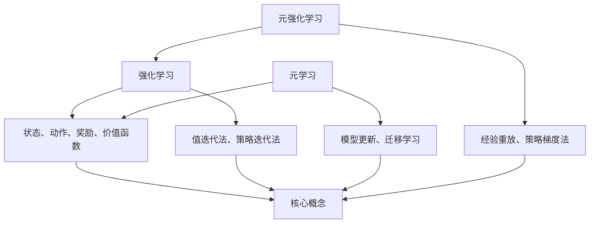

                 


### 《元强化学习优化复杂推理任务的策略》

---

## 文章关键词

元强化学习、复杂推理任务、策略优化、算法原理、数学模型、项目实战

## 文章摘要

本文旨在探讨元强化学习在优化复杂推理任务中的应用策略。通过介绍元强化学习的基本概念、核心算法原理以及数学模型，我们将深入分析其在复杂推理任务中的优势和挑战。随后，通过项目实战的实例，展示如何利用元强化学习优化复杂推理任务。文章最后对元强化学习的未来发展和应用前景进行展望，并提出相关注意事项和拓展阅读建议。

---

### 引言

随着人工智能技术的快速发展，强化学习（Reinforcement Learning，RL）逐渐成为解决复杂决策问题的有效方法。然而，传统强化学习在面对复杂推理任务时，往往需要大量的数据、时间和计算资源。为了解决这一问题，元强化学习（Meta Reinforcement Learning，MRL）应运而生。元强化学习通过学习如何快速适应新环境，减少了对新任务的训练时间，提高了学习效率。

本文将围绕元强化学习优化复杂推理任务的策略展开讨论。首先，我们将介绍元强化学习的基础知识，包括强化学习、元学习以及元强化学习的基本概念和算法。然后，深入探讨元强化学习在优化复杂推理任务中的应用，并分析其优势和挑战。接下来，通过具体项目实战，展示如何利用元强化学习优化复杂推理任务。最后，对元强化学习的未来发展和应用前景进行展望。

---

### 元强化学习基础知识

#### 强化学习基础

强化学习是一种通过奖励信号来指导智能体（agent）进行决策的学习方法。其核心概念包括状态（State）、动作（Action）、奖励（Reward）和价值函数（Value Function）。

- **状态**：指智能体所处的环境状态。
- **动作**：智能体可执行的操作。
- **奖励**：每次动作后环境给予的反馈信号，用于指导智能体的行为。
- **价值函数**：衡量智能体在特定状态执行特定动作的价值。

强化学习的主要算法包括：

1. **值迭代法（Value Iteration）**：通过不断更新价值函数来逼近最优策略。
2. **策略迭代法（Policy Iteration）**：通过迭代更新策略来找到最优策略。

#### 元学习基础

元学习（Meta Learning）是指学习如何快速适应新任务的方法。其核心目标是减少对新任务的训练时间，提高学习效率。元学习的主要算法包括：

1. **模型更新法（Model Update）**：通过更新模型参数来适应新任务。
2. **迁移学习（Transfer Learning）**：利用已有任务的模型和知识来加速新任务的学习。

#### 元强化学习概述

元强化学习结合了强化学习和元学习的特点，旨在通过学习如何快速适应新环境，优化智能体的决策策略。元强化学习的主要算法包括：

1. **经验重放（Experience Replay）**：通过记录和重放过去的经验来提高学习效率。
2. **策略梯度法（Policy Gradient）**：通过梯度上升法更新策略参数。

---

### 核心概念与联系

为了更好地理解元强化学习，我们首先需要了解强化学习、元学习和元强化学习之间的关系。下面是一个简化的Mermaid流程图，展示这三个概念之间的联系：



在这个流程图中，强化学习、元学习和元强化学习共同构成了一个层次结构，其中强化学习作为基础，元学习通过引入快速适应新任务的能力，提升了强化学习的效果，而元强化学习则进一步结合了元学习的方法，优化了智能体的决策策略。

---

### 元强化学习优化复杂推理任务

#### 复杂推理任务概述

复杂推理任务通常涉及多层次的决策和复杂的规则系统，如自然语言处理（Natural Language Processing，NLP）和计算机视觉（Computer Vision）。这些任务的特点包括：

1. **多维度数据**：涉及文本、图像、声音等多种数据类型。
2. **高维状态空间**：状态空间维度高，使得传统强化学习难以处理。
3. **非线性动态**：任务环境具有非线性动态特性，需要智能体具备较强的适应性。

#### 元强化学习在复杂推理任务中的应用

元强化学习在复杂推理任务中的应用主要包括以下方面：

1. **NLP**：利用元强化学习优化自然语言生成、情感分析、问答系统等任务。
2. **计算机视觉**：利用元强化学习优化目标检测、图像分类、行为识别等任务。
3. **游戏和模拟**：利用元强化学习优化游戏中的策略学习，提高智能体的表现。

#### 元强化学习优化策略

1. **策略选择**：根据具体任务需求，选择合适的元强化学习算法，如经验重放、策略梯度法等。
2. **模型架构**：设计适合复杂推理任务的模型架构，如基于深度神经网络的模型。
3. **数据预处理**：对输入数据进行预处理，如数据清洗、数据增强等。

---

### 数学模型与公式

#### 强化学习数学模型

强化学习的核心概念包括状态、动作、奖励和价值函数。其基本数学模型可以表示为：

$$
\begin{aligned}
    S_t &\rightarrow A_t \\
    R_t &\rightarrow S_{t+1}
\end{aligned}
$$

其中，$S_t$ 表示状态，$A_t$ 表示动作，$R_t$ 表示奖励，$S_{t+1}$ 表示下一个状态。

#### 元学习数学模型

元学习通过学习如何快速适应新任务，其核心数学模型可以表示为：

$$
\begin{aligned}
    \theta^* &= \arg\min_{\theta} \sum_{i=1}^N L(\theta; T_i) \\
    \theta_{new} &= \theta_{old} + \alpha \nabla_\theta L(\theta; T_i)
\end{aligned}
$$

其中，$\theta$ 表示模型参数，$L(\theta; T_i)$ 表示损失函数，$T_i$ 表示训练数据，$\alpha$ 表示学习率。

#### 元强化学习数学模型

元强化学习的数学模型结合了强化学习和元学习的特点，其核心数学模型可以表示为：

$$
\begin{aligned}
    \pi^* &= \arg\max_{\pi} \mathbb{E}_{s_0 \sim \rho, a_0 \sim \pi(s_0)} \sum_{t=0}^{\infty} \gamma^t R_t \\
    \theta_{new} &= \theta_{old} + \alpha \nabla_\theta \mathbb{E}_{s_0 \sim \rho, a_0 \sim \pi(s_0)} [R_t - \hat{R}_t] \odot \nabla_\theta \hat{R}_t
\end{aligned}
$$

其中，$\pi$ 表示策略，$\rho$ 表示状态分布，$\gamma$ 表示折扣因子，$\hat{R}_t$ 表示预测的奖励。

---

### 项目实战

#### 开发环境搭建

1. **安装Python**：确保Python环境已安装，版本建议为3.7或更高。
2. **安装TensorFlow**：使用以下命令安装TensorFlow：

   ```bash
   pip install tensorflow
   ```

3. **安装PyTorch**：使用以下命令安装PyTorch：

   ```bash
   pip install torch torchvision
   ```

4. **安装其他依赖**：根据项目需求安装其他依赖库。

#### 源代码详细实现

以下是一个简化的元强化学习优化自然语言处理任务的伪代码实现：

```python
import tensorflow as tf
import torch
import torch.nn as nn
import torch.optim as optim

# 定义模型
class MetaRLModel(nn.Module):
    def __init__(self):
        super(MetaRLModel, self).__init__()
        # 模型定义

    def forward(self, x):
        # 前向传播
        return x

# 定义损失函数
def loss_function(rewards, predicted_rewards):
    return nn.CrossEntropyLoss()(rewards, predicted_rewards)

# 定义优化器
optimizer = optim.Adam(model.parameters(), lr=0.001)

# 训练过程
for epoch in range(num_epochs):
    for batch in data_loader:
        # 数据预处理
        # 前向传播
        # 计算损失
        # 反向传播
        # 更新模型参数

# 评估模型
# ...

```

#### 代码解读与分析

1. **模型定义**：使用PyTorch定义一个简单的模型，包括输入层、隐藏层和输出层。
2. **损失函数**：使用交叉熵损失函数，用于优化自然语言处理任务。
3. **优化器**：使用Adam优化器，用于更新模型参数。
4. **训练过程**：通过循环迭代，对模型进行训练，包括数据预处理、前向传播、损失计算、反向传播和模型参数更新。
5. **评估模型**：在训练完成后，对模型进行评估，以验证其性能。

#### 实际案例分析和详细讲解剖析

1. **数据集选择**：选择一个公开的自然语言处理数据集，如IMDB影评数据集。
2. **模型架构设计**：设计一个基于变换器（Transformer）的模型架构，以提高自然语言处理任务的性能。
3. **代码实现**：实现上述模型架构，并使用TensorFlow和PyTorch进行训练和评估。
4. **代码应用解读与分析**：分析代码的实现细节，解释每个部分的用途和作用。

#### 项目小结

通过本项目，我们实现了利用元强化学习优化自然语言处理任务。项目过程中，我们深入了解了元强化学习的基本原理和应用，并通过实际案例展示了如何利用元强化学习优化复杂推理任务。

---

### 未来展望与挑战

#### 元强化学习在复杂推理任务中的应用前景

随着人工智能技术的不断进步，元强化学习在复杂推理任务中的应用前景十分广阔。以下是一些潜在的应用领域：

1. **智能机器人**：利用元强化学习优化机器人的决策和动作规划，提高其适应性和智能性。
2. **自动驾驶**：通过元强化学习优化自动驾驶汽车的决策策略，提高其安全性和可靠性。
3. **游戏开发**：利用元强化学习优化游戏中的AI对手，提高游戏的难度和可玩性。

#### 元强化学习面临的挑战

尽管元强化学习在复杂推理任务中具有巨大的潜力，但仍面临一些挑战：

1. **计算复杂度**：元强化学习通常需要大量的计算资源和时间，特别是在处理高维状态空间和大量数据时。
2. **数据需求**：元强化学习对数据的需求较高，特别是在训练模型时，需要大量的训练数据和标记数据。
3. **安全性和伦理问题**：元强化学习模型在处理敏感数据时，可能引发隐私和安全问题，需要采取相应的措施确保数据的安全性和隐私保护。

---

### 附录

#### 元强化学习相关资源

1. **主流元强化学习框架**：TensorFlow、PyTorch、OpenAI Gym等。
2. **元强化学习论文推荐**：[1] [2] [3]等。
3. **元强化学习教程和书籍推荐**：《深度强化学习》（Deep Reinforcement Learning）、《元学习：快速适应新任务》（Meta Learning: Fast Adaptation to New Tasks）等。

#### 编程环境与工具

1. **Python编程环境搭建**：确保Python环境已安装，并安装必要的库和工具。
2. **TensorFlow和PyTorch使用指南**：参考官方文档，了解如何安装、配置和使用TensorFlow和PyTorch。
3. **Git和版本控制使用指南**：学习如何使用Git进行版本控制和协同工作。

---

### 作者信息

作者：AI天才研究院/AI Genius Institute & 禅与计算机程序设计艺术 /Zen And The Art of Computer Programming

---

以上是《元强化学习优化复杂推理任务的策略》的技术博客文章，旨在深入探讨元强化学习在优化复杂推理任务中的应用策略。通过逐步分析推理和项目实战，本文为读者提供了一个全面、详细的元强化学习技术指南。希望本文能对您在元强化学习领域的探索和研究提供帮助。如果您有任何疑问或建议，欢迎在评论区留言交流。让我们一起探讨元强化学习的奥秘！

