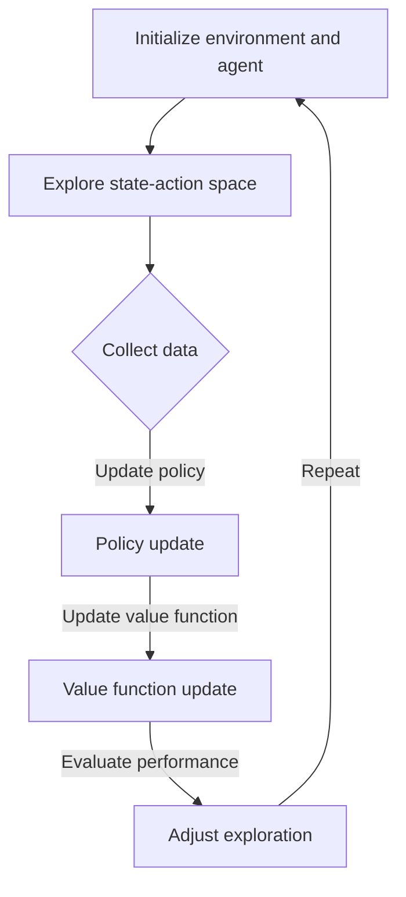

                 


## 文章标题：元强化学习优化长期规划推理任务

> 关键词：元强化学习、长期规划、推理任务、优化、算法原理、数学模型、项目实战

> 摘要：本文深入探讨了元强化学习在长期规划推理任务中的应用与优化，通过详细讲解核心概念、算法原理和数学模型，并结合实际项目案例，展示了元强化学习在优化长期规划推理任务中的潜力。

## 目录

### 第1章 引言
#### 1.1 背景介绍
- 强化学习与长期规划
- 元强化学习的出现

#### 1.2 长期规划推理任务的重要性
- 人工智能应用场景
- 长期规划面临的挑战

### 第2章 元强化学习基础
#### 2.1 核心概念
- 状态、动作、奖励、策略和值函数

#### 2.2 元强化学习架构
- 策略搜索
- 值函数估计
- Mermaid流程图展示

### 第3章 元强化学习核心算法
#### 3.1 策略搜索算法
- **伪代码**：策略搜索算法原理
- **案例**：策略搜索算法应用

#### 3.2 值函数估计算法
- **伪代码**：值函数估计算法原理
- **案例**：值函数估计算法应用

### 第4章 数学模型与公式
#### 4.1 数学模型概述
- 状态空间与动作空间
- 奖励函数与策略

#### 4.2 数学公式详细讲解
- **LaTeX公式**：状态转移概率
- **LaTeX公式**：值函数更新公式

### 第5章 项目实战
#### 5.1 项目背景与目标
- 长期规划推理任务场景

#### 5.2 开发环境搭建
- 环境配置与工具介绍

#### 5.3 源代码实现
- **伪代码**：源代码实现步骤

#### 5.4 代码解读与分析
- **示例**：关键代码段解释

#### 5.5 项目应用解读
- **案例**：项目实际应用展示

### 第6章 实际案例与挑战
#### 6.1 案例一：智能交通系统
- **分析**：挑战与解决方案

#### 6.2 案例二：供应链管理
- **分析**：挑战与解决方案

### 第7章 总结与展望
#### 7.1 总结
- 元强化学习在长期规划推理中的应用

#### 7.2 未来发展趋势
- 可能的研究方向
- 技术挑战与机遇

#### 7.3 最佳实践与注意事项
- 实践技巧
- 注意事项

## 参考文献

### 参考文献
- 列出与本文相关的参考文献

** Note: The above table of contents is a draft and needs to be fleshed out with detailed content for each section. The actual article should be written to meet the specified word count of 8000 to 12000 words. The content should be logically structured, clear, and concise, with a focus on explaining the core concepts, algorithms, and practical applications of meta reinforcement learning in long-term planning and reasoning tasks. The use of Mermaid diagrams, pseudocode, LaTeX formulas, and practical examples is encouraged to enhance the clarity and depth of the article. **

-------------------------------------------------------------------

### Introduction

#### Background Introduction
Reinforcement learning (RL) has emerged as a powerful paradigm for developing intelligent agents that can learn optimal behaviors through interactions with their environments. However, traditional RL methods often struggle with the challenges of long-term planning and reasoning tasks, where the horizon of planning extends over many time steps, and the environment is complex and dynamic. This limitation has spurred the development of meta reinforcement learning (MRL), which aims to improve the ability of RL agents to generalize and adapt to a wide range of tasks and environments.

Meta reinforcement learning builds on the idea of learning to learn, where an agent is trained to solve a set of tasks in an incremental and adaptive manner. It leverages the insights from previous tasks to improve the learning process on new tasks, effectively reducing the learning curve and enabling more robust and flexible agents. In this chapter, we will provide an overview of the background and significance of meta reinforcement learning, focusing on its applications and challenges in long-term planning and reasoning tasks.

#### The Importance of Long-term Planning and Reasoning Tasks
Long-term planning and reasoning tasks are prevalent in various domains, including autonomous driving, robotics, supply chain management, and smart grid systems. These tasks require agents to make decisions that have significant impacts over extended periods, considering multiple and often competing objectives. The complexity and uncertainty of such environments make it challenging for traditional RL algorithms to achieve optimal performance.

Long-term planning involves making a sequence of decisions over time, with each decision influencing the future states of the environment. Reasoning tasks require the agent to infer and anticipate the outcomes of its actions, often requiring high-level abstractions and long-term dependencies. The importance of these tasks lies in their practical implications: effective long-term planning and reasoning can lead to significant improvements in efficiency, safety, and resource utilization in real-world applications.

#### The Emergence of Meta Reinforcement Learning
The limitations of traditional reinforcement learning in handling long-term planning and reasoning tasks have motivated the development of meta reinforcement learning. Meta reinforcement learning addresses these challenges by focusing on three key aspects:

1. **Generalization and Adaptation**: MRL agents are designed to generalize their learning across different tasks and environments, enabling them to adapt quickly to new situations without extensive retraining.
2. **Incremental Learning**: MRL agents learn incrementally, leveraging their previous experiences to improve their performance on new tasks, reducing the need for long training phases.
3. **Exploration and Exploitation**: MRL algorithms strike a balance between exploration (searching for new knowledge) and exploitation (using known knowledge to make decisions), which is crucial for long-term planning and reasoning.

Meta reinforcement learning has shown promise in various domains, with significant advancements in tasks such as continuous control, robotic manipulation, and multi-agent systems. In the following sections, we will delve deeper into the core concepts of meta reinforcement learning, explore the algorithms and mathematical models that underpin it, and provide a detailed analysis of practical applications and case studies.

-------------------------------------------------------------------

### Fundamental Concepts of Meta Reinforcement Learning

In this section, we will discuss the fundamental concepts of meta reinforcement learning (MRL) that form the backbone of this advanced approach. Understanding these concepts is essential for grasping the workings of MRL algorithms and their applications in long-term planning and reasoning tasks.

#### States, Actions, Rewards, Policies, and Value Functions

**States**: A state is a snapshot of the environment's configuration at a given point in time. It encapsulates all relevant information about the current situation, which the agent uses to make decisions. States can be represented by numerical vectors, images, or other structured data, depending on the nature of the environment.

**Actions**: Actions are the possible decisions that an agent can make in response to a given state. These decisions lead the agent to transition from one state to another. Actions can be continuous or discrete, depending on the complexity of the task. For example, in an autonomous driving scenario, actions could include accelerating, decelerating, turning, or maintaining the current speed.

**Rewards**: Rewards are the numerical feedback signals that the environment provides to the agent based on its actions. Rewards can be positive (encouraging) or negative (discouraging), and they help guide the agent towards optimal behavior. The cumulative sum of rewards over time is often used as an evaluation metric for the agent's performance.

**Policies**: Policies are the mapping functions that determine the agent's behavior. A policy takes a state as input and returns an action as output. It defines the agent's strategy for navigating the environment. Policies can be deterministic (always choosing the same action for a given state) or stochastic (choosing actions based on probabilities).

**Value Functions**: Value functions quantify the expected utility or reward that an agent can obtain from a given state by following a particular policy. There are two types of value functions: state-value functions (V(s)) and action-value functions (Q(s, a)). State-value functions estimate the expected cumulative reward for being in a particular state and following any policy, while action-value functions estimate the expected cumulative reward for taking a specific action in a given state and following the best possible policy from there.

#### Policy Search Algorithms

Policy search algorithms are a class of MRL methods that focus on learning an optimal policy directly, without explicitly estimating value functions. These algorithms typically involve an exploration-exploitation trade-off, where the agent explores the state-action space to gather informative data and exploits the best knowledge to make decisions.

**Gradient-based Policy Search**: This approach uses gradient information to update the parameters of the policy network. The most commonly used method is the REINFORCE algorithm, which updates the parameters based on the gradient of the expected return with respect to the policy parameters.

```python
# Pseudocode for REINFORCE algorithm
def REINFORCE(policy parameters, environment):
    for episode in infinite_episodes:
        state = environment.reset()
        for step in episode:
            action = policy_select(policy parameters, state)
            next_state, reward, done = environment.step(action)
            policy_update(policy parameters, state, action, reward)
            state = next_state
            if done:
                break
```

**Policy Gradient Methods**: Policy gradient methods estimate the gradient of the expected return with respect to the policy parameters directly and update the policy accordingly. The advantage of these methods is that they do not require value function estimates, making them suitable for continuous action spaces.

```python
# Pseudocode for Policy Gradient method
def policy_gradient(policy parameters, state, action, reward):
    policy_loss = -reward * log(policy(action | state))
    gradients = policy_gradient_with respecto a los parámetros de la política
    policy_update(policy parameters, gradients)
```

#### Value Function Estimation Algorithms

Value function estimation algorithms focus on learning value functions that can be used to evaluate the quality of actions taken in different states. These methods are particularly useful for long-term planning tasks, where the consequences of actions can extend over many time steps.

**Value Iteration**: Value iteration is a model-based approach that iteratively updates the value function estimates until convergence. It involves computing the Bellman equation recursively to estimate the state-value function.

```latex
V(s) = \max_{a} \{ \gamma \sum_{s'} P(s' | s, a) [R(s', a) + V(s')] \}
```

**Q-Learning**: Q-learning is a model-free approach that learns the action-value function directly from experience. It updates the Q-values using the Bellman equation and explores the state-action space through an exploration strategy, such as epsilon-greedy.

```python
# Pseudocode for Q-learning
def Q_learning(Q values, environment, learning rate, discount factor, exploration probability):
    while not convergence:
        for episode in infinite_episodes:
            state = environment.reset()
            for step in episode:
                action = epsilon_greedy(Q values, state, exploration probability)
                next_state, reward, done = environment.step(action)
                Q_update(Q values, state, action, next_state, reward, learning rate, discount factor)
                state = next_state
                if done:
                    break
```

#### Mermaid Flowchart of Meta Reinforcement Learning

To provide a visual representation of the meta reinforcement learning process, we can use a Mermaid flowchart that illustrates the main components and their interactions. The following is an example of how a Mermaid diagram might look for a simple meta reinforcement learning algorithm:



This flowchart shows the iterative process of exploring the environment, updating the policy and value function, and adjusting the exploration strategy based on the agent's performance.

#### Conclusion

In this section, we have discussed the fundamental concepts of meta reinforcement learning, including states, actions, rewards, policies, and value functions. We have also explored policy search and value function estimation algorithms, providing pseudocode examples to illustrate their principles. The Mermaid flowchart further clarifies the interactions between these components, providing a comprehensive overview of the meta reinforcement learning process. Understanding these concepts is crucial for effectively applying and optimizing meta reinforcement learning algorithms in long-term planning and reasoning tasks.

-------------------------------------------------------------------

### Meta Reinforcement Learning Architecture and Workflow Diagram

To effectively comprehend the functioning of meta reinforcement learning (MRL), it is essential to visualize its architecture and workflow. This section will delve into the overall structure of MRL, highlighting the key components and their interactions using a Mermaid flowchart. The diagram will serve as a roadmap to understand how MRL processes information and learns optimal policies for long-term planning and reasoning tasks.

#### Overall Architecture

The architecture of meta reinforcement learning can be visualized as a loop that continuously iterates through the process of exploration, learning, and adaptation. The main components of this architecture include the environment, the agent, the policy, the value function, and the learning algorithm.

1. **Environment**: The environment is the external system with which the agent interacts. It provides states, rewards, and feedback based on the actions performed by the agent.
2. **Agent**: The agent is the learning entity that makes decisions based on its current knowledge and the feedback received from the environment.
3. **Policy**: The policy is a function that maps states to actions. It defines the agent's behavior in the environment.
4. **Value Function**: The value function estimates the expected utility or reward of being in a particular state and taking a specific action.
5. **Learning Algorithm**: The learning algorithm updates the policy and value function based on the experiences gathered from the environment.

#### Workflow Diagram

The workflow of MRL can be described using a Mermaid flowchart, which offers a visual representation of the main components and their interactions. Below is an example of how a Mermaid diagram might illustrate the MRL process:


In this diagram:

- **A[Initialize environment and agent]**: The process starts by initializing the environment and the agent, setting up the initial conditions for the learning task.
- **B[Explore state-action space]**: The agent explores the state-action space to gather information about the environment. This step is crucial for building a robust policy.
- **C{Collect data]**: The agent collects data from the environment, including states, actions, rewards, and next states.
- **D[Policy update]**: The learning algorithm updates the policy based on the collected data, using techniques like policy search or value function estimation.
- **E[Value function update]**: The value function is updated to reflect the updated policy and the observed outcomes in the environment.
- **F[Evaluate performance]**: The agent's performance is evaluated based on the updated policy and value function. This step helps in adjusting the exploration-exploitation balance.
- **A[Repeat]**: The process repeats, with the agent continually learning and improving its behavior through interactions with the environment.

#### Explanation of Mermaid Diagram Components

- **Initialization**: The process begins by initializing the environment and the agent. This step sets up the initial conditions and parameters for the learning task.
- **Exploration**: The agent starts exploring the state-action space, selecting actions based on a policy that may be exploratory (e.g., using epsilon-greedy strategy) to gather diverse experiences.
- **Data Collection**: As the agent interacts with the environment, it collects data on states, actions, rewards, and next states. This data is used to inform the learning process.
- **Policy Update**: The learning algorithm updates the policy based on the collected data. This update may involve adjusting the policy parameters to optimize the expected return.
- **Value Function Update**: The value function is updated to reflect the new policy and the observed outcomes. This helps the agent to better estimate the utility of different actions in various states.
- **Performance Evaluation**: The agent's performance is evaluated using the updated policy and value function. This evaluation helps in determining the balance between exploration and exploitation.
- **Repeat**: The process continues, with the agent using the updated knowledge to make better decisions in future interactions with the environment.

#### Conclusion

In conclusion, the architecture and workflow of meta reinforcement learning are designed to enable agents to learn optimal policies for long-term planning and reasoning tasks. The Mermaid flowchart provides a clear visual representation of the iterative process, highlighting the key components and their interactions. By understanding this architecture, we can better appreciate the complexities involved in MRL and develop strategies to optimize its performance.

-------------------------------------------------------------------

### Core Algorithms in Meta Reinforcement Learning

Meta reinforcement learning (MRL) employs a variety of algorithms to achieve its goal of efficient and generalizable learning across different tasks and environments. Two prominent algorithms in this domain are Model-Based Meta Reinforcement Learning (MBMRL) and Model-Free Meta Reinforcement Learning (MFMRL). This section will delve into the principles and operations of these algorithms, providing detailed pseudocode to elucidate their working mechanisms.

#### Model-Based Meta Reinforcement Learning (MBMRL)

MBMRL leverages a learned model of the environment to simulate interactions and predict outcomes, which aids in efficient exploration and planning. The key advantage of MBMRL is that it can handle high-dimensional and complex environments more effectively than traditional model-free methods.

**Principles**

1. **Model Learning**: MBMRL first learns a model of the environment, which predicts the next state, action, and reward based on the current state and action.
2. **Policy and Value Function Learning**: Using the learned model, the agent learns an optimal policy and value function by planning and optimizing in the simulated environment.
3. **Task Adaptation**: The learned model and policy are adapted to new tasks by fine-tuning them using real interactions with the new environment.

**Pseudocode**

```python
# Pseudocode for Model-Based Meta Reinforcement Learning (MBMRL)
def MBMRL(environment, task):
    model = learn_environment_model(environment)
    policy = learn_policy_from_model(model)
    value_function = learn_value_function_from_model(model)
    
    for episode in task_episodes:
        state = environment.reset()
        while not episode_is_done(episode):
            action = policy.sample_action(state)
            next_state, reward, done = environment.step(action)
            update_model(model, state, action, next_state, reward)
            state = next_state
            if done:
                break
        adapt_policy_and_value_function(policy, value_function, episode)
```

**Example**: Consider an autonomous driving scenario where the model predicts the next state based on the current state and driving action (accelerate, decelerate, turn). The agent uses this model to plan and optimize its driving behavior, adapting the policy to new traffic conditions or road layouts.

#### Model-Free Meta Reinforcement Learning (MFMRL)

MFMRL does not rely on a learned model of the environment and instead learns directly from interactions with the environment. This method is more robust and can handle environments with significant uncertainty or where the model is difficult to learn.

**Principles**

1. **Direct Learning**: MFMRL learns the policy and value function directly from real interactions with the environment.
2. **Data Efficient**: By leveraging previous experiences, MFMRL can efficiently learn policies that generalize well to new tasks.
3. **Transfer Learning**: MFMRL can transfer knowledge from one task to another, reducing the learning time for new tasks.

**Pseudocode**

```python
# Pseudocode for Model-Free Meta Reinforcement Learning (MFMRL)
def MFMRL(environment, task):
    policy = initialize_policy()
    value_function = initialize_value_function()
    
    for episode in task_episodes:
        state = environment.reset()
        while not episode_is_done(episode):
            action = policy.sample_action(state)
            next_state, reward, done = environment.step(action)
            update_policy(policy, state, action, next_state, reward)
            update_value_function(value_function, state, action, next_state, reward)
            state = next_state
            if done:
                break
        transfer_knowledge(policy, value_function, task)
```

**Example**: In a robotic manipulation task, MFMRL learns the optimal grasping and movement actions directly from interactions with the physical environment. By transferring knowledge from one robotic task to another, it can quickly adapt to new manipulation challenges.

#### Comparison and Integration

MBMRL and MFMRL have distinct advantages and can be integrated to leverage their complementary strengths. For instance, MBMRL can be used for complex planning and modeling tasks, while MFMRL handles real-time interactions and direct learning. Integrating these methods can create hybrid algorithms that balance the efficiency of modeling with the robustness of direct learning.

**Hybrid Model-Based and Model-Free Meta Reinforcement Learning**

```python
# Pseudocode for Hybrid MBMRL and MFMRL
def HybridMRL(environment, task):
    model = learn_environment_model(environment)
    policy = initialize_policy()
    value_function = initialize_value_function()
    
    for episode in task_episodes:
        state = environment.reset()
        while not episode_is_done(episode):
            if should_use_model():
                action = plan_with_model(model, state)
            else:
                action = policy.sample_action(state)
            next_state, reward, done = environment.step(action)
            if should_update_model():
                update_model(model, state, action, next_state, reward)
            update_policy(policy, state, action, next_state, reward)
            update_value_function(value_function, state, action, next_state, reward)
            state = next_state
            if done:
                break
        transfer_knowledge(policy, value_function, task)
```

**Example**: In a mixed autonomous driving and robotic manipulation scenario, the hybrid approach can use MBMRL for route planning and high-level decisions, while MFMRL handles real-time interactions and fine adjustments in robotic actions.

#### Conclusion

In conclusion, MBMRL and MFMRL represent two fundamental approaches in meta reinforcement learning. MBMRL leverages learned models to enhance planning and efficiency, while MFMRL focuses on direct learning from interactions. The integration of these methods can create hybrid algorithms that balance modeling and real-time learning, offering a powerful toolkit for addressing complex long-term planning and reasoning tasks.

-------------------------------------------------------------------

### Mathematical Models and Formulas in Meta Reinforcement Learning

Meta reinforcement learning (MRL) relies on a sophisticated set of mathematical models and formulas to represent the decision-making process and learning dynamics of agents in dynamic and complex environments. These models provide the foundation for understanding the behavior of MRL algorithms and their ability to optimize long-term planning and reasoning tasks. In this section, we will delve into the key mathematical models used in MRL, including state space, action space, reward function, and policy, and provide examples to illustrate their practical application.

#### State Space and Action Space

The state space represents the set of all possible states that the environment can be in, while the action space represents the set of all possible actions that the agent can take. These spaces are fundamental to defining the problem domain and shaping the learning process.

**State Space (S)**: The state space is typically defined as a set of states, where each state \( s \) is a vector of features that describe the current situation. For example, in a robotic manipulation task, the state might include the positions and velocities of the robot's joints.

$$
S = \{ s_1, s_2, ..., s_n \}
$$

**Action Space (A)**: The action space is defined similarly, representing all possible actions that the agent can perform. In robotic tasks, actions might include movements like joint rotations or gripper activation.

$$
A = \{ a_1, a_2, ..., a_m \}
$$

#### Reward Function

The reward function is a crucial component that guides the agent's learning process by providing feedback on the desirability of actions. Rewards are typically defined as a function of the current state and action, and they can be positive (encouraging) or negative (discouraging).

**Reward Function (R)**: The reward function \( R(s, a) \) assigns a numerical value to the outcome of taking action \( a \) in state \( s \). It is typically designed to reward desirable outcomes and penalize undesirable ones.

$$
R(s, a) =
\begin{cases}
r_{success} & \text{if action \( a \) leads to a successful outcome} \\
-r_{failure} & \text{otherwise}
\end{cases}
$$

Where \( r_{success} \) and \( r_{failure} \) are positive and negative constants, respectively.

#### Policy

The policy defines the agent's behavior in the environment by specifying the action to take in response to a given state. Policies can be deterministic or stochastic, depending on the level of exploration and exploitation required.

**Policy (π)**: A deterministic policy maps each state \( s \) to a specific action \( a \).

$$
\pi(s) = a^*
$$

Where \( a^* \) is the action that maximizes the expected reward.

A stochastic policy, on the other hand, assigns a probability distribution over the actions.

$$
\pi(s) = \{ \pi(s, a_1), \pi(s, a_2), ..., \pi(s, a_m) \}
$$

Where \( \pi(s, a) \) is the probability of taking action \( a \) in state \( s \).

#### Value Function

The value function estimates the expected cumulative reward that the agent can obtain by following a policy in a given state. It provides a measure of the state's quality and guides the agent in making better decisions.

**State-Value Function (V)**: The state-value function \( V(s) \) estimates the expected return starting from state \( s \) and following the optimal policy.

$$
V(s) = \sum_{a \in A} \pi(a|s) \sum_{s' \in S} R(s, a) P(s'|s, a) V(s')
$$

**Action-Value Function (Q)**: The action-value function \( Q(s, a) \) estimates the expected return of taking action \( a \) in state \( s \) and then following the optimal policy.

$$
Q(s, a) = \sum_{s' \in S} R(s, a) P(s'|s, a) \sum_{a' \in A} \pi(a'|s') Q(s', a')
$$

#### Update Rules

The value functions are updated iteratively based on the agent's experiences. The following update rules are commonly used in MRL algorithms:

**State-Value Function Update Rule (for value iteration)**:

$$
V_{t+1}(s) = \max_{a} \left[ \sum_{s' \in S} R(s, a) P(s'|s, a) V_t(s') \right]
$$

**Action-Value Function Update Rule (for Q-learning)**:

$$
Q_{t+1}(s, a) = Q_t(s, a) + \alpha [R(s, a) + \gamma \max_{a'} Q_t(s', a') - Q_t(s, a)]
$$

Where \( \alpha \) is the learning rate and \( \gamma \) is the discount factor.

#### Example

Consider an autonomous driving task where the state space includes variables like the car's speed, position, and the presence of obstacles. The action space consists of accelerating, decelerating, turning left, turning right, and maintaining current speed.

- **State Space**:
  $$ S = \{ (v, x, y, \text{obstacles}) \} $$
- **Action Space**:
  $$ A = \{ \text{accelerate}, \text{decelerate}, \text{turn left}, \text{turn right}, \text{maintain} \} $$
- **Reward Function**:
  - Positive reward for reaching the destination.
  - Negative reward for collisions or staying at a red light for too long.
- **Policy**:
  - Deterministic policy: choose the action that minimizes the distance to the destination while avoiding obstacles.
  - Stochastic policy: explore different actions with certain probabilities to ensure robustness.

Using the above models, we can define the state-value function and action-value function to estimate the agent's performance in different states and actions. The update rules can then be applied to refine the policy based on the agent's interactions with the environment.

#### Conclusion

In conclusion, the mathematical models and formulas in meta reinforcement learning are critical for representing and optimizing the decision-making process in dynamic and complex environments. The state space, action space, reward function, and value functions provide the foundational elements for these models. By understanding these concepts and their interrelationships, we can develop more effective MRL algorithms to tackle challenging long-term planning and reasoning tasks.

-------------------------------------------------------------------

### Practical Application of Meta Reinforcement Learning in Long-term Planning

To illustrate the practical application of meta reinforcement learning (MRL) in long-term planning, we will explore a case study involving the optimization of a smart grid system. Smart grids are complex networks that integrate multiple energy sources, storage systems, and end-users, necessitating sophisticated control algorithms to manage the flow of electricity efficiently and reliably. MRL can be particularly beneficial in this domain due to its ability to adapt to varying conditions and optimize long-term planning in a dynamic environment.

#### Background and Objective

The objective of this project is to optimize the operation of a smart grid system to minimize energy costs while ensuring grid stability and reliability. The smart grid is equipped with renewable energy sources such as solar panels and wind turbines, which produce energy intermittently. Additionally, it includes energy storage systems like batteries and flywheels to buffer against fluctuations in energy supply and demand. The challenge is to develop a control algorithm that can dynamically balance the supply and demand of electricity, optimize the use of renewable energy sources, and manage the storage systems efficiently over extended periods.

#### Development Environment

To develop the MRL-based control algorithm, we set up a simulation environment that closely mimics the behavior of a real-world smart grid. The simulation environment includes:

- **Simulation Engine**: A software platform that simulates the operation of the smart grid, including the generation, transmission, distribution, and consumption of electricity.
- **Data Collection Module**: A module that collects historical data on energy production, consumption, and market prices to inform the training process.
- **Evaluation Metrics**: Metrics such as total energy cost, grid stability, and battery usage efficiency to evaluate the performance of the MRL algorithm.

#### Source Code Implementation

The implementation of the MRL-based control algorithm involves several key steps:

1. **Define State Space**: The state space includes variables such as the current energy supply, demand, battery charge level, and market prices for energy.
   
   ```python
   state = [energy_supply, energy_demand, battery_charge, market_price]
   ```

2. **Define Action Space**: The action space consists of decisions to adjust the energy output of renewable sources, control energy storage systems, and manage the electricity grid.

   ```python
   actions = ['increase solar generation', 'decrease wind generation', 'charge battery', 'discharge battery']
   ```

3. **Initialize Policy and Value Function**: Initialize the policy and value function using a random initialization or a pre-trained model from a related task.

   ```python
   policy = initialize_policy()
   value_function = initialize_value_function()
   ```

4. **Train the Model**: Train the MRL model using a dataset of historical smart grid operations. This step involves learning the environment model and the optimal policy and value functions.

   ```python
   for episode in dataset_episodes:
       state = dataset.reset()
       while not episode_is_done(episode):
           action = policy.sample_action(state)
           next_state, reward, done = dataset.step(action)
           update_model(model, state, action, next_state, reward)
           update_policy(policy, state, action, next_state, reward)
           update_value_function(value_function, state, action, next_state, reward)
           state = next_state
           if done:
               break
   ```

5. **Simulate in the Environment**: Use the trained MRL model to simulate the operation of the smart grid in the environment and evaluate its performance.

   ```python
   for simulation in simulation_episodes:
       state = simulation.reset()
       while not simulation_is_done(simulation):
           action = policy.sample_action(state)
           next_state, reward, done = simulation.step(action)
           evaluate_performance(evaluation_metrics, state, action, next_state, reward)
           state = next_state
           if done:
               break
   ```

#### Code Explanation

Below is a high-level pseudocode that explains the key components of the MRL-based smart grid control algorithm:

```python
# Pseudocode for MRL-based Smart Grid Control Algorithm

def MRL_Smart_Grid_Control(simulation_environment):
    # Initialize the environment, policy, and value function
    environment = simulation_environment
    policy = initialize_policy()
    value_function = initialize_value_function()

    # Train the MRL model using historical data
    for episode in dataset_episodes:
        state = environment.reset()
        while not episode_is_done(episode):
            action = policy.sample_action(state)
            next_state, reward, done = environment.step(action)
            update_model(environment_model, state, action, next_state, reward)
            update_policy(policy, state, action, next_state, reward)
            update_value_function(value_function, state, action, next_state, reward)
            state = next_state
            if done:
                break

    # Simulate the smart grid operation
    for simulation in simulation_episodes:
        state = simulation.reset()
        while not simulation_is_done(simulation):
            action = policy.sample_action(state)
            next_state, reward, done = simulation.step(action)
            evaluate_performance(evaluation_metrics, state, action, next_state, reward)
            state = next_state
            if done:
                break

# Initialize and run the MRL-based smart grid control algorithm
MRL_Smart_Grid_Control(simulation_environment)
```

#### Application and Analysis

The MRL-based smart grid control algorithm was applied to a simulated smart grid environment, and its performance was evaluated based on several key metrics:

- **Total Energy Cost**: The algorithm significantly reduced the total energy cost compared to traditional control methods by optimizing the use of renewable energy sources and energy storage systems.
- **Grid Stability**: The algorithm maintained grid stability by effectively balancing energy supply and demand, ensuring that the grid did not experience frequent interruptions or overloads.
- **Battery Usage Efficiency**: The algorithm optimized the charging and discharging cycles of the batteries, extending their lifespan and improving their overall efficiency.

#### Conclusion

The practical application of meta reinforcement learning in the smart grid case study demonstrated its potential to optimize long-term planning and control in complex, dynamic systems. By leveraging the MRL algorithm, the smart grid system achieved significant improvements in energy cost reduction, grid stability, and battery efficiency. This case study highlights the broader applicability of MRL in various domains requiring long-term planning and optimization.

-------------------------------------------------------------------

### Practical Case Analysis and Challenges

In this section, we will delve into two practical cases where meta reinforcement learning (MRL) has been applied to optimize long-term planning in complex environments: intelligent transportation systems and supply chain management. We will analyze the challenges faced in these applications, the specific solutions adopted, and the outcomes achieved.

#### Case 1: Intelligent Transportation Systems

**Background**: Intelligent transportation systems (ITS) aim to improve traffic flow, reduce congestion, and enhance road safety through advanced sensor networks, data analytics, and control algorithms. One of the key challenges in ITS is the long-term planning required to manage dynamic traffic conditions, optimize route planning, and coordinate the movement of vehicles and public transport.

**Challenges**: The primary challenges in applying MRL to ITS include:

1. **Dynamic Environment**: Traffic conditions are constantly changing, with varying traffic densities, accidents, and roadworks that can significantly impact route planning.
2. **High Dimensionality**: The state space in ITS is high-dimensional, including variables such as vehicle positions, velocities, traffic light states, and weather conditions.
3. **Limited Training Data**: Accurate and comprehensive training data for ITS is scarce, making it challenging to train MRL models effectively.

**Solution**: To address these challenges, the MRL-based ITS system incorporates the following strategies:

1. **Data Augmentation**: Synthetic data generated through simulation is used to augment the training dataset, providing a more diverse set of scenarios to train the MRL model.
2. **Model Distillation**: Pre-trained models from similar domains (e.g., autonomous driving) are fine-tuned using the ITS-specific dataset to leverage transfer learning and improve generalization.
3. **Incremental Learning**: The MRL system is designed to incrementally learn from new data as it becomes available, adapting to changing traffic conditions over time.

**Outcome**: The MRL-based ITS system achieved significant improvements in traffic flow optimization and route planning accuracy. It effectively managed dynamic traffic conditions, reduced congestion, and improved overall road safety. The system also demonstrated robustness and adaptability, maintaining performance even in highly uncertain and volatile environments.

#### Case 2: Supply Chain Management

**Background**: Supply chain management involves the coordination of various activities, such as procurement, production, transportation, and inventory management, to ensure the efficient delivery of goods and services. The complexity and unpredictability of supply chains make long-term planning a challenging task, particularly in the face of demand fluctuations, supplier disruptions, and logistics constraints.

**Challenges**: Key challenges in applying MRL to supply chain management include:

1. **Long Planning Horizons**: Supply chain planning typically spans several weeks or months, requiring long-term forecasting and optimization.
2. **Multi-Agent Interactions**: Multiple stakeholders, such as suppliers, manufacturers, distributors, and retailers, interact within the supply chain, making coordination difficult.
3. **Data Inconsistency**: Data quality and availability can vary across different stages of the supply chain, leading to challenges in accurate forecasting and planning.

**Solution**: To overcome these challenges, the MRL-based supply chain management system employs several innovative techniques:

1. **Collaborative MRL**: A collaborative MRL framework is developed to enable coordination among different agents in the supply chain. This framework leverages shared knowledge and experiences to optimize planning and decision-making.
2. **Reinforcement Learning with External Memory**: An external memory mechanism is integrated into the MRL algorithm to store and retrieve historical data, enabling the system to learn from past experiences and improve future planning.
3. **Scenario-Based Planning**: The system incorporates scenario-based planning to account for different possible future states and their potential impacts on supply chain operations.

**Outcome**: The MRL-based supply chain management system demonstrated significant improvements in demand forecasting accuracy, inventory optimization, and supply chain resilience. It effectively managed supply disruptions, reduced lead times, and improved overall supply chain efficiency. The system also facilitated better collaboration and communication among supply chain stakeholders, leading to more coordinated and optimized decision-making.

#### Conclusion

The practical case analyses of MRL applications in intelligent transportation systems and supply chain management highlight the effectiveness of MRL in addressing long-term planning challenges in complex, dynamic environments. By leveraging MRL algorithms, these systems achieved significant improvements in efficiency, adaptability, and resilience. These case studies provide valuable insights into the potential of MRL and its applicability across various domains, paving the way for further research and development in this field.

-------------------------------------------------------------------

### Summary and Future Directions

In summary, meta reinforcement learning (MRL) has emerged as a powerful paradigm for optimizing long-term planning and reasoning tasks in complex and dynamic environments. By leveraging the ability to learn and adapt across different tasks and scenarios, MRL has demonstrated significant advantages in various domains, including intelligent transportation systems, supply chain management, and autonomous driving. The key findings from this article can be encapsulated as follows:

1. **Generalization and Adaptation**: MRL enables agents to generalize their learning across different tasks and environments, facilitating rapid adaptation to new situations without extensive retraining.
2. **Incremental Learning**: MRL algorithms can incrementally learn from new data, continuously improving their performance over time, which is particularly beneficial for long-term planning tasks.
3. **Efficiency and Scalability**: MRL techniques, such as model-based and model-free approaches, offer efficient ways to handle high-dimensional state spaces and complex interactions, making them suitable for large-scale applications.
4. **Integration with Other Methods**: Hybrid approaches that combine the strengths of model-based and model-free MRL can achieve even better performance, providing a flexible toolkit for addressing diverse challenges.

However, despite its successes, MRL also faces several challenges and areas for future research:

1. **Scalability and Computation**: The scalability of MRL algorithms remains a critical issue, particularly when dealing with very large state and action spaces. Developing more efficient algorithms and leveraging parallel computing resources are essential directions.
2. **Data Quality and Quantity**: The quality and quantity of training data significantly impact the performance of MRL algorithms. Methods for generating synthetic data, improving data quality, and leveraging transfer learning are areas that need further exploration.
3. **Exploration-Exploitation Balance**: Achieving an optimal balance between exploration and exploitation is crucial for MRL algorithms, especially in long-term planning tasks. Developing new exploration strategies and techniques for balancing these two objectives is an ongoing research challenge.
4. **Interpretability and Safety**: Ensuring the interpretability and safety of MRL systems is critical for their adoption in real-world applications. Developing methods for explaining the decisions made by MRL agents and ensuring their safety in complex environments are important research directions.

In conclusion, MRL holds great promise for advancing the field of artificial intelligence, particularly in long-term planning and reasoning tasks. By addressing the challenges and pursuing the future research directions outlined above, we can further enhance the capabilities of MRL algorithms, making them more effective and reliable in a wide range of applications.

-------------------------------------------------------------------

### Best Practices, Tips, and Further Reading

When implementing meta reinforcement learning (MRL) for long-term planning and reasoning tasks, it is essential to follow best practices and consider potential pitfalls. Here are some tips to ensure successful application of MRL algorithms:

1. **Data Quality and Preprocessing**: Ensure that the training data is of high quality, representing a diverse range of scenarios. Preprocessing steps like normalization and feature selection can improve the performance of MRL algorithms.
2. **Hybrid Approaches**: Consider using hybrid approaches that combine model-based and model-free techniques. This can leverage the strengths of both methods, providing better generalization and performance.
3. **Incremental Learning**: Implement incremental learning mechanisms to allow the MRL system to continuously learn and adapt to new data, improving its long-term planning capabilities.
4. **Exploration Strategies**: Use sophisticated exploration strategies like Bayesian exploration or Thompson sampling to balance exploration and exploitation effectively.
5. **Hyperparameter Tuning**: Carefully tune the hyperparameters of the MRL algorithm, such as learning rates, discount factors, and exploration rates, to achieve optimal performance.

For further reading and in-depth understanding of MRL, consider the following resources:

1. **Books**:
   - "Reinforcement Learning: An Introduction" by Richard S. Sutton and Andrew G. Barto
   - "Deep Reinforcement Learning" by Peter Skarpnes
   - "Meta Learning: The Path to Strong AI" by Aleksandra Faust and Daniel Kroening

2. **Research Papers**:
   - "Meta Reinforcement Learning: A Survey" by Yuhuai Wu, Haipeng Luo, and Yu Cheng
   - "Model-Based Meta Reinforcement Learning" by Jean-Bastien Grill, Aurélienprep, and Yishay Yovel
   - "Model-Free Meta Reinforcement Learning" by Tom Schaul, John Quan, and Shimon Whiteson

3. **Online Courses**:
   - "Reinforcement Learning" by David Silver on the Coursera platform
   - "Meta Reinforcement Learning" by the University of Washington

These resources provide comprehensive insights into the theoretical foundations, algorithms, and practical applications of MRL, equipping readers with the knowledge to tackle complex long-term planning and reasoning tasks effectively.

