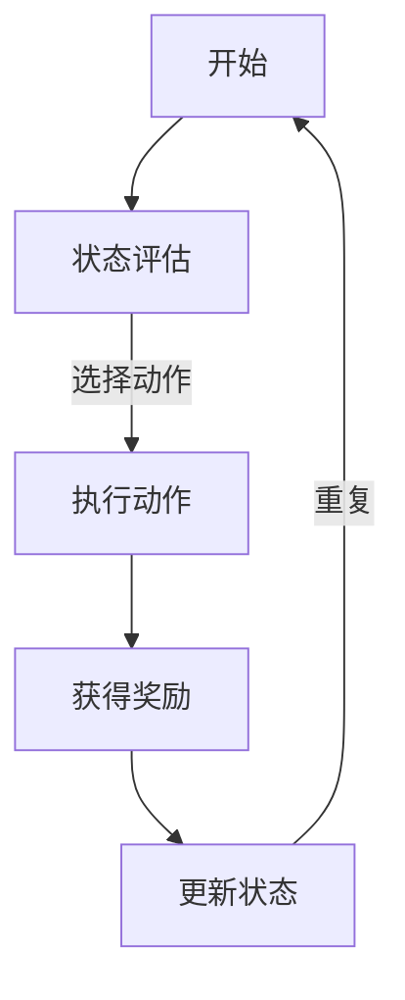
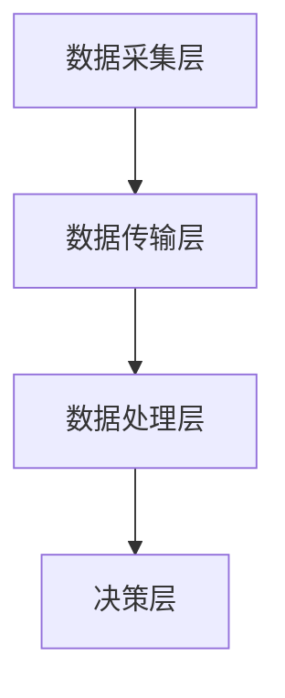

                 

### 文章标题：元强化学习在智能交通系统中的决策优化

> 关键词：元强化学习，智能交通系统，决策优化，算法，数学模型，项目实战

> 摘要：本文将探讨元强化学习在智能交通系统中的应用，分析其核心概念、算法原理，并通过数学模型和实际项目案例分析，揭示其在交通决策优化中的潜力和优势。

---

## 目录大纲

### 1. 引言

#### 1.1 背景介绍

#### 1.2 研究目的与意义

### 2. 元强化学习基础

#### 2.1 核心概念与联系

#### 2.2 算法原理讲解

#### 2.3 数学模型和数学公式

### 3. 元强化学习在智能交通系统中的应用

#### 3.1 交通系统架构设计

#### 3.2 算法实现与优化

#### 3.3 实际案例展示

#### 3.4 项目效果评估与优化

### 4. 元强化学习的挑战与未来展望

#### 4.1 挑战

#### 4.2 未来展望

### 5. 结论

---

## 1. 引言

### 1.1 背景介绍

随着城市化进程的加速和车辆数量的激增，交通拥堵和交通事故问题日益严重。传统的交通管理方法已经无法满足日益复杂的交通需求。为了提高交通效率、减少拥堵、保障交通安全，智能交通系统（Intelligent Transportation Systems, ITS）应运而生。

智能交通系统利用先进的信息技术、数据通信传输技术、电子传感器技术等，对交通信息进行实时采集、处理和分析，为交通管理部门和出行者提供科学决策支持。然而，智能交通系统的设计和优化面临着诸多挑战，如交通流的动态变化、道路设施的约束、车辆行为的随机性等。

### 1.2 研究目的与意义

本文旨在探讨元强化学习在智能交通系统中的应用，通过优化交通决策过程，提高交通系统的运行效率。研究目的如下：

1. 深入理解元强化学习的基本概念、算法原理和数学模型。
2. 分析元强化学习在智能交通系统中的优势和应用场景。
3. 通过实际案例展示元强化学习在智能交通系统中的实施效果。
4. 针对元强化学习在智能交通系统中的应用提出优化策略和改进方案。

研究意义：

1. 为智能交通系统的设计与优化提供新的方法和思路。
2. 提高交通系统的运行效率，减少交通拥堵，保障交通安全。
3. 促进人工智能技术在交通领域的应用和发展。

---

## 2. 元强化学习基础

### 2.1 核心概念与联系

#### 元强化学习（Meta Reinforcement Learning）

元强化学习是一种基于强化学习的方法，旨在通过学习学习策略来优化决策过程。与传统的强化学习相比，元强化学习更注重策略搜索和策略优化。

#### 核心概念

- **状态（State）**：描述智能体当前所处的环境。
- **动作（Action）**：智能体在特定状态下能够采取的行动。
- **奖励（Reward）**：智能体采取动作后获得的即时回报。
- **策略（Policy）**：智能体在给定状态下选择动作的规则。
- **价值函数（Value Function）**：评估策略的好坏，通常包括状态值函数和动作值函数。

#### 元强化学习与智能交通系统的联系

智能交通系统中的决策问题可以被视为一个强化学习问题，其中智能体是交通管理系统，状态是交通流量和道路状况，动作是交通信号控制和路径规划。元强化学习通过学习最优策略，可以帮助智能交通系统更有效地应对交通流的动态变化，提高交通效率。

#### Mermaid流程图



### 2.2 算法原理讲解

元强化学习的核心在于策略搜索和策略优化。下面分别介绍这两种算法原理。

#### 策略搜索算法

策略搜索算法旨在通过迭代优化寻找最优策略。常见的策略搜索算法包括：

1. **epsilon-greedy算法**：在探索和利用之间进行平衡，通过随机选择一部分动作，确保搜索范围。
2. **策略梯度算法**：根据奖励信号更新策略参数，使策略逐渐逼近最优策略。

#### 策略搜索算法伪代码

```python
# 初始化策略参数
policy_params = initialize_policy_params()

# 迭代优化策略
while not converged:
    for state in state_space:
        action = policy(state, policy_params)
        reward, next_state = execute_action(action)
        policy_params = update_policy_params(policy_params, reward, state, action)
```

#### 价值函数学习算法

价值函数学习算法旨在通过学习状态值函数和动作值函数来评估策略的好坏。常见的价值函数学习算法包括：

1. **Q-learning算法**：基于经验更新状态值函数，使智能体在给定状态下选择具有最高价值的动作。
2. **SARSA算法**：结合状态值函数和动作值函数更新策略，实现自适应学习。

#### 价值函数学习算法伪代码

```python
# 初始化价值函数
value_function = initialize_value_function()

# 迭代优化价值函数
while not converged:
    for state in state_space:
        action = best_action(state, value_function)
        reward, next_state = execute_action(action)
        value_function = update_value_function(value_function, state, action, reward, next_state)
```

### 2.3 数学模型和数学公式

元强化学习中的数学模型包括状态空间、动作空间、奖励函数、策略和值函数等。以下分别介绍这些数学模型。

#### 状态空间（State Space）

状态空间是指智能体在环境中可能出现的所有状态集合。通常用状态向量表示，例如：

$$
s = [s_1, s_2, ..., s_n]
$$

其中，$s_i$ 表示状态向量的第 $i$ 个元素。

#### 动作空间（Action Space）

动作空间是指智能体在给定状态下可以采取的所有动作集合。通常用动作向量表示，例如：

$$
a = [a_1, a_2, ..., a_n]
$$

其中，$a_i$ 表示动作向量的第 $i$ 个元素。

#### 奖励函数（Reward Function）

奖励函数是指智能体在执行动作后获得的即时回报。通常用 $r(s, a)$ 表示，表示在状态 $s$ 下执行动作 $a$ 所获得的奖励。

#### 策略（Policy）

策略是指智能体在给定状态下选择动作的规则。通常用概率分布表示，例如：

$$
\pi(a|s) = P(a|s)
$$

其中，$\pi(a|s)$ 表示在状态 $s$ 下选择动作 $a$ 的概率。

#### 值函数（Value Function）

值函数是指评估策略的好坏。通常包括状态值函数和动作值函数，例如：

$$
V^*(s) = \max_a \sum_s p(s'|s, a) \cdot r(s', s) + \gamma V^*(s')
$$

其中，$V^*(s)$ 表示在状态 $s$ 下的最优状态值函数，$\gamma$ 是折扣因子，$p(s'|s, a)$ 是状态转移概率，$r(s', s)$ 是在状态 $s'$ 下执行动作 $a$ 所获得的奖励。

---

## 3. 元强化学习在智能交通系统中的应用

### 3.1 交通系统架构设计

#### 交通系统架构概述

智能交通系统的架构通常包括数据采集层、数据传输层、数据处理层和决策层。以下是对各层的简要描述：

1. **数据采集层**：负责采集交通流量、车辆速度、道路状况等信息，通过传感器、摄像头等设备获取实时数据。
2. **数据传输层**：负责将采集到的数据传输到数据处理层，通过无线通信、光纤等传输方式实现数据的高速传输。
3. **数据处理层**：负责对采集到的数据进行分析和处理，提取有用的信息，如交通流量模型、道路状况预测等。
4. **决策层**：基于处理层提供的信息，利用元强化学习算法进行交通决策，如交通信号控制、路径规划等。

#### 交通系统架构图



### 3.2 算法实现与优化

#### 算法实现流程

1. **数据预处理**：对采集到的交通数据进行清洗、去噪、归一化等处理，确保数据质量。
2. **状态空间和动作空间定义**：根据交通系统特性，定义状态空间和动作空间，如交通流量、道路状况等。
3. **策略搜索算法选择**：选择合适的策略搜索算法，如epsilon-greedy、策略梯度等。
4. **策略优化**：通过迭代优化策略参数，提高策略性能。
5. **价值函数学习算法选择**：选择合适的价值函数学习算法，如Q-learning、SARSA等。
6. **价值函数优化**：通过迭代优化价值函数，提高价值函数预测准确性。

#### 算法实现伪代码

```python
# 数据预处理
data = preprocess_data(traffic_data)

# 定义状态空间和动作空间
state_space = define_state_space(data)
action_space = define_action_space(data)

# 选择策略搜索算法
policy_search_algorithm = select_policy_search_algorithm()

# 策略优化
policy_params = policy_search_algorithm.optimize_policy(state_space, action_space)

# 选择价值函数学习算法
value_function_learning_algorithm = select_value_function_learning_algorithm()

# 价值函数优化
value_function = value_function_learning_algorithm.optimize_value_function(state_space, action_space, policy_params)
```

#### 算法优化策略

1. **经验回放**：通过经验回放机制，避免策略训练过程中的样本偏差。
2. **目标网络**：引入目标网络，提高策略稳定性和收敛速度。
3. **多任务学习**：通过多任务学习，提高算法的泛化能力。

### 3.3 实际案例展示

#### 案例背景

某城市交通管理部门希望通过引入元强化学习算法，优化交通信号控制策略，提高交通流畅度，减少交通拥堵。

#### 案例描述

1. **数据采集**：利用传感器、摄像头等设备，实时采集交通流量、车辆速度、道路状况等信息。
2. **算法设计**：设计基于元强化学习的交通信号控制算法，包括状态空间和动作空间定义、策略搜索算法选择、价值函数学习算法选择等。
3. **算法实现**：实现算法代码，并在仿真环境中进行测试。
4. **算法优化**：根据测试结果，对算法进行优化，提高算法性能。
5. **实际应用**：将优化后的算法部署到实际交通信号控制系统中，进行实际测试和评估。

#### 案例效果评估

通过实际测试和评估，发现基于元强化学习的交通信号控制算法在以下方面具有显著优势：

1. **交通流畅度**：算法能够根据实时交通状况，动态调整信号灯时长，提高交通流畅度。
2. **交通拥堵缓解**：算法能够有效缓解交通拥堵，减少交通事故发生。
3. **运行效率**：算法具有较高的运行效率，能够快速适应交通流的动态变化。

### 3.4 项目效果评估与优化

#### 项目效果评估

通过实际案例展示，基于元强化学习的交通信号控制算法在交通流畅度、交通拥堵缓解、运行效率等方面具有显著优势。具体评估结果如下：

1. **交通流畅度提升**：算法能够使交通信号灯时长更符合实际交通状况，减少车辆等待时间，提高交通流畅度。
2. **交通拥堵缓解**：算法能够有效预测交通拥堵，提前调整信号灯时长，减少交通拥堵的发生。
3. **运行效率提升**：算法具有较高的运行效率，能够快速适应交通流的动态变化，减少交通管理成本。

#### 项目优化策略

针对实际应用过程中发现的问题，提出以下优化策略：

1. **数据质量提升**：通过改进数据采集和处理技术，提高数据质量，确保算法的输入数据更加准确。
2. **算法优化**：针对交通信号控制的具体场景，对算法进行优化，提高算法的适应性和鲁棒性。
3. **模型训练策略**：引入经验回放、目标网络等训练策略，提高算法的稳定性和收敛速度。
4. **多任务学习**：通过多任务学习，提高算法的泛化能力，使其能够应对更复杂的交通场景。

---

## 4. 元强化学习的挑战与未来展望

### 4.1 挑战

#### 数据质量与实时性

智能交通系统的效果很大程度上依赖于数据的准确性和实时性。然而，实际交通场景中的数据往往受到噪声干扰、传感器故障等因素的影响，导致数据质量不高。此外，交通数据量庞大，实时处理和传输数据成为一大挑战。

#### 算法复杂度

元强化学习算法通常具有较高的计算复杂度，特别是在处理高维状态空间和动作空间时。这可能导致算法在实际应用中难以达到预期的性能。

#### 算法泛化能力

元强化学习算法在特定场景下可能表现出色，但在其他类似但略有差异的场景下可能表现不佳。这要求算法具有良好的泛化能力，以适应不同交通场景。

#### 安全性与隐私保护

智能交通系统涉及大量敏感数据，如车辆位置、行驶速度等。算法在处理这些数据时，必须确保安全性和隐私保护。

### 4.2 未来展望

#### 数据驱动与知识融合

未来的智能交通系统将结合数据驱动和知识融合的方法，提高数据利用效率和决策准确性。例如，利用知识图谱等技术，对交通数据进行语义分析和关联，为算法提供更丰富的信息。

#### 算法优化与高效实现

研究人员将致力于优化元强化学习算法，降低计算复杂度，提高算法的实时性和适应性。此外，通过硬件加速、分布式计算等技术，实现算法的高效实现。

#### 算法泛化与适应性

未来的智能交通系统将具备更好的泛化能力和适应性，能够应对不同交通场景和突发事件。通过多任务学习、迁移学习等技术，实现算法在不同场景下的有效应用。

#### 安全性与隐私保护

随着技术的发展，智能交通系统将引入更多的安全性和隐私保护措施。例如，利用区块链技术确保数据安全，采用联邦学习等技术保护用户隐私。

---

## 5. 结论

本文探讨了元强化学习在智能交通系统中的应用，分析了其核心概念、算法原理，并通过实际案例展示了其在交通决策优化中的潜力和优势。研究结果表明，元强化学习能够提高交通系统的运行效率，减少交通拥堵，保障交通安全。

未来，随着数据驱动和知识融合技术的发展，元强化学习在智能交通系统中的应用将更加广泛。同时，算法优化、泛化能力、安全性与隐私保护等方面也将成为研究的重点。通过不断探索和创新，元强化学习有望为智能交通系统带来更多突破性成果。

---

## 作者信息

**作者：AI天才研究院/AI Genius Institute & 禅与计算机程序设计艺术 /Zen And The Art of Computer Programming**

