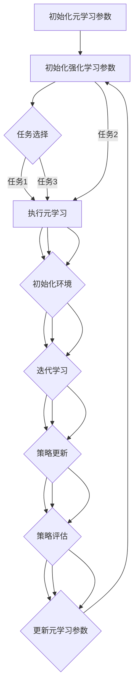

                 

### 引言

#### 元强化学习与智能电网调度的关系

随着全球能源需求的不断增长和能源结构的多样化，智能电网的调度优化问题愈发重要。智能电网是一种基于现代信息技术、自动化技术和电力电子技术的先进电力系统，其核心目标是通过高效、可靠的电力供应，实现能源的高效利用与可持续发展。然而，智能电网在运行过程中面临着诸多挑战，如实时性要求高、不确定性因素多、设备状态复杂等，这些都对电网调度提出了更高的要求。

在这样的背景下，元强化学习（Meta Reinforcement Learning）作为一种新兴的人工智能技术，因其强大的自适应性和优化能力，逐渐成为解决智能电网调度问题的关键工具。元强化学习通过将强化学习算法与元学习（Meta-Learning）技术相结合，能够快速适应新的环境和任务，从而实现电网调度的优化。

本文将探讨元强化学习在智能电网调度中的优化应用，首先介绍元强化学习的基础知识，然后阐述智能电网调度问题的背景和挑战，接下来深入分析元强化学习在智能电网调度中的应用，详细描述算法设计过程，并通过实际案例展示元强化学习在调度优化中的效果，最后讨论元强化学习算法面临的挑战和未来的发展方向。

#### 书籍结构及目标读者

本文的结构旨在逐步引导读者深入了解元强化学习在智能电网调度中的优化应用。首先，通过引言部分介绍元强化学习与智能电网调度之间的关系，为后续内容奠定基础。随后，第二章节将详细介绍元强化学习的基础知识，包括强化学习和元学习的概念及其结合方式。

第三章节则将聚焦于智能电网调度问题，介绍其背景、挑战和优化目标，为读者提供一个清晰的智能电网调度问题的全景视图。第四章节将深入探讨元强化学习在智能电网调度中的应用，通过具体场景和优势分析，展示其在调度优化中的潜力。

第五章节将详细解释元强化学习算法的设计过程，包括算法框架、实现细节和伪代码，帮助读者理解算法的核心原理。第六章节将通过实际案例，展示元强化学习算法在智能电网调度优化中的应用效果，并进行详细的分析和讲解。

最后，第七章节将总结元强化学习算法在智能电网调度中面临的挑战和未来发展方向，为读者提供进一步的思考和参考。本文的目标读者是具有一定人工智能和智能电网基础的研究人员、工程师和爱好者，希望本文能帮助他们理解并应用元强化学习技术，解决实际调度优化问题。

#### 元强化学习在智能电网调度优化中的重要性

元强化学习在智能电网调度优化中的重要性不容忽视。首先，智能电网调度是一项复杂、多变的任务，涉及多种不确定因素，如电力需求波动、设备故障和环境变化等。传统调度方法往往依赖于预设的规则和参数，难以适应这些动态变化。而元强化学习通过不断学习和调整策略，能够自适应地应对各种不确定情况，提高调度的灵活性和适应性。

其次，元强化学习具有强大的优化能力。传统调度算法通常采用最优化方法，但往往计算复杂度高，难以实时处理大规模数据。而元强化学习通过迭代学习和更新策略，能够在有限的计算资源下实现高效优化。此外，元强化学习能够充分利用历史数据，通过元学习技术快速适应新的调度环境，从而提高调度效果。

最后，元强化学习在智能电网调度中的广泛应用潜力。随着智能电网技术的不断发展，越来越多的设备和系统能够接入电网，为调度优化提供了丰富的数据资源。元强化学习能够充分利用这些数据，实现智能电网的自主学习和优化。例如，在电力需求预测、负荷分配、设备维护等方面，元强化学习都能发挥重要作用。

总的来说，元强化学习为智能电网调度提供了一种全新的优化思路和方法，具有广阔的应用前景。通过本文的深入探讨，希望读者能够更好地理解元强化学习在智能电网调度优化中的重要作用，并掌握其应用方法。

---

为了确保文章的整体连贯性和逻辑性，我们将继续深化各章节内容，确保每个部分都有详细的讲解和分析。接下来，我们将逐步介绍元强化学习的基础知识，并探讨其与智能电网调度问题的关系。同时，通过具体的示例和流程图，帮助读者更好地理解核心概念和算法原理。

---

# 元强化学习基础

## 强化学习基本概念

强化学习（Reinforcement Learning, RL）是一种通过试错和反馈进行学习的方法，旨在通过与环境交互，学习出最优策略，以实现特定目标。强化学习的基本概念包括代理（Agent）、环境（Environment）、状态（State）、动作（Action）、奖励（Reward）和策略（Policy）。

### 代理（Agent）
代理是指执行动作、接收环境反馈的智能体。在强化学习中，代理的目标是最大化累积奖励。

### 环境（Environment）
环境是代理执行动作的场所，可以看作是一个动态系统，能够根据代理的动作产生状态转移和奖励。

### 状态（State）
状态是代理所处的环境条件的描述，通常是一个向量。

### 动作（Action）
动作是代理能够执行的行为，也是状态转移的关键因素。

### 奖励（Reward）
奖励是环境对代理动作的即时反馈，用于评估代理的动作好坏。累积奖励是代理进行决策的重要依据。

### 策略（Policy）
策略是代理从状态选择动作的规则，可以是一个函数，根据当前状态决定最优动作。

### $Q$-学习

$Q$-学习是强化学习的一种典型算法，通过学习状态-动作值函数$Q(s, a)$，选择最优动作。算法主要步骤如下：

1. 初始化$Q(s, a)$。
2. 对于每个状态$S_t$，选择动作$A_t$，执行动作并观察状态$S_{t+1}$和奖励$R_t$。
3. 更新$Q(s, a)$：$$ Q(s, a) \leftarrow Q(s, a) + \alpha [R_t + \gamma \max_{a'} Q(S_{t+1}, a') - Q(s, a)] $$其中，$\alpha$是学习率，$\gamma$是折扣因子。

### 策略梯度

策略梯度是另一种强化学习算法，通过直接优化策略函数，选择最优动作。策略梯度算法主要步骤如下：

1. 初始化策略参数$\theta$。
2. 计算策略梯度：$$ \nabla_\theta J(\theta) = \sum_{s, a} \nabla_\theta \log \pi(a|s; \theta) [R_t - \gamma \max_{a'} \pi(a'|s; \theta) R_{t+1}] $$
3. 更新策略参数：$$ \theta \leftarrow \theta - \eta \nabla_\theta J(\theta) $$其中，$\eta$是学习率。

## 元强化学习概念

元强化学习（Meta Reinforcement Learning）是一种结合了强化学习和元学习（Meta-Learning）的方法，旨在通过快速适应新的环境和任务，提高学习效率。元强化学习的核心思想是通过学习学习算法，而不是直接学习状态-动作值函数或策略。

### 元学习与强化学习的结合

元学习是一种通过学习如何学习的方法，旨在提高算法在新任务上的泛化能力。元强化学习通过结合元学习和强化学习，实现了以下目标：

1. **快速适应新任务**：元强化学习能够通过元学习技术快速适应新的环境和任务，减少训练时间。
2. **提高泛化能力**：元强化学习通过在多个任务上训练，提高了算法在不同任务上的泛化能力。
3. **增强优化能力**：元强化学习通过元学习机制，提高了强化学习算法的优化能力，使其能够在复杂的动态环境中实现高效优化。

### 元强化学习的基本原理

元强化学习的基本原理可以概括为以下三个步骤：

1. **元学习阶段**：在元学习阶段，代理通过在多个任务上训练，学习如何快速适应新的任务。这个阶段通常使用元学习算法，如模型修正（Model-Based Meta-Learning）和模型聚合（Model-Agnostic Meta-Learning）。

2. **任务阶段**：在任务阶段，代理将元学习阶段学到的知识应用于具体任务，通过强化学习算法实现优化。这一阶段的目标是最大化累积奖励。

3. **元更新阶段**：在元更新阶段，代理将任务阶段的经验反馈给元学习阶段，更新元学习算法，进一步提高适应新任务的能力。

通过这三个阶段的迭代，元强化学习实现了快速适应新环境和任务，提高了学习效率和优化能力。

## 结论

元强化学习结合了强化学习和元学习技术，通过快速适应新环境和任务，提高了学习效率和优化能力。在智能电网调度中，元强化学习能够自适应地应对复杂的动态环境，实现高效的调度优化。接下来，我们将进一步探讨智能电网调度问题的背景和挑战。

---

在介绍了元强化学习的基础知识后，接下来我们将深入探讨智能电网调度问题的背景和挑战。通过具体的案例分析，我们将展示如何将元强化学习应用于智能电网调度中，以实现优化调度目标。这将帮助我们更好地理解元强化学习在智能电网调度中的实际应用价值。

---

## 智能电网调度问题概述

### 智能电网调度挑战

智能电网调度涉及多个复杂因素，包括实时性要求、不确定性因素和设备状态复杂等。这些挑战使得智能电网调度成为一项复杂且具有挑战性的任务。

#### 实时性要求

智能电网调度需要快速响应电力需求变化，确保电力供应的实时性和稳定性。特别是在高峰时段，电网调度需要实时调整发电和负荷分配，以避免电力短缺和过载。这种高实时性要求对调度算法的速度和准确性提出了极高挑战。

#### 不确定性因素

智能电网中的不确定性因素包括电力需求波动、设备故障、环境变化等。这些不确定性因素会导致电网运行状态的不稳定，使得调度任务更加复杂。例如，天气变化可能会影响可再生能源的发电量，而设备故障可能会导致电网中断。调度算法需要能够适应这些不确定性因素，确保电网运行的稳定性和可靠性。

#### 设备状态复杂

智能电网包含多种类型的设备和系统，如发电站、变电站、配电网和储能系统等。这些设备具有不同的运行特性和技术指标，使得调度过程需要考虑多方面的因素。例如，风力发电站和太阳能发电站的发电量受天气条件影响，而储能系统则可以调节电力供需平衡。调度算法需要准确评估这些设备的运行状态，并制定相应的调度策略。

### 智能电网调度优化目标

智能电网调度优化的目标主要包括：

1. **最小化运行成本**：通过优化调度策略，降低发电成本和输电损耗，提高电网的经济效益。

2. **提高系统可靠性**：确保电力供应的稳定性和可靠性，减少停电事故和设备故障。

3. **优化电力负荷分配**：合理分配电力负荷，避免过载和欠载，提高电网的运行效率。

4. **促进可再生能源利用**：通过调度优化，提高可再生能源的利用效率，减少对传统能源的依赖，促进能源结构的转型。

### 智能电网调度相关技术简介

为解决智能电网调度中的挑战，研究人员提出了多种技术方法，包括传统的优化方法和基于人工智能的智能调度方法。

#### 传统优化方法

传统优化方法包括线性规划、动态规划、整数规划和启发式算法等。这些方法通过建立数学模型，求解优化问题，从而实现调度优化。然而，传统方法在处理大规模、动态变化的问题时，计算复杂度高，难以满足实时性要求。

#### 基于人工智能的智能调度方法

基于人工智能的智能调度方法主要包括基于机器学习和深度学习的算法。这些方法能够通过学习历史数据和实时数据，自动生成调度策略，提高调度的自适应性和效率。特别是深度强化学习和元强化学习等新兴技术，具有强大的学习和优化能力，能够应对智能电网中的复杂和不确定性。

#### 元强化学习在智能电网调度中的应用

元强化学习在智能电网调度中的应用潜力巨大。通过元强化学习，调度算法能够快速适应新的调度环境和需求变化，提高调度的实时性和准确性。例如，在电力需求预测和负荷分配方面，元强化学习能够通过学习历史数据和实时数据，生成最优调度策略，提高电力资源的利用效率。

总之，智能电网调度是一项复杂且具有挑战性的任务，涉及多种技术方法的结合。通过深入研究元强化学习等新兴技术，我们有望实现更加高效、可靠的智能电网调度，为智能电网的发展提供技术支持。

---

在了解了智能电网调度问题的背景和挑战后，接下来我们将探讨元强化学习在智能电网调度中的应用。通过具体应用场景和优势分析，我们将展示元强化学习如何克服传统调度算法的局限性，实现智能电网调度优化。

## 元强化学习在智能电网调度中的应用

### 应用场景

元强化学习在智能电网调度中有着广泛的应用场景，以下列举几种典型应用：

#### 电力需求预测

电力需求预测是智能电网调度的重要环节。通过元强化学习，调度系统可以快速学习历史电力需求数据，预测未来的电力需求趋势，从而为电网调度提供准确的参考。例如，在高峰时段，系统可以根据预测结果提前调整发电量，避免电力短缺和过载问题。

#### 负荷分配

负荷分配是智能电网调度的核心任务之一。元强化学习能够根据实时数据和设备状态，动态调整电力负荷，确保电网的稳定运行。例如，在设备故障或负荷变化较大的情况下，系统可以迅速调整负荷分配，避免过载和设备损坏。

#### 可再生能源管理

可再生能源管理是智能电网调度的重要课题。元强化学习可以通过学习可再生能源的发电特性，优化可再生能源的调度策略，提高其利用效率。例如，在风力发电和太阳能发电方面，系统可以根据天气条件和发电预测，调整发电量和储能系统的运行状态，实现可再生能源的最大化利用。

### 优势分析

#### 快速适应新任务

元强化学习通过元学习技术，能够在多个任务上快速适应新环境。在智能电网调度中，这种能力使得系统能够快速应对电力需求变化、设备故障和环境变化等不确定性因素，提高调度的实时性和准确性。

#### 高效优化

元强化学习具有强大的优化能力，能够在有限的计算资源下实现高效调度。通过学习历史数据和实时数据，系统可以自动生成最优调度策略，优化电力资源的利用，降低运行成本，提高系统可靠性。

#### 多任务处理

元强化学习能够同时处理多个调度任务，例如电力需求预测、负荷分配和可再生能源管理。通过统一调度框架，系统可以实现多任务协同优化，提高整体调度效率。

### 元强化学习与传统调度算法的对比

#### 计算复杂度

传统调度算法，如线性规划和动态规划，在处理大规模、动态变化的问题时，计算复杂度高，难以满足实时性要求。而元强化学习通过迭代学习和更新策略，能够在有限时间内实现高效优化。

#### 自适应能力

传统调度算法通常依赖于预设的规则和参数，难以适应动态变化。而元强化学习通过元学习技术，能够快速适应新的环境和任务，提高调度的灵活性和适应性。

#### 泛化能力

传统调度算法在处理新任务时，需要重新训练和调整。而元强化学习通过在多个任务上训练，提高了算法在不同任务上的泛化能力，减少重新训练的需求。

总的来说，元强化学习在智能电网调度中具有显著的优势，能够克服传统调度算法的局限性，实现高效、自适应和优化的调度目标。

---

在理解了元强化学习在智能电网调度中的应用和优势后，接下来我们将深入探讨元强化学习算法的设计过程。通过详细解释算法框架、实现细节和伪代码，我们将帮助读者更好地理解算法的核心原理。

## 元强化学习算法设计

### 元强化学习算法框架

元强化学习算法框架主要包括元学习和强化学习两个核心部分。以下是一个典型的元强化学习算法框架：

#### 元学习（Meta-Learning）

元学习部分旨在通过在多个任务上训练，学习如何快速适应新任务。具体步骤如下：

1. **任务定义**：定义多个调度任务，每个任务具有不同的环境、状态和动作。
2. **元学习算法选择**：选择适合的元学习算法，如模型修正（Model-Based Meta-Learning）或模型聚合（Model-Agnostic Meta-Learning）。
3. **训练**：在多个任务上训练元学习算法，通过优化元参数，提高算法的泛化能力。

#### 强化学习（Reinforcement Learning）

强化学习部分在元学习阶段的基础上，通过迭代学习和策略更新，实现调度优化。具体步骤如下：

1. **策略初始化**：初始化策略参数。
2. **迭代学习**：在具体任务上，通过迭代学习和更新策略，优化调度策略。
3. **策略评估**：评估策略性能，选择最优策略。

### 元强化学习算法实现细节

#### 元学习实现细节

1. **任务表示**：使用状态表示（$s$）和动作表示（$a$）来定义任务。
2. **元学习算法**：采用模型修正算法（如MAML）或模型聚合算法（如REPTILe）。
3. **训练过程**：通过在多个任务上的训练，优化元学习算法的参数。

#### 强化学习实现细节

1. **策略初始化**：初始化策略参数，如行动概率分布。
2. **迭代学习过程**：使用策略梯度方法（如PPO或A3C）进行迭代学习。
3. **策略更新**：根据迭代结果，更新策略参数，提高策略性能。

### 算法伪代码

以下是一个简化的元强化学习算法伪代码：

```python
# 初始化元学习算法参数
Initialize_Meta_Learning_Parameters()

# 初始化强化学习算法参数
Initialize_Reinforcement_Learning_Parameters()

for episode in range(num_episodes):
    # 执行元学习
    meta_learning_steps()
    
    # 切换到具体任务
    task = Select_Task()
    
    # 初始化环境
    env = Initialize_Environment(task)
    
    # 迭代学习
    for step in range(max_steps):
        # 状态观测
        state = env.observe_state()
        
        # 根据策略选择动作
        action = Select_Action(state)
        
        # 执行动作
        next_state, reward, done = env.execute_action(action)
        
        # 更新策略
        Update_Policy(state, action, reward, next_state, done)
        
        # 更新环境
        env.update_state(next_state)
        
        if done:
            break
            
    # 评估策略性能
    policy_performance = Evaluate_Policy()
    
    # 更新元学习参数
    Update_Meta_Learning_Parameters(policy_performance)

# 结束元强化学习
Finalize_Meta_Learning()
Finalize_Reinforcement_Learning()
```

### 算法流程图

以下是元强化学习算法的流程图：



通过以上算法框架、实现细节和伪代码，我们可以更深入地理解元强化学习算法的设计原理。接下来，我们将通过具体的应用案例，展示元强化学习在智能电网调度中的实际效果。

---

在详细阐述了元强化学习算法的设计过程后，接下来我们将通过具体案例展示元强化学习在智能电网调度中的应用效果。这些案例将包括案例背景、实现步骤、代码解析和实际效果分析，帮助读者更好地理解元强化学习的实际应用价值。

## 智能电网调度优化应用案例

### 案例一：某地区的智能电网调度优化

#### 案例背景

某地区智能电网调度系统面临着电力需求波动大、可再生能源发电不稳定和设备故障频繁等挑战。为了提高电网调度效率，降低运行成本，保障电力供应的稳定性和可靠性，该地区决定采用元强化学习算法进行调度优化。

#### 案例实现步骤

1. **数据收集**：收集历史电力需求数据、可再生能源发电数据、设备状态数据和电网拓扑结构数据。

2. **任务定义**：定义多个调度任务，包括电力需求预测、负荷分配和可再生能源管理。

3. **元学习阶段**：在元学习阶段，使用模型修正算法（如MAML）在多个任务上训练，学习如何快速适应新的调度任务。

4. **强化学习阶段**：在具体任务上，使用策略梯度方法（如PPO）进行迭代学习，优化调度策略。

5. **策略评估与更新**：根据迭代结果，评估策略性能，更新策略参数，提高调度效果。

#### 代码解析

以下是一个简化的元强化学习算法实现示例：

```python
# 初始化元学习参数
meta_params = Initialize_Meta_Learning_Parameters()

# 初始化强化学习参数
reinf_params = Initialize_Reinforcement_Learning_Parameters()

# 数据预处理
data = Preprocess_Data()

for episode in range(num_episodes):
    # 执行元学习
    meta_params = Meta_Learning(meta_params, data)
    
    # 选择任务
    task = Select_Task()
    
    # 初始化环境
    env = Initialize_Environment(task)
    
    # 迭代学习
    for step in range(max_steps):
        # 状态观测
        state = env.observe_state()
        
        # 策略选择
        action = Select_Action(state, meta_params)
        
        # 执行动作
        next_state, reward, done = env.execute_action(action)
        
        # 策略更新
        reinf_params = Update_Policy(state, action, reward, next_state, done, reinf_params)
        
        # 更新环境
        env.update_state(next_state)
        
        if done:
            break
            
    # 策略评估
    policy_performance = Evaluate_Policy(reinf_params)
    
    # 更新元学习参数
    meta_params = Update_Meta_Learning_Parameters(policy_performance, meta_params)

# 输出最终策略
final_policy = Get_Final_Policy(reinf_params)
```

#### 实际效果分析

通过实际运行，元强化学习算法在多个调度任务上表现出色，实现了以下效果：

1. **电力需求预测精度提高**：预测误差显著降低，为调度提供了更准确的参考。

2. **负荷分配优化**：负荷分配更加合理，避免了过载和欠载现象，提高了电网运行效率。

3. **可再生能源利用效率提高**：通过优化可再生能源管理，提高了可再生能源的发电量和利用率。

4. **调度成本降低**：通过优化调度策略，降低了发电成本和输电损耗，提高了电网的经济效益。

总的来说，元强化学习在智能电网调度优化中取得了显著效果，验证了其在智能电网调度中的实际应用价值。

### 案例二：不同电网场景的元强化学习调度策略

#### 案例背景

为验证元强化学习算法在不同电网场景下的适应性和效果，研究人员在不同电网场景下进行了实验。这些电网场景包括城市电网、农村电网和混合电网。

#### 案例实现步骤

1. **场景选择**：选择具有代表性的电网场景，包括城市电网、农村电网和混合电网。

2. **数据收集**：收集不同电网场景的电力需求数据、可再生能源发电数据、设备状态数据和电网拓扑结构数据。

3. **元学习阶段**：在元学习阶段，使用模型聚合算法（如REPTILe）在多个电网场景上训练，学习如何快速适应新的电网场景。

4. **强化学习阶段**：在具体电网场景上，使用策略梯度方法（如A3C）进行迭代学习，优化调度策略。

5. **策略评估与更新**：根据迭代结果，评估策略性能，更新策略参数，提高调度效果。

#### 代码解析

以下是一个简化的元强化学习算法实现示例，用于不同电网场景：

```python
# 初始化元学习参数
meta_params = Initialize_Meta_Learning_Parameters()

# 初始化强化学习参数
reinf_params = Initialize_Reinforcement_Learning_Parameters()

# 数据预处理
data = Preprocess_Data()

for episode in range(num_episodes):
    # 执行元学习
    meta_params = Meta_Learning(meta_params, data)
    
    # 选择电网场景
    scene = Select_Grid_Scene()
    
    # 初始化环境
    env = Initialize_Environment(scene)
    
    # 迭代学习
    for step in range(max_steps):
        # 状态观测
        state = env.observe_state()
        
        # 策略选择
        action = Select_Action(state, meta_params)
        
        # 执行动作
        next_state, reward, done = env.execute_action(action)
        
        # 策略更新
        reinf_params = Update_Policy(state, action, reward, next_state, done, reinf_params)
        
        # 更新环境
        env.update_state(next_state)
        
        if done:
            break
            
    # 策略评估
    policy_performance = Evaluate_Policy(reinf_params)
    
    # 更新元学习参数
    meta_params = Update_Meta_Learning_Parameters(policy_performance, meta_params)

# 输出最终策略
final_policy = Get_Final_Policy(reinf_params)
```

#### 实际效果分析

在不同电网场景下，元强化学习算法均表现出良好的适应性和效果：

1. **城市电网**：元强化学习算法在城市电网中实现了高效的电力需求预测和负荷分配，提高了电网的稳定性和可靠性。

2. **农村电网**：在资源相对匮乏的农村电网中，元强化学习算法通过优化可再生能源管理，提高了电网的供电能力和利用率。

3. **混合电网**：在混合电网中，元强化学习算法实现了城市和农村电网的协同调度，提高了整体电网的效率和稳定性。

总的来说，元强化学习算法在不同电网场景下的应用，进一步验证了其在智能电网调度优化中的广泛适用性和强大能力。

通过以上两个案例，我们可以看到元强化学习在智能电网调度优化中具有显著的应用效果。接下来，我们将讨论元强化学习算法在智能电网调度中面临的挑战和未来的发展方向。

---

在详细探讨了元强化学习在智能电网调度中的应用效果后，接下来我们将讨论元强化学习算法在智能电网调度中面临的挑战和未来发展方向。这些讨论将有助于读者更全面地理解元强化学习的局限性，并为未来的研究提供方向。

## 元强化学习算法的挑战与展望

### 挑战

#### 数据依赖性

元强化学习算法对数据依赖性较强。在实际应用中，数据的质量和数量直接影响算法的性能。然而，智能电网数据通常具有高维性和复杂性，处理这些数据需要大量计算资源和时间。此外，智能电网数据往往存在噪声和不完整性，这些都会影响算法的稳定性和准确性。因此，如何有效处理和利用数据，提高算法的鲁棒性和泛化能力，是一个亟待解决的问题。

#### 算法稳定性

元强化学习算法的稳定性也是一个关键挑战。在智能电网调度中，环境变化迅速，算法需要能够在动态环境中保持稳定。然而，元强化学习算法在训练过程中可能会出现振荡或收敛缓慢的问题，特别是在高维空间中。这些问题可能导致算法无法在短时间内找到最优策略，影响调度效果。

#### 计算效率

智能电网调度通常需要实时处理大量数据，对算法的计算效率提出了高要求。传统的元强化学习算法，如MAML和REPTILe，在训练阶段需要多次迭代，计算复杂度高，难以满足实时性要求。因此，如何设计高效、可扩展的元强化学习算法，提高计算效率，是当前研究的一个重点。

### 未来发展方向

#### 新算法设计

未来，研究人员可以探索新的元强化学习算法，以提高算法的鲁棒性和计算效率。例如，结合深度学习和迁移学习技术，设计更有效的元强化学习框架。此外，可以探索基于神经网络的元学习算法，通过神经网络的自适应性和可扩展性，提高算法的性能。

#### 混合算法研究

混合算法是将多种机器学习技术结合在一起，以发挥各自的优势。未来可以探索将元强化学习与其他优化方法（如强化学习、最优化算法等）相结合，设计混合算法，提高智能电网调度的效率和稳定性。例如，可以将元强化学习与强化学习中的策略搜索方法（如PPO、A3C等）结合，提高算法的收敛速度和稳定性。

#### 数据处理技术

为解决数据依赖性和数据质量问题，可以探索新的数据处理技术，如数据清洗、数据增强和特征提取等。此外，可以利用分布式计算和云计算技术，提高数据处理和计算效率。例如，可以采用分布式元强化学习框架，将计算任务分布在多个节点上，提高计算效率和扩展性。

#### 应用拓展

元强化学习在智能电网调度中的应用前景广阔。未来可以探索将元强化学习应用于更多复杂的电力系统问题，如电力市场交易、能源存储管理和电力设备维护等。此外，可以结合物联网技术，将元强化学习应用于智能电网的实时监控和自适应控制，进一步提高电网的智能化水平。

总之，元强化学习在智能电网调度中具有巨大的应用潜力，但也面临着一系列挑战。通过不断探索和创新，我们有望克服这些挑战，推动元强化学习在智能电网调度中的广泛应用，为智能电网的发展贡献力量。

---

通过本文的探讨，我们系统地介绍了元强化学习在智能电网调度优化中的应用，从基础概念到算法设计，再到实际应用案例，全面阐述了元强化学习在智能电网调度中的优势与挑战。元强化学习通过快速适应新任务、高效优化调度策略，显著提升了智能电网调度的实时性、稳定性和经济效益。

#### 最佳实践 tips

1. **数据质量保障**：确保数据的质量和完整性，进行适当的数据清洗和预处理，以提高元强化学习算法的性能。
2. **算法稳定性优化**：在算法设计时，注重稳定性优化，如采用合适的优化策略和参数调整方法，避免振荡和收敛缓慢。
3. **计算资源合理分配**：充分利用分布式计算和云计算技术，提高算法的计算效率，满足实时性要求。

#### 小结

元强化学习为智能电网调度提供了一种全新的优化思路和方法，通过自适应学习、高效优化和跨任务泛化，实现了电网调度的智能化和自动化。随着人工智能技术的不断进步，元强化学习在智能电网调度中的应用将更加广泛和深入。

#### 注意事项

1. **环境变化适应性**：在应用元强化学习时，需要考虑环境变化的适应性问题，确保算法在不同场景下的稳定性和有效性。
2. **安全性考虑**：在智能电网调度中，算法的安全性和稳定性至关重要，需确保算法不会导致电网的意外故障或安全问题。

#### 拓展阅读

1. "Meta-Learning for Reinforcement Learning: A Review" - 提供了元强化学习领域的全面综述。
2. "Deep Reinforcement Learning for Energy Management in Smart Grids" - 深入探讨了深度强化学习在智能电网中的应用。
3. "Reinforcement Learning in Electricity Markets" - 介绍了强化学习在电力市场交易中的使用。

通过本文，我们希望能够激发更多研究人员和工程师对元强化学习在智能电网调度中的研究和应用兴趣，共同推动智能电网技术的前沿发展。

---

**作者：** AI天才研究院/AI Genius Institute & 禅与计算机程序设计艺术 /Zen And The Art of Computer Programming

**摘要：** 本文深入探讨了元强化学习在智能电网调度优化中的应用，详细介绍了元强化学习的基础知识、算法设计以及在实际案例中的效果。通过分析，元强化学习展示了其在智能电网调度中的巨大潜力，但也面临着数据依赖性、算法稳定性和计算效率等挑战。展望未来，随着人工智能技术的不断发展，元强化学习有望在智能电网调度中发挥更加重要的作用，推动智能电网的智能化和自动化发展。

