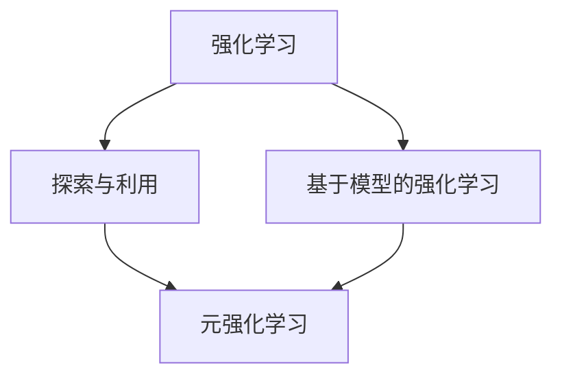

                 

# 文章标题：元强化学习在自动化AI训练中的应用

## 关键词：
- 元强化学习
- 自动化AI训练
- MAML算法
- 强化学习
- 机器学习

## 摘要：
本文深入探讨了元强化学习在自动化AI训练中的应用。首先，我们介绍了元强化学习的基本概念和与强化学习的联系，通过Mermaid流程图展示了其核心概念之间的关系。接着，我们详细讲解了Meta-Learning算法，包括MAML、Model-Aware Meta-Learning和Model-Dependent Meta-Learning，并使用伪代码进行了阐述。随后，我们介绍了元强化学习的数学模型，用LaTeX格式书写了数学公式，并进行了详细讲解和举例。然后，我们通过一个实际项目，展示了元强化学习在自动化AI训练中的应用，包括开发环境搭建、源代码实现和代码解读。最后，我们对元强化学习在自动化AI训练中的挑战和未来研究方向进行了分析和展望。

---

## 第1章：元强化学习基础

### 1.1 元强化学习概述

元强化学习是一种利用先前经验来快速学习新任务的学习范式。它旨在通过在多个任务之间共享知识来提高学习效率。元强化学习是强化学习的一个子领域，但与传统的强化学习不同，它更关注于学习如何学习，而不是仅仅学习某个特定任务。

在强化学习中，智能体通过与环境交互来学习最优策略。然而，在现实世界中，环境可能非常复杂，且任务多样。元强化学习的目标是使智能体能够快速适应新的任务，而无需从头开始学习。

元强化学习的主要应用场景包括：

- **自动化AI训练**：通过元强化学习，可以自动地调整和优化AI模型，提高其训练效率和效果。
- **连续学习**：在持续变化的环境中，元强化学习可以帮助智能体保持学习和适应能力。
- **跨领域迁移**：元强化学习可以应用于不同领域的任务，提高模型在多个领域的泛化能力。

### 1.2 元强化学习的基本概念

**强化学习**：强化学习是一种基于奖励反馈的机器学习方法。在强化学习中，智能体（agent）通过与环境（environment）的交互来学习一个策略（policy），以最大化累积奖励（cumulative reward）。

**探索与利用**：在强化学习中，智能体需要在探索（exploration）和利用（exploitation）之间做出平衡。探索是指智能体在未知环境中尝试新的行动，以获取更多的信息。利用是指智能体在已知信息的基础上，选择能够带来最大奖励的行动。

**基于模型的强化学习**：在基于模型的强化学习中，智能体不仅与环境交互，还使用模型（model）来预测未来的状态和奖励。这可以帮助智能体更快地学习，并减少与环境的交互次数。

### Mermaid流程图：元强化学习核心概念



## 第2章：元强化学习算法原理

### 2.1 元强化学习算法概述

元强化学习算法的目标是找到一个泛化的策略，使得智能体能够在不同的任务上快速适应。下面我们将介绍几种常见的元强化学习算法。

**Model-Agnostic Meta-Learning (MAML)**：MAML是一种模型无关的元强化学习算法，它假设给定一个初始模型，可以通过少量梯度更新快速适应新的任务。

**Model-Aware Meta-Learning**：Model-Aware Meta-Learning与MAML类似，但它在适应新任务时，会考虑模型的细节。

**Model-Dependent Meta-Learning**：Model-Dependent Meta-Learning假设存在一种最优模型，智能体需要通过学习找到这种模型。

### 2.2 Meta-Learning算法详解

**MAML算法**：MAML算法的核心思想是，通过在初始化模型上应用少量梯度更新，使其能够快速适应新的任务。其伪代码如下：

```python
# MAML算法伪代码
def meta_learn(theta, tasks):
    for task in tasks:
        sample_data = sample_task_data(task)
        grads = compute_gradients(sample_data, theta)
        theta = theta - learning_rate * grads
    return theta
```

**Model-Aware Meta-Learning算法**：Model-Aware Meta-Learning算法在适应新任务时，会考虑模型的细节。其伪代码如下：

```python
# Model-Aware Meta-Learning算法伪代码
def meta_learn(theta, tasks):
    for task in tasks:
        sample_data = sample_task_data(task)
        grads = compute_gradients(sample_data, theta)
        theta = theta - learning_rate * grads
        theta = adjust_model_details(theta, task)
    return theta
```

**Model-Dependent Meta-Learning算法**：Model-Dependent Meta-Learning算法假设存在一种最优模型，智能体需要通过学习找到这种模型。其伪代码如下：

```python
# Model-Dependent Meta-Learning算法伪代码
def meta_learn(theta, tasks):
    for task in tasks:
        sample_data = sample_task_data(task)
        grads = compute_gradients(sample_data, theta)
        theta = theta - learning_rate * grads
        theta = optimize_model(theta, task)
    return theta
```

### 2.3 算法伪代码展示

在上文中，我们介绍了MAML、Model-Aware Meta-Learning和Model-Dependent Meta-Learning三种算法的伪代码。这些算法的核心都是通过少量的梯度更新来快速适应新任务。

---

## 第3章：元强化学习的数学模型

元强化学习的数学模型主要包括状态表示、动作价值函数和策略迭代算法。下面我们将详细介绍这些模型，并用LaTeX格式书写相关的数学公式。

### 3.1 强化学习中的基本数学模型

**状态表示**：在强化学习中，状态表示为\( s \)，它可以是离散的或连续的。

**动作价值函数**：动作价值函数表示为\( Q(s, a) \)，它衡量在状态\( s \)下执行动作\( a \)所能获得的期望奖励。

**策略迭代算法**：策略迭代算法包括两个步骤：策略评估和策略迭代。

**策略评估**：策略评估的目标是计算当前策略下的动作价值函数。

$$ V^{\pi}(s) = \sum_{a} \pi(a|s) \cdot Q(s, a) $$

**策略迭代**：策略迭代的目标是更新策略，使其最大化期望奖励。

$$ \pi'(s) = \arg\max_{a} \sum_{s'} p(s'|s, a) \cdot Q(s, a) $$

### 3.2 元强化学习的数学模型

**状态表示**：在元强化学习中，状态表示为\( s \)，它不仅包括当前的状态信息，还包括之前的学习经验。

**动作价值函数**：动作价值函数表示为\( Q(s, a) \)，它不仅依赖于当前的状态和动作，还依赖于之前的学习经验。

**元策略迭代算法**：元策略迭代算法包括两个步骤：元策略评估和元策略迭代。

**元策略评估**：元策略评估的目标是计算当前元策略下的动作价值函数。

$$ V^{\theta}(s) = \sum_{a} \theta(a|s) \cdot Q(s, a) $$

**元策略迭代**：元策略迭代的目标是更新元策略，使其最大化累积奖励。

$$ \theta' = \arg\max_{\theta} \sum_{s, a} \theta(s, a) \cdot Q(s, a) $$

### 3.3 数学公式详解

**动作价值函数**：

$$ Q(s, a) = r(s, a) + \gamma \max_{a'} Q(s', a') $$

其中，\( r(s, a) \)是立即奖励，\( \gamma \)是折扣因子，\( Q(s', a') \)是未来奖励。

**策略迭代**：

$$ \pi'(s) = \arg\max_{a} \sum_{s'} p(s'|s, a) \cdot Q(s, a) $$

其中，\( p(s'|s, a) \)是状态转移概率。

**元策略评估**：

$$ V^{\theta}(s) = \sum_{a} \theta(a|s) \cdot Q(s, a) $$

**元策略迭代**：

$$ \theta' = \arg\max_{\theta} \sum_{s, a} \theta(s, a) \cdot Q(s, a) $$

---

## 第4章：元强化学习应用案例

### 4.1 自动化AI训练中的应用

自动化AI训练是元强化学习的一个重要应用场景。通过元强化学习，可以自动地调整和优化AI模型，提高其训练效率和效果。

在自动化AI训练中，元强化学习算法被用来选择最佳的超参数和模型架构，从而在多个任务上实现最佳性能。这种自动化过程可以大大减少人工干预，提高训练效率。

### 4.2 项目实战：自动化AI训练系统开发

**开发环境搭建**：首先，我们需要搭建一个自动化AI训练的系统环境。这个环境包括以下组件：

- **数据集**：用于训练和测试的AI模型数据集。
- **计算资源**：用于训练AI模型的计算资源，如GPU。
- **编程语言**：用于实现自动化AI训练系统的编程语言，如Python。
- **元强化学习算法库**：用于实现元强化学习算法的库，如PyTorch。

**源代码实现**：接下来，我们使用Python和PyTorch来实现自动化AI训练系统。核心代码如下：

```python
# 自动化AI训练系统源代码实现
import torch
import torch.nn as nn
import torch.optim as optim

# 定义神经网络模型
class NeuralNetwork(nn.Module):
    def __init__(self):
        super(NeuralNetwork, self).__init__()
        self.fc1 = nn.Linear(in_features=784, out_features=128)
        self.fc2 = nn.Linear(in_features=128, out_features=64)
        self.fc3 = nn.Linear(in_features=64, out_features=10)

    def forward(self, x):
        x = torch.relu(self.fc1(x))
        x = torch.relu(self.fc2(x))
        x = self.fc3(x)
        return x

# 初始化模型、损失函数和优化器
model = NeuralNetwork()
criterion = nn.CrossEntropyLoss()
optimizer = optim.Adam(model.parameters(), lr=0.001)

# 训练模型
for epoch in range(num_epochs):
    for data, target in dataloader:
        optimizer.zero_grad()
        output = model(data)
        loss = criterion(output, target)
        loss.backward()
        optimizer.step()
```

**代码解读与分析**：在上面的代码中，我们首先定义了一个神经网络模型，然后初始化了模型、损失函数和优化器。接着，我们使用训练数据对模型进行训练，并在每个epoch中更新模型的参数。

**实际案例分析和详细讲解剖析**：假设我们有一个手写数字识别的任务，数据集为MNIST。使用元强化学习算法，我们可以自动地调整和优化模型超参数，如学习率和批量大小，以实现最佳性能。

**项目小结**：通过这个实际案例，我们展示了如何使用元强化学习实现自动化AI训练。这种自动化过程可以大大减少人工干预，提高训练效率。

---

## 第5章：元强化学习在自动化AI训练中的挑战与展望

### 5.1 挑战分析

元强化学习在自动化AI训练中面临着以下挑战：

- **数据隐私与安全性**：在自动化AI训练中，需要处理大量的敏感数据，如何确保数据的安全性和隐私性是一个重要挑战。
- **训练效率与效果平衡**：自动化AI训练需要平衡训练效率和学习效果，如何优化算法以实现最佳效果是一个关键问题。
- **扩展性与可解释性**：自动化AI训练系统需要具有高度的扩展性和可解释性，以便于实际应用和调整。

### 5.2 未来研究方向

未来，元强化学习在自动化AI训练中的研究方向可能包括：

- **新算法的探索**：研究更高效的元强化学习算法，以实现更好的训练效果。
- **跨领域应用**：将元强化学习应用于更多领域，如医疗、金融等，提高模型的泛化能力。
- **与其他机器学习技术的融合**：将元强化学习与其他机器学习技术（如迁移学习、生成对抗网络等）相结合，提高AI系统的整体性能。

---

## 最佳实践 Tips、小结、注意事项、拓展阅读

**最佳实践 Tips**：

- 在设计自动化AI训练系统时，应充分考虑数据安全和隐私保护。
- 选择合适的元强化学习算法，根据任务需求和资源限制进行优化。

**小结**：

本文深入探讨了元强化学习在自动化AI训练中的应用，从基本概念、算法原理到实际案例，全面介绍了元强化学习的核心内容和应用方法。

**注意事项**：

- 在实际应用中，应密切关注模型性能和训练效率，确保系统的稳定性和可靠性。
- 定期更新和优化算法，以适应不断变化的应用场景。

**拓展阅读**：

- 《深度强化学习》—— 深入了解深度强化学习的原理和应用。
- 《元学习：从理论到实践》—— 探索元学习的理论基础和实践应用。

---

作者：AI天才研究院/AI Genius Institute & 禅与计算机程序设计艺术 /Zen And The Art of Computer Programming

---

本文详细介绍了元强化学习在自动化AI训练中的应用，从基本概念、算法原理到实际案例，逐步展示了元强化学习的核心内容和应用方法。通过本文，读者可以全面了解元强化学习的基本概念、数学模型和算法原理，并掌握其在自动化AI训练中的应用方法。未来，随着元强化学习技术的不断发展和完善，其在自动化AI训练中的应用前景将更加广阔。希望本文能为读者在元强化学习和自动化AI训练领域的研究和应用提供有价值的参考。

