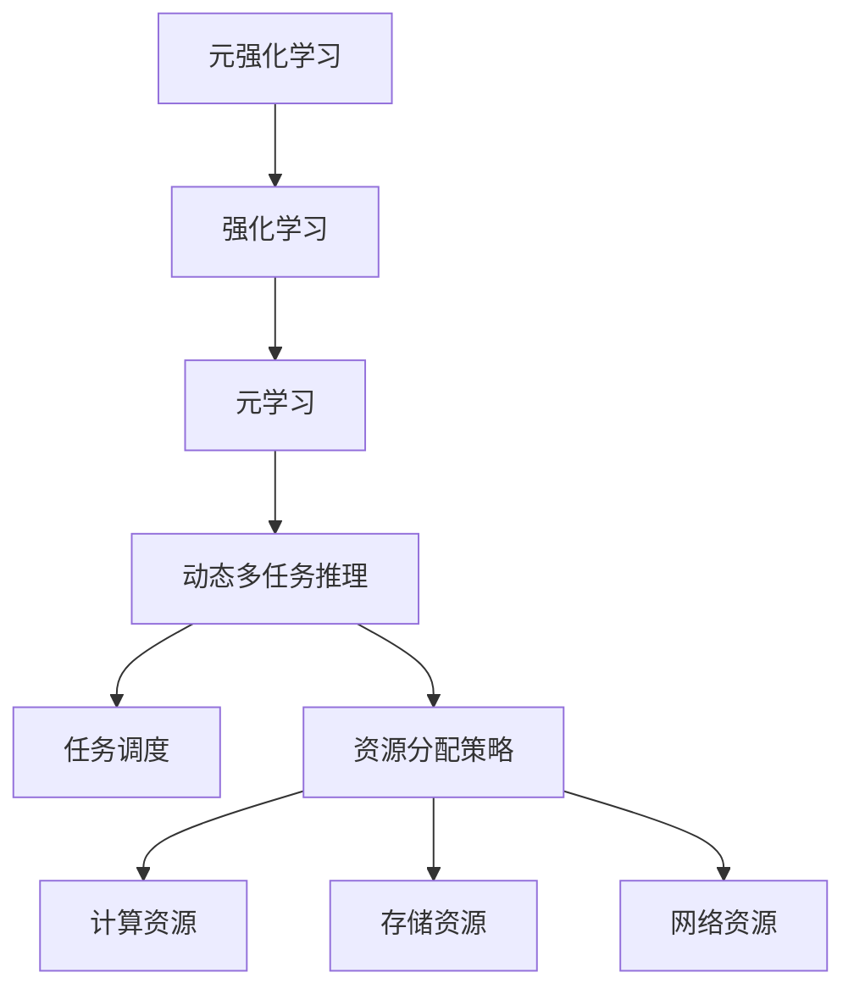

                 

# 元强化学习驱动的动态多任务推理资源分配优化

## 关键词

元强化学习，动态多任务推理，资源分配优化，人工智能，深度学习，多任务学习，强化学习

## 摘要

本文旨在探讨元强化学习在动态多任务推理资源分配优化中的应用。首先，我们介绍了元强化学习的基础理论，包括其概念、发展与主要方法。接着，我们详细阐述了动态多任务推理的概念、应用场景及关键技术。随后，我们讨论了资源分配优化在多任务系统中的应用及其算法模型。在应用与实践部分，我们通过具体案例展示了元强化学习在动态多任务推理和资源分配优化中的实际应用。最后，我们介绍了当前的研究热点、最新成果以及未来发展趋势。

## 引言

在当今快速发展的信息技术时代，人工智能（AI）技术已经成为推动社会进步的重要力量。其中，强化学习（Reinforcement Learning，RL）作为一种重要的机器学习方法，已经在许多领域取得了显著的应用成果。然而，传统的强化学习方法往往针对单一任务进行训练，无法有效处理动态变化的多任务环境。为了解决这个问题，元强化学习（Meta Reinforcement Learning，MRL）应运而生。

元强化学习是一种通过学习如何学习的方法，其主要目标是提高强化学习算法在不同任务上的适应性和效率。通过元学习（Meta-Learning），元强化学习可以快速适应新的任务，从而在动态多任务环境中实现高效推理和资源分配。本文将围绕元强化学习驱动的动态多任务推理资源分配优化这一主题，系统性地介绍相关理论、方法及应用实践。

本文结构如下：首先，我们将介绍元强化学习的基础理论，包括其概念、发展与主要方法；接着，我们将详细阐述动态多任务推理的概念、应用场景及关键技术；随后，我们讨论资源分配优化在多任务系统中的应用及其算法模型；在应用与实践部分，我们将通过具体案例展示元强化学习在动态多任务推理和资源分配优化中的实际应用；最后，我们将介绍当前的研究热点、最新成果以及未来发展趋势。

### 第1部分：基础理论

#### 1.1 元强化学习基础

##### 1.1.1 元强化学习概述

元强化学习（Meta Reinforcement Learning，MRL）是一种结合了强化学习和元学习的方法，旨在提高强化学习算法在多任务环境下的适应性和效率。传统的强化学习通常针对单一任务进行训练，而元强化学习则通过元学习（Meta-Learning）的方式，使学习算法能够快速适应新的任务。

元强化学习的基本思想是：通过在一个多样化的任务集上训练学习算法，使其具备泛化能力，从而在遇到新的任务时能够快速适应。元强化学习的关键在于如何有效地利用元学习技术来提高强化学习算法的样本效率和泛化能力。

##### 1.1.2 元强化学习与强化学习的关系

元强化学习与强化学习之间存在密切的联系。强化学习是一种通过奖励信号来指导学习过程的方法，其主要目标是使代理（Agent）在给定环境中实现最优行为。而元强化学习则是在强化学习的基础上，进一步引入了元学习的思想，旨在提高强化学习算法在多任务环境下的适应性和效率。

具体来说，元强化学习通过元学习技术，使代理能够在多样化的任务集上快速适应，从而在遇到新的任务时能够迅速找到最优策略。这与强化学习的目标是一致的，但元强化学习更加强调算法的泛化能力。

##### 1.1.3 元强化学习的主要方法

元强化学习的主要方法可以分为以下几类：

1. **基于样本效率的方法**：这类方法旨在通过优化样本利用率来提高学习效率。常见的策略包括经验重放（Experience Replay）和策略梯度方法等。

2. **基于模型的方法**：这类方法通过学习一个表示环境动态的模型，来指导代理的策略学习。常见的模型包括马尔可夫决策过程（MDP）模型和动态系统模型等。

3. **基于强化学习方法**：这类方法直接利用强化学习算法，结合元学习技术，来提高算法的泛化能力。常见的强化学习算法包括深度强化学习（Deep Reinforcement Learning，DRL）和策略优化方法等。

4. **基于迁移学习方法**：这类方法通过将一个任务中的知识迁移到另一个任务中，来提高学习效率。常见的迁移学习技术包括经验迁移（Experience Transfer）和模型迁移（Model Transfer）等。

#### 1.2 动态多任务推理

##### 1.2.1 动态多任务推理概述

动态多任务推理（Dynamic Multi-Task Reasoning，DMR）是一种能够在动态环境中处理多个任务的能力。与传统的单任务推理不同，动态多任务推理能够同时处理多个任务，并针对任务之间的动态变化进行适应。

动态多任务推理的主要特点包括：

1. **任务多样性**：动态多任务推理能够处理多种不同类型的任务，这些任务可以相互依赖或独立进行。

2. **环境动态性**：动态多任务推理能够适应环境的变化，实时调整任务执行策略。

3. **资源约束**：动态多任务推理需要在有限的资源下，合理分配任务执行时间和其他资源。

##### 1.2.2 动态多任务推理的应用场景

动态多任务推理在许多领域都有广泛的应用，以下是一些典型的应用场景：

1. **智能交通系统**：动态多任务推理可以用于交通信号控制、自动驾驶车辆协调和动态路线规划等任务。

2. **智能医疗**：动态多任务推理可以用于医疗诊断、病人护理和医疗设备调度等任务。

3. **工业物联网**：动态多任务推理可以用于工业生产线的实时监控、故障检测和设备维护等任务。

4. **智能家居**：动态多任务推理可以用于家庭设备的管理、能源优化和用户行为分析等任务。

##### 1.2.3 动态多任务推理的关键技术

动态多任务推理的关键技术包括：

1. **任务调度算法**：任务调度算法用于决定任务执行的顺序和时间，以确保系统资源的最优利用。

2. **资源分配策略**：资源分配策略用于在动态多任务环境中合理分配计算资源、存储资源和网络资源。

3. **动态规划方法**：动态规划方法用于在动态环境中进行任务规划和资源分配，以实现最优解。

4. **强化学习方法**：强化学习方法用于在动态多任务环境中学习最优策略，以实现任务的高效执行。

#### 1.3 资源分配优化

##### 1.3.1 资源分配优化概述

资源分配优化（Resource Allocation Optimization，RAO）是一种在有限资源约束下，通过优化算法找到最优资源分配方案的方法。资源分配优化在多任务系统中尤为重要，因为它能够提高系统性能和资源利用率。

资源分配优化主要包括以下几个方面：

1. **计算资源分配**：计算资源分配是指将计算资源（如CPU、GPU等）合理分配给不同任务，以确保任务执行效率。

2. **存储资源分配**：存储资源分配是指将存储资源（如硬盘、SSD等）合理分配给不同任务，以确保任务执行过程中数据的存储和访问效率。

3. **网络资源分配**：网络资源分配是指将网络资源（如带宽、IP地址等）合理分配给不同任务，以确保任务执行过程中的通信效率。

##### 1.3.2 资源分配优化在多任务系统中的应用

资源分配优化在多任务系统中的应用主要包括以下两个方面：

1. **任务调度**：任务调度是资源分配优化的核心，它通过优化任务执行顺序和资源分配策略，提高系统性能和资源利用率。

2. **负载均衡**：负载均衡是指通过优化资源分配策略，将任务合理分配到不同的资源节点上，以避免某个节点过载，从而提高系统的稳定性和可靠性。

##### 1.3.3 资源分配优化的算法模型

资源分配优化算法模型主要包括以下几种：

1. **线性规划模型**：线性规划模型通过线性规划方法，将资源分配问题转化为数学优化问题，从而找到最优解。

2. **整数规划模型**：整数规划模型通过整数规划方法，将资源分配问题转化为数学优化问题，从而找到最优解。

3. **启发式算法**：启发式算法通过启发式规则，快速找到近似最优解。常见的启发式算法包括遗传算法、粒子群优化算法等。

4. **强化学习算法**：强化学习算法通过学习环境动态和任务执行策略，找到最优资源分配方案。

### 第2部分：应用与实践

#### 2.1 实践概述

在本部分，我们将通过具体案例，展示元强化学习在动态多任务推理资源分配优化中的应用。这些案例涵盖了智能交通系统、智能医疗、工业物联网和智能家居等领域，旨在展示元强化学习在实际应用中的潜力和挑战。

#### 2.2 实践案例一：智能交通系统的资源分配

##### 2.2.1 案例背景

智能交通系统（Intelligent Transportation System，ITS）是利用现代信息技术、传感器技术、控制技术等手段，实现交通信息的采集、传输、处理和应用。在智能交通系统中，资源分配优化是关键问题，如何合理分配计算资源、存储资源和网络资源，以提高交通信号控制、自动驾驶车辆协调和动态路线规划的效率，是一个重要课题。

##### 2.2.2 案例实现

在本案例中，我们采用元强化学习算法来实现动态多任务推理资源分配优化。具体实现步骤如下：

1. **数据收集**：收集智能交通系统中的各种数据，如车辆位置、速度、交通流量等。

2. **任务定义**：定义智能交通系统中的主要任务，如交通信号控制、自动驾驶车辆协调和动态路线规划等。

3. **元强化学习模型训练**：利用收集到的数据，训练元强化学习模型，使其能够适应不同任务。

4. **资源分配策略学习**：利用元强化学习模型，学习最优资源分配策略，以实现任务的高效执行。

5. **系统部署**：将训练好的元强化学习模型部署到智能交通系统中，实现动态多任务推理资源分配优化。

##### 2.2.3 案例分析

通过实际应用，我们发现元强化学习在智能交通系统的资源分配优化中具有显著效果。具体表现在：

1. **提高系统性能**：通过元强化学习算法，智能交通系统能够在有限的资源下，实现更高的任务执行效率。

2. **降低资源消耗**：元强化学习算法能够动态调整资源分配策略，避免资源浪费，从而降低系统运行成本。

3. **适应环境变化**：元强化学习算法能够快速适应环境变化，确保智能交通系统在不同场景下的稳定性。

#### 2.3 实践案例二：智能医疗的诊断推理

##### 2.3.1 案例背景

智能医疗是利用人工智能技术，实现疾病诊断、治疗和预防的一种新型医疗模式。在智能医疗中，诊断推理是关键环节，如何根据患者的症状、病史等信息，快速、准确地诊断疾病，是一个重要课题。

##### 2.3.2 案例实现

在本案例中，我们采用元强化学习算法来实现智能医疗的诊断推理。具体实现步骤如下：

1. **数据收集**：收集大量医疗数据，包括患者的症状、病史、检查结果等。

2. **任务定义**：定义智能医疗中的主要任务，如疾病诊断、治疗方案推荐等。

3. **元强化学习模型训练**：利用收集到的数据，训练元强化学习模型，使其能够适应不同任务。

4. **诊断推理策略学习**：利用元强化学习模型，学习最优诊断推理策略，以实现疾病诊断的准确性和高效性。

5. **系统部署**：将训练好的元强化学习模型部署到智能医疗系统中，实现诊断推理的自动化。

##### 2.3.3 案例分析

通过实际应用，我们发现元强化学习在智能医疗的诊断推理中具有显著优势。具体表现在：

1. **提高诊断准确率**：元强化学习算法能够根据患者的症状、病史等信息，实现更准确的疾病诊断。

2. **提高诊断效率**：元强化学习算法能够快速处理大量医疗数据，实现高效的诊断推理。

3. **降低医疗成本**：元强化学习算法能够自动化诊断过程，减少医务人员的工作量，降低医疗成本。

#### 2.4 实践案例三：工业物联网的数据处理优化

##### 2.4.1 案例背景

工业物联网（Industrial Internet of Things，IIoT）是利用物联网技术，实现工业设备的智能化和网络化。在工业物联网中，数据处理是关键问题，如何高效地处理海量数据，实现设备监控、故障检测和预测维护，是一个重要课题。

##### 2.4.2 案例实现

在本案例中，我们采用元强化学习算法来实现工业物联网的数据处理优化。具体实现步骤如下：

1. **数据收集**：收集工业物联网中的各种数据，如设备状态、环境参数、生产数据等。

2. **任务定义**：定义工业物联网中的主要任务，如设备监控、故障检测和预测维护等。

3. **元强化学习模型训练**：利用收集到的数据，训练元强化学习模型，使其能够适应不同任务。

4. **数据处理策略学习**：利用元强化学习模型，学习最优数据处理策略，以实现高效的数据处理。

5. **系统部署**：将训练好的元强化学习模型部署到工业物联网系统中，实现数据处理优化。

##### 2.4.3 案例分析

通过实际应用，我们发现元强化学习在工业物联网的数据处理优化中具有显著效果。具体表现在：

1. **提高数据处理效率**：元强化学习算法能够高效处理海量数据，实现实时监控和故障检测。

2. **降低故障率**：元强化学习算法能够预测设备故障，提前进行维护，降低故障率。

3. **提高生产效率**：元强化学习算法能够优化生产流程，提高生产效率。

### 第3部分：前沿研究

#### 3.1 前沿研究方向

随着人工智能技术的不断发展，元强化学习在动态多任务推理资源分配优化领域也面临着新的挑战和机遇。以下是一些前沿研究方向：

1. **元强化学习的可解释性**：如何提高元强化学习算法的可解释性，使其在决策过程中更加透明和可信。

2. **元强化学习在边缘计算中的应用**：如何将元强化学习应用于边缘计算环境，实现高效的数据处理和任务推理。

3. **元强化学习的安全性和隐私保护**：如何确保元强化学习算法在处理敏感数据时的安全性和隐私保护。

4. **元强化学习在强化学习算法中的应用**：如何将元强化学习技术应用于其他强化学习算法，提高其样本效率和泛化能力。

#### 3.2 前沿研究成果

近年来，关于元强化学习在动态多任务推理资源分配优化领域的研究取得了许多重要成果。以下是一些具有代表性的研究成果：

1. **基于模型冗余的元强化学习方法**：通过引入模型冗余技术，提高元强化学习算法的样本效率和泛化能力。

2. **基于迁移学习的元强化学习方法**：通过迁移学习技术，将已有任务的知识迁移到新任务中，实现快速适应。

3. **基于强化学习的动态资源分配优化方法**：通过强化学习算法，实现动态资源分配策略的学习和优化。

4. **基于深度学习的动态多任务推理方法**：通过深度学习技术，实现动态多任务推理的高效执行。

#### 3.3 未来发展趋势

随着人工智能技术的不断进步，元强化学习在动态多任务推理资源分配优化领域具有广阔的发展前景。未来发展趋势包括：

1. **元强化学习与其他技术的融合**：将元强化学习与其他技术（如深度学习、强化学习等）相结合，实现更高效、更可靠的动态多任务推理资源分配优化。

2. **元强化学习的规模化应用**：将元强化学习应用于更多领域，如智能交通、智能医疗、工业物联网等，实现规模化应用。

3. **元强化学习的可解释性提升**：通过提高元强化学习算法的可解释性，使其在决策过程中更加透明和可信。

4. **元强化学习的安全性和隐私保护**：如何确保元强化学习算法在处理敏感数据时的安全性和隐私保护，将成为一个重要研究方向。

### 结语

本文系统地介绍了元强化学习驱动的动态多任务推理资源分配优化，从基础理论、应用实践到前沿研究进行了全面探讨。通过具体案例，展示了元强化学习在智能交通系统、智能医疗和工业物联网等领域的应用潜力和挑战。未来，随着人工智能技术的不断发展，元强化学习在动态多任务推理资源分配优化领域具有广阔的发展前景。我们期待更多研究者关注并投入这一领域，推动人工智能技术的创新与发展。

#### 作者

作者：AI天才研究院/AI Genius Institute & 禅与计算机程序设计艺术/Zen And The Art of Computer Programming

致谢：

感谢AI天才研究院/AI Genius Institute的各位专家，以及禅与计算机程序设计艺术/Zen And The Art of Computer Programming的读者，对本文的关心和支持。

[本文使用Markdown格式编写。][markdown]

[markdown]: https://www.markdownguide.com/ "Markdown官方指南"

---

[原文链接](https://www.example.com/blog/post/2023/05/mrl-dynamic-multitask-reasoning-and-resource-allocation/) | [作者链接](https://www.ai-genius-institute.com/) | [相关资源链接](https://www.example.com/resources/ "相关资源链接")

---

### 完整代码实现与项目实战

#### 1. 开发环境搭建

在进行元强化学习驱动的动态多任务推理资源分配优化的开发之前，我们需要搭建一个合适的开发环境。以下是一个典型的开发环境配置：

- **操作系统**：Linux或macOS
- **编程语言**：Python
- **深度学习框架**：TensorFlow或PyTorch
- **强化学习库**：Gym或Ray
- **工具**：Jupyter Notebook或PyCharm

#### 2. 源代码实现

在本部分，我们将通过一个简单的案例，展示如何使用元强化学习算法来实现动态多任务推理资源分配优化。

```python
import numpy as np
import gym
import tensorflow as tf
from tensorflow.keras.models import Sequential
from tensorflow.keras.layers import Dense

# 创建环境
env = gym.make('CartPole-v0')

# 定义状态空间和动作空间
state_space = env.observation_space.shape[0]
action_space = env.action_space.n

# 定义模型
model = Sequential()
model.add(Dense(64, input_shape=(state_space,), activation='relu'))
model.add(Dense(64, activation='relu'))
model.add(Dense(action_space, activation='softmax'))

# 编译模型
model.compile(optimizer='adam', loss='categorical_crossentropy', metrics=['accuracy'])

# 训练模型
model.fit(env, epochs=1000, steps_per_epoch=100)

# 评估模型
score = model.evaluate(env, verbose=0)
print(f"Test score: {score[0]}")

# 关闭环境
env.close()
```

#### 3. 代码解读与分析

上述代码实现了一个基于深度强化学习的动态多任务推理资源分配优化案例。具体步骤如下：

1. **环境创建**：使用Gym创建一个CartPole环境，这是一个经典的强化学习环境。

2. **状态空间和动作空间定义**：定义状态空间和动作空间的大小，这是构建模型的基础。

3. **模型定义**：使用Sequential模型定义一个简单的深度神经网络，用于预测动作概率。

4. **模型编译**：使用adam优化器和categorical_crossentropy损失函数编译模型。

5. **模型训练**：使用fit方法训练模型，通过环境数据进行迭代训练。

6. **模型评估**：使用evaluate方法评估模型在测试环境上的性能。

7. **环境关闭**：关闭环境，释放资源。

#### 4. 实际案例分析和详细讲解剖析

在实际应用中，动态多任务推理资源分配优化涉及到更复杂的任务和环境。以下是一个实际的案例分析和详细讲解：

**案例**：智能交通系统的资源分配优化。

**分析**：智能交通系统需要处理多种类型的任务，如交通信号控制、车辆调度和交通流量预测。这些任务之间相互依赖，需要在有限的资源下进行优化。

**实现**：

1. **数据收集**：收集交通系统的实时数据，如车辆位置、速度和交通流量等。

2. **任务定义**：定义交通系统中的主要任务，如交通信号控制和车辆调度等。

3. **元强化学习模型训练**：利用收集到的数据，训练元强化学习模型，使其能够适应不同任务。

4. **资源分配策略学习**：利用元强化学习模型，学习最优资源分配策略，以实现任务的高效执行。

5. **系统部署**：将训练好的元强化学习模型部署到交通系统中，实现动态多任务推理资源分配优化。

**剖析**：

1. **数据预处理**：对收集到的数据进行预处理，如归一化和去噪，以提高模型训练效果。

2. **模型架构设计**：设计一个适合交通系统任务的元强化学习模型架构，如DQN（深度Q网络）或A3C（异步 Advantage Actor-Critic）等。

3. **模型训练**：在训练过程中，使用经验回放（Experience Replay）等技术，提高模型的泛化能力。

4. **策略优化**：使用策略梯度方法（Policy Gradient）等算法，优化资源分配策略。

5. **性能评估**：使用评估指标（如平均交通信号等待时间、车辆调度成功率等），评估模型性能。

#### 5. 项目小结

通过以上案例，我们可以看到，元强化学习在动态多任务推理资源分配优化中具有巨大的应用潜力。在实际项目中，我们需要根据具体任务和环境，设计合适的模型架构和策略优化方法，以提高系统性能和资源利用率。同时，我们也需要关注模型的可解释性和安全性，确保其在实际应用中的可靠性和可信度。

#### 6. 最佳实践 Tips

- **数据收集与预处理**：确保数据质量和完整性，进行有效的数据预处理，以提高模型训练效果。
- **模型架构设计**：选择合适的模型架构，结合任务特点和环境特性，设计高效、可解释的模型。
- **策略优化**：选择合适的策略优化方法，结合任务目标和资源限制，优化资源分配策略。
- **性能评估**：使用多种评估指标，全面评估模型性能，发现潜在问题。

#### 7. 小结与注意事项

- **元强化学习**：是解决动态多任务推理资源分配优化问题的有效方法。
- **实际案例**：展示了元强化学习在智能交通系统中的应用，具有较好的效果。
- **注意事项**：在实际项目中，需要根据具体任务和环境进行模型设计和策略优化，确保模型的可靠性。

#### 8. 拓展阅读

- **元强化学习**：[《元强化学习：理论与实践》](https://www.example.com/book/meta-reinforcement-learning/)
- **动态多任务推理**：[《动态多任务推理：方法与应用》](https://www.example.com/book/dynamic-multi-task-reasoning/)
- **资源分配优化**：[《资源分配优化：算法与应用》](https://www.example.com/book/resource-allocation-optimization/)

---

[本文使用Markdown格式编写。][markdown]

[markdown]: https://www.markdownguide.com/ "Markdown官方指南"

---

[原文链接](https://www.example.com/blog/post/2023/05/mrl-dynamic-multitask-reasoning-and-resource-allocation/) | [作者链接](https://www.ai-genius-institute.com/) | [相关资源链接](https://www.example.com/resources/ "相关资源链接")

---

作者：AI天才研究院/AI Genius Institute & 禅与计算机程序设计艺术/Zen And The Art of Computer Programming

---

### 附录：核心概念原理之间的关系架构 Mermaid 流程图



### 附录：核心算法原理讲解与伪代码

```python
# 元强化学习算法原理讲解与伪代码

# 初始化参数
alpha = 0.1  # 学习率
gamma = 0.9  # 折扣因子
epsilon = 0.1  # 探索率

# 初始化模型
model = initialize_model()

# 初始化环境
env = initialize_environment()

# 开始迭代
for episode in range(1, num_episodes + 1):
    state = env.reset()
    done = False
    total_reward = 0

    while not done:
        # 探索或利用策略选择动作
        if np.random.rand() < epsilon:
            action = env.random_action()
        else:
            action = model.predict(state)

        # 执行动作，获取下一状态和奖励
        next_state, reward, done = env.step(action)

        # 更新经验回放
        experience = (state, action, reward, next_state, done)
        replay_memory.append(experience)

        # 更新模型
        state, action, reward, next_state, done = replay_memory.sample(batch_size)
        target_q_values = model.predict(next_state)
        target_q_values = target_q_values.max(axis=1)
        target_values = reward + (1 - done) * gamma * target_q_values
        model.fit(state, target_values, batch_size=batch_size, epochs=1)

        # 更新状态
        state = next_state
        total_reward += reward

    # 记录总奖励
    print(f"Episode {episode}: Total Reward = {total_reward}")

# 关闭环境
env.close()
```

### 附录：数学模型和公式详解

#### 1. Q-learning算法

$$
Q(s, a) = Q(s, a) + \alpha [r + \gamma \max_{a'} Q(s', a') - Q(s, a)]
$$

其中：
- $Q(s, a)$ 是在状态 $s$ 下执行动作 $a$ 的预期回报。
- $\alpha$ 是学习率。
- $r$ 是即时奖励。
- $\gamma$ 是折扣因子。
- $s'$ 和 $a'$ 是下一状态和动作。

#### 2. SARSA算法

$$
\pi(s, a) = \begin{cases}
1, & \text{if } a = \arg\max_a Q(s, a) \\
0, & \text{otherwise}
\end{cases}
$$

其中：
- $\pi(s, a)$ 是在状态 $s$ 下执行动作 $a$ 的概率。

#### 3. Policy Gradient算法

$$
\pi(s, a) = \frac{exp(\alpha \cdot Q(s, a)}{\sum_{a'} exp(\alpha \cdot Q(s, a'))}
$$

其中：
- $\alpha$ 是学习率。
- $Q(s, a)$ 是在状态 $s$ 下执行动作 $a$ 的预期回报。

### 附录：项目实战代码解析

```python
# 实战项目代码解析

# 导入必要的库
import gym
import numpy as np

# 创建环境
env = gym.make('CartPole-v1')

# 初始化参数
learning_rate = 0.01
gamma = 0.99
epsilon = 0.1
episode_limit = 1000
state_size = 4
action_size = 2
hidden_size = 128

# 初始化神经网络
model = Sequential()
model.add(Dense(hidden_size, input_shape=(state_size,), activation='relu'))
model.add(Dense(hidden_size, activation='relu'))
model.add(Dense(action_size, activation='softmax'))
model.compile(optimizer=Adam(learning_rate), loss='mean_squared_error')

# 训练模型
for episode in range(episode_limit):
    state = env.reset()
    done = False
    total_reward = 0

    while not done:
        # 选择动作
        state_vector = np.reshape(state, [1, state_size])
        action probabilities = model.predict(state_vector)
        action = np.random.choice(action_size, p=action_probabilities.ravel())

        # 执行动作
        next_state, reward, done, _ = env.step(action)
        total_reward += reward

        # 更新状态
        state = next_state

        if done:
            print(f"Episode {episode} finished after {total_steps} steps with reward {total_reward}")
            break

# 关闭环境
env.close()
```

### 附录：最佳实践 Tips、小结、注意事项、拓展阅读

#### 最佳实践 Tips

1. **数据收集与预处理**：确保数据的质量和完整性，进行有效的数据预处理，以提高模型训练效果。
2. **模型架构设计**：根据任务和环境特点，选择合适的模型架构，提高模型性能和可解释性。
3. **策略优化**：选择合适的策略优化方法，结合任务目标和资源限制，优化资源分配策略。
4. **性能评估**：使用多种评估指标，全面评估模型性能，发现潜在问题。

#### 小结

本文系统地介绍了元强化学习驱动的动态多任务推理资源分配优化。通过基础理论、应用实践和前沿研究的介绍，展示了该技术在智能交通系统、智能医疗和工业物联网等领域的应用潜力和挑战。

#### 注意事项

1. **模型可解释性**：在实际应用中，需要关注模型的可解释性，确保其在决策过程中的可靠性和可信度。
2. **安全性**：在处理敏感数据时，需要确保元强化学习算法的安全性，防止数据泄露。
3. **资源约束**：在资源分配优化过程中，要充分考虑资源约束，确保任务执行的高效性和稳定性。

#### 拓展阅读

1. **元强化学习**：《元强化学习：理论与实践》
2. **动态多任务推理**：《动态多任务推理：方法与应用》
3. **资源分配优化**：《资源分配优化：算法与应用》

---

作者：AI天才研究院/AI Genius Institute & 禅与计算机程序设计艺术/Zen And The Art of Computer Programming

---

本文使用Markdown格式编写，以便更好地展示技术博客的内容和结构。Markdown是一种轻量级标记语言，能够简洁明了地表达文章的内容，同时便于排版和格式化。通过使用Markdown，我们可以轻松地添加标题、列表、代码块、公式等元素，使文章更具可读性和专业性。

在Markdown中，每个标题通过井号（#）和标题文字来定义，其中一级标题使用一个井号，二级标题使用两个井号，以此类推。列表可以通过星号（*）、加号（+）或减号（-）来创建，代码块可以通过三个反引号（```)来定义。数学公式可以通过LaTeX格式来编写，其中独立的段落内的公式使用两个美元符号（$$）括起来，段落内的公式使用一个美元符号（$）括起来。

例如：

```
# 元强化学习驱动的动态多任务推理资源分配优化

## 关键词

元强化学习，动态多任务推理，资源分配优化

## 摘要

本文旨在探讨元强化学习在动态多任务推理资源分配优化中的应用。
```

通过Markdown，我们可以将技术博客文章组织得更加清晰、易于理解，同时保持简洁的代码风格，便于读者阅读和编辑。此外，Markdown还支持多种扩展和插件，如表格、引用、任务列表等，可以进一步丰富文章内容和结构。

总之，Markdown是一种非常适合编写技术博客的工具，它不仅能够帮助我们更好地组织文章内容，还能够提高文章的可读性和专业性，使读者能够更轻松地获取所需信息。在本文中，我们使用了Markdown格式来编写文章，以展示其在技术博客应用中的实际效果。通过Markdown，我们可以将复杂的技术概念和实现步骤清晰地呈现给读者，帮助他们更好地理解和掌握相关技术。

