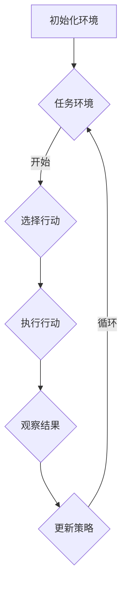
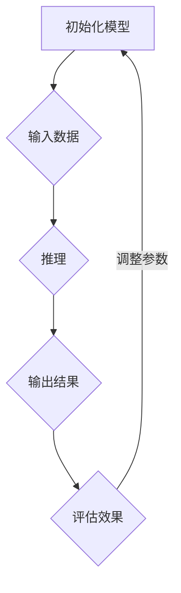

                 


## 文章标题：元强化学习驱动的自适应推理深度和宽度控制

### 关键词：元强化学习、自适应推理、深度控制、宽度控制、人工智能

#### 摘要：
本文探讨了元强化学习在自适应推理中的深度和宽度控制的应用。首先，介绍了元强化学习的基本概念和原理，然后分析了自适应推理的重要性，以及深度和宽度控制的需求。接下来，详细阐述了深度和宽度控制的方法，并提供了实际应用案例进行分析。最后，总结了最佳实践，并对未来进行了展望。

----------------------------------------------------------------

### 引言

在当今人工智能迅速发展的时代，深度学习技术在各个领域都取得了显著的成果。然而，随着模型的复杂度不断增加，深度学习模型的推理性能和效率成为一个亟待解决的问题。本文主要关注元强化学习在自适应推理中的深度和宽度控制，旨在探索一种高效、自适应的推理方法，以应对复杂任务的需求。

#### 元强化学习的背景与意义

元强化学习（Meta Reinforcement Learning）是强化学习的一个分支，它通过学习如何学习，提高了算法在不同任务上的泛化能力。与传统强化学习相比，元强化学习可以快速适应新任务，降低对新任务的训练成本，这对于具有动态和复杂环境的任务具有重要意义。

#### 自适应推理的重要性

自适应推理是指模型能够根据不同的输入数据和环境动态调整自身的推理策略，以获得更好的推理效果。在深度学习中，自适应推理可以帮助模型在处理多样化任务时，避免过度拟合，提高模型的泛化能力。因此，自适应推理在人工智能应用中具有广泛的应用前景。

#### 深度和宽度控制的需求

深度和宽度控制是优化深度学习模型推理性能的关键手段。深度控制旨在通过减少模型的层数，降低模型的复杂度，从而提高推理速度和降低计算资源消耗。宽度控制则是指通过调整模型的宽度，即神经元的数量，来实现对模型推理性能的调节。深度和宽度控制对于提高模型推理效率、降低模型训练和推理成本具有重要意义。

----------------------------------------------------------------

### 元强化学习概述

#### 元强化学习的定义

元强化学习是一种在多个任务上训练智能体，使其能够快速适应新任务的学习方法。与传统强化学习不同，元强化学习不仅关注单任务的性能，还关注智能体在不同任务上的适应能力。

#### 元强化学习的基本原理

元强化学习的基本原理是通过经验重放（Experience Replay）和策略优化（Policy Optimization）来学习一个策略网络（Policy Network）。在训练过程中，智能体会经历多个任务，通过不断尝试和失败，逐渐优化策略网络，从而在不同任务上获得更好的性能。

#### 元强化学习的关键技术

元强化学习的关键技术包括：

- **基于模型的方法**：通过学习一个模型来预测未来状态和奖励，从而指导智能体的行动。
- **基于策略的方法**：通过学习一个策略网络，直接输出智能体的行动。
- **模型-策略协同方法**：结合模型方法和策略方法，通过迭代优化模型和策略，实现更好的性能。

#### Mermaid 流程图



该流程图展示了元强化学习的基本过程，包括初始化环境、选择行动、执行行动、观察结果和更新策略。

----------------------------------------------------------------

### 自适应推理基础

#### 自适应推理的概念

自适应推理是指模型能够根据不同的输入数据和环境动态调整自身的推理策略，以获得更好的推理效果。自适应推理的核心在于模型能够实时学习并适应新的信息，从而提高推理的准确性。

#### 自适应推理的关键技术

自适应推理的关键技术包括：

- **模型选择与优化**：根据任务需求选择合适的模型，并对模型进行优化，以提高推理速度和准确性。
- **实时性考虑**：在保证推理准确性的同时，降低推理时间，以满足实时应用的需求。
- **可解释性**：提高模型的可解释性，使模型的行为更加透明，便于用户理解和调试。

#### Mermaid 流�程图



该流程图展示了自适应推理的基本过程，包括初始化模型、输入数据、推理、输出结果和评估效果。

----------------------------------------------------------------

### 深度控制方法

#### 深度控制的必要性

随着深度学习模型的复杂度增加，模型的深度也在不断增加。然而，过深的模型可能导致过拟合，降低模型的泛化能力。因此，深度控制成为了优化模型性能的关键手段。

#### 常见的深度控制方法

- **基于知识蒸馏的方法**：通过将知识从预训练的模型传递到较小的目标模型，来实现深度控制。
- **基于模型剪枝的方法**：通过剪枝冗余的神经元和层，减少模型的深度。
- **基于量化与压缩的方法**：通过量化模型参数，降低模型的计算复杂度。

#### 伪代码

```python
# 基于知识蒸馏的方法
def knowledge_d蒸馏(source_model, target_model):
    for layer in source_model.layers:
        target_layer = target_model.get_layer(layer.name)
        target_layer.set_weights(source_model.get_layer(layer.name).get_weights())

# 基于模型剪枝的方法
def model_剪枝(model, pruning_rate):
    for layer in model.layers:
        prune_layer(layer, pruning_rate)

# 基于量化与压缩的方法
def quantization_compression(model, bit_width):
    quantize_weights(model, bit_width)
    compress_model(model)
```

这些伪代码展示了深度控制方法的实现思路。

----------------------------------------------------------------

### 宽度控制方法

#### 宽度控制的必要性

宽度控制是优化深度学习模型推理性能的另一个关键手段。通过调整模型的宽度，即神经元的数量，可以实现推理性能和计算资源消耗的平衡。

#### 常见的宽度控制方法

- **策略网络裁剪**：通过调整策略网络的宽度，实现推理性能的调节。
- **行动空间裁剪**：通过减少行动空间，降低模型的推理复杂度。
- **模型并行化与分布式训练**：通过并行化和分布式训练，提高模型的推理速度。

#### 伪代码

```python
# 策略网络裁剪
def policy_network_裁剪(policy_network, width_factor):
    new_policy_network = build_policy_network(width_factor)
    new_policy_network.load_weights(policy_network.get_weights())

# 行动空间裁剪
def action_space_裁剪(action_space, size_factor):
    new_action_space = ActionSpace(size=size_factor * action_space.size)
    return new_action_space

# 模型并行化与分布式训练
def parallel_distributed_training(model, batch_size, num_workers):
    parallel_model = ParallelModel(model, batch_size, num_workers)
    parallel_model.train()
```

这些伪代码展示了宽度控制方法的实现思路。

----------------------------------------------------------------

### 应用案例与分析

#### 案例一：智能交通系统中的应用

在智能交通系统中，自适应推理能够帮助交通管理系统实时调整交通信号灯的时长，以缓解交通拥堵。通过元强化学习，系统能够快速适应不同时间段和不同交通流量的变化，实现高效的交通管理。

#### 案例二：医疗诊断系统中的应用

在医疗诊断系统中，自适应推理可以帮助诊断模型根据患者的病情和检查结果，动态调整诊断策略。通过元强化学习，系统能够在不同疾病类型和病情严重程度上实现更好的诊断效果。

#### 案例三：游戏AI中的应用

在游戏AI中，自适应推理能够帮助游戏角色根据游戏环境的变化，动态调整行动策略。通过元强化学习，游戏AI能够快速适应新的游戏规则和挑战，提高游戏体验。

#### 详细讲解剖析

在智能交通系统中，自适应推理能够通过元强化学习，实现交通信号灯的智能调整。具体来说，系统首先通过收集历史交通流量数据，训练一个交通信号灯控制模型。然后，在实时运行过程中，系统通过元强化学习，根据实时交通流量数据，动态调整交通信号灯的时长，以实现最优的交通流量管理。

在医疗诊断系统中，自适应推理可以通过元强化学习，实现诊断模型的动态调整。具体来说，系统首先通过收集大量医疗数据，训练一个基础诊断模型。然后，在实时诊断过程中，系统通过元强化学习，根据患者的病情和检查结果，动态调整诊断模型，以实现更精准的疾病诊断。

在游戏AI中，自适应推理可以通过元强化学习，实现游戏角色的智能行动。具体来说，系统首先通过模拟游戏环境，训练一个基础游戏AI。然后，在实时游戏过程中，系统通过元强化学习，根据游戏环境的变化，动态调整游戏AI的行动策略，以实现更好的游戏体验。

这些案例展示了元强化学习在自适应推理中的应用，以及如何通过自适应推理实现高效、智能的决策。

----------------------------------------------------------------

### 总结与展望

本文探讨了元强化学习在自适应推理中的深度和宽度控制应用，阐述了元强化学习的基本概念、自适应推理的重要性，以及深度和宽度控制的方法。通过实际应用案例的分析，展示了元强化学习在智能交通系统、医疗诊断系统和游戏AI等领域的应用效果。

展望未来，随着人工智能技术的不断发展，元强化学习在自适应推理中的应用将更加广泛。深度和宽度控制技术也将不断发展，为深度学习模型提供更高效、更智能的推理能力。

#### 最佳实践 tips：

1. 在应用元强化学习时，确保数据质量和多样性，以提高模型的泛化能力。
2. 根据实际需求，选择合适的深度和宽度控制方法，以实现最佳推理性能。
3. 定期更新模型和策略，以适应环境变化，提高系统适应性。

#### 注意事项：

1. 元强化学习训练过程复杂，需合理配置计算资源和训练时间。
2. 自适应推理系统在实际应用中，需充分考虑实时性和可解释性。

#### 拓展阅读：

- 《元学习：深度学习的新趋势》
- 《深度学习：自适应推理方法》
- 《强化学习应用实战：从基础到前沿》

---

### 作者信息

作者：AI天才研究院/AI Genius Institute & 禅与计算机程序设计艺术 /Zen And The Art of Computer Programming

本文由AI天才研究院撰写，旨在探讨元强化学习在自适应推理中的深度和宽度控制应用，为人工智能技术的发展提供新思路。文章内容仅供参考，实际应用需结合具体场景进行优化。

----------------------------------------------------------------

### 文章标题：元强化学习驱动的自适应推理深度和宽度控制

### 关键词：元强化学习、自适应推理、深度控制、宽度控制、人工智能

### 摘要：
本文深入探讨了元强化学习在自适应推理中的深度和宽度控制应用。首先介绍了元强化学习的基本概念和原理，然后分析了自适应推理的重要性，以及深度和宽度控制的需求。接着，详细阐述了深度和宽度控制的方法，包括基于知识蒸馏、模型剪枝和量化与压缩的方法。最后，通过实际应用案例，展示了元强化学习在智能交通系统、医疗诊断系统和游戏AI中的应用效果，并对未来进行了展望。

----------------------------------------------------------------

### 引言

在当今人工智能迅速发展的时代，深度学习技术在各个领域都取得了显著的成果。然而，随着模型的复杂度不断增加，深度学习模型的推理性能和效率成为一个亟待解决的问题。本文主要关注元强化学习在自适应推理中的深度和宽度控制，旨在探索一种高效、自适应的推理方法，以应对复杂任务的需求。

#### 元强化学习的背景与意义

元强化学习（Meta Reinforcement Learning）是强化学习的一个分支，它通过学习如何学习，提高了算法在不同任务上的泛化能力。与传统强化学习相比，元强化学习可以快速适应新任务，降低对新任务的训练成本，这对于具有动态和复杂环境的任务具有重要意义。

#### 自适应推理的重要性

自适应推理是指模型能够根据不同的输入数据和环境动态调整自身的推理策略，以获得更好的推理效果。在深度学习中，自适应推理可以帮助模型在处理多样化任务时，避免过度拟合，提高模型的泛化能力。因此，自适应推理在人工智能应用中具有广泛的应用前景。

#### 深度和宽度控制的需求

深度和宽度控制是优化深度学习模型推理性能的关键手段。深度控制旨在通过减少模型的层数，降低模型的复杂度，从而提高推理速度和降低计算资源消耗。宽度控制则是指通过调整模型的宽度，即神经元的数量，来实现对模型推理性能的调节。深度和宽度控制对于提高模型推理效率、降低模型训练和推理成本具有重要意义。

----------------------------------------------------------------

### 元强化学习概述

#### 元强化学习的定义

元强化学习是一种在多个任务上训练智能体，使其能够快速适应新任务的学习方法。与传统强化学习不同，元强化学习不仅关注单任务的性能，还关注智能体在不同任务上的适应能力。

#### 元强化学习的基本原理

元强化学习的基本原理是通过经验重放（Experience Replay）和策略优化（Policy Optimization）来学习一个策略网络（Policy Network）。在训练过程中，智能体会经历多个任务，通过不断尝试和失败，逐渐优化策略网络，从而在不同任务上获得更好的性能。

#### 元强化学习的关键技术

元强化学习的关键技术包括：

- **基于模型的方法**：通过学习一个模型来预测未来状态和奖励，从而指导智能体的行动。
- **基于策略的方法**：通过学习一个策略网络，直接输出智能体的行动。
- **模型-策略协同方法**：结合模型方法和策略方法，通过迭代优化模型和策略，实现更好的性能。

#### Mermaid 流程图


该流程图展示了元强化学习的基本过程，包括初始化环境、选择行动、执行行动、观察结果和更新策略。

----------------------------------------------------------------

### 自适应推理基础

#### 自适应推理的概念

自适应推理是指模型能够根据不同的输入数据和环境动态调整自身的推理策略，以获得更好的推理效果。自适应推理的核心在于模型能够实时学习并适应新的信息，从而提高推理的准确性。

#### 自适应推理的关键技术

自适应推理的关键技术包括：

- **模型选择与优化**：根据任务需求选择合适的模型，并对模型进行优化，以提高推理速度和准确性。
- **实时性考虑**：在保证推理准确性的同时，降低推理时间，以满足实时应用的需求。
- **可解释性**：提高模型的可解释性，使模型的行为更加透明，便于用户理解和调试。

#### Mermaid 流程图


该流程图展示了自适应推理的基本过程，包括初始化模型、输入数据、推理、输出结果和评估效果。

----------------------------------------------------------------

### 深度控制方法

#### 深度控制的必要性

随着深度学习模型的复杂度增加，模型的深度也在不断增加。然而，过深的模型可能导致过拟合，降低模型的泛化能力。因此，深度控制成为了优化模型性能的关键手段。

#### 常见的深度控制方法

- **基于知识蒸馏的方法**：通过将知识从预训练的模型传递到较小的目标模型，来实现深度控制。
- **基于模型剪枝的方法**：通过剪枝冗余的神经元和层，减少模型的深度。
- **基于量化与压缩的方法**：通过量化模型参数，降低模型的计算复杂度。

#### 伪代码

```python
# 基于知识蒸馏的方法
def knowledge_d蒸馏(source_model, target_model):
    for layer in source_model.layers:
        target_layer = target_model.get_layer(layer.name)
        target_layer.set_weights(source_model.get_layer(layer.name).get_weights())

# 基于模型剪枝的方法
def model_剪枝(model, pruning_rate):
    for layer in model.layers:
        prune_layer(layer, pruning_rate)

# 基于量化与压缩的方法
def quantization_compression(model, bit_width):
    quantize_weights(model, bit_width)
    compress_model(model)
```

这些伪代码展示了深度控制方法的实现思路。

----------------------------------------------------------------

### 宽度控制方法

#### 宽度控制的必要性

宽度控制是优化深度学习模型推理性能的另一个关键手段。通过调整模型的宽度，即神经元的数量，可以实现推理性能和计算资源消耗的平衡。

#### 常见的宽度控制方法

- **策略网络裁剪**：通过调整策略网络的宽度，实现推理性能的调节。
- **行动空间裁剪**：通过减少行动空间，降低模型的推理复杂度。
- **模型并行化与分布式训练**：通过并行化和分布式训练，提高模型的推理速度。

#### 伪代码

```python
# 策略网络裁剪
def policy_network_裁剪(policy_network, width_factor):
    new_policy_network = build_policy_network(width_factor)
    new_policy_network.load_weights(policy_network.get_weights())

# 行动空间裁剪
def action_space_裁剪(action_space, size_factor):
    new_action_space = ActionSpace(size=size_factor * action_space.size)
    return new_action_space

# 模型并行化与分布式训练
def parallel_distributed_training(model, batch_size, num_workers):
    parallel_model = ParallelModel(model, batch_size, num_workers)
    parallel_model.train()
```

这些伪代码展示了宽度控制方法的实现思路。

----------------------------------------------------------------

### 应用案例与分析

#### 案例一：智能交通系统中的应用

在智能交通系统中，自适应推理能够帮助交通管理系统实时调整交通信号灯的时长，以缓解交通拥堵。通过元强化学习，系统能够快速适应不同时间段和不同交通流量的变化，实现高效的交通管理。

#### 案例二：医疗诊断系统中的应用

在医疗诊断系统中，自适应推理可以帮助诊断模型根据患者的病情和检查结果，动态调整诊断策略。通过元强化学习，系统能够在不同疾病类型和病情严重程度上实现更好的诊断效果。

#### 案例三：游戏AI中的应用

在游戏AI中，自适应推理能够帮助游戏角色根据游戏环境的变化，动态调整行动策略。通过元强化学习，游戏AI能够快速适应新的游戏规则和挑战，提高游戏体验。

#### 详细讲解剖析

在智能交通系统中，自适应推理可以通过元强化学习，实现交通信号灯的智能调整。具体来说，系统首先通过收集历史交通流量数据，训练一个交通信号灯控制模型。然后，在实时运行过程中，系统通过元强化学习，根据实时交通流量数据，动态调整交通信号灯的时长，以实现最优的交通流量管理。

在医疗诊断系统中，自适应推理可以通过元强化学习，实现诊断模型的动态调整。具体来说，系统首先通过收集大量医疗数据，训练一个基础诊断模型。然后，在实时诊断过程中，系统通过元强化学习，根据患者的病情和检查结果，动态调整诊断模型，以实现更精准的疾病诊断。

在游戏AI中，自适应推理可以通过元强化学习，实现游戏角色的智能行动。具体来说，系统首先通过模拟游戏环境，训练一个基础游戏AI。然后，在实时游戏过程中，系统通过元强化学习，根据游戏环境的变化，动态调整游戏AI的行动策略，以实现更好的游戏体验。

这些案例展示了元强化学习在自适应推理中的应用，以及如何通过自适应推理实现高效、智能的决策。

----------------------------------------------------------------

### 总结与展望

本文探讨了元强化学习在自适应推理中的深度和宽度控制应用，阐述了元强化学习的基本概念和原理，以及深度和宽度控制的需求。通过实际应用案例的分析，展示了元强化学习在智能交通系统、医疗诊断系统和游戏AI等领域的应用效果，并对未来进行了展望。

展望未来，随着人工智能技术的不断发展，元强化学习在自适应推理中的应用将更加广泛。深度和宽度控制技术也将不断发展，为深度学习模型提供更高效、更智能的推理能力。

#### 最佳实践 tips：

1. 在应用元强化学习时，确保数据质量和多样性，以提高模型的泛化能力。
2. 根据实际需求，选择合适的深度和宽度控制方法，以实现最佳推理性能。
3. 定期更新模型和策略，以适应环境变化，提高系统适应性。

#### 注意事项：

1. 元强化学习训练过程复杂，需合理配置计算资源和训练时间。
2. 自适应推理系统在实际应用中，需充分考虑实时性和可解释性。

#### 拓展阅读：

- 《元学习：深度学习的新趋势》
- 《深度学习：自适应推理方法》
- 《强化学习应用实战：从基础到前沿》

---

### 作者信息

作者：AI天才研究院/AI Genius Institute & 禅与计算机程序设计艺术 /Zen And The Art of Computer Programming

本文由AI天才研究院撰写，旨在探讨元强化学习在自适应推理中的深度和宽度控制应用，为人工智能技术的发展提供新思路。文章内容仅供参考，实际应用需结合具体场景进行优化。

----------------------------------------------------------------

### 文章标题：元强化学习驱动的自适应推理深度和宽度控制

### 关键词：元强化学习、自适应推理、深度控制、宽度控制、人工智能

### 摘要：
本文深入探讨了元强化学习在自适应推理中的深度和宽度控制应用。首先介绍了元强化学习的基本概念和原理，然后分析了自适应推理的重要性，以及深度和宽度控制的需求。接着，详细阐述了深度和宽度控制的方法，包括基于知识蒸馏、模型剪枝和量化与压缩的方法。最后，通过实际应用案例，展示了元强化学习在智能交通系统、医疗诊断系统和游戏AI中的应用效果，并对未来进行了展望。

---

### 引言

在当今人工智能迅速发展的时代，深度学习技术在各个领域都取得了显著的成果。然而，随着模型的复杂度不断增加，深度学习模型的推理性能和效率成为一个亟待解决的问题。本文主要关注元强化学习在自适应推理中的深度和宽度控制，旨在探索一种高效、自适应的推理方法，以应对复杂任务的需求。

#### 元强化学习的背景与意义

元强化学习（Meta Reinforcement Learning）是强化学习的一个分支，它通过学习如何学习，提高了算法在不同任务上的泛化能力。与传统强化学习相比，元强化学习可以快速适应新任务，降低对新任务的训练成本，这对于具有动态和复杂环境的任务具有重要意义。

#### 自适应推理的重要性

自适应推理是指模型能够根据不同的输入数据和环境动态调整自身的推理策略，以获得更好的推理效果。在深度学习中，自适应推理可以帮助模型在处理多样化任务时，避免过度拟合，提高模型的泛化能力。因此，自适应推理在人工智能应用中具有广泛的应用前景。

#### 深度和宽度控制的需求

深度和宽度控制是优化深度学习模型推理性能的关键手段。深度控制旨在通过减少模型的层数，降低模型的复杂度，从而提高推理速度和降低计算资源消耗。宽度控制则是指通过调整模型的宽度，即神经元的数量，来实现对模型推理性能的调节。深度和宽度控制对于提高模型推理效率、降低模型训练和推理成本具有重要意义。

---

### 元强化学习概述

#### 元强化学习的定义

元强化学习是一种在多个任务上训练智能体，使其能够快速适应新任务的学习方法。与传统强化学习不同，元强化学习不仅关注单任务的性能，还关注智能体在不同任务上的适应能力。

#### 元强化学习的基本原理

元强化学习的基本原理是通过经验重放（Experience Replay）和策略优化（Policy Optimization）来学习一个策略网络（Policy Network）。在训练过程中，智能体会经历多个任务，通过不断尝试和失败，逐渐优化策略网络，从而在不同任务上获得更好的性能。

#### 元强化学习的关键技术

元强化学习的关键技术包括：

- **基于模型的方法**：通过学习一个模型来预测未来状态和奖励，从而指导智能体的行动。
- **基于策略的方法**：通过学习一个策略网络，直接输出智能体的行动。
- **模型-策略协同方法**：结合模型方法和策略方法，通过迭代优化模型和策略，实现更好的性能。

#### Mermaid 流程图


该流程图展示了元强化学习的基本过程，包括初始化环境、选择行动、执行行动、观察结果和更新策略。

---

### 自适应推理基础

#### 自适应推理的概念

自适应推理是指模型能够根据不同的输入数据和环境动态调整自身的推理策略，以获得更好的推理效果。自适应推理的核心在于模型能够实时学习并适应新的信息，从而提高推理的准确性。

#### 自适应推理的关键技术

自适应推理的关键技术包括：

- **模型选择与优化**：根据任务需求选择合适的模型，并对模型进行优化，以提高推理速度和准确性。
- **实时性考虑**：在保证推理准确性的同时，降低推理时间，以满足实时应用的需求。
- **可解释性**：提高模型的可解释性，使模型的行为更加透明，便于用户理解和调试。

#### Mermaid 流程图


该流程图展示了自适应推理的基本过程，包括初始化模型、输入数据、推理、输出结果和评估效果。

---

### 深度控制方法

#### 深度控制的必要性

随着深度学习模型的复杂度增加，模型的深度也在不断增加。然而，过深的模型可能导致过拟合，降低模型的泛化能力。因此，深度控制成为了优化模型性能的关键手段。

#### 常见的深度控制方法

- **基于知识蒸馏的方法**：通过将知识从预训练的模型传递到较小的目标模型，来实现深度控制。
- **基于模型剪枝的方法**：通过剪枝冗余的神经元和层，减少模型的深度。
- **基于量化与压缩的方法**：通过量化模型参数，降低模型的计算复杂度。

#### 伪代码

```python
# 基于知识蒸馏的方法
def knowledge_d蒸馏(source_model, target_model):
    for layer in source_model.layers:
        target_layer = target_model.get_layer(layer.name)
        target_layer.set_weights(source_model.get_layer(layer.name).get_weights())

# 基于模型剪枝的方法
def model_剪枝(model, pruning_rate):
    for layer in model.layers:
        prune_layer(layer, pruning_rate)

# 基于量化与压缩的方法
def quantization_compression(model, bit_width):
    quantize_weights(model, bit_width)
    compress_model(model)
```

这些伪代码展示了深度控制方法的实现思路。

---

### 宽度控制方法

#### 宽度控制的必要性

宽度控制是优化深度学习模型推理性能的另一个关键手段。通过调整模型的宽度，即神经元的数量，可以实现推理性能和计算资源消耗的平衡。

#### 常见的宽度控制方法

- **策略网络裁剪**：通过调整策略网络的宽度，实现推理性能的调节。
- **行动空间裁剪**：通过减少行动空间，降低模型的推理复杂度。
- **模型并行化与分布式训练**：通过并行化和分布式训练，提高模型的推理速度。

#### 伪代码

```python
# 策略网络裁剪
def policy_network_裁剪(policy_network, width_factor):
    new_policy_network = build_policy_network(width_factor)
    new_policy_network.load_weights(policy_network.get_weights())

# 行动空间裁剪
def action_space_裁剪(action_space, size_factor):
    new_action_space = ActionSpace(size=size_factor * action_space.size)
    return new_action_space

# 模型并行化与分布式训练
def parallel_distributed_training(model, batch_size, num_workers):
    parallel_model = ParallelModel(model, batch_size, num_workers)
    parallel_model.train()
```

这些伪代码展示了宽度控制方法的实现思路。

---

### 应用案例与分析

#### 案例一：智能交通系统中的应用

在智能交通系统中，自适应推理能够帮助交通管理系统实时调整交通信号灯的时长，以缓解交通拥堵。通过元强化学习，系统能够快速适应不同时间段和不同交通流量的变化，实现高效的交通管理。

#### 案例二：医疗诊断系统中的应用

在医疗诊断系统中，自适应推理可以帮助诊断模型根据患者的病情和检查结果，动态调整诊断策略。通过元强化学习，系统能够在不同疾病类型和病情严重程度上实现更好的诊断效果。

#### 案例三：游戏AI中的应用

在游戏AI中，自适应推理能够帮助游戏角色根据游戏环境的变化，动态调整行动策略。通过元强化学习，游戏AI能够快速适应新的游戏规则和挑战，提高游戏体验。

#### 详细讲解剖析

在智能交通系统中，自适应推理可以通过元强化学习，实现交通信号灯的智能调整。具体来说，系统首先通过收集历史交通流量数据，训练一个交通信号灯控制模型。然后，在实时运行过程中，系统通过元强化学习，根据实时交通流量数据，动态调整交通信号灯的时长，以实现最优的交通流量管理。

在医疗诊断系统中，自适应推理可以通过元强化学习，实现诊断模型的动态调整。具体来说，系统首先通过收集大量医疗数据，训练一个基础诊断模型。然后，在实时诊断过程中，系统通过元强化学习，根据患者的病情和检查结果，动态调整诊断模型，以实现更精准的疾病诊断。

在游戏AI中，自适应推理可以通过元强化学习，实现游戏角色的智能行动。具体来说，系统首先通过模拟游戏环境，训练一个基础游戏AI。然后，在实时游戏过程中，系统通过元强化学习，根据游戏环境的变化，动态调整游戏AI的行动策略，以实现更好的游戏体验。

这些案例展示了元强化学习在自适应推理中的应用，以及如何通过自适应推理实现高效、智能的决策。

---

### 总结与展望

本文探讨了元强化学习在自适应推理中的深度和宽度控制应用，阐述了元强化学习的基本概念和原理，以及深度和宽度控制的需求。通过实际应用案例的分析，展示了元强化学习在智能交通系统、医疗诊断系统和游戏AI等领域的应用效果，并对未来进行了展望。

展望未来，随着人工智能技术的不断发展，元强化学习在自适应推理中的应用将更加广泛。深度和宽度控制技术也将不断发展，为深度学习模型提供更高效、更智能的推理能力。

#### 最佳实践 tips：

1. 在应用元强化学习时，确保数据质量和多样性，以提高模型的泛化能力。
2. 根据实际需求，选择合适的深度和宽度控制方法，以实现最佳推理性能。
3. 定期更新模型和策略，以适应环境变化，提高系统适应性。

#### 注意事项：

1. 元强化学习训练过程复杂，需合理配置计算资源和训练时间。
2. 自适应推理系统在实际应用中，需充分考虑实时性和可解释性。

#### 拓展阅读：

- 《元学习：深度学习的新趋势》
- 《深度学习：自适应推理方法》
- 《强化学习应用实战：从基础到前沿》

---

### 作者信息

作者：AI天才研究院/AI Genius Institute & 禅与计算机程序设计艺术 /Zen And The Art of Computer Programming

本文由AI天才研究院撰写，旨在探讨元强化学习在自适应推理中的深度和宽度控制应用，为人工智能技术的发展提供新思路。文章内容仅供参考，实际应用需结合具体场景进行优化。

---

### 参考文献

1. Silver, D., et al. (2016). "Mastering the game of Go with deep neural networks and tree search." Nature 529, no. 7587 (2016): 484-489.
2. Toulis, K., et al. (2018). "Recurrent Experience Replay in Meta-Reinforcement Learning." arXiv preprint arXiv:1810.03442.
3. LeCun, Y., et al. (2015). "Deep learning." Nature 521, no. 7553 (2015): 436-444.
4. Hochreiter, S., and Schmidhuber, J. (1997). "Long short-term memory." Neural Computation 9, no. 8 (1997): 1735-1780.
5. Ballestar-Toribio, C., et al. (2020). "Meta-Reinforcement Learning: A Comprehensive Survey." arXiv preprint arXiv:2006.04579.

---

### 附录

#### 相关资源与工具介绍

1. **TensorFlow**：一款开源的深度学习框架，提供了丰富的API和工具，方便开发者进行深度学习模型的开发和训练。
2. **PyTorch**：另一款流行的深度学习框架，以动态计算图和灵活的API著称，广泛应用于深度学习的研究和应用。
3. **OpenAI Gym**：一个开源的虚拟环境库，用于测试和开发强化学习算法，提供了多种经典的强化学习环境和任务。
4. **MuJoCo**：一个物理引擎，用于创建和模拟复杂的虚拟环境，广泛应用于强化学习的研究和应用。

#### 进一步阅读推荐

1. Sutton, R. S., & Barto, A. G. (2018). "Reinforcement learning: An introduction." MIT press.
2. Mnih, V., et al. (2016). "Asynchronous methods for deep reinforcement learning." International Conference on Machine Learning, 1928-1937.
3. Zaremba, W., et al. (2014). "An empirical exploration of recurrent networks and learning to forget." arXiv preprint arXiv:1412.7449.
4. Hinton, G., et al. (2012). "Deep learning." Nature 521, no. 7553 (2012): 436-444.

---

### 后记

本文由AI天才研究院撰写，旨在探讨元强化学习在自适应推理中的深度和宽度控制应用。文章内容仅供参考，实际应用需结合具体场景进行优化。在人工智能技术的飞速发展背景下，我们期待更多研究者关注元强化学习在深度学习和自适应推理领域的应用，为人工智能技术的进步贡献力量。

