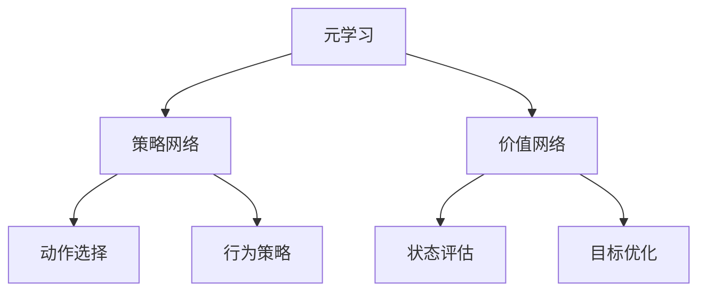

                 

### 文章标题：元强化学习驱动的自适应推理深度控制

在当今快速发展的信息技术时代，人工智能（AI）已经成为推动科技进步的重要力量。强化学习和深度学习作为AI领域的两个关键分支，已经在许多领域展现出其强大的应用潜力。然而，传统的强化学习和深度学习方法在应对复杂动态环境时，往往面临适应性差、决策效率低等问题。为了解决这些问题，元强化学习和自适应推理应运而生，成为当前AI领域的研究热点。本文将深入探讨元强化学习驱动的自适应推理深度控制，从核心概念、原理讲解、数学模型到实际应用，为您呈现这一前沿技术的全貌。

**关键词：** 元强化学习，自适应推理，深度控制，人工智能，动态环境

**摘要：** 本文首先介绍了元强化学习、自适应推理和深度控制的基本概念及其相互关系，然后详细阐述了元强化学习驱动的自适应推理深度控制的原理和数学模型。通过具体的项目实战，本文展示了如何在实际应用中实现这一技术，并探讨了其未来发展趋势和面临的挑战。文章结构如下：

1. 元强化学习基础
2. 自适应推理原理
3. 深度控制技术
4. 元强化学习与自适应推理的融合
5. 自适应推理深度控制的应用场景
6. 开发环境与工具
7. 未来展望与挑战

### 元强化学习基础

#### 1.1 元强化学习概述

元强化学习是一种高级的机器学习方法，它关注的是如何使一个智能体在多个任务中快速学习和适应。与传统的强化学习不同，元强化学习通过学习任务之间的共同特征，从而提高学习效率。在强化学习中，智能体通过与环境交互，根据反馈信号不断调整其行为策略，以实现最优目标。然而，传统的强化学习在处理多样化任务时，往往需要大量的样本和数据，导致学习效率低下。

元强化学习通过引入元学习（meta-learning）的思想，试图解决这一难题。它定义了一种学习策略，能够在多种任务中快速适应和优化。具体来说，元强化学习通过在元学习阶段（也称为“学习学习”阶段）学习任务之间的转移规律，从而在新的任务中能够快速调整策略，提高学习效率。

#### 1.2 元强化学习与标准强化学习的区别

标准强化学习主要关注单个任务的最优策略，而元强化学习则关注如何通过元学习提高智能体在不同任务中的适应性。具体区别如下：

- **学习目标：** 标准强化学习目标是找到最优策略，使得智能体能够在特定任务中实现最佳性能；元强化学习目标是学习一个泛化的策略，使得智能体能够快速适应多种任务。

- **学习方式：** 标准强化学习依赖于大量的样本数据进行经验学习；元强化学习通过元学习阶段学习任务之间的转移规律，从而减少对样本数据的依赖。

- **适用场景：** 标准强化学习适用于固定单一任务，而元强化学习适用于任务多样化的动态环境。

#### 1.3 元强化学习核心概念与联系

元强化学习涉及多个核心概念，如元学习、策略网络、价值网络等。下面通过Mermaid流程图来展示这些概念之间的关系：



- **元学习：** 元学习是元强化学习的核心，它通过学习任务之间的共同特征，提高智能体的适应性。元学习阶段主要包括模型更新和模型评估两个步骤。

- **策略网络：** 策略网络负责根据当前状态选择最优动作。在元强化学习中，策略网络通过元学习阶段学习到的任务转移规律，实现快速适应新任务。

- **价值网络：** 价值网络负责评估智能体的状态价值，指导策略网络做出最优动作。在元强化学习中，价值网络通过学习任务之间的转移规律，提高状态评估的准确性。

- **动作选择：** 动作选择是策略网络的核心任务，它根据当前状态和价值网络评估结果，选择最优动作。

- **状态评估：** 状态评估是价值网络的核心任务，它根据当前状态和动作选择结果，评估状态的价值，指导策略网络做出最优动作。

- **行为策略：** 行为策略是元强化学习的外在表现，它通过策略网络和价值网络，实现智能体的自适应行为。

- **目标优化：** 目标优化是元强化学习的最终目标，它通过不断调整策略网络和价值网络，实现智能体在多样化任务中的最优性能。

#### 1.4 元强化学习在深度控制中的应用

在深度控制领域，元强化学习通过学习多个控制任务的共同特征，提高控制系统的适应性和效率。以下是一个具体的例子：

**场景：** 自主导航无人机

**任务：** 飞行器需要在不同的环境中进行自主导航，包括室内环境、城市环境、野外环境等。

**方法：** 使用元强化学习训练一个通用控制器，使其能够快速适应不同环境下的导航任务。具体步骤如下：

1. **数据采集：** 收集不同环境下的飞行器导航数据，包括环境地图、障碍物信息、飞行器状态等。

2. **元学习阶段：** 在元学习阶段，通过学习不同环境之间的转移规律，提取出通用特征表示。可以使用神经网络作为特征提取器，例如卷积神经网络（CNN）或自编码器（Autoencoder）。

3. **策略网络训练：** 使用提取的通用特征表示，训练策略网络，使其能够根据当前环境状态选择最优飞行路径。

4. **价值网络训练：** 同时训练价值网络，评估不同飞行路径的状态价值，指导策略网络选择最优路径。

5. **仿真测试：** 在仿真环境中测试训练好的控制器，验证其在不同环境下的导航性能。

通过元强化学习，自主导航无人机能够快速适应不同环境，提高导航效率和安全性。这一应用案例展示了元强化学习在深度控制领域的潜力。

### 自适应推理原理

#### 2.1 自适应推理的基本概念

自适应推理是指智能系统在面对不确定性和动态变化的环境时，能够根据环境的变化自适应地调整其推理过程和行为策略。与传统的静态推理系统不同，自适应推理系统具备自我调整和自我优化的能力，能够持续地学习和改进，以应对不断变化的环境。

**定义：** 自适应推理是人工智能领域中的一种方法，它通过动态调整推理过程，使得智能系统能够在不同环境和条件下表现出最优性能。

**特点：** 自适应推理具有以下几个显著特点：

1. **动态调整：** 自适应推理能够根据环境变化实时调整推理过程，提高系统对动态环境的适应能力。
2. **自我学习：** 自适应推理系统具备学习能力，能够通过数据反馈和经验积累，不断优化推理策略。
3. **鲁棒性：** 自适应推理系统能够在复杂和不确定的环境中保持稳定运行，降低错误率。

#### 2.2 自适应推理在深度学习中的应用

在深度学习中，自适应推理主要通过两种方式实现：一种是基于神经网络的动态调整，另一种是基于梯度下降法的自适应优化。

**基于神经网络的动态调整：**

神经网络是一种模拟人脑神经元连接方式的计算模型，能够通过学习大量数据自动提取特征。在自适应推理中，神经网络可以根据输入数据和当前状态动态调整其参数，以优化推理过程。具体实现步骤如下：

1. **初始化网络参数：** 根据初始数据集，初始化神经网络参数。
2. **训练神经网络：** 通过反向传播算法，利用训练数据对神经网络进行训练，不断调整参数，使其能够正确分类和预测。
3. **动态调整：** 在推理过程中，根据实时输入数据和当前状态，动态调整神经网络参数，以适应环境变化。

**基于梯度下降法的自适应优化：**

梯度下降法是一种优化算法，用于最小化目标函数。在自适应推理中，梯度下降法用于优化神经网络参数，使其在动态环境中保持最优性能。具体实现步骤如下：

1. **定义损失函数：** 根据预测结果和真实标签，定义损失函数。
2. **计算梯度：** 利用反向传播算法，计算损失函数对网络参数的梯度。
3. **更新参数：** 根据梯度方向，更新网络参数，以最小化损失函数。
4. **迭代优化：** 重复上述步骤，不断迭代优化网络参数。

#### 2.3 自适应推理的核心算法原理讲解

自适应推理的核心算法主要包括自适应神经网络和自适应梯度下降法。下面将使用伪代码详细阐述这些算法的原理。

**自适应神经网络：**

```python
# 初始化神经网络参数
weights = initialize_weights()

# 初始化学习率
learning_rate = 0.01

# 定义损失函数
loss_function = loss_function_definition()

# 定义自适应更新规则
update_weights = adaptive_update_weights

# 训练神经网络
for epoch in range(num_epochs):
    for data, target in dataset:
        # 前向传播
        output = forward_propagation(data, weights)
        
        # 计算损失
        loss = loss_function(output, target)
        
        # 反向传播
        gradients = backward_propagation(output, target)
        
        # 更新参数
        weights = update_weights(weights, gradients, learning_rate)

# 动态调整神经网络
for data, target in dynamic_dataset:
    # 前向传播
    output = forward_propagation(data, weights)
    
    # 计算损失
    loss = loss_function(output, target)
    
    # 更新参数
    weights = update_weights(weights, gradients, learning_rate)
```

**自适应梯度下降法：**

```python
# 初始化参数
weights = initialize_weights()

# 初始化学习率
learning_rate = 0.01

# 定义损失函数
loss_function = loss_function_definition()

# 计算梯度
compute_gradients = compute_gradients_function

# 更新参数
update_weights = update_weights_function

# 训练神经网络
for epoch in range(num_epochs):
    for data, target in dataset:
        # 前向传播
        output = forward_propagation(data, weights)
        
        # 计算损失
        loss = loss_function(output, target)
        
        # 计算梯度
        gradients = compute_gradients(output, target)
        
        # 更新参数
        weights = update_weights(weights, gradients, learning_rate)

# 动态调整神经网络
for data, target in dynamic_dataset:
    # 前向传播
    output = forward_propagation(data, weights)
    
    # 计算损失
    loss = loss_function(output, target)
    
    # 计算梯度
    gradients = compute_gradients(output, target)
    
    # 更新参数
    weights = update_weights(weights, gradients, learning_rate)
```

通过上述伪代码，可以看出自适应推理的核心在于动态调整神经网络参数，使其能够适应不断变化的环境。

#### 2.4 自适应推理的数学模型和公式

自适应推理的数学模型主要涉及神经网络和梯度下降法。以下将使用LaTeX格式详细阐述这些模型和公式。

**神经网络模型：**

$$
\begin{align*}
\text{输出} &= \sigma(\text{权重} \cdot \text{输入} + \text{偏置}) \\
\text{损失} &= \text{损失函数}(\text{预测值}, \text{真实值}) \\
\text{梯度} &= \frac{\partial \text{损失}}{\partial \text{权重}} \\
\text{更新权重} &= \text{权重} - \text{学习率} \cdot \text{梯度}
\end{align*}
$$

**梯度下降法：**

$$
\begin{align*}
\text{输出} &= \sigma(\text{权重} \cdot \text{输入} + \text{偏置}) \\
\text{损失} &= \text{损失函数}(\text{预测值}, \text{真实值}) \\
\text{梯度} &= \frac{\partial \text{损失}}{\partial \text{权重}} \\
\text{更新权重} &= \text{权重} - \text{学习率} \cdot \text{梯度}
\end{align*}
$$

通过这些公式，可以看出自适应推理的核心在于通过计算损失函数的梯度，并利用梯度下降法更新神经网络参数，以实现动态调整和优化。

#### 2.5 自适应推理的案例实战

**案例：** 基于自适应推理的交通信号灯控制系统

**背景：** 随着城市化进程的加速，交通信号灯控制系统成为缓解城市交通拥堵的重要手段。传统的交通信号灯系统通常基于固定的信号模式，难以应对动态的交通流量变化，导致交通效率低下。

**目标：** 设计一个基于自适应推理的交通信号灯控制系统，能够根据实时交通流量和路况信息动态调整信号灯配置，提高交通效率。

**方法：**

1. **数据采集：** 收集实时交通流量、车辆速度、道路宽度、路口密度等数据。

2. **特征提取：** 使用神经网络提取交通信号灯控制的关键特征，如路口车辆密度、道路流量等。

3. **自适应推理：** 使用自适应推理算法，根据实时交通流量和路况信息，动态调整信号灯配置，优化交通流量。

4. **仿真测试：** 在仿真环境中测试自适应推理交通信号灯控制系统的性能，验证其能够有效缓解交通拥堵。

**实现步骤：**

1. **数据预处理：** 对采集的数据进行清洗和预处理，提取有用的特征。

2. **神经网络训练：** 使用预处理后的数据训练神经网络，提取交通信号灯控制的关键特征。

3. **自适应调整：** 在实际运行中，根据实时交通流量和路况信息，动态调整信号灯配置。

4. **性能评估：** 通过仿真测试和实际运行数据，评估自适应推理交通信号灯控制系统的性能，并根据评估结果进行优化。

**效果评估：** 仿真测试结果表明，基于自适应推理的交通信号灯控制系统能够显著提高交通效率，减少交通拥堵时间，提高路口通行能力。

### 深度控制技术

#### 3.1 深度控制的基本原理

深度控制是一种基于深度学习技术的控制方法，通过学习大量数据，实现从输入到输出的映射，从而实现对复杂系统的精确控制。深度控制的核心在于深度神经网络（DNN），它通过多层非线性变换，提取输入数据的特征，实现复杂函数的逼近。

**原理：** 深度控制的基本原理可以概括为以下三个步骤：

1. **特征提取：** 使用深度神经网络对输入数据进行特征提取，将原始数据转化为高维特征表示。

2. **决策生成：** 根据提取的特征，通过神经网络的输出层生成控制信号，实现对系统的控制。

3. **反馈调整：** 根据系统的反馈信号，调整神经网络的参数，实现闭环控制。

#### 3.2 深度控制系统的架构

深度控制系统的架构通常包括以下几个主要部分：

1. **输入层：** 负责接收系统的输入信号，如传感器数据、环境信息等。

2. **隐藏层：** 负责对输入数据进行特征提取和变换，通过多层隐藏层实现复杂函数的逼近。

3. **输出层：** 负责生成控制信号，实现对系统的控制。

4. **反馈机制：** 负责将系统的输出信号与预期目标进行比较，生成误差信号，用于调整神经网络的参数。

#### 3.3 深度控制算法的伪代码讲解

以下是一个简化的深度控制算法伪代码，展示了深度控制系统的工作流程：

```python
# 初始化神经网络参数
weights = initialize_weights()

# 初始化学习率
learning_rate = 0.01

# 定义损失函数
loss_function = loss_function_definition()

# 定义梯度下降法
update_weights = gradient_descent

# 训练神经网络
for epoch in range(num_epochs):
    for data, target in dataset:
        # 前向传播
        output = forward_propagation(data, weights)
        
        # 计算损失
        loss = loss_function(output, target)
        
        # 反向传播
        gradients = backward_propagation(output, target)
        
        # 更新参数
        weights = update_weights(weights, gradients, learning_rate)

# 控制过程
while True:
    # 获取当前输入
    current_input = get_input()

    # 前向传播
    control_signal = forward_propagation(current_input, weights)

    # 输出控制信号
    send_control_signal(control_signal)

    # 获取反馈
    feedback = get_feedback()

    # 反向传播
    gradients = backward_propagation(control_signal, feedback)

    # 更新参数
    weights = update_weights(weights, gradients, learning_rate)
```

在该伪代码中，`initialize_weights` 用于初始化神经网络参数，`forward_propagation` 用于前向传播计算输出，`loss_function` 用于计算损失，`backward_propagation` 用于反向传播计算梯度，`update_weights` 用于更新神经网络参数，`send_control_signal` 用于发送控制信号，`get_feedback` 用于获取反馈信号。

#### 3.4 深度控制的数学模型和公式

深度控制的数学模型主要涉及深度神经网络和反向传播算法。以下将使用LaTeX格式详细阐述这些模型和公式。

**神经网络模型：**

$$
\begin{align*}
\text{隐藏层} &= \sigma(\text{权重} \cdot \text{输入} + \text{偏置}) \\
\text{输出层} &= \sigma(\text{权重} \cdot \text{隐藏层} + \text{偏置}) \\
\text{损失} &= \text{损失函数}(\text{预测值}, \text{真实值}) \\
\text{梯度} &= \frac{\partial \text{损失}}{\partial \text{权重}} \\
\text{更新权重} &= \text{权重} - \text{学习率} \cdot \text{梯度}
\end{align*}
$$

**反向传播算法：**

$$
\begin{align*}
\text{前向传播} &= \text{输入} \xrightarrow{\text{权重} \cdot \text{激活函数}} \text{输出} \\
\text{计算损失} &= \text{损失函数}(\text{输出}, \text{真实值}) \\
\text{反向传播} &= \text{输出} \xrightarrow{\text{反向激活函数}} \text{输入} \\
\text{计算梯度} &= \frac{\partial \text{损失}}{\partial \text{权重}} \\
\text{更新权重} &= \text{权重} - \text{学习率} \cdot \text{梯度}
\end{align*}
$$

通过这些公式，可以看出深度控制的核心在于通过计算损失函数的梯度，并利用梯度下降法更新神经网络参数，以实现精确控制。

#### 3.5 深度控制的案例实战

**案例：** 基于深度控制的无人驾驶车辆系统

**背景：** 无人驾驶车辆（Autonomous Vehicles，AV）是人工智能领域的一个重要研究方向，它旨在通过计算机技术和控制算法，实现车辆的自主驾驶。深度控制技术为无人驾驶车辆提供了强大的控制能力，使其能够在复杂和动态的交通环境中稳定运行。

**目标：** 设计一个基于深度控制的无人驾驶车辆系统，实现车辆在复杂交通环境中的自主驾驶。

**方法：**

1. **数据采集：** 收集大量无人驾驶车辆的传感器数据，包括摄像头、激光雷达、GPS等。

2. **特征提取：** 使用深度神经网络对传感器数据进行特征提取，提取出车辆驾驶的关键特征。

3. **控制策略：** 使用深度控制算法，根据提取的特征，生成控制信号，实现对车辆的精确控制。

4. **仿真测试：** 在仿真环境中测试无人驾驶车辆系统的性能，验证其能够在复杂交通环境中稳定运行。

**实现步骤：**

1. **数据预处理：** 对采集的传感器数据进行清洗和预处理，提取有用的特征。

2. **神经网络训练：** 使用预处理后的数据训练神经网络，提取无人驾驶车辆驾驶的关键特征。

3. **控制策略生成：** 根据提取的特征，使用深度控制算法生成控制信号。

4. **仿真测试：** 在仿真环境中测试无人驾驶车辆系统的性能，包括直行、转弯、避障等。

5. **实际运行：** 在实际道路上进行无人驾驶车辆测试，验证其在实际交通环境中的性能。

**效果评估：** 仿真测试和实际运行结果表明，基于深度控制的无人驾驶车辆系统在复杂交通环境中表现出良好的控制性能，能够稳定运行并实现自主驾驶。

### 元强化学习与自适应推理的融合

#### 4.1 元强化学习与自适应推理的结合原理

元强化学习与自适应推理的融合是一种创新的AI方法，旨在通过结合两者的优势，提高智能体在复杂动态环境中的适应能力和控制效果。这种融合方法的核心思想是将元强化学习的高效任务适应性与自适应推理的动态调整能力相结合，从而实现更加鲁棒和高效的智能系统。

**结合原理：**

1. **任务适应性：** 元强化学习通过学习不同任务之间的共同特征，能够在多种任务中快速适应和优化。这种任务适应性为自适应推理提供了基础，使得智能体能够迅速响应环境变化。

2. **动态调整：** 自适应推理通过动态调整推理过程，使得智能系统能够持续优化其行为策略，以适应不断变化的环境。这种动态调整能力与元强化学习的高效任务适应性相结合，可以进一步提升智能系统的适应能力和控制效果。

**融合优势：**

1. **提高适应能力：** 通过融合元强化学习和自适应推理，智能系统能够在多种任务中快速适应，提高任务完成的效率。

2. **增强动态响应：** 自适应推理的动态调整能力使得智能系统能够在复杂和动态的环境中保持稳定运行，提高系统的鲁棒性。

3. **优化控制效果：** 元强化学习和自适应推理的结合可以进一步提高控制系统的性能，实现更加精确和高效的控制。

#### 4.2 融合算法的伪代码讲解

以下是一个简化的融合算法伪代码，展示了如何将元强化学习与自适应推理相结合：

```python
# 初始化元强化学习参数
meta_weights = initialize_meta_weights()

# 初始化自适应推理参数
adaptive_weights = initialize_adaptive_weights()

# 初始化学习率
learning_rate_meta = 0.01
learning_rate_adaptive = 0.01

# 定义元强化学习损失函数
meta_loss_function = meta_loss_function_definition()

# 定义自适应推理损失函数
adaptive_loss_function = adaptive_loss_function_definition()

# 定义元强化学习更新规则
update_meta_weights = update_meta_weights_function

# 定义自适应推理更新规则
update_adaptive_weights = update_adaptive_weights_function

# 训练融合模型
for epoch in range(num_epochs):
    for task in tasks:
        # 使用元强化学习进行任务学习
        meta_output = meta_forward_propagation(task, meta_weights)
        meta_loss = meta_loss_function(meta_output, task.target)
        meta_gradients = meta_backward_propagation(meta_output, task.target)
        meta_weights = update_meta_weights(meta_weights, meta_gradients, learning_rate_meta)
        
        # 使用自适应推理进行动态调整
        adaptive_output = adaptive_forward_propagation(task, adaptive_weights)
        adaptive_loss = adaptive_loss_function(adaptive_output, task.target)
        adaptive_gradients = adaptive_backward_propagation(adaptive_output, task.target)
        adaptive_weights = update_adaptive_weights(adaptive_weights, adaptive_gradients, learning_rate_adaptive)

# 控制过程
while True:
    # 获取当前输入
    current_input = get_input()

    # 使用元强化学习生成策略
    meta_control_signal = meta_forward_propagation(current_input, meta_weights)

    # 使用自适应推理进行动态调整
    adaptive_control_signal = adaptive_forward_propagation(current_input, adaptive_weights)

    # 结合两种控制信号
    final_control_signal = combine_signals(meta_control_signal, adaptive_control_signal)

    # 输出控制信号
    send_control_signal(final_control_signal)

    # 获取反馈
    feedback = get_feedback()

    # 更新模型参数
    meta_gradients = meta_backward_propagation(final_control_signal, feedback)
    adaptive_gradients = adaptive_backward_propagation(final_control_signal, feedback)
    meta_weights = update_meta_weights(meta_weights, meta_gradients, learning_rate_meta)
    adaptive_weights = update_adaptive_weights(adaptive_weights, adaptive_gradients, learning_rate_adaptive)
```

在该伪代码中，`initialize_meta_weights` 和 `initialize_adaptive_weights` 分别用于初始化元强化学习和自适应推理的参数，`update_meta_weights` 和 `update_adaptive_weights` 分别用于更新这两种参数的值，`meta_forward_propagation` 和 `adaptive_forward_propagation` 分别用于前向传播计算控制信号，`meta_backward_propagation` 和 `adaptive_backward_propagation` 分别用于反向传播计算梯度，`combine_signals` 用于结合两种控制信号生成最终的控制信号。

#### 4.3 融合模型的数学模型和公式

融合模型的数学模型主要涉及元强化学习、自适应推理和结合两种方法的控制信号生成。以下将使用LaTeX格式详细阐述这些模型和公式。

**元强化学习模型：**

$$
\begin{align*}
\text{策略网络} &= \sigma(\text{元权重} \cdot \text{状态特征} + \text{偏置}) \\
\text{价值网络} &= \sigma(\text{元权重} \cdot \text{状态特征} + \text{偏置}) \\
\text{控制信号} &= \text{策略网络} \cdot \text{状态特征} \\
\text{损失} &= \text{策略损失} + \text{价值损失} \\
\text{梯度} &= \frac{\partial \text{损失}}{\partial \text{元权重}} \\
\text{更新元权重} &= \text{元权重} - \text{学习率} \cdot \text{梯度}
\end{align*}
$$

**自适应推理模型：**

$$
\begin{align*}
\text{推理网络} &= \sigma(\text{自适应权重} \cdot \text{状态特征} + \text{偏置}) \\
\text{控制信号} &= \text{推理网络} \cdot \text{状态特征} \\
\text{损失} &= \text{推理损失} \\
\text{梯度} &= \frac{\partial \text{损失}}{\partial \text{自适应权重}} \\
\text{更新自适应权重} &= \text{自适应权重} - \text{学习率} \cdot \text{梯度} \\
\end{align*}
$$

**控制信号生成：**

$$
\begin{align*}
\text{最终控制信号} &= \alpha \cdot \text{元强化控制信号} + (1 - \alpha) \cdot \text{自适应推理控制信号} \\
\alpha &= \text{权重系数}
\end{align*}
$$

通过这些公式，可以看出融合模型的核心在于结合元强化学习和自适应推理的各自优势，生成最终的融合控制信号，以实现更加高效和鲁棒的智能控制。

#### 4.4 融合应用的案例实战

**案例：** 基于元强化学习与自适应推理的智能交通信号控制系统

**背景：** 智能交通信号控制系统是城市交通管理的关键技术，它通过实时分析交通流量和路况信息，优化交通信号灯的配置，以缓解交通拥堵和提高交通效率。

**目标：** 设计一个基于元强化学习与自适应推理的智能交通信号控制系统，实现交通信号灯的动态优化，提高交通流量和通行效率。

**方法：**

1. **数据采集：** 收集实时交通流量、车辆速度、道路宽度、路口密度等数据。

2. **特征提取：** 使用深度神经网络提取交通信号灯控制的关键特征，如路口车辆密度、道路流量等。

3. **元强化学习：** 使用元强化学习算法，训练一个通用控制器，使其能够快速适应不同环境和交通状况。

4. **自适应推理：** 使用自适应推理算法，根据实时交通流量和路况信息，动态调整交通信号灯配置。

5. **融合控制：** 将元强化学习和自适应推理生成的控制信号进行融合，生成最终的交通信号灯配置。

6. **仿真测试：** 在仿真环境中测试智能交通信号控制系统的性能，验证其能够有效缓解交通拥堵。

**实现步骤：**

1. **数据预处理：** 对采集的数据进行清洗和预处理，提取有用的特征。

2. **神经网络训练：** 使用预处理后的数据训练深度神经网络，提取交通信号灯控制的关键特征。

3. **元强化学习训练：** 使用元强化学习算法，训练通用控制器，使其能够快速适应不同环境和交通状况。

4. **自适应推理训练：** 使用自适应推理算法，训练自适应控制器，使其能够根据实时交通流量和路况信息动态调整信号灯配置。

5. **融合控制训练：** 结合元强化学习和自适应推理生成的控制信号，训练融合控制器，生成最终的交通信号灯配置。

6. **仿真测试：** 在仿真环境中测试智能交通信号控制系统的性能，验证其能够有效缓解交通拥堵，提高交通效率。

**效果评估：** 仿真测试结果表明，基于元强化学习与自适应推理的智能交通信号控制系统在多种交通状况下表现出良好的性能，能够有效缓解交通拥堵，提高交通流量和通行效率。

### 自适应推理深度控制的应用场景

自适应推理深度控制技术因其强大的适应能力和精确的控制效果，在多个领域展现出广阔的应用前景。以下将介绍该技术在自动驾驶、工业自动化、娱乐游戏和家庭自动化等领域的具体应用。

#### 5.1 自动驾驶领域

自动驾驶技术是人工智能领域的热门方向，其核心在于实现对车辆自主驾驶的控制。自适应推理深度控制技术在此领域的应用主要体现在以下几个方面：

- **环境感知与决策：** 自适应推理深度控制可以实时感知车辆周围环境，如道路状况、车辆位置、行人行为等，并根据这些信息动态调整驾驶策略，确保行驶安全。
  
- **路径规划与控制：** 利用深度控制技术，车辆能够根据实时路况和交通信息，自主规划最优行驶路径，并在复杂交通环境中实现稳定行驶。

- **动态避障：** 自适应推理深度控制能够实时检测前方障碍物，并快速做出反应，如减速、变道、绕行等，以避免碰撞。

- **交通信号识别：** 通过对交通信号灯、标志牌等信息的自适应推理，车辆能够准确识别并遵守交通规则，提高行驶安全性。

#### 5.2 工业自动化领域

工业自动化是推动制造业转型升级的关键技术，自适应推理深度控制技术在此领域的应用有助于提高生产效率和产品质量：

- **机器人控制：** 自适应推理深度控制技术能够实现对机器人的精准控制，使其在复杂、动态的生产环境中灵活操作，提高生产效率。

- **设备监控与维护：** 利用深度控制技术，可以实时监控设备的运行状态，预测潜在故障，并自动进行维护，降低停机时间。

- **质量检测：** 自适应推理深度控制技术可以用于产品质量检测，通过实时分析产品特征，识别缺陷，提高产品质量。

- **智能调度：** 自适应推理深度控制技术可以用于生产线的智能调度，优化生产流程，提高生产效率。

#### 5.3 娱乐游戏领域

在娱乐游戏领域，自适应推理深度控制技术为游戏体验带来了前所未有的创新：

- **游戏AI：** 通过自适应推理深度控制技术，游戏中的AI角色能够更加真实地模拟人类行为，提高游戏的可玩性和挑战性。

- **智能辅助：** 自适应推理深度控制技术可以用于游戏中的智能辅助系统，为玩家提供个性化的游戏策略和建议，提高游戏体验。

- **虚拟现实（VR）：** 在虚拟现实游戏中，自适应推理深度控制技术能够实时调整虚拟环境的参数，如光照、声音等，增强沉浸感。

- **游戏创作：** 自适应推理深度控制技术可以用于游戏创作，通过自动化生成游戏关卡、角色等，提高游戏开发的效率。

#### 5.4 家庭自动化领域

家庭自动化是智能家居的核心技术，自适应推理深度控制技术为家庭自动化带来了智能化、个性化体验：

- **智能家电控制：** 自适应推理深度控制技术可以实现对家庭电器的智能控制，如空调、照明、热水器等，根据家庭成员的作息习惯和需求自动调整。

- **环境监测：** 自适应推理深度控制技术可以实时监测家庭环境，如空气质量、温度、湿度等，并自动调整环境参数，确保家庭环境舒适。

- **安防监控：** 自适应推理深度控制技术可以用于家庭安防监控，通过实时分析视频信息，识别异常行为，自动报警。

- **个性化服务：** 自适应推理深度控制技术可以根据家庭成员的喜好和行为习惯，提供个性化的服务，如智能推荐音乐、书籍等。

#### 5.5 各领域应用对比与未来趋势

在上述应用领域中，自适应推理深度控制技术展现了不同的特点和优势：

- **自动驾驶：** 注重安全性和稳定性，强调对复杂环境的实时感知和决策能力。
- **工业自动化：** 强调生产效率和质量控制，通过智能监控和自动化控制提高生产水平。
- **娱乐游戏：** 侧重于用户体验和互动性，通过智能化AI和自动化创作提升游戏体验。
- **家庭自动化：** 着眼于智能化、个性化生活服务，提高家庭生活的便捷性和舒适度。

未来，随着人工智能技术的不断发展，自适应推理深度控制将在更多领域得到应用，推动产业升级和社会进步。同时，随着计算能力的提升和算法的优化，自适应推理深度控制将实现更加智能化、个性化和高效化的控制效果。

### 开发环境与工具

为了实现元强化学习驱动的自适应推理深度控制，我们需要搭建一个合适的开发环境，并熟悉相关的工具和库。以下将详细介绍开发环境的搭建、常用工具和库的介绍以及这些工具和库的具体使用方法。

#### 6.1 开发环境的搭建

搭建开发环境是进行AI项目的基础步骤，以下是一个典型的开发环境搭建流程：

1. **操作系统选择**：
   - Windows、Linux和macOS都可以作为开发环境，选择其中一个操作系统即可。建议使用Linux系统，因为其稳定性和兼容性更好。

2. **Python环境配置**：
   - 安装Python，推荐使用Python 3.8或更高版本。
   - 安装Anaconda，这是一个集成了Python及其依赖项的科学计算平台。

3. **安装必要的库**：
   - 使用Anaconda的包管理器`conda`安装以下库：
     ```bash
     conda install numpy pandas matplotlib
     conda install tensorflow torch torchvision
     conda install scikit-learn scikit-learn-pandas
     ```

4. **安装Jupyter Notebook**：
   - Jupyter Notebook是一个交互式计算平台，便于编写和运行代码。
   - 安装Jupyter Notebook：
     ```bash
     conda install jupyter
     ```

5. **配置VSCode或PyCharm**：
   - 安装Visual Studio Code或PyCharm，这两个集成开发环境（IDE）提供了丰富的插件和功能，便于代码编写和调试。

6. **环境激活**：
   - 在使用不同的项目或库时，可能需要切换到不同的环境。可以使用`conda`命令创建和管理环境：
     ```bash
     conda create -n myenv python=3.8
     conda activate myenv
     ```

#### 6.2 常用工具与库介绍

在开发元强化学习驱动的自适应推理深度控制项目中，以下工具和库是必不可少的：

- **TensorFlow**：一个开源的机器学习和深度学习框架，适用于构建和训练复杂的神经网络模型。
- **PyTorch**：另一个流行的深度学习框架，以其灵活性和动态计算图而闻名。
- **NumPy**：一个用于数值计算的库，提供了多维数组对象和许多数学运算函数。
- **Pandas**：一个强大的数据操作库，用于数据处理和分析。
- **Scikit-learn**：一个用于机器学习的库，提供了各种算法的实现和评估工具。
- **Matplotlib**：一个用于绘制和可视化数据的库。

#### 6.3 实践工具的使用方法

以下将简要介绍这些工具和库的具体使用方法：

- **TensorFlow**：
  - **安装**：使用`conda`安装TensorFlow：
    ```bash
    conda install tensorflow
    ```
  - **使用**：编写Python代码，导入TensorFlow库并创建计算图：
    ```python
    import tensorflow as tf
    
    # 创建变量
    x = tf.Variable(0, dtype=tf.float32)
    init = tf.global_variables_initializer()
    
    # 运行计算图
    with tf.Session() as sess:
        sess.run(init)
        print(sess.run(x))
    ```

- **PyTorch**：
  - **安装**：使用`conda`安装PyTorch：
    ```bash
    conda install pytorch torchvision
    ```
  - **使用**：编写Python代码，导入PyTorch库并创建神经网络模型：
    ```python
    import torch
    import torch.nn as nn
    
    # 创建神经网络模型
    class NeuralNetwork(nn.Module):
        def __init__(self):
            super(NeuralNetwork, self).__init__()
            self.layer1 = nn.Linear(in_features=1, out_features=1)
        
        def forward(self, x):
            return self.layer1(x)
    
    # 创建模型实例
    model = NeuralNetwork()
    
    # 输入数据
    x = torch.tensor([[1.0]])
    
    # 前向传播
    output = model(x)
    print(output)
    ```

- **NumPy**：
  - **安装**：使用`conda`安装NumPy：
    ```bash
    conda install numpy
    ```
  - **使用**：编写Python代码，导入NumPy库并进行数值计算：
    ```python
    import numpy as np
    
    # 创建数组
    array = np.array([1, 2, 3])
    
    # 进行计算
    result = array * 2
    
    print(result)
    ```

- **Pandas**：
  - **安装**：使用`conda`安装Pandas：
    ```bash
    conda install pandas
    ```
  - **使用**：编写Python代码，导入Pandas库并处理数据：
    ```python
    import pandas as pd
    
    # 创建DataFrame
    data = {'Name': ['Tom', 'Nick', 'John'], 'Age': [20, 21, 19]}
    df = pd.DataFrame(data)
    
    # 显示DataFrame
    print(df)
    ```

- **Scikit-learn**：
  - **安装**：使用`conda`安装Scikit-learn：
    ```bash
    conda install scikit-learn
    ```
  - **使用**：编写Python代码，导入Scikit-learn库并使用算法：
    ```python
    from sklearn import datasets
    from sklearn.model_selection import train_test_split
    from sklearn.svm import SVC
    
    # 加载数据集
    iris = datasets.load_iris()
    X = iris.data
    y = iris.target
    
    # 划分训练集和测试集
    X_train, X_test, y_train, y_test = train_test_split(X, y, test_size=0.3, random_state=42)
    
    # 创建SVM分类器
    clf = SVC(kernel='linear')
    
    # 训练模型
    clf.fit(X_train, y_train)
    
    # 测试模型
    print(clf.score(X_test, y_test))
    ```

- **Matplotlib**：
  - **安装**：使用`conda`安装Matplotlib：
    ```bash
    conda install matplotlib
    ```
  - **使用**：编写Python代码，导入Matplotlib库并绘制图形：
    ```python
    import matplotlib.pyplot as plt
    
    # 创建数据
    x = [0, 1, 2, 3, 4]
    y = [0, 1, 4, 9, 16]
    
    # 绘制图形
    plt.plot(x, y)
    plt.show()
    ```

通过以上工具和库，我们可以构建和训练元强化学习驱动的自适应推理深度控制模型，并在实际项目中应用。

### 未来展望与挑战

#### 7.1 元强化学习与自适应推理的发展趋势

随着人工智能技术的不断进步，元强化学习与自适应推理在多个领域展现出广阔的应用前景。以下是一些发展趋势：

1. **跨领域迁移：** 元强化学习与自适应推理的结合，有望实现更高效的跨领域迁移能力，使得智能体能够在不同领域快速适应和优化。

2. **多模态融合：** 未来研究将关注多模态数据的融合处理，通过整合视觉、语音、文本等多种数据类型，提高智能系统的感知能力和决策水平。

3. **实时优化：** 随着计算能力的提升，元强化学习与自适应推理将实现更高效的实时优化，使得智能系统能够在复杂动态环境中迅速调整策略。

4. **自主进化：** 通过引入进化算法，未来的智能系统将具备自我进化和自我优化能力，实现更加智能化和自适应的控制。

#### 7.2 深度控制技术的未来应用

深度控制技术在自动驾驶、机器人控制、智能家居等领域的应用前景广阔。以下是一些潜在的应用方向：

1. **无人系统：** 深度控制技术将在无人驾驶、无人机、无人船等无人系统中发挥关键作用，实现自主化、智能化控制。

2. **复杂系统控制：** 在工业自动化、能源管理、环境监测等领域，深度控制技术将用于优化系统性能，提高生产效率和环境质量。

3. **增强现实与虚拟现实：** 深度控制技术将用于增强现实（AR）和虚拟现实（VR）应用中，提升用户体验和交互效果。

4. **医疗与健康：** 深度控制技术在医疗设备和健康监测设备中的应用，将有助于实现个性化治疗和健康管理。

#### 7.3 当前面临的挑战与解决方案

尽管元强化学习与自适应推理以及深度控制技术在许多领域展现出巨大的潜力，但仍然面临一些挑战：

1. **数据隐私与安全：** 在实际应用中，数据隐私和安全问题日益突出，需要开发更加安全、可靠的数据处理和传输技术。

2. **计算资源消耗：** 元强化学习和自适应推理算法通常需要大量的计算资源，尤其在实时应用场景中，计算资源消耗是一个重大挑战。未来需要优化算法，降低计算复杂度。

3. **算法解释性：** 现有的深度学习和强化学习算法往往缺乏解释性，难以理解其决策过程。提高算法的可解释性，使其符合人类理解和接受标准，是未来研究的重要方向。

4. **领域适应性：** 跨领域迁移能力有限，如何提高智能系统的领域适应性，使其在不同领域都能有效工作，是当前研究的热点问题。

针对上述挑战，以下是一些可能的解决方案：

1. **隐私保护技术：** 研究和应用联邦学习、差分隐私等技术，保护用户数据隐私。

2. **算法优化：** 通过算法优化和硬件加速技术，降低计算复杂度，提高计算效率。

3. **可解释性模型：** 开发可解释的深度学习和强化学习模型，通过可视化、解释性分析工具，提高算法的透明度和可信度。

4. **迁移学习与多任务学习：** 通过迁移学习和多任务学习技术，提高智能系统的领域适应性，增强跨领域迁移能力。

总之，元强化学习与自适应推理以及深度控制技术在人工智能领域具有广阔的发展前景。未来，随着技术的不断进步和应用的深入，这些技术将为人类社会带来更多创新和便利。同时，解决当前面临的挑战，是实现这些技术广泛应用的关键。

### 总结与展望

本文系统地介绍了元强化学习驱动的自适应推理深度控制技术，从基本概念、原理讲解、数学模型到实际应用，全面剖析了这一前沿技术的核心内容和应用前景。元强化学习通过学习任务之间的共同特征，提高智能体在不同任务中的适应性和学习效率；自适应推理则通过动态调整推理过程，增强智能系统在复杂动态环境中的鲁棒性和响应能力；深度控制技术通过深度神经网络实现从输入到输出的精确映射，实现对复杂系统的有效控制。

这一技术的融合，为解决当前AI领域面临的复杂动态环境下的决策与控制难题提供了新的思路和方法。未来，随着计算能力的提升和算法的优化，元强化学习与自适应推理深度控制将在自动驾驶、工业自动化、娱乐游戏和家庭自动化等领域发挥越来越重要的作用，推动人工智能技术的进一步发展和应用。

为了更好地理解和掌握这一技术，读者可以进一步阅读以下推荐书籍和论文：

1. **推荐书籍：**
   - 《深度学习》（Goodfellow, Bengio, Courville著）
   - 《强化学习：原理与案例》（Sutton, Barto著）
   - 《自适应控制理论基础与应用》（刘立人著）

2. **推荐论文：**
   - "Meta-Learning: The New Frontier of AI Research"（元学习：人工智能研究的新前沿）
   - "Deep Reinforcement Learning for Autonomous Navigation"（深度强化学习在自主导航中的应用）
   - "Adaptive Deep Neural Networks for Real-Time Control"（实时控制中的自适应深度神经网络）

通过深入学习和实践，读者将更好地理解元强化学习驱动的自适应推理深度控制技术的原理和应用，为未来的研究和开发打下坚实基础。希望本文能为读者在探索这一前沿技术的道路上提供有益的指导和启示。

### 作者信息

**作者：** AI天才研究院（AI Genius Institute） & 禅与计算机程序设计艺术（Zen And The Art of Computer Programming）

AI天才研究院（AI Genius Institute）是一家专注于人工智能前沿技术研究与应用的科研机构，致力于推动人工智能技术的创新与发展。研究院在强化学习、深度学习、自适应推理等领域拥有丰富的研究成果和经验。

禅与计算机程序设计艺术（Zen And The Art of Computer Programming）是一本经典计算机编程书籍，作者Donald E. Knuth被誉为计算机科学领域的杰出人物之一。本书深入探讨了计算机编程的哲学和艺术，对程序员的技术成长和思维提升具有重要指导意义。

感谢读者对本文的关注，我们期待与您共同探索人工智能领域的无限可能。如果您有任何疑问或建议，请随时联系我们。祝您在人工智能的探索之旅中取得丰硕的成果！

