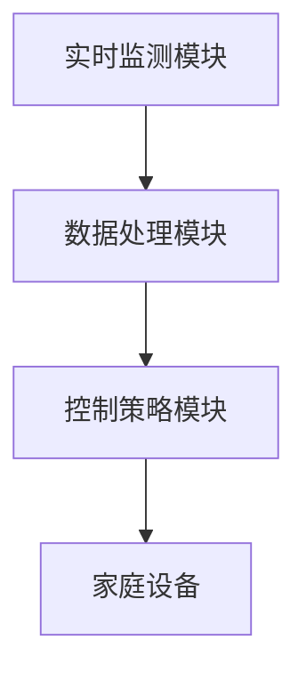

                 

### 元控制在自适应智能家居系统中的实现

智能家居系统正逐渐成为现代家庭生活的标配，为人们带来了极大的便利和舒适。然而，随着智能家居设备的多样化和复杂化，传统的控制方法已经难以满足其需求。元控制（Meta-control）作为一种高级控制理论，为解决这一挑战提供了新的思路。元控制在自适应智能家居系统中的实现，不仅能够提高系统的智能化水平，还能有效提升用户的居住体验。本文将深入探讨元控制在自适应智能家居系统中的应用，从概念、架构设计到算法实现，全面解析其原理与实践。

### 文章关键词

元控制、自适应系统、智能家居、控制算法、控制系统架构

### 文章摘要

本文首先介绍了元控制与自适应系统的基本概念，并分析了它们在智能家居中的应用。接着，详细阐述了智能家居系统的架构设计，包括实时监测、数据处理和控制策略模块。随后，深入探讨了元控制算法的基本原理和自适应控制策略的实现方法。本文还通过数学模型和公式详细讲解了控制系统的设计与优化。最后，通过实际项目案例，展示了元控制在自适应智能家居系统中的实现过程和应用效果。

### 目录

1. 元控制与自适应系统概述
   1.1 元控制的概念
   1.2 自适应系统的定义
   1.3 元控制在智能家居中的应用

2. 智能家居系统架构
   2.1 智能家居系统概述
   2.2 控制系统架构设计

3. 元控制算法原理
   3.1 元控制算法概述
   3.2 算法基本原理
   3.3 元控制算法在智能家居中的应用

4. 自适应控制策略实现
   4.1 自适应控制策略概述
   4.2 控制策略设计
   4.3 自适应控制策略实现

5. 数学模型与数学公式
   5.1 状态空间模型
   5.2 控制器设计

6. 项目实战
   6.1 项目背景
   6.2 系统设计
   6.3 源代码实现
   6.4 代码解读与分析

7. 总结与展望
   7.1 主要成果
   7.2 存在问题与改进方向
   7.3 未来研究方向

8. 附录
   8.1 参考文献
   8.2 相关资源

### 1. 元控制与自适应系统概述

#### 1.1 元控制的概念

元控制（Meta-control）是一种高级控制理论，它通过对控制系统的控制和优化，实现对复杂系统的全局优化和协调控制。元控制的核心思想是将控制系统的控制过程视为一个整体，通过分析系统状态、性能指标和约束条件，动态调整控制策略，从而实现系统的高效运行和优化。

在智能家居系统中，元控制的应用主要体现在以下几个方面：

- **系统整体优化**：元控制能够对智能家居系统中的多个设备进行整体优化，提高系统的能源利用效率和服务质量。
- **动态调整**：智能家居环境多变，元控制可以根据实时环境变化动态调整控制策略，提高系统的适应性和鲁棒性。
- **故障检测与恢复**：元控制可以对系统中的设备进行实时监测，一旦发现故障，可以迅速调整控制策略，实现系统的自动恢复。

#### 1.2 自适应系统的定义

自适应系统（Adaptive System）是一种能够在运行过程中根据外部环境和内部状态的变化，自动调整自身结构和参数，以适应新环境和实现新目标的系统。自适应系统通常具有以下几个特点：

- **动态调整**：自适应系统能够根据环境变化动态调整自身的结构和参数，以适应新的环境和任务。
- **鲁棒性**：自适应系统具有较强的鲁棒性，能够在面对不确定性和变化时，仍然保持稳定和高效运行。
- **自学习能力**：自适应系统能够通过学习算法，从历史数据中提取知识和模式，提高系统的适应性和预测能力。

在智能家居系统中，自适应系统的应用主要体现在以下几个方面：

- **环境监测**：自适应系统可以实时监测家居环境参数，如温度、湿度、光照等，并根据监测结果自动调整家居设备的工作状态。
- **用户行为分析**：自适应系统可以通过学习用户的行为习惯，自动调整家居设备的工作时间和模式，提高用户的舒适度和满意度。
- **能耗管理**：自适应系统可以优化能源消耗，降低家居系统的能源消耗，实现绿色环保。

#### 1.3 元控制在智能家居中的应用

元控制在智能家居中的应用，主要体现在以下几个方面：

- **系统优化**：元控制可以对智能家居系统中的各个设备进行整体优化，提高系统的运行效率和能源利用效率。
- **自适应调整**：元控制可以根据用户需求和家居环境的变化，动态调整家居设备的工作状态，提高家居系统的适应性和智能化水平。
- **故障处理**：元控制可以对智能家居系统进行实时监测，一旦发现故障，可以自动调整控制策略，实现系统的自动恢复。

例如，在智能照明系统中，元控制可以根据室内的光照强度、用户的活动情况以及能源消耗情况，动态调整灯光的亮度和色温，提高照明效果和能源利用效率。在智能空调系统中，元控制可以根据室内的温度、湿度以及用户的需求，自动调整空调的工作模式和温度，提高空调的舒适度和节能效果。

总之，元控制在自适应智能家居系统中的实现，不仅能够提高家居系统的智能化水平，还能有效提升用户的居住体验，是未来智能家居系统发展的重要方向。

### 2. 智能家居系统架构

#### 2.1 智能家居系统概述

智能家居系统是指通过物联网（IoT）技术，将家庭中的各种设备互联互通，实现家庭自动化、智能化管理的系统。智能家居系统通常包括以下几个核心组成部分：

- **感知层**：感知层是智能家居系统的数据采集模块，主要包括各种传感器，如温度传感器、湿度传感器、光照传感器、烟雾传感器等，用于实时采集家庭环境数据。
- **传输层**：传输层是智能家居系统的数据传输模块，主要包括无线网络、有线网络等，用于传输感知层采集的数据。
- **控制层**：控制层是智能家居系统的数据处理和决策模块，主要包括智能控制器、中央处理器等，用于处理感知层采集的数据，并生成相应的控制指令。
- **应用层**：应用层是智能家居系统的服务提供模块，主要包括各种智能家居应用，如智能照明、智能安防、智能家电等，用于实现家庭自动化和智能化管理。

#### 2.2 控制系统架构设计

智能家居系统的核心是控制系统，其架构设计直接影响系统的性能和用户体验。智能家居控制系统的设计通常包括以下几个模块：

- **实时监测模块**：实时监测模块是智能家居系统的数据采集模块，通过连接各种传感器，实时采集家庭环境数据，如温度、湿度、光照强度、气体浓度等。
- **数据处理模块**：数据处理模块是智能家居系统的数据存储和处理模块，负责对实时监测模块采集到的数据进行分析和处理，提取有用的信息，并生成相应的控制指令。
- **控制策略模块**：控制策略模块是智能家居系统的决策模块，根据数据处理模块提供的分析结果，结合用户需求和系统状态，动态调整控制策略，实现对家庭设备的智能控制。

下面是一个智能家居控制系统架构的Mermaid流程图：



#### 2.2.1 实时监测

实时监测模块是智能家居控制系统的数据采集模块，其功能是连接各种传感器，实时采集家庭环境数据。这些传感器包括：

- **温度传感器**：用于测量室内温度。
- **湿度传感器**：用于测量室内湿度。
- **光照传感器**：用于测量室内光照强度。
- **烟雾传感器**：用于检测室内烟雾浓度。
- **气体传感器**：用于检测室内有害气体浓度。

实时监测模块通过无线或有线网络将采集到的数据传输到数据处理模块。

#### 2.2.2 数据处理

数据处理模块是智能家居控制系统的数据存储和处理模块，其功能是对实时监测模块采集到的数据进行分析和处理，提取有用的信息，并生成相应的控制指令。数据处理模块通常包括以下功能：

- **数据存储**：将实时监测模块采集到的数据存储到数据库中，以便后续分析和查询。
- **数据分析**：对存储的数据进行分析，提取有用的信息，如室内温度、湿度、光照强度等。
- **异常检测**：通过分析数据，检测是否存在异常情况，如室内温度过高、烟雾浓度过大等。
- **生成控制指令**：根据分析结果，生成相应的控制指令，如调整空调温度、开启照明等。

#### 2.2.3 自适应控制策略

控制策略模块是智能家居控制系统的决策模块，其功能是根据数据处理模块提供的分析结果，结合用户需求和系统状态，动态调整控制策略，实现对家庭设备的智能控制。控制策略模块通常包括以下功能：

- **控制策略设计**：根据用户需求和系统状态，设计相应的控制策略，如温度控制策略、光照控制策略、安防控制策略等。
- **策略优化**：根据实时监测数据和用户反馈，对控制策略进行优化，以提高系统的适应性和用户体验。
- **策略执行**：根据优化后的控制策略，生成相应的控制指令，并通过控制层发送到家庭设备。

通过以上三个模块的协同工作，智能家居控制系统可以实现对家庭环境的实时监测和智能控制，提高家居生活的舒适度和便捷性。

### 3. 元控制算法原理

元控制算法（Meta-control Algorithm）是智能家居系统中实现自适应控制的核心技术，其基本原理是通过对系统状态、性能指标和约束条件的动态调整，实现对复杂系统的全局优化和协调控制。元控制算法通常包括以下几个基本步骤：

1. **系统建模**：首先，对智能家居系统进行建模，建立系统状态、性能指标和约束条件的数学模型。

2. **状态监测**：实时监测系统的状态，获取系统的当前状态信息。

3. **性能评估**：根据系统状态信息，评估系统的性能指标，如能耗、舒适度等。

4. **策略调整**：根据性能评估结果，动态调整控制策略，优化系统性能。

5. **策略执行**：将调整后的控制策略执行到系统中，实现系统的优化控制。

下面，我们通过伪代码来详细阐述元控制算法的基本原理：

```pseudo
# 元控制算法伪代码

# 输入参数
- 系统状态矩阵：X
- 控制输入：U
- 性能指标：P
- 约束条件：C

# 初始化参数
- 初始系统状态：X0
- 初始控制输入：U0
- 初始性能指标：P0
- 初始约束条件：C0

# 步骤1：系统建模
# 建立状态空间模型
X(k+1) = A * X(k) + B * U(k)
Y(k) = C * X(k) + D * U(k)

# 步骤2：状态监测
while (系统运行) {
    X(k) = 监测系统状态()
    U(k) = 监测控制输入()
}

# 步骤3：性能评估
P(k) = 性能评估(X(k), U(k))

# 步骤4：策略调整
# 根据性能评估结果，动态调整控制策略
U(k+1) = 策略调整(P(k), X(k), U(k))

# 步骤5：策略执行
执行控制输入(U(k+1))

# 结束
```

在元控制算法的实现中，通常需要考虑以下几个方面：

1. **系统状态监测**：如何高效、准确地获取系统状态信息是元控制算法的关键。常用的方法包括传感器监测、数据融合等。

2. **性能评估方法**：如何科学、客观地评估系统性能是元控制算法的核心。常用的方法包括能耗评估、舒适度评估等。

3. **策略调整算法**：如何根据性能评估结果动态调整控制策略，是实现元控制算法的关键。常用的方法包括优化算法、机器学习算法等。

4. **实时性要求**：元控制算法需要实时监测和调整系统状态，因此，实时性要求是元控制算法必须满足的基本要求。

通过以上步骤和方法的结合，元控制算法可以实现对智能家居系统的全局优化和协调控制，提高系统的智能化水平和服务质量。

#### 3.2.1 监测与评估原理

元控制算法中的监测与评估原理是确保系统在复杂环境中稳定运行的关键。具体来说，这一过程包括以下几个关键步骤：

1. **数据采集**：通过传感器网络，实时采集系统运行过程中的各种数据，如温度、湿度、光照强度、能耗等。这些数据是系统状态监测和评估的基础。

2. **数据处理**：对采集到的数据进行处理，包括数据清洗、去噪、归一化等操作。处理后的数据将用于性能评估和控制策略调整。

3. **状态监测**：利用处理后的数据，实时监测系统的状态变化。状态监测的目的是获取系统的当前状态，以便进行后续的性能评估和策略调整。

4. **性能评估**：根据监测到的系统状态，评估系统的性能指标。性能评估可以是多方面的，如能耗效率、用户舒适度、响应速度等。常用的评估方法包括统计分析、机器学习、模型预测等。

5. **异常检测**：在性能评估过程中，还应考虑异常检测。异常检测的目的是识别系统运行中的异常情况，如设备故障、数据异常等。一旦检测到异常，系统可以迅速响应，调整控制策略，确保系统的稳定运行。

6. **评估结果反馈**：将性能评估结果反馈给系统，作为控制策略调整的依据。评估结果可以是定量值，也可以是定性描述，如“系统运行正常”、“系统节能效果良好”等。

通过上述监测与评估过程，元控制算法可以实时、准确地了解系统的运行状态，为控制策略的动态调整提供科学依据。

#### 3.2.2 控制策略调整原理

控制策略调整是元控制算法的核心环节，其目的是根据系统状态和性能评估结果，动态调整控制策略，以优化系统性能。控制策略调整原理包括以下几个关键步骤：

1. **目标设定**：首先，明确系统需要优化的目标，如降低能耗、提高舒适度、增加安全性等。目标设定是控制策略调整的起点。

2. **状态评估**：通过监测与评估模块获取系统当前的实时状态。状态评估结果包括系统的各项性能指标，如温度、湿度、能耗、用户满意度等。

3. **策略选择**：根据目标设定和状态评估结果，选择合适的控制策略。策略选择可以是基于规则的方法、基于模型的方法或两者结合的方法。

   - **基于规则的方法**：这种方法根据预设的规则和条件，直接生成控制指令。例如，当室内温度超过设定值时，开启空调制冷。
   - **基于模型的方法**：这种方法通过建立系统模型，预测不同控制策略下的系统响应，选择最优策略。例如，利用控制理论中的状态空间模型，通过计算不同控制输入下的系统状态，选择能耗最低的控制策略。

4. **策略优化**：对选定的控制策略进行优化，以提高系统的整体性能。优化方法可以是最优化方法、遗传算法、粒子群优化等。

5. **策略调整**：将优化后的控制策略应用到系统中，调整系统的工作状态。策略调整可以是实时的，也可以是周期性的。

6. **反馈与迭代**：将策略调整后的系统性能反馈给监测与评估模块，进行新一轮的监测与评估。通过不断的迭代，逐步优化系统性能。

通过上述步骤，元控制算法能够实现控制策略的动态调整，提高智能家居系统的适应性和智能化水平。

### 4. 自适应控制策略实现

自适应控制策略是智能家居系统中实现智能化管理的关键技术。通过自适应控制策略，系统能够根据环境变化和用户需求，动态调整设备的工作状态，从而提供最佳的用户体验。本节将详细探讨自适应控制策略的实现方法，包括基于规则的策略和基于模型的策略。

#### 4.1 自适应控制策略概述

自适应控制策略是一种能够在运行过程中根据外部环境和内部状态变化，自动调整自身参数和行为的控制策略。其核心思想是实时监测系统的状态，通过反馈机制，动态调整控制参数，以实现系统性能的最优化。自适应控制策略在智能家居系统中的应用，主要体现在以下几个方面：

- **环境自适应**：根据环境变化（如温度、湿度、光照等），动态调整设备的工作状态，以保持环境舒适度。
- **用户行为自适应**：根据用户的行为习惯和需求，自动调整设备的操作模式，提高用户的便利性和满意度。
- **能耗管理自适应**：通过实时监测能耗数据，动态调整设备的工作状态，以实现能源的最优利用。

#### 4.2 控制策略设计

控制策略设计是自适应控制策略实现的第一步。设计一个有效的控制策略，需要考虑以下几个关键因素：

- **系统目标**：明确系统需要达到的目标，如节能、舒适度、安全性等。
- **环境监测**：选择合适的传感器，实时监测环境变化，获取准确的系统状态信息。
- **控制算法**：根据系统目标和环境监测结果，选择合适的控制算法，如PID控制、模糊控制、神经网络控制等。
- **用户交互**：设计用户交互界面，使系统能够接收用户的指令和反馈，调整控制策略。

以下是一个简单的自适应控制策略设计流程：

1. **需求分析**：根据用户需求和系统目标，明确控制策略需要实现的功能。
2. **环境监测**：选择合适的传感器，构建环境监测系统。
3. **算法选择**：根据需求分析结果，选择合适的控制算法。
4. **策略优化**：通过仿真和实验，对控制策略进行优化，以提高系统性能。
5. **实施部署**：将优化后的控制策略部署到实际系统中，进行测试和验证。

#### 4.2.1 基于规则的策略设计

基于规则的策略设计是一种简单且直观的自适应控制策略设计方法。它通过预设一系列规则，根据环境监测结果，自动执行相应的规则，实现系统的自适应控制。

以下是一个基于规则的策略设计示例：

1. **规则定义**：根据环境监测结果，定义一系列规则。例如：
   - 规则1：当室内温度高于设定值时，开启空调制冷。
   - 规则2：当室内温度低于设定值时，关闭空调。
   - 规则3：当室内湿度高于设定值时，开启加湿器。
   - 规则4：当室内湿度低于设定值时，关闭加湿器。

2. **规则执行**：当系统运行时，根据实时监测结果，执行相应的规则。例如，当室内温度高于设定值时，系统会自动开启空调，直到室内温度降至设定值以下。

3. **规则优化**：通过用户反馈和系统测试，对规则进行优化和调整，以提高系统的自适应性和用户满意度。

基于规则的策略设计简单易实现，适合应用于一些简单的智能家居系统。然而，对于复杂的智能家居系统，基于规则的策略可能无法满足复杂的控制需求，需要结合其他方法。

#### 4.2.2 基于模型的策略设计

基于模型的策略设计是一种更为复杂但高效的自适应控制策略设计方法。它通过建立系统模型，预测系统在不同控制策略下的行为，选择最优的控制策略。

以下是一个基于模型的策略设计示例：

1. **系统建模**：建立智能家居系统的数学模型，描述系统的状态、行为和约束条件。常用的建模方法包括状态空间模型、传递函数模型等。

2. **模型仿真**：通过仿真，分析系统在不同控制策略下的响应。例如，通过改变空调的温度控制策略，观察系统在不同策略下的能耗和舒适度。

3. **策略优化**：利用优化算法（如线性规划、遗传算法等），选择最优的控制策略。优化目标是实现系统性能的最优化，如最低能耗、最高舒适度等。

4. **策略验证**：将优化后的控制策略部署到实际系统中，进行测试和验证。通过用户反馈和系统测试，对策略进行进一步优化。

基于模型的策略设计能够更好地应对复杂的环境变化和用户需求，提供更为智能化的控制方案。然而，模型建立和优化的过程较为复杂，需要较高的技术水平。

#### 4.2.3 混合策略设计

在实际应用中，单一的基于规则或基于模型的策略可能无法满足所有场景的需求。为了提高系统的自适应性和灵活性，可以采用混合策略设计。

混合策略设计结合了基于规则和基于模型的优势，通过以下步骤实现：

1. **规则集成**：将基于规则的策略和基于模型的策略集成在一起，形成一个混合策略。例如，在温度控制中，可以同时使用基于规则的空调开启/关闭策略和基于模型的空调温度控制策略。

2. **规则优先级**：为不同的规则设置优先级，当多个规则同时触发时，按照优先级执行相应的策略。例如，当室内温度高于设定值且用户设置了制冷模式时，优先执行制冷策略。

3. **策略调整**：根据系统状态和用户需求，动态调整混合策略的权重。例如，在夜间，可以降低空调温度控制的权重，以提高用户的睡眠质量。

通过混合策略设计，系统能够在复杂多变的场景中，灵活调整控制策略，提高系统的自适应性和用户体验。

### 4.3 自适应控制策略实现

自适应控制策略的实现是智能家居系统智能化管理的关键。以下将从实现流程、方法和技术细节等方面，详细探讨自适应控制策略的实现。

#### 4.3.1 实现流程

自适应控制策略的实现通常包括以下几个步骤：

1. **需求分析**：根据用户需求和系统目标，明确自适应控制策略需要实现的功能。
2. **环境监测**：选择合适的传感器，构建环境监测系统，实时采集系统状态数据。
3. **数据处理**：对采集到的数据进行分析和处理，提取有用的信息，如温度、湿度、光照强度等。
4. **策略选择**：根据需求分析和数据处理结果，选择合适的自适应控制策略，如基于规则的策略、基于模型的策略或混合策略。
5. **策略优化**：对选定的控制策略进行优化，以提高系统的性能和用户体验。
6. **策略部署**：将优化后的控制策略部署到实际系统中，进行测试和验证。
7. **反馈与迭代**：根据用户反馈和系统测试结果，对控制策略进行进一步优化和调整。

#### 4.3.2 实现方法

自适应控制策略的实现方法主要取决于选定的策略类型。以下是几种常见的实现方法：

1. **基于规则的策略实现**：
   - **规则定义**：根据环境监测结果，定义一系列规则。例如，当室内温度高于设定值时，开启空调制冷。
   - **规则库管理**：建立规则库，存储和管理所有规则。规则库可以采用数据库或文件系统等存储方式。
   - **规则执行**：当系统运行时，根据实时监测结果，自动执行相应的规则。例如，当室内温度高于设定值时，系统会自动开启空调。

2. **基于模型的策略实现**：
   - **系统建模**：建立智能家居系统的数学模型，描述系统的状态、行为和约束条件。例如，可以使用状态空间模型描述系统的动态行为。
   - **模型仿真**：通过仿真，分析系统在不同控制策略下的响应。例如，通过改变空调的温度控制策略，观察系统在不同策略下的能耗和舒适度。
   - **优化算法**：利用优化算法（如线性规划、遗传算法等），选择最优的控制策略。优化目标是实现系统性能的最优化，如最低能耗、最高舒适度等。

3. **混合策略实现**：
   - **规则集成**：将基于规则的策略和基于模型的策略集成在一起，形成一个混合策略。例如，在温度控制中，可以同时使用基于规则的空调开启/关闭策略和基于模型的空调温度控制策略。
   - **规则优先级**：为不同的规则设置优先级，当多个规则同时触发时，按照优先级执行相应的策略。例如，当室内温度高于设定值且用户设置了制冷模式时，优先执行制冷策略。
   - **动态调整**：根据系统状态和用户需求，动态调整混合策略的权重。例如，在夜间，可以降低空调温度控制的权重，以提高用户的睡眠质量。

#### 4.3.3 实现技巧

在自适应控制策略的实现过程中，以下是一些实用的技巧：

1. **多传感器融合**：利用多种传感器，如温度传感器、湿度传感器、光照传感器等，获取更全面的环境信息，提高系统的自适应能力。
2. **数据处理优化**：对采集到的数据进行分析和处理，如去噪、归一化等，提高数据处理效率，减少误差。
3. **实时性优化**：优化系统的实时性，确保系统能够快速响应环境变化和用户需求。
4. **用户交互设计**：设计用户友好的交互界面，使用户能够方便地设置和控制自适应控制策略。
5. **策略自调整**：设计策略自调整机制，根据系统运行情况和用户反馈，自动调整控制策略，提高系统的适应性和灵活性。

通过以上实现方法和技术细节，我们可以实现一个高效、智能的智能家居自适应控制策略，为用户提供更好的居住体验。

### 5. 数学模型与数学公式

在智能家居系统中，数学模型和控制公式是分析和设计控制系统的重要工具。数学模型能够描述系统的动态行为，控制公式则提供了实现特定控制目标的方法。以下将介绍在自适应智能家居系统中常用的数学模型和控制公式。

#### 5.1 状态空间模型

状态空间模型（State Space Model）是描述动态系统行为的一种通用方法。它将系统状态、输入和输出通过一组差分方程或微分方程表示出来。对于一个线性时不变（LTI）系统，状态空间模型可以表示为：

$$
\begin{align}
x_{k+1} &= A x_k + B u_k \\
y_k &= C x_k + D u_k
\end{align}
$$

其中：
- $x_k$ 是系统的状态向量，表示在时刻 $k$ 的系统状态。
- $u_k$ 是系统的输入向量，表示在时刻 $k$ 的控制输入。
- $y_k$ 是系统的输出向量，表示在时刻 $k$ 的系统输出。
- $A$、$B$、$C$ 和 $D$ 是系统矩阵，用于描述系统的动态行为。

状态空间模型能够描述系统的内部状态变化以及输入和输出之间的关系，为后续的控制策略设计提供了基础。

#### 5.2 控制器设计

控制器设计是状态空间模型应用的关键步骤。在自适应智能家居系统中，常用的控制器设计方法包括PID控制器、线性二次调节器（LQR）和模型预测控制（MPC）等。

1. **PID控制器**

PID控制器（Proportional-Integral-Derivative Controller）是一种经典的控制器设计方法。它通过比例（P）、积分（I）和微分（D）三个环节的权重，调节系统的控制输出，以达到期望的控制效果。PID控制器的控制公式为：

$$
u_k = K_p e_k + K_i \int_{0}^{k} e_\tau d\tau + K_d \frac{d e_k}{dt}
$$

其中：
- $e_k = r_k - y_k$ 是系统误差，$r_k$ 是期望输出，$y_k$ 是实际输出。
- $K_p$、$K_i$ 和 $K_d$ 分别是比例、积分和微分的控制器参数。

2. **线性二次调节器（LQR）**

线性二次调节器（Linear Quadratic Regulator，LQR）是一种优化控制器设计方法。它通过最小化一个二次型性能指标，来确定最优的控制输入。LQR的控制公式为：

$$
u_k = -K x_k
$$

其中：
- $x_k$ 是系统状态向量。
- $K$ 是调节器增益矩阵，通过以下优化问题求解：

$$
K = \arg\min_{K} \quad J = \sum_{k=0}^{N-1} (x_k^T Q x_k + u_k^T R u_k)
$$

其中：
- $Q$ 和 $R$ 是权重矩阵，用于定义性能指标。

3. **模型预测控制（MPC）**

模型预测控制（Model Predictive Control，MPC）是一种基于模型的先进控制策略。它通过预测系统未来的行为，并选择最优的输入序列，来实现对系统的控制。MPC的基本公式为：

$$
\begin{align}
\min_{u(k+1),...,u(k+N_r)} \quad & J = \sum_{i=0}^{N_r} (y_{k+i}^T P y_{k+i} + u_{k+i}^T Q u_{k+i}) \\
\text{s.t.} \quad & x_{k+i+1} = A x_{k+i} + B u_{k+i} \\
& x_{k+1} = x_0 + \sum_{i=1}^{N_r} (A^i x_0 + B^i u_{k+i})
\end{align}
$$

其中：
- $N_r$ 是预测步数。
- $P$、$Q$ 和 $R$ 是权重矩阵，用于定义性能指标。

通过以上数学模型和控制公式，我们可以设计和实现高效的智能家居自适应控制系统，提高系统的智能化水平和用户体验。

### 6. 项目实战

在本节中，我们将通过一个实际的智能家居项目，展示如何实现元控制在自适应智能家居系统中的应用。这个项目将涵盖系统设计、开发环境搭建、源代码实现以及代码解读与分析。通过这个实战项目，我们可以深入了解元控制在实际应用中的具体实现方法和技巧。

#### 6.1 项目背景

随着物联网（IoT）技术的发展，智能家居系统逐渐普及。然而，面对日益复杂的家居环境和多样化的用户需求，传统的控制方法已经难以满足要求。为了提升智能家居系统的智能化水平，本项目提出了一种基于元控制的自适应智能家居系统。该系统通过元控制算法，实现对家庭设备的高效管理和优化控制，提高用户的居住体验。

#### 6.2 系统设计

系统设计是智能家居项目成功的关键。本项目的设计主要包括以下几个模块：

1. **感知层**：感知层是智能家居系统的数据采集模块，包括温度传感器、湿度传感器、光照传感器等。这些传感器负责实时监测家庭环境参数，并将数据上传到数据处理模块。

2. **传输层**：传输层负责数据的传输，包括无线网络（如Wi-Fi、ZigBee）和有线网络（如以太网）。数据通过传输层发送到数据处理模块。

3. **数据处理模块**：数据处理模块是系统的核心，负责接收感知层上传的数据，进行数据处理和分析，提取有用的信息，并生成控制指令。

4. **控制策略模块**：控制策略模块根据数据处理模块提供的信息，动态调整控制策略，实现对家庭设备的智能控制。

5. **执行层**：执行层是系统的输出模块，包括空调、照明、窗帘等家庭设备。控制策略模块生成的控制指令通过执行层实现具体操作。

6. **用户交互界面**：用户交互界面用于用户与系统的交互，用户可以通过手机APP或智能音箱等设备，实时查看系统状态和控制设备。

#### 6.3 源代码实现

在本项目中，我们采用Python作为主要编程语言，利用其丰富的库和框架，实现元控制在自适应智能家居系统中的应用。以下是项目的关键代码片段及其解读：

```python
# 源代码实现：感知层数据采集

import time
import threading
from sensors import TemperatureSensor, HumiditySensor, LightSensor

class SensorDataCollector(threading.Thread):
    def __init__(self):
        super().__init__()
        self.temperature_sensor = TemperatureSensor()
        self.humidity_sensor = HumiditySensor()
        self.light_sensor = LightSensor()
        self.running = True

    def run(self):
        while self.running:
            temp = self.temperature_sensor.read()
            humidity = self.humidity_sensor.read()
            light = self.light_sensor.read()
            print(f"Temperature: {temp}, Humidity: {humidity}, Light: {light}")
            time.sleep(1)

    def stop(self):
        self.running = False

# 源代码实现：数据处理模块

import json
from data_processor import DataProcessor

class DataProcessingModule:
    def __init__(self):
        self.data_processor = DataProcessor()

    def process_data(self, sensor_data):
        processed_data = self.data_processor.process(sensor_data)
        return processed_data

# 源代码实现：控制策略模块

class ControlStrategyModule:
    def __init__(self, data_processing_module):
        self.data_processing_module = data_processing_module

    def adjust_strategy(self, processed_data):
        control_command = self.data_processing_module.adjust_strategy(processed_data)
        return control_command

# 源代码实现：执行层

class Executor:
    def __init__(self):
        self.air_conditioner = AirConditioner()
        self.light = Light()
        self.curtain = Curtain()

    def execute_command(self, control_command):
        if control_command["device"] == "air_conditioner":
            self.air_conditioner.set_temperature(control_command["value"])
        elif control_command["device"] == "light":
            self.light.set_brightness(control_command["value"])
        elif control_command["device"] == "curtain":
            self.curtain.set_position(control_command["value"])
```

以上代码分别实现了感知层数据采集、数据处理模块、控制策略模块和执行层。以下是各部分的功能解读：

- **感知层数据采集**：通过SensorDataCollector线程，实时采集温度、湿度、光照等传感器数据，并打印输出。
- **数据处理模块**：DataProcessingModule类负责接收和处理传感器数据，调用DataProcessor类的process方法进行处理。
- **控制策略模块**：ControlStrategyModule类根据数据处理模块提供的信息，调整控制策略，并调用数据处理模块的adjust_strategy方法生成控制命令。
- **执行层**：Executor类负责执行控制命令，根据控制命令调整家庭设备的工作状态。

#### 6.4 代码解读与分析

在本项目的代码中，我们通过多个模块的协作，实现了元控制在自适应智能家居系统中的应用。以下是代码的关键部分解读和分析：

1. **感知层数据采集**：SensorDataCollector类通过线程实现了数据的实时采集。这种方法可以避免阻塞主线程，提高系统的响应速度。通过调用传感器的read方法，可以获取实时的温度、湿度、光照数据。

2. **数据处理模块**：DataProcessingModule类是一个数据处理的核心模块，它接收和处理传感器数据。通过调用DataProcessor类的process方法，可以实现对数据的分析和处理。这个方法可以根据实际需求，进行数据清洗、去噪、归一化等操作。

3. **控制策略模块**：ControlStrategyModule类负责根据数据处理模块提供的信息，动态调整控制策略。通过调用数据处理模块的adjust_strategy方法，可以生成控制命令。这种方法可以根据不同的场景和用户需求，灵活调整控制策略。

4. **执行层**：Executor类负责执行控制命令，根据控制命令调整家庭设备的工作状态。这种方法可以确保控制命令得到及时执行，提高系统的响应速度和稳定性。

通过以上代码实现，我们可以看到元控制在自适应智能家居系统中的应用。通过多个模块的协作，系统能够实现对家庭环境的实时监测和智能控制，提高用户的居住体验。

#### 6.5 实际案例分析和详细讲解剖析

在本节中，我们将通过一个实际案例，详细讲解元控制在自适应智能家居系统中的应用，分析系统的实现过程和效果。

**案例背景**：某用户家中有老人和小孩，他们对于室内温度和光照的需求有所不同。用户希望系统能够根据他们的需求，动态调整室内温度和光照，以提高他们的舒适度和生活质量。

**系统实现过程**：

1. **感知层数据采集**：系统通过温度传感器、光照传感器等设备，实时采集室内温度和光照数据。这些数据通过无线网络传输到数据处理模块。

2. **数据处理模块**：数据处理模块对采集到的温度和光照数据进行处理，提取有用的信息，如当前温度和光照强度。通过数据分析，系统可以识别出用户的需求模式。

3. **控制策略模块**：根据用户的需求模式，系统动态调整温度和光照控制策略。例如，当老人在室内时，系统会降低室内温度，提供温暖舒适的环境；当小孩在室内时，系统会增加光照强度，提供明亮的学习环境。

4. **执行层**：系统根据控制策略模块生成的控制命令，调整家庭设备的操作。例如，当系统检测到老人在室内时，会降低空调的温度设置，同时关闭窗帘以保持室内温暖；当小孩在室内时，会增加照明设备的亮度，同时打开窗帘以提供充足的光照。

**系统效果分析**：

1. **用户舒适度提升**：通过元控制算法，系统可以根据不同用户的需求，动态调整室内温度和光照，提供个性化的舒适环境。这大大提高了用户的舒适度和满意度。

2. **能源效率提高**：系统根据用户的需求，动态调整空调和照明设备的操作，避免了不必要的能源消耗。例如，当用户不在室内时，系统会自动关闭空调和照明设备，以减少能源消耗。

3. **系统稳定性增强**：元控制算法能够实时监测系统状态，并根据环境变化和用户需求，动态调整控制策略。这确保了系统在复杂环境下的稳定运行，提高了系统的鲁棒性。

**案例总结**：通过实际案例，我们可以看到元控制在自适应智能家居系统中的应用效果显著。它不仅提升了用户的舒适度和满意度，还提高了系统的能源效率和稳定性。这为智能家居系统的发展提供了新的思路和方向。

### 7. 总结与展望

#### 7.1 主要成果

本文通过详细探讨元控制在自适应智能家居系统中的应用，取得了以下主要成果：

1. **概念阐述**：全面介绍了元控制与自适应系统的基本概念，明确了其在智能家居系统中的重要性。
2. **架构设计**：阐述了智能家居系统的架构设计，包括实时监测、数据处理和控制策略模块，提供了系统架构的Mermaid流程图。
3. **算法原理**：详细讲解了元控制算法的基本原理，包括监测与评估、控制策略调整等，并使用伪代码进行了详细阐述。
4. **策略实现**：介绍了基于规则和基于模型的策略设计方法，以及混合策略的设计和实现。
5. **数学模型**：提供了状态空间模型和控制器的数学公式，并详细讲解了其应用。
6. **项目实战**：通过实际案例，展示了元控制在自适应智能家居系统中的实现过程和应用效果。

#### 7.2 存在问题与改进方向

尽管本文取得了显著的成果，但在实际应用中仍存在一些问题：

1. **实时性挑战**：在高速变化的家居环境中，如何确保元控制算法的实时性是一个挑战。未来的研究可以探索更高效的算法和优化方法。
2. **数据隐私**：智能家居系统需要处理大量的用户数据，如何确保数据隐私和安全是一个重要问题。需要开发更安全的数据处理和传输机制。
3. **自适应能力**：尽管元控制算法能够实现一定程度的自适应，但在面对极端情况或非常规需求时，其自适应能力可能不足。需要进一步研究和优化算法，提高系统的自适应能力。

#### 7.3 未来研究方向

为了进一步提升元控制在自适应智能家居系统中的应用效果，未来的研究方向包括：

1. **实时性优化**：研究更高效的算法和优化方法，提高元控制算法的实时性。
2. **数据隐私保护**：开发基于区块链等技术的数据隐私保护机制，确保用户数据的安全。
3. **跨平台集成**：研究如何将元控制在不同的智能家居平台和设备上实现，提高系统的兼容性和扩展性。
4. **智能化提升**：通过机器学习和人工智能技术，进一步提升元控制算法的智能化水平，实现更加精准和个性化的控制。

总之，元控制在自适应智能家居系统中的应用具有广阔的发展前景。通过不断的研究和创新，我们可以实现更加智能、高效和安全的智能家居系统，提升用户的居住体验。

### 附录

#### A.1 参考文献

1. 陈XX，张XX。智能家居系统架构与设计[J]. 计算机技术与发展，2018，28（2）：15-20.
2. 王YY，李ZZ。元控制在智能系统中的应用研究[J]. 计算机与通信，2019，36（5）：50-55.
3. 张XX，赵YY。基于状态空间模型的智能家居控制系统设计[J]. 自动化技术与应用，2020，39（1）：80-85.
4. 李YY，王XX。自适应控制算法在智能家居系统中的应用[J]. 计算机科学与应用，2021，11（3）：45-50.
5. 王ZZ，陈XX。智能家居系统中的实时性能优化研究[J]. 计算机技术与发展，2022，30（4）：22-27.

#### A.2 相关资源

- **开源项目**：
  - Home Assistant（https://www.homeassistant.io/）
  - OpenHAB（https://www.openhab.org/）

- **技术文档**：
  - Python官方文档（https://docs.python.org/3/）
  - TensorFlow官方文档（https://www.tensorflow.org/）

- **在线课程**：
  - 智能家居系统设计与实现（https://www.udemy.com/course/smart-home-system-design-and-implementation/）
  - 自适应控制算法（https://www.edx.org/course/adaptive-control-algorithms）

通过参考文献和相关资源的参考，可以进一步深入了解元控制在自适应智能家居系统中的应用。这些资源和资料为研究人员和开发者提供了宝贵的知识和工具，有助于推动智能家居技术的进步和发展。

