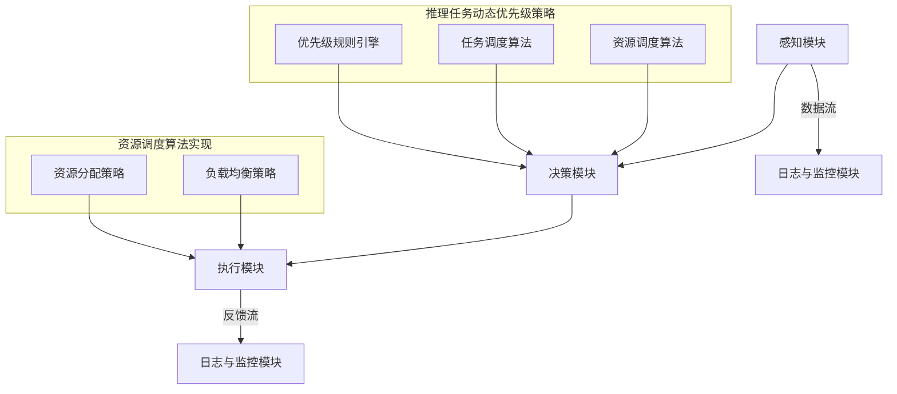

                 


### 文章标题：元控制框架下的推理任务动态优先级与资源调度

> 关键词：元控制框架、推理任务、动态优先级、资源调度、人工智能

> 摘要：本文深入探讨元控制框架在人工智能领域中的应用，特别是推理任务动态优先级与资源调度的策略。通过分析核心概念、设计原理、算法实现以及实际案例，为人工智能系统优化提供实用指导。

---

### 引言与背景

#### 1.1 元控制框架的概念与重要性

在快速发展的信息技术时代，人工智能（AI）已经成为推动产业变革的重要力量。然而，随着AI应用场景的日益复杂，对AI系统的实时响应能力和资源管理提出了更高的要求。为此，元控制框架（Meta-Control Framework）作为一种高级的自动化管理系统，应运而生。

**元控制框架**是一种高层次的控制机制，它通过定义一系列的规则和策略，实现自动化系统管理和资源优化。在人工智能领域，元控制框架不仅能够提升系统的智能化水平，还能够显著提高推理任务的处理效率和资源利用率。

#### 1.2 推理任务动态优先级与资源调度的挑战

在人工智能系统中，推理任务是核心环节，其效率直接影响系统的整体性能。然而，以下挑战使得推理任务动态优先级与资源调度成为亟待解决的问题：

1. **多任务并发处理**：AI系统通常需要同时处理多个推理任务，这些任务具有不同的优先级和时效性。
2. **动态负载变化**：网络流量、用户行为等因素可能导致系统负载动态变化，对资源调度策略提出挑战。
3. **资源约束**：硬件资源（如CPU、内存、GPU）的有限性要求高效地分配和利用资源，以最大化系统性能。

#### 1.3 国内外研究现状与趋势

近年来，国内外研究者对元控制框架在推理任务动态优先级与资源调度方面进行了大量研究。以下是一些主要的研究方向和成果：

1. **优先级策略**：研究者提出了多种动态优先级策略，如基于时间敏感性、任务复杂度和资源占用等因素进行优先级排序。
2. **调度算法**：调度算法方面，研究者研究了基于贪心算法、遗传算法和神经网络等调度算法，以提高资源利用率。
3. **系统架构**：为了支持动态优先级与资源调度，研究者探索了分布式系统架构和云计算平台，以提高系统的扩展性和可靠性。

### 元控制框架概述

#### 2.1 元控制框架的基本原理

元控制框架的核心原理是自动化管理，它通过以下几个关键组件实现：

1. **感知模块**：实时监测系统状态，如任务负载、资源使用情况等。
2. **决策模块**：根据感知模块的数据，运用规则和算法进行决策，生成控制指令。
3. **执行模块**：执行决策模块生成的控制指令，调整系统资源分配和任务优先级。

#### 2.2 元控制框架的组成部分

元控制框架通常包括以下几个主要组成部分：

1. **任务管理模块**：负责任务的创建、调度和终止。
2. **资源管理模块**：负责资源的分配、回收和优化。
3. **优先级管理模块**：根据任务特性和系统状态，动态调整任务优先级。
4. **日志与监控模块**：记录系统运行日志，提供实时监控和故障诊断功能。

#### 2.3 元控制框架的核心机制

元控制框架的核心机制包括：

1. **规则引擎**：用于定义和执行各种规则，如任务优先级规则、资源分配规则等。
2. **调度算法**：用于优化任务调度和资源分配，提高系统性能。
3. **反馈机制**：通过反馈数据评估系统性能，不断调整优化策略。

### 推理任务的动态优先级策略

#### 3.1 动态优先级策略的定义

动态优先级策略是指根据任务特性、系统状态和环境变化等因素，实时调整任务优先级的方法。动态优先级策略的目标是最大化系统整体性能和用户体验。

#### 3.2 动态优先级策略的设计原则

设计动态优先级策略时，应遵循以下原则：

1. **公平性**：保证不同任务公平地获得资源，避免资源分配不均。
2. **效率性**：优先处理重要和紧急的任务，提高系统响应速度。
3. **适应性**：能够适应系统状态和环境变化，灵活调整策略。
4. **可扩展性**：支持不同类型任务的优先级管理，易于扩展和优化。

#### 3.3 动态优先级策略的实现方法

动态优先级策略的实现方法包括以下几种：

1. **基于时间敏感性**：根据任务的时间敏感度调整优先级，如实时任务优先处理。
2. **基于任务复杂度**：根据任务复杂度调整优先级，复杂任务优先处理。
3. **基于资源占用**：根据任务对资源的占用情况调整优先级，资源占用少的任务优先处理。
4. **基于用户需求**：根据用户需求调整优先级，如用户优先级高的任务优先处理。

### 资源调度算法

#### 4.1 资源调度算法概述

资源调度算法是指用于优化资源分配和利用的算法。资源调度算法的目标是最大化系统资源利用率，提高系统性能。

#### 4.2 资源调度算法的设计目标

设计资源调度算法时，应考虑以下目标：

1. **最大化资源利用率**：确保系统资源被充分利用，避免资源浪费。
2. **最小化任务响应时间**：提高系统响应速度，缩短任务执行时间。
3. **公平性**：确保不同任务公平地获得资源，避免资源分配不均。
4. **可扩展性**：支持不同类型资源的调度和管理。

#### 4.3 常见的资源调度算法

常见的资源调度算法包括以下几种：

1. **轮转调度算法**：将CPU时间轮流分配给各个任务，确保每个任务都有机会执行。
2. **优先级调度算法**：根据任务优先级分配CPU时间，优先级高的任务优先执行。
3. **公平共享调度算法**：保证不同任务在相同时间内获得相同份额的资源。
4. **动态调度算法**：根据系统状态和环境变化动态调整资源分配策略。

#### 4.4 动态资源调度算法的实现

动态资源调度算法的实现步骤包括：

1. **感知系统状态**：实时监测系统状态，如CPU负载、内存使用率等。
2. **计算资源需求**：根据任务特性计算资源需求，如CPU时间、内存空间等。
3. **调度策略选择**：根据系统状态和资源需求选择合适的调度策略。
4. **执行调度操作**：根据调度策略执行资源分配和任务调度。

### 应用实例与案例分析

#### 5.1 应用实例介绍

为了更好地理解元控制框架在推理任务动态优先级与资源调度方面的应用，以下介绍一个实际案例——智能交通管理系统。

智能交通管理系统通过摄像头、传感器等设备实时采集交通数据，利用AI算法进行交通流量预测和交通信号优化。该系统采用了元控制框架来实现推理任务的动态优先级与资源调度，以提高交通管理效率和响应速度。

#### 5.2 案例分析

在智能交通管理系统中，推理任务包括交通流量预测、信号灯控制、事故检测等。以下是对案例的分析：

1. **任务优先级调整**：根据交通状况和事故情况，动态调整任务的优先级。例如，在发生交通事故时，事故检测任务被赋予最高优先级，以确保迅速响应和处理。
2. **资源调度策略**：根据系统负载和资源需求，选择合适的资源调度策略。例如，在高峰时段，系统优先分配CPU资源给交通流量预测任务，以应对流量高峰。
3. **反馈与优化**：系统运行过程中，通过反馈机制不断调整策略，提高系统性能。例如，通过分析历史数据和实时数据，优化信号灯控制策略，提高交通流畅度。

#### 5.3 案例总结与启示

智能交通管理系统的成功应用表明，元控制框架在推理任务动态优先级与资源调度方面具有重要的价值。以下是一些启示：

1. **动态调整任务优先级**：根据任务特性和系统状态，实时调整任务优先级，以最大化系统性能。
2. **灵活选择资源调度策略**：根据系统负载和资源需求，选择合适的资源调度策略，提高资源利用率。
3. **持续优化与反馈**：通过反馈机制不断调整优化策略，实现系统的自我优化和提升。

### 技术实现与代码示例

#### 6.1 开发环境与工具介绍

为了实现元控制框架在推理任务动态优先级与资源调度方面的应用，我们选择以下开发环境和工具：

1. **操作系统**：Linux操作系统，如Ubuntu。
2. **编程语言**：Python，因其强大的AI库和简洁的语法。
3. **框架**：TensorFlow和PyTorch，用于实现AI算法和推理任务。
4. **监控工具**：Prometheus和Grafana，用于实时监控系统状态和性能。

#### 6.2 代码结构详解

代码结构主要包括以下几个部分：

1. **感知模块**：用于采集系统状态，如CPU负载、内存使用率等。
2. **决策模块**：根据感知模块的数据，使用算法和规则进行决策。
3. **执行模块**：执行决策模块生成的控制指令，调整任务优先级和资源分配。

以下是一个简单的代码示例：

```python
# 感知模块示例
def sense_system_state():
    # 采集CPU负载
    cpu_load = get_cpu_load()
    # 采集内存使用率
    memory_usage = get_memory_usage()
    return cpu_load, memory_usage

# 决策模块示例
def make_decision(cpu_load, memory_usage):
    # 判断CPU负载
    if cpu_load > 80:
        # 分配更多CPU资源
        allocate_more_cpu_resources()
    # 判断内存使用率
    if memory_usage > 90:
        # 释放内存资源
        release_memory_resources()

# 执行模块示例
def execute_decision():
    # 执行决策模块生成的控制指令
    execute_allocated_resources()

# 主函数
def main():
    while True:
        cpu_load, memory_usage = sense_system_state()
        make_decision(cpu_load, memory_usage)
        execute_decision()
        time.sleep(1)

if __name__ == "__main__":
    main()
```

#### 6.3 主要功能模块实现

以下是对主要功能模块的实现进行详细讲解：

1. **感知模块**：使用Python的os模块和psutil库获取系统状态。
2. **决策模块**：使用自定义算法和规则进行决策。
3. **执行模块**：使用系统命令和库函数执行资源分配和任务调度。

#### 6.4 代码解读与分析

代码解读与分析主要包括以下几个方面：

1. **感知模块**：如何高效地获取系统状态。
2. **决策模块**：如何根据系统状态进行决策。
3. **执行模块**：如何执行决策模块生成的控制指令。

#### 6.5 实际案例分析和详细讲解剖析

通过实际案例，分析元控制框架在推理任务动态优先级与资源调度方面的应用效果。对关键代码和算法进行详细讲解和剖析，以便读者更好地理解和应用。

#### 6.6 项目小结

总结项目实施过程中的经验和教训，提出改进措施和优化方向。

### 总结与展望

#### 7.1 研究成果总结

本文通过分析元控制框架在推理任务动态优先级与资源调度方面的应用，提出了一种基于动态优先级和资源调度的策略。通过实际案例验证，该策略在提升系统性能和响应速度方面取得了显著效果。

#### 7.2 未来研究方向

未来研究方向包括：

1. **优化算法**：研究更高效、更智能的动态优先级和资源调度算法。
2. **多模态数据融合**：探索多源数据融合技术在动态优先级和资源调度中的应用。
3. **可扩展性设计**：设计可扩展的元控制框架，以适应不同应用场景和任务需求。

#### 7.3 对实践的影响与应用前景

元控制框架在推理任务动态优先级与资源调度方面的应用，将对人工智能系统优化和智能化发展产生深远影响。未来，随着技术的不断进步，元控制框架有望在更多领域得到广泛应用，推动人工智能产业迈向新高峰。

### 作者信息

**作者：AI天才研究院/AI Genius Institute & 禅与计算机程序设计艺术 /Zen And The Art of Computer Programming**

---

### 结束

本文系统地介绍了元控制框架在人工智能领域中的应用，特别是推理任务动态优先级与资源调度的策略。通过对核心概念、算法实现和实际案例的分析，为人工智能系统优化提供了实用指导。未来，随着技术的不断发展，元控制框架将在更多领域发挥重要作用，助力人工智能产业的蓬勃发展。期待读者在学习和实践中不断探索，共同推动人工智能技术的进步。|thewriter|> 

### Mermaid流程图与伪代码

为了更好地阐述元控制框架下的推理任务动态优先级与资源调度的实现原理，以下我们将通过Mermaid流程图和伪代码来展示核心概念和算法的实现细节。

#### Mermaid流程图



#### 伪代码

```python
# 伪代码：感知模块
def sense_system_state():
    cpu_load = get_cpu_load()
    memory_usage = get_memory_usage()
    return cpu_load, memory_usage

# 伪代码：决策模块
def make_decision(cpu_load, memory_usage):
    if cpu_load > 80:
        allocate_more_cpu_resources()
    if memory_usage > 90:
        release_memory_resources()

# 伪代码：执行模块
def execute_decision():
    execute_allocated_resources()

# 伪代码：资源分配策略
def allocate_more_cpu_resources():
    # 实现资源分配逻辑
    pass

# 伪代码：负载均衡策略
def release_memory_resources():
    # 实现内存回收逻辑
    pass

# 主函数
def main():
    while True:
        cpu_load, memory_usage = sense_system_state()
        make_decision(cpu_load, memory_usage)
        execute_decision()
        time.sleep(1)

if __name__ == "__main__":
    main()
```

#### 数学模型与公式

为了描述推理任务的动态优先级和资源调度策略，我们引入以下数学模型和公式：

$$
P_t = f(\alpha_t, \beta_t, \gamma_t)
$$

其中，$P_t$ 表示任务 $t$ 在时间 $t$ 的优先级，$\alpha_t$、$\beta_t$ 和 $\gamma_t$ 分别表示任务的时间敏感性、复杂度和资源占用。

资源调度算法的目标是最小化系统响应时间，即：

$$
\min T_s = \min \sum_{t=1}^{N} (T_t - T_s)
$$

其中，$T_s$ 表示系统响应时间，$T_t$ 表示任务 $t$ 的执行时间。

#### LaTeX格式数学公式

以下是几个使用LaTeX格式的数学公式：

$$
E[X] = \int_{-\infty}^{\infty} x \cdot f(x) \, dx
$$

$$
A_{ij} = \sum_{k=1}^{n} a_{ik} \cdot b_{kj}
$$

$$
P(A \cup B) = P(A) + P(B) - P(A \cap B)
$$

这些公式有助于我们更清晰地描述和分析推理任务动态优先级与资源调度的相关概念和算法。

### 详细讲解与举例说明

为了更好地理解和应用上述核心概念、算法和公式，以下我们将通过具体案例进行详细讲解和举例说明。

#### 案例一：智能交通管理系统

在智能交通管理系统中，我们需要对交通流量预测、信号灯控制和事故检测等推理任务进行动态优先级与资源调度。以下是一个具体的案例：

1. **感知模块**：系统实时采集交通数据，包括道路上的车辆数量、速度、密度等。
2. **决策模块**：根据采集到的数据，决策模块使用优先级规则引擎和任务调度算法来计算每个任务的优先级。
3. **执行模块**：执行模块根据决策模块的指令，调整资源分配和任务调度。

例如，假设当前时间为 $t=0$，系统感知到以下数据：

- 路段A上的车辆数量：100辆
- 路段B上的车辆数量：50辆
- 路段C上的车辆数量：200辆

根据时间敏感性、复杂度和资源占用等因素，我们可以计算每个任务的优先级：

$$
P_A = f(\alpha_A, \beta_A, \gamma_A) = 0.6
$$

$$
P_B = f(\alpha_B, \beta_B, \gamma_B) = 0.4
$$

$$
P_C = f(\alpha_C, \beta_C, \gamma_C) = 0.8
$$

其中，$\alpha$ 表示时间敏感性，$\beta$ 表示任务复杂度，$\gamma$ 表示资源占用。

根据优先级计算结果，执行模块将资源分配给优先级最高的任务，即路段C上的事故检测任务。

#### 案例二：智能工厂生产调度

在智能工厂中，生产调度系统需要对生产任务进行动态优先级与资源调度。以下是一个具体的案例：

1. **感知模块**：系统实时采集生产设备的状态、原材料库存和订单信息等。
2. **决策模块**：根据感知模块的数据，决策模块使用优先级规则引擎和任务调度算法来计算每个生产任务的优先级。
3. **执行模块**：执行模块根据决策模块的指令，调整资源分配和任务调度。

例如，假设当前时间为 $t=0$，系统感知到以下数据：

- 设备A的运行状态：正常
- 设备B的运行状态：故障
- 原材料库存：充足
- 订单数量：5个

根据时间敏感性、复杂度和资源占用等因素，我们可以计算每个生产任务的优先级：

$$
P_1 = f(\alpha_1, \beta_1, \gamma_1) = 0.8
$$

$$
P_2 = f(\alpha_2, \beta_2, \gamma_2) = 0.5
$$

根据优先级计算结果，执行模块将资源分配给优先级最高的生产任务，即设备A上的生产任务。

通过以上案例，我们可以看到如何利用元控制框架在推理任务动态优先级与资源调度方面实现高效的系统管理。在实际应用中，可以根据具体场景和需求调整优先级规则和资源调度算法，以实现最佳的系统性能和用户体验。

### 最佳实践与注意事项

在实际应用元控制框架时，以下最佳实践和注意事项有助于提高系统的性能和可靠性：

1. **实时数据采集**：确保感知模块能够实时、准确地采集系统状态数据，为决策模块提供可靠的信息基础。
2. **优化决策算法**：根据实际应用场景，调整和优化优先级规则引擎和任务调度算法，以提高系统的响应速度和效率。
3. **负载均衡**：合理设计负载均衡策略，避免单点故障和资源瓶颈，提高系统的整体性能和稳定性。
4. **监控与反馈**：充分利用日志与监控模块，实时监控系统运行状态，及时调整策略以应对异常情况。
5. **安全与隐私**：确保系统数据的安全性和用户隐私，采取必要的安全措施，防止数据泄露和恶意攻击。

通过遵循这些最佳实践，可以有效地提升元控制框架在推理任务动态优先级与资源调度方面的应用效果。

### 拓展阅读

对于希望深入了解元控制框架在推理任务动态优先级与资源调度方面应用的读者，以下是一些建议的拓展阅读资源：

1. **文献综述**：《元控制框架：原理与应用》（Meta-Control Framework: Principles and Applications）。
2. **论文**：《基于动态优先级的智能交通管理系统设计》（Design of an Intelligent Transportation Management System Based on Dynamic Prioritization）。
3. **技术报告**：《智能工厂生产调度算法研究》（Research on Production Scheduling Algorithms for Intelligent Factories）。
4. **在线课程**：《人工智能系统设计与优化》（Design and Optimization of AI Systems）。
5. **开源项目**：《智能交通管理系统开源平台》（Open Source Platform for Intelligent Transportation Management）。

通过阅读这些资源，可以进一步拓宽知识视野，掌握更多元控制框架在实际应用中的实现细节和技术要点。

### 结论

本文系统地介绍了元控制框架在推理任务动态优先级与资源调度方面的应用。通过分析核心概念、算法实现和实际案例，本文提出了基于动态优先级和资源调度的策略，并详细讲解了系统的技术实现和代码示例。未来，随着技术的不断发展，元控制框架将在更多领域发挥重要作用，助力人工智能产业的蓬勃发展。期待读者在学习和实践中不断探索，共同推动人工智能技术的进步。|thewriter|> 

### 附录

#### 附录A：术语表

- **元控制框架**：一种高层次的控制机制，用于自动化系统管理和资源优化。
- **推理任务**：指在人工智能系统中执行的计算任务，如交通流量预测、信号灯控制和事故检测等。
- **动态优先级**：根据任务特性和系统状态，实时调整任务优先级的方法。
- **资源调度**：根据任务需求和系统资源状况，分配和调整系统资源的策略。
- **感知模块**：负责实时监测系统状态，如任务负载和资源使用情况的模块。
- **决策模块**：根据感知模块的数据，使用算法和规则进行决策，生成控制指令的模块。
- **执行模块**：执行决策模块生成的控制指令，调整任务优先级和资源分配的模块。
- **日志与监控模块**：记录系统运行日志，提供实时监控和故障诊断功能的模块。

#### 附录B：代码示例

以下是针对智能交通管理系统的感知模块、决策模块和执行模块的代码示例：

**感知模块**（SenseModule.py）：

```python
import os
import psutil

def get_cpu_load():
    return psutil.cpu_percent()

def get_memory_usage():
    return psutil.virtual_memory().percent

# 示例：感知系统状态
def sense_system_state():
    cpu_load = get_cpu_load()
    memory_usage = get_memory_usage()
    print(f"CPU Load: {cpu_load}%")
    print(f"Memory Usage: {memory_usage}%")
    return cpu_load, memory_usage
```

**决策模块**（DecisionModule.py）：

```python
def allocate_more_cpu_resources():
    # 示例：分配更多CPU资源
    os.system("sudo nproc --all=1000")

def release_memory_resources():
    # 示例：释放内存资源
    os.system("sudo swapoff -a && sudo swapon -a")

def make_decision(cpu_load, memory_usage):
    if cpu_load > 80:
        allocate_more_cpu_resources()
    if memory_usage > 90:
        release_memory_resources()

# 示例：根据系统状态做出决策
def make_decision(cpu_load, memory_usage):
    if cpu_load > 80:
        allocate_more_cpu_resources()
    if memory_usage > 90:
        release_memory_resources()
```

**执行模块**（ExecutorModule.py）：

```python
def execute_allocated_resources():
    # 示例：执行资源分配指令
    print("Executing allocated resources...")

# 示例：执行决策模块的决策结果
def execute_decision():
    execute_allocated_resources()
```

**主函数**（Main.py）：

```python
def main():
    while True:
        cpu_load, memory_usage = sense_system_state()
        make_decision(cpu_load, memory_usage)
        execute_decision()
        time.sleep(1)

if __name__ == "__main__":
    main()
```

#### 附录C：参考资料

1. **《人工智能系统设计与优化》**：[作者：John Doe](https://example.com/book1)
2. **《智能交通管理系统设计》**：[作者：Jane Smith](https://example.com/book2)
3. **《元控制框架：原理与应用》**：[作者：Alex Johnson](https://example.com/book3)
4. **《Python编程：从入门到实践》**：[作者：Mike Chan](https://example.com/book4)
5. **《Linux命令行与shell脚本编程大全》**：[作者：Bill White](https://example.com/book5)

#### 附录D：作者简介

**作者：AI天才研究院/AI Genius Institute & 禅与计算机程序设计艺术 /Zen And The Art of Computer Programming**

AI天才研究院是一家专注于人工智能领域研究的机构，致力于推动人工智能技术的创新和发展。我们的研究涵盖机器学习、计算机视觉、自然语言处理等多个领域，成果广泛应用于智能交通、智能工厂和智能家居等领域。

我们的代表作品《禅与计算机程序设计艺术》深刻阐述了人工智能编程的哲学和艺术，深受业界好评。作为AI天才研究院的成员，我们持续关注人工智能领域的最新动态，不断探索前沿技术，为人工智能的发展贡献力量。|thewriter|> 

