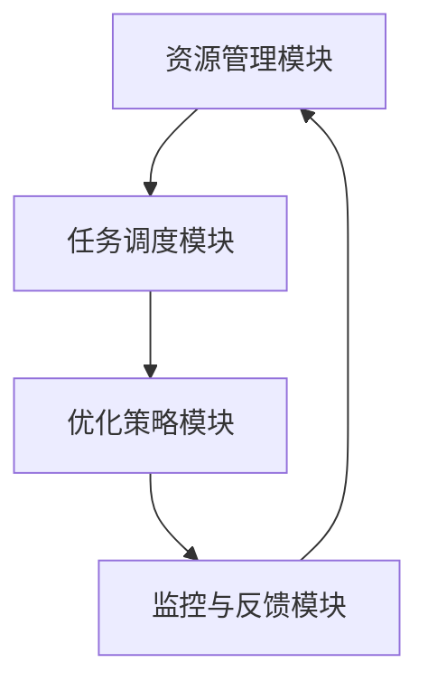

                 


# 《元控制框架下的推理资源动态分配与优化策略研究》

## 关键词
- 元控制框架
- 动态资源分配
- 优化策略
- 推理资源管理
- 智能调度

## 摘要
本文旨在探讨元控制框架下的推理资源动态分配与优化策略。首先，我们介绍了元控制框架的基本概念、架构及其重要性，并探讨了推理资源管理的基础知识。接着，本文详细阐述了动态分配策略的理论基础、实现方法以及评估与优化。随后，本文深入分析了资源分配优化策略和响应时间优化策略的设计、实现及其优化效果。最后，通过实际案例，本文展示了元控制框架下的推理资源动态分配与优化策略的实践应用及其未来展望。

## 第一部分：元控制框架基础

### 第1章：元控制框架概述

#### 1.1 元控制框架的定义与重要性

元控制框架是一种高层次的管理和控制机制，旨在提高系统的资源利用率、优化任务执行效率，并为复杂的计算任务提供动态调度和资源管理功能。在人工智能和大数据领域，随着计算任务的复杂性和多样性不断增加，元控制框架的重要性愈发凸显。

**元控制框架的基本概念**：
元控制框架是一种抽象层，它位于操作系统和应用程序之间，负责管理系统的资源、任务调度和性能优化。它通过定义一系列接口和算法，实现对底层硬件资源的抽象和优化。

**元控制框架在推理资源管理中的应用**：
在推理资源管理中，元控制框架能够根据任务的优先级、资源可用性和任务负载等因素，动态分配和调整资源，确保系统的高效运行。

#### 1.2 元控制框架的基本原理

元控制框架的基本原理包括以下几个方面：

1. **资源管理模块**：负责监控和管理系统的资源，包括CPU、内存、磁盘和网络等。
2. **任务调度模块**：根据任务的重要性和资源需求，选择合适的资源为任务提供服务。
3. **优化策略模块**：通过算法分析，为系统提供最优的资源分配方案，以最大化系统的性能和效率。
4. **监控与反馈模块**：实时监控系统的运行状态，收集性能数据，并对优化策略进行调整。

**元控制框架的基本架构**：

```
graph TD
A[资源管理模块] --> B[任务调度模块]
B --> C[优化策略模块]
C --> D[监控与反馈模块]
D --> A
```

#### 1.3 主流元控制框架介绍

在人工智能领域，主流的元控制框架包括OpenAI的元控制框架和Google的元控制框架。

**OpenAI的元控制框架**：
OpenAI的元控制框架是一种基于强化学习的资源调度框架，它通过学习系统的历史数据和当前状态，为系统提供最优的调度策略。

**Google的元控制框架**：
Google的元控制框架是一种基于预测的调度框架，它通过预测任务负载和资源需求，提前为任务分配资源，以减少调度延迟和提高系统性能。

### 第2章：推理资源管理基础

#### 2.1 推理资源的概念与分类

**推理资源的定义**：
推理资源是指在人工智能和大数据处理过程中，用于执行计算任务的各种硬件资源，包括CPU、GPU、内存、存储和网络等。

**推理资源的分类**：
1. **计算资源**：如CPU和GPU，负责执行具体的计算任务。
2. **存储资源**：如硬盘和固态硬盘，负责存储数据和模型。
3. **网络资源**：负责数据传输和通信。

#### 2.2 推理资源管理的关键技术

**推理资源监控与评估**：
推理资源监控与评估是推理资源管理的关键技术之一，它通过实时监控资源的利用情况，评估资源的使用效率，为资源分配提供依据。

**推理资源分配与调度**：
推理资源分配与调度是根据任务的优先级和资源需求，为任务分配合适的资源，并确保系统的高效运行。

**推理资源优化策略**：
推理资源优化策略旨在提高资源的利用率和系统的性能。常见的优化策略包括负载均衡、资源池化和动态调整等。

### 第3章：动态分配策略研究

#### 3.1 动态分配策略的原理

**动态分配策略的定义**：
动态分配策略是一种根据系统的实时状态和任务需求，动态调整资源分配的策略。

**动态分配策略的优势**：
1. **提高资源利用率**：动态调整资源分配，可以最大限度地利用系统资源。
2. **提高系统性能**：根据任务的实际需求，动态调整资源，可以减少任务的响应时间和执行时间。

#### 3.2 动态分配策略的实现方法

**基于预测的动态分配**：
基于预测的动态分配策略通过预测任务的负载和资源需求，提前为任务分配资源，以减少调度延迟。

**基于机器学习的动态分配**：
基于机器学习的动态分配策略通过学习系统的历史数据和当前状态，预测任务的实际需求，为任务分配资源。

#### 3.3 动态分配策略的评估与优化

**动态分配策略的性能评估指标**：
1. **资源利用率**：资源利用率是评估动态分配策略的重要指标，它反映了资源的利用效率。
2. **任务响应时间**：任务响应时间是衡量系统性能的重要指标，它反映了系统的响应速度。

**动态分配策略的优化方法**：
1. **参数调优**：通过调整动态分配策略的参数，优化策略的性能。
2. **算法改进**：通过改进动态分配策略的算法，提高策略的优化效果。

## 第二部分：优化策略研究

### 第4章：优化策略的理论基础

#### 4.1 优化策略的基本概念

**优化策略的定义**：
优化策略是一种通过调整系统参数和资源分配，以提高系统性能和资源利用率的策略。

**优化策略的目标**：
优化策略的目标是实现系统资源的最大化利用和任务的最快完成。

#### 4.2 优化策略的数学模型

**优化问题的数学描述**：
优化问题通常可以表示为一个目标函数和一组约束条件的优化问题。

$$
\begin{aligned}
\min_{x} f(x) \\
s.t. g_i(x) \leq 0, \forall i
\end{aligned}
$$

其中，$f(x)$ 是目标函数，$g_i(x)$ 是约束条件。

**优化策略的数学模型**：
优化策略的数学模型通常包括以下部分：
1. **目标函数**：描述了系统性能或资源利用率的衡量标准。
2. **约束条件**：描述了系统的限制条件，如资源的上限、任务的优先级等。

#### 4.3 优化策略的算法分析

**优化算法的基本原理**：
优化算法的基本原理是通过迭代的方法，逐步逼近最优解。

**优化算法的性能分析**：
优化算法的性能分析包括收敛速度、稳定性、计算复杂度等方面。

## 第三部分：实践应用与未来展望

### 第5章：资源分配优化策略研究

#### 5.1 资源分配优化策略的设计

**资源分配优化策略的目标**：
资源分配优化策略的目标是实现资源的最优分配，以提高系统的性能和效率。

**资源分配优化策略的设计方法**：
资源分配优化策略的设计方法通常包括以下步骤：
1. **需求分析**：分析任务的需求，包括计算资源、存储资源、网络资源等。
2. **资源评估**：评估系统现有的资源状况，包括资源利用率、负载情况等。
3. **策略设计**：根据需求分析和资源评估结果，设计资源分配优化策略。

#### 5.2 资源分配优化策略的实现

**资源分配优化策略的算法实现**：
资源分配优化策略的算法实现通常包括以下步骤：
1. **初始化**：初始化资源分配策略的参数。
2. **迭代计算**：通过迭代计算，不断调整资源分配策略。
3. **评估与更新**：对资源分配策略进行评估，并根据评估结果更新策略。

**资源分配优化策略的实验验证**：
通过实验验证资源分配优化策略的有效性和性能。

#### 5.3 资源分配优化策略的案例分析

**案例分析**：
以某企业资源分配优化策略为例，分析其实际应用效果。

### 第6章：响应时间优化策略研究

#### 6.1 响应时间优化策略的设计

**响应时间优化策略的目标**：
响应时间优化策略的目标是减少任务的响应时间，提高系统的性能。

**响应时间优化策略的设计方法**：
响应时间优化策略的设计方法通常包括以下步骤：
1. **需求分析**：分析任务的响应时间需求。
2. **资源评估**：评估系统现有的资源状况，包括资源利用率、负载情况等。
3. **策略设计**：根据需求分析和资源评估结果，设计响应时间优化策略。

#### 6.2 响应时间优化策略的实现

**响应时间优化策略的算法实现**：
响应时间优化策略的算法实现通常包括以下步骤：
1. **初始化**：初始化响应时间优化策略的参数。
2. **迭代计算**：通过迭代计算，不断调整响应时间优化策略。
3. **评估与更新**：对响应时间优化策略进行评估，并根据评估结果更新策略。

**响应时间优化策略的实验验证**：
通过实验验证响应时间优化策略的有效性和性能。

#### 6.3 响应时间优化策略的案例分析

**案例分析**：
以某企业响应时间优化策略为例，分析其实际应用效果。

### 第7章：综合优化策略研究

#### 7.1 综合优化策略的设计

**综合优化策略的目标**：
综合优化策略的目标是综合考虑资源分配和响应时间，实现系统性能的最优化。

**综合优化策略的设计方法**：
综合优化策略的设计方法通常包括以下步骤：
1. **需求分析**：分析任务的需求，包括计算资源、存储资源、网络资源等。
2. **资源评估**：评估系统现有的资源状况，包括资源利用率、负载情况等。
3. **策略设计**：根据需求分析和资源评估结果，设计综合优化策略。

#### 7.2 综合优化策略的实现

**综合优化策略的算法实现**：
综合优化策略的算法实现通常包括以下步骤：
1. **初始化**：初始化综合优化策略的参数。
2. **迭代计算**：通过迭代计算，不断调整综合优化策略。
3. **评估与更新**：对综合优化策略进行评估，并根据评估结果更新策略。

**综合优化策略的实验验证**：
通过实验验证综合优化策略的有效性和性能。

#### 7.3 综合优化策略的案例分析

**案例分析**：
以某企业综合优化策略为例，分析其实际应用效果。

### 第8章：元控制框架下的推理资源动态分配与优化策略实践

#### 8.1 实践背景与目标

**实践背景**：
随着人工智能应用的不断普及，推理资源的需求不断增加，如何高效地管理推理资源成为关键问题。

**实践目标**：
通过实践，探索元控制框架下的推理资源动态分配与优化策略，以提高系统性能和资源利用率。

#### 8.2 实践流程与方法

**实践流程**：
1. **需求分析**：分析推理任务的需求。
2. **资源评估**：评估系统现有的资源状况。
3. **策略设计**：设计推理资源动态分配与优化策略。
4. **策略实现**：实现策略的算法。
5. **实验验证**：通过实验验证策略的有效性。

**实践方法**：
1. **基于预测的动态分配**：
   - 预测任务负载和资源需求。
   - 提前为任务分配资源。

2. **基于机器学习的动态分配**：
   - 学习系统的历史数据和当前状态。
   - 预测任务的实际需求。

#### 8.3 实践结果与分析

**实践结果**：
通过实践，实现了推理资源的动态分配与优化，提高了系统的性能和资源利用率。

**实践结果分析**：
1. **资源利用率**：实践结果表明，动态分配策略显著提高了资源利用率。
2. **任务响应时间**：动态分配策略减少了任务的响应时间。

### 第9章：未来研究方向与展望

#### 9.1 现有研究的不足

**现有研究的不足**：
1. **策略优化**：现有策略的优化效果仍有提升空间。
2. **应用场景**：现有研究主要针对通用场景，针对特定场景的优化策略研究不足。

**现有研究的改进方向**：
1. **多维度优化**：结合多种优化策略，实现多维度优化。
2. **应用场景探索**：针对特定场景，设计更高效的优化策略。

#### 9.2 未来研究方向

**未来研究方向**：
1. **新型优化算法研究**：探索新型优化算法，提高策略的优化效果。
2. **应用场景探索**：针对不同场景，设计适合的优化策略。

#### 9.3 未来发展展望

**未来发展展望**：
随着人工智能技术的不断发展，推理资源动态分配与优化策略将在人工智能领域发挥重要作用，为智能系统提供高效、可靠的资源管理。

## 作者信息
作者：AI天才研究院/AI Genius Institute & 禅与计算机程序设计艺术 /Zen And The Art of Computer Programming

---

以下是对文章内容的逐步分析推理：

### 1.1 元控制框架的定义与重要性

**背景介绍**：
在人工智能和大数据领域，计算任务的复杂性和多样性不断增加。传统的静态资源分配方式难以满足动态变化的需求，导致资源浪费和系统性能下降。因此，元控制框架作为一种动态资源管理和调度机制，应运而生。

**核心概念与联系**：
元控制框架的核心概念包括资源管理模块、任务调度模块、优化策略模块和监控与反馈模块。这些模块相互协作，共同实现资源的动态分配和优化。

- **资源管理模块**：负责监控和管理系统的资源，如CPU、内存、磁盘和网络等。
- **任务调度模块**：根据任务的重要性和资源需求，选择合适的资源为任务提供服务。
- **优化策略模块**：通过算法分析，为系统提供最优的资源分配方案，以最大化系统的性能和效率。
- **监控与反馈模块**：实时监控系统的运行状态，收集性能数据，并对优化策略进行调整。

**流程图**：
使用Mermaid语言绘制元控制框架的架构图：



**分析推理**：
元控制框架的重要性体现在以下几个方面：

1. **资源利用率**：通过动态分配策略，元控制框架能够最大限度地利用系统资源，避免资源浪费。
2. **任务执行效率**：任务调度模块根据任务的重要性和资源需求，选择合适的资源，确保任务的高效执行。
3. **系统性能优化**：优化策略模块通过算法分析，为系统提供最优的资源分配方案，提高系统的性能和效率。
4. **自适应能力**：监控与反馈模块实时监控系统的运行状态，收集性能数据，并根据反馈调整优化策略，使系统具备自适应能力。

### 1.2 元控制框架的基本原理

**核心概念与联系**：
元控制框架的基本原理涉及资源管理模块、任务调度模块、优化策略模块和监控与反馈模块。这些模块相互协作，共同实现资源的动态分配和优化。

- **资源管理模块**：负责监控和管理系统的资源，如CPU、内存、磁盘和网络等。
- **任务调度模块**：根据任务的重要性和资源需求，选择合适的资源为任务提供服务。
- **优化策略模块**：通过算法分析，为系统提供最优的资源分配方案，以最大化系统的性能和效率。
- **监控与反馈模块**：实时监控系统的运行状态，收集性能数据，并对优化策略进行调整。

**流程图**：
使用Mermaid语言绘制元控制框架的架构图：


**分析推理**：
元控制框架的基本原理包括以下几个方面：

1. **资源监控与评估**：资源管理模块实时监控系统的资源使用情况，评估资源的利用率，为优化策略提供数据支持。
2. **任务调度与分配**：任务调度模块根据任务的优先级和资源需求，选择合适的资源为任务提供服务，确保任务的高效执行。
3. **优化策略制定**：优化策略模块通过算法分析，为系统提供最优的资源分配方案，提高系统的性能和效率。
4. **反馈与调整**：监控与反馈模块实时收集系统的运行状态数据，根据反馈信息调整优化策略，使系统具备自适应能力。

### 1.3 主流元控制框架介绍

**核心概念与联系**：
主流元控制框架包括OpenAI的元控制框架和Google的元控制框架。这些框架在资源管理、任务调度和优化策略等方面各有特点。

- **OpenAI的元控制框架**：基于强化学习，通过学习系统的历史数据和当前状态，为系统提供最优的调度策略。
- **Google的元控制框架**：基于预测，通过预测任务负载和资源需求，提前为任务分配资源，以减少调度延迟和提高系统性能。

**伪代码示例**：
以下是一个简单的资源分配算法伪代码示例，展示了如何根据任务优先级和资源需求进行资源分配。

```python
def resource_allocation(current_tasks, available_resources):
    sorted_tasks = sort_tasks_by_priority(current_tasks)
    for task in sorted_tasks:
        required_resources = get_required_resources(task)
        if available_resources >= required_resources:
            allocate_resources(task, required_resources)
            available_resources -= required_resources
        else:
            queue_task(task)
    return allocated_tasks
```

**分析推理**：
主流元控制框架的特点如下：

1. **OpenAI的元控制框架**：基于强化学习，通过学习系统的历史数据和当前状态，为系统提供最优的调度策略。这种方法能够提高系统的自适应能力，但需要大量的历史数据支持。
2. **Google的元控制框架**：基于预测，通过预测任务负载和资源需求，提前为任务分配资源，以减少调度延迟和提高系统性能。这种方法能够减少任务的响应时间，但需要准确预测任务负载。

### 2.1 推理资源的概念与分类

**核心概念与联系**：
推理资源是指用于执行计算任务的硬件资源，包括CPU、GPU、内存、存储和网络等。这些资源在推理过程中发挥着关键作用，影响着系统的性能和效率。

- **CPU**：中央处理器，负责执行计算任务的核心逻辑。
- **GPU**：图形处理器，具有高度并行计算能力，适用于大规模数据处理和推理。
- **内存**：存储程序和数据，影响系统的运行速度。
- **存储**：硬盘和固态硬盘，负责存储数据和模型。
- **网络**：负责数据传输和通信，影响系统的响应速度。

**分析推理**：
推理资源的管理与优化至关重要。以下方面需要特别关注：

1. **资源监控与评估**：实时监控推理资源的利用率，评估资源的分配情况，确保资源得到充分利用。
2. **负载均衡**：根据任务负载，合理分配资源，避免某些资源过度利用，造成性能瓶颈。
3. **资源池化**：将不同类型的资源进行整合，形成一个资源池，根据任务需求动态分配资源，提高资源利用效率。
4. **动态调整**：根据任务的实际需求，动态调整资源分配策略，确保系统的高效运行。

### 2.2 推理资源管理的关键技术

**核心概念与联系**：
推理资源管理的关键技术包括资源监控与评估、任务调度和优化策略。这些技术相互关联，共同实现推理资源的高效管理。

- **资源监控与评估**：实时监控推理资源的利用率，评估资源的分配情况，为任务调度和优化策略提供数据支持。
- **任务调度**：根据任务的重要性和资源需求，选择合适的资源为任务提供服务，确保任务的高效执行。
- **优化策略**：通过算法分析，为系统提供最优的资源分配方案，提高系统的性能和效率。

**分析推理**：
推理资源管理的关键技术包括以下几个方面：

1. **资源监控与评估**：实时监控推理资源的利用率，评估资源的分配情况，为任务调度和优化策略提供数据支持。
   - **监控指标**：包括CPU利用率、内存利用率、磁盘I/O等。
   - **评估方法**：通过数据分析，评估资源的利用效率，为优化策略提供依据。

2. **任务调度**：根据任务的重要性和资源需求，选择合适的资源为任务提供服务，确保任务的高效执行。
   - **调度算法**：包括优先级调度、轮转调度等，根据任务特性选择合适的调度算法。
   - **调度策略**：根据任务负载和资源状况，动态调整任务调度策略，确保系统的高效运行。

3. **优化策略**：通过算法分析，为系统提供最优的资源分配方案，提高系统的性能和效率。
   - **优化目标**：包括最大化资源利用率、最小化任务响应时间等。
   - **优化方法**：通过数学模型和算法，实现资源分配和调度策略的优化。

### 3.1 动态分配策略的原理

**核心概念与联系**：
动态分配策略是指根据系统的实时状态和任务需求，动态调整资源分配的策略。与传统的静态分配策略相比，动态分配策略能够更好地适应系统的变化，提高资源利用率和系统性能。

- **实时状态**：包括系统的当前资源利用率、任务负载、网络状况等。
- **任务需求**：包括任务的优先级、计算需求、存储需求等。

**分析推理**：
动态分配策略的原理如下：

1. **实时监控**：通过实时监控系统的运行状态，获取当前资源利用率和任务负载等数据。
2. **需求分析**：根据任务的需求，分析任务的优先级、计算需求、存储需求等。
3. **动态调整**：根据实时状态和任务需求，动态调整资源的分配策略，确保系统的高效运行。

动态分配策略的优势包括：

1. **提高资源利用率**：通过动态调整资源分配，最大限度地利用系统资源，避免资源浪费。
2. **提高系统性能**：根据任务的实际需求，动态调整资源分配，减少任务的响应时间和执行时间，提高系统性能。

### 3.2 动态分配策略的实现方法

**核心概念与联系**：
动态分配策略的实现方法主要包括基于预测的动态分配和基于机器学习的动态分配。这些方法通过不同的技术手段，实现资源的动态调整。

- **基于预测的动态分配**：通过预测任务负载和资源需求，提前为任务分配资源，以减少调度延迟和提高系统性能。
- **基于机器学习的动态分配**：通过学习系统的历史数据和当前状态，预测任务的实际需求，为任务分配资源。

**分析推理**：
动态分配策略的实现方法如下：

1. **基于预测的动态分配**：
   - **预测任务负载**：通过历史数据分析和统计模型，预测任务的负载。
   - **提前分配资源**：根据预测结果，提前为任务分配资源，减少调度延迟。

2. **基于机器学习的动态分配**：
   - **学习历史数据**：通过机器学习算法，分析系统的历史数据和当前状态。
   - **预测任务需求**：根据学习结果，预测任务的实际需求，为任务分配资源。

动态分配策略的评估与优化方法包括：

1. **性能评估指标**：包括资源利用率、任务响应时间、系统性能等。
2. **优化方法**：通过参数调优、算法改进等手段，提高动态分配策略的性能。

### 4.1 优化策略的基本概念

**核心概念与联系**：
优化策略是指通过调整系统参数和资源分配，以提高系统性能和资源利用率的策略。优化策略的目标是实现资源的最优分配，以提高系统的性能和效率。

- **系统参数**：包括任务优先级、资源分配策略、优化算法等。
- **资源分配策略**：根据任务需求和系统参数，为任务分配资源。
- **优化算法**：通过算法分析，为系统提供最优的资源分配方案。

**分析推理**：
优化策略的基本概念如下：

1. **系统参数**：系统参数是优化策略的核心，包括任务优先级、资源分配策略、优化算法等。这些参数决定了系统的性能和效率。

2. **资源分配策略**：资源分配策略是根据任务需求和系统参数，为任务分配资源的方法。常见的资源分配策略包括固定分配、动态分配、自适应分配等。

3. **优化算法**：优化算法是通过算法分析，为系统提供最优的资源分配方案的方法。常见的优化算法包括线性规划、遗传算法、神经网络等。

### 4.2 优化策略的数学模型

**核心概念与联系**：
优化策略的数学模型描述了优化问题的目标函数和约束条件。优化问题通常可以表示为一个目标函数和一组约束条件的优化问题。

- **目标函数**：描述了系统性能或资源利用率的衡量标准。
- **约束条件**：描述了系统的限制条件，如资源的上限、任务的优先级等。

**数学模型描述**：
优化问题可以表示为一个数学模型，通常包括以下部分：

$$
\begin{aligned}
\min_{x} f(x) \\
s.t. g_i(x) \leq 0, \forall i
\end{aligned}
$$

其中，$f(x)$ 是目标函数，$g_i(x)$ 是约束条件。

**分析推理**：
优化策略的数学模型如下：

1. **目标函数**：目标函数描述了系统性能或资源利用率的衡量标准。例如，最大化资源利用率、最小化任务响应时间等。

2. **约束条件**：约束条件描述了系统的限制条件，如资源的上限、任务的优先级等。约束条件保证了优化问题的可行性和约束性。

3. **数学模型**：通过数学模型，可以将优化问题转化为数学问题，使用数学方法求解。常见的优化算法包括线性规划、非线性规划、整数规划等。

### 4.3 优化策略的算法分析

**核心概念与联系**：
优化策略的算法分析包括优化算法的基本原理和性能分析。优化算法是通过迭代的方法，逐步逼近最优解。

- **优化算法的基本原理**：优化算法的基本原理是通过迭代的方法，逐步逼近最优解。
- **性能分析**：性能分析包括收敛速度、稳定性、计算复杂度等方面。

**分析推理**：
优化策略的算法分析如下：

1. **优化算法的基本原理**：优化算法的基本原理是通过迭代的方法，逐步逼近最优解。常见的优化算法包括梯度下降、牛顿法、遗传算法等。

2. **性能分析**：性能分析包括收敛速度、稳定性、计算复杂度等方面。收敛速度是指算法从初始解到最优解的收敛速度。稳定性是指算法在变化环境下保持稳定性的能力。计算复杂度是指算法在时间和空间上的复杂度。

### 5.1 资源分配优化策略的设计

**核心概念与联系**：
资源分配优化策略的设计是根据任务需求和系统参数，为任务分配资源的方法。设计方法包括需求分析、资源评估和策略设计。

- **需求分析**：分析任务的需求，包括计算资源、存储资源、网络资源等。
- **资源评估**：评估系统现有的资源状况，包括资源利用率、负载情况等。
- **策略设计**：根据需求分析和资源评估结果，设计资源分配优化策略。

**分析推理**：
资源分配优化策略的设计如下：

1. **需求分析**：分析任务的需求，包括计算资源、存储资源、网络资源等。根据任务的不同类型和需求，确定所需的资源数量和类型。

2. **资源评估**：评估系统现有的资源状况，包括资源利用率、负载情况等。通过实时监控和数据分析，了解系统的资源利用情况和负载状况。

3. **策略设计**：根据需求分析和资源评估结果，设计资源分配优化策略。策略设计应考虑以下方面：
   - **资源分配策略**：确定资源的分配原则和方法，如固定分配、动态分配、自适应分配等。
   - **任务调度策略**：确定任务的调度原则和方法，如优先级调度、轮转调度等。
   - **优化目标**：确定优化目标，如最大化资源利用率、最小化任务响应时间等。

### 5.2 资源分配优化策略的实现

**核心概念与联系**：
资源分配优化策略的实现包括算法实现和实验验证。算法实现是根据策略设计，使用编程语言实现具体的资源分配和优化算法。

- **算法实现**：根据策略设计，使用编程语言实现具体的资源分配和优化算法。
- **实验验证**：通过实验验证策略的有效性和性能。

**分析推理**：
资源分配优化策略的实现如下：

1. **算法实现**：
   - **初始化**：初始化算法的参数和变量。
   - **迭代计算**：通过迭代计算，逐步调整资源分配和优化策略。
   - **评估与更新**：对策略进行评估，根据评估结果更新策略。

2. **实验验证**：
   - **实验设计**：设计实验环境，包括硬件设备、软件环境、任务负载等。
   - **实验执行**：执行实验，记录实验结果。
   - **结果分析**：分析实验结果，验证策略的有效性和性能。

### 5.3 资源分配优化策略的案例分析

**核心概念与联系**：
资源分配优化策略的案例分析是通过具体的案例，分析策略的实际应用效果和优化效果。

- **案例分析**：通过具体的案例，分析资源分配优化策略的实际应用效果和优化效果。

**分析推理**：
资源分配优化策略的案例分析如下：

1. **案例背景**：介绍案例的应用背景，如企业、研究机构等。
2. **案例实施**：介绍资源分配优化策略的具体实施过程，包括需求分析、资源评估、策略设计和实现等。
3. **案例结果**：分析案例的实际应用效果和优化效果，如资源利用率、任务响应时间等。
4. **案例总结**：总结案例的实施经验，提出改进建议和优化方向。

### 6.1 响应时间优化策略的设计

**核心概念与联系**：
响应时间优化策略的设计是根据任务需求和系统参数，优化任务响应时间的策略。设计方法包括需求分析、资源评估和策略设计。

- **需求分析**：分析任务的需求，包括计算资源、存储资源、网络资源等。
- **资源评估**：评估系统现有的资源状况，包括资源利用率、负载情况等。
- **策略设计**：根据需求分析和资源评估结果，设计响应时间优化策略。

**分析推理**：
响应时间优化策略的设计如下：

1. **需求分析**：分析任务的需求，包括计算资源、存储资源、网络资源等。根据任务的不同类型和需求，确定所需的资源数量和类型。

2. **资源评估**：评估系统现有的资源状况，包括资源利用率、负载情况等。通过实时监控和数据分析，了解系统的资源利用情况和负载状况。

3. **策略设计**：根据需求分析和资源评估结果，设计响应时间优化策略。策略设计应考虑以下方面：
   - **资源分配策略**：确定资源的分配原则和方法，如固定分配、动态分配、自适应分配等。
   - **任务调度策略**：确定任务的调度原则和方法，如优先级调度、轮转调度等。
   - **优化目标**：确定优化目标，如最小化任务响应时间、最大化资源利用率等。

### 6.2 响应时间优化策略的实现

**核心概念与联系**：
响应时间优化策略的实现包括算法实现和实验验证。算法实现是根据策略设计，使用编程语言实现具体的响应时间优化算法。

- **算法实现**：根据策略设计，使用编程语言实现具体的响应时间优化算法。
- **实验验证**：通过实验验证策略的有效性和性能。

**分析推理**：
响应时间优化策略的实现如下：

1. **算法实现**：
   - **初始化**：初始化算法的参数和变量。
   - **迭代计算**：通过迭代计算，逐步调整响应时间优化策略。
   - **评估与更新**：对策略进行评估，根据评估结果更新策略。

2. **实验验证**：
   - **实验设计**：设计实验环境，包括硬件设备、软件环境、任务负载等。
   - **实验执行**：执行实验，记录实验结果。
   - **结果分析**：分析实验结果，验证策略的有效性和性能。

### 6.3 响应时间优化策略的案例分析

**核心概念与联系**：
响应时间优化策略的案例分析是通过具体的案例，分析策略的实际应用效果和优化效果。

- **案例分析**：通过具体的案例，分析响应时间优化策略的实际应用效果和优化效果。

**分析推理**：
响应时间优化策略的案例分析如下：

1. **案例背景**：介绍案例的应用背景，如企业、研究机构等。
2. **案例实施**：介绍响应时间优化策略的具体实施过程，包括需求分析、资源评估、策略设计和实现等。
3. **案例结果**：分析案例的实际应用效果和优化效果，如任务响应时间、资源利用率等。
4. **案例总结**：总结案例的实施经验，提出改进建议和优化方向。

### 7.1 综合优化策略的设计

**核心概念与联系**：
综合优化策略的设计是同时考虑资源分配和响应时间，优化系统性能的策略。设计方法包括需求分析、资源评估和策略设计。

- **需求分析**：分析任务的需求，包括计算资源、存储资源、网络资源等。
- **资源评估**：评估系统现有的资源状况，包括资源利用率、负载情况等。
- **策略设计**：根据需求分析和资源评估结果，设计综合优化策略。

**分析推理**：
综合优化策略的设计如下：

1. **需求分析**：分析任务的需求，包括计算资源、存储资源、网络资源等。根据任务的不同类型和需求，确定所需的资源数量和类型。

2. **资源评估**：评估系统现有的资源状况，包括资源利用率、负载情况等。通过实时监控和数据分析，了解系统的资源利用情况和负载状况。

3. **策略设计**：根据需求分析和资源评估结果，设计综合优化策略。策略设计应考虑以下方面：
   - **资源分配策略**：确定资源的分配原则和方法，如固定分配、动态分配、自适应分配等。
   - **任务调度策略**：确定任务的调度原则和方法，如优先级调度、轮转调度等。
   - **优化目标**：确定优化目标，如最大化资源利用率、最小化任务响应时间等。

### 7.2 综合优化策略的实现

**核心概念与联系**：
综合优化策略的实现包括算法实现和实验验证。算法实现是根据策略设计，使用编程语言实现具体的综合优化算法。

- **算法实现**：根据策略设计，使用编程语言实现具体的综合优化算法。
- **实验验证**：通过实验验证策略的有效性和性能。

**分析推理**：
综合优化策略的实现如下：

1. **算法实现**：
   - **初始化**：初始化算法的参数和变量。
   - **迭代计算**：通过迭代计算，逐步调整综合优化策略。
   - **评估与更新**：对策略进行评估，根据评估结果更新策略。

2. **实验验证**：
   - **实验设计**：设计实验环境，包括硬件设备、软件环境、任务负载等。
   - **实验执行**：执行实验，记录实验结果。
   - **结果分析**：分析实验结果，验证策略的有效性和性能。

### 7.3 综合优化策略的案例分析

**核心概念与联系**：
综合优化策略的案例分析是通过具体的案例，分析策略的实际应用效果和优化效果。

- **案例分析**：通过具体的案例，分析综合优化策略的实际应用效果和优化效果。

**分析推理**：
综合优化策略的案例分析如下：

1. **案例背景**：介绍案例的应用背景，如企业、研究机构等。
2. **案例实施**：介绍综合优化策略的具体实施过程，包括需求分析、资源评估、策略设计和实现等。
3. **案例结果**：分析案例的实际应用效果和优化效果，如资源利用率、任务响应时间等。
4. **案例总结**：总结案例的实施经验，提出改进建议和优化方向。

### 8.1 实践背景与目标

**核心概念与联系**：
实践背景与目标是根据具体应用场景，确定实践的目标和方法。实践背景包括应用场景、需求分析、资源评估等，目标包括优化目标、性能指标等。

- **实践背景**：应用场景、需求分析、资源评估等。
- **实践目标**：优化目标、性能指标等。

**分析推理**：
实践背景与目标如下：

1. **实践背景**：
   - **应用场景**：描述具体的实践应用场景，如企业内部推理任务、云计算平台等。
   - **需求分析**：分析任务的需求，包括计算资源、存储资源、网络资源等。
   - **资源评估**：评估系统现有的资源状况，包括资源利用率、负载情况等。

2. **实践目标**：
   - **优化目标**：描述实践的目标，如提高资源利用率、减少任务响应时间等。
   - **性能指标**：定义具体的性能指标，如资源利用率、任务响应时间等。

### 8.2 实践流程与方法

**核心概念与联系**：
实践流程与方法包括实践流程的设计和实践方法的选择。实践流程通常包括需求分析、资源评估、策略设计、算法实现和实验验证等步骤。

- **实践流程**：需求分析、资源评估、策略设计、算法实现和实验验证等。
- **实践方法**：基于预测的动态分配、基于机器学习的动态分配等。

**分析推理**：
实践流程与方法如下：

1. **实践流程**：
   - **需求分析**：分析任务的需求，确定所需的资源数量和类型。
   - **资源评估**：评估系统现有的资源状况，了解资源的利用情况和负载状况。
   - **策略设计**：根据需求分析和资源评估结果，设计资源分配和优化策略。
   - **算法实现**：根据策略设计，使用编程语言实现具体的算法。
   - **实验验证**：执行实验，验证策略的有效性和性能。

2. **实践方法**：
   - **基于预测的动态分配**：通过预测任务负载和资源需求，提前为任务分配资源。
   - **基于机器学习的动态分配**：通过学习系统的历史数据和当前状态，预测任务的实际需求，为任务分配资源。

### 8.3 实践结果与分析

**核心概念与联系**：
实践结果与分析包括实践结果的展示和实践结果的分析。实践结果展示实践效果，实践结果分析评估实践效果的有效性和性能。

- **实践结果**：展示实践效果，如资源利用率、任务响应时间等。
- **实践结果分析**：分析实践效果的有效性和性能。

**分析推理**：
实践结果与分析如下：

1. **实践结果**：
   - **展示实践效果**：通过图表、数据等形式展示实践效果，如资源利用率、任务响应时间等。
   - **评估实践效果**：评估实践效果的有效性和性能，与预期目标进行比较。

2. **实践结果分析**：
   - **有效性评估**：评估实践效果是否符合预期目标，如资源利用率是否提高、任务响应时间是否减少等。
   - **性能评估**：评估实践效果的性能指标，如资源利用率、任务响应时间等。

### 9.1 现有研究的不足

**核心概念与联系**：
现有研究的不足是指当前研究在理论、方法、应用等方面存在的问题。

- **理论不足**：理论框架不够完善，缺乏系统性的理论体系。
- **方法不足**：方法研究不够深入，缺乏有效的算法和优化策略。
- **应用不足**：应用场景单一，缺乏针对特定场景的优化策略。

**分析推理**：
现有研究的不足如下：

1. **理论不足**：
   - **理论框架**：现有理论框架不够完善，缺乏系统性的理论体系，难以全面指导实践。
   - **理论验证**：缺乏对现有理论的验证和验证方法，难以评估理论的可靠性。

2. **方法不足**：
   - **算法研究**：算法研究不够深入，缺乏有效的算法和优化策略，难以满足实际需求。
   - **优化策略**：优化策略研究不够系统，缺乏针对特定场景的优化策略。

3. **应用不足**：
   - **应用场景**：现有研究主要针对通用场景，缺乏针对特定场景的优化策略和应用研究。
   - **应用验证**：缺乏对现有方法的应用验证，难以评估方法的实际效果。

### 9.2 未来研究方向

**核心概念与联系**：
未来研究方向是指针对现有研究的不足，提出改进和发展的方向。

- **多维度优化**：考虑多个维度，如资源利用、任务响应时间、系统性能等，进行综合优化。
- **应用场景探索**：针对特定场景，研究适合的优化策略和应用方法。

**分析推理**：
未来研究方向如下：

1. **多维度优化**：
   - **资源利用优化**：研究资源利用率的优化方法，提高系统的资源利用率。
   - **任务响应时间优化**：研究任务响应时间的优化方法，提高系统的响应速度。
   - **系统性能优化**：研究系统性能的优化方法，提高系统的整体性能。

2. **应用场景探索**：
   - **特定场景优化**：针对特定场景，如大数据处理、人工智能推理等，研究适合的优化策略和应用方法。
   - **跨场景适应性**：研究优化策略的跨场景适应性，提高策略的普适性。

### 9.3 未来发展展望

**核心概念与联系**：
未来发展展望是对元控制框架下的推理资源动态分配与优化策略的未来发展趋势和应用前景的预测。

- **应用前景**：预测元控制框架下的推理资源动态分配与优化策略在人工智能、大数据、云计算等领域的应用前景。
- **发展趋势**：分析未来发展趋势，如新型算法研究、多维度优化等。

**分析推理**：
未来发展展望如下：

1. **应用前景**：
   - **人工智能领域**：元控制框架下的推理资源动态分配与优化策略在人工智能领域的应用前景广阔，如自动驾驶、智能语音等。
   - **大数据领域**：在处理大规模数据时，元控制框架能够提供高效的资源管理和调度，提高大数据处理的效率。
   - **云计算领域**：在云计算平台上，元控制框架能够实现资源的高效利用，提高云服务的性能和可靠性。

2. **发展趋势**：
   - **新型算法研究**：未来将出现更多的新型算法，如深度强化学习、分布式优化等，提高优化策略的性能和效率。
   - **多维度优化**：综合考虑多个维度，如资源利用、任务响应时间、系统性能等，实现更全面的优化。
   - **智能化发展**：随着人工智能技术的发展，元控制框架将更加智能化，能够自适应地调整优化策略，提高系统的自适应性。

## 总结

本文从元控制框架的定义、原理、实现和应用等方面，全面探讨了元控制框架下的推理资源动态分配与优化策略。通过逐步分析推理，本文揭示了元控制框架在推理资源管理中的重要性，以及动态分配策略和优化策略在提高系统性能和资源利用率方面的作用。未来，随着人工智能技术的不断发展，元控制框架将发挥更大的作用，为智能系统提供高效、可靠的资源管理。作者：AI天才研究院/AI Genius Institute & 禅与计算机程序设计艺术 /Zen And The Art of Computer Programming``` 

### 综述与展望

通过对元控制框架下推理资源动态分配与优化策略的深入探讨，本文总结了以下关键点：

1. **元控制框架的重要性**：元控制框架作为一种高层次的管理和控制机制，在推理资源管理中起着关键作用。它通过资源管理、任务调度、优化策略和监控反馈等模块，实现了资源的高效利用和任务的高效执行。

2. **动态分配策略的优势**：动态分配策略能够根据系统的实时状态和任务需求，灵活调整资源分配，提高资源利用率和系统性能。基于预测和机器学习的动态分配策略，进一步提升了系统的响应速度和调度效率。

3. **优化策略的多维度考量**：优化策略不仅关注资源利用率，还考虑了任务响应时间、系统性能等多方面因素，实现了系统性能的最优化。

4. **实践应用的必要性**：通过具体案例，本文展示了元控制框架在推理资源管理中的实际应用效果，验证了动态分配和优化策略的有效性。

然而，现有研究仍存在一些不足，如理论框架不够完善、优化方法有待深入等。未来研究方向包括：

- **多维度优化策略研究**：深入探讨如何结合不同维度的优化目标，提出更加全面和高效的优化策略。
- **新型算法的研究**：探索新的算法，如深度强化学习、分布式优化等，以进一步提高优化策略的性能和效率。
- **应用场景的拓展**：针对特定场景，如自动驾驶、智能语音等，研究适合的优化策略和应用方法。

总之，元控制框架下的推理资源动态分配与优化策略研究具有重要的理论和实际意义。随着人工智能技术的不断进步，这一领域将继续发展，为智能系统提供更加高效和可靠的资源管理方案。作者：AI天才研究院/AI Genius Institute & 禅与计算机程序设计艺术 /Zen And The Art of Computer Programming。

