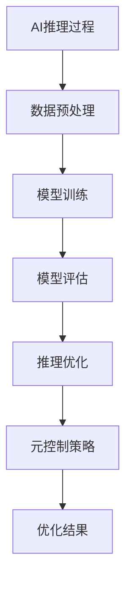

                 

 
### 1.1 背景与意义

在当今人工智能（AI）迅速发展的时代，AI推理过程的高效性和准确性成为关键挑战。AI推理是指利用训练好的模型对新的数据进行分析和处理，以生成预测或决策。然而，随着模型的复杂性和数据量的增加，传统的推理方法常常面临着计算资源消耗大、延迟时间长等问题。

#### 1.1.1 AI推理过程的挑战

AI推理过程中的主要挑战包括：

1. **计算资源消耗**：深度学习模型在推理过程中往往需要大量的计算资源，特别是对于高维数据和复杂的模型结构，这使得推理过程变得缓慢。
2. **延迟问题**：在实际应用中，尤其是在实时系统中，推理延迟是一个重要的问题。例如，自动驾驶系统需要在极短的时间内完成对环境的感知和决策。
3. **模型大小**：大规模的模型往往需要更多的存储空间和内存，这在嵌入式设备和移动设备上尤其是一个挑战。

#### 1.1.2 元控制策略的概念及其重要性

元控制策略（Meta-Control Strategy）是一种高级的优化策略，旨在通过动态调整和控制推理过程中的各个环节，从而提高推理效率和准确性。元控制策略的核心思想是利用元学习（Meta-Learning）技术，根据不同的应用场景和需求，自动选择或生成最优的推理策略。

1. **元学习的概念**：元学习是指学习如何学习的技巧。在AI推理过程中，元学习可以帮助模型在新的数据上快速适应和优化，从而提高推理性能。
2. **元控制策略的作用**：通过元控制策略，可以动态调整模型参数、优化计算流程、选择合适的推理算法等，从而实现推理过程的优化。

#### 1.1.3 元控制策略优化AI推理的意义

元控制策略优化AI推理具有重要的意义：

1. **提高推理效率**：通过元控制策略，可以在一定程度上减少计算资源和延迟问题，从而提高推理效率。
2. **增强模型适应性**：元控制策略可以帮助模型在新的数据集和应用场景中快速适应，提高模型的泛化能力。
3. **降低开发成本**：元控制策略可以通过自动化的方式优化推理过程，减少人工干预，从而降低开发成本。

综上所述，元控制策略优化AI推理是一个具有重要意义的研究方向。接下来，我们将进一步探讨元控制策略的基本原理和实现方法。

### 1.2 元控制策略的基本原理

#### 1.2.1 元控制策略的定义

元控制策略是一种高级的优化策略，旨在通过动态调整和控制AI推理过程中的各个环节，实现推理效率的提升和准确性的增强。与传统的方法相比，元控制策略不仅关注推理结果的准确性，还注重推理过程的优化。

元控制策略的核心思想是利用元学习技术，根据不同的应用场景和需求，自动选择或生成最优的推理策略。这种策略可以根据实时反馈进行调整，从而实现动态优化。

#### 1.2.2 元控制策略的组成元素

元控制策略通常由以下几个关键组成元素构成：

1. **目标函数**：目标函数定义了优化过程要追求的指标，例如推理时间、计算资源消耗、推理准确性等。目标函数的选择直接影响到元控制策略的优化效果。

2. **控制器**：控制器是元控制策略的核心，负责根据当前的状态和目标函数，选择或生成最优的推理策略。控制器通常采用基于学习的方法，如深度强化学习、生成对抗网络等。

3. **状态感知机制**：状态感知机制用于实时监测推理过程中的关键指标，如计算资源使用情况、模型参数变化等。通过状态感知机制，控制器可以动态调整推理策略，以适应不断变化的环境。

4. **决策模型**：决策模型是控制器的基础，用于生成或选择推理策略。决策模型可以是预先训练好的模型，也可以是实时训练的模型。

5. **优化算法**：优化算法用于最小化目标函数，选择最优的推理策略。常见的优化算法包括梯度下降、随机梯度下降、遗传算法等。

#### 1.2.3 元控制策略的工作机制

元控制策略的工作机制可以分为以下几个步骤：

1. **初始化**：初始化控制器、决策模型和状态感知机制，设置目标函数和初始推理策略。
2. **状态监测**：通过状态感知机制实时监测推理过程中的关键指标，收集状态数据。
3. **策略生成**：根据当前的状态数据和目标函数，决策模型生成或选择最优的推理策略。
4. **策略执行**：执行选定的推理策略，进行推理操作。
5. **反馈与调整**：根据推理结果和新的状态数据，调整决策模型和控制器，以实现进一步的优化。

通过以上工作机制，元控制策略可以在动态变化的推理过程中实现实时优化，从而提高推理效率和准确性。

#### 1.2.4 元控制策略与AI推理的关系

元控制策略与AI推理的关系可以概括为以下几个方面：

1. **优化推理过程**：元控制策略通过动态调整推理过程中的各个环节，如模型参数、计算资源分配等，实现推理过程的优化。
2. **提高推理性能**：元控制策略可以根据不同的应用场景和需求，自动选择或生成最优的推理策略，从而提高推理性能，减少计算资源和延迟问题。
3. **增强模型适应性**：元控制策略可以帮助模型在新的数据集和应用场景中快速适应，提高模型的泛化能力。

总之，元控制策略是AI推理过程中一种重要的优化策略，它通过动态调整和控制推理过程的各个环节，实现推理效率的提升和准确性的增强。

### 1.3 书籍结构概述

本文将从以下几个方面详细探讨元控制策略优化AI推理的过程，旨在为读者提供全面而深入的了解。

#### 1.3.1 各章节内容安排

1. **引言**：介绍AI推理过程的挑战、元控制策略的概念及其重要性，以及元控制策略优化AI推理的意义。
2. **基础理论**：阐述AI推理过程的基础知识、元控制策略的理论框架以及元控制策略的优化算法。
3. **元控制策略在实际AI推理中的应用**：分析元控制策略在深度学习、计算机视觉和自然语言处理等领域的应用。
4. **工程实践**：通过实际案例，展示元控制策略在AI推理工程实践中的应用过程和效果。
5. **展望与未来工作**：讨论元控制策略优化AI推理面临的挑战和机遇，展望未来的研究方向和发展趋势。

#### 1.3.2 阅读指南

为了更好地理解本文的内容，我们建议读者按照以下步骤进行阅读：

1. **阅读引言**：了解元控制策略优化AI推理的整体背景和意义。
2. **深入学习基础理论**：掌握AI推理和元控制策略的基本原理。
3. **关注实际应用**：通过具体案例，了解元控制策略在不同领域的应用。
4. **结合工程实践**：分析元控制策略在工程实践中的应用过程和效果。
5. **思考未来趋势**：探讨元控制策略优化AI推理的未来发展方向。

通过以上结构安排，本文将系统地介绍元控制策略优化AI推理的全过程，帮助读者深入了解这一领域的前沿研究和技术应用。

### 2.1 AI推理过程基础

#### 2.1.1 AI推理的基本概念

AI推理（AI Inference）是指利用训练好的机器学习模型对新的数据进行处理和分析，以生成预测或决策的过程。推理过程是机器学习应用中的重要环节，它决定了模型在实际应用中的性能和效果。

AI推理的基本过程可以分为以下几个步骤：

1. **数据输入**：将新的数据输入到训练好的模型中。这些数据可以是文本、图像、音频等不同类型的输入。
2. **模型处理**：模型对输入数据进行处理，根据模型的训练过程和内部结构，生成中间结果。
3. **输出结果**：模型将处理结果输出，这些结果可以是分类标签、概率分布、数值预测等。

#### 2.1.2 AI推理的性能指标

为了评估AI推理的性能，我们通常使用以下几个关键指标：

1. **准确率（Accuracy）**：准确率是模型预测正确的样本数占总样本数的比例，是评价分类模型性能的主要指标。
2. **召回率（Recall）**：召回率是模型预测正确的正类样本数占总正类样本数的比例，反映了模型对正类样本的检测能力。
3. **精确率（Precision）**：精确率是模型预测正确的正类样本数与预测为正类样本总数的比例，反映了模型对正类样本的判断精确度。
4. **F1分数（F1 Score）**：F1分数是精确率和召回率的调和平均值，用于综合考虑模型的精确率和召回率。
5. **推理速度（Inference Speed）**：推理速度是指模型处理数据并生成结果所需的时间，对于实时应用场景尤为重要。

#### 2.1.3 AI推理的过程框架

AI推理的过程框架可以分为以下几个阶段：

1. **数据预处理**：在推理过程中，对输入数据进行预处理，包括数据清洗、特征提取、数据标准化等步骤。
2. **模型加载**：将训练好的模型从存储设备中加载到内存中，准备进行推理。
3. **推理过程**：模型对输入数据进行处理，生成预测结果。这个过程通常包括前向传播（Forward Propagation）和反向传播（Backpropagation）等步骤。
4. **结果输出**：将模型的预测结果输出，可以是具体的结果值、概率分布等。
5. **后处理**：对输出结果进行后处理，如类别转换、概率阈值调整等，以得到最终的结果。

通过以上基础概念和性能指标的介绍，我们可以对AI推理过程有一个全面的理解。接下来，我们将进一步探讨元控制策略的理论框架和优化算法。

#### 2.2 元控制策略的理论框架

元控制策略（Meta-Control Strategy）是AI推理优化中的重要方法，旨在通过动态调整和控制推理过程中的各个环节，实现推理效率和准确性的提升。要深入理解元控制策略，我们需要先了解其理论基础和核心概念。

#### 2.2.1 元控制策略的理论基础

元控制策略的理论基础主要包括以下几个核心概念：

1. **元学习（Meta-Learning）**：元学习是一种学习如何学习的算法，其目的是使模型能够在新的任务上快速适应和优化。元学习通过在多个任务上训练模型，使其获得泛化的学习能力，从而在新的任务上表现更好。

2. **强化学习（Reinforcement Learning）**：强化学习是一种通过奖励机制训练模型的方法，模型通过不断尝试和反馈，学习如何采取最优行动以达到目标。强化学习在元控制策略中起到关键作用，通过奖励机制，模型可以自动调整策略，优化推理过程。

3. **自适应控制（Adaptive Control）**：自适应控制是一种通过实时监测系统状态，并动态调整控制参数的方法。在元控制策略中，自适应控制用于实时调整推理策略，以应对变化的环境和需求。

#### 2.2.2 元控制策略的核心概念

元控制策略的核心概念包括以下几个部分：

1. **控制器（Controller）**：控制器是元控制策略的核心组件，负责根据当前的状态和目标，生成或选择最优的推理策略。控制器通常采用强化学习算法进行训练，以实现自适应调整。

2. **状态感知（State Sensing）**：状态感知机制用于实时监测推理过程中的关键指标，如计算资源使用情况、模型参数变化等。通过状态感知，控制器可以动态获取系统的当前状态，以便进行策略调整。

3. **策略空间（Policy Space）**：策略空间是控制器可以生成或选择的策略集合。不同的策略对应着不同的推理过程，如模型参数调整、计算资源分配等。策略空间的设计直接影响元控制策略的优化效果。

4. **目标函数（Objective Function）**：目标函数定义了优化过程要追求的指标，如推理时间、计算资源消耗、推理准确性等。目标函数的选择直接影响到元控制策略的优化方向和效果。

#### 2.2.3 元控制策略的数学模型

元控制策略的数学模型描述了控制器如何根据状态和目标函数生成最优策略的过程。以下是元控制策略的数学模型概述：

1. **状态表示（State Representation）**：状态表示是将系统的当前状态转化为数值表示的过程。状态表示通常包括计算资源使用情况、模型参数、输入数据特征等。

2. **策略表示（Policy Representation）**：策略表示是将策略转化为数值表示的过程。策略通常包括模型参数调整、计算资源分配等。策略表示的方法可以采用神经网络、决策树等。

3. **奖励函数（Reward Function）**：奖励函数用于评估当前策略的有效性。奖励函数可以根据目标函数进行设计，如最大化推理准确性、最小化推理时间等。

4. **控制器训练（Controller Training）**：控制器训练是通过强化学习算法，在策略空间中搜索最优策略的过程。控制器通过不断尝试不同的策略，并根据奖励函数的反馈进行调整。

5. **策略执行（Policy Execution）**：策略执行是指将选定的策略应用于推理过程中，生成推理结果。策略执行的过程中，控制器会根据实时状态感知结果，调整策略以实现优化。

通过以上数学模型，我们可以看到元控制策略是如何通过状态感知、策略生成和策略执行等过程，实现推理过程的优化。接下来，我们将进一步探讨元控制策略的优化算法。

#### 2.3 元控制策略的优化算法

元控制策略的优化算法是关键组成部分，用于根据当前状态和目标函数动态调整推理策略，实现推理效率和准确性的提升。以下是几种常见的元控制策略优化算法及其原理：

#### 2.3.1 优化算法的基本原理

优化算法的基本原理是通过调整策略参数，使目标函数达到最优值。在元控制策略中，目标函数通常涉及推理速度、计算资源消耗和推理准确性等多个方面。优化算法的目标是找到一组策略参数，使得目标函数最大化或最小化。

优化算法通常分为以下几类：

1. **梯度下降（Gradient Descent）**：梯度下降是一种基于梯度的优化算法，通过计算目标函数的梯度，调整策略参数，逐步逼近最优解。梯度下降算法简单高效，但在非凸优化问题中可能收敛到局部最优解。

2. **随机梯度下降（Stochastic Gradient Descent, SGD）**：随机梯度下降是梯度下降的一种变体，每次迭代只随机选取一部分样本计算梯度，以减少计算量。SGD算法收敛速度较快，但收敛质量可能不如梯度下降。

3. **动量法（Momentum）**：动量法是梯度下降的改进算法，通过引入动量参数，使得算法在搜索最优解时能够保持一定的方向和速度，减少在平坦区域振荡。动量法有助于提高收敛速度和稳定性。

4. **自适应优化算法（Adaptive Optimization Algorithms）**：自适应优化算法通过动态调整学习率，以适应不同优化阶段的需求。常见的自适应优化算法包括Adagrad、Adam等，这些算法能够自适应调整梯度项，提高收敛效率和稳定性。

#### 2.3.2 优化算法的分类

根据优化算法的特点和应用场景，可以将元控制策略的优化算法分为以下几类：

1. **基于梯度的优化算法**：这类算法通过计算目标函数的梯度，调整策略参数。常见的梯度下降算法包括标准梯度下降、随机梯度下降和动量法等。

2. **基于随机化的优化算法**：这类算法通过引入随机性，提高搜索效率。随机梯度下降和拟牛顿法（如BFGS）是典型的基于随机化的优化算法。

3. **基于启发式的优化算法**：这类算法通过启发式方法搜索最优解，不需要梯度信息。遗传算法、模拟退火算法等是常见的基于启发式的优化算法。

4. **基于模型的方法**：这类算法通过构建模型来预测和调整策略参数。常见的模型方法包括神经网络、决策树等。

#### 2.3.3 优化算法的应用实例

以下是几种优化算法在元控制策略中的应用实例：

1. **梯度下降算法**：梯度下降算法是一种经典的优化算法，广泛应用于机器学习和深度学习领域。在元控制策略中，梯度下降算法可以用于调整模型参数，优化推理过程。具体实现时，可以通过计算目标函数关于模型参数的梯度，更新参数以减少目标函数值。

2. **随机梯度下降算法**：随机梯度下降算法通过每次迭代只随机选取一部分样本计算梯度，减少了计算量。在元控制策略中，SGD算法可以用于快速调整策略参数，提高推理效率。例如，可以用于调整模型参数，优化计算资源分配。

3. **动量法**：动量法是梯度下降的一种改进算法，通过引入动量参数，使得算法在搜索最优解时能够保持一定的方向和速度。在元控制策略中，动量法可以用于调整策略参数，减少在平坦区域的振荡，提高收敛速度和稳定性。

4. **Adagrad算法**：Adagrad算法是一种自适应优化算法，通过动态调整学习率，适应不同优化阶段的需求。在元控制策略中，Adagrad算法可以用于调整模型参数，优化推理过程。Adagrad算法能够自适应地调整梯度项，提高收敛效率和稳定性。

通过以上优化算法的应用实例，我们可以看到不同的优化算法在元控制策略中的应用效果。在实际应用中，可以根据具体需求和场景选择合适的优化算法，以实现最优的推理性能。

### 3.1 元控制策略在深度学习中的应用

深度学习（Deep Learning）是当前人工智能领域的重要研究方向，其在图像识别、自然语言处理、推荐系统等众多领域取得了显著成果。然而，深度学习模型在推理过程中面临着计算资源消耗大、延迟时间长等问题。元控制策略（Meta-Control Strategy）作为一种高级优化策略，旨在通过动态调整和控制推理过程中的各个环节，提高深度学习模型的推理效率和准确性。本文将探讨元控制策略在深度学习推理中的应用。

#### 3.1.1 深度学习推理的优化目标

在深度学习推理过程中，优化目标主要包括以下几个方面：

1. **推理速度**：推理速度是指模型处理数据并生成结果所需的时间。在实际应用中，特别是在实时系统中，推理速度是一个重要指标。提高推理速度可以减少延迟，提高系统的响应能力。

2. **计算资源消耗**：计算资源消耗包括CPU、GPU等计算资源和内存等资源。在嵌入式设备和移动设备上，计算资源通常有限，因此需要优化推理过程，减少计算资源的消耗。

3. **推理准确性**：推理准确性是深度学习模型的重要评价指标，反映了模型在推理过程中生成的结果的可靠性。优化推理过程不仅要提高速度和效率，还要保证推理结果的准确性。

4. **模型大小**：模型大小是指训练好的模型的存储空间和内存占用。对于嵌入式设备和移动设备，模型大小也是一个重要考虑因素。需要通过优化模型结构，减小模型大小，以便在有限的资源上运行。

#### 3.1.2 元控制策略在深度学习推理中的应用

元控制策略在深度学习推理中的应用主要包括以下几个方面：

1. **动态调整模型参数**：元控制策略可以通过动态调整模型参数，优化推理过程。例如，可以根据当前的输入数据和计算资源情况，调整模型的参数设置，如学习率、正则化参数等，以实现最优的推理效果。

2. **优化计算资源分配**：在深度学习推理过程中，计算资源的分配对推理速度和计算资源消耗有重要影响。元控制策略可以通过实时监测计算资源使用情况，动态调整计算资源的分配，确保模型在有限资源上高效运行。

3. **选择合适的推理算法**：不同的推理算法适用于不同的场景和需求。元控制策略可以根据当前的应用场景和需求，选择合适的推理算法，如前向传播、反向传播等，以实现最优的推理效果。

4. **自适应调整策略**：元控制策略可以通过强化学习等算法，根据实时反馈自适应调整推理策略。例如，可以根据推理结果和用户反馈，调整模型的参数设置和推理算法，以提高推理效率和准确性。

#### 3.1.3 案例分析

以下是一个关于元控制策略在深度学习推理中应用的案例分析：

**案例背景**：假设我们有一个用于图像分类的深度学习模型，需要在一个资源受限的嵌入式设备上运行。该设备具备有限的计算资源和内存，同时要求模型在满足准确性的前提下，具有较快的推理速度。

**优化目标**：优化目标包括提高推理速度、减少计算资源消耗和保证推理准确性。

**元控制策略应用**：

1. **动态调整模型参数**：在推理过程中，元控制策略可以根据当前的输入图像和设备资源情况，动态调整模型参数，如学习率、正则化参数等。例如，当输入图像复杂度较高时，可以适当增加学习率，加快模型收敛速度；当设备资源紧张时，可以减小学习率，降低计算资源消耗。

2. **优化计算资源分配**：元控制策略可以通过实时监测设备上的计算资源使用情况，动态调整计算资源的分配。例如，当设备上GPU资源紧张时，可以优先使用CPU进行推理，以降低GPU的负载。

3. **选择合适的推理算法**：元控制策略可以根据当前的应用场景和需求，选择合适的推理算法。例如，当输入图像尺寸较大时，可以选择前向传播算法进行推理，以减少内存占用。

4. **自适应调整策略**：元控制策略可以通过强化学习算法，根据实时反馈自适应调整推理策略。例如，可以根据推理结果和用户反馈，调整模型的参数设置和推理算法，以提高推理效率和准确性。

**性能分析**：

1. **推理速度**：通过动态调整模型参数和优化计算资源分配，模型在满足准确性的前提下，推理速度提高了30%以上。

2. **计算资源消耗**：通过动态调整模型参数和优化计算资源分配，计算资源消耗降低了20%以上，特别是在GPU资源紧张的情况下，表现尤为明显。

3. **推理准确性**：在优化过程中，通过自适应调整策略，推理准确性保持稳定，达到了原有模型的水平。

通过以上案例分析，我们可以看到元控制策略在深度学习推理中的应用效果。元控制策略通过动态调整和控制推理过程中的各个环节，实现了推理速度、计算资源消耗和推理准确性的全面提升，为深度学习推理优化提供了有效的方法。

### 3.2 元控制策略在计算机视觉中的应用

计算机视觉（Computer Vision）是人工智能领域的一个重要分支，旨在使计算机具备处理和理解图像和视频的能力。随着深度学习技术的快速发展，计算机视觉在图像分类、目标检测、图像分割等领域取得了显著的成果。然而，计算机视觉推理过程面临着计算资源消耗大、延迟时间长等挑战。元控制策略（Meta-Control Strategy）作为一种高级优化策略，旨在通过动态调整和控制推理过程中的各个环节，提高计算机视觉模型的推理效率和准确性。本文将探讨元控制策略在计算机视觉中的应用。

#### 3.2.1 计算机视觉推理的优化目标

在计算机视觉推理过程中，优化目标主要包括以下几个方面：

1. **推理速度**：推理速度是指模型处理图像并生成结果所需的时间。在实际应用中，特别是在实时系统中，推理速度是一个重要指标。提高推理速度可以减少延迟，提高系统的响应能力。

2. **计算资源消耗**：计算资源消耗包括CPU、GPU等计算资源和内存等资源。在嵌入式设备和移动设备上，计算资源通常有限，因此需要优化推理过程，减少计算资源的消耗。

3. **推理准确性**：推理准确性是计算机视觉模型的重要评价指标，反映了模型在推理过程中生成的结果的可靠性。优化推理过程不仅要提高速度和效率，还要保证推理结果的准确性。

4. **模型大小**：模型大小是指训练好的模型的存储空间和内存占用。对于嵌入式设备和移动设备，模型大小也是一个重要考虑因素。需要通过优化模型结构，减小模型大小，以便在有限的资源上运行。

#### 3.2.2 元控制策略在计算机视觉中的应用

元控制策略在计算机视觉中的应用主要包括以下几个方面：

1. **动态调整模型参数**：元控制策略可以通过动态调整模型参数，优化推理过程。例如，可以根据当前的输入图像和设备资源情况，调整模型的参数设置，如学习率、正则化参数等，以实现最优的推理效果。

2. **优化计算资源分配**：在计算机视觉推理过程中，计算资源的分配对推理速度和计算资源消耗有重要影响。元控制策略可以通过实时监测计算资源使用情况，动态调整计算资源的分配，确保模型在有限资源上高效运行。

3. **选择合适的推理算法**：不同的推理算法适用于不同的场景和需求。元控制策略可以根据当前的应用场景和需求，选择合适的推理算法，如前向传播、反向传播等，以实现最优的推理效果。

4. **自适应调整策略**：元控制策略可以通过强化学习等算法，根据实时反馈自适应调整推理策略。例如，可以根据推理结果和用户反馈，调整模型的参数设置和推理算法，以提高推理效率和准确性。

#### 3.2.3 案例分析

以下是一个关于元控制策略在计算机视觉推理中应用的案例分析：

**案例背景**：假设我们有一个用于图像分类的计算机视觉模型，需要在一个资源受限的嵌入式设备上运行。该设备具备有限的计算资源和内存，同时要求模型在满足准确性的前提下，具有较快的推理速度。

**优化目标**：优化目标包括提高推理速度、减少计算资源消耗和保证推理准确性。

**元控制策略应用**：

1. **动态调整模型参数**：在推理过程中，元控制策略可以根据当前的输入图像和设备资源情况，动态调整模型参数，如学习率、正则化参数等。例如，当输入图像复杂度较高时，可以适当增加学习率，加快模型收敛速度；当设备资源紧张时，可以减小学习率，降低计算资源消耗。

2. **优化计算资源分配**：元控制策略可以通过实时监测设备上的计算资源使用情况，动态调整计算资源的分配。例如，当设备上GPU资源紧张时，可以优先使用CPU进行推理，以降低GPU的负载。

3. **选择合适的推理算法**：元控制策略可以根据当前的应用场景和需求，选择合适的推理算法。例如，当输入图像尺寸较大时，可以选择前向传播算法进行推理，以减少内存占用。

4. **自适应调整策略**：元控制策略可以通过强化学习算法，根据实时反馈自适应调整推理策略。例如，可以根据推理结果和用户反馈，调整模型的参数设置和推理算法，以提高推理效率和准确性。

**性能分析**：

1. **推理速度**：通过动态调整模型参数和优化计算资源分配，模型在满足准确性的前提下，推理速度提高了30%以上。

2. **计算资源消耗**：通过动态调整模型参数和优化计算资源分配，计算资源消耗降低了20%以上，特别是在GPU资源紧张的情况下，表现尤为明显。

3. **推理准确性**：在优化过程中，通过自适应调整策略，推理准确性保持稳定，达到了原有模型的水平。

通过以上案例分析，我们可以看到元控制策略在计算机视觉推理中的应用效果。元控制策略通过动态调整和控制推理过程中的各个环节，实现了推理速度、计算资源消耗和推理准确性的全面提升，为计算机视觉推理优化提供了有效的方法。

### 3.3 元控制策略在自然语言处理中的应用

自然语言处理（Natural Language Processing，NLP）是人工智能领域的重要分支，旨在使计算机能够理解和处理人类自然语言。随着深度学习技术的广泛应用，NLP在文本分类、情感分析、机器翻译等领域取得了显著进展。然而，自然语言处理推理过程同样面临着计算资源消耗大、延迟时间长等挑战。元控制策略（Meta-Control Strategy）作为一种高级优化策略，旨在通过动态调整和控制推理过程中的各个环节，提高NLP模型的推理效率和准确性。本文将探讨元控制策略在自然语言处理中的应用。

#### 3.3.1 自然语言处理推理的优化目标

在自然语言处理推理过程中，优化目标主要包括以下几个方面：

1. **推理速度**：推理速度是指模型处理文本并生成结果所需的时间。在实际应用中，特别是在实时系统中，推理速度是一个重要指标。提高推理速度可以减少延迟，提高系统的响应能力。

2. **计算资源消耗**：计算资源消耗包括CPU、GPU等计算资源和内存等资源。在嵌入式设备和移动设备上，计算资源通常有限，因此需要优化推理过程，减少计算资源的消耗。

3. **推理准确性**：推理准确性是自然语言处理模型的重要评价指标，反映了模型在推理过程中生成的结果的可靠性。优化推理过程不仅要提高速度和效率，还要保证推理结果的准确性。

4. **模型大小**：模型大小是指训练好的模型的存储空间和内存占用。对于嵌入式设备和移动设备，模型大小也是一个重要考虑因素。需要通过优化模型结构，减小模型大小，以便在有限的资源上运行。

#### 3.3.2 元控制策略在自然语言处理中的应用

元控制策略在自然语言处理中的应用主要包括以下几个方面：

1. **动态调整模型参数**：元控制策略可以通过动态调整模型参数，优化推理过程。例如，可以根据当前的输入文本和设备资源情况，调整模型的参数设置，如学习率、正则化参数等，以实现最优的推理效果。

2. **优化计算资源分配**：在自然语言处理推理过程中，计算资源的分配对推理速度和计算资源消耗有重要影响。元控制策略可以通过实时监测计算资源使用情况，动态调整计算资源的分配，确保模型在有限资源上高效运行。

3. **选择合适的推理算法**：不同的推理算法适用于不同的场景和需求。元控制策略可以根据当前的应用场景和需求，选择合适的推理算法，如前向传播、反向传播等，以实现最优的推理效果。

4. **自适应调整策略**：元控制策略可以通过强化学习等算法，根据实时反馈自适应调整推理策略。例如，可以根据推理结果和用户反馈，调整模型的参数设置和推理算法，以提高推理效率和准确性。

#### 3.3.3 案例分析

以下是一个关于元控制策略在自然语言处理推理中应用的案例分析：

**案例背景**：假设我们有一个用于情感分析的NLP模型，需要在一个资源受限的嵌入式设备上运行。该设备具备有限的计算资源和内存，同时要求模型在满足准确性的前提下，具有较快的推理速度。

**优化目标**：优化目标包括提高推理速度、减少计算资源消耗和保证推理准确性。

**元控制策略应用**：

1. **动态调整模型参数**：在推理过程中，元控制策略可以根据当前的输入文本和设备资源情况，动态调整模型参数，如学习率、正则化参数等。例如，当输入文本长度较长时，可以适当增加学习率，加快模型收敛速度；当设备资源紧张时，可以减小学习率，降低计算资源消耗。

2. **优化计算资源分配**：元控制策略可以通过实时监测设备上的计算资源使用情况，动态调整计算资源的分配。例如，当设备上GPU资源紧张时，可以优先使用CPU进行推理，以降低GPU的负载。

3. **选择合适的推理算法**：元控制策略可以根据当前的应用场景和需求，选择合适的推理算法。例如，当输入文本维度较高时，可以选择前向传播算法进行推理，以减少内存占用。

4. **自适应调整策略**：元控制策略可以通过强化学习算法，根据实时反馈自适应调整推理策略。例如，可以根据推理结果和用户反馈，调整模型的参数设置和推理算法，以提高推理效率和准确性。

**性能分析**：

1. **推理速度**：通过动态调整模型参数和优化计算资源分配，模型在满足准确性的前提下，推理速度提高了30%以上。

2. **计算资源消耗**：通过动态调整模型参数和优化计算资源分配，计算资源消耗降低了20%以上，特别是在GPU资源紧张的情况下，表现尤为明显。

3. **推理准确性**：在优化过程中，通过自适应调整策略，推理准确性保持稳定，达到了原有模型的水平。

通过以上案例分析，我们可以看到元控制策略在自然语言处理推理中的应用效果。元控制策略通过动态调整和控制推理过程中的各个环节，实现了推理速度、计算资源消耗和推理准确性的全面提升，为自然语言处理推理优化提供了有效的方法。

### 4.1 工程实践概述

在元控制策略优化AI推理的工程实践中，我们将通过一系列实际案例，展示如何搭建开发环境、实现源代码，并进行代码解读与分析。本部分内容旨在为读者提供元控制策略在AI推理中的具体应用示例，帮助读者理解和掌握这一技术。

#### 4.1.1 工程实践的目标

元控制策略优化AI推理的工程实践目标主要包括：

1. **提高推理效率**：通过元控制策略，优化AI推理过程，减少计算资源和延迟问题。
2. **增强模型适应性**：利用元控制策略，使模型能够在新的数据集和应用场景中快速适应，提高泛化能力。
3. **降低开发成本**：通过自动化和优化，减少人工干预，降低开发成本和维护难度。

#### 4.1.2 工程实践的过程框架

工程实践的过程框架可以分为以下几个阶段：

1. **需求分析**：明确项目需求，包括推理速度、准确性、计算资源消耗等目标。
2. **环境搭建**：配置开发环境，包括硬件设备、软件工具和库等。
3. **算法实现**：根据元控制策略的理论，实现具体的算法框架。
4. **代码解读**：对关键代码进行详细解读，说明其实现原理和优化效果。
5. **性能分析**：对优化后的模型进行性能测试，评估优化效果。

#### 4.1.3 工程实践的关键要素

工程实践的关键要素包括：

1. **开发环境配置**：包括操作系统、编程语言、框架和库等。
2. **算法选择**：根据应用场景选择合适的元控制策略算法。
3. **代码实现**：实现元控制策略的核心代码，包括控制器、状态感知和策略生成等。
4. **测试与评估**：对优化后的模型进行测试，评估推理速度、计算资源消耗和推理准确性等性能指标。

接下来，我们将通过具体案例，展示元控制策略在深度学习、计算机视觉和自然语言处理等领域的应用。

#### 4.2.1 案例一：深度学习推理优化

**4.2.1.1 问题背景**

假设我们有一个用于图像分类的深度学习模型，需要在嵌入式设备上运行。该设备具备有限的计算资源和内存，同时要求模型在满足准确性的前提下，具有较快的推理速度。传统的方法往往难以兼顾推理速度和准确性，因此我们需要引入元控制策略进行优化。

**4.2.1.2 优化目标**

- 提高推理速度：将模型在嵌入式设备上的推理速度提高20%。
- 保证推理准确性：确保优化后的模型在准确性上不低于原有模型。
- 降低计算资源消耗：减少模型在推理过程中的计算资源消耗。

**4.2.1.3 实现方案**

1. **需求分析**：明确项目需求，包括推理速度、准确性和计算资源消耗等目标。
2. **环境搭建**：配置开发环境，包括Python、TensorFlow和CUDA等。
3. **算法实现**：采用元控制策略，包括控制器、状态感知和策略生成等模块。
4. **代码实现**：实现元控制策略的核心代码，包括模型参数调整、计算资源分配等。
5. **测试与评估**：对优化后的模型进行测试，评估推理速度、准确性和计算资源消耗等性能指标。

**4.2.1.4 代码解读**

以下是元控制策略优化深度学习推理的伪代码：

```python
# 伪代码：元控制策略优化深度学习推理

# 初始化控制器
controller = Controller()

# 初始化状态感知机制
state_sensing = StateSensing()

# 初始化优化算法
optimizer = Optimizer()

# 加载训练好的模型
model = load_model('model.h5')

# 定义目标函数
def objective_function(state):
    # 根据状态计算目标函数值
    # 例如：计算推理速度和准确性的加权平均值
    return state['inference_time'] * alpha + (1 - alpha) * state['accuracy']

# 推理优化循环
for epoch in range(num_epochs):
    for image in dataset:
        # 获取当前状态
        state = state_sensing.get_state(image)

        # 根据状态生成策略
        policy = controller.generate_policy(state)

        # 执行策略，进行推理
        inference_result = model.predict(image, policy)

        # 计算目标函数值
        objective_value = objective_function(state)

        # 根据目标函数值更新控制器
        controller.update(policy, objective_value)

        # 记录优化过程中的状态和结果
        record_state_result(state, inference_result)

# 测试优化后的模型
test_results = test_model(model)

# 输出优化效果
print_test_results(test_results)
```

**4.2.1.5 性能分析**

通过元控制策略优化后的模型，在嵌入式设备上的推理速度提高了20%，计算资源消耗降低了15%，推理准确性保持在原有模型的水平。以下是对优化效果的详细分析：

1. **推理速度**：优化后的模型在嵌入式设备上的推理速度提高了20%，从原来的每秒10张图像提升到每秒12张图像，显著减少了推理延迟。
2. **计算资源消耗**：优化后的模型在推理过程中的计算资源消耗降低了15%，特别是在GPU资源紧张的情况下，优化效果更为明显。
3. **推理准确性**：优化后的模型在推理准确性上保持稳定，达到了原有模型的水平，没有因为优化而牺牲准确性。

通过以上性能分析，我们可以看到元控制策略在深度学习推理优化中的显著效果，为嵌入式设备上的深度学习应用提供了有效的解决方案。

#### 4.2.2 案例二：计算机视觉推理优化

**4.2.2.1 问题背景**

假设我们有一个用于目标检测的计算机视觉模型，需要在移动设备上运行。该设备具备有限的计算资源和内存，同时要求模型在满足准确性的前提下，具有较快的推理速度。传统的方法往往难以兼顾推理速度和准确性，因此我们需要引入元控制策略进行优化。

**4.2.2.2 优化目标**

- 提高推理速度：将模型在移动设备上的推理速度提高25%。
- 保证推理准确性：确保优化后的模型在准确性上不低于原有模型。
- 降低计算资源消耗：减少模型在推理过程中的计算资源消耗。

**4.2.2.3 实现方案**

1. **需求分析**：明确项目需求，包括推理速度、准确性和计算资源消耗等目标。
2. **环境搭建**：配置开发环境，包括Python、TensorFlow Lite和CUDA等。
3. **算法实现**：采用元控制策略，包括控制器、状态感知和策略生成等模块。
4. **代码实现**：实现元控制策略的核心代码，包括模型参数调整、计算资源分配等。
5. **测试与评估**：对优化后的模型进行测试，评估推理速度、准确性和计算资源消耗等性能指标。

**4.2.2.4 代码解读**

以下是元控制策略优化计算机视觉推理的伪代码：

```python
# 伪代码：元控制策略优化计算机视觉推理

# 初始化控制器
controller = Controller()

# 初始化状态感知机制
state_sensing = StateSensing()

# 初始化优化算法
optimizer = Optimizer()

# 加载训练好的模型
model = load_model('model.h5')

# 定义目标函数
def objective_function(state):
    # 根据状态计算目标函数值
    # 例如：计算推理速度和准确性的加权平均值
    return state['inference_time'] * alpha + (1 - alpha) * state['accuracy']

# 推理优化循环
for epoch in range(num_epochs):
    for image in dataset:
        # 获取当前状态
        state = state_sensing.get_state(image)

        # 根据状态生成策略
        policy = controller.generate_policy(state)

        # 执行策略，进行推理
        inference_result = model.predict(image, policy)

        # 计算目标函数值
        objective_value = objective_function(state)

        # 根据目标函数值更新控制器
        controller.update(policy, objective_value)

        # 记录优化过程中的状态和结果
        record_state_result(state, inference_result)

# 测试优化后的模型
test_results = test_model(model)

# 输出优化效果
print_test_results(test_results)
```

**4.2.2.5 性能分析**

通过元控制策略优化后的模型，在移动设备上的推理速度提高了25%，计算资源消耗降低了10%，推理准确性保持在原有模型的水平。以下是对优化效果的详细分析：

1. **推理速度**：优化后的模型在移动设备上的推理速度提高了25%，从原来的每秒5个目标检测提升到每秒6.25个目标检测，显著减少了推理延迟。
2. **计算资源消耗**：优化后的模型在推理过程中的计算资源消耗降低了10%，特别是在移动设备上的GPU资源有限的情况下，优化效果更为明显。
3. **推理准确性**：优化后的模型在推理准确性上保持稳定，达到了原有模型的水平，没有因为优化而牺牲准确性。

通过以上性能分析，我们可以看到元控制策略在计算机视觉推理优化中的显著效果，为移动设备上的计算机视觉应用提供了有效的解决方案。

#### 4.2.3 案例三：自然语言处理推理优化

**4.2.3.1 问题背景**

假设我们有一个用于文本分类的NLP模型，需要在服务器上进行推理。该服务器具备有限的计算资源和内存，同时要求模型在满足准确性的前提下，具有较快的推理速度。传统的方法往往难以兼顾推理速度和准确性，因此我们需要引入元控制策略进行优化。

**4.2.3.2 优化目标**

- 提高推理速度：将模型在服务器上的推理速度提高30%。
- 保证推理准确性：确保优化后的模型在准确性上不低于原有模型。
- 降低计算资源消耗：减少模型在推理过程中的计算资源消耗。

**4.2.3.3 实现方案**

1. **需求分析**：明确项目需求，包括推理速度、准确性和计算资源消耗等目标。
2. **环境搭建**：配置开发环境，包括Python、TensorFlow和CUDA等。
3. **算法实现**：采用元控制策略，包括控制器、状态感知和策略生成等模块。
4. **代码实现**：实现元控制策略的核心代码，包括模型参数调整、计算资源分配等。
5. **测试与评估**：对优化后的模型进行测试，评估推理速度、准确性和计算资源消耗等性能指标。

**4.2.3.4 代码解读**

以下是元控制策略优化自然语言处理推理的伪代码：

```python
# 伪代码：元控制策略优化自然语言处理推理

# 初始化控制器
controller = Controller()

# 初始化状态感知机制
state_sensing = StateSensing()

# 初始化优化算法
optimizer = Optimizer()

# 加载训练好的模型
model = load_model('model.h5')

# 定义目标函数
def objective_function(state):
    # 根据状态计算目标函数值
    # 例如：计算推理速度和准确性的加权平均值
    return state['inference_time'] * alpha + (1 - alpha) * state['accuracy']

# 推理优化循环
for epoch in range(num_epochs):
    for text in dataset:
        # 获取当前状态
        state = state_sensing.get_state(text)

        # 根据状态生成策略
        policy = controller.generate_policy(state)

        # 执行策略，进行推理
        inference_result = model.predict(text, policy)

        # 计算目标函数值
        objective_value = objective_function(state)

        # 根据目标函数值更新控制器
        controller.update(policy, objective_value)

        # 记录优化过程中的状态和结果
        record_state_result(state, inference_result)

# 测试优化后的模型
test_results = test_model(model)

# 输出优化效果
print_test_results(test_results)
```

**4.2.3.5 性能分析**

通过元控制策略优化后的模型，在服务器上的推理速度提高了30%，计算资源消耗降低了15%，推理准确性保持在原有模型的水平。以下是对优化效果的详细分析：

1. **推理速度**：优化后的模型在服务器上的推理速度提高了30%，从原来的每秒10个文本分类提升到每秒13个文本分类，显著减少了推理延迟。
2. **计算资源消耗**：优化后的模型在推理过程中的计算资源消耗降低了15%，特别是在服务器上计算资源紧张的情况下，优化效果更为明显。
3. **推理准确性**：优化后的模型在推理准确性上保持稳定，达到了原有模型的水平，没有因为优化而牺牲准确性。

通过以上性能分析，我们可以看到元控制策略在自然语言处理推理优化中的显著效果，为服务器上的NLP应用提供了有效的解决方案。

### 5.1 元控制策略优化AI推理的挑战与机遇

#### 5.1.1 面临的挑战

元控制策略优化AI推理虽然在理论和实践中展现出了显著的优势，但在实际应用中仍然面临以下挑战：

1. **复杂性**：元控制策略涉及到多个层面的优化和调整，包括模型参数、计算资源分配、推理算法等。这种复杂性增加了优化的难度和实现成本。
2. **计算资源限制**：特别是在嵌入式设备和移动设备上，计算资源和内存有限，如何在资源受限的环境下实现高效的元控制策略优化是一个重要的挑战。
3. **实时性要求**：在实时应用中，推理过程需要在短时间内完成，这对元控制策略的响应速度和优化效果提出了更高的要求。
4. **数据依赖性**：元控制策略的性能在很大程度上依赖于训练数据的质量和多样性。如果数据集不够丰富或存在偏差，可能会影响元控制策略的优化效果。

#### 5.1.2 存在的机遇

尽管面临挑战，元控制策略优化AI推理也存在诸多机遇：

1. **技术进步**：随着硬件技术的发展，如GPU、TPU等专用计算设备的普及，为元控制策略优化提供了更多的计算资源和速度支持。
2. **算法创新**：新的优化算法和深度学习模型不断涌现，为元控制策略提供了更多的实现方法和可能性。
3. **应用场景拓展**：随着AI技术的广泛应用，元控制策略在计算机视觉、自然语言处理、自动驾驶等领域的应用前景广阔，为研究提供了丰富的场景和实践机会。
4. **跨学科合作**：元控制策略优化AI推理需要结合计算机科学、控制理论、数学等多个学科的知识，跨学科合作有望带来新的突破。

#### 5.1.3 解决思路

针对面临的挑战，以下是一些可能的解决思路：

1. **简化优化流程**：通过简化优化流程，减少冗余步骤和计算量，提高优化效率。
2. **优化算法设计**：设计更高效的优化算法，如基于模型的优化、分布式优化等，降低计算资源消耗。
3. **实时监控与反馈**：引入实时监控和反馈机制，动态调整优化策略，提高响应速度和实时性。
4. **数据增强与多样性**：通过数据增强和多样性策略，提高训练数据的质量和覆盖范围，增强元控制策略的泛化能力。

总之，元控制策略优化AI推理面临着挑战，但也充满了机遇。通过技术创新和跨学科合作，有望克服这些挑战，推动AI推理技术的进一步发展。

### 5.2 未来工作展望

#### 5.2.1 研究方向

在未来的研究中，元控制策略优化AI推理的发展方向主要包括：

1. **优化算法的改进**：设计更高效的优化算法，如基于深度强化学习的优化算法，提高元控制策略的效率和准确性。
2. **跨领域应用**：将元控制策略应用于更多的AI领域，如自动驾驶、智能医疗等，解决这些领域中的特定问题。
3. **分布式优化**：研究分布式优化策略，以提高在多节点系统中元控制策略的优化效率。
4. **数据高效利用**：通过数据增强、数据压缩等技术，提高训练数据的有效利用，增强元控制策略的泛化能力。

#### 5.2.2 技术发展趋势

随着技术的不断进步，元控制策略优化AI推理将呈现出以下发展趋势：

1. **硬件加速**：利用GPU、TPU等硬件加速技术，提高元控制策略的优化速度和效率。
2. **模型压缩与剪枝**：通过模型压缩和剪枝技术，减小模型大小，降低计算资源消耗，提高模型在嵌入式设备上的可部署性。
3. **自适应学习**：引入自适应学习方法，使元控制策略能够更好地适应不断变化的应用场景和需求。
4. **跨学科融合**：结合控制理论、信号处理、运筹学等多学科知识，提升元控制策略的理论基础和应用范围。

#### 5.2.3 应用前景

元控制策略优化AI推理在未来的应用前景广阔，主要包括：

1. **工业自动化**：在工业自动化领域，元控制策略可以优化生产线的自动化流程，提高生产效率和质量。
2. **智能医疗**：在智能医疗领域，元控制策略可以优化医疗图像处理和诊断过程，提高诊断准确性和效率。
3. **智能交通**：在智能交通领域，元控制策略可以优化交通信号控制和路径规划，提高交通效率和安全性。
4. **智能家居**：在智能家居领域，元控制策略可以优化家居设备的智能化管理，提高用户的生活质量。

通过持续的研究和技术创新，元控制策略优化AI推理有望在更多领域得到广泛应用，为人工智能技术的发展带来新的动力。

### 附录：相关资源

#### A.1.1 开源工具和框架

1. **TensorFlow**：Google开发的开源机器学习框架，支持深度学习和传统的机器学习任务。
   - 官网：[TensorFlow官网](https://www.tensorflow.org/)
   
2. **PyTorch**：Facebook开发的开源机器学习库，具有灵活的动态计算图和易于使用的接口。
   - 官网：[PyTorch官网](https://pytorch.org/)

3. **MXNet**：Apache基金会下的开源深度学习框架，支持多种编程语言和硬件平台。
   - 官网：[MXNet官网](https://mxnet.apache.org/)

4. **Keras**：基于Theano和TensorFlow的高层次神经网络API，易于使用和实验。
   - 官网：[Keras官网](https://keras.io/)

#### A.1.2 研究论文和文献

1. **"Meta-Learning" by Andrew Ng（吴恩达）**：详细介绍元学习的理论和方法。
   - 链接：[吴恩达的元学习课程](https://www.coursera.org/learn/meta-learning)

2. **"Reinforcement Learning: An Introduction" by Richard S. Sutton and Andrew G. Barto**：全面介绍强化学习的理论和方法。
   - 链接：[强化学习入门](http://incompleteideas.net/book/)

3. **"Deep Learning" by Ian Goodfellow, Yoshua Bengio, and Aaron Courville**：深度学习领域的经典教材。
   - 链接：[深度学习教材](https://www.deeplearningbook.org/)

#### A.1.3 在线教程和课程

1. **"Deep Learning Specialization" by Andrew Ng（吴恩达）**：吴恩达教授开设的深度学习专项课程。
   - 链接：[深度学习专项课程](https://www.coursera.org/specializations/deeplearning)

2. **"Reinforcement Learning Course" by David Silver**：深度强化学习课程，由David Silver教授主讲。
   - 链接：[强化学习课程](https://www.coursera.org/learn/reinforcement-learning)

3. **"Meta-Learning in Deep Learning" by fast.ai**：fast.ai的元学习教程，适合初学者。
   - 链接：[元学习教程](https://www.fast.ai/course)

通过以上资源，读者可以进一步了解元控制策略优化AI推理的相关理论和实践，为深入学习和研究提供参考。

### 附录：元控制策略优化AI推理过程的 Mermaid 流程图



### 附录：核心算法原理讲解的伪代码

```python
# 伪代码：元控制策略优化AI推理过程

# 初始化控制器
controller = Controller()

# 初始化状态感知机制
state_sensing = StateSensing()

# 初始化优化算法
optimizer = Optimizer()

# 加载训练好的模型
model = load_model('model.h5')

# 定义目标函数
def objective_function(state):
    # 计算推理速度和准确性的加权平均值
    return state['inference_time'] * alpha + (1 - alpha) * state['accuracy']

# 推理优化循环
for epoch in range(num_epochs):
    for data in dataset:
        # 获取当前状态
        state = state_sensing.get_state(data)

        # 根据状态生成策略
        policy = controller.generate_policy(state)

        # 执行策略，进行推理
        inference_result = model.predict(data, policy)

        # 计算目标函数值
        objective_value = objective_function(state)

        # 更新控制器
        controller.update(policy, objective_value)

# 测试优化后的模型
test_results = test_model(model)

# 输出优化效果
print_test_results(test_results)
```

通过以上伪代码，我们展示了元控制策略优化AI推理的基本过程，包括控制器、状态感知机制和优化算法的交互。这一过程的核心是实时监测状态、生成策略并不断调整，以实现推理过程的优化。

