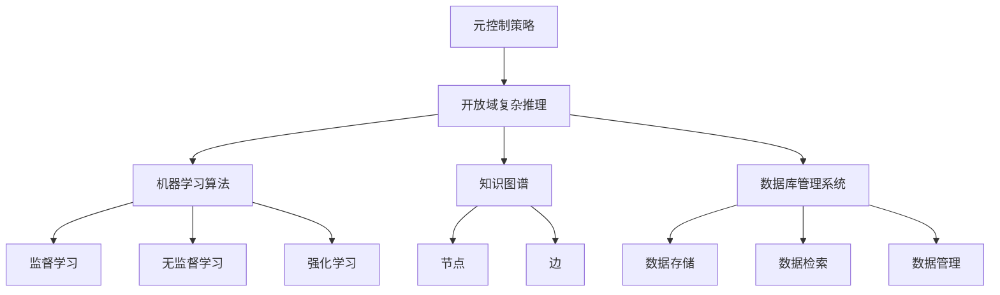

                 


### 第1步：确定核心概念与联系

在撰写关于“元控制策略在开放域复杂推理中的应用”的技术博客时，我们首先需要明确几个核心概念，并理解它们之间的关系。以下是几个核心概念及其联系：

- **元控制策略**：元控制策略是一种高级控制策略，它能够根据环境变化动态调整系统行为。它通常用于复杂系统的智能控制，如多智能体系统、分布式系统等。

- **开放域复杂推理**：开放域复杂推理是指在不限定知识领域和问题空间的情况下，对复杂问题进行推理和决策的能力。这种推理往往涉及大量的不确定性和多变量影响。

- **机器学习算法**：机器学习算法是一类可以从数据中自动学习规律的算法，包括监督学习、无监督学习和强化学习等。这些算法在开放域复杂推理中扮演着关键角色。

- **知识图谱**：知识图谱是一种结构化的知识表示方法，它通过节点和边来表示实体及其关系。知识图谱在开放域推理中用于提供背景知识和关联信息。

- **数据库管理系统**：数据库管理系统（DBMS）是用于存储、管理和检索数据的系统。在开放域推理中，DBMS 负责管理大量的背景知识和数据。

为了更好地展示这些核心概念之间的关系，我们可以使用 Mermaid 流程图进行可视化：



### 第2步：构思核心算法原理讲解

在明确了核心概念后，我们需要讲解几个核心算法原理，这些算法在元控制策略和开放域复杂推理中起着至关重要的作用。以下是这些核心算法：

- **多智能体强化学习**：多智能体强化学习（MARL）是一种在多个智能体交互环境中进行学习的方法。它通过多个智能体的策略迭代优化来达到共同目标。

- **模糊逻辑系统**：模糊逻辑系统是一种处理不确定性和模糊信息的数学工具，它通过模糊集和模糊规则来模拟人类的决策过程。

- **贝叶斯网络**：贝叶斯网络是一种概率图模型，用于表示变量之间的条件依赖关系。它基于贝叶斯定理，通过概率推理来推断变量状态。

- **支持向量机**：支持向量机（SVM）是一种监督学习算法，用于分类和回归问题。它通过找到最佳决策边界来最大化分类边界。

- **深度学习网络架构**：深度学习网络架构是一类由多层神经元组成的神经网络，如卷积神经网络（CNN）和循环神经网络（RNN）。它们通过自动特征提取和层次化学习来处理复杂数据。

以下是这些算法的伪代码概述：

```python
# 多智能体强化学习（MARL）伪代码
def marl_agent_policy(state, action_space):
    # 使用策略网络预测最佳动作
    action = policy_network.predict(state)
    return action

# 模糊逻辑系统伪代码
def fuzzy_logic_system(input_variables):
    # 定义模糊规则
    rules = define_rules(input_variables)
    # 计算模糊推理结果
    output = inference_engine(rules)
    return output

# 贝叶斯网络伪代码
def bayesian_network(evidence):
    # 根据证据更新网络概率
    updated_probabilities = bayesian_inference(evidence)
    return updated_probabilities

# 支持向量机（SVM）伪代码
def svm_classifier(training_data, labels):
    # 训练SVM分类器
    model = svm.TrainModel(training_data, labels)
    # 预测新数据
    predictions = model.Predict(test_data)
    return predictions

# 深度学习网络架构伪代码
def deep_learning_network(training_data, labels):
    # 构建深度学习模型
    model = build_model()
    # 训练模型
    model.fit(training_data, labels)
    # 预测新数据
    predictions = model.predict(test_data)
    return predictions
```

### 第3步：准备数学模型和数学公式讲解

在深入探讨元控制策略和开放域复杂推理时，数学模型和公式是必不可少的。以下是几个关键数学模型及其公式：

- **条件概率与贝叶斯定理**：条件概率表示在某个事件发生的条件下，另一个事件发生的概率。贝叶斯定理是一种基于条件概率的概率推理方法。

  - 条件概率公式：\( P(A|B) = \frac{P(A \cap B)}{P(B)} \)
  - 贝叶斯定理：\( P(A|B) = \frac{P(B|A)P(A)}{P(B)} \)

- **最优化算法**：最优化算法用于寻找函数的最值。常见的最优化算法包括梯度下降和牛顿法。

  - 梯度下降公式：\( x_{t+1} = x_t - \alpha \nabla f(x_t) \)
  - 牛顿法公式：\( x_{t+1} = x_t - H^{-1}\nabla^2 f(x_t) \)

- **信息熵与熵最大化**：信息熵是一个度量不确定性的量。熵最大化是一种寻找概率分布的方法。

  - 信息熵公式：\( H(X) = -\sum_{x \in X} P(x) \log P(x) \)
  - 熵最大化公式：最大化 \( H(X) \) 的概率分布 \( P(x) \)

- **线性回归与逻辑回归**：线性回归和逻辑回归是两种常见的回归模型，用于预测数值和分类变量。

  - 线性回归公式：\( y = \beta_0 + \beta_1x_1 + \beta_2x_2 + ... + \beta_nx_n \)
  - 逻辑回归公式：\( \log(\frac{p}{1-p}) = \beta_0 + \beta_1x_1 + \beta_2x_2 + ... + \beta_nx_n \)

- **神经网络反向传播算法**：神经网络反向传播算法是一种用于训练神经网络的优化算法。

  - 反向传播公式：\( \delta_{l}(j) = \nabla_{x_j} \text{loss}(y, \hat{y}) \cdot \text{sigmoid'(z_l)} \)
  - 更新权重公式：\( \Delta_{l}(\beta_{ij}) = \eta \cdot \delta_{l}(j) \cdot x_j \)

以下是一个简单的数学公式示例：

$$
P(A|B) = \frac{P(A \cap B)}{P(B)}
$$

$$
y = \beta_0 + \beta_1x_1 + \beta_2x_2 + ... + \beta_nx_n
$$

### 第4步：构思项目实战

为了更好地理解和应用元控制策略在开放域复杂推理中的实际应用，我们可以通过一个项目实战来演示。以下是项目的框架和关键步骤：

**项目名称**：基于元控制策略的智能交通系统

**开发环境**：Python、TensorFlow、Keras

**项目目标**：设计并实现一个基于元控制策略的智能交通系统，用于优化城市交通流量和减少交通拥堵。

**关键步骤**：

1. **需求分析与系统设计**：明确系统的功能需求，设计系统架构，包括数据层、算法层和用户界面层。

2. **数据收集与预处理**：收集城市交通数据，包括交通流量、车辆速度、道路容量等。对数据进行清洗、归一化和特征提取。

3. **算法实现**：实现元控制策略的核心算法，包括多智能体强化学习、模糊逻辑系统和支持向量机等。

4. **模型训练与优化**：使用收集到的数据对算法模型进行训练，调整参数，优化模型性能。

5. **系统集成与测试**：将算法模型集成到智能交通系统中，进行系统测试和性能评估。

6. **项目评估与总结**：评估系统在真实场景中的效果，总结项目经验，提出改进建议。

以下是一个简化的项目实现流程：

```python
# 数据收集与预处理
data = collect_traffic_data()
preprocessed_data = preprocess_data(data)

# 算法实现
policy_agent = MARL_agent(preprocessed_data)
fuzzy_system = FuzzyLogicSystem(preprocessed_data)
svm_classifier = SVMClassifier(preprocessed_data)

# 模型训练与优化
policy_agent.train_model()
fuzzy_system.train_model()
svm_classifier.train_model()

# 系统集成与测试
integration = integrate_models(policy_agent, fuzzy_system, svm_classifier)
system_test_results = test_integration(integration)

# 项目评估与总结
evaluation = evaluate_system(system_test_results)
summary = summarize_project(evaluation)
```

### 第5步：细化目录大纲

在完成上述各部分的内容构思后，我们可以进一步细化文章的目录大纲，确保文章结构紧凑、逻辑清晰。以下是细化后的目录大纲：

## 第1章 元控制策略概述
### 1.1 元控制策略的定义与背景
### 1.2 元控制策略在复杂推理中的应用
### 1.3 元控制策略的发展历程

## 第2章 开放域复杂推理基础
### 2.1 复杂推理的概念
### 2.2 开放域推理的特点
### 2.3 开放域推理的关键技术

## 第3章 元控制策略核心原理
### 3.1 元控制策略的基本架构
### 3.2 元控制策略的关键技术
### 3.3 元控制策略的优缺点分析

## 第4章 开放域复杂推理算法原理
### 4.1 多智能体强化学习
### 4.2 模糊逻辑系统
### 4.3 贝叶斯网络
### 4.4 支持向量机
### 4.5 深度学习网络架构

## 第5章 数学模型与方法
### 5.1 条件概率与贝叶斯定理
### 5.2 最优化算法
### 5.3 信息熵与熵最大化
### 5.4 线性回归与逻辑回归
### 5.5 神经网络反向传播算法

## 第6章 元控制策略在开放域推理中的应用实践
### 6.1 项目实战概述
### 6.2 数据收集与预处理
### 6.3 算法实现与模型训练
### 6.4 系统集成与测试
### 6.5 项目评估与总结

## 第7章 案例研究与分析
### 7.1 案例一：智能交通系统的元控制策略应用
### 7.2 案例二：医疗诊断系统的元控制策略应用
### 7.3 案例三：智能安防系统的元控制策略应用

## 第8章 总结与展望
### 8.1 本书内容的总结
### 8.2 开放域复杂推理与元控制策略的发展趋势
### 8.3 未来研究方向与挑战

通过上述详细的目录大纲，我们可以确保文章的结构清晰、内容完整，每一部分都能为读者提供深入的理解和实用的指导。接下来，我们将根据这个大纲逐步撰写文章内容，确保每个章节都达到既定的要求。

