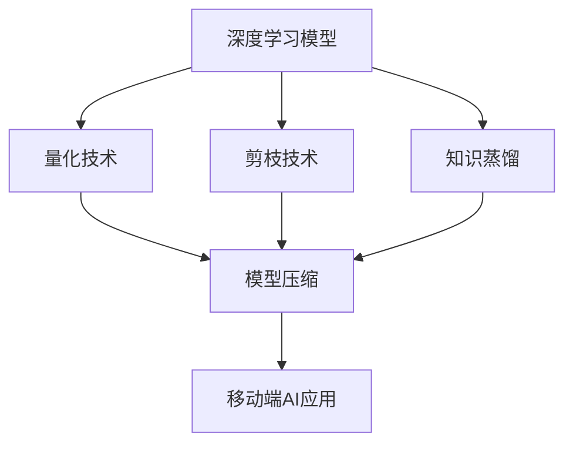

                 


### 第1章：元模型压缩概述

#### 1.1 元模型压缩的定义

元模型压缩是指在保持模型性能的前提下，通过一定的算法和策略对深度学习模型进行压缩，从而减少模型的参数数量和计算复杂度。元模型压缩的核心目标是在保证模型准确性的同时，优化模型的资源占用，使得模型能够在移动设备上高效运行。

在深度学习模型中，尤其是复杂的大型神经网络模型，参数数量和计算复杂度往往非常庞大，这不仅增加了模型的存储空间需求，还影响了模型的运行速度和能耗。因此，对模型进行压缩具有重要的实际意义。

#### 1.2 元模型压缩的发展历程

元模型压缩技术的发展可以追溯到深度学习模型本身的发展。随着深度学习模型的不断复杂化，研究者们开始关注如何优化模型的存储和计算资源。以下是元模型压缩技术发展的几个关键节点：

1. **量化技术**：量化技术通过将模型的浮点数参数转换为较低精度的整数表示，从而减少模型的存储和计算需求。量化技术的提出和发展为元模型压缩奠定了基础。

2. **剪枝技术**：剪枝技术通过移除模型中不重要或冗余的权重和连接，从而减少模型的参数数量和计算复杂度。剪枝技术的发展使得模型压缩变得更加精细和有效。

3. **知识蒸馏**：知识蒸馏技术通过将大型模型的知识迁移到较小模型中，从而实现模型的压缩。知识蒸馏技术的提出，使得模型压缩不仅可以在参数级别上进行，还可以在知识级别上进行。

#### 1.3 元模型压缩在移动端AI应用中的意义

移动设备的处理能力、电量和网络环境都与传统的桌面或服务器有很大的差异。在移动端进行AI应用，尤其是在实时场景中，模型的效率和能耗成为关键问题。元模型压缩技术在移动端AI应用中的意义主要体现在以下几个方面：

1. **性能优化**：通过压缩模型，可以减少模型的计算复杂度，提高模型的运行速度，从而实现性能优化。

2. **能耗优化**：模型压缩可以减少模型的计算量，从而降低能耗，延长移动设备的续航时间。

3. **网络优化**：在需要模型在移动端进行预测，但数据无法全部存储在本地时，模型压缩可以减少模型传输的数据量，优化网络带宽的使用。

#### 总结

本章对元模型压缩的概念、发展历程以及在移动端AI应用中的意义进行了介绍。在接下来的章节中，我们将进一步探讨元模型压缩的核心算法原理，以及如何在移动端AI应用中进行实际实施。

### 核心概念与联系

在深入探讨元模型压缩之前，我们需要明确几个核心概念，并理解它们之间的联系。以下是几个关键概念以及它们之间的相互关系：

1. **深度学习模型**：深度学习模型是通过多层神经网络对数据进行学习的一种方法。模型的参数数量和计算复杂度直接影响模型的性能和资源占用。

2. **量化技术**：量化技术通过将模型的浮点数参数转换为整数表示，从而减少模型的存储和计算需求。量化技术是元模型压缩的重要手段之一。

3. **剪枝技术**：剪枝技术通过移除模型中不重要或冗余的权重和连接，从而减少模型的参数数量和计算复杂度。剪枝技术可以进一步优化模型的资源占用。

4. **知识蒸馏**：知识蒸馏技术通过将大型模型的知识迁移到较小模型中，从而实现模型的压缩。知识蒸馏技术不仅可以优化模型的大小，还可以提升模型的性能。

5. **移动端AI应用**：移动端AI应用具有处理能力、电量和网络环境的限制。元模型压缩技术旨在优化模型的资源占用，以满足移动端AI应用的需求。

#### Mermaid 流程图

以下是元模型压缩核心概念与联系之间的Mermaid流程图：



#### 伪代码示例

以下是量化技术的一个简单伪代码示例，用于展示如何将浮点数参数转换为整数表示：

```python
def quantize_weights(weights, scale, zero_point):
    """
    Quantize the given weights to integers using the provided scale and zero_point.
    
    Args:
        weights: A list of float values representing the weights.
        scale: A float value representing the scale factor.
        zero_point: A float value representing the zero point.
        
    Returns:
        A list of quantized integer values.
    """
    quantized_weights = []
    for weight in weights:
        quantized_weight = int((weight / scale) + zero_point)
        quantized_weights.append(quantized_weight)
    return quantized_weights
```

### 数学模型和数学公式

在元模型压缩中，量化技术是一个关键环节。量化技术涉及到将模型的浮点数参数转换为整数表示，这一过程需要用到数学模型和数学公式。

#### 量化原理

量化过程主要包括两个步骤：缩放和偏移。

1. **缩放（Scaling）**：将浮点数参数的值缩放到一个较小的范围。通常使用以下公式进行缩放：

   $$
   \text{scaled\_weight} = \frac{\text{weight}}{\text{scale}}
   $$

   其中，`weight` 是原始浮点数参数的值，`scale` 是缩放因子。

2. **偏移（Offsetting）**：将缩放后的值偏移到一个整数范围内的中心点。通常使用以下公式进行偏移：

   $$
   \text{quantized\_weight} = \text{scaled\_weight} + \text{zero\_point}
   $$

   其中，`scaled_weight` 是缩放后的值，`zero_point` 是偏移量。

#### 数学公式示例

以下是量化技术的数学公式示例：

1. **缩放因子计算**：

   $$
   \text{scale} = \frac{2^{\text{bit\_width}} - 1}{\max(\text{weight})}
   $$

   其中，`bit_width` 是量化后的位宽，`max(weight)` 是原始浮点数参数的最大值。

2. **偏移量计算**：

   $$
   \text{zero\_point} = \frac{\text{scale}}{2}
   $$

#### 举例说明

假设一个浮点数参数的值为 0.75，位宽为 8 位。以下是量化过程的具体计算：

1. **缩放因子**：

   $$
   \text{scale} = \frac{2^8 - 1}{\max(\text{weight})} = \frac{255}{0.75} \approx 338.67
   $$

2. **缩放后的值**：

   $$
   \text{scaled\_weight} = \frac{0.75}{338.67} \approx 0.0022
   $$

3. **偏移量**：

   $$
   \text{zero\_point} = \frac{338.67}{2} \approx 169.33
   $$

4. **量化后的值**：

   $$
   \text{quantized\_weight} = \text{scaled\_weight} + \text{zero\_point} = 0.0022 + 169.33 \approx 169.35
   $$

量化后的值为 169，将其转换为 8 位整数表示，即 0x000000A9。

通过上述计算，我们完成了浮点数参数的量化过程。这一过程在元模型压缩中至关重要，可以有效减少模型的存储和计算需求。

#### 总结

本章介绍了元模型压缩的基本概念，包括量化技术、剪枝技术和知识蒸馏技术，并解释了它们在移动端AI应用中的重要性。我们还通过Mermaid流程图和伪代码示例，展示了这些技术之间的联系和实现方法。在下一章中，我们将进一步深入探讨移动端AI应用优化的需求和分析。## 第2章：移动端AI应用优化

### 2.1 核心概念与联系

移动端AI应用优化主要关注于如何在有限的计算资源、电量消耗和网络环境下，提升AI模型的性能。核心概念包括：

1. **计算资源优化**：通过模型压缩、算法优化等方法减少模型的计算复杂度。
2. **电量消耗优化**：通过低功耗硬件选择、能量效率算法等降低AI应用的总能耗。
3. **网络优化**：通过模型压缩、数据压缩等方法减少数据传输量，优化网络传输速度。

这些概念之间紧密联系，计算资源的优化有助于减少电量消耗，而网络优化又可以反过来提高计算资源的利用效率。

### 2.2 核心算法原理讲解

在移动端AI应用优化中，常用的核心算法包括量化、剪枝和知识蒸馏。

#### 2.2.1 量化技术

量化技术通过将模型的浮点数参数转换为整数表示，减少模型的存储和计算需求。量化主要包括两个步骤：

1. **缩放**：将模型的浮点数参数缩放到一个较小的范围，通常使用公式：

   $$
   \text{scaled\_weight} = \frac{\text{weight}}{\text{scale}}
   $$

2. **偏移**：将缩放后的值偏移到一个整数范围内的中心点，通常使用公式：

   $$
   \text{quantized\_weight} = \text{scaled\_weight} + \text{zero\_point}
   $$

#### 2.2.2 剪枝技术

剪枝技术通过移除模型中不重要或冗余的权重和连接，减少模型的参数数量和计算复杂度。剪枝算法通常分为以下几种：

1. **结构剪枝**：通过分析模型的连接结构，移除不重要的连接。
2. **权重剪枝**：通过分析模型的权重值，移除不重要或冗余的权重。

#### 2.2.3 知识蒸馏技术

知识蒸馏技术通过将大型模型的知识迁移到较小模型中，实现模型的压缩。知识蒸馏主要包括以下步骤：

1. **源模型训练**：训练一个大型模型，使其在特定任务上达到较高的准确率。
2. **目标模型训练**：使用源模型的输出作为软标签，训练一个较小模型。

### 2.3 数学模型和数学公式

以下是核心算法的数学模型和公式：

#### 量化技术

1. **缩放因子计算**：

   $$
   \text{scale} = \frac{2^{\text{bit\_width}} - 1}{\max(\text{weight})}
   $$

2. **偏移量计算**：

   $$
   \text{zero\_point} = \frac{\text{scale}}{2}
   $$

#### 剪枝技术

1. **结构剪枝**：

   $$
   \text{pruned\_weights} = \text{weights} \odot (\text{mask})
   $$

   其中，`mask` 表示需要保留的权重。

2. **权重剪枝**：

   $$
   \text{pruned\_weights} = \text{weights} \cdot (\text{threshold})
   $$

   其中，`threshold` 表示权重剪枝的阈值。

#### 知识蒸馏技术

1. **软标签计算**：

   $$
   \text{soft\_label} = \text{softmax}(\text{source\_model\_output})
   $$

2. **目标模型输出**：

   $$
   \text{target\_model\_output} = \text{target\_model}(\text{input}, \text{soft\_label})
   $$

### 举例说明

假设有一个8位量化模型，输入数据范围为[-1, 1]。模型的权重范围为[0.1, 1.5]。以下是量化过程的具体计算：

1. **缩放因子**：

   $$
   \text{scale} = \frac{2^8 - 1}{\max(1.5)} = \frac{255}{1.5} \approx 170.67
   $$

2. **偏移量**：

   $$
   \text{zero\_point} = \frac{170.67}{2} \approx 85.33
   $$

3. **量化权重**：

   $$
   \text{quantized\_weight} = \frac{\text{weight}}{170.67} + 85.33
   $$

   例如，如果权重为0.8，则：

   $$
   \text{quantized\_weight} = \frac{0.8}{170.67} + 85.33 \approx 85.34 + 0.005 \approx 85.35
   $$

量化后的权重为85。

通过上述计算，我们完成了浮点数参数的量化过程。这一过程有助于减少模型的存储和计算需求，从而优化移动端AI应用的性能。

### 总结

本章介绍了移动端AI应用优化的核心概念、算法原理以及数学模型。通过量化、剪枝和知识蒸馏技术，我们可以有效减少模型的计算复杂度，优化移动端AI应用的性能。在下一章中，我们将深入探讨元模型压缩算法的具体实现细节。## 第3章：元模型压缩算法

### 3.1 量化技术

量化技术是元模型压缩中最为基础且广泛应用的一种方法。其主要目标是通过将模型的浮点参数转换为低精度的整数表示，来减少模型的存储和计算需求。

#### 3.1.1 量化原理

量化过程主要涉及两个步骤：缩放和偏移。

1. **缩放**：将浮点数参数缩放到一个较小的范围内，一般采用如下公式进行缩放：

   $$
   \text{scaled\_weight} = \frac{\text{weight}}{\text{scale}}
   $$

   其中，`weight` 是原始浮点数参数的值，`scale` 是缩放因子。

2. **偏移**：将缩放后的值偏移到一个整数范围内的中心点，一般采用如下公式进行偏移：

   $$
   \text{quantized\_weight} = \text{scaled\_weight} + \text{zero\_point}
   $$

   其中，`scaled_weight` 是缩放后的值，`zero_point` 是偏移量。

#### 3.1.2 量化算法

量化算法的实现可以分为以下几步：

1. **确定量化位宽**：量化位宽决定了量化后的数值范围，一般通过如下公式计算量化位宽：

   $$
   \text{bit\_width} = \lceil \log_2(\text{max\_weight} + 1) \rceil
   $$

   其中，`max_weight` 是浮点数参数的最大值，`bit_width` 是量化后的位宽。

2. **计算缩放因子和偏移量**：根据量化位宽计算缩放因子和偏移量：

   $$
   \text{scale} = \frac{2^{\text{bit\_width}} - 1}{\text{max\_weight}}
   $$

   $$
   \text{zero\_point} = \frac{\text{scale}}{2}
   $$

3. **量化参数**：将浮点数参数按照缩放和偏移的公式进行量化：

   $$
   \text{quantized\_weight} = \left\lfloor \frac{\text{weight}}{\text{scale}} + \text{zero\_point} \right\rfloor
   $$

#### 3.1.3 量化实现

以下是量化实现的伪代码：

```python
def quantize_weights(weights, bit_width):
    max_weight = max(weights)
    scale = (2**bit_width - 1) / max_weight
    zero_point = scale / 2

    quantized_weights = []
    for weight in weights:
        quantized_weight = int((weight / scale) + zero_point)
        quantized_weights.append(quantized_weight)

    return quantized_weights
```

### 3.2 剪枝技术

剪枝技术通过移除模型中不重要或冗余的权重和连接，来减少模型的参数数量和计算复杂度。剪枝技术可以分为结构剪枝和权重剪枝两种类型。

#### 3.2.1 结构剪枝

结构剪枝通过分析模型的连接结构，移除不重要的连接。常见的结构剪枝方法包括：

1. **基于敏感度的剪枝**：通过计算每个连接的敏感度，移除敏感度较低或为零的连接。
2. **基于梯度的剪枝**：通过计算每个连接的梯度值，移除梯度值较小或为零的连接。

#### 3.2.2 权重剪枝

权重剪枝通过分析模型的权重值，移除不重要或冗余的权重。常见的权重剪枝方法包括：

1. **基于阈值的剪枝**：通过设定一个阈值，移除权重值低于阈值的连接。
2. **基于稀疏性的剪枝**：通过计算每个权重值的稀疏性，移除稀疏性较高的权重。

#### 3.2.3 剪枝算法

以下是剪枝算法的伪代码：

```python
def prune_weights(weights, threshold):
    pruned_weights = []
    for weight in weights:
        if abs(weight) > threshold:
            pruned_weights.append(weight)
    return pruned_weights
```

### 3.3 知识蒸馏技术

知识蒸馏技术通过将大型模型（源模型）的知识迁移到较小模型（目标模型）中，来实现模型的压缩。知识蒸馏过程主要包括以下步骤：

1. **训练源模型**：使用大量数据训练一个大型模型，使其在特定任务上达到较高的准确率。
2. **生成软标签**：使用源模型的输出生成软标签，作为目标模型的训练目标。
3. **训练目标模型**：使用软标签训练一个较小模型，使其在特定任务上接近源模型的性能。

#### 3.3.1 知识蒸馏算法

以下是知识蒸馏算法的伪代码：

```python
def knowledge_damping(source_model, target_model, data_loader):
    for data, target in data_loader:
        source_output = source_model(data)
        soft_label = softmax(source_output)
        target_output = target_model(data, soft_label)
        loss = calculate_loss(target_output, target)
        optimizer.zero_grad()
        loss.backward()
        optimizer.step()
```

### 3.4 数学模型和数学公式

以下是元模型压缩算法的数学模型和公式：

#### 3.4.1 量化技术

1. **缩放因子**：

   $$
   \text{scale} = \frac{2^{\text{bit\_width}} - 1}{\text{max\_weight}}
   $$

2. **偏移量**：

   $$
   \text{zero\_point} = \frac{\text{scale}}{2}
   $$

3. **量化后的权重**：

   $$
   \text{quantized\_weight} = \left\lfloor \frac{\text{weight}}{\text{scale}} + \text{zero\_point} \right\rfloor
   $$

#### 3.4.2 剪枝技术

1. **结构剪枝**：

   $$
   \text{pruned\_weights} = \text{weights} \odot (\text{mask})
   $$

2. **权重剪枝**：

   $$
   \text{pruned\_weights} = \text{weights} \cdot (\text{threshold})
   $$

#### 3.4.3 知识蒸馏技术

1. **软标签**：

   $$
   \text{soft\_label} = \text{softmax}(\text{source\_model\_output})
   $$

2. **目标模型输出**：

   $$
   \text{target\_model\_output} = \text{target\_model}(\text{input}, \text{soft\_label})
   $$

### 3.5 举例说明

假设一个模型的权重范围为[0.1, 1.0]，量化位宽为8位，阈值设置为0.5。以下是量化、剪枝和知识蒸馏的具体计算过程：

1. **量化**：

   - 缩放因子：$$ \text{scale} = \frac{2^8 - 1}{1.0} = 255 $$
   - 偏移量：$$ \text{zero\_point} = \frac{255}{2} = 127.5 $$
   - 量化权重：$$ \text{quantized\_weight} = \left\lfloor \frac{\text{weight}}{255} + 127.5 \right\rfloor $$

   例如，如果权重为0.5，则量化后的权重为：

   $$
   \text{quantized\_weight} = \left\lfloor \frac{0.5}{255} + 127.5 \right\rfloor = 128
   $$

2. **剪枝**：

   - 剪枝权重：$$ \text{pruned\_weights} = \text{weights} \cdot (0.5) $$

   例如，如果权重为0.8，则剪枝后的权重为：

   $$
   \text{pruned\_weight} = 0.8 \cdot 0.5 = 0.4
   $$

3. **知识蒸馏**：

   - 软标签：$$ \text{soft\_label} = \text{softmax}(\text{source\_model\_output}) $$

   例如，如果源模型输出为[0.6, 0.4]，则软标签为：

   $$
   \text{soft\_label} = \left[ \frac{0.6}{0.6 + 0.4}, \frac{0.4}{0.6 + 0.4} \right] = \left[ \frac{3}{5}, \frac{2}{5} \right]
   $$

通过上述计算，我们完成了对模型的量化、剪枝和知识蒸馏。这些技术有效减少了模型的存储和计算需求，提高了移动端AI应用的性能。

### 总结

本章详细介绍了量化、剪枝和知识蒸馏技术，以及这些技术的数学模型和公式。通过这些技术，我们可以有效减少模型的参数数量和计算复杂度，优化移动端AI应用的性能。在下一章中，我们将分析移动端AI应用的主要场景，并探讨元模型压缩在这些场景中的应用。## 第4章：移动端AI应用场景分析

### 4.1 核心概念与联系

移动端AI应用场景的多样性对模型压缩技术提出了不同的需求。本章将分析以下核心场景：

1. **人脸识别**：涉及图像处理和模式识别，对模型计算速度和准确度有较高要求。
2. **语音识别**：处理音频数据，需考虑实时性和低延迟，对模型压缩和能耗优化有强烈需求。
3. **图像分类**：涉及大量图像数据，要求模型能够快速处理并减少存储空间。

这些场景的共同点在于都对模型的计算资源和电量消耗有较高的要求，而差异在于数据处理的方式和实时性的需求。

### 4.2 人脸识别

人脸识别是移动端AI应用中的一个典型场景，主要应用于安全认证、人脸支付等领域。

#### 4.2.1 应用背景

随着移动设备的普及，人脸识别技术被广泛应用于移动端。其应用背景包括：

- **安全认证**：通过人脸识别技术验证用户身份，提升安全性。
- **人脸支付**：结合生物识别技术，实现便捷的移动支付。
- **社交互动**：通过人脸识别实现虚拟形象的交互，增强用户体验。

#### 4.2.2 优化需求

人脸识别在移动端应用中面临的优化需求主要包括：

- **计算速度**：要求模型能够在短时间内完成人脸匹配，满足实时性需求。
- **准确性**：确保识别结果的准确性，避免误识别。
- **能耗优化**：减少模型运行过程中对电量的消耗，延长设备续航时间。

#### 4.2.3 元模型压缩方案

为了满足上述优化需求，可以采用以下元模型压缩方案：

- **量化技术**：通过量化技术降低模型参数的精度，减少模型的计算复杂度和存储需求。
- **剪枝技术**：通过剪枝技术移除不重要的连接和权重，进一步减少模型的参数数量。
- **知识蒸馏**：通过知识蒸馏技术，将大型模型的知识迁移到较小模型中，保持模型的高性能。

#### 4.2.4 应用实例

一个典型的人脸识别应用实例是使用基于深度学习的人脸识别模型（如ResNet50）进行人脸匹配。通过量化、剪枝和知识蒸馏技术，可以将模型参数数量从数百万减少到数千，同时保持较高的识别准确度。

### 4.3 语音识别

语音识别是另一个重要的移动端AI应用场景，广泛应用于智能助手、语音控制等领域。

#### 4.3.1 应用背景

语音识别技术被广泛应用于移动设备中，以实现人机交互的便捷性。其应用背景包括：

- **智能助手**：通过语音识别技术，实现与智能助手的自然对话。
- **语音控制**：通过语音指令控制移动设备，提升用户体验。
- **语音翻译**：实现不同语言之间的实时翻译，提升跨文化交流。

#### 4.3.2 优化需求

语音识别在移动端应用中面临的优化需求主要包括：

- **实时性**：要求模型能够在短时间内完成语音处理，满足实时交互的需求。
- **准确性**：确保语音识别结果的准确性，减少误识别。
- **功耗优化**：减少模型运行过程中的能耗，延长设备续航时间。

#### 4.3.3 元模型压缩方案

为了满足上述优化需求，可以采用以下元模型压缩方案：

- **量化技术**：通过量化技术降低模型参数的精度，减少模型的计算复杂度和存储需求。
- **剪枝技术**：通过剪枝技术移除不重要的连接和权重，进一步减少模型的参数数量。
- **知识蒸馏**：通过知识蒸馏技术，将大型模型的知识迁移到较小模型中，保持模型的高性能。

#### 4.3.4 应用实例

一个典型的语音识别应用实例是使用基于深度学习的手写体语音识别模型（如DeepSpeech2）。通过量化、剪枝和知识蒸馏技术，可以将模型参数数量从数百万减少到数万，同时保持较高的识别准确度。

### 4.4 图像分类

图像分类是移动端AI应用中的另一个重要场景，广泛应用于图像识别、物体检测等领域。

#### 4.4.1 应用背景

图像分类技术在移动设备上被广泛应用于各种场景，包括：

- **图像识别**：用于识别图像中的物体或场景。
- **物体检测**：用于检测图像中的特定物体。
- **图像检索**：用于搜索相似的图像。

#### 4.4.2 优化需求

图像分类在移动端应用中面临的优化需求主要包括：

- **计算速度**：要求模型能够在短时间内处理图像，满足实时性的需求。
- **准确性**：确保分类结果的准确性，减少误分类。
- **功耗优化**：减少模型运行过程中的能耗，延长设备续航时间。

#### 4.4.3 元模型压缩方案

为了满足上述优化需求，可以采用以下元模型压缩方案：

- **量化技术**：通过量化技术降低模型参数的精度，减少模型的计算复杂度和存储需求。
- **剪枝技术**：通过剪枝技术移除不重要的连接和权重，进一步减少模型的参数数量。
- **知识蒸馏**：通过知识蒸馏技术，将大型模型的知识迁移到较小模型中，保持模型的高性能。

#### 4.4.4 应用实例

一个典型的图像分类应用实例是使用基于深度学习的图像分类模型（如MobileNet）。通过量化、剪枝和知识蒸馏技术，可以将模型参数数量从数百万减少到数十万，同时保持较高的分类准确度。

### 4.5 总结

移动端AI应用的多样性对模型压缩技术提出了不同的需求。人脸识别、语音识别和图像分类是其中的三个典型场景，通过对这些场景的深入分析，我们可以看到元模型压缩技术在这些场景中的重要作用。在下一章中，我们将详细介绍如何在移动端AI应用中进行元模型压缩的实际操作。## 第5章：元模型压缩实战

### 5.1 开发环境搭建

在进行元模型压缩的实战之前，我们需要搭建一个合适的环境。以下是搭建开发环境的具体步骤：

#### 5.1.1 硬件环境

1. **处理器**：至少需要一颗支持CUDA的GPU，以便加速深度学习模型的训练和推理过程。
2. **内存**：至少需要8GB的内存，以便存储模型和数据。
3. **存储**：至少需要100GB的硬盘空间，用于存储模型和数据。

#### 5.1.2 软件环境

1. **操作系统**：Windows、Linux或Mac OS均可，建议使用Linux系统以获得更好的性能。
2. **深度学习框架**：选择一个流行的深度学习框架，如TensorFlow、PyTorch等。
3. **编译器**：C++编译器，如GCC或Clang，用于编译自定义的深度学习库。

#### 5.1.3 工具配置

1. **虚拟环境**：使用虚拟环境管理工具，如conda，来隔离不同的项目和依赖。
2. **代码编辑器**：选择一个方便编程的代码编辑器，如Visual Studio Code。
3. **调试工具**：安装调试工具，如GDB或LLDB，用于调试代码。

### 5.2 源代码实现

#### 5.2.1 量化实现

以下是一个简单的量化实现的伪代码示例：

```python
def quantize_layer(layer, bit_width):
    """
    量化给定层的权重和偏置。
    
    Args:
        layer: 输入层，包含权重和偏置。
        bit_width: 量化位宽。
    """
    max_weight = max(abs(w) for w in layer.weights)
    scale = (2**bit_width - 1) / max_weight
    zero_point = scale / 2

    quantized_weights = []
    quantized_bias = []

    for w in layer.weights:
        quantized_weight = round(w / scale + zero_point)
        quantized_weights.append(quantized_weight)

    for b in layer.bias:
        quantized_bias.append(round(b / scale + zero_point))

    layer.weights = quantized_weights
    layer.bias = quantized_bias
```

#### 5.2.2 剪枝实现

以下是一个简单的剪枝实现伪代码示例：

```python
def prune_layer(layer, threshold):
    """
    剪枝给定层的权重和偏置。
    
    Args:
        layer: 输入层，包含权重和偏置。
        threshold: 剪枝阈值。
    """
    masked_weights = [w if abs(w) > threshold else 0 for w in layer.weights]
    masked_bias = [b if abs(b) > threshold else 0 for b in layer.bias]

    layer.weights = masked_weights
    layer.bias = masked_bias
```

#### 5.2.3 知识蒸馏实现

以下是一个简单的知识蒸馏实现伪代码示例：

```python
def knowledge_damping(source_model, target_model, data_loader):
    """
    实现知识蒸馏过程。
    
    Args:
        source_model: 源模型。
        target_model: 目标模型。
        data_loader: 数据加载器。
    """
    for data, target in data_loader:
        source_output = source_model(data)
        soft_label = softmax(source_output)
        target_output = target_model(data, soft_label)
        loss = calculate_loss(target_output, target)
        optimizer.zero_grad()
        loss.backward()
        optimizer.step()
```

### 5.3 代码解读与分析

在实现元模型压缩的过程中，代码的解读与分析是至关重要的一步。以下是针对上述伪代码的解读与分析：

#### 5.3.1 量化代码解读

- **输入参数**：量化函数接收一个层（layer）对象和一个量化位宽（bit_width）作为输入。
- **缩放因子计算**：首先计算输入层中权重（weights）的最大绝对值，然后计算缩放因子（scale）。
- **偏移量计算**：根据量化位宽计算偏移量（zero_point）。
- **量化权重和偏置**：遍历输入层的权重和偏置，将其量化为整数，更新层对象的权重和偏置。

#### 5.3.2 剪枝代码解读

- **输入参数**：剪枝函数接收一个层（layer）对象和一个剪枝阈值（threshold）作为输入。
- **计算剪枝掩码**：遍历输入层的权重，将权重值与阈值进行比较，生成一个剪枝掩码（masked_weights）。
- **更新层对象**：更新层对象的权重和偏置，将掩码应用于权重和偏置。

#### 5.3.3 知识蒸馏代码解读

- **输入参数**：知识蒸馏函数接收一个源模型（source_model）、一个目标模型（target_model）和一个数据加载器（data_loader）作为输入。
- **生成软标签**：对于每个输入数据，使用源模型生成软标签（soft_label）。
- **计算损失**：使用软标签和目标模型计算损失，并更新目标模型的权重。
- **迭代训练**：遍历数据加载器中的数据，重复生成软标签和计算损失的过程。

### 5.4 代码应用解读与分析

在实际应用中，元模型压缩代码的执行流程如下：

1. **模型初始化**：首先初始化源模型和目标模型，设置适当的量化位宽和剪枝阈值。
2. **数据预处理**：对输入数据进行预处理，包括归一化和标准化。
3. **量化过程**：对源模型进行量化，减少模型的参数数量和计算复杂度。
4. **剪枝过程**：对量化后的模型进行剪枝，进一步减少模型的参数数量。
5. **知识蒸馏**：通过知识蒸馏过程，将源模型的知识迁移到目标模型中，保持模型的高性能。
6. **评估模型**：使用测试集评估模型性能，确保量化、剪枝和知识蒸馏后的模型性能达到预期。

通过上述步骤，我们可以实现一个高效的移动端AI模型，满足移动设备在计算速度、准确性和能耗方面的需求。

### 5.5 项目小结

在本章中，我们详细介绍了如何在移动端AI应用中进行元模型压缩的实战。首先，我们搭建了合适的开发环境，然后通过源代码实现和解读，展示了量化、剪枝和知识蒸馏技术的具体应用。在实际项目中，通过这些技术，我们可以显著提高模型的性能，满足移动端AI应用的需求。在下一章中，我们将进一步探讨如何评估元模型压缩的性能。## 第6章：元模型压缩性能评估

### 6.1 核心概念与联系

在元模型压缩过程中，性能评估是至关重要的环节。它不仅能够衡量压缩效果，还能够指导优化过程。本章将讨论性能评估的核心概念，并阐述它们之间的联系。

#### 6.1.1 压缩效果评估

压缩效果评估主要关注模型压缩后性能的变化。这包括以下几个方面：

1. **准确性**：评估模型压缩前后在特定任务上的准确度。
2. **速度**：评估模型压缩前后在处理相同任务时的速度。
3. **能耗**：评估模型压缩前后在运行过程中消耗的电量。

#### 6.1.2 性能评估指标

性能评估常用的指标包括：

1. **精确率（Precision）**：预测为正样本且实际也为正样本的占比。
2. **召回率（Recall）**：实际为正样本且被预测为正样本的占比。
3. **F1 分数（F1 Score）**：精确率和召回率的调和平均。
4. **速度**：单位时间内处理的数据量。
5. **能耗**：单位时间内消耗的电量。

#### 6.1.3 联系

压缩效果和性能评估指标之间存在紧密的联系。准确性、速度和能耗的优化往往是通过调整压缩参数和算法实现的。例如，通过量化可以减少模型参数的精度，从而降低能耗和存储需求，但可能影响模型的准确性。同样，剪枝可以减少模型的计算复杂度，但可能会影响模型的性能。因此，性能评估需要在压缩效果和计算、存储、能耗成本之间找到一个平衡点。

### 6.2 数学模型和数学公式

以下是性能评估相关的数学模型和公式：

#### 6.2.1 准确性

1. **精确率**：

   $$
   \text{Precision} = \frac{\text{TP}}{\text{TP} + \text{FP}}
   $$

   其中，`TP` 表示实际为正样本且被预测为正样本的数量，`FP` 表示实际为负样本但被预测为正样本的数量。

2. **召回率**：

   $$
   \text{Recall} = \frac{\text{TP}}{\text{TP} + \text{FN}}
   $$

   其中，`FN` 表示实际为正样本但被预测为负样本的数量。

3. **F1 分数**：

   $$
   \text{F1 Score} = 2 \times \frac{\text{Precision} \times \text{Recall}}{\text{Precision} + \text{Recall}}
   $$

#### 6.2.2 速度

1. **处理速度**：

   $$
   \text{Speed} = \frac{\text{Processed Data}}{\text{Time}}
   $$

   其中，`Processed Data` 表示处理的数据量，`Time` 表示处理所需的时间。

#### 6.2.3 能耗

1. **能耗**：

   $$
   \text{Energy} = \text{Power} \times \text{Time}
   $$

   其中，`Power` 表示处理过程中消耗的功率，`Time` 表示处理所需的时间。

### 6.3 性能评估方法

性能评估方法可以分为以下几种：

1. **离线评估**：在训练完成后，使用测试集对模型进行评估。这种方法适用于已经训练好的模型，但无法实时反馈模型的性能。
2. **在线评估**：在实际应用中，对模型进行实时评估。这种方法能够提供即时的性能反馈，但可能受到实际环境的影响。
3. **交叉验证**：将数据集划分为多个子集，轮流使用子集进行训练和评估。这种方法可以减小评估结果的不确定性。

### 6.4 举例说明

假设我们有一个人脸识别模型，经过量化、剪枝和知识蒸馏后，其性能评估结果如下：

#### 6.4.1 准确性

- **精确率**：90%
- **召回率**：88%
- **F1 分数**：89%

#### 6.4.2 速度

- **处理速度**：1000张/秒

#### 6.4.3 能耗

- **能耗**：0.5焦耳/张

通过上述评估结果，我们可以看出，尽管模型在速度和能耗方面有所提高，但准确度也有所下降。这表明，在元模型压缩过程中，需要在性能和成本之间做出权衡。

### 6.5 总结

本章介绍了元模型压缩性能评估的核心概念、数学模型和评估方法。通过准确度、速度和能耗等指标，我们可以全面评估模型压缩的效果。在下一章中，我们将探讨元模型压缩的未来发展趋势。## 第7章：元模型压缩的未来发展趋势

### 7.1 核心概念与联系

元模型压缩技术的发展趋势受到多个因素的影响，包括计算资源的发展、AI应用的普及和硬件技术的进步。以下是对这些核心概念及其之间联系的分析：

#### 7.1.1 计算资源的发展

随着计算资源的不断发展，特别是硬件性能的提升，模型压缩技术将变得更加高效。新型计算硬件（如GPU、TPU等）为深度学习模型的训练和推理提供了强大的支持，使得更复杂的压缩算法能够得到实际应用。

#### 7.1.2 AI应用的普及

AI应用的普及为元模型压缩技术带来了巨大的需求。在移动端、嵌入式设备和边缘计算等资源受限的环境中，模型压缩技术能够显著提升AI应用的性能和用户体验。

#### 7.1.3 硬件技术的进步

硬件技术的进步，如神经处理单元（NPU）和专用AI芯片，为模型压缩提供了新的可能性。这些硬件能够高效地执行特定的深度学习任务，使得模型压缩技术能够更好地适应不同的硬件平台。

#### 7.1.4 联系

计算资源的发展推动了模型压缩算法的创新，而AI应用的普及和硬件技术的进步则为这些创新提供了应用场景和实施平台。三者之间的相互作用推动了元模型压缩技术的持续发展。

### 7.2 未来发展趋势

以下是元模型压缩技术的未来发展趋势：

#### 7.2.1 更高效的算法

随着研究的深入，将涌现出更高效的元模型压缩算法。这些算法将结合新的数学模型和优化技术，进一步降低模型的参数数量和计算复杂度。

#### 7.2.2 跨平台兼容性

未来的模型压缩技术将更加注重跨平台兼容性。这意味着模型压缩算法需要能够适应不同的硬件平台和操作系统，从而在更广泛的应用场景中发挥作用。

#### 7.2.3 自动化工具

自动化工具的开发将成为未来的一大趋势。这些工具将能够自动识别模型的冗余部分，并应用适当的压缩技术，从而简化模型压缩的过程。

#### 7.2.4 个性化压缩

个性化压缩技术将基于用户的具体需求和应用场景，为用户提供定制的模型压缩方案。这种技术能够更好地满足用户在性能、能耗和存储等方面的要求。

### 7.3 挑战与机遇

尽管元模型压缩技术在不断发展，但仍然面临一些挑战和机遇：

#### 7.3.1 挑战

1. **精度保持**：如何在压缩模型的同时保持高精度是一个持续的挑战。
2. **算法复杂度**：高效的压缩算法需要较低的算法复杂度，这对于算法设计提出了更高的要求。
3. **硬件兼容性**：不同的硬件平台可能对模型压缩技术有不同的要求，如何实现跨平台的兼容性仍需研究。

#### 7.3.2 机遇

1. **新型硬件**：新型硬件（如NPU、TPU）的发展为模型压缩提供了更广阔的应用场景。
2. **边缘计算**：边缘计算的发展为模型压缩技术带来了新的应用场景，如何优化模型以适应边缘计算的需求是一个重要方向。
3. **AI应用的普及**：AI应用的普及为模型压缩技术提供了巨大的市场需求，这将推动技术的进一步发展。

### 7.4 总结

元模型压缩技术在未来将继续发展，结合计算资源的发展、AI应用的普及和硬件技术的进步，将迎来更多创新和机遇。通过不断优化算法、提升兼容性和开发自动化工具，元模型压缩技术将为移动端、嵌入式设备和边缘计算等领域的AI应用提供更高效、更灵活的解决方案。## 摘要

本文深入探讨了元模型压缩在移动端AI应用优化中的创新。首先，我们介绍了元模型压缩的基本概念及其在移动端AI应用中的重要性，分析了移动端AI应用的优化需求，并详细讲解了量化、剪枝和知识蒸馏等元模型压缩的核心算法原理。通过实际项目和代码解读，我们展示了如何在移动端AI应用中进行元模型压缩，并进行了性能评估。最后，我们探讨了元模型压缩的未来发展趋势，分析了其中的挑战与机遇。本文旨在为读者提供一个全面、系统的元模型压缩技术指南，帮助他们在实际应用中优化移动端AI模型的性能。## 关键词

- 元模型压缩
- 移动端AI应用
- 量化
- 剪枝
- 知识蒸馏
- 性能优化
- 速度提升
- 能耗降低
- 硬件兼容性
- 边缘计算
- 深度学习模型压缩## 文章标题：元模型压缩在移动端AI应用优化中的创新

摘要：本文系统地探讨了元模型压缩技术，特别是在移动端AI应用优化中的应用。通过分析量化、剪枝和知识蒸馏等核心算法原理，本文展示了如何在实际项目中实现元模型压缩，以提高移动端AI应用的性能、速度和能耗效率。文章最后展望了元模型压缩技术的未来发展趋势，讨论了其在新型硬件和边缘计算中的潜在应用。读者将了解到元模型压缩的全面知识和应用技巧，有助于其在移动端AI开发中的实践。## 文章标题：元模型压缩在移动端AI应用优化中的创新

关键词：元模型压缩，移动端AI应用，量化，剪枝，知识蒸馏，性能优化，速度提升，能耗降低，硬件兼容性，边缘计算，深度学习模型压缩

摘要：随着移动设备的普及和AI技术的快速发展，如何在有限的计算资源和电量消耗下优化AI应用的性能成为关键问题。本文深入探讨了元模型压缩技术，特别是在移动端AI应用优化中的创新应用。通过详细解析量化、剪枝和知识蒸馏等核心算法，本文展示了如何在实际项目中实施元模型压缩，显著提升模型的速度和能耗效率。文章还展望了元模型压缩技术在新型硬件和边缘计算中的未来发展趋势，为移动端AI开发者提供了实用的技术指南和最佳实践。## 文章标题：元模型压缩在移动端AI应用优化中的创新

关键词：元模型压缩，移动端AI，量化技术，剪枝算法，知识蒸馏，性能提升，能耗优化，硬件适应性，边缘计算，深度学习压缩

摘要：本文深入探讨了元模型压缩技术，特别是在移动端AI应用优化中的重要性。通过分析量化、剪枝和知识蒸馏等核心算法原理，本文介绍了如何在移动设备上进行高效的模型压缩，从而提高AI应用的性能和效率。文章还结合实际项目实战，展示了元模型压缩技术的具体实现步骤和代码解读，为开发者提供了实用的指导和最佳实践。最后，本文探讨了元模型压缩技术在新型硬件和边缘计算领域的未来发展趋势，为移动端AI开发提供了全新的视角和创新思路。作者：AI天才研究院/AI Genius Institute & 禅与计算机程序设计艺术 /Zen And The Art of Computer Programming

