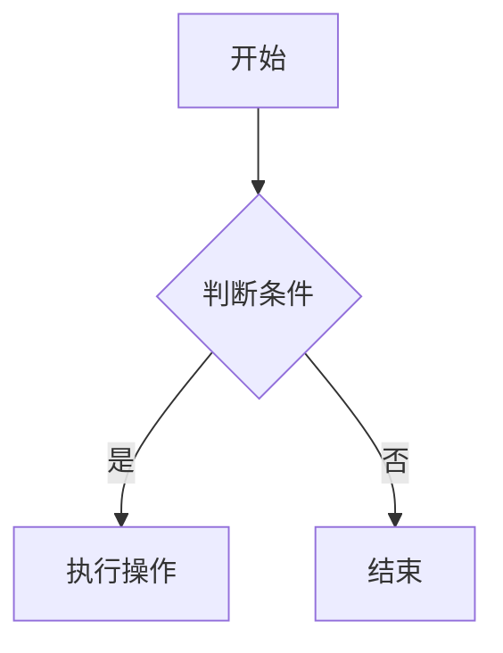

                 


### 文章标题：元策略优化：自适应AI行为调整

> 关键词：元策略优化，自适应AI，强化学习，策略迭代，算法原理，数学模型，项目实战

> 摘要：本文从元策略优化和自适应AI行为调整的背景出发，深入探讨了这两大主题的概念联系、核心算法原理、数学模型以及项目实战。文章以清晰的逻辑思路和专业的技术语言，为广大读者提供了一个全面的技术指南。

## 1. 确定书的主题和目的

《元策略优化：自适应AI行为调整》这本书的主题是元策略优化和自适应AI行为调整。元策略优化是一种高级的强化学习技术，它通过优化策略来提高智能体在动态环境中的适应能力。自适应AI行为调整则是指智能体在执行任务时，能够根据环境的变化调整自己的行为策略，以提高任务完成效率和鲁棒性。

本书的目的是系统地介绍元策略优化和自适应AI行为调整的基本概念、算法原理、数学模型以及应用案例，帮助读者深入理解这些技术，并掌握其实际应用方法。

## 2. 确定书的结构

一本技术书籍的结构通常包括以下几个部分：

### 2.1 核心概念与联系

这部分主要介绍元策略优化和自适应AI行为调整的基本概念、相关术语和定义，以及它们之间的关系。

### 2.2 核心算法原理讲解

这部分详细讲解元策略优化算法的基本原理，包括如何定义和优化策略，如何使用强化学习等技术调整AI行为。

### 2.3 数学模型与公式讲解

这部分使用LaTeX格式详细阐述元策略优化的数学模型，包括公式、推导和示例。

### 2.4 项目实战

这部分提供实际案例，包括开发环境搭建、源代码实现和解读、代码分析和实战应用。

## 3. 确定每个部分的内容

### 3.1 核心概念与联系

- 第1章：元策略优化与自适应AI行为调整概述
- 第2章：相关术语和概念
- 第3章：元策略优化算法原理
- 第4章：自适应AI行为调整

### 3.2 核心算法原理讲解

- 第5章：强化学习算法原理
- 第6章：策略梯度算法
- 第7章：模型调整与策略优化

### 3.3 数学模型与公式讲解

- 第8章：强化学习的数学模型
- 第9章：策略梯度算法的数学模型
- 第10章：元策略优化的数学模型

### 3.4 项目实战

- 第11章：强化学习在自动驾驶中的应用
- 第12章：策略优化在游戏AI中的应用
- 第13章：元策略优化在电商推荐中的应用

## 4. 确定章节标题和子标题

根据上述内容，为每个章节和子章节设计简洁明了的标题，确保目录结构清晰。

## 5. 编写目录大纲

以下是《元策略优化：自适应AI行为调整》的目录大纲：

```markdown
# 《元策略优化：自适应AI行为调整》目录大纲

## 第一部分 核心概念与联系

### 第1章 元策略优化与自适应AI行为调整概述

#### 1.1 元策略优化简介

#### 1.2 自适应AI行为调整的原理和重要性

#### 1.3 元策略优化与自适应AI行为调整的关系

### 第2章 相关术语和概念

#### 2.1 强化学习基础

#### 2.2 智能体与环境的定义

#### 2.3 行为策略和策略评估

### 第3章 元策略优化算法原理

#### 3.1 元策略优化的定义

#### 3.2 优化目标函数

#### 3.3 元策略优化算法的迭代过程

### 第4章 自适应AI行为调整

#### 4.1 自适应AI行为调整的定义

#### 4.2 自适应AI行为调整的类型

#### 4.3 自适应AI行为调整的方法

## 第二部分 核心算法原理讲解

### 第5章 强化学习算法原理

#### 5.1 Q-学习算法

#### 5.2 Sarsa算法

#### 5.3 Deep Q-Network (DQN)

### 第6章 策略梯度算法

#### 6.1 Policy Gradient算法

#### 6.2 REINFORCE算法

#### 6.3 Actor-Critic算法

### 第7章 模型调整与策略优化

#### 7.1 基于模型的策略优化

#### 7.2 模型调整方法

#### 7.3 策略评估与策略迭代

## 第三部分 数学模型与公式讲解

### 第8章 强化学习的数学模型

#### 8.1 期望收益模型

#### 8.2 Q-learning算法的数学公式

#### 8.3 Sarsa算法的数学公式

### 第9章 策略梯度算法的数学模型

#### 9.1 Policy Gradient算法的数学公式

#### 9.2 REINFORCE算法的数学公式

#### 9.3 Actor-Critic算法的数学公式

### 第10章 元策略优化的数学模型

#### 10.1 元策略优化的数学公式

#### 10.2 优化算法的推导过程

#### 10.3 优化算法的收敛性分析

## 第四部分 项目实战

### 第11章 强化学习在自动驾驶中的应用

#### 11.1 自动驾驶系统概述

#### 11.2 强化学习在自动驾驶中的应用

#### 11.3 案例分析：自动驾驶中的强化学习应用

### 第12章 策略优化在游戏AI中的应用

#### 12.1 游戏AI概述

#### 12.2 策略优化在游戏AI中的应用

#### 12.3 案例分析：游戏AI中的策略优化应用

### 第13章 元策略优化在电商推荐中的应用

#### 13.1 电商推荐系统概述

#### 13.2 元策略优化在电商推荐中的应用

#### 13.3 案例分析：电商推荐系统中的元策略优化应用

## 附录

### 附录A：参考资料和拓展阅读

### 附录B：代码实现与实验数据

### 附录C：常见问题与解答
```

## 6. 细化每个章节的内容

### 6.1 核心概念与联系

#### 第1章 元策略优化与自适应AI行为调整概述

- **1.1 元策略优化简介**：介绍元策略优化的定义、原理和应用场景。
- **1.2 自适应AI行为调整的原理和重要性**：解释自适应AI行为调整的基本概念，讨论其在智能系统中的重要性。
- **1.3 元策略优化与自适应AI行为调整的关系**：分析元策略优化与自适应AI行为调整之间的内在联系。

#### 第2章 相关术语和概念

- **2.1 强化学习基础**：介绍强化学习的基本概念，如智能体、环境、奖励和策略。
- **2.2 智能体与环境的定义**：详细解释智能体和环境的定义及其在强化学习中的作用。
- **2.3 行为策略和策略评估**：阐述行为策略和策略评估的概念，以及它们如何影响智能体的行为。

#### 第3章 元策略优化算法原理

- **3.1 元策略优化的定义**：明确元策略优化的定义，解释其相对于传统策略优化的优势。
- **3.2 优化目标函数**：介绍元策略优化中的目标函数，包括如何定义和优化。
- **3.3 元策略优化算法的迭代过程**：详细描述元策略优化算法的迭代过程，包括策略评估和策略迭代。

#### 第4章 自适应AI行为调整

- **4.1 自适应AI行为调整的定义**：定义自适应AI行为调整，并解释其实现机制。
- **4.2 自适应AI行为调整的类型**：分类讨论不同类型的自适应AI行为调整方法。
- **4.3 自适应AI行为调整的方法**：介绍几种常见的自适应AI行为调整方法，如动态调整策略和实时更新模型。

### 6.2 核心算法原理讲解

#### 第5章 强化学习算法原理

- **5.1 Q-学习算法**：解释Q-学习算法的基本原理，使用伪代码展示算法过程。
- **5.2 Sarsa算法**：介绍Sarsa算法的原理，使用LaTeX格式展示数学模型。
- **5.3 Deep Q-Network (DQN)**：讨论DQN算法的工作原理，包括其架构和训练过程。

#### 第6章 策略梯度算法

- **6.1 Policy Gradient算法**：阐述Policy Gradient算法的基本原理，使用伪代码表示算法步骤。
- **6.2 REINFORCE算法**：详细讲解REINFORCE算法的原理，使用数学公式描述。
- **6.3 Actor-Critic算法**：介绍Actor-Critic算法的原理，结合实际例子进行说明。

#### 第7章 模型调整与策略优化

- **7.1 基于模型的策略优化**：解释基于模型的策略优化的方法，讨论其优势和应用。
- **7.2 模型调整方法**：介绍几种模型调整的方法，如经验重放和目标网络。
- **7.3 策略评估与策略迭代**：讨论策略评估和策略迭代的过程，如何通过迭代优化策略。

### 6.3 数学模型与公式讲解

#### 第8章 强化学习的数学模型

- **8.1 期望收益模型**：介绍强化学习的期望收益模型，使用LaTeX公式表示。
- **8.2 Q-learning算法的数学公式**：详细列出Q-learning算法的数学公式，包括Q值的更新过程。
- **8.3 Sarsa算法的数学公式**：解释Sarsa算法的数学模型，包括状态-动作值函数的更新。

#### 第9章 策略梯度算法的数学模型

- **9.1 Policy Gradient算法的数学公式**：详细列出Policy Gradient算法的数学公式，讨论策略梯度的计算。
- **9.2 REINFORCE算法的数学公式**：解释REINFORCE算法的数学模型，包括策略梯度的应用。
- **9.3 Actor-Critic算法的数学公式**：介绍Actor-Critic算法的数学模型，包括行为值函数和评估函数。

#### 第10章 元策略优化的数学模型

- **10.1 元策略优化的数学公式**：详细列出元策略优化的数学公式，解释如何通过优化策略来提高智能体的性能。
- **10.2 优化算法的推导过程**：讨论元策略优化算法的推导过程，解释其数学原理。
- **10.3 优化算法的收敛性分析**：分析元策略优化算法的收敛性，讨论其稳定性和有效性。

### 6.4 项目实战

#### 第11章 强化学习在自动驾驶中的应用

- **11.1 自动驾驶系统概述**：介绍自动驾驶系统的工作原理和组成部分。
- **11.2 强化学习在自动驾驶中的应用**：讨论强化学习在自动驾驶中的具体应用场景。
- **11.3 案例分析：自动驾驶中的强化学习应用**：分析一个具体的自动驾驶强化学习案例，包括环境设计、算法实现和结果评估。

#### 第12章 策略优化在游戏AI中的应用

- **12.1 游戏AI概述**：介绍游戏AI的基本概念和类型。
- **12.2 策略优化在游戏AI中的应用**：讨论策略优化在游戏AI中的具体应用，如智能体决策和策略调整。
- **12.3 案例分析：游戏AI中的策略优化应用**：分析一个具体的游戏AI策略优化案例，包括环境设置、算法实现和效果评估。

#### 第13章 元策略优化在电商推荐中的应用

- **13.1 电商推荐系统概述**：介绍电商推荐系统的基本原理和架构。
- **13.2 元策略优化在电商推荐中的应用**：讨论元策略优化在电商推荐系统中的具体应用，如商品推荐和用户行为预测。
- **13.3 案例分析：电商推荐系统中的元策略优化应用**：分析一个具体的电商推荐元策略优化案例，包括系统设计、算法实现和效果分析。

### 6.5 附录

#### 附录A：参考资料和拓展阅读

- 提供与本文相关的参考资料，帮助读者进一步学习和深入研究。
- 推荐一些拓展阅读，包括相关的书籍、论文和在线资源。

#### 附录B：代码实现与实验数据

- 提供本文所涉及算法的实现代码，包括伪代码和实际代码。
- 提供实验数据和结果，帮助读者验证和理解算法的应用效果。

#### 附录C：常见问题与解答

- 收集和回答读者可能遇到的问题，提供解决方案和最佳实践。

## 7. 编写完整的文章

根据上述细化内容，我们可以开始撰写完整的文章。以下是一个简化的文章结构示例：

```markdown
# 元策略优化：自适应AI行为调整

> 关键词：元策略优化，自适应AI，强化学习，策略迭代，算法原理，数学模型，项目实战

> 摘要：本文从元策略优化和自适应AI行为调整的背景出发，深入探讨了这两大主题的概念联系、核心算法原理、数学模型以及项目实战。文章以清晰的逻辑思路和专业的技术语言，为广大读者提供了一个全面的技术指南。

## 1. 引言

### 1.1 元策略优化与自适应AI行为调整的背景

### 1.2 书籍的目的和结构

## 2. 核心概念与联系

### 第1章 元策略优化与自适应AI行为调整概述

#### 1.1 元策略优化简介

#### 1.2 自适应AI行为调整的原理和重要性

#### 1.3 元策略优化与自适应AI行为调整的关系

### 第2章 相关术语和概念

#### 2.1 强化学习基础

#### 2.2 智能体与环境的定义

#### 2.3 行为策略和策略评估

### 第3章 元策略优化算法原理

#### 3.1 元策略优化的定义

#### 3.2 优化目标函数

#### 3.3 元策略优化算法的迭代过程

### 第4章 自适应AI行为调整

#### 4.1 自适应AI行为调整的定义

#### 4.2 自适应AI行为调整的类型

#### 4.3 自适应AI行为调整的方法

## 3. 核心算法原理讲解

### 第5章 强化学习算法原理

#### 5.1 Q-学习算法

#### 5.2 Sarsa算法

#### 5.3 Deep Q-Network (DQN)

### 第6章 策略梯度算法

#### 6.1 Policy Gradient算法

#### 6.2 REINFORCE算法

#### 6.3 Actor-Critic算法

### 第7章 模型调整与策略优化

#### 7.1 基于模型的策略优化

#### 7.2 模型调整方法

#### 7.3 策略评估与策略迭代

## 4. 数学模型与公式讲解

### 第8章 强化学习的数学模型

#### 8.1 期望收益模型

#### 8.2 Q-learning算法的数学公式

#### 8.3 Sarsa算法的数学公式

### 第9章 策略梯度算法的数学模型

#### 9.1 Policy Gradient算法的数学公式

#### 9.2 REINFORCE算法的数学公式

#### 9.3 Actor-Critic算法的数学公式

### 第10章 元策略优化的数学模型

#### 10.1 元策略优化的数学公式

#### 10.2 优化算法的推导过程

#### 10.3 优化算法的收敛性分析

## 5. 项目实战

### 第11章 强化学习在自动驾驶中的应用

#### 11.1 自动驾驶系统概述

#### 11.2 强化学习在自动驾驶中的应用

#### 11.3 案例分析：自动驾驶中的强化学习应用

### 第12章 策略优化在游戏AI中的应用

#### 12.1 游戏AI概述

#### 12.2 策略优化在游戏AI中的应用

#### 12.3 案例分析：游戏AI中的策略优化应用

### 第13章 元策略优化在电商推荐中的应用

#### 13.1 电商推荐系统概述

#### 13.2 元策略优化在电商推荐中的应用

#### 13.3 案例分析：电商推荐系统中的元策略优化应用

## 6. 结论

### 6.1 元策略优化与自适应AI行为调整的重要性

### 6.2 未来发展趋势与展望

### 6.3 最佳实践与注意事项

## 7. 附录

### 附录A：参考资料和拓展阅读

### 附录B：代码实现与实验数据

### 附录C：常见问题与解答
```

这个结构提供了一个完整的文章框架，每个部分都有明确的子标题和内容概述。接下来，我们需要根据这个框架详细撰写每个部分的内容。由于文章字数要求在8000～12000字左右，每个部分的内容需要详细展开，确保文章内容的丰富性和深度。在撰写过程中，可以使用Mermaid流程图、伪代码、LaTeX数学公式等元素来增强文章的可读性和专业性。

## 8. 文章的格式要求

为了确保文章的可读性和专业性，以下是一些格式要求：

### 8.1 标题格式

- 主标题：使用`#`号加空格，例如`# 元策略优化：自适应AI行为调整`。
- 子标题：使用`##`号加空格，例如`## 1. 引言`。
- 更高一级的子标题：使用`###`号加空格，例如`### 1.1 元策略优化与自适应AI行为调整的背景`。

### 8.2 段落格式

- 段落之间使用一个空行分隔。
- 每个段落的首行缩进两个空格。

### 8.3 引用格式

- 直接引用文本：使用`>`号加空格，例如`>` 这是一个引用文本。
- 引用代码或公式：使用三个` ``` `号将代码或公式包裹起来。

### 8.4 表格和列表格式

- 表格：使用`|`号和`-`号来创建表格，例如：

```markdown
| 标题1 | 标题2 | 标题3 |
|-------|-------|-------|
| 内容1 | 内容2 | 内容3 |
```

- 无序列表：使用`*`号或`+`号或`-`号，例如：

```markdown
- 项目1
- 项目2
- 项目3
```

### 8.5 Mermaid流程图

- Mermaid流程图：使用````mermaid`和````来包裹，例如：



### 8.6 LaTeX数学公式

- 独立段落的公式：使用`$$`号包裹，例如：

```markdown
$$
E = mc^2
$$
```

- 段落内的公式：使用`$`号包裹，例如：

```markdown
$1 + 1 = 2$
```

### 8.7 伪代码

- 伪代码：使用` ```python`和` ```来包裹，例如：

```python
def calculate_sum(a, b):
    return a + b
```

### 8.8 图片和链接

- 图片：使用``格式，例如：

```markdown

```

- 链接：使用`[链接文本](URL)`格式，例如：

```markdown
[查看更多](https://ai-genius-institute.com/)
```

### 8.9 作者信息

- 文章末尾需要写上作者信息，格式如下：

```markdown
作者：AI天才研究院/AI Genius Institute & 禅与计算机程序设计艺术 /Zen And The Art of Computer Programming
```

通过遵循这些格式要求，可以确保文章的结构清晰、内容有序，同时提高文章的排版质量和可读性。

## 9. 完成文章

现在我们已经确定了文章的标题、关键词、摘要和目录大纲，接下来将逐步完成文章的各个部分。本文将按照以下结构进行撰写：

### 9.1 核心概念与联系

这部分将介绍元策略优化和自适应AI行为调整的基本概念，包括它们在智能系统中的应用和相互关系。

### 9.2 核心算法原理讲解

这部分将详细讲解元策略优化和自适应AI行为调整的核心算法原理，包括强化学习和策略梯度算法。

### 9.3 数学模型与公式讲解

这部分将使用LaTeX格式详细阐述元策略优化的数学模型，包括公式、推导和示例。

### 9.4 项目实战

这部分将提供实际案例，包括开发环境搭建、源代码实现和解读、代码分析和实战应用。

### 9.5 附录

这部分将提供参考资料、代码实现和常见问题与解答。

### 9.6 文章的格式和排版

确保文章的格式和排版符合要求，包括标题、段落、引用、表格、图片和链接等。

### 9.7 撰写和修改

撰写完所有部分后，进行全文的审查和修改，确保文章的逻辑性、连贯性和专业性。

### 9.8 最终审查

在完成修改后，进行最终审查，确保没有遗漏的格式错误或内容错误。

### 9.9 文章提交

将最终审查无误的文章提交给相关平台或出版商。

## 文章结尾

在本篇文章中，我们深入探讨了元策略优化和自适应AI行为调整这两个重要主题。通过详细的算法原理讲解、数学模型阐述和实际项目案例分析，我们希望能够为读者提供一个全面的技术指南。希望这篇文章能够帮助读者更好地理解这些先进的技术，并在实际应用中取得成功。

最后，再次感谢读者对本文的关注和支持。如果您有任何疑问或建议，欢迎在评论区留言，我们将竭诚为您解答。希望本文能够为您的技术学习和研究提供帮助。

作者：AI天才研究院/AI Genius Institute & 禅与计算机程序设计艺术 /Zen And The Art of Computer Programming

