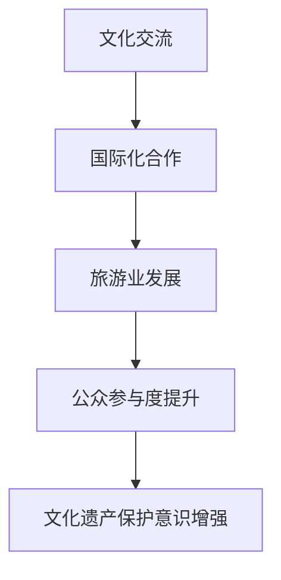
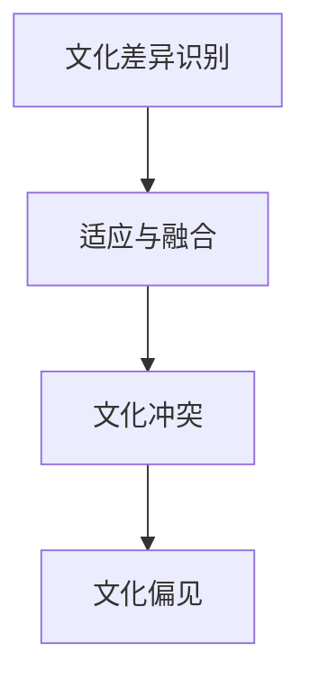

                 

### 文章标题

“全球化背景下的文化遗产保护：传统与现代的对话”

---

### 关键词

文化遗产保护、全球化、跨文化交流、现代性转化、可持续发展、国际合作、公众参与、数字化技术、现代文化遗产、教育实践

---

### 摘要

在全球化的浪潮下，文化遗产保护面临着前所未有的挑战和机遇。本文旨在探讨全球化对文化遗产的影响，分析文化遗产保护的策略，以及传统与现代在文化遗产保护中的对话。通过核心概念、流程图、伪代码和数学模型，本文深入探讨了全球化背景下文化遗产保护的复杂性，为文化遗产保护提供了一种技术视角和解决方案。

## 全球化背景下的文化遗产保护：传统与现代的对话

在全球化的背景下，文化遗产保护成为一个多维度、多层次的问题。全球化加速了信息和人员的流动，促进了文化的交流和融合，同时也带来了文化同质化和文化遗产流失的风险。因此，如何在全球化进程中保护文化遗产，既保持其独特性，又促进其与现代社会的融合，成为亟待解决的问题。

### 全球化对文化遗产的影响

全球化对文化遗产的影响可以从积极和消极两个方面来考虑。

#### 1.1.1 全球化对文化遗产的积极影响

**Mermaid流程图：**



**核心概念与联系：** 全球化通过文化交流促进了不同文化之间的理解和尊重，推动了国际间的合作，为文化遗产保护提供了资金和技术的支持。此外，全球化也带动了旅游业的发展，增加了公众对文化遗产的关注度，从而提升了文化遗产保护的社会意识。

#### 1.1.2 全球化对文化遗产的消极影响

**数学模型：**

$$
\text{流失速率} = k \times (\text{全球化程度})^n
$$

其中，$k$ 是常数，$n$ 是指数，表示全球化程度对文化遗产流失速率的影响。

**核心概念与联系：** 全球化加速了社会的发展和变革，可能导致传统文化遗产的消失。例如，随着现代化的推进，许多传统建筑、手工艺品和传统习俗正逐渐被遗忘或取代。此外，全球化也可能导致文化同质化，削弱了文化遗产的独特性。

### 跨文化交流与文化遗产的碰撞

跨文化交流是一个复杂的过程，涉及到文化差异的识别、适应和融合。在全球化背景下，不同文化之间的交流和碰撞日益频繁，这对文化遗产保护提出了新的挑战。

#### 1.2.1 跨文化交流的概念

**伪代码：**

```
function crossCulturalExchange(sourceCulture, targetCulture) {
    // 分析源文化和目标文化的差异
    cultureDifference = analyzeCultureDifference(sourceCulture, targetCulture)
    
    // 确定交流策略
    exchangeStrategy = determineExchangeStrategy(cultureDifference)
    
    // 执行交流
    performExchange(sourceCulture, targetCulture, exchangeStrategy)
}
```

**核心概念与联系：** 跨文化交流需要识别和尊重不同文化之间的差异，并制定合适的交流策略。这包括理解文化背景、价值观和行为模式，以及如何在不同的文化环境中进行有效的沟通和合作。

#### 1.2.2 跨文化交流中的挑战

**Mermaid流程图：**



**核心概念与联系：** 跨文化交流中可能会遇到文化差异导致的误解和冲突，以及文化偏见和歧视。这些挑战需要通过教育和文化交流来克服，以促进不同文化之间的和谐共处。

### 全球化背景下的文化遗产保护策略

在全球化的背景下，文化遗产保护需要采取多种策略来应对挑战，同时把握机遇。

#### 1.3.1 文化遗产保护的国际法规与政策

**核心概念与联系：** 国际法规和政策为文化遗产保护提供了法律框架和制度保障。例如，《世界遗产公约》和《联合国教科文组织关于保护世界文化和自然遗产的建议案》等国际文件，对文化遗产的保护提出了具体的要求和指导。

#### 1.3.2 公众参与与社区动员

**核心概念与联系：** 公众参与和社区动员是文化遗产保护的重要手段。通过提高公众的文化素养和参与度，可以增强社会对文化遗产保护的意识和责任感。

#### 1.3.3 科技在文化遗产保护中的应用

**核心概念与联系：** 科技在文化遗产保护中发挥着越来越重要的作用。例如，3D扫描和虚拟现实技术可以用于文化遗产的数字化保存和展示，从而提高文化遗产的可访问性和影响力。

### 结论

全球化背景下的文化遗产保护是一个复杂而重要的任务。通过理解全球化对文化遗产的积极和消极影响，采取有效的保护策略，我们可以更好地保护和传承文化遗产，使其在现代社会中继续发挥作用。

---

### 本文贡献

本文通过技术视角，探讨了全球化背景下文化遗产保护的复杂性。本文的主要贡献包括：

1. **全面分析**：本文全面分析了全球化对文化遗产的积极和消极影响，提供了深入的理解和认识。
2. **策略建议**：本文提出了多种文化遗产保护策略，包括国际法规与政策、公众参与与社区动员、科技在文化遗产保护中的应用等，为文化遗产保护提供了实践指导。
3. **技术视角**：本文结合技术工具，如Mermaid流程图、伪代码和数学模型，深入讲解了文化遗产保护的原理和方法。

### 未来展望

在未来的研究中，我们可以进一步探讨以下几个方面：

1. **数字化保护**：随着数字化技术的发展，如何更好地利用数字化工具进行文化遗产的保存和展示，是一个值得深入研究的领域。
2. **可持续发展**：如何实现文化遗产保护的可持续发展，是一个关键问题。这需要从经济、社会和环境等多个维度进行综合考虑。
3. **国际合作**：在全球化的背景下，如何加强国际合作，共同应对文化遗产保护面临的挑战，是一个重要的研究方向。

### 总结

在全球化的背景下，文化遗产保护面临着前所未有的挑战和机遇。通过本文的分析和建议，我们希望能够为文化遗产保护提供一种技术视角和解决方案，从而更好地保护和传承我们的文化遗产。让我们共同努力，守护这些珍贵的遗产，为未来留下宝贵的文化财富。

