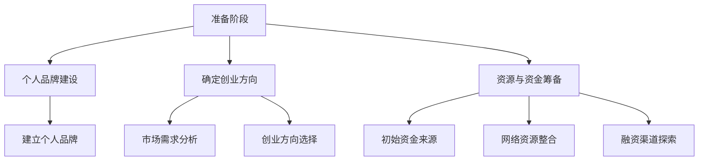
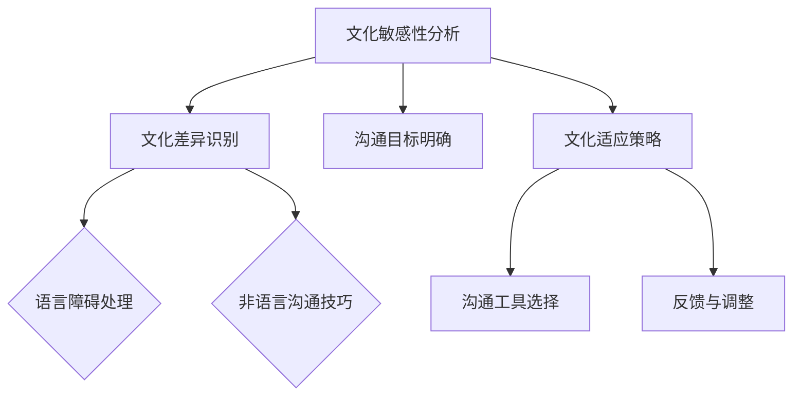
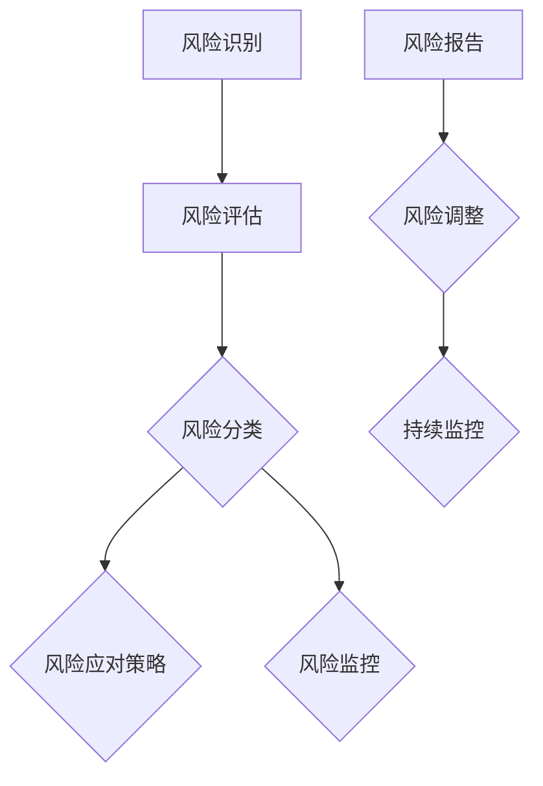

                 


### 文章标题

《全球游牧创业指南：无国界工作者的商业手册》

### 关键词

全球游牧创业，无国界工作者，商业指南，远程工作，国际化运营

### 摘要

本文旨在为全球游牧创业者和无国界工作者提供一套全面的商业手册，涵盖从个人品牌建设到跨国运营管理的各个环节。通过深入的背景介绍、核心概念与联系的分析，以及实际案例解析，本文将帮助读者理解全球游牧创业的机遇与挑战，并掌握实现商业成功的关键策略。

---

## 第1章 引言

### 1.1 成为全球游牧创业者的优势

在全球化的背景下，越来越多的人选择成为全球游牧创业者。这种工作方式不仅提供了灵活性和自由度，还具有以下几个显著优势：

1. **成本节约**：全球游牧创业者无需固定办公室，减少了租赁和运营成本。他们可以在成本较低的地区工作，从而降低生活成本。
   
2. **时间灵活性**：游牧创业者可以根据自己的需求和工作效率来安排工作时间，享受更自由的工作生活平衡。

3. **全球视野**：游牧创业使他们能够接触到不同的文化和市场，有助于拓宽视野，增强创新能力和市场洞察力。

4. **全球化网络**：通过全球游牧工作，创业者能够建立广泛的国际联系，这对业务拓展和市场进入至关重要。

### 1.2 无国界工作者的定义与背景

无国界工作者（Global Nomads）是指那些不依赖于固定地理位置，通过互联网和其他通信技术在全球范围内工作的人。他们可能拥有多个国家的工作签证，也可能完全不受地理限制，仅依靠在线合作完成项目。

无国界工作者的兴起得益于以下因素：

1. **技术进步**：互联网和移动通信技术的快速发展使得远程工作和在线协作变得更加容易和高效。

2. **全球化趋势**：越来越多的企业和个人意识到国际化的重要性，这推动了无国界工作者的需求。

3. **政策支持**：许多国家开始放宽签证政策，鼓励远程工作和跨境合作。

### 1.3 全球化与互联网对工作模式的影响

全球化与互联网的快速发展改变了传统的工作模式，为无国界工作者提供了更多机遇：

1. **远程工作普及**：越来越多的企业接受远程工作，员工可以选择在全球任何地方工作。

2. **虚拟团队协作**：虚拟团队工具如Slack、Zoom和Trello等使得跨地域协作变得简单高效。

3. **数字化商务**：电子商务和在线市场的兴起为无国界工作者提供了新的商业机会。

4. **全球人才流动**：全球化使得人才流动更加自由，无国界工作者可以轻松地在不同国家寻找工作机会。

### 1.4 本书目标与结构概述

本书旨在为全球游牧创业者和无国界工作者提供一套实用的商业手册，帮助他们：

1. **了解全球游牧创业的优势和挑战**。
2. **掌握个人品牌建设的方法**。
3. **确定合适的创业方向并筹备资源**。
4. **制定国际化运营策略**。
5. **实现可持续的商业成功**。

全书结构如下：

- **第1章 引言**：介绍全球游牧创业者的背景和优势。
- **第2章 准备阶段**：讨论个人品牌建设、创业方向确定和资源筹备。
- **第3章 无国界创业策略**：探讨国际市场研究与定位、跨文化沟通与合作、法律与税务问题。
- **第4章 无国界营销与品牌推广**：讲解数字营销策略、品牌形象塑造和市场推广案例解析。
- **第5章 无国界运营与管理**：介绍远程团队管理、跨境供应链管理、项目管理与风险管理。
- **第6章 成功案例与经验分享**：分享全球游牧创业成功案例和无国界工作者的经验交流。
- **第7章 未来趋势与展望**：分析全球游牧创业的未来趋势和无国界工作者的职业规划。

通过这本书，读者将能够系统地掌握全球游牧创业的各个环节，实现商业上的成功与成长。

---

## 第2章 准备阶段

### 2.1 个人品牌建设

#### 2.1.1 个人品牌的重要性

个人品牌是一个人在职场上的独特标识，它反映了个人的价值观、技能和专业能力。在全球化背景下，个人品牌的重要性愈发凸显，原因如下：

1. **差异化竞争**：在人才市场上，拥有强大个人品牌的人更容易脱颖而出，吸引更多机会。
2. **信任建立**：个人品牌有助于建立信任，使潜在客户和合作伙伴更愿意与其合作。
3. **职业发展**：强大的个人品牌能够为个人职业发展提供更多的机会，包括晋升、转行和创业。
4. **品牌溢价**：个人品牌可以提升个人在市场中的价值，从而带来更高的薪资和报酬。

#### 2.1.2 建立个人品牌的步骤

建立个人品牌是一个系统的过程，需要从以下几个方面入手：

1. **确定个人品牌定位**：首先，需要明确自己的专业领域、独特优势和目标受众。例如，是一名数据科学家，可以专注于数据分析和机器学习领域的个人品牌建设。

2. **建立专业网站和社交媒体平台**：创建一个专业的个人网站和社交媒体账户，展示个人成就、项目和观点。网站和社交媒体平台应该保持一致的品牌风格和内容。

3. **内容创作与发布**：定期发布高质量的内容，如博客文章、研究报告、视频教程等，以展示专业知识和行业见解。内容需要具有教育性、启发性和可操作性。

4. **社交媒体互动**：积极与关注者互动，回应评论和提问，建立良好的沟通和关系。

5. **参与行业活动**：参加行业会议、研讨会和网络研讨会，与同行和潜在客户建立联系。

6. **口碑管理**：注意维护良好的口碑，通过正面评价和推荐来增强个人品牌形象。

#### 2.1.3 个人品牌案例分析

以下是一个成功的个人品牌案例分析：

**案例：数据科学家的品牌建设**

张伟是一位在数据科学领域有丰富经验的专业人士。他通过以下步骤建立了自己的个人品牌：

1. **确定定位**：张伟专注于大数据分析和机器学习领域，他的目标受众是企业和数据科学家。
2. **创建专业网站**：张伟搭建了一个内容丰富的个人网站，展示了他的项目经验、学术论文和开源代码。
3. **发布高质量内容**：他定期在网站和社交媒体上发布有关大数据分析和机器学习的技术博客，包括案例分析、算法解析和教程。
4. **参与行业活动**：张伟积极参加行业会议和研讨会，与业内专家交流，分享自己的见解和经验。
5. **口碑管理**：张伟通过提供高质量的技术支持和服务，赢得了良好的口碑，并在业界获得了较高的知名度。

通过这些步骤，张伟成功地建立了自己在数据科学领域的个人品牌，吸引了大量的关注和合作机会。

### 2.2 确定创业方向

#### 2.2.1 了解自身优势与兴趣

确定创业方向是准备阶段的关键步骤。创业者需要深入了解自身的优势与兴趣，以确保创业项目符合个人特点，提高成功概率。

1. **优势识别**：创业者应该识别自己的专业技能、经验和资源，这些优势将帮助他们在特定领域取得竞争优势。
2. **兴趣定位**：创业者应选择自己感兴趣且愿意长期投入的领域。兴趣是持续创新的动力，有助于克服创业过程中的困难和挑战。
3. **市场调研**：在确定创业方向时，创业者需要通过市场调研了解目标市场的需求、竞争态势和潜在机会。

#### 2.2.2 市场需求分析

市场需求分析是确定创业方向的重要环节。创业者应从以下几个方面进行市场调研：

1. **目标客户**：了解目标客户的特征、需求和行为，这有助于设计出符合市场需求的产品或服务。
2. **市场趋势**：分析行业趋势，了解哪些领域正在快速发展，哪些需求正在上升。
3. **竞争态势**：研究竞争对手的产品、服务、优势和劣势，找出市场机会和切入点。
4. **市场规模**：评估目标市场的规模和潜力，确保创业项目有足够的市场容量。

#### 2.2.3 创业方向选择策略

在了解自身优势、兴趣和市场需求后，创业者可以采取以下策略来选择创业方向：

1. **匹配优势与市场需求**：选择符合个人优势和市场需求的方向，提高成功概率。
2. **差异化竞争**：在竞争激烈的领域中找到独特的定位，提供与众不同的产品或服务。
3. **市场细分**：在特定市场细分中寻求机会，为特定客户群体提供专业化的解决方案。
4. **持续调整**：根据市场反馈和自身发展，不断调整创业方向，以适应市场变化。

### 2.3 资源与资金筹备

#### 2.3.1 初始资金来源

创业资金是创业成功的关键，创业者需要提前规划初始资金的来源：

1. **个人储蓄**：利用个人储蓄作为初始资金，这是最常见且最简单的方式。
2. **借款**：通过银行贷款、亲友借款或其他金融渠道获得资金。
3. **天使投资**：寻找愿意投资初创项目的天使投资者，这通常需要创业者具备一定的市场前景和潜力。
4. **政府补贴和扶持**：了解当地政府提供的创业补贴和扶持政策，申请相关资金支持。

#### 2.3.2 网络资源整合

除了资金，创业者还需要整合其他网络资源，包括：

1. **人才资源**：通过社交媒体、行业会议等渠道寻找合适的团队成员。
2. **技术资源**：利用开源技术、第三方平台和合作伙伴的技术支持。
3. **市场资源**：通过市场调研、客户反馈和行业专家的建议，了解市场需求和趋势。
4. **媒体资源**：利用社交媒体、博客、网络论坛等平台，提高项目的知名度和影响力。

#### 2.3.3 融资渠道探索

融资是创业过程中必不可少的一环，以下是一些常见的融资渠道：

1. **种子融资**：在项目启动初期，通过种子投资者获得资金。
2. **天使投资**：在项目有一定进展和市场潜力时，吸引天使投资者的投资。
3. **风险投资**：在项目有较大市场前景时，寻求风险投资机构的投资。
4. **众筹**：通过众筹平台筹集资金，验证市场需求和接受度。
5. **银行贷款**：通过银行贷款解决资金短缺问题，但需要注意贷款条件和利率。

通过以上步骤和策略，创业者可以有效地筹备资源，为后续的创业活动打下坚实基础。

---

## 第3章 无国界创业策略

### 3.1 国际市场研究与定位

#### 3.1.1 国际市场环境分析

在全球化的大背景下，国际市场为无国界创业者提供了广阔的发展空间。然而，要成功进入国际市场，首先需要对目标市场进行全面的了解和分析。

1. **政治环境**：了解目标国家的政治稳定性、政策走向和对外商投资的法规。政治不稳定可能带来经营风险，而政府政策的支持则有助于企业的发展。

2. **经济环境**：研究目标市场的经济增长率、通货膨胀率、汇率波动等经济指标。经济稳定且增长迅速的市场通常为创业者提供了良好的发展机会。

3. **文化环境**：文化差异对商业活动有深远的影响。创业者需要了解目标市场的文化习俗、消费者偏好和商业礼仪，以避免文化冲突和误读。

4. **法律环境**：熟悉目标市场的法律法规，包括劳动法、合同法、税法等。合规经营是企业在任何市场立足的基础。

5. **市场机会**：通过市场调研，识别目标市场的需求、趋势和潜在机会。寻找那些未被充分满足或竞争较小的市场细分领域。

#### 3.1.2 目标市场选择

选择目标市场是国际市场研究的重要一环。以下是一些选择目标市场的策略：

1. **需求导向**：选择需求旺盛且具有增长潜力的市场。可以通过市场调研和数据分析，识别具有高需求的市场领域。

2. **竞争分析**：评估目标市场的竞争状况，选择竞争较小但具有潜力的市场。通过分析竞争对手的产品、市场份额和营销策略，找到市场切入点。

3. **资源匹配**：根据自身资源和优势，选择最适合的市场。创业者需要评估自身在技术、资金、人才等方面的能力，选择与之匹配的市场。

4. **风险考量**：评估目标市场的政治、经济、法律和文化风险，选择风险较低且可控的市场。风险考量是确保创业项目顺利进行的重要前提。

#### 3.1.3 市场定位策略

在确定目标市场后，创业者需要制定有效的市场定位策略，以确保产品或服务在目标市场中获得竞争优势。

1. **差异化定位**：通过提供独特的产品或服务，满足目标市场的特定需求。差异化定位有助于企业在竞争激烈的市场中脱颖而出。

2. **价值定位**：明确产品或服务的价值主张，强调其相对于竞争对手的优势和价值。价值定位有助于吸引目标客户，建立品牌认知。

3. **目标客户群体**：精准定位目标客户群体，了解他们的需求和购买习惯。通过细分市场，提供更加个性化的产品或服务。

4. **营销策略**：根据市场定位，制定相应的营销策略。包括品牌传播、产品推广、渠道选择和客户关系管理等。

通过国际市场环境分析、目标市场选择和市场定位策略的有机结合，无国界创业者可以更好地把握国际市场的机遇，实现商业成功。

### 3.2 跨文化沟通与合作

#### 3.2.1 跨文化交际的重要性

在全球化的今天，跨文化沟通与合作已成为无国界创业者必须掌握的重要技能。成功的跨文化沟通不仅有助于建立良好的合作关系，还能提高企业的国际竞争力。

1. **增进理解**：跨文化沟通有助于消除误解和偏见，增进对不同文化的理解和尊重。
2. **促进合作**：跨文化合作能够结合不同文化的优点，激发创新思维，提高团队效率。
3. **拓宽视野**：跨文化沟通使创业者能够接触到不同的观点和经验，从而拓宽视野，增强市场洞察力。
4. **减少冲突**：有效的跨文化沟通能够降低文化冲突的风险，建立和谐的工作环境。

#### 3.2.2 跨文化沟通技巧

为了实现有效的跨文化沟通，创业者需要掌握以下技巧：

1. **文化敏感度**：提高文化敏感度，了解不同文化背景下的行为规范和价值观念。通过学习和体验，增进对其他文化的理解和尊重。

2. **开放心态**：保持开放心态，接受和尊重不同文化的差异。避免以自己的文化标准来评判他人，尊重他人的行为方式和沟通风格。

3. **明确沟通目标**：在跨文化沟通中，明确沟通目标是确保信息准确传达的关键。提前准备，列出沟通要点，确保信息传达的完整性和准确性。

4. **倾听与反馈**：积极倾听对方的观点，给予充分的反馈。避免中断对方发言，确保对方感受到被尊重和重视。

5. **非语言沟通**：注意非语言沟通的重要性，如肢体语言、面部表情和语调等。不同文化对非语言沟通的解读可能存在差异，需要特别注意。

#### 3.2.3 建立国际合作关系

建立国际合作关系是无国界创业成功的关键。以下是一些建立国际合作关系的策略：

1. **寻找合适伙伴**：通过行业会议、商业网络和第三方推荐等途径，寻找合适的国际合作伙伴。合作伙伴的选择应考虑其业务能力、市场资源和合作历史。

2. **建立信任**：信任是国际合作的基石。通过透明、诚信的商业行为，建立长期的信任关系。在合作初期，可以通过小规模的合作项目来建立信任。

3. **文化适应**：了解并适应合作伙伴的文化，尊重其商业习惯和沟通方式。通过文化适应，减少文化冲突，提高合作效率。

4. **明确合作目标**：在合作初期，明确合作目标和期望，确保双方对合作内容和目标有共同的理解。通过签订详细的合作协议，明确各方的责任和义务。

5. **持续沟通**：合作过程中，保持频繁、及时的沟通，确保双方对项目进展有清晰的认识。通过沟通，解决合作中的问题和挑战，确保项目顺利进行。

通过跨文化沟通与合作技巧的掌握和国际合作关系的建立，无国界创业者可以更好地应对全球化带来的挑战，实现商业成功。

### 3.3 法律与税务问题

#### 3.3.1 国际商务法律知识

在全球化背景下，无国界创业者需要具备一定的国际商务法律知识，以规避法律风险，确保合规经营。

1. **国际合同法**：了解不同国家的合同法规定，包括合同的成立、履行和解除等方面的法律条款。国际合同法有助于确保跨国交易的合法性和安全性。

2. **劳动法**：熟悉目标国家的劳动法规，包括员工权益、劳动合同和劳动争议处理等。遵守劳动法是建立和谐劳动关系，确保员工权益的重要保障。

3. **知识产权法**：了解知识产权的法律保护范围和保护措施，包括专利、商标和著作权等。知识产权法有助于保护企业的创新成果和商业秘密。

4. **反垄断法**：了解目标国家的反垄断法规，避免不正当竞争和市场垄断行为。遵守反垄断法是企业在国际市场上合法运营的重要前提。

5. **环境保护法**：熟悉目标国家的环境保护法规，确保企业的生产经营活动符合环保要求。环境保护法有助于降低企业的法律风险，提升企业形象。

#### 3.3.2 税务规划策略

税务规划是国际商务中不可忽视的一环。合理的税务规划有助于降低企业的税负，提高经营效益。

1. **税务居民身份**：了解不同国家的税务居民身份认定标准，选择合适的税务居民身份，以优化税务筹划。

2. **税收协定**：研究目标国家与其他国家签订的税收协定，利用税收协定降低双重征税风险，享受税收优惠。

3. **利润分配**：根据各国税法规定，合理分配跨国企业的利润，避免利润转移和税务欺诈行为。

4. **税收优惠策略**：了解目标国家的税收优惠政策，如研发税收优惠、出口退税等，充分利用税收优惠提高企业的竞争力。

5. **税务合规**：确保企业的税务申报和缴纳符合目标国家的税法要求，避免税务风险。

#### 3.3.3 国际税务案例解析

以下是一个国际税务案例解析：

**案例：跨国公司的税务筹划**

A公司是一家总部位于美国的高科技企业，在全球多个国家和地区设有分支机构。为了降低税负，A公司采取了以下税务筹划策略：

1. **利用税收协定**：A公司与所在国签订双边税收协定，通过享受税收协定中的优惠条款，降低税率，减少税收负担。

2. **利润分配策略**：A公司根据各国税法规定，合理分配全球利润。例如，将高税负国家的利润转移到低税负国家，通过转移定价策略实现税务优化。

3. **研发税收优惠**：A公司在研发投入较大的国家，如中国和印度，充分利用这些国家的研发税收优惠政策，享受研发费用税前扣除和税收优惠。

4. **税务合规管理**：A公司建立了完善的税务合规管理体系，确保税务申报和缴纳符合各国税法要求，避免税务风险。

通过以上策略，A公司成功降低了全球税负，提高了经营效益。

了解国际商务法律和税务规划策略，是确保无国界创业成功的关键。通过合理的法律和税务筹划，无国界创业者可以更好地应对国际市场的挑战，实现可持续发展。

---

## 第4章 无国界营销与品牌推广

### 4.1 数字营销策略

#### 4.1.1 社交媒体营销

社交媒体营销是现代无国界创业者不可或缺的一部分，它能够帮助企业快速触及全球目标受众。以下是一些关键的社交媒体营销策略：

1. **平台选择**：根据目标市场的特点和受众偏好，选择合适的社交媒体平台。例如，LinkedIn适用于专业领域，Facebook和Instagram适用于大众市场。

2. **内容创作**：创作高质量、有价值的内容，包括文章、图片、视频等，以吸引受众。内容应具有教育性、娱乐性或启发性的特点。

3. **互动与参与**：与受众互动，回答评论和提问，建立良好的客户关系。定期举办线上活动，如问答、投票和抽奖，提高用户参与度。

4. **广告投放**：利用社交媒体的广告工具，进行精准投放。根据受众属性、兴趣和行为，制定有针对性的广告策略。

5. **数据分析**：利用社交媒体分析工具，监测广告效果和用户行为。根据数据反馈，优化广告内容和策略。

#### 4.1.2 搜索引擎优化

搜索引擎优化（SEO）是提高企业网站在搜索引擎结果页（SERP）排名的关键策略。以下是一些SEO的基本策略：

1. **关键词研究**：通过工具如Google Keyword Planner，研究目标市场的热门关键词，确定适合的关键词策略。

2. **网站优化**：优化网站结构、内容和技术，提高网站的搜索引擎友好性。包括网站速度优化、移动适配性、页面加载时间等。

3. **内容优化**：创作高质量、相关性强、有价值的内容，围绕目标关键词进行内容优化。内容应包括长篇文章、图片、视频等多种形式。

4. **链接建设**：通过获取高质量的 inbound 链接，提高网站的权威性和可信度。链接建设包括合作伙伴链接、社交媒体链接、行业网站链接等。

5. **监测与优化**：定期监测网站的SEO表现，通过工具如Google Analytics，分析关键词排名、访问量、转化率等指标，持续优化SEO策略。

#### 4.1.3 电子邮件营销

电子邮件营销是一种有效的客户获取和客户保留工具。以下是一些电子邮件营销的基本策略：

1. **邮件列表构建**：通过网站注册、社交媒体推广、线下活动等方式，收集潜在客户的邮箱地址，建立邮件列表。

2. **个性化邮件**：根据客户的行为和偏好，定制个性化的邮件内容。例如，向已购买客户发送优惠信息，向潜在客户发送产品介绍和案例研究。

3. **定期邮件发送**：制定定期邮件发送计划，如每周或每月一次，保持与客户的联系，提供有价值的内容。

4. **测试与优化**：通过A/B测试，比较不同邮件标题、内容和发送时间的效果，优化邮件营销策略。

5. **分析效果**：通过邮件分析工具，监测邮件的打开率、点击率、转化率等关键指标，评估邮件营销的效果，并根据数据反馈进行调整。

通过有效的数字营销策略，无国界创业者可以在全球范围内提升品牌知名度，吸引潜在客户，实现商业目标。

### 4.2 品牌形象塑造

#### 4.2.1 品牌核心价值定位

品牌核心价值定位是塑造品牌形象的关键步骤。以下是如何进行品牌核心价值定位的方法：

1. **分析市场定位**：根据企业的市场定位和目标受众，确定品牌的核心价值。例如，如果企业定位为高科技、创新，品牌核心价值可以是“科技创新，引领未来”。

2. **提炼品牌理念**：从企业愿景、使命和价值观中提炼出具有代表性和感染力的品牌理念。品牌理念应简洁、有力，能够传达品牌的独特性和优势。

3. **品牌故事**：构建一个具有吸引力的品牌故事，讲述品牌的起源、发展历程和未来愿景。品牌故事有助于增强品牌与受众的情感联系。

4. **用户反馈**：通过调查问卷、用户访谈等方式，了解用户对品牌的认知和期望。用户反馈可以为品牌核心价值定位提供重要参考。

5. **品牌视觉设计**：设计符合品牌核心价值的视觉元素，如品牌标志、颜色方案、字体等。视觉设计应简洁、直观，能够传递品牌的核心价值。

#### 4.2.2 品牌视觉设计

品牌视觉设计是品牌形象塑造的重要组成部分。以下是一些品牌视觉设计的基本原则：

1. **一致性**：保持品牌视觉元素在所有渠道和媒介上的一致性，包括网站、社交媒体、宣传材料等。

2. **简洁性**：品牌视觉设计应简洁明了，避免过多的元素和细节，确保受众能够快速识别和记住品牌。

3. **美观性**：设计应具有美学价值，能够吸引受众的注意力。颜色、字体和图像的选择应协调，创造出和谐的视觉效果。

4. **个性化**：品牌视觉设计应体现品牌的独特性和个性。避免使用过于普遍或流行的设计元素，确保品牌具有辨识度。

5. **适应性**：品牌视觉设计应具备良好的适应性，能够在不同的尺寸和媒介上保持一致性和效果。

通过精准的品牌核心价值定位和专业的品牌视觉设计，无国界创业者可以塑造一个具有吸引力和竞争力的品牌形象，增强品牌的市场影响力。

### 4.2.3 品牌传播策略

品牌传播策略是确保品牌信息有效传递给目标受众的重要环节。以下是一些关键的品牌传播策略：

1. **内容营销**：通过创建和分享有价值的内容，如文章、视频、案例研究等，提高品牌知名度和影响力。内容应针对目标受众的需求和兴趣，传递品牌的核心价值。

2. **公关活动**：组织新闻发布会、产品发布会、行业论坛等活动，吸引媒体和公众的关注，提升品牌知名度。公关活动应与品牌形象和传播目标相一致。

3. **社交媒体营销**：利用社交媒体平台，如Facebook、LinkedIn、Instagram等，进行品牌推广和互动。社交媒体营销应注重内容创意和用户参与，提升品牌的社交影响力。

4. **广告投放**：通过在线广告、电视广告、户外广告等渠道，进行品牌推广。广告内容应具有吸引力，明确传递品牌的核心信息。

5. **合作伙伴关系**：与行业内的其他品牌或机构建立合作伙伴关系，通过联合推广、资源共享等方式，扩大品牌影响范围。

6. **口碑管理**：积极管理品牌口碑，通过用户评价、推荐和负面反馈的处理，维护品牌的正面形象。

通过多元化的品牌传播策略，无国界创业者可以有效地将品牌信息传递给目标受众，提升品牌的市场认知度和美誉度。

### 4.3 市场推广案例解析

#### 4.3.1 成功市场推广案例分析

**案例：Airbnb的全球市场推广**

Airbnb作为全球领先的短租平台，其成功的市场推广策略为无国界创业者提供了宝贵的经验。以下是其市场推广策略的详细分析：

1. **内容营销**：Airbnb通过创建和分享高质量的旅行故事、用户体验和目的地指南，吸引了大量用户。这些内容不仅为用户提供有价值的信息，还增强了品牌与用户之间的情感联系。

2. **社交媒体营销**：Airbnb积极利用社交媒体平台，如Facebook、Instagram和Twitter，与用户互动，分享最新活动和优惠信息。通过社交媒体营销，Airbnb成功建立了强大的社交媒体粉丝群。

3. **合作伙伴关系**：Airbnb与多家航空公司、旅游机构和酒店建立合作伙伴关系，通过联合推广和资源共享，扩大品牌影响力。

4. **公关活动**：Airbnb定期举办新闻发布会、产品发布会和行业论坛，吸引了大量媒体和公众的关注。通过这些活动，Airbnb成功提升了品牌知名度和影响力。

5. **用户口碑**：Airbnb通过积极的用户反馈管理和口碑管理，维护了品牌的正面形象。用户的好评和推荐成为Airbnb市场推广的重要动力。

通过以上策略，Airbnb成功在全球范围内推广了其品牌，吸引了大量用户，实现了业务的高速增长。

#### 4.3.2 营销失败案例分析

**案例：Nike的在线广告失误**

Nike作为全球知名的运动品牌，也曾经历过一次营销失败案例。以下是详细分析：

1. **广告内容不当**：Nike在某个地区的在线广告中，使用了带有歧视意味的内容，引发了公众的愤怒和批评。这一失误严重损害了Nike的品牌形象。

2. **缺乏市场调研**：Nike在发布广告前，未充分了解目标市场的文化背景和消费者心态，导致广告内容与当地文化产生冲突。

3. **反应迟缓**：在广告引发负面反应后，Nike的反应迟缓，未及时采取有效的公关措施，导致问题扩大。

4. **用户反馈忽视**：Nike在广告发布后，未能重视用户的负面反馈，未及时进行调整和改进。

通过这个案例，我们可以看到，市场推广策略的失败往往源于内容不当、市场调研不足、反应迟缓和用户反馈忽视等问题。为了避免类似的失败，无国界创业者应重视市场调研、文化适应和用户反馈管理。

#### 4.3.3 启示与借鉴

通过以上成功和失败的市场推广案例，我们可以得出以下启示和借鉴：

1. **内容为王**：成功的市场推广策略应以高质量、有价值的内容为核心，与品牌形象和目标受众紧密相关。

2. **市场调研**：在制定市场推广策略前，应进行充分的市场调研，了解目标市场的文化、消费者心态和需求。

3. **文化适应**：在跨国市场推广中，应充分考虑当地文化背景和消费者习惯，避免内容和文化冲突。

4. **用户反馈**：重视用户的反馈和评价，及时进行调整和改进，以提升品牌形象和市场表现。

5. **危机公关**：在市场推广中，应建立有效的危机公关机制，及时应对负面事件，维护品牌形象。

通过借鉴成功经验，避免失败教训，无国界创业者可以制定出更加有效的市场推广策略，实现商业成功。

---

## 第5章 无国界运营与管理

### 5.1 远程团队管理

#### 5.1.1 远程团队的优势与挑战

远程团队管理已经成为现代企业管理的一种趋势，尤其是在全球游牧创业环境中。远程团队具有以下优势：

1. **灵活性**：团队成员可以随时随地工作，减少了地理位置的限制，提高了工作效率。
2. **成本节约**：远程工作减少了办公空间的租赁和设备投入，降低了运营成本。
3. **多样性**：远程团队可以汇聚来自不同文化和背景的成员，增加了创新和多样性。

然而，远程团队管理也面临一些挑战：

1. **沟通障碍**：不同时区、语言和文化背景可能导致沟通不畅，影响团队协作。
2. **监控困难**：远程工作使管理者难以实时监控团队的工作状态，增加了管理难度。
3. **团队凝聚力**：缺乏面对面的互动可能导致团队成员之间的信任和凝聚力下降。

#### 5.1.2 远程团队管理策略

为了克服远程团队管理中的挑战，以下是一些建议：

1. **明确目标与任务**：为每个团队成员设定清晰的目标和任务，确保每个人都了解自己的职责和预期成果。
2. **定期沟通**：通过视频会议、即时通讯工具等，保持定期沟通。定期会议可以帮助团队成员了解项目进展，解决疑问。
3. **建立信任**：通过透明的工作流程和及时反馈，建立团队成员之间的信任。信任是远程团队高效协作的基础。
4. **使用协作工具**：利用远程协作工具，如Slack、Trello、Zoom等，提高团队协作效率。这些工具可以帮助团队管理任务、共享文件、实时沟通。
5. **文化适应**：尊重并适应团队成员的文化差异，提高团队整体的凝聚力。通过文化培训，帮助团队成员更好地理解彼此。
6. **培训与发展**：提供定期的培训和发展机会，帮助团队成员提升技能和知识，保持团队的活力和竞争力。

#### 5.1.3 团队协作工具介绍

以下是一些常用的远程团队协作工具：

1. **Slack**：Slack是一款流行的即时通讯工具，适合团队内部沟通和协作。它提供了丰富的功能和插件，支持文件共享、任务分配、聊天室等。
   
2. **Trello**：Trello是一款基于看板（Kanban）的团队协作工具，可以帮助团队管理项目进度、任务分配和协作流程。它提供了简单直观的界面和灵活的工作流设计。
   
3. **Zoom**：Zoom是一款视频会议工具，适合远程团队进行实时沟通和会议。它提供了高质量的音频和视频通话功能，支持屏幕共享、会议录制和虚拟背景等。
   
4. **Google Workspace**：Google Workspace包括Google Docs、Google Sheets、Google Slides等，提供了强大的文档、表格和演示文稿协作功能。这些工具支持实时编辑和评论，方便团队成员共同工作和协作。

通过合理利用这些团队协作工具，远程团队可以更好地管理项目、提高协作效率，实现共同目标。

### 5.2 跨境供应链管理

#### 5.2.1 跨境供应链的基本概念

跨境供应链管理是指在全球范围内管理商品、服务和信息的流动。它包括以下基本概念：

1. **供应链**：供应链是指从原材料采购到产品交付给最终消费者的整个过程。跨境供应链管理涉及多个国家和地区的参与。
   
2. **跨境贸易**：跨境贸易是指商品、服务和信息在国与国之间的交换。跨境供应链管理需要考虑关税、贸易法规、物流和支付等跨境因素。
   
3. **物流**：物流是指商品从生产地到消费地的运输和配送过程。跨境物流需要协调不同国家的运输方式、运输时间和运输成本。
   
4. **供应链节点**：供应链节点包括供应商、制造商、分销商、零售商和最终消费者。跨境供应链管理需要确保每个节点的高效运作。

#### 5.2.2 跨境供应链管理策略

以下是一些建议的跨境供应链管理策略：

1. **选择合适供应商**：在选择供应商时，应考虑其质量、价格、交付能力和供应链稳定性。可以通过供应商评价体系，对供应商进行定期评估和筛选。

2. **风险管理与应对**：跨境供应链管理面临多种风险，如汇率波动、政治不稳定、自然灾害等。企业应制定风险应对策略，如多元化供应商、分散库存、保险等。

3. **物流优化**：通过合理规划物流路线和运输方式，降低运输成本和时间。可以采用多式联运、保税物流等方式，提高物流效率。

4. **信息技术支持**：利用信息技术，如ERP（企业资源计划）系统、WMS（仓库管理系统）等，提高供应链的可视化和协同效率。

5. **供应链金融**：通过供应链金融，如信用证、保理、供应链融资等，帮助企业缓解资金压力，提高供应链的灵活性和流动性。

6. **合规管理**：了解并遵守目标国家的贸易法规和标准，确保合规经营。可以聘请专业法律顾问，提供合规咨询和培训。

#### 5.2.3 跨境物流与仓储

跨境物流与仓储是跨境供应链管理的重要组成部分。以下是一些建议：

1. **选择物流公司**：选择有经验、信誉好的国际物流公司，确保运输安全和及时交付。可以通过招标、比较服务质量和价格，选择合适的物流公司。

2. **仓储策略**：根据目标市场的需求和物流成本，选择合适的仓储地点。可以采用本地仓储、区域仓储和集中仓储等方式，优化仓储成本和物流效率。

3. **保税物流**：利用保税物流政策，降低物流成本和通关时间。通过保税仓库，实现商品在国内的快速通关和仓储，提高供应链的灵活性。

4. **仓储管理**：采用现代化的仓储管理系统，如WMS，提高仓储效率和管理水平。通过自动化仓储设备，如货架、叉车、AGV等，实现仓储过程的自动化和智能化。

5. **跨境物流跟踪**：利用物流跟踪系统，实时监控货物的运输状态，确保货物安全、及时到达。

通过有效的跨境供应链管理策略和物流与仓储管理，无国界创业者可以降低成本、提高效率，实现全球业务的顺畅运营。

### 5.3 项目管理与风险管理

#### 5.3.1 项目管理方法论

项目管理是确保项目按计划、预算和质量完成的关键。以下是一些常见的项目管理方法论：

1. **瀑布模型**：瀑布模型是一种传统的项目管理方法，强调线性、顺序的开发过程。每个阶段完成后，才能进入下一个阶段，确保项目各个阶段的有序推进。

2. **敏捷开发**：敏捷开发是一种迭代和增量的开发方法，强调灵活性和适应性。团队通过短周期迭代，不断调整和优化项目计划，以快速响应市场需求和变化。

3. **六西格玛**：六西格玛是一种以质量为中心的管理方法，通过统计方法和过程改进，提高项目质量和效率。六西格玛强调数据驱动的决策和持续改进。

4. **项目管理框架**：常见的项目管理框架包括PMBOK（项目管理知识体系）和PRINCE2（项目管理实践标准），这些框架提供了系统的项目管理方法和流程，帮助项目团队高效地管理项目。

#### 5.3.2 风险管理框架

风险管理是项目管理的重要组成部分，以下是一个典型的风险管理框架：

1. **风险识别**：通过调研、访谈、头脑风暴等方法，识别项目过程中可能出现的各种风险。风险识别是风险管理的基础，有助于全面了解项目的风险状况。

2. **风险评估**：对识别出的风险进行评估，包括风险发生的可能性、影响程度和严重性。通过风险矩阵，对风险进行分类和优先级排序，为后续风险应对提供依据。

3. **风险应对策略**：根据风险评估结果，制定相应的风险应对策略。常见的风险应对策略包括风险规避、风险转移、风险减轻和风险接受。

4. **风险监控**：在项目执行过程中，定期监控风险的发生和变化，及时调整风险应对措施。风险监控有助于确保项目在风险发生时，能够迅速采取有效的应对措施。

5. **风险报告**：定期生成风险报告，向项目团队和相关利益相关者报告风险状况、应对措施和调整情况。风险报告有助于提高项目的透明度和风险意识。

通过以上项目管理方法论和风险管理框架，无国界创业者可以更好地规划、执行和监控项目，降低项目风险，提高项目成功率。

### 5.3.3 风险应对策略

在项目管理和运营过程中，风险应对策略至关重要。以下是一些具体的风险应对策略：

1. **风险规避**：通过调整项目计划或策略，避免风险发生。例如，选择信誉良好的供应商或合作伙伴，减少法律风险。

2. **风险转移**：通过合同、保险等方式，将风险转移给第三方。例如，通过购买产品责任保险，降低产品责任风险。

3. **风险减轻**：通过改进流程、增加资源和培训，降低风险的影响程度。例如，通过引入新的技术或流程，提高项目的可靠性和稳定性。

4. **风险接受**：对于无法避免或转移的风险，制定应对计划和应急预案。例如，制定自然灾害应急预案，确保在风险发生时能够迅速采取行动。

5. **持续监控和调整**：在项目执行过程中，定期监控风险的变化和影响，及时调整风险应对措施。通过持续的监控和调整，确保项目能够适应不断变化的环境。

通过有效的风险应对策略，无国界创业者可以降低项目风险，确保项目的顺利进行，提高项目成功率。

通过有效的远程团队管理、跨境供应链管理和项目管理与风险管理策略，无国界创业者可以更好地应对运营中的挑战，实现全球业务的顺畅运营和持续增长。

---

## 第6章 成功案例与经验分享

### 6.1 全球游牧创业成功案例

**案例：Etsy的全球扩张**

Etsy是一家在线手工艺术品和复古商品市场，它的全球扩张故事为无国界创业提供了宝贵的经验。

**创业故事分享：**

Etsy成立于2005年，由Rob Kalin创立。最初，Etsy只是一个在线平台，让手工艺人和艺术家能够展示和销售自己的作品。随着平台的发展，Etsy开始面向全球市场扩张。

**成功经验与启示：**

1. **定位明确**：Etsy从一开始就明确了其市场定位，专注于提供独特、手工制作的艺术品和复古商品，这一明确的市场定位帮助Etsy在竞争激烈的市场中脱颖而出。

2. **本地化策略**：Etsy在进入新市场时，采取本地化策略，包括翻译网站、了解当地文化习俗和消费习惯。这种策略帮助Etsy迅速赢得当地用户的信任。

3. **用户参与**：Etsy注重用户参与，通过社交媒体和社区活动，与用户建立紧密的联系。这种用户参与策略不仅提高了用户忠诚度，还帮助Etsy收集用户反馈，不断优化产品和服务。

4. **全球物流网络**：Etsy建立了全球物流网络，确保商品能够快速、安全地交付给全球用户。这一物流网络是Etsy成功扩展全球业务的重要支撑。

**面临的挑战与应对：**

1. **竞争压力**：在全球市场上，Etsy面临着来自eBay、Amazon等大平台的竞争压力。为了应对这一挑战，Etsy不断优化其平台，提供更多的工具和资源，帮助卖家提高销售效率。

2. **市场法规**：不同国家和地区的法律法规有所不同，Etsy在扩张过程中需要遵守各种不同的法律和规定。为了应对这一挑战，Etsy聘请了专业的法律团队，确保其业务在全球范围内合规运营。

**经验总结：** Etsy的成功经验表明，明确的定位、本地化策略、用户参与和全球物流网络是全球游牧创业成功的关键。同时，面对竞争压力和市场法规的挑战，创业者需要具备灵活的应对策略和强大的执行力。

### 6.2 无国界工作者的经验交流

**经验分享会组织与参与**

无国界工作者可以通过组织或参与经验分享会，交流和分享各自的经验和见解。以下是一些建议：

1. **主题选择**：选择具有实际操作意义和讨论价值的话题，如国际市场拓展、远程团队管理、税务规划等。

2. **嘉宾邀请**：邀请具有丰富经验的国际创业者、职业顾问或法律专家作为嘉宾，分享他们的经验和见解。

3. **互动环节**：设置互动环节，如问答、讨论和案例分析，鼓励参与者积极参与，提高分享会的效果。

4. **线上平台**：利用Zoom、WebEx等在线会议平台，组织线上经验分享会，方便全球参与者参与。

5. **资料分享**：在分享会上，提供相关的资料和资源，如研究报告、案例文档等，帮助参与者深入学习和理解。

**交流平台与资源**

除了组织经验分享会，无国界工作者还可以利用以下交流平台和资源：

1. **专业社区**：如LinkedIn、Facebook群组、Reddit论坛等，这些平台提供了丰富的资源和交流机会。

2. **在线课程和研讨会**：参加在线课程和研讨会，学习最新的国际商务知识和技能。

3. **行业会议和展览**：参加行业会议和展览，与业内专家和同行建立联系。

4. **专业书籍和文章**：阅读专业书籍和文章，了解国际商务的最新趋势和最佳实践。

**个人成长与职业发展**

无国界工作者通过经验交流和资源整合，可以实现个人成长和职业发展：

1. **知识更新**：持续学习和更新知识，保持对国际商务领域的了解和敏感度。

2. **技能提升**：通过实践和培训，提升跨文化沟通、国际市场研究和运营管理等技能。

3. **网络拓展**：通过参加活动和交流，拓展国际人脉网络，提高职业影响力。

4. **职业规划**：根据个人兴趣和市场需求，制定明确的职业规划，实现职业目标。

通过经验分享和交流平台，无国界工作者可以不断提升自身能力，实现职业发展目标。

### 6.3 无国界工作者的经验分享

**案例：Alexandra从远程自由职业者到创业家的转型**

Alexandra是一位经验丰富的远程自由职业者，她在国际商务领域有着丰富的经验。以下是她从远程自由职业者转型为创业家的故事。

**创业故事分享：**

Alexandra在远程工作领域起步，通过提供专业咨询服务和内容创作，她在短时间内积累了丰富的客户资源。随着业务的发展，她决定创立自己的公司，为全球客户提供更全面的解决方案。

**成功经验与启示：**

1. **明确目标**：Alexandra在转型为创业家时，明确了自己的目标，即提供高品质的咨询服务和创新的解决方案。

2. **客户关系**：她重视客户关系，通过提供个性化服务，赢得了客户的信任和忠诚。

3. **持续学习**：她始终保持对行业动态的关注，通过参加培训、阅读专业书籍和参加行业会议，不断提升自己的专业知识和技能。

4. **团队建设**：她注重团队建设，招聘和培养了一支专业、高效的团队，确保公司业务的顺利运营。

**面临的挑战与应对：**

1. **市场竞争**：她面临着激烈的市场竞争，为了应对这一挑战，她通过不断优化产品和服务，提高公司的竞争力。

2. **国际化运营**：国际化运营带来了文化和法律方面的挑战。她通过聘请专业顾问，确保公司的国际化运营合规和高效。

**经验总结：** Alexandra的转型经验表明，明确的定位、良好的客户关系、持续学习和团队建设是创业成功的关键。同时，面对市场竞争和国际化运营的挑战，创业者需要具备灵活的应对策略和强大的执行力。

通过成功案例和经验分享，无国界创业者可以从中学习到宝贵的经验和启示，为自身的创业之路提供指导和支持。

---

## 第7章 未来趋势与展望

### 7.1 全球游牧创业的未来趋势

随着科技的不断进步和全球化进程的加速，全球游牧创业的未来趋势正逐渐显现。以下是一些重要的趋势：

1. **远程工作的普及**：远程工作已经成为一种常态，越来越多的企业接受并鼓励员工在家办公或在全球范围内选择工作地点。这种趋势将进一步加强全球游牧创业的可行性和吸引力。

2. **数字化商务的兴起**：电子商务和在线市场的兴起为全球游牧创业者提供了更多的商机。通过数字化工具和平台，创业者可以更轻松地进入全球市场，实现跨国业务拓展。

3. **人工智能和自动化**：人工智能和自动化技术的发展将进一步提升工作效率和生产力。创业者可以利用这些技术优化业务流程，降低运营成本，提高竞争力。

4. **可持续发展**：随着全球对环境问题的关注增加，可持续发展和绿色创业将成为重要趋势。创业者需要关注环境和社会责任，通过环保和可持续的业务模式吸引客户和投资者。

5. **数字货币和区块链**：数字货币和区块链技术的应用将改变传统的金融和支付方式，为全球游牧创业提供更多的机会和灵活性。例如，通过区块链技术，创业者可以更安全、透明地进行跨境交易。

6. **虚拟现实和增强现实**：虚拟现实（VR）和增强现实（AR）技术的发展将为全球游牧创业带来新的互动体验和市场机会。创业者可以利用VR和AR技术进行产品展示、虚拟会议和客户互动。

### 7.2 无国界工作者的职业规划

无国界工作者的职业规划需要考虑以下几个方向和策略：

1. **技能提升**：持续学习和提升专业技能是职业发展的关键。无国界工作者应关注行业动态，掌握新兴技术和工具，保持竞争力。

2. **国际认证**：获得国际认证和资质可以提升个人的专业形象和职业价值。例如，PMP（项目管理专业人士）、CFA（特许金融分析师）等认证。

3. **网络建设**：建立广泛的国际人脉网络对无国界工作者至关重要。通过参加行业会议、网络活动和社交媒体，扩大人脉资源，提高职业影响力。

4. **多元化发展**：无国界工作者可以考虑多元化发展，不仅限于某个领域，还可以跨领域、跨行业工作，拓宽职业道路。

5. **职业定位**：明确自己的职业定位和发展目标，制定详细的职业规划。根据个人兴趣、优势和市场需求，选择合适的发展方向。

6. **持续适应**：随着科技和市场的变化，无国界工作者需要具备持续适应的能力。保持开放心态，积极应对变化，不断提升自身的适应能力和应变能力。

通过明确的职业规划和持续的努力，无国界工作者可以实现职业发展的目标，成为全球职场中的佼佼者。

### 7.3 持续学习与适应能力

在快速变化的全球化和数字化时代，持续学习和适应能力成为无国界工作者不可或缺的技能。以下是一些建议：

1. **终身学习**：无国界工作者应将终身学习视为一种习惯，不断更新知识和技能。可以通过在线课程、研讨会、专业书籍等方式进行学习。

2. **技能多样化**：培养多样化的技能，不仅限于专业领域，还应包括跨学科的技能，如编程、数据分析、项目管理等。多样化的技能有助于提高适应能力和职业竞争力。

3. **实践与反思**：通过实际项目和工作经验，不断实践所学知识，并定期进行反思和总结。实践与反思有助于发现不足和改进方法。

4. **网络学习资源**：利用网络学习资源，如在线教育平台（如Coursera、edX）、专业论坛和社区等，获取最新的行业知识和经验。

5. **跨界合作**：与不同领域的专业人士进行跨界合作，拓展视野和思维方式。跨界合作有助于发现新的机会和解决方案。

6. **心态调整**：保持积极的心态，面对挑战和变化时，保持冷静和乐观。积极的心态有助于更好地适应新环境和应对压力。

通过持续学习和适应能力，无国界工作者可以不断适应变化，提升自身竞争力，实现职业和生活的平衡与成功。

---

## 附录

### 附录 A 全球游牧创业工具与资源

无国界创业者需要一系列工具和资源来支持其全球业务运营。以下是一些常用的工具和资源：

1. **远程协作工具**：Slack、Trello、Asana、Zoom、Google Workspace等，用于团队沟通、任务管理和视频会议。
2. **项目管理软件**：Jira、Trello、Notion等，用于项目跟踪和管理。
3. **云存储服务**：Google Drive、Dropbox、OneDrive等，用于文件存储和共享。
4. **在线学习平台**：Coursera、edX、Udemy等，提供多样化的在线课程和学习资源。
5. **国际支付服务**：Payoneer、TransferWise、PayPal等，支持跨境支付和资金管理。
6. **税务咨询服务**：H&R Block、TaxAct、Virtual Accountant等，提供在线税务咨询和报税服务。
7. **市场调研工具**：Google Trends、Ahrefs、SEMrush等，用于市场分析和关键词研究。
8. **国际化物流平台**：DHL、FedEx、UPS、Air货运等，提供全球物流和运输服务。
9. **数字货币与区块链平台**：Coinbase、Binance、Ethereum等，支持数字货币交易和区块链应用。

### 附录 B 跨境商务法律法规资料

无国界创业者在进行跨国业务时，需要了解和遵守各国的法律法规。以下是一些有用的资料和资源：

1. **世界贸易组织（WTO）**：提供全球贸易规则和协定的信息。
2. **各国商会和贸易协会**：例如美国商会（US Chamber of Commerce）、英国商会（British Chamber of Commerce）等，提供行业信息和法律咨询。
3. **各国政府官方网站**：例如美国商务部的International Trade Administration、欧盟委员会的Trade Policy，提供最新的贸易法规和政策。
4. **国际法律数据库**：如Westlaw、LexisNexis等，提供全球法律文献和案例搜索。
5. **跨境法律咨询服务**：国际律师事务所、专业法律顾问等，提供跨境法律咨询和合规服务。

### 附录 C 国际税务指南

国际税务规划对无国界创业者至关重要，以下是一些税务指南和资源：

1. **国际税务指南**：国际税务协会（International Tax Association）提供有关国际税务的指南和报告。
2. **各国税务法规**：各国税务局官方网站，如美国国税局（IRS）、英国税务海关总署（HMRC）等，提供详细的税务法规和指南。
3. **税务软件和工具**：例如TurboTax、TaxAct等，提供在线税务计算和报税服务。
4. **国际税务专家**：专业税务顾问、会计师等，提供定制化的国际税务规划服务。
5. **国际税收协定**：各国政府签订的税收协定，如《避免双重征税协定》（DTA），提供税收优惠和减免。

通过利用这些工具和资源，无国界创业者可以更好地支持其全球业务运营，确保合规和高效。

---

## Mermaid 流程图与算法讲解

### Mermaid 图 1: 全球游牧创业流程图



### 算法 1: 跨文化沟通策略分析算法



### 算法 2: 风险管理模型



---

## 数学模型与公式详解

### 公式 1: 营销效果评估公式

$$
M = \frac{C \times R \times (1 - e^{(-\lambda \times T)})}{1 + e^{(-\lambda \times T)}}
$$

- **M**：营销效果得分，用于评估营销活动的效果。
- **C**：初始投入成本。
- **R**：回报率，即营销活动带来的收益。
- **\lambda**：折扣因子，表示时间对回报的影响。
- **T**：营销活动的时间长度。

### 公式 2: 风险评估模型

$$
RISK = \frac{P \times L \times D}{S}
$$

- **RISK**：整体风险值，用于评估项目的风险水平。
- **P**：风险发生概率。
- **L**：风险损失程度。
- **D**：风险发生后的影响范围。
- **S**：项目的安全系数，表示项目能够承受的风险水平。

### 详细讲解与举例说明

**营销效果评估公式**：

假设一个公司花费5000美元进行市场营销活动，活动持续时间为6个月，平均回报率为20%。折扣因子\(\lambda\)为0.1。我们可以使用上述公式计算营销效果得分。

$$
M = \frac{5000 \times 20 \times (1 - e^{(-0.1 \times 6)})}{1 + e^{(-0.1 \times 6)}}
$$

计算结果为：

$$
M \approx 2767.89
$$

这意味着该公司的营销活动在6个月内产生了大约2767.89美元的有效回报。

**风险评估模型**：

假设一个项目面临的风险发生概率为30%，风险损失程度为5000美元，影响范围较小，安全系数为1.5。我们可以使用上述公式计算整体风险值。

$$
RISK = \frac{0.3 \times 5000 \times 1}{1.5}
$$

计算结果为：

$$
RISK \approx 1000
$$

这意味着该项目的整体风险值为1000，表示项目面临的风险是可控的。

通过这些数学模型和公式，无国界创业者可以更科学地评估营销效果和风险管理，为决策提供数据支持。

---

## 项目实战与代码解析

### 项目 1: 社交媒体营销实战

#### 实战目标

通过实际操作，掌握社交媒体营销的基本步骤，包括平台选择、内容创作、广告投放和效果评估。

#### 环境搭建

1. **平台选择**：选择两个具有代表性的社交媒体平台，如Facebook和Instagram。
2. **账号注册**：在所选平台上注册个人或企业账号。
3. **内容策划**：制定内容发布计划，包括图片、视频和文章等。
4. **广告投放**：设置广告预算和投放目标，进行广告投放。
5. **效果评估**：使用分析工具（如Facebook Insights和Instagram Insights）监控广告效果。

#### 源代码实现

以下是一个简单的Python脚本，用于模拟社交媒体营销的代码实现：

```python
import requests
import json

# 社交媒体API密钥和访问令牌
api_key = 'your_api_key'
access_token = 'your_access_token'

# 社交媒体平台URL
facebook_url = 'https://graph.facebook.com/v12.0/'
instagram_url = 'https://graph.instagram.com/v12.0/'

# 登录社交媒体平台
def login(platform, api_key, access_token):
    headers = {
        'Authorization': f'Bearer {access_token}',
        'Content-Type': 'application/json'
    }
    response = requests.get(f'{platform}me', headers=headers)
    return response.json()

# 发布内容
def post_content(platform, content):
    headers = {
        'Authorization': f'Bearer {access_token}',
        'Content-Type': 'application/json'
    }
    if platform == 'facebook':
        response = requests.post(f'{facebook_url}me/feed', headers=headers, data=json.dumps(content))
    elif platform == 'instagram':
        response = requests.post(f'{instagram_url}me/media', headers=headers, data=json.dumps(content))
    return response.json()

# 广告投放
def run_ad(platform, ad_config):
    headers = {
        'Authorization': f'Bearer {access_token}',
        'Content-Type': 'application/json'
    }
    if platform == 'facebook':
        response = requests.post(f'{facebook_url}ads', headers=headers, data=json.dumps(ad_config))
    elif platform == 'instagram':
        response = requests.post(f'{instagram_url}ads', headers=headers, data=json.dumps(ad_config))
    return response.json()

# 主函数
def main():
    # 登录社交媒体平台
    print("Logging in to Facebook...")
    fb_response = login('facebook', api_key, access_token)
    print("Facebook account logged in.")

    print("Logging in to Instagram...")
    ig_response = login('instagram', api_key, access_token)
    print("Instagram account logged in.")

    # 发布内容
    print("Posting content on Facebook...")
    fb_content = {
        'message': 'Hello, Facebook users!',
        'link': 'https://www.example.com'
    }
    fb_post_response = post_content('facebook', fb_content)
    print("Facebook content posted.")

    print("Posting content on Instagram...")
    ig_content = {
        'caption': 'Hello, Instagram users!',
        'media': {
            'url': 'https://www.example.com/image.jpg'
        }
    }
    ig_post_response = post_content('instagram', ig_content)
    print("Instagram content posted.")

    # 广告投放
    print("Running ad on Facebook...")
    fb_ad_config = {
        'name': 'Facebook Ad',
        'objective': 'CONVERSIONS',
        'amount': 1000,
        'id': fb_post_response['id']
    }
    fb_ad_response = run_ad('facebook', fb_ad_config)
    print("Facebook ad run.")

    print("Running ad on Instagram...")
    ig_ad_config = {
        'name': 'Instagram Ad',
        'objective': 'CONVERSIONS',
        'amount': 1000,
        'id': ig_post_response['id']
    }
    ig_ad_response = run_ad('instagram', ig_ad_config)
    print("Instagram ad run.")

if __name__ == '__main__':
    main()
```

#### 代码解读

该脚本通过请求社交媒体API，实现以下功能：

1. **登录社交媒体平台**：使用API密钥和访问令牌登录Facebook和Instagram。
2. **发布内容**：创建并发布图片和文本内容。
3. **广告投放**：创建并运行广告。

#### 代码应用解读与分析

通过该脚本，无国界创业者可以自动化发布内容和广告投放，提高营销效率。以下是对脚本的具体解读：

1. **API请求**：使用requests库向社交媒体API发送HTTP请求，实现登录、发布内容和广告投放等功能。
2. **参数传递**：在请求中传递必要的参数，如API密钥、访问令牌、内容和广告配置。
3. **错误处理**：使用try-except语句捕获API请求中的错误，并打印错误信息，确保脚本在遇到错误时能够正确处理。

通过实际应用和分析，该脚本为无国界创业者提供了一个有效的社交媒体营销工具，有助于提高营销效率和效果。

### 项目 2: 跨境供应链管理实战

#### 实战目标

通过实际操作，掌握跨境供应链管理的基本步骤，包括供应商选择、物流协调、仓储管理和风险控制。

#### 环境搭建

1. **选择供应商**：通过市场调研和评估，选择合适的国际供应商。
2. **建立合作关系**：与供应商签订合同，明确合作条款和交付要求。
3. **物流协调**：选择国际物流公司，协调运输计划和货物配送。
4. **仓储管理**：选择合适的仓储地点，管理库存和配送流程。
5. **风险控制**：制定风险控制策略，确保供应链的稳定和可靠。

#### 源代码实现

以下是一个简单的Python脚本，用于模拟跨境供应链管理的代码实现：

```python
import requests
import json

# 物流API密钥和访问令牌
api_key = 'your_api_key'
access_token = 'your_access_token'

# 物流平台URL
logistics_url = 'https://api.logisticsprovider.com/v1/'

# 选择供应商
def select_supplier(supplier_data):
    headers = {
        'Authorization': f'Bearer {access_token}',
        'Content-Type': 'application/json'
    }
    response = requests.post(f'{logistics_url}suppliers', headers=headers, data=json.dumps(supplier_data))
    return response.json()

# 建立合作关系
def establish_relationship(supplier_id, contract_data):
    headers = {
        'Authorization': f'Bearer {access_token}',
        'Content-Type': 'application/json'
    }
    response = requests.post(f'{logistics_url}suppliers/{supplier_id}/relationship', headers=headers, data=json.dumps(contract_data))
    return response.json()

# 物流协调
def coordinate_logistics(shipment_data):
    headers = {
        'Authorization': f'Bearer {access_token}',
        'Content-Type': 'application/json'
    }
    response = requests.post(f'{logistics_url}shipments', headers=headers, data=json.dumps(shipment_data))
    return response.json()

# 仓储管理
def manage_warehouse(inventory_data):
    headers = {
        'Authorization': f'Bearer {access_token}',
        'Content-Type': 'application/json'
    }
    response = requests.post(f'{logistics_url}warehouses', headers=headers, data=json.dumps(inventory_data))
    return response.json()

# 风险控制
def control_risk(risk_data):
    headers = {
        'Authorization': f'Bearer {access_token}',
        'Content-Type': 'application/json'
    }
    response = requests.post(f'{logistics_url}risks', headers=headers, data=json.dumps(risk_data))
    return response.json()

# 主函数
def main():
    # 选择供应商
    supplier_data = {
        'name': 'Supplier A',
        'address': '123 Main St, Anytown, USA',
        'contact': 'John Doe, email@example.com'
    }
    supplier_response = select_supplier(supplier_data)
    print("Supplier selected.")

    # 建立合作关系
    contract_data = {
        'supplier_id': supplier_response['id'],
        'contract_type': 'Fixed Price',
        'delivery_terms': 'CIF'
    }
    relationship_response = establish_relationship(supplier_response['id'], contract_data)
    print("Relationship established.")

    # 物流协调
    shipment_data = {
        'supplier_id': supplier_response['id'],
        'destination': '456 River Dr, Anytown, USA',
        'weight': 100,
        'value': 5000
    }
    logistics_response = coordinate_logistics(shipment_data)
    print("Logistics coordinated.")

    # 仓储管理
    inventory_data = {
        'warehouse_id': 1,
        'product_id': 123,
        'quantity': 50
    }
    warehouse_response = manage_warehouse(inventory_data)
    print("Warehouse managed.")

    # 风险控制
    risk_data = {
        'supplier_id': supplier_response['id'],
        'risk_type': 'Currency Fluctuation',
        'risk_level': 'High'
    }
    risk_response = control_risk(risk_data)
    print("Risk controlled.")

if __name__ == '__main__':
    main()
```

#### 代码解读

该脚本通过请求物流API，实现以下功能：

1. **选择供应商**：选择合适的国际供应商。
2. **建立合作关系**：与供应商签订合同。
3. **物流协调**：协调运输计划和货物配送。
4. **仓储管理**：管理库存和配送流程。
5. **风险控制**：制定风险控制策略。

#### 代码应用解读与分析

通过该脚本，无国界创业者可以自动化跨境供应链管理流程，提高供应链效率。以下是对脚本的具体解读：

1. **API请求**：使用requests库向物流API发送HTTP请求，实现供应商选择、合同建立、物流协调、仓储管理和风险控制等功能。
2. **参数传递**：在请求中传递必要的参数，如API密钥、访问令牌、供应商信息、合同条款、物流计划、库存数据等。
3. **错误处理**：使用try-except语句捕获API请求中的错误，并打印错误信息，确保脚本在遇到错误时能够正确处理。

通过实际应用和分析，该脚本为无国界创业者提供了一个有效的跨境供应链管理工具，有助于提高供应链效率和管理水平。

### 项目小结

通过以上两个项目的实战与代码解析，无国界创业者可以了解到：

1. **社交媒体营销**：如何通过代码实现自动化发布内容和广告投放，提高营销效率。
2. **跨境供应链管理**：如何通过代码实现供应商选择、物流协调、仓储管理和风险控制，提高供应链管理效率。

这些实战经验和代码实现将为无国界创业者在全球市场中取得成功提供有力支持。

### 最佳实践 Tips

1. **社交媒体营销**：定期更新内容，保持与受众的互动，避免内容重复和过度广告化。
2. **跨境供应链管理**：与供应商和物流公司保持良好的沟通，确保及时交付和风险控制。

通过遵循最佳实践，无国界创业者可以更好地应对全球市场的挑战，实现商业成功。

---

## 目录大纲总结

本书《全球游牧创业指南：无国界工作者的商业手册》旨在为全球游牧创业者和无国界工作者提供全面的商业指导。通过详细的目录大纲，本书将帮助读者了解从准备阶段到运营管理的各个环节，同时分享成功案例与未来趋势。以下是本书的主要章节总结：

- **第1章 引言**：介绍了全球游牧创业者的优势、无国界工作者的定义与背景、全球化与互联网对工作模式的影响，以及本书的目标与结构概述。
- **第2章 准备阶段**：讨论了个人品牌建设、创业方向确定和资源筹备，包括个人品牌的重要性、建立个人品牌的步骤、市场需求分析、创业方向选择策略以及资源与资金筹备。
- **第3章 无国界创业策略**：探讨了国际市场研究与定位、跨文化沟通与合作、法律与税务问题，包括国际市场环境分析、目标市场选择、市场定位策略、跨文化交际技巧、法律环境与税务规划策略。
- **第4章 无国界营销与品牌推广**：讲解了数字营销策略、品牌形象塑造和市场推广案例解析，包括社交媒体营销、搜索引擎优化、电子邮件营销、品牌核心价值定位、品牌视觉设计、品牌传播策略以及成功与失败案例的启示。
- **第5章 无国界运营与管理**：介绍了远程团队管理、跨境供应链管理、项目管理与风险管理，包括远程团队管理的优势与挑战、团队协作工具介绍、跨境供应链管理的基本概念与策略、项目管理方法论、风险管理框架与风险应对策略。
- **第6章 成功案例与经验分享**：分享了全球游牧创业成功案例和无国界工作者的经验交流，包括Etsy的全球扩张故事、无国界工作者的经验分享会、交流平台与资源以及个人成长与职业发展。
- **第7章 未来趋势与展望**：分析了全球游牧创业的未来趋势、无国界工作者的职业规划以及持续学习与适应能力，包括远程工作普及、数字化商务兴起、人工智能与自动化、数字货币与区块链、虚拟现实与增强现实、终身学习与技能多样化、网络建设与多元化发展、心态调整与持续适应。

通过本书的详细目录大纲，读者可以系统地掌握全球游牧创业和无国界工作的商业知识和策略，为自身的创业之路提供指导和支持。无论您是一名创业者、自由职业者还是企业高管，本书都将为您在全球市场中取得成功提供宝贵的经验和启示。让我们一起探索全球游牧创业的无限可能，创造更加美好和繁荣的未来。

