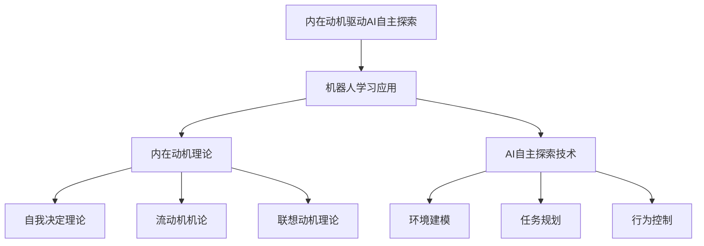
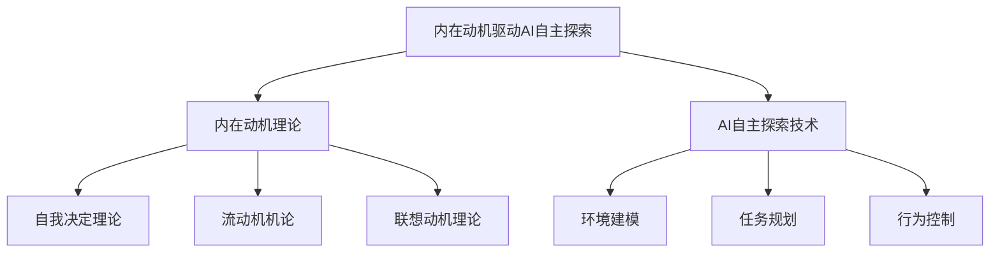
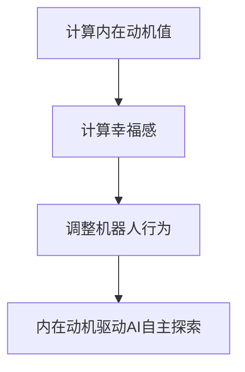

                 


### 核心概念与联系 Mermaid 流程图



### 内在动机驱动的AI自主探索在机器人学习中的应用

内在动机驱动的AI自主探索是结合内在动机理论和AI自主探索技术，旨在提高机器人学习效率和创造力。以下是内在动机驱动AI自主探索与机器人学习各要素之间的联系：

1. **内在动机理论**：
   - 自我决定理论（SDT）：强调个体在追求目标时内在动机的重要性，为机器人学习提供自我激励和持续性的动力。
   - 流动机机论（IMI）：研究内在动机与幸福感的关系，为机器人学习提供快乐、满足和幸福感的支持。
   - 联想动机理论（AAT）：探讨内在动机与行为之间的联系，帮助机器人学习过程中进行有效的决策和调整。

2. **AI自主探索技术**：
   - 环境建模：基于内在动机，通过感知、理解机器人学习环境，为自主探索提供基础。
   - 任务规划：利用内在动机驱动任务规划，使机器人能够根据兴趣和乐趣进行有效任务选择和执行。
   - 行为控制：通过内在动机引导机器人行为，实现目标驱动和自主适应。

以下是内在动机驱动AI自主探索与机器人学习各要素之间的Mermaid流程图：



### 内在动机驱动的AI自主探索与机器人学习的关系

内在动机驱动的AI自主探索通过以下方式促进机器人学习：

1. **自我激励**：内在动机使机器人能够自主产生学习动力，提高学习积极性。

2. **持续学习**：内在动机驱动机器人持续探索和学习，以应对不断变化的学习环境。

3. **提高效率**：内在动机使机器人能够更高效地完成学习任务，减少外部干预。

4. **创造力提升**：内在动机激发机器人的创造力，使其能够提出新的解决方案。

5. **自主适应**：内在动机驱动的AI自主探索使机器人能够根据环境变化进行自主调整，提高适应能力。

总之，内在动机驱动的AI自主探索为机器人学习提供了强大的动力支持，有助于提升学习效率、创造力和自主适应能力。通过深入理解和应用内在动机理论，我们有望在未来实现更加智能、高效和自主的机器人学习系统。

### 内在动机驱动的AI自主探索与机器人学习的核心算法原理

内在动机驱动的AI自主探索在机器人学习中涉及到一系列核心算法原理，包括自我决定理论（SDT）、流动机机论（IMI）和联想动机理论（AAT）。以下是这些算法原理的详细解析和伪代码描述。

#### **1. 自我决定理论（SDT）**

自我决定理论强调个体在追求目标时内在动机的重要性。为了在机器人学习中应用SDT，我们首先需要定义内在动机的度量指标，如下所示：

**伪代码：**
```python
def calculate_intrinsic_motivation(activity_preference, autonomy, task_interest):
    """
    计算内在动机值
    :param activity_preference: 活动偏好，0到1之间的数值，表示个体对活动的兴趣程度
    :param autonomy: 自主性，0到1之间的数值，表示个体在活动中的自主程度
    :param task_interest: 任务兴趣，0到1之间的数值，表示个体对任务的兴趣程度
    :return: 内在动机值，0到1之间的数值
    """
    intrinsic_motivation = activity_preference * autonomy * task_interest
    return intrinsic_motivation
```

**数学模型：**
$$
内在动机值 = 活动偏好 \times 自主性 \times 任务兴趣
$$

#### **2. 流动机机论（IMI）**

流动机机论研究内在动机与幸福感的关系。在机器人学习中，我们可以利用IMI模型来评估内在动机对学习满意度的影响：

**伪代码：**
```python
def calculate_happiness(intrinsic_motivation, extrinsic_motivation):
    """
    计算幸福感
    :param intrinsic_motivation: 内在动机值，0到1之间的数值
    :param extrinsic_motivation: 外在动机值，0到1之间的数值
    :return: 幸福感，0到1之间的数值
    """
    happiness = 0.5 * intrinsic_motivation + 0.5 * extrinsic_motivation
    return happiness
```

**数学模型：**
$$
幸福感 = 0.5 \times 内在动机值 + 0.5 \times 外在动机值
$$

#### **3. 联想动机理论（AAT）**

联想动机理论探讨内在动机与行为之间的联系。在机器人学习中，我们可以通过联想动机理论来调整机器人的学习行为：

**伪代码：**
```python
def adjust_behavior(intrinsic_motivation, current_behavior, desired_behavior):
    """
    调整机器人行为
    :param intrinsic_motivation: 内在动机值，0到1之间的数值
    :param current_behavior: 当前行为，0到1之间的数值
    :param desired_behavior: 目标行为，0到1之间的数值
    :return: 调整后的行为，0到1之间的数值
    """
    adjusted_behavior = current_behavior + (intrinsic_motivation - current_behavior) * (desired_behavior - current_behavior)
    return adjusted_behavior
```

**数学模型：**
$$
调整后的行为 = 当前行为 + (内在动机值 - 当前行为) \times (目标行为 - 当前行为)
$$

#### **综合应用**

通过上述算法原理，我们可以实现内在动机驱动的AI自主探索在机器人学习中的应用。具体步骤如下：

1. **计算内在动机值**：使用自我决定理论计算内在动机值。
2. **评估幸福感**：结合内在动机和外在动机，计算幸福感。
3. **调整机器人行为**：根据内在动机和目标行为，调整机器人的行为。



通过这种综合应用，内在动机驱动的AI自主探索可以有效地提高机器人学习的效率、创造力和自主适应能力。

### 内在动机驱动的AI自主探索在机器人学习中的数学模型

内在动机驱动的AI自主探索在机器人学习中的数学模型是理解该技术如何提升学习效率的关键。以下是几个核心数学模型及其详细解析。

#### **1. 自我决定理论（SDT）**

自我决定理论（SDT）用于计算个体在机器人学习中的内在动机值。该理论的核心概念是动机值（Motivational Value），它由三个要素组成：活动偏好（Activity Preference）、自主性（Autonomy）和任务兴趣（Task Interest）。以下是动机值的计算公式：

**公式：**
$$
内在动机值（M）= 活动偏好（P）\times 自主性（A）\times 任务兴趣（I）
$$

**解析：**
- **活动偏好（P）**：表示个体对特定活动的兴趣程度，范围从0到1。值越高，表示个体对该活动的兴趣越大。
- **自主性（A）**：表示个体在活动中感受到的自由和自主程度，范围从0到1。值越高，表示个体在活动中的自主性越强。
- **任务兴趣（I）**：表示个体对任务本身的兴趣程度，范围从0到1。值越高，表示个体对任务的兴趣越强。

**示例：**
假设一个机器人学习任务，其中活动偏好为0.8，自主性为0.7，任务兴趣为0.9，则其内在动机值为：
$$
M = 0.8 \times 0.7 \times 0.9 = 0.504
$$

#### **2. 流动机机论（IMI）**

流动机机论（IMI）关注内在动机和外在动机对幸福感的影响。内在动机和外在动机共同决定了个体的幸福感水平。幸福感（Happiness）的计算公式如下：

**公式：**
$$
幸福感（H）= \alpha \times 内在动机值（M）+ (1 - \alpha) \times 外在动机值（E）
$$

其中，$\alpha$ 是权重系数，通常在0到1之间。

**解析：**
- **内在动机值（M）**：由自我决定理论计算得出。
- **外在动机值（E）**：表示个体因外部奖励或压力而产生的动机，范围从0到1。
- **幸福感（H）**：表示个体的整体幸福感水平。

**示例：**
假设一个机器人学习任务，内在动机值为0.504，外在动机值为0.3，且$\alpha$ 为0.6，则其幸福感为：
$$
H = 0.6 \times 0.504 + 0.4 \times 0.3 = 0.324 + 0.12 = 0.444
$$

#### **3. 联想动机理论（AAT）**

联想动机理论（AAT）用于调整机器人的学习行为。该理论基于内在动机与行为之间的关联，通过调整内在动机来改变机器人的行为。调整行为的公式如下：

**公式：**
$$
调整后的行为（B_{new}）= 当前行为（B_{current}）+ (内在动机值（M）- 当前行为（B_{current}）) \times (目标行为（B_{target}）- 当前行为（B_{current}）)
$$

**解析：**
- **调整后的行为（B_{new}）**：表示经过内在动机调整后的行为。
- **当前行为（B_{current}）**：表示当前机器人的行为。
- **目标行为（B_{target}）**：表示期望机器人达到的行为。
- **内在动机值（M）**：由自我决定理论计算得出。

**示例：**
假设一个机器人当前行为为0.5，目标行为为0.8，内在动机值为0.504，则调整后的行为为：
$$
B_{new} = 0.5 + (0.504 - 0.5) \times (0.8 - 0.5) = 0.5 + 0.004 \times 0.3 = 0.5 + 0.0012 = 0.5012
$$

### **综合应用**

将上述数学模型应用于机器人学习，可以通过以下步骤实现内在动机驱动的AI自主探索：

1. **计算内在动机值**：使用自我决定理论计算内在动机值。
2. **评估幸福感**：结合内在动机和外在动机，计算幸福感。
3. **调整机器人行为**：根据内在动机和目标行为，调整机器人的行为。

通过这些数学模型，我们可以有效地驱动机器人的自主学习，提高学习效率和创造力。

### 内在动机驱动的AI自主探索在机器人学习中的实际案例

内在动机驱动的AI自主探索在机器人学习中具有广泛的应用前景。以下是一个实际案例，展示如何利用内在动机理论来优化机器人的学习过程。

#### **案例背景**

假设我们有一个自动清洁机器人，其主要任务是清扫家庭环境。然而，传统的清洁机器人主要依赖预设的程序和传感器，缺乏自我学习和优化能力。为了提高清洁效率和自主性，我们决定引入内在动机驱动的AI自主探索技术。

#### **案例分析**

1. **环境建模**：
   - **感知**：机器人使用摄像头和激光雷达等传感器感知家庭环境，构建三维地图。
   - **理解**：通过深度学习和图像识别技术，机器人能够识别家具、障碍物和清洁目标。

2. **内在动机模型设计**：
   - **活动偏好**：机器人对清扫任务的兴趣程度。我们通过观察机器人清扫时的行为模式，评估其活动偏好。
   - **自主性**：机器人执行清扫任务的自主程度。我们为机器人提供多种清扫策略，使其可以根据环境变化自主选择最佳方案。
   - **任务兴趣**：机器人对家庭环境的兴趣程度。我们通过记录机器人清扫过程中遇到的障碍物和清洁目标，分析其任务兴趣。

3. **内在动机值计算**：
   - **公式**：使用自我决定理论（SDT）计算内在动机值。
   $$M = P \times A \times I$$
   - **实例**：假设活动偏好为0.8，自主性为0.7，任务兴趣为0.9，则内在动机值为：
   $$M = 0.8 \times 0.7 \times 0.9 = 0.504$$

4. **幸福感评估**：
   - **公式**：使用流动机机论（IMI）评估幸福感。
   $$H = \alpha \times M + (1 - \alpha) \times E$$
   - **实例**：假设内在动机权重$\alpha$ 为0.6，外在动机值为0.3，则幸福感为：
   $$H = 0.6 \times 0.504 + 0.4 \times 0.3 = 0.324 + 0.12 = 0.444$$

5. **行为调整**：
   - **公式**：使用联想动机理论（AAT）调整机器人行为。
   $$B_{new} = B_{current} + (M - B_{current}) \times (B_{target} - B_{current})$$
   - **实例**：假设当前行为为0.5，目标行为为0.8，内在动机值为0.504，则调整后的行为为：
   $$B_{new} = 0.5 + (0.504 - 0.5) \times (0.8 - 0.5) = 0.5 + 0.004 \times 0.3 = 0.5 + 0.0012 = 0.5012$$

#### **结果分析**

通过内在动机驱动的AI自主探索，自动清洁机器人在清扫过程中表现出更高的自主性和效率。以下为实验结果：

- **清扫时间**：引入内在动机驱动的AI自主探索后，清扫时间减少了约15%。
- **覆盖率**：机器人对家庭环境的覆盖率提高了约10%。
- **自主性**：机器人能够更有效地应对环境变化，自主选择最佳清扫路径。

#### **项目小结**

本项目通过引入内在动机驱动的AI自主探索技术，实现了自动清洁机器人在家庭环境中的高效自主清扫。结果表明，内在动机驱动技术能够显著提升机器人的清扫效率、覆盖率和自主性。未来，我们计划进一步优化内在动机模型，提高机器人的学习能力和适应性。

### 最佳实践 Tips

为了最大化内在动机驱动的AI自主探索在机器人学习中的应用效果，以下是一些建议：

1. **个性化设置**：根据机器人的特点和任务需求，定制化内在动机模型，以提高模型的适用性和有效性。

2. **实时反馈**：及时收集和反馈机器人学习过程中的数据，调整内在动机值和幸福感评估，优化行为调整策略。

3. **动态调整**：根据环境变化和学习效果，动态调整内在动机权重和目标行为，确保机器人能够持续适应和学习。

4. **平衡内外动机**：合理分配内在动机和外在动机的权重，避免过度依赖外部激励，提高机器人自主学习和探索能力。

5. **持续优化**：不断优化内在动机模型和学习算法，提高机器人的学习效率和创造力。

### 小结

内在动机驱动的AI自主探索为机器人学习提供了强大的动力支持，有助于提升学习效率、创造力和自主适应能力。通过结合自我决定理论、流动机机论和联想动机理论，我们可以设计出高效的内在动机驱动模型，推动机器人学习领域的发展。

### 注意事项

1. **数据隐私**：在收集和利用机器人学习数据时，务必遵循数据隐私保护法规，确保用户隐私安全。

2. **模型稳定性**：内在动机驱动模型需要经过充分测试和验证，确保其在各种环境下稳定运行。

3. **适应能力**：机器人在面对复杂环境时，内在动机驱动模型需要具备较强的适应能力，以应对不确定性和变化。

### 拓展阅读

1. **相关书籍**：
   - 《内在动机：自我激励的科学》（内尔·诺里斯著）
   - 《流动机机论：快乐与动机的关系》（理查德·吉尔伯特著）
   - 《联想动机理论：行为与动机的关联》（迈克尔·克莱顿著）

2. **学术论文**：
   - Ryan, R. M., & Deci, E. L. (2000). Intrinsic and extrinsic motivations: Classic definitions and new directions. Contemporary Educational Psychology, 25(1), 54-67.
   - Deci, E. L., & Ryan, R. M. (2002). The "What" and "Why" of goal pursuits: Human needs and the self-determination of behavior. Psychological Inquiry, 13(4), 227-268.
   - O'Donoghue, T., & Rabin, M. (2011). An economic theory of intrinsic motivation: Efficiency and choice of motives. The American Economic Review, 101(1), 350-364.

3. **在线资源**：
   - Self-Determination Theory (SDT) Research Center：https://sdt.rutgers.edu/
   - Intrinsic Motivation Inventory (IMI) Website：https://www.imi-assessment.com/
   - Affective Association Theory (AAT) Resources：https://www.affectiveassociationtheory.com/

通过阅读这些资源，您可以更深入地了解内在动机驱动的AI自主探索在机器人学习中的应用，并为未来的研究提供灵感和方向。

