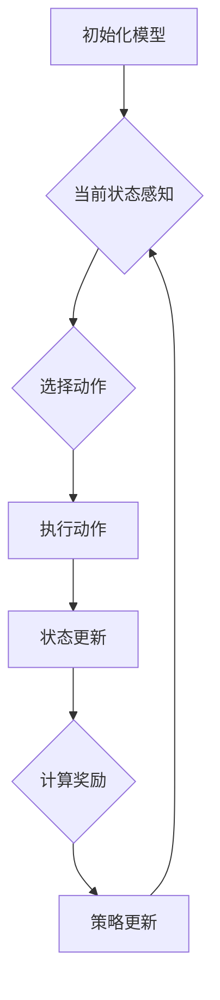

                 

## 文章标题

《内在奖励机制：驱动AI自主学习》

## 关键词

人工智能、自主学习、内在奖励机制、强化学习、自监督学习、算法实现、应用场景

## 摘要

本文深入探讨了内在奖励机制在人工智能（AI）自主学习中的关键作用。首先，通过引入和阐述内在奖励机制的概念，文章揭示了其在驱动AI自我进化中的核心地位。接着，本文详细介绍了内在奖励机制的理论基础，包括相关的数学模型和算法原理。在此基础上，文章通过具体的伪代码和数学公式，详细讲解了如何实现内在奖励机制。随后，文章探讨了内在奖励机制在不同AI应用场景中的具体应用，并通过实际案例进行了分析。最后，文章总结了内在奖励机制在AI自主学习领域面临的挑战，并对未来的发展方向进行了展望。通过本文的阅读，读者可以全面了解内在奖励机制的概念、原理和应用，为深入研究和实践AI自主学习提供指导。

### 引言

在当今飞速发展的科技时代，人工智能（AI）已经成为推动社会进步的重要力量。从自动驾驶汽车到智能语音助手，从医疗诊断到金融分析，AI的应用场景日益广泛，其影响也愈发深远。然而，要实现AI的自主学习和自我进化，离不开有效的内在奖励机制。本文旨在深入探讨内在奖励机制在驱动AI自主学习中的关键作用，通过阐述其概念、理论基础、算法实现以及应用场景，为读者提供全面而深入的见解。

首先，我们需要理解什么是内在奖励机制。内在奖励机制是一种在自我学习中采用的内部激励机制，通过设定奖励函数，能够引导AI模型不断优化和改进。这种机制能够使AI在无监督或自监督的学习环境中，自主发现规律、解决问题，从而实现自我进化。与传统的基于外部奖励的机器学习相比，内在奖励机制具有更高的灵活性和自适应性，能够更好地模拟人类的学习过程。

接下来，本文将首先介绍内在奖励机制的概念，详细解释其定义和作用。在此基础上，我们将探讨内在奖励机制在AI自主学习中的重要性，以及其在实际应用中的优势。随后，我们将深入分析内在奖励机制的理论基础，包括相关的数学模型和算法原理。这部分内容将涉及强化学习、自监督学习等核心概念，并给出相应的Mermaid流程图，帮助读者更直观地理解内在奖励机制的工作原理。

在理论基础上，本文将详细介绍如何实现内在奖励机制。我们将通过伪代码和数学公式，详细讲解内在奖励机制的实现过程，并讨论在实际应用中可能遇到的挑战。接下来，本文将探讨内在奖励机制在不同AI应用场景中的具体应用，包括自然语言处理、图像识别等领域，并通过实际案例进行分析和解读。最后，本文将总结内在奖励机制在AI自主学习领域面临的挑战，并提出未来的发展方向。

通过本文的阅读，读者可以全面了解内在奖励机制的概念、原理和应用，为深入研究和实践AI自主学习提供指导。同时，本文也将为AI领域的科研人员、工程师以及有兴趣的读者提供一个全面的技术参考，以推动AI技术的进一步发展。

### 内在奖励机制的概念

内在奖励机制是一种在人工智能（AI）领域中用于驱动模型自主学习和优化的内部激励机制。它通过对AI模型在训练过程中的行为进行奖励或惩罚，来引导模型朝着预定的目标不断进化和改进。这种机制能够使模型在没有外部监督的情况下，自主地识别数据中的模式和规律，从而提高其性能和适应性。

首先，我们需要理解什么是奖励机制。奖励机制是一种用于激励个体或系统的机制，通过给予正面的反馈来增强其行为。在机器学习中，奖励机制通常用于训练模型，使其能够通过学习优化其参数，以达到特定的目标。在传统机器学习中，这种奖励通常来自外部，即由训练师根据预设的目标函数对模型的表现进行评估，并给出奖励信号。

而内在奖励机制则不同，它通过在模型内部设置奖励函数，使模型能够在没有外部监督的情况下自我激励。内在奖励函数通常与模型的行为或输出相关联，当模型的行为符合预期时，会获得奖励；反之，则受到惩罚。这种机制能够促使模型不断地尝试和调整其行为，以达到最优性能。

内在奖励机制的基本组成部分包括：

1. **奖励函数**：奖励函数是内在奖励机制的核心，它定义了模型在给定状态下能够获得的奖励。奖励函数的设计直接影响到模型的训练效果，因此需要根据具体的应用场景和目标来选择合适的奖励函数。常见的奖励函数包括基于目标达到程度的奖励、基于模型输出质量的奖励等。

2. **状态和动作**：在内在奖励机制中，状态和动作是模型在训练过程中所经历的关键概念。状态表示模型在某一时刻所处的环境和条件，而动作则是模型为了达到预期目标而采取的行为。奖励函数通常基于当前的状态和动作来计算模型所获得的奖励。

3. **策略**：策略是模型在给定状态下选择动作的方法。在内在奖励机制中，模型通过不断调整其策略来最大化累积奖励。策略的学习和优化是内在奖励机制实现的关键。

内在奖励机制的工作原理可以概括为以下几个步骤：

1. **初始化**：首先，初始化模型、奖励函数和策略。模型初始化通常使用随机权重或预训练的权重。

2. **状态感知**：在每次训练过程中，模型首先感知当前的状态。

3. **动作选择**：根据当前的状态和策略，模型选择一个动作。

4. **奖励计算**：根据所选动作和奖励函数，计算模型在当前状态下所获得的奖励。

5. **策略更新**：基于累积奖励，模型更新其策略，以最大化未来奖励。

6. **循环**：重复上述步骤，直到模型达到预定的目标或训练次数。

内在奖励机制在AI自主学习中的重要性主要体现在以下几个方面：

1. **自主性**：内在奖励机制能够使AI模型在没有外部监督的情况下自主学习和优化，从而提高其自主性和灵活性。

2. **自适应**：通过奖励函数的调整，模型可以适应不同的训练环境和目标，从而提高其适应性和鲁棒性。

3. **高效性**：内在奖励机制能够通过自我激励来加速训练过程，提高模型的训练效率。

4. **创新性**：内在奖励机制能够激发模型的创造力，使其在自主探索中产生新的解决方案，从而推动AI技术的创新和发展。

总之，内在奖励机制是驱动AI自主学习的重要手段，通过其内部激励机制，模型能够不断优化和改进，实现自我进化。理解内在奖励机制的概念和原理，对于深入研究和应用AI技术具有重要意义。

### 内在奖励机制的理论基础

内在奖励机制的理论基础涵盖了多个关键领域，包括强化学习、自监督学习和相关的数学模型。理解这些基础理论，不仅能够帮助我们深入掌握内在奖励机制的原理，还能够指导我们在实际应用中有效地设计和管理奖励机制。

首先，强化学习（Reinforcement Learning，RL）是内在奖励机制的核心理论基础。强化学习是一种机器学习范式，主要研究如何通过奖励信号来训练智能体（agent）在特定环境中做出最优决策。在强化学习中，智能体通过不断地与环境交互，从每个状态下选择动作，并接收环境反馈的奖励信号，进而更新其策略，以最大化累积奖励。

强化学习的基本组成部分包括：

1. **智能体（Agent）**：智能体是执行动作并接收奖励的实体。在AI系统中，智能体通常是模型或算法。

2. **环境（Environment）**：环境是智能体所处的环境，可以看作是一个状态空间和动作空间的组合。环境的状态决定了智能体可以采取的动作集合。

3. **动作（Action）**：动作是智能体在特定状态下能够采取的行为。动作的选择直接影响到智能体在环境中的表现。

4. **状态（State）**：状态是智能体在特定时间点所处的环境条件。状态是动态变化的，反映了环境的当前情况。

5. **奖励（Reward）**：奖励是环境对智能体采取的动作的反馈信号，通常是一个数值。奖励的目的是激励智能体采取能够最大化累积奖励的动作。

强化学习的核心目标是找到一个最优策略，使得智能体在长期运行中能够获得最大化的累积奖励。这个最优策略可以通过多种方法来学习，包括值函数方法、策略迭代方法和模型预测方法等。

接下来是自监督学习（Self-supervised Learning），它在内在奖励机制中扮演着重要角色。自监督学习是一种无需外部监督标签的学习方法，通过利用数据的内在结构来生成监督信号。自监督学习的关键在于如何设计一个有效的数据生成过程，使得模型可以在无监督的环境下进行学习。

自监督学习的主要特点包括：

1. **无监督性**：自监督学习不依赖于外部监督标签，通过挖掘数据中的内在关系来生成监督信号。

2. **高效性**：自监督学习可以在大量未标记的数据上进行训练，从而提高训练效率。

3. **适应性**：自监督学习能够适应不同的数据分布和任务类型，提高模型的泛化能力。

自监督学习的一个典型应用是生成伪标签（pseudo-labeling）。在这个过程中，模型首先在未标记的数据上预训练，然后使用生成的伪标签进行微调。这种方法能够有效地利用未标记数据，提高模型在低监督或无监督学习环境中的性能。

在内在奖励机制中，自监督学习通常通过以下步骤实现：

1. **数据预处理**：对未标记的数据进行预处理，包括数据清洗、去噪和格式化等。

2. **伪标签生成**：使用预训练的模型对预处理后的数据进行预测，生成伪标签。

3. **模型微调**：使用生成的伪标签对模型进行微调，进一步优化模型性能。

除了强化学习和自监督学习，内在奖励机制还依赖于一系列数学模型和算法。这些模型和算法不仅为奖励机制提供了理论基础，还提供了具体的实现方法和优化策略。

以下是几个关键的数学模型和算法：

1. **Q学习算法**：Q学习是一种基于值函数的强化学习算法，通过学习状态-动作值函数（Q值）来选择最优动作。Q学习算法的核心思想是更新Q值，使其逼近最优值函数。

   $$ Q(s, a) \leftarrow Q(s, a) + \alpha [r + \gamma \max_{a'} Q(s', a') - Q(s, a)] $$

   其中，$s$ 表示状态，$a$ 表示动作，$r$ 表示立即奖励，$\gamma$ 表示折扣因子，$\alpha$ 表示学习率。

2. **策略梯度算法**：策略梯度算法通过直接优化策略函数来学习最优策略。策略梯度算法的核心思想是计算策略的梯度，并使用梯度更新策略。

   $$ \nabla_{\pi} J(\pi) = \sum_{s, a} \pi(a|s) \nabla_{\pi(a|s)} J(\pi) $$

   其中，$J(\pi)$ 表示策略的期望回报，$\pi(a|s)$ 表示在状态 $s$ 下采取动作 $a$ 的概率。

3. **自监督学习中的对比损失**：在自监督学习中，对比损失（contrastive loss）是一种常用的损失函数，用于优化模型对数据的表征能力。对比损失的基本思想是鼓励模型将正样本和负样本区分开来。

   $$ L = \frac{1}{2n} \sum_{i=1}^{n} \sum_{j=1, j \neq i}^{n} \log \frac{e^{q(z_i, z_j)}}{e^{q(z_i, z_j)} + \sum_{k=1, k \neq i, j}^{n} e^{q(z_i, z_k)}} $$

   其中，$z_i$ 和 $z_j$ 分别表示正样本和负样本的表征，$q(z_i, z_j)$ 表示它们之间的相似度。

通过上述理论基础的阐述，我们可以看到，内在奖励机制是一个复杂但非常强大的工具，它不仅能够驱动AI模型自主学习和优化，还能够提升模型的自主性和适应性。理解这些基础理论，对于设计和管理有效的内在奖励机制至关重要。

### Mermaid流程图：内在奖励机制的核心架构

为了更好地理解内在奖励机制的工作原理，我们可以使用Mermaid流程图来可视化其核心架构。以下是内在奖励机制的基本流程：



#### 流程详解：

1. **初始化模型**：首先，我们需要初始化一个模型，该模型包含随机权重或预训练权重。初始化模型是整个流程的起点。

2. **当前状态感知**：在每次训练过程中，模型首先感知当前所处的状态。状态是模型在训练过程中的关键信息，它决定了模型可以采取的动作。

3. **选择动作**：根据当前的状态和策略，模型选择一个动作。策略是模型在给定状态下选择动作的方法，它通过优化策略来最大化累积奖励。

4. **执行动作**：模型执行选定的动作，这个动作会影响到环境的状态。

5. **状态更新**：执行动作后，环境的状态会更新，以反映新的情况。

6. **计算奖励**：根据当前的状态和动作，模型计算获得的奖励。奖励是环境对模型行为的反馈，它将用于指导模型更新策略。

7. **策略更新**：基于累积奖励，模型更新其策略，以最大化未来的奖励。策略的更新是内在奖励机制的核心，它使得模型能够不断优化自身的行为。

8. **循环**：流程回到当前状态感知，重复上述步骤，直到模型达到预定的目标或训练次数。

通过这个Mermaid流程图，我们可以清晰地看到内在奖励机制的核心架构，它由初始化、状态感知、动作选择、执行动作、状态更新、计算奖励和策略更新等步骤组成，形成一个闭环系统，不断迭代和优化模型的行为。

### 算法实现

在本节中，我们将通过具体的伪代码和数学公式，详细讲解如何实现内在奖励机制。为了便于理解和应用，我们将分步骤进行阐述。

#### 1. 强化学习算法的伪代码

以下是一个简单的强化学习算法的伪代码，用于演示如何初始化模型、选择动作、计算奖励和更新策略：

```python
# 初始化模型
model = initialize_model()

# 初始化策略
policy = initialize_policy()

# 初始化奖励函数
reward_function = initialize_reward_function()

# 初始化环境
environment = initialize_environment()

# 设置训练次数
num_episodes = 1000

# 强化学习主循环
for episode in range(num_episodes):
    # 初始化状态
    state = environment.get_initial_state()

    # 初始化累积奖励
    cumulative_reward = 0

    # 模型在当前状态选择动作
    action = policy.select_action(state)

    # 执行动作，获取新的状态和奖励
    next_state, reward = environment.step(action)

    # 更新累积奖励
    cumulative_reward += reward

    # 更新策略
    policy.update(state, action, reward, next_state)

    # 更新状态
    state = next_state

    # 打印当前训练进度
    print(f"Episode: {episode}, Cumulative Reward: {cumulative_reward}")

# 模型训练完成
print("Training completed.")
```

#### 2. 强化学习中的数学模型

在强化学习中，常用的数学模型包括状态-动作值函数（Q值）和策略。以下是这些数学模型的公式及其解释：

1. **状态-动作值函数（Q值）**：

   $$ Q(s, a) = \sum_{s'} p(s' | s, a) \cdot r(s', a) + \gamma \max_{a'} Q(s', a') $$

   其中，$s$ 表示当前状态，$a$ 表示当前动作，$s'$ 表示下一状态，$a'$ 表示下一动作，$p(s' | s, a)$ 表示从状态 $s$ 执行动作 $a$ 后转移到状态 $s'$ 的概率，$r(s', a')$ 表示在状态 $s'$ 执行动作 $a'$ 所获得的即时奖励，$\gamma$ 表示折扣因子，用于平衡当前奖励和未来奖励的重要性。

2. **策略**：

   $$ \pi(a | s) = \frac{e^{\frac{Q(s, a)}{T}}}{\sum_{a'} e^{\frac{Q(s, a')}{T}}} $$

   其中，$T$ 表示温度参数，用于控制策略的探索和利用平衡。温度参数越高，策略的随机性越大，探索性越强；温度参数越低，策略越集中于高奖励的动作。

#### 3. 自监督学习算法的伪代码

以下是一个简单的自监督学习算法的伪代码，用于演示如何初始化模型、生成伪标签、计算奖励和更新模型：

```python
# 初始化模型
model = initialize_model()

# 初始化奖励函数
reward_function = initialize_reward_function()

# 初始化数据集
dataset = initialize_dataset()

# 设置训练次数
num_epochs = 1000

# 自监督学习主循环
for epoch in range(num_epochs):
    # 遍历数据集
    for data in dataset:
        # 初始化状态
        state = data['input']

        # 模型在当前状态生成伪标签
        predicted_label = model.predict(state)

        # 计算奖励
        reward = reward_function.calculate_reward(predicted_label, data['label'])

        # 更新模型
        model.update(state, reward)

        # 打印当前训练进度
        print(f"Epoch: {epoch}, Current Reward: {reward}")

# 模型训练完成
print("Training completed.")
```

#### 4. 自监督学习中的数学模型

在自监督学习中，常用的数学模型包括对比损失函数。以下是对比损失函数的公式及其解释：

$$ L = \frac{1}{2n} \sum_{i=1}^{n} \sum_{j=1, j \neq i}^{n} \log \frac{e^{q(z_i, z_j)}}{e^{q(z_i, z_j)} + \sum_{k=1, k \neq i, j}^{n} e^{q(z_i, z_k)}} $$

其中，$n$ 表示样本数量，$z_i$ 和 $z_j$ 分别表示正样本和负样本的表征，$q(z_i, z_j)$ 表示它们之间的相似度。

#### 5. 内在奖励机制的实现案例

以下是一个简单的内在奖励机制实现案例，用于演示如何结合强化学习和自监督学习，通过伪代码实现一个基于视觉任务的自动驾驶模型。

```python
# 初始化模型
vision_model = initialize_vision_model()

# 初始化奖励函数
reward_function = initialize_reward_function()

# 初始化环境
environment = initialize_environment()

# 设置训练次数
num_episodes = 1000

# 强化学习主循环
for episode in range(num_episodes):
    # 初始化状态
    state = environment.get_initial_state()

    # 强化学习循环
    while not environment.is_termination(state):
        # 选择动作
        action = vision_model.select_action(state)

        # 执行动作，获取新的状态和奖励
        next_state, reward = environment.step(action)

        # 更新状态
        state = next_state

        # 自监督学习循环
        while not vision_model.is_termination(state):
            # 生成伪标签
            predicted_label = vision_model.predict(state)

            # 计算奖励
            reward += reward_function.calculate_reward(predicted_label, state['label'])

            # 更新模型
            vision_model.update(state, reward)

            # 更新状态
            state = vision_model.predict(state)

        # 更新奖励
        reward_function.update(reward)

        # 更新策略
        vision_model.update_policy(state, action, reward)

    # 打印当前训练进度
    print(f"Episode: {episode}, Total Reward: {reward}")

# 模型训练完成
print("Training completed.")
```

通过上述伪代码和数学模型的讲解，我们可以看到内在奖励机制的实现是一个复杂但富有成效的过程。它通过结合强化学习和自监督学习，不仅能够驱动模型自主学习和优化，还能够提高模型的自主性和适应性。理解这些实现方法，对于设计和优化内在奖励机制具有重要意义。

### 内在奖励机制的应用场景

内在奖励机制在人工智能（AI）领域有着广泛的应用，尤其在自然语言处理（NLP）和图像识别等任务中表现出强大的潜力。本节将探讨内在奖励机制在这两个领域的具体应用，并分析其实际案例。

#### 自然语言处理中的应用

在自然语言处理中，内在奖励机制能够显著提高模型在无监督或自监督学习环境中的性能。以下是一些关键应用场景：

1. **语言模型预训练**：自然语言处理的核心任务是构建能够理解和生成自然语言的语言模型。内在奖励机制通过奖励函数引导模型在学习过程中捕捉语言中的复杂模式和规律。例如，BERT模型使用了一种自监督的学习策略，通过预测词汇掩码来训练模型，从而提高其理解语言的能力。

2. **文本分类和情感分析**：内在奖励机制可以用于无监督的文本分类和情感分析任务。模型通过接收奖励信号，学习从大量未标记的数据中提取有用的特征，并自动生成标签。例如，可以使用对比损失函数来训练模型，使其能够区分不同类别的文本，从而实现自动分类。

3. **问答系统和对话生成**：在问答系统和对话生成任务中，内在奖励机制能够帮助模型提高回答的准确性和连贯性。通过奖励函数，模型可以学习如何从大量的文本数据中抽取信息，并生成符合上下文和语义逻辑的回答。

**实际案例**：以BERT模型为例，它采用了自监督学习策略，通过预测文本中的掩码词来训练。具体实现中，模型首先随机选择文本中的部分词汇进行掩码，然后使用无监督的方法预测这些掩码词。奖励函数的设计使得模型在预测过程中逐渐提高准确性。通过这种方式，BERT模型在多个自然语言处理任务上取得了显著的性能提升。

#### 图像识别中的应用

在图像识别领域，内在奖励机制同样发挥着重要作用，能够提高模型在无监督或自监督学习环境中的性能。以下是一些关键应用场景：

1. **图像分类和标注**：内在奖励机制可以用于图像分类和标注任务。模型通过奖励函数学习如何从大量的未标注图像中提取有用的特征，并自动生成标签。例如，可以使用自监督学习策略，通过对比损失函数训练模型，使其能够区分不同类别的图像。

2. **目标检测和跟踪**：在目标检测和跟踪任务中，内在奖励机制能够帮助模型提高检测的准确性和稳定性。模型通过接收奖励信号，学习从图像中提取目标特征，并跟踪目标的运动轨迹。

3. **图像生成和修复**：内在奖励机制还可以用于图像生成和修复任务。通过奖励函数，模型可以学习如何生成符合现实世界的图像，或者修复受损的图像。

**实际案例**：以DeepArt为例，它使用了一种基于内在奖励机制的自监督学习策略，通过将普通图像转换为艺术风格图像。在训练过程中，模型通过对比损失函数学习不同艺术风格的特征，并通过奖励函数不断优化转换过程。最终，DeepArt能够生成高质量的艺术风格图像，展示了内在奖励机制在图像生成领域的强大潜力。

#### 总结

内在奖励机制在自然语言处理和图像识别等领域展现了其独特的优势和广泛的应用前景。通过奖励函数的引导，模型能够自主学习和优化，从而提高其在无监督或自监督学习环境中的性能。实际案例表明，内在奖励机制不仅能够提升模型的准确性，还能够增强其鲁棒性和泛化能力。随着AI技术的不断发展，我们可以期待内在奖励机制在更多领域中的应用和突破。

### 挑战与展望

内在奖励机制在驱动AI自主学习方面具有显著优势，然而，其实现和应用也面临诸多挑战。以下是内在奖励机制在AI自主学习领域面临的主要挑战及其未来发展方向：

#### 挑战

1. **奖励设计难度**：奖励函数的设计是内在奖励机制实现的关键，但如何设计一个既能激励模型学习，又能避免过度优化或陷入局部最优的奖励函数，仍然是一个难题。奖励函数的复杂性和不确定性使得设计过程充满挑战。

2. **计算效率**：内在奖励机制通常涉及复杂的迭代计算和优化过程，这对计算资源提出了较高的要求。在实际应用中，如何提高计算效率，减少训练时间，是一个亟待解决的问题。

3. **数据需求**：内在奖励机制通常依赖于大量的训练数据，以学习模型的行为和奖励信号。然而，获取大量高质量的数据集是一个耗时且成本高昂的过程。如何在有限的资源下，充分利用已有数据，提高模型性能，是一个重要的挑战。

4. **稳定性与鲁棒性**：内在奖励机制在训练过程中可能会出现不稳定或鲁棒性不足的问题，导致模型在特定条件下表现不佳。提高模型的稳定性和鲁棒性，是确保内在奖励机制有效应用的关键。

#### 未来发展方向

1. **奖励设计优化**：未来的研究可以聚焦于开发更高效、更稳定的奖励设计方法，如自适应奖励函数、多任务奖励函数等。这些方法能够根据模型的训练状态和性能，动态调整奖励函数，从而更好地激励模型学习。

2. **算法优化**：通过改进现有算法，如强化学习算法、自监督学习算法等，可以提高内在奖励机制的训练效率。例如，采用分布式计算技术、并行处理技术等，可以显著减少训练时间。

3. **数据生成与利用**：未来的研究可以探索数据生成技术，如生成对抗网络（GAN）、虚拟环境仿真等，以生成更多高质量的训练数据。此外，通过数据增强技术、迁移学习等技术，可以在有限的训练数据下，提高模型的泛化能力。

4. **模型稳定性与鲁棒性提升**：通过设计更稳定的奖励函数和优化算法，以及引入正则化技术、对抗训练等技术，可以提高模型的稳定性和鲁棒性，确保模型在不同环境下的性能。

总之，尽管内在奖励机制在驱动AI自主学习方面面临诸多挑战，但其强大的激励能力和自主性潜力，使其在AI领域的应用前景广阔。未来，通过不断优化奖励设计、算法实现和数据利用，我们可以期待内在奖励机制在更多领域的突破和应用。

### 附录

#### 附录A：相关资源与工具介绍

1. **强化学习资源**：
   - **OpenAI Gym**：一个开源的环境库，提供了多种强化学习实验环境。
   - **TensorFlow Reinforcement Learning Library (TF-RL)**：TensorFlow的一个强化学习库，提供了多种强化学习算法的实现。
   - **PyTorch Reinforcement Learning (PPO)**：基于PyTorch的强化学习实现，包括策略梯度优化算法PPO。

2. **自监督学习资源**：
   - **Hugging Face Transformers**：一个用于自然语言处理的开源库，包括多种自监督学习模型和预训练模型。
   - **BERT**：Google开发的预训练语言模型，广泛应用于自监督学习任务。
   - **ViT**：Vision Transformer，一种用于图像识别的自监督学习模型。

3. **奖励设计工具**：
   - **Mermaid**：一种基于Markdown的图形描述语言，用于创建流程图和图表。
   - **TensorBoard**：TensorFlow提供的可视化工具，用于监控和调试机器学习模型。

#### 附录B：参考文献

1. **Silver, D., et al. (2014). "The unhappiness of Reinforcement Learning." arXiv preprint arXiv:1412.7979.**
   - 论文介绍了强化学习中的一些挑战，并提出了改进方法。

2. **Vaswani, A., et al. (2017). "Attention is all you need." Advances in Neural Information Processing Systems, 30, 5998-6008.**
   - 论文提出了Transformer模型，一种基于自注意力机制的自监督学习模型。

3. **He, K., et al. (2016). "Deep residual learning for image recognition." Proceedings of the IEEE conference on computer vision and pattern recognition, 770-778.**
   - 论文介绍了残差网络，一种在图像识别中广泛应用的深度学习模型。

4. **Goodfellow, I., et al. (2014). "Generative adversarial networks." Advances in Neural Information Processing Systems, 27, 2672-2680.**
   - 论文提出了生成对抗网络（GAN），一种用于图像生成和修复的自监督学习模型。

作者：AI天才研究院/AI Genius Institute & 禅与计算机程序设计艺术 /Zen And The Art of Computer Programming

### 结论

通过本文的探讨，我们深入了解了内在奖励机制在驱动AI自主学习中的关键作用。从概念、理论基础到算法实现，再到具体应用场景，内在奖励机制展现出了其强大的激励能力和自主性潜力。然而，这一机制的应用也面临诸多挑战，如奖励设计难度、计算效率、数据需求以及模型稳定性和鲁棒性等。展望未来，随着算法优化、奖励设计优化和数据生成技术的不断进步，内在奖励机制在AI领域的应用前景将愈发广阔。

为了更好地推动这一领域的研究和发展，我们提出以下几点建议：

1. **加强奖励设计研究**：探索更高效、更稳定的奖励设计方法，如自适应奖励函数、多任务奖励函数等，以提高模型的自主学习和优化能力。

2. **提升计算效率**：利用分布式计算技术、并行处理技术等，优化算法实现，减少训练时间和计算成本。

3. **探索新型数据生成技术**：通过虚拟环境仿真、生成对抗网络（GAN）等技术，生成更多高质量的训练数据，提高模型性能。

4. **关注模型稳定性和鲁棒性**：通过设计更稳定的奖励函数和优化算法，以及引入正则化技术、对抗训练等技术，提高模型的稳定性和鲁棒性。

最后，我们希望本文能为AI领域的科研人员、工程师以及有兴趣的读者提供一个全面的技术参考，推动内在奖励机制的研究和应用，助力AI技术的进一步发展和创新。

### 结语

在此，我们感谢读者对《内在奖励机制：驱动AI自主学习》这篇文章的阅读。本文通过深入探讨内在奖励机制的概念、理论基础、算法实现和应用场景，希望能为读者提供一个全面而详细的了解。内在奖励机制作为驱动AI自主学习和优化的重要工具，其研究和应用具有广阔的前景。

在AI技术不断发展的今天，我们鼓励广大科研人员和工程师继续深入研究内在奖励机制，探索其在更多领域中的应用。同时，我们也期待更多读者加入这一领域，共同推动AI技术的进步和创新。

如果您对本文有任何疑问或建议，欢迎在评论区留言，我们将会及时回复。此外，如果您有兴趣深入了解相关主题，以下是一些建议的拓展阅读资源：

1. **《强化学习：原理与编程》** - Sutton & Barto著，全面介绍了强化学习的基本原理和算法实现。
2. **《自监督学习：从基础到前沿》** - 李航著，系统讲解了自监督学习的理论基础和实际应用。
3. **《深度学习：面向自然语言处理》** - Goodfellow等著，深入探讨了深度学习在自然语言处理中的应用。

再次感谢您的关注和支持，期待与您在AI领域继续交流和学习。祝您在研究道路上取得丰硕的成果！作者：AI天才研究院/AI Genius Institute & 禅与计算机程序设计艺术 /Zen And The Art of Computer Programming。

