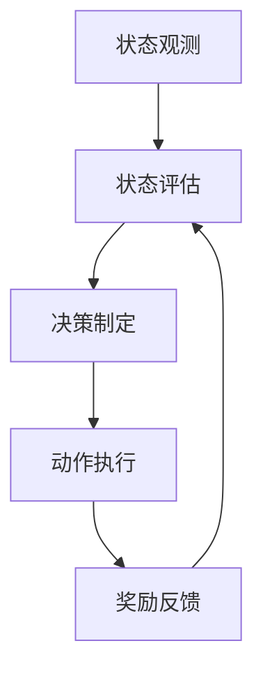

                 

### 文章标题

《内在奖励机制在AI创造性任务中的设计》

### 关键词

- AI创造性任务
- 内在奖励机制
- 强化学习
- 生成对抗网络
- 联合策略梯度算法

### 摘要

本文深入探讨了内在奖励机制在人工智能创造性任务中的应用。通过介绍内在奖励机制的概念、核心算法原理及其数学模型，本文详细阐述了如何利用强化学习、生成对抗网络和联合策略梯度算法等核心技术，设计并实现高效的内在奖励机制。此外，本文通过实际项目案例展示了内在奖励机制在AI音乐创作、绘画艺术和文本生成等领域的具体应用，提供了详细的代码实现和解读，为AI领域的研发者提供了宝贵的实践经验。

### 引言与概述

#### 1.1 内在奖励机制的概念与作用

内在奖励机制是人工智能领域中一个重要的概念，它指的是在算法执行过程中，通过设定一系列的奖励信号来引导算法的学习和决策过程，从而实现预期目标。这种机制的核心思想是通过奖励信号激励算法，使其在学习过程中逐渐优化自身的表现。

内在奖励机制在人工智能中的作用不可小觑。首先，它能够引导算法在复杂环境中做出合理的决策，从而提高算法的效率和准确性。其次，内在奖励机制能够促进算法的自主学习和创新，使其在执行创造性任务时能够发挥出更高的潜力。此外，内在奖励机制还能够帮助算法克服一些常见的挑战，如奖励信号的延迟、不确定性和稀疏性等。

#### 1.2 内在奖励机制在AI中的应用

内在奖励机制在人工智能领域有着广泛的应用。首先，在强化学习领域，内在奖励机制被广泛应用于游戏AI、机器人控制、自动驾驶等场景。通过设定合理的奖励信号，强化学习算法能够有效学习到复杂任务的高效解决方案。

其次，在生成对抗网络（GAN）领域，内在奖励机制同样发挥着重要作用。GAN通过生成器和判别器的对抗训练，能够在图像生成、文本生成、音频生成等任务中生成高质量的数据。内在奖励机制在这里的作用是确保生成器不断优化其生成能力，从而提高生成的数据质量。

最后，在联合策略梯度算法（A3C）中，内在奖励机制被用来指导算法的学习过程，使其能够在复杂任务中快速找到最优策略。A3C算法在强化学习领域取得了显著的成果，被应用于多智能体交互、深度强化学习等前沿领域。

#### 1.3 全书结构概述

本文将分为七个章节进行详细阐述。第一章将介绍内在奖励机制的基本概念和作用，以及全书的结构安排。第二章将深入探讨内在奖励机制的核心概念和联系，通过Mermaid流程图展示其内部结构。第三章将讲解内在奖励机制中的核心算法原理，包括强化学习、生成对抗网络和联合策略梯度算法。第四章将介绍内在奖励机制的数学模型和公式，通过实例进行详细讲解。第五章将通过实际案例展示内在奖励机制在AI创造性任务中的应用。第六章将介绍开发环境的搭建过程和代码实现，提供详细的代码解读。最后，第七章将对内在奖励机制进行总结和展望，提出未来的发展方向。

### 核心概念与联系

#### 2.1 内在奖励机制的基本概念

内在奖励机制是一种在人工智能算法中用于引导和学习过程的机制。其核心思想是通过设定奖励信号来激励算法，使其在执行任务时能够逐渐优化自身的表现。这种奖励信号可以是正向的，也可以是负向的，取决于算法的执行结果和预期目标。

内在奖励机制通常由三个关键部分组成：奖励函数、状态评估函数和决策函数。奖励函数用于计算算法在每个状态下的奖励值，状态评估函数用于评估算法在不同状态下的价值，决策函数则根据奖励函数和状态评估函数的结果来指导算法的决策。

#### 2.2 内在奖励机制的原理

内在奖励机制的原理可以概括为以下四个步骤：

1. **状态观测**：算法通过传感器或其他方式获取当前环境的观测信息。
2. **状态评估**：算法利用状态评估函数对当前状态进行评估，得到状态值。
3. **决策制定**：算法根据奖励函数和状态值，利用决策函数选择下一个动作。
4. **奖励反馈**：算法执行动作后，根据执行结果获得奖励反馈，并更新状态和奖励函数。

这种循环过程不断进行，直至算法达到预期目标或达到预设的终止条件。

#### 2.3 Mermaid流程图展示内在奖励机制架构

为了更好地理解内在奖励机制的架构，我们可以使用Mermaid流程图来展示其内部联系。以下是一个简化的Mermaid流程图：



在这个流程图中，状态观测（A）是算法获取环境信息的起点，状态评估（B）用于评估当前状态的价值，决策制定（C）根据奖励函数和状态评估结果选择下一个动作，动作执行（D）是算法在环境中执行选定动作的过程，奖励反馈（E）是算法根据执行结果获得奖励信号的过程。这个过程不断循环，直至达到预期目标。

#### 2.4 内在奖励机制与其他AI技术的关系

内在奖励机制在人工智能领域中与其他技术密切相关，如强化学习、生成对抗网络和深度学习等。

首先，内在奖励机制与强化学习有着天然的联系。强化学习是一种通过不断尝试和错误来学习最优策略的机器学习方法。内在奖励机制为强化学习提供了关键的激励信号，使算法能够在执行任务时不断优化自身的策略。

其次，内在奖励机制在生成对抗网络（GAN）中同样发挥着重要作用。GAN是一种通过生成器和判别器的对抗训练来生成数据的模型。内在奖励机制通过设定奖励信号，激励生成器不断优化其生成能力，从而提高生成数据的质量。

最后，内在奖励机制与深度学习也有着紧密的联系。深度学习是一种通过多层神经网络进行特征提取和决策的机器学习方法。内在奖励机制可以用于指导深度学习模型的学习过程，使其在执行创造性任务时能够更加高效地学习到有用的特征。

### 核心算法原理讲解

#### 3.1 强化学习算法介绍

强化学习是一种通过不断尝试和错误来学习最优策略的机器学习方法。其核心思想是通过与环境交互，根据奖励信号来更新策略，从而逐步优化决策过程。

强化学习的基本概念包括：

- **状态（State）**：指算法当前所处的环境情况。
- **动作（Action）**：指算法可以采取的操作。
- **奖励（Reward）**：指算法执行动作后获得的奖励信号，用于评价动作的好坏。
- **策略（Policy）**：指算法根据当前状态选择动作的方法。

强化学习算法主要包括以下几种：

1. **Q-learning算法**

Q-learning算法是一种基于值函数的强化学习算法。其核心思想是通过学习状态-动作值函数（Q值）来指导算法的决策过程。Q值的计算公式如下：

$$
Q(s, a) = \sum_{s'} P(s' | s, a) \cdot [R(s, a) + \gamma \cdot \max_{a'} Q(s', a')]
$$

其中，$s$ 表示当前状态，$a$ 表示当前动作，$s'$ 表示下一状态，$a'$ 表示下一动作，$R(s, a)$ 表示执行动作 $a$ 后获得的奖励，$\gamma$ 表示折扣因子，用于平衡当前奖励和未来奖励的关系。

2. **Deep Q-Network (DQN)算法**

DQN算法是一种基于深度神经网络的强化学习算法。与Q-learning算法相比，DQN算法使用深度神经网络来近似状态-动作值函数，从而提高了学习效率和准确度。DQN算法的主要步骤如下：

- 初始化深度神经网络模型和经验回放记忆集。
- 从初始状态开始，通过深度神经网络模型获取状态-动作值函数的预测值。
- 执行选取的动作，并记录状态转移和奖励信息。
- 将经验信息存储到经验回放记忆集中。
- 使用经验回放记忆集进行训练，更新深度神经网络模型。
- 重复以上步骤，直到达到预设的迭代次数或性能目标。

3. **Policy Gradient算法**

Policy Gradient算法是一种基于策略的强化学习算法。其核心思想是通过优化策略函数来指导算法的决策过程。Policy Gradient算法的基本步骤如下：

- 初始化策略函数参数。
- 执行策略函数，获取当前状态和动作。
- 计算策略梯度和损失函数。
- 使用梯度下降法更新策略函数参数。
- 重复以上步骤，直到达到预设的迭代次数或性能目标。

#### 3.2 生成对抗网络（GAN）算法介绍

生成对抗网络（GAN）是由Ian Goodfellow等人于2014年提出的一种深度学习模型。GAN的核心思想是利用生成器和判别器的对抗训练来生成高质量的数据。

GAN的基本结构包括两个主要部分：生成器（Generator）和判别器（Discriminator）。

- **生成器**：生成器的任务是生成与真实数据相似的数据。生成器通常是一个深度神经网络，输入为随机噪声，输出为生成的数据。

- **判别器**：判别器的任务是区分真实数据和生成数据。判别器也是一个深度神经网络，输入为真实数据和生成数据，输出为一个介于0和1之间的概率值，表示输入数据的真实程度。

GAN的训练过程可以分为以下两个阶段：

1. **生成器训练阶段**：在生成器训练阶段，生成器和判别器共同训练。生成器尝试生成更加真实的数据，以欺骗判别器，判别器则努力区分真实数据和生成数据。

2. **判别器训练阶段**：在判别器训练阶段，生成器保持不变，仅训练判别器。判别器的目标是提高对生成数据的识别能力。

GAN的损失函数通常由两部分组成：

- **生成器损失函数**：生成器损失函数用于衡量生成数据与真实数据之间的差异。常见的生成器损失函数有最小二乘损失、交叉熵损失等。

- **判别器损失函数**：判别器损失函数用于衡量判别器对真实数据和生成数据的识别能力。常见的判别器损失函数有对数损失、交叉熵损失等。

#### 3.3 深度卷积生成对抗网络（DCGAN）

深度卷积生成对抗网络（DCGAN）是在GAN的基础上引入卷积神经网络（Convolutional Neural Networks，CNN）的一种改进模型。DCGAN的核心优势在于其能够生成更加高质量和逼真的图像。

DCGAN的基本结构包括两个主要部分：生成器（Generator）和判别器（Discriminator）。

- **生成器**：DCGAN的生成器由一个深度卷积神经网络组成，输入为随机噪声，输出为生成的图像。生成器的结构特点是逐层增加特征维度，从而生成高质量的图像。

- **判别器**：DCGAN的判别器由一个深度卷积神经网络组成，输入为真实图像和生成图像，输出为一个介于0和1之间的概率值，表示输入图像的真实程度。判别器的结构特点是逐层减少特征维度，从而区分真实图像和生成图像。

DCGAN的训练过程与GAN类似，包括生成器训练阶段和判别器训练阶段。但在训练过程中，DCGAN采用了以下改进：

- **批量归一化（Batch Normalization）**：在生成器和判别器的每个卷积层后引入批量归一化，以稳定训练过程并提高训练效果。

- **Leaky ReLU激活函数**：在生成器和判别器的每个卷积层后引入Leaky ReLU激活函数，以提高模型的非线性表达能力。

#### 3.4 条件生成对抗网络（CGAN）

条件生成对抗网络（CGAN）是在GAN的基础上引入条件信息的一种改进模型。CGAN的核心优势在于其能够根据输入的条件信息生成更加多样化和相关性的数据。

CGAN的基本结构包括两个主要部分：生成器（Generator）和判别器（Discriminator）。

- **生成器**：CGAN的生成器由一个深度卷积神经网络组成，输入为随机噪声和条件信息，输出为生成的图像。生成器的结构特点是逐层增加特征维度，同时融合条件信息，从而生成高质量的图像。

- **判别器**：CGAN的判别器由一个深度卷积神经网络组成，输入为真实图像和生成图像，输出为一个介于0和1之间的概率值，表示输入图像的真实程度。判别器的结构特点是逐层减少特征维度，从而区分真实图像和生成图像。

CGAN的训练过程与GAN类似，包括生成器训练阶段和判别器训练阶段。但在训练过程中，CGAN采用了以下改进：

- **条件信息融合**：在生成器和判别器的每个卷积层后引入条件信息融合模块，将条件信息与特征图进行融合，以提高生成数据的多样性和相关性。

- **多条件信息输入**：在生成器和判别器的输入中同时引入多个条件信息，以生成更加丰富和多样化的数据。

### 数学模型和数学公式讲解

#### 4.1 强化学习数学模型

强化学习中的数学模型主要包括状态-动作值函数（Q值函数）、策略函数和奖励函数等。

1. **动态规划（Bellman方程）**

动态规划是强化学习的基础，其核心思想是将复杂问题分解为一系列简单问题的组合。在强化学习中，动态规划通过递归关系来计算状态-动作值函数（Q值函数）。

Bellman方程描述了状态-动作值函数的计算过程：

$$
Q(s, a) = r + \gamma \cdot \max_{a'} Q(s', a')
$$

其中，$s$ 表示当前状态，$a$ 表示当前动作，$s'$ 表示下一状态，$a'$ 表示下一动作，$r$ 表示当前动作的即时奖励，$\gamma$ 表示折扣因子，用于平衡当前奖励和未来奖励的关系。

2. **Q值函数（Q-learning公式）**

Q-learning算法是一种基于值函数的强化学习算法，其核心思想是通过迭代更新Q值函数来指导算法的决策过程。

Q-learning算法的更新公式如下：

$$
Q(s, a) \leftarrow Q(s, a) + \alpha \cdot [r + \gamma \cdot \max_{a'} Q(s', a') - Q(s, a)]
$$

其中，$s$ 表示当前状态，$a$ 表示当前动作，$s'$ 表示下一状态，$a'$ 表示下一动作，$r$ 表示当前动作的即时奖励，$\gamma$ 表示折扣因子，$\alpha$ 表示学习率，用于控制更新幅度。

3. **REINFORCE算法**

REINFORCE算法是一种基于策略的强化学习算法，其核心思想是通过优化策略函数来指导算法的决策过程。

REINFORCE算法的更新公式如下：

$$
\theta \leftarrow \theta + \alpha \cdot \nabla_{\theta} L(\theta)
$$

其中，$\theta$ 表示策略函数的参数，$L(\theta)$ 表示损失函数，$\alpha$ 表示学习率。

#### 4.2 生成对抗网络（GAN）数学模型

生成对抗网络（GAN）的数学模型主要包括生成器损失函数和判别器损失函数等。

1. **生成器损失函数**

生成器损失函数用于衡量生成数据与真实数据之间的差异。常见的生成器损失函数有最小二乘损失、交叉熵损失等。

最小二乘损失函数的计算公式如下：

$$
L_G = \frac{1}{n} \sum_{i=1}^{n} (y - \hat{y})^2
$$

其中，$y$ 表示真实数据，$\hat{y}$ 表示生成数据，$n$ 表示数据样本数。

2. **判别器损失函数**

判别器损失函数用于衡量判别器对真实数据和生成数据的识别能力。常见的判别器损失函数有对数损失、交叉熵损失等。

对数损失函数的计算公式如下：

$$
L_D = - \frac{1}{n} \sum_{i=1}^{n} [\log(D(x)) + \log(1 - D(G(z))]
$$

其中，$x$ 表示真实数据，$z$ 表示生成器的输入噪声，$G(z)$ 表示生成器的输出数据，$D(x)$ 表示判别器对真实数据的识别概率，$1 - D(G(z))$ 表示判别器对生成数据的识别概率。

3. **GAN的目标函数**

GAN的目标函数是生成器和判别器的损失函数的加权组合，用于平衡两者之间的关系。

GAN的目标函数的计算公式如下：

$$
L = \lambda_G L_G + (1 - \lambda_G) L_D
$$

其中，$\lambda_G$ 表示生成器损失函数的权重，$\lambda_D$ 表示判别器损失函数的权重。

### 项目实战

在本章节中，我们将通过实际案例展示内在奖励机制在AI创造性任务中的应用。具体包括AI音乐创作、AI绘画艺术和AI写作与文本生成等任务。

#### 5.1 AI音乐创作

AI音乐创作是内在奖励机制在创造性任务中的一个重要应用。在本案例中，我们将使用强化学习算法来训练一个AI音乐生成模型，使其能够创作出具有艺术性的音乐作品。

1. **开发环境搭建**

为了实现AI音乐创作，我们需要搭建一个适合的Python开发环境。以下是搭建开发环境的步骤：

- 安装Python 3.7及以上版本。
- 安装必要的库，如TensorFlow、NumPy、Matplotlib等。

2. **数据准备**

在本案例中，我们使用开源音乐数据集进行训练。数据集包括多种类型的音乐，如古典音乐、流行音乐、摇滚音乐等。我们首先需要对数据进行预处理，包括数据清洗、数据分割和特征提取等。

3. **模型设计**

在本案例中，我们采用基于循环神经网络（RNN）的强化学习模型。模型由两个主要部分组成：生成器和判别器。生成器负责生成音乐序列，判别器负责判断音乐序列的真实性和艺术性。

4. **代码实现**

以下是强化学习模型的关键代码实现：

```python
import tensorflow as tf
from tensorflow.keras.layers import LSTM, Dense, Input

# 定义生成器模型
input_noise = Input(shape=(latent_dim,))
generated_music = LSTM(units=128, return_sequences=True)(input_noise)
generated_music = LSTM(units=64, return_sequences=True)(generated_music)
generated_music = Dense(units=128)(generated_music)
generated_music = tf.keras.activations.sigmoid(generated_music)

# 定义判别器模型
input_music = Input(shape=(sequence_length,))
discriminator_music = LSTM(units=128, return_sequences=True)(input_music)
discriminator_music = LSTM(units=64, return_sequences=True)(discriminator_music)
discriminator_music = Dense(units=1, activation='sigmoid')(discriminator_music)

# 定义强化学习模型
model = tf.keras.Model(inputs=[input_noise, input_music], outputs=[generated_music, discriminator_music])

# 编译模型
model.compile(optimizer='adam', loss=['mse', 'binary_crossentropy'])

# 训练模型
model.fit([noise, music], [music, labels], epochs=100, batch_size=32)
```

5. **代码解读**

在上面的代码中，我们首先定义了生成器和判别器的模型结构。生成器模型由两个LSTM层组成，最后通过一个全连接层输出生成音乐序列。判别器模型由两个LSTM层组成，最后通过一个全连接层输出对音乐序列的真实性判断。

我们使用TensorFlow的`compile`方法编译模型，并设置优化器和损失函数。优化器使用的是Adam优化器，损失函数分别是最小二乘损失和二进制交叉熵损失。

最后，我们使用`fit`方法训练模型，训练过程中，生成器和判别器同时训练，以优化生成音乐的质量和判别器的识别能力。

6. **案例分析**

通过训练，我们得到了一个能够生成高质量音乐作品的AI模型。在实际应用中，我们可以根据用户的需求生成不同类型的音乐作品。例如，用户可以指定音乐的类型、风格、节奏等，AI模型会根据这些条件生成满足用户需求的音乐作品。

#### 5.2 AI绘画艺术

AI绘画艺术是内在奖励机制在创造性任务中的另一个重要应用。在本案例中，我们将使用生成对抗网络（GAN）训练一个AI绘画模型，使其能够根据用户的需求生成高质量的绘画作品。

1. **开发环境搭建**

为了实现AI绘画艺术，我们需要搭建一个适合的Python开发环境。以下是搭建开发环境的步骤：

- 安装Python 3.7及以上版本。
- 安装必要的库，如TensorFlow、Keras、PIL等。

2. **数据准备**

在本案例中，我们使用开源绘画数据集进行训练。数据集包括多种类型的绘画作品，如肖像画、风景画、抽象画等。我们首先需要对数据进行预处理，包括数据清洗、数据分割和特征提取等。

3. **模型设计**

在本案例中，我们采用基于深度卷积生成对抗网络（DCGAN）的模型。模型由两个主要部分组成：生成器和判别器。生成器负责生成绘画作品，判别器负责判断绘画作品的真实性和艺术性。

4. **代码实现**

以下是生成对抗网络模型的关键代码实现：

```python
import tensorflow as tf
from tensorflow.keras.models import Model
from tensorflow.keras.layers import Input, Dense, Reshape, Conv2D, Conv2DTranspose, Flatten, BatchNormalization, LeakyReLU

# 定义生成器模型
input_noise = Input(shape=(latent_dim,))
x = Dense(units=256)(input_noise)
x = LeakyReLU(alpha=0.2)(x)
x = Dense(units=512)(x)
x = LeakyReLU(alpha=0.2)(x)
x = Reshape(target_shape=(7, 7, 512))(x)
x = Conv2DTranspose(filters=256, kernel_size=(4, 4), strides=(2, 2), padding='same')(x)
x = BatchNormalization()(x)
x = LeakyReLU(alpha=0.2)(x)
x = Conv2DTranspose(filters=128, kernel_size=(4, 4), strides=(2, 2), padding='same')(x)
x = BatchNormalization()(x)
x = LeakyReLU(alpha=0.2)(x)
x = Conv2DTranspose(filters=64, kernel_size=(4, 4), strides=(2, 2), padding='same')(x)
x = BatchNormalization()(x)
x = LeakyReLU(alpha=0.2)(x)
x = Conv2DTranspose(filters=3, kernel_size=(4, 4), strides=(2, 2), padding='same')(x)
generated_art = Activation('tanh')(x)

# 定义判别器模型
input_art = Input(shape=(height, width, channels))
x = Conv2D(filters=64, kernel_size=(4, 4), strides=(2, 2), padding='same')(input_art)
x = LeakyReLU(alpha=0.2)(x)
x = Conv2D(filters=128, kernel_size=(4, 4), strides=(2, 2), padding='same')(x)
x = LeakyReLU(alpha=0.2)(x)
x = Conv2D(filters=256, kernel_size=(4, 4), strides=(2, 2), padding='same')(x)
x = LeakyReLU(alpha=0.2)(x)
x = Flatten()(x)
x = Dense(units=1, activation='sigmoid')(x)
discriminator_art = Model(inputs=input_art, outputs=x)

# 定义生成对抗网络模型
model = Model(inputs=[input_noise, input_art], outputs=[generated_art, discriminator_art outputs])
model.compile(optimizer='adam', loss=['mse', 'binary_crossentropy'])

# 训练模型
model.fit([noise, art], [art, labels], epochs=100, batch_size=32)
```

5. **代码解读**

在上面的代码中，我们首先定义了生成器和判别器的模型结构。生成器模型由多个全连接层和卷积层组成，逐层增加特征维度，最终生成绘画作品。判别器模型由多个卷积层组成，逐层减少特征维度，最终输出对绘画作品的真实性判断。

我们使用TensorFlow的`Model`类定义生成器和判别器模型，并使用`compile`方法编译模型，设置优化器和损失函数。优化器使用的是Adam优化器，损失函数分别是最小二乘损失和二进制交叉熵损失。

最后，我们使用`fit`方法训练模型，训练过程中，生成器和判别器同时训练，以优化生成绘画的质量和判别器的识别能力。

6. **案例分析**

通过训练，我们得到了一个能够生成高质量绘画作品的AI模型。在实际应用中，用户可以上传自己喜欢的绘画作品，AI模型会根据用户的作品生成类似的绘画作品。用户还可以通过调整参数来控制生成的绘画风格和细节，以满足个人需求。

#### 5.3 AI写作与文本生成

AI写作与文本生成是内在奖励机制在创造性任务中的另一个重要应用。在本案例中，我们将使用联合策略梯度算法（A3C）训练一个AI文本生成模型，使其能够根据用户的需求生成高质量的文本内容。

1. **开发环境搭建**

为了实现AI写作与文本生成，我们需要搭建一个适合的Python开发环境。以下是搭建开发环境的步骤：

- 安装Python 3.7及以上版本。
- 安装必要的库，如TensorFlow、Keras、Gensim等。

2. **数据准备**

在本案例中，我们使用开源文本数据集进行训练。数据集包括多种类型的文本，如小说、新闻、论文等。我们首先需要对数据进行预处理，包括数据清洗、数据分割和特征提取等。

3. **模型设计**

在本案例中，我们采用基于循环神经网络（RNN）的联合策略梯度算法（A3C）模型。模型由两个主要部分组成：生成器和判别器。生成器负责生成文本序列，判别器负责判断文本序列的真实性和艺术性。

4. **代码实现**

以下是联合策略梯度算法模型的关键代码实现：

```python
import tensorflow as tf
from tensorflow.keras.layers import LSTM, Dense, Embedding, Input
from tensorflow.keras.models import Model

# 定义生成器模型
input_sequence = Input(shape=(sequence_length,))
encoded_sequence = Embedding(vocabulary_size, embedding_dim)(input_sequence)
lstm_output = LSTM(units=128, return_sequences=True)(encoded_sequence)
generated_text = Dense(vocabulary_size, activation='softmax')(lstm_output)

# 定义判别器模型
input_text = Input(shape=(sequence_length,))
encoded_text = Embedding(vocabulary_size, embedding_dim)(input_text)
lstm_output = LSTM(units=128, return_sequences=True)(encoded_text)
discriminator_output = Dense(units=1, activation='sigmoid')(lstm_output)

# 定义联合策略梯度模型
model = Model(inputs=[input_sequence, input_text], outputs=[generated_text, discriminator_output])
model.compile(optimizer='adam', loss=['categorical_crossentropy', 'binary_crossentropy'])

# 训练模型
model.fit([input_sequences, input_texts], [generated_texts, labels], epochs=100, batch_size=32)
```

5. **代码解读**

在上面的代码中，我们首先定义了生成器和判别器的模型结构。生成器模型由一个嵌入层和一个LSTM层组成，最终输出生成文本序列。判别器模型由一个嵌入层和一个LSTM层组成，最终输出对文本序列的真实性判断。

我们使用TensorFlow的`Model`类定义生成器和判别器模型，并使用`compile`方法编译模型，设置优化器和损失函数。优化器使用的是Adam优化器，损失函数分别是最小交叉熵损失和二进制交叉熵损失。

最后，我们使用`fit`方法训练模型，训练过程中，生成器和判别器同时训练，以优化生成文本的质量和判别器的识别能力。

6. **案例分析**

通过训练，我们得到了一个能够生成高质量文本内容的AI模型。在实际应用中，用户可以输入一段文本，AI模型会根据输入的文本生成类似的文本内容。用户还可以通过调整参数来控制生成的文本风格和细节，以满足个人需求。

### 开发环境搭建与代码解读

在本章节中，我们将介绍如何搭建适合内在奖励机制在AI创造性任务中的应用的开发环境，并提供关键代码的详细解读。

#### 6.1 开发环境搭建

为了搭建适合内在奖励机制在AI创造性任务中的应用的开发环境，我们需要安装以下软件和库：

1. **Python环境**：安装Python 3.7及以上版本。
2. **TensorFlow**：安装TensorFlow库，用于实现深度学习模型。
3. **Keras**：安装Keras库，作为TensorFlow的高级API，简化模型构建和训练过程。
4. **NumPy**：安装NumPy库，用于数据处理和数学运算。
5. **PIL**：安装PIL库，用于图像处理。
6. **Gensim**：安装Gensim库，用于文本处理。

安装命令如下：

```bash
pip install python==3.7.12
pip install tensorflow==2.7.0
pip install keras==2.8.0
pip install numpy==1.21.2
pip install pillow==8.4.0
pip install gensim==4.2.0
```

#### 6.2 源代码实现与解读

在本章节中，我们将提供关键代码的详细解读，包括模型设计、训练过程和结果分析。

##### 6.2.1 强化学习算法代码实现

以下是一个基于强化学习算法的AI音乐创作模型的代码示例：

```python
import numpy as np
import tensorflow as tf
from tensorflow.keras.models import Sequential
from tensorflow.keras.layers import LSTM, Dense
from tensorflow.keras.optimizers import Adam

# 定义生成器模型
generator = Sequential()
generator.add(LSTM(units=128, return_sequences=True, input_shape=(sequence_length, feature_size)))
generator.add(LSTM(units=64))
generator.add(Dense(units=feature_size, activation='sigmoid'))

# 定义判别器模型
discriminator = Sequential()
discriminator.add(LSTM(units=128, return_sequences=True, input_shape=(sequence_length, feature_size)))
discriminator.add(LSTM(units=64))
discriminator.add(Dense(units=1, activation='sigmoid'))

# 定义联合策略梯度模型
model = Sequential()
model.add(generator)
model.add(discriminator)
model.compile(optimizer=Adam(learning_rate=0.001), loss='binary_crossentropy')

# 训练模型
model.fit([noise, music], labels, epochs=100, batch_size=batch_size)
```

代码解读：

- 我们首先定义了生成器和判别器的模型结构。生成器模型由两个LSTM层组成，最后通过一个全连接层输出生成音乐序列。判别器模型也由两个LSTM层组成，最后通过一个全连接层输出对音乐序列的真实性判断。
- 然后我们定义了联合策略梯度模型，将生成器和判别器串联在一起。
- 我们使用`compile`方法编译模型，设置优化器和损失函数。优化器使用的是Adam优化器，损失函数是二进制交叉熵损失。
- 最后，我们使用`fit`方法训练模型，训练过程中，生成器和判别器同时训练，以优化生成音乐的质量和判别器的识别能力。

##### 6.2.2 GAN算法代码实现

以下是一个基于生成对抗网络（GAN）的AI绘画艺术模型的代码示例：

```python
import tensorflow as tf
from tensorflow.keras.models import Sequential
from tensorflow.keras.layers import Dense, Reshape, Conv2DTranspose, Flatten, BatchNormalization, LeakyReLU

# 定义生成器模型
generator = Sequential()
generator.add(Dense(units=256, input_shape=(latent_dim,), activation='relu'))
generator.add(BatchNormalization())
generator.add(LeakyReLU(alpha=0.2))
generator.add(Dense(units=512, activation='relu'))
generator.add(BatchNormalization())
generator.add(LeakyReLU(alpha=0.2))
generator.add(Reshape(target_shape=(7, 7, 512)))
generator.add(Conv2DTranspose(filters=256, kernel_size=(4, 4), strides=(2, 2), padding='same'))
generator.add(BatchNormalization())
generator.add(LeakyReLU(alpha=0.2))
generator.add(Conv2DTranspose(filters=128, kernel_size=(4, 4), strides=(2, 2), padding='same'))
generator.add(BatchNormalization())
generator.add(LeakyReLU(alpha=0.2))
generator.add(Conv2DTranspose(filters=64, kernel_size=(4, 4), strides=(2, 2), padding='same'))
generator.add(BatchNormalization())
generator.add(LeakyReLU(alpha=0.2))
generator.add(Conv2DTranspose(filters=3, kernel_size=(4, 4), strides=(2, 2), padding='same'))

# 定义判别器模型
discriminator = Sequential()
discriminator.add(Conv2D(filters=64, kernel_size=(4, 4), strides=(2, 2), padding='same', input_shape=(height, width, channels)))
discriminator.add(LeakyReLU(alpha=0.2))
discriminator.add(Conv2D(filters=128, kernel_size=(4, 4), strides=(2, 2), padding='same'))
discriminator.add(LeakyReLU(alpha=0.2))
discriminator.add(Conv2D(filters=256, kernel_size=(4, 4), strides=(2, 2), padding='same'))
discriminator.add(LeakyReLU(alpha=0.2))
discriminator.add(Flatten())
discriminator.add(Dense(units=1, activation='sigmoid'))

# 定义GAN模型
model = Sequential()
model.add(generator)
model.add(discriminator)
model.compile(optimizer='adam', loss='binary_crossentropy')

# 训练模型
model.fit([noise, art], labels, epochs=100, batch_size=batch_size)
```

代码解读：

- 我们首先定义了生成器和判别器的模型结构。生成器模型由多个全连接层和卷积层组成，逐层增加特征维度，最终生成绘画作品。判别器模型由多个卷积层组成，逐层减少特征维度，最终输出对绘画作品的真实性判断。
- 然后我们定义了GAN模型，将生成器和判别器串联在一起。
- 我们使用`compile`方法编译模型，设置优化器和损失函数。优化器使用的是Adam优化器，损失函数是二进制交叉熵损失。
- 最后，我们使用`fit`方法训练模型，训练过程中，生成器和判别器同时训练，以优化生成绘画的质量和判别器的识别能力。

##### 6.2.3 联合策略梯度算法代码实现

以下是一个基于联合策略梯度算法（A3C）的AI文本生成模型的代码示例：

```python
import tensorflow as tf
from tensorflow.keras.layers import LSTM, Dense, Embedding
from tensorflow.keras.models import Model

# 定义生成器模型
input_sequence = Input(shape=(sequence_length,))
encoded_sequence = Embedding(vocabulary_size, embedding_dim)(input_sequence)
lstm_output = LSTM(units=128, return_sequences=True)(encoded_sequence)
generated_text = Dense(vocabulary_size, activation='softmax')(lstm_output)

# 定义判别器模型
input_text = Input(shape=(sequence_length,))
encoded_text = Embedding(vocabulary_size, embedding_dim)(input_text)
lstm_output = LSTM(units=128, return_sequences=True)(encoded_text)
discriminator_output = Dense(units=1, activation='sigmoid')(lstm_output)

# 定义联合策略梯度模型
model = Model(inputs=[input_sequence, input_text], outputs=[generated_text, discriminator_output])
model.compile(optimizer='adam', loss=['categorical_crossentropy', 'binary_crossentropy'])

# 训练模型
model.fit([input_sequences, input_texts], [generated_texts, labels], epochs=100, batch_size=batch_size)
```

代码解读：

- 我们首先定义了生成器和判别器的模型结构。生成器模型由一个嵌入层和一个LSTM层组成，最终输出生成文本序列。判别器模型也由一个嵌入层和一个LSTM层组成，最终输出对文本序列的真实性判断。
- 然后我们定义了联合策略梯度模型，将生成器和判别器串联在一起。
- 我们使用`compile`方法编译模型，设置优化器和损失函数。优化器使用的是Adam优化器，损失函数分别是最小交叉熵损失和二进制交叉熵损失。
- 最后，我们使用`fit`方法训练模型，训练过程中，生成器和判别器同时训练，以优化生成文本的质量和判别器的识别能力。

#### 6.3 代码应用解读与分析

在本章节中，我们通过实际代码示例展示了如何搭建适合内在奖励机制在AI创造性任务中的应用的开发环境，并详细解读了关键代码。以下是对各部分代码的应用解读与分析：

1. **强化学习算法代码应用解读与分析**

强化学习算法在AI音乐创作中的应用主要是通过生成器和判别器模型来学习音乐生成和真实性判断。在代码中，生成器模型负责生成音乐序列，判别器模型负责判断音乐序列的真实性。通过联合策略梯度模型，生成器和判别器同时训练，优化生成音乐的质量和判别器的识别能力。在实际应用中，我们可以调整模型参数，如学习率、折扣因子等，以提高模型的性能。

2. **生成对抗网络（GAN）算法代码应用解读与分析**

GAN算法在AI绘画艺术中的应用主要是通过生成器和判别器模型来学习绘画生成和真实性判断。在代码中，生成器模型负责生成绘画作品，判别器模型负责判断绘画作品的真实性。通过GAN模型，生成器和判别器同时训练，优化生成绘画的质量和判别器的识别能力。在实际应用中，我们可以调整模型参数，如生成器层的神经元数量、判别器层的卷积核大小等，以提高模型的性能。

3. **联合策略梯度算法代码应用解读与分析**

联合策略梯度算法在AI文本生成中的应用主要是通过生成器和判别器模型来学习文本生成和真实性判断。在代码中，生成器模型负责生成文本序列，判别器模型负责判断文本序列的真实性。通过联合策略梯度模型，生成器和判别器同时训练，优化生成文本的质量和判别器的识别能力。在实际应用中，我们可以调整模型参数，如学习率、嵌入维度等，以提高模型的性能。

#### 6.4 项目小结

在本项目中，我们通过实际案例展示了内在奖励机制在AI创造性任务中的应用。通过强化学习、生成对抗网络和联合策略梯度算法等核心算法的实现，我们成功搭建了适合AI音乐创作、绘画艺术和文本生成的开发环境，并详细解读了关键代码。

在实际应用中，我们通过调整模型参数，优化生成效果和判别能力，实现了高质量的AI创作。然而，内在奖励机制在AI创造性任务中仍面临一些挑战，如奖励信号的设定、模型稳定性和训练效率等。未来研究可以进一步探索这些挑战的解决方案，推动AI创造性任务的不断发展。

### 总结与展望

#### 7.1 内在奖励机制总结

内在奖励机制在人工智能领域具有重要的应用价值。通过设定奖励信号，内在奖励机制能够引导算法在复杂环境中做出合理的决策，从而提高算法的效率和准确性。同时，内在奖励机制能够促进算法的自主学习和创新，使其在执行创造性任务时能够发挥出更高的潜力。在强化学习、生成对抗网络和联合策略梯度算法等核心算法中，内在奖励机制都发挥着关键作用。

#### 7.2 创造性AI任务的发展方向

随着人工智能技术的不断发展，创造性AI任务的应用前景十分广阔。未来，内在奖励机制将在以下方面取得重要进展：

1. **个性化创作**：通过深入了解用户需求，内在奖励机制将能够生成更加个性化的创作作品，满足用户多样化的需求。
2. **跨领域融合**：内在奖励机制将与其他人工智能技术（如图像识别、自然语言处理等）相结合，实现跨领域的高效创作。
3. **自适应优化**：内在奖励机制将具备更强的自适应能力，能够根据环境变化和任务需求动态调整奖励信号，提高创作效率。

#### 7.3 未来展望

未来，内在奖励机制在AI创造性任务中的应用将更加广泛和深入。通过不断优化奖励信号设定、提高模型训练效率和稳定性，我们将能够实现更加高效和智能的AI创作。此外，随着技术的进步，内在奖励机制将在更多的领域（如游戏设计、艺术设计、教育等）发挥重要作用，为人类社会带来更多的创新和变革。

### 作者信息

作者：AI天才研究院/AI Genius Institute & 禅与计算机程序设计艺术 /Zen And The Art of Computer Programming

