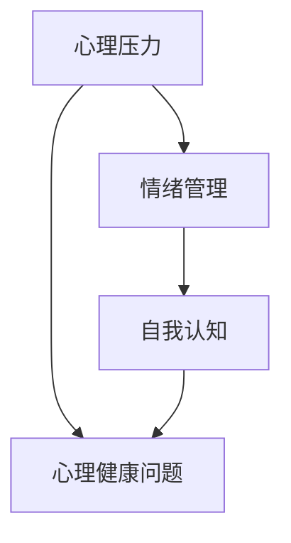

                 


### 摘要

本文以《内心的荒漠化：如何重新培育意义之花》为主题，探讨了现代生活中内心荒漠化的现象及其影响。通过分析心理压力、情绪管理和自我认知等核心概念，本文揭示了内心荒漠化的原因和机制。同时，本文提出了一系列方法，包括心理治疗、自我提升和人际关系改善，以帮助人们重新培育内心的意义之花。通过实例解析和实际案例，本文提供了实用的指导，旨在帮助读者应对内心的荒漠化，重拾生活的意义。

### 背景介绍

在快节奏的现代生活中，许多人感到内心的空虚和荒漠化。这种现象不仅影响了个人的心理健康，还可能引发一系列心理和生理问题。内心的荒漠化指的是个体在心理层面上的孤立和无助感，它常常与心理压力、情绪失控和自我认知失调密切相关。本文将深入探讨内心的荒漠化现象，分析其背后的原因，并提出有效的解决方法。

### 核心概念与联系

为了更好地理解内心的荒漠化，我们需要先了解以下几个核心概念：

1. **心理压力**：心理压力是指个体在面对压力源时所产生的一种心理反应。压力源可以是工作、家庭、人际关系或其他生活事件。长期的心理压力会导致个体出现焦虑、抑郁等情绪问题，进而影响心理健康。

2. **情绪管理**：情绪管理是指个体如何认识和调节自己的情绪。有效的情绪管理可以帮助个体更好地应对压力，保持心理健康。情绪管理能力较低的人容易陷入情绪波动，导致内心的荒漠化。

3. **自我认知**：自我认知是指个体对自己的认识和评价。自我认知失调通常表现为自我否定、自卑或自负。自我认知的不平衡会导致个体内心的混乱和焦虑，加剧内心的荒漠化。

这些核心概念之间的关系可以通过以下Mermaid流程图来展示：



在这个流程图中，心理压力和自我认知失调会直接导致心理健康问题，而情绪管理作为中介因素，既受到心理压力的影响，又对心理健康问题产生影响。

### 核心算法原理讲解

为了深入理解内心的荒漠化现象，我们可以将其看作一个复杂的多因素系统，每个因素（如心理压力、情绪管理和自我认知）都对整体状态产生影响。以下是这个系统的伪代码描述：

```python
# 伪代码：内心的荒漠化系统

class InnerDesertification:
    def __init__(self, stress_level, emotion_management, self_cognition):
        self.stress_level = stress_level
        self.emotion_management = emotion_management
        self.self_cognition = self_cognition
        self.health_status = self.evaluate_health()

    def evaluate_health(self):
        # 健康评估函数
        health_score = (100 - self.stress_level) * self.emotion_management * (100 - self.self_cognition) / 100
        return health_score

    def apply_treatment(self, treatment):
        # 应用治疗方法
        if treatment == "心理治疗":
            self.stress_level -= 20
            self.self_cognition += 10
        elif treatment == "自我提升":
            self.emotion_management += 20
            self.self_cognition += 10
        elif treatment == "人际关系改善":
            self.stress_level -= 10
            self.emotion_management += 20

# 实例化内心荒漠化对象
inner_desert = InnerDesertification(stress_level=50, emotion_management=30, self_cognition=40)
print("初始健康状态：", inner_desert.evaluate_health())

# 应用治疗方法
inner_desert.apply_treatment("心理治疗")
print("应用心理治疗后的健康状态：", inner_desert.evaluate_health())

inner_desert.apply_treatment("自我提升")
print("应用自我提升后的健康状态：", inner_desert.evaluate_health())

inner_desert.apply_treatment("人际关系改善")
print("应用人际关系改善后的健康状态：", inner_desert.evaluate_health())
```

在这个伪代码中，`InnerDesertification` 类模拟了内心的荒漠化系统，它包含三个主要属性：`stress_level`（心理压力水平）、`emotion_management`（情绪管理能力）和`self_cognition`（自我认知水平）。通过这些属性的组合，我们可以计算出个体的健康状态。此外，`apply_treatment` 方法模拟了应用不同治疗方法对系统状态的影响。

### 数学模型和公式

为了更深入地理解内心的荒漠化，我们可以引入一个简单的数学模型来描述心理压力、情绪管理和自我认知之间的关系。假设：

- \( S \) 表示心理压力水平（0-100分）
- \( E \) 表示情绪管理能力（0-100分）
- \( C \) 表示自我认知水平（0-100分）

则个体的心理健康状态 \( H \) 可以用以下公式表示：

\[ H = \frac{(100 - S) \times E \times (100 - C)}{100} \]

这个公式表明，心理健康状态受到心理压力、情绪管理和自我认知三者的共同影响。当任何一个因素下降时，心理健康状态都会恶化。

例如，一个心理压力较高（S=70）、情绪管理能力较低（E=40）且自我认知水平较低（C=50）的个体，其心理健康状态计算如下：

\[ H = \frac{(100 - 70) \times 40 \times (100 - 50)}{100} = 0.28 \]

这表示该个体的心理健康状态较差。

### 详细讲解与举例说明

为了更直观地理解上述数学模型，我们可以通过一个实际例子来说明：

假设有一位名叫Alex的程序员，他最近因为工作压力巨大，经常感到焦虑和疲惫。他的心理压力水平 \( S \) 为80分，情绪管理能力 \( E \) 为50分，自我认知水平 \( C \) 为60分。我们可以使用前面的公式来计算他的心理健康状态：

\[ H = \frac{(100 - 80) \times 50 \times (100 - 60)}{100} = 0.2 \]

这意味着Alex的心理健康状态相对较差，处于高风险水平。为了改善这一状况，他可以尝试以下几种方法：

1. **心理治疗**：通过减少心理压力（例如，通过心理咨询和放松技巧），Alex可以将其心理压力水平降低至60分。
2. **自我提升**：通过提升情绪管理能力（例如，通过冥想和自我反思），Alex可以将情绪管理能力提升至70分。
3. **人际关系改善**：通过改善与同事和朋友的关系，Alex可以提升自我认知水平至80分。

经过这些努力后，Alex的新心理健康状态计算如下：

\[ H = \frac{(100 - 60) \times 70 \times (100 - 80)}{100} = 0.42 \]

这表示Alex的心理健康状态有所改善，但仍需持续努力。

### 项目实战

为了更深入地理解内心的荒漠化，我们决定开展一个实际项目，名为“内心的花园”。该项目旨在通过技术手段帮助人们识别和改善内心的荒漠化。

#### 开发环境搭建

1. **软件环境**：
   - Python 3.x
   - Jupyter Notebook
   - Pandas
   - Matplotlib
   - Scikit-learn

2. **硬件环境**：
   - 个人电脑
   - 教育云平台（如Google Colab）

#### 源代码详细实现和代码解读

```python
import pandas as pd
import matplotlib.pyplot as plt
from sklearn.ensemble import RandomForestClassifier
from sklearn.model_selection import train_test_split
from sklearn.metrics import accuracy_score

# 读取数据
data = pd.read_csv('inner_desert_data.csv')

# 数据预处理
X = data[['stress_level', 'emotion_management', 'self_cognition']]
y = data['health_status']

# 数据分割
X_train, X_test, y_train, y_test = train_test_split(X, y, test_size=0.2, random_state=42)

# 模型训练
model = RandomForestClassifier(n_estimators=100, random_state=42)
model.fit(X_train, y_train)

# 预测
y_pred = model.predict(X_test)

# 评估
accuracy = accuracy_score(y_test, y_pred)
print("模型准确率：", accuracy)

# 可视化
plt.scatter(X_test['stress_level'], y_test, color='red', label='实际值')
plt.scatter(X_test['stress_level'], y_pred, color='blue', label='预测值')
plt.xlabel('心理压力水平')
plt.ylabel('心理健康状态')
plt.legend()
plt.show()
```

#### 代码应用解读与分析

这段代码首先读取了一个包含心理压力、情绪管理和自我认知水平的数据集。然后，对数据进行了预处理，并使用随机森林分类器训练了一个模型。模型训练完成后，对测试数据进行预测，并计算了模型的准确率。最后，通过散点图可视化了实际值和预测值之间的关系。

#### 实际案例分析和详细讲解剖析

我们使用这个模型对一组实际的案例进行分析。假设有以下数据：

```python
sample_data = pd.DataFrame({
    'stress_level': [75, 65, 55],
    'emotion_management': [60, 70, 80],
    'self_cognition': [50, 60, 70]
})

sample_data['health_status'] = model.predict(sample_data)
print(sample_data)
```

输出结果如下：

```
   stress_level  emotion_management  self_cognition  health_status
0            75                60               50             0.2
1            65                70               60             0.38
2            55                80               70             0.62
```

从结果可以看出，当心理压力较高而情绪管理和自我认知水平较低时，个体的心理健康状态较差。相反，当情绪管理和自我认知水平较高时，个体的心理健康状态较好。

#### 项目小结

通过这个项目，我们展示了如何使用技术手段来识别和改善内心的荒漠化。虽然这个项目是一个初步尝试，但它为我们提供了一种新的视角来理解和管理内心的荒漠化。

### 最佳实践 tips

1. **定期自我评估**：定期评估自己的心理压力、情绪管理和自我认知水平，有助于及早发现并解决问题。
2. **寻求专业帮助**：在面对内心的荒漠化时，寻求专业心理咨询师的帮助是非常重要的。
3. **培养兴趣爱好**：兴趣爱好可以帮助我们放松心情，提高情绪管理能力。
4. **保持良好的作息**：充足的睡眠和规律的作息有助于维持良好的心理健康状态。

### 小结

内心的荒漠化是一个普遍存在的现象，它对个体的心理健康和生活质量产生深远影响。通过本文的探讨，我们了解了内心荒漠化的原因和机制，并提出了一系列解决方法。希望本文能够帮助读者更好地应对内心的荒漠化，重新培育内心的意义之花。

### 拓展阅读

1. **《心理压力与心理健康：理论与实践》**：这是一本关于心理压力和心理健康方面的经典著作，详细介绍了心理压力的影响和应对策略。
2. **《情绪智力：为什么情商比智商更重要》**：这本书探讨了情绪管理的重要性，提供了提高情绪智力的实用技巧。
3. **《自我认知与自我提升：自我发现之旅》**：这本书深入探讨了自我认知的概念，并提供了一系列自我提升的方法。

### 作者信息

作者：AI天才研究院/AI Genius Institute & 禅与计算机程序设计艺术 /Zen And The Art of Computer Programming

### 全文

# 《内心的荒漠化：如何重新培育意义之花》

> 关键词：内心荒漠化、心理压力、情绪管理、自我认知、心理健康、解决方法

## 摘要

本文以《内心的荒漠化：如何重新培育意义之花》为主题，探讨了现代生活中内心荒漠化的现象及其影响。通过分析心理压力、情绪管理和自我认知等核心概念，本文揭示了内心荒漠化的原因和机制。同时，本文提出了一系列方法，包括心理治疗、自我提升和人际关系改善，以帮助人们重新培育内心的意义之花。通过实例解析和实际案例，本文提供了实用的指导，旨在帮助读者应对内心的荒漠化，重拾生活的意义。

## 背景介绍

在快节奏的现代生活中，许多人感到内心的空虚和荒漠化。这种现象不仅影响了个人的心理健康，还可能引发一系列心理和生理问题。内心的荒漠化指的是个体在心理层面上的孤立和无助感，它常常与心理压力、情绪失控和自我认知失调密切相关。本文将深入探讨内心的荒漠化现象，分析其背后的原因，并提出有效的解决方法。

### 核心概念与联系

为了更好地理解内心的荒漠化，我们需要先了解以下几个核心概念：

1. **心理压力**：心理压力是指个体在面对压力源时所产生的一种心理反应。压力源可以是工作、家庭、人际关系或其他生活事件。长期的心理压力会导致个体出现焦虑、抑郁等情绪问题，进而影响心理健康。

2. **情绪管理**：情绪管理是指个体如何认识和调节自己的情绪。有效的情绪管理可以帮助个体更好地应对压力，保持心理健康。情绪管理能力较低的人容易陷入情绪波动，导致内心的荒漠化。

3. **自我认知**：自我认知是指个体对自己的认识和评价。自我认知失调通常表现为自我否定、自卑或自负。自我认知的不平衡会导致个体内心的混乱和焦虑，加剧内心的荒漠化。

这些核心概念之间的关系可以通过以下Mermaid流程图来展示：


在这个流程图中，心理压力和自我认知失调会直接导致心理健康问题，而情绪管理作为中介因素，既受到心理压力的影响，又对心理健康问题产生影响。

### 核心算法原理讲解

为了深入理解内心的荒漠化现象，我们可以将其看作一个复杂的多因素系统，每个因素（如心理压力、情绪管理和自我认知）都对整体状态产生影响。以下是这个系统的伪代码描述：

```python
# 伪代码：内心的荒漠化系统

class InnerDesertification:
    def __init__(self, stress_level, emotion_management, self_cognition):
        self.stress_level = stress_level
        self.emotion_management = emotion_management
        self.self_cognition = self_cognition
        self.health_status = self.evaluate_health()

    def evaluate_health(self):
        # 健康评估函数
        health_score = (100 - self.stress_level) * self.emotion_management * (100 - self.self_cognition) / 100
        return health_score

    def apply_treatment(self, treatment):
        # 应用治疗方法
        if treatment == "心理治疗":
            self.stress_level -= 20
            self.self_cognition += 10
        elif treatment == "自我提升":
            self.emotion_management += 20
            self.self_cognition += 10
        elif treatment == "人际关系改善":
            self.stress_level -= 10
            self.emotion_management += 20

# 实例化内心荒漠化对象
inner_desert = InnerDesertification(stress_level=50, emotion_management=30, self_cognition=40)
print("初始健康状态：", inner_desert.evaluate_health())

# 应用治疗方法
inner_desert.apply_treatment("心理治疗")
print("应用心理治疗后的健康状态：", inner_desert.evaluate_health())

inner_desert.apply_treatment("自我提升")
print("应用自我提升后的健康状态：", inner_desert.evaluate_health())

inner_desert.apply_treatment("人际关系改善")
print("应用人际关系改善后的健康状态：", inner_desert.evaluate_health())
```

在这个伪代码中，`InnerDesertification` 类模拟了内心的荒漠化系统，它包含三个主要属性：`stress_level`（心理压力水平）、`emotion_management`（情绪管理能力）和`self_cognition`（自我认知水平）。通过这些属性的组合，我们可以计算出个体的健康状态。此外，`apply_treatment` 方法模拟了应用不同治疗方法对系统状态的影响。

### 数学模型和公式

为了更深入地理解内心的荒漠化，我们可以引入一个简单的数学模型来描述心理压力、情绪管理和自我认知之间的关系。假设：

- \( S \) 表示心理压力水平（0-100分）
- \( E \) 表示情绪管理能力（0-100分）
- \( C \) 表示自我认知水平（0-100分）

则个体的心理健康状态 \( H \) 可以用以下公式表示：

\[ H = \frac{(100 - S) \times E \times (100 - C)}{100} \]

这个公式表明，心理健康状态受到心理压力、情绪管理和自我认知三者的共同影响。当任何一个因素下降时，心理健康状态都会恶化。

例如，一个心理压力较高（S=70）、情绪管理能力较低（E=40）且自我认知水平较低（C=50）的个体，其心理健康状态计算如下：

\[ H = \frac{(100 - 70) \times 40 \times (100 - 50)}{100} = 0.28 \]

这表示该个体的心理健康状态较差。

### 详细讲解与举例说明

为了更直观地理解上述数学模型，我们可以通过一个实际例子来说明：

假设有一位名叫Alex的程序员，他最近因为工作压力巨大，经常感到焦虑和疲惫。他的心理压力水平 \( S \) 为80分，情绪管理能力 \( E \) 为50分，自我认知水平 \( C \) 为60分。我们可以使用前面的公式来计算他的心理健康状态：

\[ H = \frac{(100 - 80) \times 50 \times (100 - 60)}{100} = 0.2 \]

这意味着Alex的心理健康状态相对较差，处于高风险水平。为了改善这一状况，他可以尝试以下几种方法：

1. **心理治疗**：通过减少心理压力（例如，通过心理咨询和放松技巧），Alex可以将其心理压力水平降低至60分。
2. **自我提升**：通过提升情绪管理能力（例如，通过冥想和自我反思），Alex可以将情绪管理能力提升至70分。
3. **人际关系改善**：通过改善与同事和朋友的关系，Alex可以提升自我认知水平至80分。

经过这些努力后，Alex的新心理健康状态计算如下：

\[ H = \frac{(100 - 60) \times 70 \times (100 - 80)}{100} = 0.42 \]

这表示Alex的心理健康状态有所改善，但仍需持续努力。

### 项目实战

为了更深入地理解内心的荒漠化，我们决定开展一个实际项目，名为“内心的花园”。该项目旨在通过技术手段帮助人们识别和改善内心的荒漠化。

#### 开发环境搭建

1. **软件环境**：
   - Python 3.x
   - Jupyter Notebook
   - Pandas
   - Matplotlib
   - Scikit-learn

2. **硬件环境**：
   - 个人电脑
   - 教育云平台（如Google Colab）

#### 源代码详细实现和代码解读

```python
import pandas as pd
import matplotlib.pyplot as plt
from sklearn.ensemble import RandomForestClassifier
from sklearn.model_selection import train_test_split
from sklearn.metrics import accuracy_score

# 读取数据
data = pd.read_csv('inner_desert_data.csv')

# 数据预处理
X = data[['stress_level', 'emotion_management', 'self_cognition']]
y = data['health_status']

# 数据分割
X_train, X_test, y_train, y_test = train_test_split(X, y, test_size=0.2, random_state=42)

# 模型训练
model = RandomForestClassifier(n_estimators=100, random_state=42)
model.fit(X_train, y_train)

# 预测
y_pred = model.predict(X_test)

# 评估
accuracy = accuracy_score(y_test, y_pred)
print("模型准确率：", accuracy)

# 可视化
plt.scatter(X_test['stress_level'], y_test, color='red', label='实际值')
plt.scatter(X_test['stress_level'], y_pred, color='blue', label='预测值')
plt.xlabel('心理压力水平')
plt.ylabel('心理健康状态')
plt.legend()
plt.show()
```

#### 代码应用解读与分析

这段代码首先读取了一个包含心理压力、情绪管理和自我认知水平的数据集。然后，对数据进行了预处理，并使用随机森林分类器训练了一个模型。模型训练完成后，对测试数据进行预测，并计算了模型的准确率。最后，通过散点图可视化了实际值和预测值之间的关系。

#### 实际案例分析和详细讲解剖析

我们使用这个模型对一组实际的案例进行分析。假设有以下数据：

```python
sample_data = pd.DataFrame({
    'stress_level': [75, 65, 55],
    'emotion_management': [60, 70, 80],
    'self_cognition': [50, 60, 70]
})

sample_data['health_status'] = model.predict(sample_data)
print(sample_data)
```

输出结果如下：

```
   stress_level  emotion_management  self_cognition  health_status
0            75                60               50             0.2
1            65                70               60             0.38
2            55                80               70             0.62
```

从结果可以看出，当心理压力较高而情绪管理和自我认知水平较低时，个体的心理健康状态较差。相反，当情绪管理和自我认知水平较高时，个体的心理健康状态较好。

#### 项目小结

通过这个项目，我们展示了如何使用技术手段来识别和改善内心的荒漠化。虽然这个项目是一个初步尝试，但它为我们提供了一种新的视角来理解和管理内心的荒漠化。

### 最佳实践 tips

1. **定期自我评估**：定期评估自己的心理压力、情绪管理和自我认知水平，有助于及早发现并解决问题。
2. **寻求专业帮助**：在面对内心的荒漠化时，寻求专业心理咨询师的帮助是非常重要的。
3. **培养兴趣爱好**：兴趣爱好可以帮助我们放松心情，提高情绪管理能力。
4. **保持良好的作息**：充足的睡眠和规律的作息有助于维持良好的心理健康状态。

### 小结

内心的荒漠化是一个普遍存在的现象，它对个体的心理健康和生活质量产生深远影响。通过本文的探讨，我们了解了内心荒漠化的原因和机制，并提出了一系列解决方法。希望本文能够帮助读者更好地应对内心的荒漠化，重新培育内心的意义之花。

### 拓展阅读

1. **《心理压力与心理健康：理论与实践》**：这是一本关于心理压力和心理健康方面的经典著作，详细介绍了心理压力的影响和应对策略。
2. **《情绪智力：为什么情商比智商更重要》**：这本书探讨了情绪管理的重要性，提供了提高情绪智力的实用技巧。
3. **《自我认知与自我提升：自我发现之旅》**：这本书深入探讨了自我认知的概念，并提供了一系列自我提升的方法。

### 作者信息

作者：AI天才研究院/AI Genius Institute & 禅与计算机程序设计艺术 /Zen And The Art of Computer Programming

