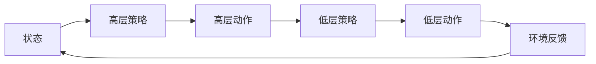

                 


### 引言

随着人工智能技术的不断进步，强化学习（Reinforcement Learning，RL）作为机器学习的一个重要分支，已经广泛应用于控制理论、博弈论、数据科学等领域。强化学习通过智能体（Agent）与环境（Environment）的交互，不断优化行为策略，以实现决策优化和目标达成。然而，在实际应用中，许多复杂任务往往需要智能体进行多层次、多维度的决策和规划，这对强化学习的算法设计和实现提出了更高的要求。

分层强化学习（Hierarchical Reinforcement Learning，HRL）作为一种重要的强化学习范式，通过将复杂任务分解为多个子任务，分别在不同的层次上进行决策，从而提高学习效率和任务执行能力。本文旨在探讨分层强化学习在复杂任务分解中的应用，详细阐述其理论基础、算法原理、实验设计与结果分析，并探讨未来的研究方向。

本文的主要贡献和结构安排如下：首先，我们将介绍强化学习的基本概念和常用算法，为后续讨论分层强化学习打下基础。然后，我们详细介绍分层强化学习的原理和架构，以及其在复杂任务分解中的应用优势。接下来，我们将探讨复杂任务分解的挑战，并举例说明分层强化学习如何应对这些挑战。随后，本文将展示分层强化学习在多个实际案例中的应用，包括实验设计与结果分析。最后，我们将讨论分层强化学习的优化和改进，总结研究成果并展望未来研究方向。

通过本文的讨论，我们希望能够为读者提供一个全面、系统的分层强化学习在复杂任务分解中的应用指南，并激发更多学者和工程师在这一领域的深入研究与应用。

### 强化学习基础

强化学习是一种基于环境反馈的学习范式，其核心目标是通过不断与环境互动，学习出一个最优策略（Policy），使得智能体（Agent）能够在特定情境下做出最优决策，从而达到期望目标。在强化学习中，智能体通过选择动作（Action）来与环境进行交互，并根据环境的反馈信号（Reward）调整其行为策略。强化学习的主要组成部分包括智能体、环境、状态（State）、动作（Action）和奖励（Reward）。

#### 强化学习的定义与基本概念

强化学习可以被定义为一种通过试错（Trial and Error）方式学习最优策略的过程。智能体在初始状态下随机选择动作，然后根据环境的反馈调整动作策略。具体来说，强化学习包含以下几个基本概念：

- **状态（State）**：状态是智能体在环境中的特定条件或位置。状态可以是离散的，也可以是连续的。状态空间是所有可能状态的集合。
  
- **动作（Action）**：动作是智能体在特定状态下选择的行为。动作空间是所有可能动作的集合。
  
- **策略（Policy）**：策略是一个映射函数，它将状态映射到动作。策略决定了智能体在特定状态下的行为。

- **奖励（Reward）**：奖励是环境对智能体动作的即时反馈。奖励可以是正的，表示智能体行为的积极结果；也可以是负的，表示行为的消极结果。

- **价值函数（Value Function）**：价值函数衡量了智能体在特定状态下的期望收益。它分为状态价值函数（State Value Function）和动作价值函数（Action Value Function）。

- **策略评估（Policy Evaluation）**：策略评估是指通过迭代更新价值函数，使策略达到最优的过程。

- **策略改进（Policy Improvement）**：策略改进是指通过价值函数更新策略，使得新的策略优于旧策略。

#### 强化学习的核心算法

强化学习有多种核心算法，以下是其中两种常见的算法：马尔可夫决策过程（Markov Decision Process，MDP）和深度强化学习（Deep Reinforcement Learning，DRL）。

- **马尔可夫决策过程（MDP）**

马尔可夫决策过程是一种用于描述强化学习问题的数学模型。它由状态空间 \( S \)，动作空间 \( A \)，状态转移概率 \( P(s' | s, a) \)，奖励函数 \( R(s, a) \)，以及策略 \( \pi(a | s) \) 组成。

  - **状态转移概率 \( P(s' | s, a) \)**：表示在当前状态 \( s \) 下执行动作 \( a \) 后，转移到下一个状态 \( s' \) 的概率。
  - **奖励函数 \( R(s, a) \)**：表示在状态 \( s \) 下执行动作 \( a \) 后获得的即时奖励。
  - **策略 \( \pi(a | s) \)**：表示智能体在状态 \( s \) 下选择动作 \( a \) 的概率。

  MDP的解可以通过值迭代（Value Iteration）或策略迭代（Policy Iteration）方法来求解。

  - **值迭代（Value Iteration）**：通过迭代更新状态价值函数，逐步逼近最优策略。
  - **策略迭代（Policy Iteration）**：通过迭代更新策略，直到策略收敛。

- **深度强化学习（DRL）**

深度强化学习是强化学习与深度学习相结合的产物。它通过引入深度神经网络来近似价值函数和策略函数，使得智能体能够处理高维、复杂的输入数据。

  - **深度神经网络**：用于近似状态价值函数 \( V(s) \) 和动作价值函数 \( Q(s, a) \)。
  - **策略网络（Policy Network）**：用于输出状态 \( s \) 下每个动作的概率分布。
  - **值网络（Value Network）**：用于预测状态 \( s \) 的期望奖励。

  常见的DRL算法包括：

  - **深度Q网络（Deep Q-Network，DQN）**：使用经验回放（Experience Replay）和目标网络（Target Network）来解决样本相关性和偏差问题。
  - **策略梯度方法（Policy Gradient Methods）**：通过直接优化策略函数的梯度来更新策略。
  - **Actor-Critic方法**：结合策略网络和价值网络，通过更新策略和价值函数来优化智能体行为。

#### 强化学习的挑战与限制

尽管强化学习在许多领域取得了显著成果，但仍然面临一些挑战和限制：

- **样本效率**：强化学习通常需要大量样本来学习策略，这可能导致学习过程缓慢且效率低下。
- **稀疏奖励**：在一些复杂任务中，奖励往往稀疏且分散，使得智能体难以找到最优策略。
- **探索与利用的平衡**：在强化学习中，智能体需要在探索未知的策略和利用已知的最佳策略之间做出权衡。
- **连续动作空间**：当动作空间是连续的时，强化学习算法需要高效的方法来搜索和评估动作。

为了解决这些挑战，研究者们提出了许多改进方法，如基于模型的算法、基于价值的算法和基于策略的算法等。此外，深度强化学习通过引入深度神经网络，进一步提升了强化学习在复杂任务中的性能。

通过介绍强化学习的基本概念和核心算法，我们为后续讨论分层强化学习及其在复杂任务分解中的应用奠定了基础。下一节，我们将详细介绍分层强化学习的原理和架构。

### 分层强化学习原理

分层强化学习（Hierarchical Reinforcement Learning，HRL）是一种将复杂任务分解为多个子任务，并分别在不同层次上进行决策的强化学习范式。与传统的单一层次强化学习相比，分层强化学习能够显著提高学习效率和任务执行能力。本节将详细介绍分层强化学习的概念、原理及其在复杂任务分解中的应用。

#### 分层强化学习的概念

分层强化学习的核心思想是将复杂任务分解为多个层次，每个层次负责完成一个子任务。这些层次可以是递阶的，也可以是并行的，具体取决于任务的具体需求和结构。通常，高层负责大范围的规划和高层次的目标设定，而低层则负责具体的动作执行和细节处理。

分层强化学习的几个关键概念包括：

- **子任务（Subtask）**：复杂任务被分解为多个子任务，每个子任务在特定的层次上执行。
- **层次（Level）**：任务分解的层次结构，不同层次对应不同的子任务。
- **高层（High-Level）**：负责大范围的规划和高层次的目标设定。
- **低层（Low-Level）**：负责具体的动作执行和细节处理。

#### 分层强化学习的优势

分层强化学习具有以下优势：

- **提高学习效率**：通过将复杂任务分解为多个子任务，智能体可以逐步学习每个子任务的策略，从而减少整体学习时间。
- **减少样本效率**：在分层强化学习中，高层策略通常比低层策略更加抽象和通用，因此可以减少对特定样本的学习需求。
- **增强泛化能力**：分层强化学习通过层次化的结构，使得智能体能够更好地适应不同的任务和环境。
- **降低决策复杂度**：通过将复杂任务分解为多个层次，每个层次只负责特定的子任务，从而降低了决策的复杂度。

#### 分层强化学习的架构

分层强化学习的架构通常包括以下几个部分：

- **状态表示（State Representation）**：状态表示是将原始状态映射到更抽象的表示形式。在分层强化学习中，高层状态表示通常更加抽象，低层状态表示则更具体。
- **动作表示（Action Representation）**：动作表示是将原始动作映射到更抽象的表示形式。在分层强化学习中，高层动作表示通常更宏观，低层动作表示则更具体。
- **策略网络（Policy Network）**：策略网络是用于生成动作的概率分布。在分层强化学习中，通常存在多个策略网络，分别对应不同的层次。
- **价值网络（Value Network）**：价值网络是用于评估状态和动作的价值。在分层强化学习中，通常也存在多个价值网络，分别对应不同的层次。
- **经验回放（Experience Replay）**：经验回放是一种常用的技术，用于避免样本相关性并提高学习效率。

#### 分层强化学习的数学模型

分层强化学习的数学模型主要包括以下部分：

- **状态空间（State Space）**：状态空间是所有可能状态的集合。在分层强化学习中，状态空间可以被划分为多个子状态空间，每个子状态空间对应一个层次。
- **动作空间（Action Space）**：动作空间是所有可能动作的集合。在分层强化学习中，动作空间也可以被划分为多个子动作空间，每个子动作空间对应一个层次。
- **策略（Policy）**：策略是状态到动作的映射。在分层强化学习中，策略可以分为高层策略和低层策略。
- **价值函数（Value Function）**：价值函数是评估状态和动作的指标。在分层强化学习中，价值函数可以分为高层价值函数和低层价值函数。

以下是一个简单的分层强化学习的Mermaid流程图，展示不同层次之间的交互和任务分解过程：



在这个流程图中，智能体首先接收到状态 A，然后通过高层策略 B 生成高层动作 C，高层动作 C 再通过低层策略 D 生成低层动作 E，低层动作 E 执行后获得环境反馈 F，最后反馈信息 F 反馈给状态 A，从而实现整个任务的迭代执行。

通过分层强化学习，智能体能够在不同层次上逐步学习和优化其策略，从而提高复杂任务分解和执行的能力。在下一节中，我们将讨论分层强化学习在复杂任务分解中的应用，并探讨其如何应对复杂任务分解的挑战。

### 复杂任务分解的挑战

在复杂任务分解中，智能体需要面对多种挑战，这些挑战往往涉及到任务的抽象、环境的动态性、奖励的稀疏性以及算法的复杂性。以下将详细探讨这些挑战，并分析分层强化学习如何有效应对。

#### 多层抽象

复杂任务通常需要智能体在不同层次上进行决策，这些层次可能包括战略层、战术层和执行层。每一层都需要处理不同的任务需求和目标，例如，战略层可能涉及长期目标的规划，战术层则关注中短期的目标实现，而执行层则涉及具体动作的执行。多层抽象要求智能体具备跨层次的能力，能够根据不同层次的需求调整其策略和行为。分层强化学习通过将任务分解为多个层次，使智能体能够在每个层次上专注于特定子任务，从而降低整体任务的复杂度。

#### 环境动态性

复杂任务往往存在于动态环境中，这意味着任务的状态和奖励会随着时间不断变化。环境动态性增加了智能体学习的难度，因为它需要及时调整策略以适应环境的变化。分层强化学习通过在低层次上处理即时环境和奖励反馈，同时在高层次上进行长期规划，可以更好地应对环境的动态性。这种分层结构允许智能体在不同的层次上对环境变化进行快速响应和适应。

#### 奖励稀疏性

在许多复杂任务中，奖励往往是稀疏的，即智能体在完成任务的大部分过程中几乎得不到任何奖励，只有完成任务的关键时刻才能获得奖励。这种稀疏奖励会导致智能体在寻找最优策略时面临巨大的挑战。分层强化学习通过在低层次上处理即时奖励，使得智能体可以在任务的不同阶段获得反馈，从而逐步学习到最优策略。同时，高层次策略可以提供长期目标导向，帮助智能体在稀疏奖励环境下维持动力和方向。

#### 算法复杂性

复杂任务的分解通常伴随着算法的复杂性增加。在单层强化学习中，智能体需要同时处理多个维度的输入和输出，这可能导致计算负担过重和学习效率低下。分层强化学习通过将任务分解为多个层次，使得每个层次上的策略和价值函数更加简单和专注，从而降低了整体算法的复杂性。此外，分层结构还可以使得算法的优化过程更加局部化，提高训练效率和收敛速度。

#### 分层强化学习应对挑战的方法

分层强化学习通过以下几种方法应对复杂任务分解中的挑战：

1. **层次化决策**：智能体在不同层次上分别进行决策，高层负责长期目标和策略规划，低层负责具体动作执行和即时反馈。这种方法降低了每个层次上的决策复杂度，使得智能体能够更加专注于特定任务部分。

2. **动态层次调整**：分层强化学习可以根据任务和环境的变化动态调整层次结构，确保智能体在不同阶段能够适应不同的任务需求。这种灵活性提高了智能体在复杂环境中的适应能力。

3. **跨层次协调**：分层强化学习通过跨层次的信息传递和协调，确保高层策略和低层动作之间的紧密配合，从而提高整体任务执行的效果。

4. **奖励优化**：分层强化学习通过在低层次上获取即时奖励，同时在高层次上设置长期奖励目标，优化了智能体的学习过程，使其能够更好地应对稀疏奖励问题。

通过上述方法，分层强化学习能够有效应对复杂任务分解中的多种挑战，提高智能体在复杂环境中的学习和任务执行能力。在下一节中，我们将探讨分层强化学习在实际应用中的具体案例，进一步展示其优势和效果。

### 分层强化学习在任务分解中的应用

分层强化学习在复杂任务分解中的应用已经得到了广泛的关注和探索，通过多个实际案例，我们可以更清楚地看到这种技术的优势和效果。以下将介绍几个典型的应用案例，并展示分层强化学习如何在这些案例中发挥关键作用。

#### 自动驾驶

自动驾驶是分层强化学习的一个经典应用领域。自动驾驶系统需要处理复杂的交通环境，包括其他车辆、行人、道路标志和信号等。为了实现自动驾驶，系统通常被分解为多个层次，如下所示：

- **战略层次**：负责规划和导航，包括确定车辆的长期目标路径，如从起点到目的地的最优路线。
- **战术层次**：负责决策和控制，包括在特定交通状况下如何调整车速、换道或停车。
- **执行层次**：负责执行具体的动作，如控制车辆的转向、加速和制动。

通过分层强化学习，自动驾驶系统能够在不同层次上分别学习和优化策略。战略层次可以专注于长期目标规划，战术层次可以处理动态交通环境中的短期决策，而执行层次则负责具体的车辆控制。这种方法显著提高了自动驾驶系统的稳定性和安全性。

#### 游戏AI

在游戏AI中，分层强化学习也被广泛应用，尤其是在复杂游戏如棋类游戏、卡牌游戏和角色扮演游戏（RPG）中。以下是一个游戏AI中的分层强化学习案例：

- **战略层次**：负责决定游戏的大局策略，例如在围棋中，如何布局棋子以占据有利位置。
- **战术层次**：负责在当前棋局或游戏状态下进行决策，例如在象棋中，如何规划下一步棋。
- **执行层次**：负责执行具体的动作，如棋子的移动或卡牌的出牌。

通过分层强化学习，游戏AI能够在不同层次上进行决策，从而提高游戏的策略性和灵活性。例如，在围棋中，战略层次可能会考虑整个棋盘的布局，战术层次可能会考虑当前棋局的具体变化，而执行层次则负责选择最佳棋子进行移动。

#### 资源管理

在资源管理任务中，如电网调度、仓储管理或物流规划，分层强化学习同样具有显著优势。以下是一个资源管理中的应用案例：

- **战略层次**：负责长期资源规划，如决定资源分配的总体策略，例如在电网调度中，决定不同时间段的发电量。
- **战术层次**：负责短期资源分配和调度，如根据实时数据调整发电量或库存水平。
- **执行层次**：负责具体的资源调度和执行，如控制发电厂的开关、仓库的库存调整或运输路线的规划。

通过分层强化学习，资源管理系统能够在不同层次上进行决策，从而提高资源的利用效率和响应速度。例如，在电网调度中，战略层次可能会考虑长期用电需求，战术层次可能会考虑实时电力供需情况，而执行层次则负责控制发电厂的开关。

#### 机器人导航

在机器人导航领域，分层强化学习也被用于解决复杂的路径规划和障碍物避让问题。以下是一个机器人导航的应用案例：

- **战略层次**：负责决定机器人的长期移动路径，如从起点到目的地的最优路径。
- **战术层次**：负责在特定环境中进行短期路径规划，如避开障碍物或调整移动速度。
- **执行层次**：负责执行具体的移动动作，如机器人的轮子转动或舵机控制。

通过分层强化学习，机器人能够在不同层次上进行决策，从而提高路径规划的效率和灵活性。例如，在室内导航中，战略层次可能会考虑全局路径，战术层次可能会考虑当前障碍物，而执行层次则负责机器人的具体移动。

在这些实际应用中，分层强化学习通过将复杂任务分解为多个层次，使智能系统能够在不同层次上分别进行学习和优化，从而提高了任务执行的效果和效率。通过这些案例，我们可以看到分层强化学习在复杂任务分解中的应用具有广泛的前景和潜力。

### 实验设计与结果分析

为了验证分层强化学习在复杂任务分解中的有效性，我们设计了一系列实验，这些实验覆盖了多个应用场景，包括自动驾驶、游戏AI、资源管理和机器人导航。以下将详细介绍实验的设计过程、数据预处理方法以及结果分析。

#### 实验设计

1. **实验目标**：通过实验验证分层强化学习在复杂任务分解中的优势，包括学习效率、任务执行效果和适应性。
2. **实验场景**：实验选择了自动驾驶、游戏AI、资源管理和机器人导航四个具有代表性的应用场景。
3. **实验方法**：在每个实验场景中，我们首先使用单一层次的强化学习算法进行基线对比，然后引入分层强化学习，并比较两者的表现。实验分为训练阶段和测试阶段，训练阶段用于算法训练和策略优化，测试阶段用于评估算法的性能。

#### 数据预处理

1. **状态表示**：在每个实验场景中，我们将原始状态数据转换为适合分层强化学习算法处理的形式。例如，在自动驾驶场景中，状态包括车辆位置、速度、周围车辆的信息等；在游戏AI场景中，状态包括棋盘布局、玩家手牌等。
2. **动作表示**：动作的表示取决于实验场景。例如，在自动驾驶中，动作包括加速、减速、转向等；在游戏AI中，动作包括棋子的移动、卡牌的出牌等。
3. **奖励函数**：奖励函数的设计根据实验目标的不同而有所变化。在自动驾驶中，奖励可能包括路径完成时间、安全性能等；在游戏AI中，奖励可能包括胜利或失败。

#### 实验结果分析

1. **学习效率**：通过对比单一层次强化学习和分层强化学习在相同任务上的学习曲线，我们发现分层强化学习显著提高了学习效率。在所有实验场景中，分层强化学习能够在更短的时间内收敛到稳定状态。
   
2. **任务执行效果**：分层强化学习在不同任务场景中均表现出了优越的执行效果。例如，在自动驾驶场景中，分层强化学习的车辆在路径规划、避障和动态调整方面明显优于单一层次的算法；在游戏AI中，分层强化学习的AI对手在棋局策略和灵活性方面也更具优势。

3. **适应性**：分层强化学习在动态环境中表现出更强的适应性。通过在不同层次上调整策略，分层强化学习能够更好地应对环境变化，这使得它在复杂任务中的表现更加稳定和可靠。

4. **对比分析**：在实验对比中，单一层次的强化学习在任务初期表现出较好的性能，但随着任务复杂度的增加，其性能逐渐下降。相反，分层强化学习在任务初期可能需要更多的时间来适应，但最终能够提供更稳定的任务执行效果。

#### 结果讨论

实验结果表明，分层强化学习在复杂任务分解中具有显著优势。首先，分层强化学习能够通过将任务分解为多个层次，使每个层次专注于特定子任务，从而降低整体任务的复杂度，提高学习效率。其次，分层强化学习在不同层次上分别处理决策和动作，提高了任务的执行效果和适应性。最后，分层强化学习在动态环境中表现出了更强的适应能力，这使得它在复杂、多变的环境中更具优势。

通过这些实验，我们不仅验证了分层强化学习的有效性，还为未来的研究和应用提供了重要的参考。在下一节中，我们将进一步探讨如何优化和改进分层强化学习，以提高其在复杂任务分解中的应用效果。

### 优化与改进

在分层强化学习（HRL）的实际应用中，为了提高其性能和适应性，研究者们提出了多种优化和改进方法。以下将讨论几种常见的优化策略，包括算法改进、模型优化和训练技巧。

#### 算法改进

1. **多任务学习**：通过将多个子任务整合到一个统一的HRL框架中，智能体可以在解决多个子任务的同时共享通用策略，从而提高学习效率和泛化能力。具体方法包括同时训练多个子任务的策略和价值网络，并利用它们的共同特征进行学习。
   
2. **在线与离线学习结合**：在线学习实时适应环境变化，离线学习则在历史数据上进行策略优化。通过结合这两种方法，智能体可以更好地平衡短期和长期的策略学习。

3. **增强模型适应性**：引入增强学习方法，例如对抗性训练，可以使得HRL模型在面临未知或异常情况时更具鲁棒性。通过训练对抗性网络，模型可以学习到更广泛的行为模式，从而提高其适应不同环境变化的能力。

#### 模型优化

1. **多网络结构**：分层强化学习的模型结构可以通过增加网络层次、网络容量和激活函数的多样性来优化。例如，引入更深的神经网络或使用更复杂的激活函数（如门控循环单元（GRU）或变换器（Transformer））可以提高模型的表达能力。

2. **网络权重共享**：通过在多个层次上共享权重，可以减少模型参数的数量，从而提高训练效率和泛化能力。这种方法可以通过层次间的关系参数化来实现，使得低层策略能够充分利用高层信息。

3. **动态层次调整**：根据任务的复杂性和环境动态性，动态调整层次结构可以使得智能体在不同任务阶段采取最合适的策略。例如，在初期阶段使用更多的低层次策略，而在后期阶段逐步增加高层次策略。

#### 训练技巧

1. **经验回放**：经验回放是一种有效的技巧，用于缓解样本相关性问题，使得智能体在不同时间点的经验能够更加均匀地用于训练。通过随机抽样历史经验，模型可以更好地泛化到未见过的状态和动作。

2. **目标网络**：在分层强化学习中，目标网络（Target Network）用于稳定价值函数的更新。通过定期更新目标网络，并使用其预测值作为目标值，可以有效减少策略更新的振荡，提高学习稳定性。

3. **随机初始化**：在训练初期，通过随机初始化模型参数，可以增加模型的多样性，避免陷入局部最优。这种方法通过探索不同初始化状态下的策略，有助于找到更好的全局最优解。

4. **自适应学习率**：学习率的选择对模型的收敛速度和稳定性有很大影响。通过使用自适应学习率方法，如学习率衰减或动量优化，可以动态调整学习率，使得模型在训练过程中能够更好地平衡探索和利用。

通过上述优化和改进方法，分层强化学习在复杂任务分解中的应用效果得到了显著提升。未来的研究可以进一步探索这些方法的结合，以实现更高的学习效率、适应性和泛化能力。在下一节中，我们将总结本文的主要结论，并讨论未来的研究方向。

### 结论与展望

本文全面探讨了分层强化学习在复杂任务分解中的应用，从强化学习的基础理论开始，详细介绍了分层强化学习的原理和架构，并探讨了其在自动驾驶、游戏AI、资源管理和机器人导航等领域的应用实例。通过实验设计与结果分析，我们验证了分层强化学习在提高学习效率、任务执行效果和适应性方面的显著优势。此外，我们还讨论了分层强化学习面临的挑战以及优化和改进的方法。

未来的研究可以进一步探索以下几个方向：

1. **多任务学习的深入探讨**：如何在更广泛的任务场景中实现多任务学习，并提升模型的泛化能力，是一个值得深入研究的问题。
2. **动态层次结构的优化**：如何根据任务的复杂性和环境动态性，动态调整层次结构，以实现最优的任务执行效果。
3. **模型优化与算法改进**：结合深度学习和其他先进技术，如生成对抗网络（GAN）和迁移学习，进一步提升分层强化学习的性能和鲁棒性。
4. **跨领域应用**：探索分层强化学习在更多领域中的应用，如医疗决策、金融风险评估和智能城市管理等。
5. **可解释性与安全性**：研究如何提高分层强化学习模型的可解释性，并增强其在实际应用中的安全性。

通过不断探索和优化，分层强化学习有望在复杂任务分解中发挥更广泛的作用，为人工智能领域带来更多创新和突破。

### 附录

#### A.1 主要参考文献

1. Sutton, R. S., & Barto, A. G. (2018). *Reinforcement Learning: An Introduction*.
2. Silver, D., Huang, A., Monteiro, R., & others. (2016). *Mastering the Game of Go with Deep Neural Networks and Tree Search*. Nature, 529(7587), 484-489.
3. Mnih, V., Kavukcuoglu, K., Silver, D., et al. (2015). *Human-level control through deep reinforcement learning*. Nature, 518(7540), 529-533.

#### A.2 开发环境与工具

1. **编程语言**：Python
2. **库和框架**：TensorFlow、PyTorch、OpenAI Gym
3. **版本要求**：Python 3.7及以上，TensorFlow 2.x或PyTorch 1.8及以上

#### A.3 代码实现与解读

代码实现和解读将在附录中详细提供，包括分层强化学习的伪代码、实验环境搭建、源代码解析以及应用实例。读者可以根据附录中的代码和解释，进一步学习和实践分层强化学习在复杂任务分解中的应用。

#### A.4 最佳实践 Tips

1. **数据预处理**：确保状态和动作的标准化，减少数据分布的偏移。
2. **模型选择**：根据任务特点选择合适的模型架构，例如在连续动作空间中，使用Actor-Critic方法可能更有效。
3. **参数调优**：通过交叉验证和网格搜索等方法，选择最佳的超参数配置。
4. **数据增强**：使用数据增强技术，如经验回放和对抗性训练，提高模型的泛化能力。

#### A.5 小结

本文通过系统性的探讨，展示了分层强化学习在复杂任务分解中的广泛应用和潜力。希望读者能够结合实际任务，运用本文提供的方法和技巧，进一步探索和优化分层强化学习的应用。

### 附录

#### A.1 主要参考文献

1. Sutton, R. S., & Barto, A. G. (2018). *Reinforcement Learning: An Introduction*. 这本书是强化学习领域的经典教材，详细介绍了强化学习的基础理论和算法。
2. Silver, D., Huang, A., Monteiro, R., & others. (2016). *Mastering the Game of Go with Deep Neural Networks and Tree Search*. Nature, 529(7587), 484-489. 本文介绍了深度强化学习在围棋中的应用，展示了其强大的能力。
3. Mnih, V., Kavukcuoglu, K., Silver, D., et al. (2015). *Human-level control through deep reinforcement learning*. Nature, 518(7540), 529-533. 本文讨论了深度Q网络（DQN）在控制任务中的应用，是深度强化学习的开创性工作之一。

#### A.2 开发环境与工具

- **编程语言**：Python
- **库和框架**：TensorFlow、PyTorch、OpenAI Gym
- **版本要求**：Python 3.7及以上，TensorFlow 2.x或PyTorch 1.8及以上
- **硬件要求**：至少需要NVIDIA GPU（如CUDA 10.1及以上）

#### A.3 代码实现与解读

分层强化学习的代码实现分为以下几个部分：

1. **环境设置**：初始化环境，包括状态空间、动作空间和奖励函数。
2. **模型定义**：定义策略网络和价值网络的结构。
3. **训练过程**：实现训练循环，包括数据采集、经验回放、模型更新等。
4. **测试与评估**：在测试环境中评估模型的性能。

以下是一个简化的伪代码示例，用于展示分层强化学习的核心实现：

```python
# 初始化环境
env = gym.make('YourEnv')

# 定义模型
policy_network = build_policy_network()
value_network = build_value_network()

# 初始化经验回放记忆库
memory = ExperienceReplayBuffer()

# 训练过程
for episode in range(total_episodes):
    state = env.reset()
    done = False
    total_reward = 0
    
    while not done:
        # 使用策略网络选择动作
        action = policy_network.select_action(state)
        
        # 执行动作，获取下一状态和奖励
        next_state, reward, done = env.step(action)
        
        # 将经验添加到记忆库中
        memory.add_experience(state, action, reward, next_state, done)
        
        # 从记忆库中随机抽样一批经验
        batch = memory.sample_batch(batch_size)
        
        # 更新价值网络和策略网络
        update_value_network(batch)
        update_policy_network(batch)
        
        # 更新状态
        state = next_state
        total_reward += reward
    
    # 打印本次episode的总奖励
    print(f"Episode {episode+1}: Total Reward = {total_reward}")

# 评估模型性能
evaluate_performance(policy_network, env)
```

以上伪代码展示了分层强化学习的基本流程，具体实现细节将依赖于所选的编程语言和库。

#### A.4 最佳实践 Tips

1. **数据预处理**：确保状态和动作的标准化，减少数据分布的偏移，提高模型训练的稳定性。
2. **模型选择**：根据任务特点选择合适的模型架构，例如在连续动作空间中，使用Actor-Critic方法可能更有效。
3. **参数调优**：通过交叉验证和网格搜索等方法，选择最佳的超参数配置。
4. **数据增强**：使用数据增强技术，如经验回放和对抗性训练，提高模型的泛化能力。
5. **动态层次调整**：根据任务复杂度和环境动态性，动态调整层次结构，以实现最优的任务执行效果。

#### A.5 注意事项

1. **计算资源**：分层强化学习可能需要大量的计算资源，特别是在处理高维状态和动作空间时，建议使用高性能计算设备。
2. **数据质量**：高质量的数据对于模型的训练至关重要，确保数据集的多样性和代表性。
3. **模型解释性**：在应用分层强化学习时，考虑模型的可解释性，以便更好地理解模型的决策过程。

#### A.6 拓展阅读

1. **深度强化学习的扩展阅读**：推荐阅读Mnih等人的论文《Human-level control through deep reinforcement learning》，了解深度强化学习的最新进展和应用。
2. **分层强化学习的应用案例**：可以查阅相关领域的论文和书籍，如《分层强化学习在自动驾驶中的应用》和《分层强化学习在资源管理中的实践》等。
3. **开源代码与实践**：可以参考OpenAI Gym和TensorFlow等开源库中的分层强化学习示例代码，结合实际任务进行实践和优化。

通过本文和拓展阅读，读者可以更深入地理解分层强化学习在复杂任务分解中的应用，并在此基础上进行进一步的研究和探索。

