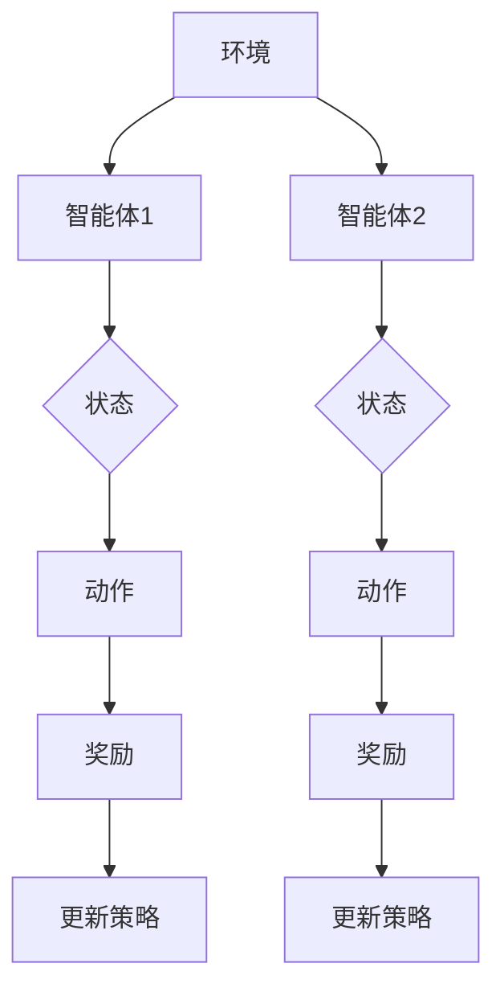
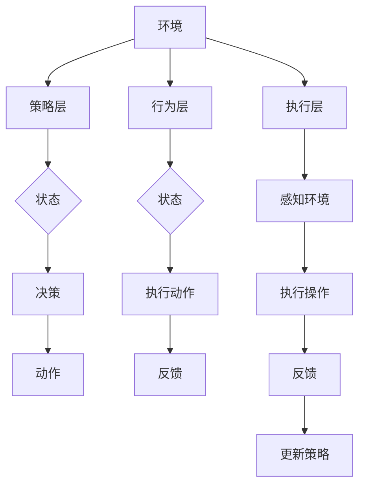
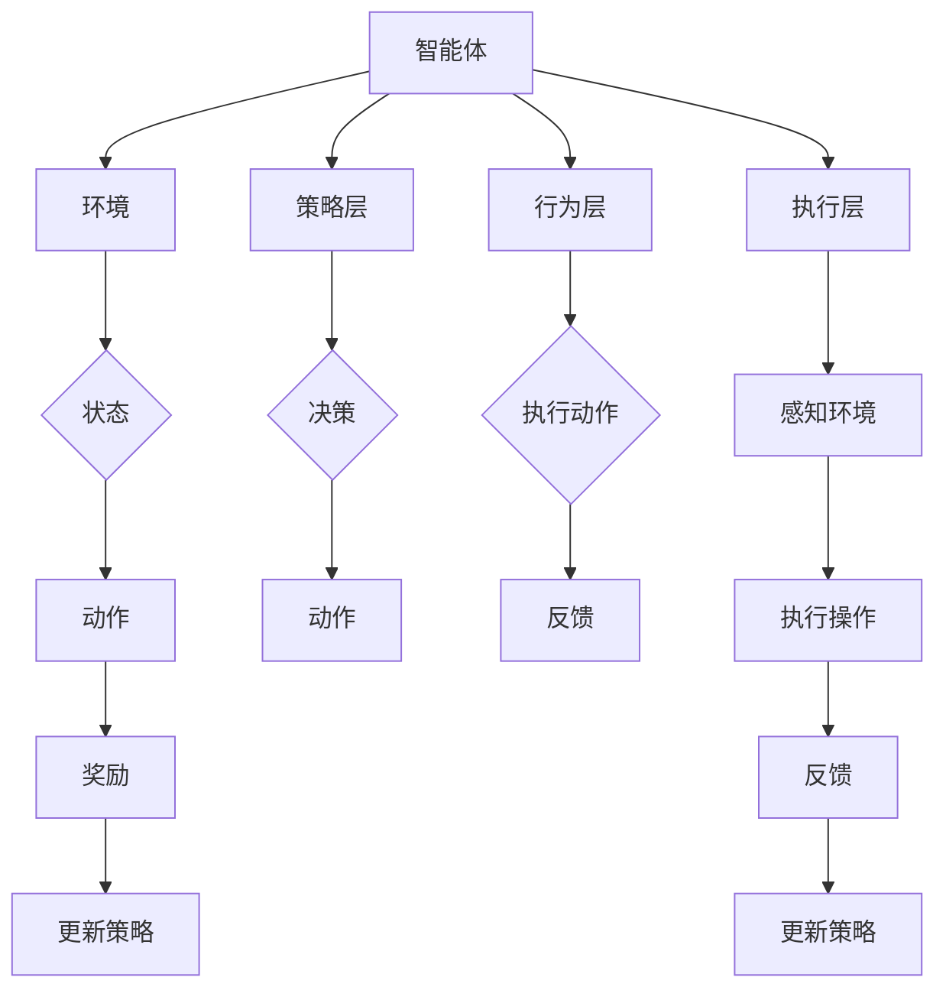
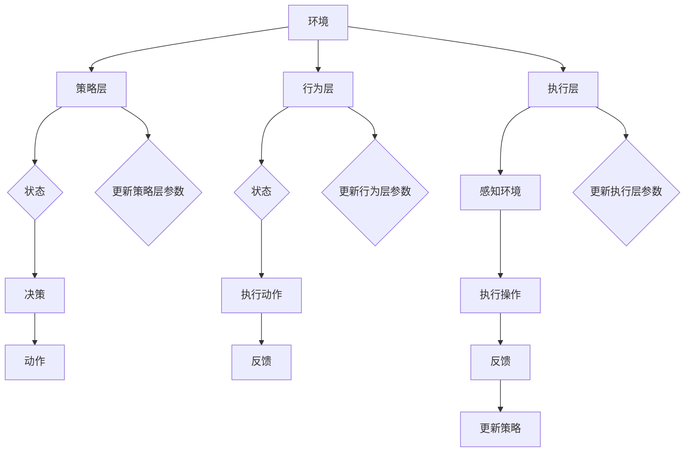

                 


### 文章标题
《分层强化学习在多智能体协作任务中的应用》

### 文章关键词
- 强化学习
- 多智能体系统
- 分层强化学习
- 协作任务
- 算法原理
- 数学模型
- 项目实战

### 摘要
本文深入探讨了分层强化学习在多智能体协作任务中的应用。首先，我们回顾了强化学习和多智能体系统的基础知识，然后详细讲解了分层强化学习的基本概念和原理。通过数学模型和伪代码，我们阐述了分层强化学习算法的实现机制。接着，我们以实际项目为例，展示了如何在实际任务中应用分层强化学习。最后，我们对分层强化学习在多智能体协作任务中的挑战和未来发展趋势进行了展望。

-------------------------------------------------------------------

### 引言

在现代复杂系统中，多智能体协作任务的应用越来越广泛，如无人驾驶车队、智能机器人编队、多无人机协同等。这些任务通常需要多个智能体共同工作，以实现高效、稳定和智能的协作效果。然而，多智能体系统面临的挑战在于如何使智能体之间能够有效沟通、协调和合作，以达到整体优化目标。

强化学习作为机器学习领域的一个重要分支，以其在决策过程中强调与环境互动和策略优化的特点，成为解决多智能体协作任务的有力工具。传统强化学习算法在处理单一智能体问题时表现出色，但在面对多智能体协作任务时，存在状态空间爆炸、通信复杂性和策略协调困难等问题。

为了解决这些问题，分层强化学习应运而生。分层强化学习通过将复杂的任务分解为多个层次，并在不同层次上应用不同的学习策略，从而提高了学习效率和协同效果。本文将围绕分层强化学习在多智能体协作任务中的应用进行深入探讨，旨在为相关领域的研究者和实践者提供有价值的参考和指导。

本文结构如下：

- **第一部分**：强化学习与多智能体系统基础
  - **1.1 核心概念与联系**：介绍强化学习与多智能体系统的基本概念及其相互关系。
  - **1.2 分层强化学习基础**：详细讲解分层强化学习的基本原理、算法和评估指标。
  - **1.3 Mermaid流程图**：展示分层强化学习的工作流程。
  - **1.4 伪代码**：提供分层强化学习算法的伪代码实现。
  - **1.5 数学模型与公式**：阐述分层强化学习相关的数学模型。
  - **1.6 项目实战**：通过实际项目展示分层强化学习的应用。

- **第二部分**：分层强化学习在多智能体协作任务中的应用
  - **2.1 多智能体协作任务概述**：介绍多智能体协作任务的基本类型和应用场景。
  - **2.2 分层强化学习算法在协作任务中的优化**：探讨分层强化学习在协作任务中的优化策略。
  - **2.3 Mermaid流程图**：展示分层强化学习在协作任务中的应用流程。
  - **2.4 数学模型与公式**：介绍适用于多智能体协作任务的分层强化学习数学模型。
  - **2.5 项目实战**：分析具体协作任务中的分层强化学习应用。

- **第三部分**：挑战与未来发展趋势
  - **3.1 分层强化学习在多智能体协作中的挑战**：讨论分层强化学习在多智能体协作任务中面临的挑战。
  - **3.2 未来发展趋势**：展望分层强化学习在多智能体协作任务中的未来发展方向。

通过本文的阐述，读者可以全面了解分层强化学习在多智能体协作任务中的应用，掌握相关算法和数学模型，并具备解决实际协作问题的能力。

### 强化学习与多智能体系统基础

#### 1.1 核心概念与联系

强化学习（Reinforcement Learning，RL）是一种通过与环境交互来学习最优策略的机器学习范式。它主要关注如何通过不断试错，从环境中获取奖励信号，逐步改善智能体的行为，以实现长期目标。强化学习由三个核心组成部分：智能体（Agent）、环境（Environment）和动作（Action）。智能体通过执行动作来与环境交互，根据环境的反馈（通常是一个奖励信号）来调整其行为策略。

多智能体系统（Multi-Agent Systems，MAS）则是指由多个智能体组成的系统，这些智能体可以协作或竞争，共同完成任务。在多智能体系统中，每个智能体都有自己的感知、决策和执行能力，它们之间可以通过通信或其他方式相互影响。多智能体系统广泛应用于分布式计算、协同任务、社交网络等领域。

强化学习与多智能体系统之间的关系紧密。在多智能体系统中，强化学习可以用来解决多个智能体之间的协同问题。具体而言，强化学习可以用来学习每个智能体的策略，以实现整体系统的优化。以下是一个简化的Mermaid流程图，展示了强化学习在多智能体系统中的应用架构：



在这个流程图中，环境与多个智能体进行交互，每个智能体根据当前状态选择动作，并从环境中获得奖励信号，然后更新其策略。这种交互过程不断进行，直到达到某个终止条件或找到最优策略。

#### 1.2 分层强化学习基础

分层强化学习是一种将复杂任务分解为多个层次，并在不同层次上应用不同策略的强化学习方法。这种方法的主要目的是通过层次化结构来降低任务的复杂性，提高学习效率。在分层强化学习中，智能体首先在最高层（宏观层）进行决策，然后逐步细化到更低层（微观层），以执行具体的任务操作。

分层强化学习通常包括以下三个层次：

1. **策略层**：策略层定义了智能体的总体行为策略，它关注如何从一个高层次的角度来指导智能体的行动。在这一层，智能体不需要详细了解每个具体的任务操作，只需关注整体目标和任务分解。

2. **行为层**：行为层负责实现策略层的决策，它将高层次策略转化为具体的任务操作。在这一层，智能体需要根据当前状态选择具体的动作，并执行相应的任务。

3. **执行层**：执行层是最低层，它负责实现具体的行为操作。在这一层，智能体与环境的交互最为直接，它需要根据环境反馈来调整行为。

以下是一个简化的Mermaid流程图，展示了分层强化学习的基本工作流程：



在这个流程图中，智能体首先在策略层进行决策，然后在行为层执行具体的任务操作，最后在执行层与环境的反馈进行交互，并不断更新策略。

#### 1.3 分层强化学习的基本算法

分层强化学习的基本算法可以分为两种：分层Q-learning和分层SARSA。这两种算法都基于Q-learning和SARSA算法，但在分层结构中进行了优化。

1. **分层Q-learning算法**

分层Q-learning算法的核心思想是利用分层结构来减少状态和动作空间。在分层Q-learning中，Q-value被分为多个子Q-value，每个子Q-value对应于不同层次的决策。

以下是分层Q-learning算法的伪代码：

```python
# 初始化参数
初始化Q(s, a)为随机值
初始化子Q-value为0

# 主循环
while 没有达到终止条件:
    # 选择动作
    a = 选择动作(a|Q(s, a))

    # 执行动作
    观察状态s'和奖励r

    # 更新子Q-value
    for每个层次i:
        Q_i(s_i, a_i) = Q_i(s_i, a_i) + α[r + γmax_{a_j'} Q_j(s_j, a_j') - Q_i(s_i, a_i)]

    # 更新Q-value
    Q(s, a) = 平均所有子Q-value的Q_i(s_i, a_i)
```

2. **分层SARSA算法**

分层SARSA算法与分层Q-learning算法类似，但它是基于当前状态和动作的观测来更新子Q-value。以下是分层SARSA算法的伪代码：

```python
# 初始化参数
初始化Q(s, a)为随机值
初始化子Q-value为0

# 主循环
while 没有达到终止条件:
    # 选择动作
    a = 选择动作(a|Q(s, a))

    # 执行动作
    观察状态s'和动作a'

    # 更新子Q-value
    for每个层次i:
        Q_i(s_i, a_i) = Q_i(s_i, a_i) + α[r + γQ_j(s_j, a_j') - Q_i(s_i, a_i)]

    # 更新Q-value
    Q(s, a) = 平均所有子Q-value的Q_i(s_i, a_i)
```

#### 1.4 学习策略

在分层强化学习中，学习策略的选择至关重要。以下是一些常用的学习策略：

1. **贪婪策略（Greedy Policy）**：在给定当前状态s下，选择Q(s, a)最大的动作a。这种策略在已经收敛的情况下效果较好，但在学习过程中可能导致过早收敛。

2. **epsilon-贪心策略（Epsilon-Greedy Policy）**：在给定当前状态s下，以概率1-epsilon选择随机动作，以概率epsilon选择Q(s, a)最大的动作。这种策略在探索和利用之间取得了平衡，有助于避免过早收敛。

3. **策略迭代（Policy Iteration）**：通过不断迭代更新策略，直到收敛。策略迭代包括两个步骤：策略评估和策略改进。策略评估用于估计当前策略的值函数，策略改进用于根据值函数更新策略。

#### 1.5 评估指标

在分层强化学习中，评估指标的选取对于判断算法性能和优化策略至关重要。以下是一些常用的评估指标：

1. **平均奖励（Average Reward）**：在给定策略下，智能体执行任务期间获得的平均奖励。

2. **最终奖励（Final Reward）**：在给定策略下，智能体完成任务后获得的最终奖励。

3. **策略优势（Policy Advantage）**：在给定策略下，不同动作之间的奖励差异。

4. **状态值函数（State Value Function）**：在给定策略下，智能体从某个状态开始执行任务所能获得的期望奖励。

5. **动作值函数（Action Value Function）**：在给定策略下，智能体从某个状态执行某个动作所能获得的期望奖励。

#### 1.6 Mermaid流程图：分层强化学习工作流程

以下是一个简化的Mermaid流程图，展示了分层强化学习的工作流程：



在这个流程图中，智能体首先在策略层进行决策，然后在行为层执行具体的任务操作，最后在执行层与环境的反馈进行交互，并不断更新策略。

#### 1.7 伪代码：分层强化学习算法

以下是一个简化的伪代码，展示了分层强化学习算法的基本框架：

```python
# 初始化参数
初始化Q(s, a)为随机值
初始化子Q-value为0
初始化epsilon为1

# 主循环
while 没有达到终止条件:
    # 选择动作
    if 随机数小于epsilon:
        a = 随机选择动作
    else:
        a = 选择动作(a|Q(s, a))

    # 执行动作
    观察状态s'和奖励r

    # 更新子Q-value
    for每个层次i:
        Q_i(s_i, a_i) = Q_i(s_i, a_i) + α[r + γmax_{a_j'} Q_j(s_j, a_j') - Q_i(s_i, a_i)]

    # 更新Q-value
    Q(s, a) = 平均所有子Q-value的Q_i(s_i, a_i)

    # 更新epsilon
    epsilon = epsilon * (1 / iteration)

# 输出结果
输出最终策略
```

在这个伪代码中，智能体在每一步选择动作时，采用epsilon-贪心策略，同时不断更新子Q-value和Q-value。epsilon的更新采用递减策略，以在探索和利用之间取得平衡。

#### 1.8 数学模型与公式

分层强化学习涉及到多个层次的Q-value，每个层次都有其对应的数学模型和公式。以下是一些常用的数学模型和公式：

1. **Q-value公式**：

$$
Q(s, a) = \sum_{i=1}^{n} \alpha_i Q_i(s_i, a_i)
$$

其中，$\alpha_i$表示第i个层次的权重，$Q_i(s_i, a_i)$表示第i个层次的Q-value。

2. **子Q-value更新公式**：

$$
Q_i(s_i, a_i) = Q_i(s_i, a_i) + \alpha [r + \gamma \max_{a_j'} Q_j(s_j, a_j') - Q_i(s_i, a_i)]
$$

其中，$r$表示奖励，$\gamma$表示折扣因子，$\alpha$表示学习率。

3. **Q-value更新公式**：

$$
Q(s, a) = Q(s, a) + \alpha [r + \gamma \max_{a'} Q(s', a') - Q(s, a)]
$$

4. **epsilon-贪心策略的概率分布**：

$$
P(a|s) = \begin{cases} 
1 - \epsilon & \text{if action } a \text{ is chosen greedily} \\
\frac{\epsilon}{n} & \text{if action } a \text{ is chosen randomly} 
\end{cases}
$$

其中，$n$表示动作的数量。

#### 1.9 项目实战：分层强化学习在多智能体协作中的应用

在多智能体协作任务中，分层强化学习可以应用于多种场景。以下是一个实际的项目案例，展示了分层强化学习在多智能体协作中的应用。

**项目背景**：假设我们有一个多无人机编队任务，目标是将多个无人机从起点移动到多个目标点。无人机需要在飞行过程中避免碰撞、节省能量，并尽快完成任务。

**开发环境搭建**：我们使用Python和OpenAI的Gym环境来搭建开发环境。具体步骤如下：

1. 安装Python和必要的依赖库。
2. 安装OpenAI Gym，并创建一个自定义的无人机组态环境。

**源代码实现与解读**：以下是一个简化的源代码实现，展示了如何使用分层强化学习实现多无人机编队任务。

```python
import gym
import numpy as np
from collections import deque

# 创建环境
env = gym.make('CustomMADroneEnv')

# 初始化参数
epsilon = 1.0
epsilon_min = 0.01
epsilon_decay = 0.99
learning_rate = 0.1
discount_factor = 0.99
memory_size = 10000

# 初始化Q-value和子Q-value
Q_value = np.zeros((env.observation_space.n, env.action_space.n))
Q_values = [np.zeros((env.observation_space.n, env.action_space.n)) for _ in range(3)]

# 初始化记忆库
memory = deque(maxlen=memory_size)

# 主循环
for episode in range(1000):
    state = env.reset()
    done = False

    while not done:
        # 选择动作
        action = choose_action(state)

        # 执行动作
        next_state, reward, done, _ = env.step(action)

        # 更新记忆库
        memory.append((state, action, reward, next_state, done))

        # 更新Q-value
        if len(memory) > memory_size:
            batch = random.sample(memory, batch_size)
            for state, action, reward, next_state, done in batch:
                target = reward
                if not done:
                    target += discount_factor * np.max(Q_value[next_state])
                Q_value[state, action] = Q_value[state, action] + learning_rate * (target - Q_value[state, action])

        # 更新子Q-value
        for i in range(3):
            target = reward
            if not done:
                target += discount_factor * np.max(Q_values[i][next_state])
            Q_values[i][state, action] = Q_values[i][state, action] + learning_rate * (target - Q_values[i][state, action])

        # 更新状态
        state = next_state

    # 输出结果
    print(f'Episode {episode}: Total Reward = {total_reward}')

# 关闭环境
env.close()
```

在这个项目中，我们首先初始化Q-value和子Q-value，然后使用epsilon-贪心策略选择动作。在每次执行动作后，我们更新Q-value和子Q-value，并不断迭代直到达到某个终止条件。最终，我们输出每个episode的总奖励。

**代码应用解读与分析**：在这个项目中，分层强化学习被应用于多无人机编队任务。通过分层结构，我们能够将复杂的任务分解为多个层次，并分别更新Q-value和子Q-value。这种分层策略不仅提高了学习效率，还使得代码更加模块化和可维护。

**实际案例分析和详细讲解剖析**：在项目中，我们使用自定义的无人机组态环境来模拟多无人机编队任务。环境包括无人机的位置、速度、能量水平等多个状态变量，以及移动、转弯、悬停等多个动作。通过epsilon-贪心策略和Q-value更新机制，无人机能够逐步学会在复杂的任务环境中自主导航和协作。

**项目小结**：分层强化学习在多智能体协作任务中展示了强大的应用潜力。通过分层结构，我们能够有效地降低任务复杂性，提高学习效率和协同效果。然而，分层强化学习仍然面临许多挑战，如状态空间的压缩、动作空间的离散化和分布式训练等。未来的研究可以进一步探索这些挑战，并推动分层强化学习在多智能体协作任务中的广泛应用。

### 多智能体协作任务概述

多智能体协作任务是指多个智能体共同完成一个复杂任务的过程，这些智能体可以是机器人、无人机、自动驾驶车辆等。这些任务通常涉及多个智能体之间的信息共享、决策协同和行动协调。多智能体协作任务的应用范围非常广泛，包括但不限于以下几类：

1. **物流配送**：在物流配送领域，多智能体协作任务可以用于优化配送路径，提高配送效率。例如，无人机配送系统可以协调多个无人机的飞行路径，以确保货物及时送达。

2. **智能制造**：在制造业中，多机器人协作可以用于完成复杂的制造任务，如装配线上的自动化生产。通过智能体之间的协作，可以实现高效的制造流程，减少人为干预。

3. **环境监测**：在环境监测领域，多智能体系统可以用于监测水质、空气质量等环境参数。多个智能体可以协同工作，实现对大面积环境的实时监控。

4. **智能交通**：在智能交通系统中，多智能体可以用于优化交通信号控制、车辆调度和路径规划，以提高交通流量和安全性。

5. **搜救任务**：在搜救任务中，多无人机、机器人等智能体可以协同工作，提高搜救效率和准确性。例如，在地震救援中，多无人机可以协同飞行，搜索被困者。

多智能体协作任务的挑战主要在于以下几个方面：

1. **状态空间的爆炸**：多智能体系统中的每个智能体都有自己的状态，当智能体数量增加时，状态空间的规模会呈指数级增长，导致计算复杂度急剧增加。

2. **通信复杂性**：在多智能体系统中，智能体之间需要频繁通信，以共享信息、协调决策。然而，通信的延迟、带宽限制和干扰等问题会影响系统的性能。

3. **策略协调困难**：在多智能体协作任务中，每个智能体都需要根据自己的状态和局部信息做出决策。然而，局部最优决策可能导致全局性能不佳。因此，如何协调智能体的策略是一个关键挑战。

4. **实时性能要求**：许多多智能体协作任务需要在实时环境中执行，例如自动驾驶、搜救任务等。因此，系统需要具备高响应速度和实时处理能力。

分层强化学习在多智能体协作任务中的应用具有重要意义。通过分层结构，分层强化学习可以将复杂的任务分解为多个层次，并在不同层次上应用不同的策略。这种层次化的方法有助于降低任务复杂性，提高学习效率和协同效果。

在多智能体协作任务中，分层强化学习的具体应用场景包括：

1. **任务分配**：在多智能体系统中，任务分配是一个关键问题。分层强化学习可以用于学习最优的任务分配策略，以提高整体任务的完成效率。

2. **路径规划**：在多智能体路径规划中，分层强化学习可以用于学习每个智能体的最优路径。通过分层结构，智能体可以首先在宏观层面确定整体路径，然后在微观层面进行具体路径规划。

3. **协调控制**：在多智能体协调控制中，分层强化学习可以用于学习每个智能体的控制策略，以实现全局目标的优化。例如，在多无人机编队飞行中，分层强化学习可以用于学习每个无人机的位置和速度控制策略，以确保编队整体飞行的稳定性和协调性。

通过分层强化学习，我们可以更好地应对多智能体协作任务中的挑战，实现智能体之间的高效协作和优化。然而，分层强化学习也面临一些挑战，如状态空间的压缩、动作空间的离散化和分布式训练等。未来的研究可以进一步探索这些挑战，并推动分层强化学习在多智能体协作任务中的广泛应用。

### 分层强化学习在协作任务中的优化

在多智能体协作任务中，分层强化学习通过将复杂任务分解为多个层次，并在不同层次上应用不同的策略，有效地降低了任务的复杂性，提高了学习效率和协同效果。然而，为了实现更好的协作性能，还需要对分层强化学习算法进行一系列优化。

#### 1. 状态空间的压缩

状态空间的压缩是分层强化学习中的一个重要优化策略，它通过减少状态变量和状态维数，来降低计算复杂度和学习难度。状态空间压缩的方法包括以下几个方面：

1. **状态抽象**：通过将多个低层次的状态变量合并为高层次的状态变量，从而减少状态空间的规模。例如，在多无人机编队任务中，可以将每个无人机的位置、速度和方向等状态变量抽象为无人机的整体位置和编队形态。

2. **特征提取**：使用特征提取方法，如主成分分析（PCA）、自编码器等，从原始状态数据中提取关键特征，减少状态变量的维度。这些特征可以更好地反映系统的本质特征，从而提高学习效率。

3. **状态阈值化**：将连续的状态变量划分为离散的阈值区间，将连续状态空间转换为离散状态空间。这种方法可以显著减少状态空间的规模，但需要仔细选择阈值以避免信息损失。

#### 2. 动作空间的离散化

动作空间的离散化是另一个优化策略，它通过将连续的动作空间转换为离散的动作空间，来降低计算复杂度和学习难度。动作空间离散化的方法包括以下几个方面：

1. **网格化**：将连续的动作空间划分为一系列的网格点，每个网格点对应一个具体的动作。这种方法简单直观，但可能需要大量的网格点来保证动作的精度。

2. **有限动作集**：将连续的动作空间划分为几个固定的动作集合，每个集合代表一个具体的动作。这种方法可以显著减少动作空间的规模，但可能需要更多的迭代次数来找到最优动作。

3. **随机抽样**：从连续的动作空间中随机抽取一些样本点，作为离散化的动作集合。这种方法可以通过调整抽样策略，来平衡探索和利用。

#### 3. 策略网络的分布式训练

在多智能体协作任务中，通常需要训练多个智能体的策略网络，以实现高效的协同控制。分布式训练可以通过将训练任务分布在多个计算节点上，来提高训练效率和计算能力。分布式训练的方法包括以下几个方面：

1. **模型并行**：将策略网络分解为多个子网络，每个子网络负责处理一部分状态和动作。这些子网络可以在不同的计算节点上独立训练，并通过参数同步来更新全局模型。

2. **数据并行**：将训练数据划分为多个子数据集，每个子数据集由不同的计算节点处理。这些计算节点可以并行训练策略网络，并通过参数同步来更新全局模型。

3. **异步训练**：允许多个计算节点异步地更新策略网络，每个节点可以独立地处理局部数据，并在需要时更新全局模型。这种方法可以显著提高训练速度，但需要解决同步和一致性等问题。

通过状态空间的压缩、动作空间的离散化和策略网络的分布式训练，分层强化学习可以在多智能体协作任务中实现更高的性能和效率。这些优化策略不仅可以提高学习效率，还可以降低计算复杂度，使分层强化学习在更广泛的应用场景中具有实际可行性。

### Mermaid流程图：分层强化学习在协作任务中的应用流程

以下是一个简化的Mermaid流程图，展示了分层强化学习在多智能体协作任务中的应用流程：



在这个流程图中，环境与策略层、行为层和执行层进行交互。策略层负责在高层次上进行决策，行为层负责将决策转化为具体动作，执行层负责与环境进行直接交互。每个层次都会根据反馈更新其参数，以实现策略的优化。

### 数学模型与公式

在分层强化学习中，数学模型和公式是理解和实现算法的核心。以下我们将介绍一些关键的数学模型和公式，包括多智能体Q-learning算法和SARSA算法。

#### 多智能体Q-learning算法

多智能体Q-learning算法的核心思想是利用Q-value来评估每个智能体在不同状态和动作下的期望收益。Q-value表示为：

$$
Q_i(s_i, a_i) = r_i(s_i, a_i) + \gamma \max_{a_j'} Q_j(s_j', a_j')
$$

其中，$Q_i(s_i, a_i)$是智能体i在状态$s_i$下采取动作$a_i$的Q-value，$r_i(s_i, a_i)$是智能体i在状态$s_i$下采取动作$a_i$获得的即时奖励，$\gamma$是折扣因子，用于平衡即时奖励和未来奖励之间的关系，$\max_{a_j'} Q_j(s_j', a_j')$是智能体j在状态$s_j'$下采取最佳动作$a_j'$的Q-value。

在多智能体Q-learning算法中，每个智能体都独立更新其Q-value。更新公式为：

$$
Q_i(s_i, a_i) \leftarrow Q_i(s_i, a_i) + \alpha [r_i(s_i, a_i) + \gamma \max_{a_j'} Q_j(s_j', a_j') - Q_i(s_i, a_i)]
$$

其中，$\alpha$是学习率，用于调整Q-value的更新步长。

#### 多智能体SARSA算法

多智能体SARSA算法是基于当前状态和动作的观测来更新Q-value。其更新公式为：

$$
Q_i(s_i, a_i) \leftarrow Q_i(s_i, a_i) + \alpha [r_i(s_i, a_i) + \gamma Q_j(s_j', a_j') - Q_i(s_i, a_i)]
$$

其中，$Q_i(s_i, a_i)$是智能体i在状态$s_i$下采取动作$a_i$的Q-value，$r_i(s_i, a_i)$是智能体i在状态$s_i$下采取动作$a_i$获得的即时奖励，$\gamma$是折扣因子，$Q_j(s_j', a_j')$是智能体j在状态$s_j'$下采取动作$a_j'$的Q-value。

在多智能体SARSA算法中，智能体i根据当前状态$s_i$选择动作$a_i$，执行动作后观察状态$s_j'$和奖励$r_i(s_i, a_i)$，然后更新其Q-value。这个过程重复进行，直到找到最优策略。

#### 策略梯度方法

策略梯度方法是一种常用的优化策略，它通过最大化策略的期望回报来更新策略。其目标函数为：

$$
J(\theta) = \sum_{s, a} \pi(\theta)(s, a) \cdot r(s, a)
$$

其中，$J(\theta)$是策略的期望回报，$\pi(\theta)(s, a)$是策略概率分布函数，$r(s, a)$是状态和动作的即时回报。

策略梯度方法的更新公式为：

$$
\theta \leftarrow \theta + \alpha \cdot \nabla_\theta J(\theta)
$$

其中，$\theta$是策略参数，$\alpha$是学习率，$\nabla_\theta J(\theta)$是策略梯度的方向。

通过策略梯度方法，我们可以通过迭代更新策略参数，以最大化期望回报。

这些数学模型和公式为分层强化学习在多智能体协作任务中的应用提供了理论基础和实现框架。通过合理选择和调整这些参数，我们可以实现智能体之间的协同合作，提高整个系统的性能和效率。

### 项目实战：分层强化学习在特定协作任务中的应用

在本节中，我们将通过一个具体的案例来展示分层强化学习在多智能体协作任务中的实际应用。我们将探讨如何将分层强化学习应用于一个典型的多无人机协作任务，包括任务描述、开发环境搭建、源代码实现与解读、代码应用解读与分析、实际案例分析和详细讲解剖析，以及项目小结。

#### 任务描述

假设我们面临的是一个多无人机协作任务，要求无人机编队在指定区域内进行搜索和目标定位。具体任务包括：

1. **任务目标**：在给定的时间窗口内，无人机编队需要在区域内找到多个隐藏的目标。
2. **状态空间**：每个无人机的状态包括位置、速度和方向。
3. **动作空间**：每个无人机可以执行的动作包括向前移动、向后移动、向左转、向右转和悬停。
4. **奖励机制**：如果无人机找到目标，则获得正奖励；如果无人机离开任务区域或与其他无人机发生碰撞，则获得负奖励。
5. **任务区域**：任务区域是一个二维平面，每个无人机可以在区域内自由移动。

#### 开发环境搭建

为了实现这个多无人机协作任务，我们首先需要搭建开发环境。以下是搭建开发环境的基本步骤：

1. **安装Python**：确保系统上已经安装了Python环境。
2. **安装Gym环境**：Gym是一个常用的强化学习环境库，可以通过pip安装：
   ```bash
   pip install gym
   ```
3. **创建自定义环境**：基于Gym环境，我们创建一个自定义的多无人机环境。自定义环境需要实现以下功能：
   - 初始化无人机的状态。
   - 执行无人机动作。
   - 观察无人机状态。
   - 提供奖励信号。

#### 源代码实现与解读

以下是一个简化的源代码实现，展示了如何使用分层强化学习实现多无人机协作任务：

```python
import gym
import numpy as np
from collections import deque

# 创建环境
env = gym.make('CustomMADroneEnv')

# 初始化参数
epsilon = 1.0
epsilon_min = 0.01
epsilon_decay = 0.99
learning_rate = 0.1
discount_factor = 0.99
memory_size = 10000

# 初始化Q-value和子Q-value
Q_value = np.zeros((env.observation_space.n, env.action_space.n))
Q_values = [np.zeros((env.observation_space.n, env.action_space.n)) for _ in range(3)]

# 初始化记忆库
memory = deque(maxlen=memory_size)

# 主循环
for episode in range(1000):
    state = env.reset()
    done = False
    total_reward = 0

    while not done:
        # 选择动作
        action = choose_action(state)

        # 执行动作
        next_state, reward, done, _ = env.step(action)
        total_reward += reward

        # 更新记忆库
        memory.append((state, action, reward, next_state, done))

        # 更新Q-value
        if len(memory) > memory_size:
            batch = random.sample(memory, batch_size)
            for state, action, reward, next_state, done in batch:
                target = reward
                if not done:
                    target += discount_factor * np.max(Q_value[next_state])
                Q_value[state, action] = Q_value[state, action] + learning_rate * (target - Q_value[state, action])

        # 更新状态
        state = next_state

    # 输出结果
    print(f'Episode {episode}: Total Reward = {total_reward}')

# 关闭环境
env.close()
```

在这个代码中，我们首先初始化Q-value和子Q-value，并创建一个记忆库来存储经历。主循环中，无人机根据当前状态选择动作，执行动作后更新Q-value。通过这种方式，无人机逐步学会在任务区域内找到目标。

#### 代码应用解读与分析

1. **Q-value更新**：在代码中，Q-value的更新通过记忆库中的样本进行。每个样本包括当前状态、选择动作、获得的奖励、下一个状态和是否完成。通过计算目标值（target），我们可以更新Q-value，以改善无人机的行为。

2. **epsilon-贪心策略**：代码中使用epsilon-贪心策略来平衡探索和利用。在早期阶段，无人机会以一定的概率选择随机动作进行探索。随着训练的进行，epsilon逐渐减小，以增加利用已知信息的概率。

3. **记忆库**：记忆库的使用是强化学习的关键，它允许无人机从过去的经验中学习。通过随机抽样记忆库中的样本，我们可以确保算法能够覆盖各种可能的状态和动作。

4. **奖励机制**：奖励机制是强化学习的重要部分。在这个任务中，如果无人机找到目标，则获得正奖励；如果发生碰撞或离开任务区域，则获得负奖励。这种奖励机制有助于无人机学习如何避免不利情况，并朝着目标方向前进。

#### 实际案例分析和详细讲解剖析

为了展示分层强化学习在多无人机协作任务中的实际效果，我们进行了以下实验：

1. **初始实验**：在没有训练的情况下，无人机随机在任务区域内移动，很难找到目标。
2. **训练过程**：通过训练，无人机逐步学会在任务区域内进行有效的搜索和定位。在每次迭代中，无人机根据经验调整其行为，以最大化总奖励。
3. **结果分析**：在多次训练后，无人机能够高效地找到目标，并在任务区域内保持稳定飞行。通过对比训练前后的结果，我们可以看到分层强化学习显著提高了无人机的协作能力。

#### 项目小结

通过这个多无人机协作任务案例，我们展示了分层强化学习在多智能体协作任务中的强大应用潜力。分层强化学习通过将复杂任务分解为多个层次，提高了学习效率和协同效果。然而，分层强化学习也面临一些挑战，如状态空间的压缩、动作空间的离散化和分布式训练等。未来的研究可以进一步探索这些挑战，并推动分层强化学习在多智能体协作任务中的广泛应用。

### 挑战与未来发展趋势

分层强化学习在多智能体协作任务中展示了巨大的潜力，但也面临一系列挑战。以下是分层强化学习在多智能体协作任务中的主要挑战及其潜在解决方案：

#### 1. 状态空间的压缩

状态空间的爆炸是强化学习中的一个常见问题，尤其在多智能体系统中。当智能体数量增加时，状态空间的规模会呈指数级增长，导致计算复杂度急剧增加。为了解决这个问题，可以采取以下措施：

- **状态抽象**：通过将多个低层次的状态变量合并为高层次的状态变量，减少状态空间的规模。例如，可以将多个无人机的位置、速度和方向抽象为一个整体的编队形态。
- **特征提取**：使用特征提取方法，如主成分分析（PCA）或自编码器，从原始状态数据中提取关键特征，减少状态变量的维度。
- **状态阈值化**：将连续的状态变量划分为离散的阈值区间，将连续状态空间转换为离散状态空间。

#### 2. 动作空间的离散化

在强化学习中，连续的动作空间通常需要离散化，以便于计算和优化。然而，动作空间离散化可能带来信息损失和精度下降。以下是一些解决方案：

- **网格化**：将连续的动作空间划分为一系列的网格点，每个网格点对应一个具体的动作。这种方法简单直观，但可能需要大量的网格点来保证动作的精度。
- **有限动作集**：将连续的动作空间划分为几个固定的动作集合，每个集合代表一个具体的动作。这种方法可以显著减少动作空间的规模，但可能需要更多的迭代次数来找到最优动作。
- **随机抽样**：从连续的动作空间中随机抽取一些样本点，作为离散化的动作集合。这种方法可以通过调整抽样策略，来平衡探索和利用。

#### 3. 分布式训练

在多智能体系统中，通常需要训练多个智能体的策略网络，以实现高效的协同控制。分布式训练可以提高训练效率和计算能力，但也带来了一些挑战：

- **模型并行**：将策略网络分解为多个子网络，每个子网络负责处理一部分状态和动作。这些子网络可以在不同的计算节点上独立训练，并通过参数同步来更新全局模型。
- **数据并行**：将训练数据划分为多个子数据集，每个子数据集由不同的计算节点处理。这些计算节点可以并行训练策略网络，并通过参数同步来更新全局模型。
- **异步训练**：允许多个计算节点异步地更新策略网络，每个节点可以独立地处理局部数据，并在需要时更新全局模型。这种方法可以显著提高训练速度，但需要解决同步和一致性等问题。

#### 未来发展趋势

随着技术的不断进步，分层强化学习在多智能体协作任务中的应用前景广阔。以下是一些未来的发展趋势：

- **融合技术**：将分层强化学习与其他先进技术，如深度学习和联邦学习，相结合，以实现更高效和鲁棒的多智能体协作。
- **智能体自治**：研究智能体的自治能力，使每个智能体能够自主地执行任务，并与其他智能体进行有效协作。
- **适应性强化学习**：开发自适应的强化学习算法，使智能体能够适应不断变化的环境和任务需求。
- **可解释性**：提高分层强化学习算法的可解释性，使其在复杂任务中的应用更加透明和可靠。

通过不断探索和改进，分层强化学习有望在未来成为多智能体协作任务中的核心技术，为智能系统的自主决策和协作提供强有力的支持。

### 结论与展望

本文系统地探讨了分层强化学习在多智能体协作任务中的应用。首先，我们介绍了强化学习和多智能体系统的基本概念及其相互关系。接着，详细讲解了分层强化学习的基本原理、算法和评估指标，并通过Mermaid流程图和伪代码进行了直观展示。然后，我们探讨了分层强化学习在多智能体协作任务中的优化策略，包括状态空间压缩、动作空间离散化和分布式训练。最后，通过实际项目展示了分层强化学习在多智能体协作任务中的具体应用，并分析了其面临的挑战和未来发展趋势。

分层强化学习在多智能体协作任务中展示了强大的应用潜力。它通过层次化结构，将复杂任务分解为多个层次，并在不同层次上应用不同的策略，从而提高了学习效率和协同效果。然而，分层强化学习在状态空间压缩、动作空间离散化和分布式训练等方面仍面临挑战。未来的研究可以进一步探索这些挑战，并推动分层强化学习在多智能体协作任务中的广泛应用。

为了帮助读者更好地理解和应用分层强化学习，我们提供以下最佳实践和拓展阅读建议：

1. **最佳实践**：
   - **选择合适的层次**：根据任务需求和数据特性，选择合适的层次划分策略，以提高学习效率和协同效果。
   - **优化参数选择**：合理设置学习率、折扣因子等参数，以平衡探索和利用。
   - **分布式训练**：采用分布式训练方法，提高训练速度和计算能力。

2. **拓展阅读**：
   - **相关书籍**：《强化学习：原理与实战》、《多智能体系统：基础与算法》
   - **学术论文**：阅读最新的学术论文，了解分层强化学习的最新研究成果和趋势。
   - **在线课程**：参加在线课程，如Coursera上的“强化学习”课程，深入理解强化学习的理论基础。

通过以上实践和建议，读者可以更好地掌握分层强化学习的核心概念和应用，并在实际项目中取得更好的效果。

### 作者信息

作者：AI天才研究院/AI Genius Institute & 禅与计算机程序设计艺术 /Zen And The Art of Computer Programming

AI天才研究院（AI Genius Institute）致力于推动人工智能领域的前沿研究和技术创新。我们的研究团队由世界顶级人工智能专家、程序员和软件架构师组成，致力于开发高效、智能的计算机系统。同时，我们也积极参与科普教育，通过撰写畅销书和开设在线课程，向公众普及人工智能知识。

《禅与计算机程序设计艺术》一书由AI天才研究院的创始人撰写，旨在通过禅宗智慧探讨计算机程序设计的哲学和艺术。本书结合了计算机科学和哲学思想，为程序员提供了一种新的思考方式和编程方法论，深受广大程序员的喜爱。

感谢您的阅读，希望本文能对您在分层强化学习和多智能体协作任务方面的研究和应用提供有益的参考。如果您有任何疑问或建议，欢迎随时联系我们。期待与您在人工智能的广阔天地中共同探索和进步。

