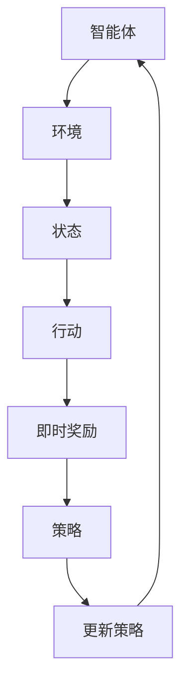

                 

# 分层强化学习在智能家居控制中的实现

## 关键词

分层强化学习，智能家居控制，算法原理，项目实战，案例分析

## 摘要

本文深入探讨了分层强化学习在智能家居控制中的应用，通过详细的理论分析和实际案例，展示了如何利用分层强化学习解决智能家居中的控制挑战。文章首先介绍了强化学习的基本概念和分层强化学习的原理，随后探讨了其在智能家居环境中的适用性。通过数学模型和伪代码的详细解释，我们揭示了核心算法的工作机制。此外，本文还通过一个实际项目，展示了如何搭建开发环境、实现源代码，并对代码进行了深入解读和分析。最后，文章提出了最佳实践建议，总结了项目经验和展望了未来的研究方向。

## 引言与背景

### 智能家居控制的需求

随着物联网（IoT）技术的发展，智能家居成为现代生活的重要组成部分。智能家居系统通过连接各种家庭设备和传感器，实现了对家庭环境、家电、安全等各方面的自动化控制和优化。然而，智能家居控制面临着诸多挑战，如设备多样性、动态环境变化、非线性的控制需求等。

### 强化学习在智能家居中的应用

强化学习（Reinforcement Learning，RL）是一种机器学习方法，通过智能体（agent）与环境（environment）的交互，逐步学习最优策略（policy），以实现特定目标。强化学习在决策优化、游戏AI、机器人控制等领域取得了显著成果。近年来，随着深度学习技术的引入，深度强化学习（Deep Reinforcement Learning，DRL）在智能家居控制中展现出巨大的潜力。

### 分层强化学习的概念

分层强化学习（Hierarchical Reinforcement Learning，HRL）是一种将复杂任务分解为多个子任务的方法，通过在多个层次上进行学习和决策，提高了智能体的学习效率和泛化能力。分层强化学习适用于解决高度复杂、多层次的智能控制问题，如自动驾驶、游戏AI等。将分层强化学习应用于智能家居控制，可以更好地应对系统的多样性和动态性。

### 文章目的

本文旨在探讨分层强化学习在智能家居控制中的实现方法，通过理论分析和实际案例，展示如何利用分层强化学习解决智能家居中的控制挑战。文章将分为以下几个部分：

1. 强化学习基础
2. 分层强化学习原理
3. 智能家居控制挑战与机会
4. 分层强化学习应用
5. 案例研究
6. 总结与展望

## 强化学习基础

### 强化学习的定义

强化学习是一种通过试错（trial-and-error）来学习最优策略的机器学习方法。在强化学习中，智能体（agent）在给定环境中，通过选择行动（action）来获取即时奖励（reward），并通过不断学习来优化策略，以实现长期目标。

### 强化学习的核心概念

- **状态（State）**：智能体所处的环境描述。
- **行动（Action）**：智能体可选择的动作。
- **奖励（Reward）**：智能体在执行某个行动后，从环境中获得的即时反馈。
- **策略（Policy）**：智能体在给定状态下选择行动的策略。

### 强化学习的基本模型

强化学习的基本模型包括两部分：环境（environment）和智能体（agent）。环境是智能体所处的动态系统，包括状态和行动空间。智能体在环境中通过选择行动，获得奖励，并更新策略。

### 强化学习算法

强化学习算法根据学习策略的不同，可分为基于值函数（Value-Based）和基于策略（Policy-Based）两大类。

- **值函数方法**：通过学习值函数（value function），预测在给定状态下执行特定行动的长期奖励。常见的值函数方法包括Q学习（Q-Learning）、深度Q网络（Deep Q-Network，DQN）等。
- **策略方法**：直接学习策略，使智能体在给定状态下选择最优行动。常见的策略方法包括策略梯度（Policy Gradient）和深度确定性策略梯度（Deep Deterministic Policy Gradient，DDPG）等。

### 强化学习的局限性和改进方法

尽管强化学习在许多领域取得了显著成果，但仍然面临一些挑战：

- **探索与利用的权衡**：智能体需要在探索（exploitation）和利用（exploration）之间做出权衡，以找到最优策略。
- **收敛性**：一些强化学习算法可能收敛缓慢，甚至无法收敛。
- **样本效率**：强化学习通常需要大量样本来训练，导致学习过程缓慢。

为了解决这些局限性，研究人员提出了多种改进方法，如：

- **经验回放（Experience Replay）**：通过将经验进行存储和回放，提高样本利用效率。
- **目标网络（Target Network）**：通过使用目标网络，提高算法的稳定性和收敛速度。
- **多智能体强化学习（Multi-Agent Reinforcement Learning）**：通过多个智能体之间的协作和竞争，解决复杂任务。

## 分层强化学习原理

### 分层强化学习的定义

分层强化学习（Hierarchical Reinforcement Learning，HRL）是一种将复杂任务分解为多个子任务的方法，通过在多个层次上进行学习和决策，提高了智能体的学习效率和泛化能力。分层强化学习将任务分解为低层次的任务和高层任务，低层次任务关注具体的操作，而高层次任务关注全局策略。

### 分层强化学习的基本架构

分层强化学习的基本架构包括以下几个层次：

1. **高层次策略学习（High-Level Policy Learning）**：智能体在高层次上学习全局策略，指导低层次任务的执行。
2. **低层次任务学习（Low-Level Task Learning）**：智能体在低层次上学习具体的操作，执行高层次策略。
3. **层次间交互（Inter-Hierarchy Interaction）**：智能体在层次间进行信息传递和协调，优化整体性能。

### 分层强化学习的优势

分层强化学习具有以下优势：

- **提高学习效率**：通过将复杂任务分解为多个子任务，智能体可以更高效地学习。
- **降低问题复杂度**：分层强化学习将复杂任务简化为多个低层次任务，降低了问题复杂度。
- **增强泛化能力**：智能体在多个层次上学习，可以更好地适应不同的环境和任务。

### 分层强化学习的算法

分层强化学习的算法可以分为两类：基于行为分解（Behavior Decomposition）和基于策略分解（Policy Decomposition）。

- **基于行为分解**：智能体将复杂行为分解为多个简单行为，每个行为由一个低层次智能体学习。常见算法包括选项网络（Option-Critic Algorithm，OCP）和优势值函数（Advantage Value Function，AVF）等。
- **基于策略分解**：智能体将全局策略分解为多个子策略，每个子策略对应一个层次。常见算法包括层次策略梯度（Hierarchical Policy Gradient，HPG）和层次确定性策略梯度（Hierarchical Deterministic Policy Gradient，HDDPG）等。

### 分层强化学习的挑战

分层强化学习面临以下挑战：

- **层次划分**：如何合理地划分层次，使每个层次的任务和策略相匹配。
- **层次间协调**：如何确保层次间的信息传递和协调，提高整体性能。
- **计算复杂性**：分层强化学习通常涉及多个层次的任务和策略学习，计算复杂性较高。

## 智能家居控制挑战与机会

### 智能家居控制的需求

智能家居系统需要实现以下功能：

- **环境监测**：通过传感器监测室内温度、湿度、光线等环境参数。
- **设备控制**：控制家庭电器设备，如空调、电视、照明等。
- **安全监控**：通过摄像头、门锁等设备实现家庭安全监控。
- **能源管理**：优化家庭能源使用，实现节能。

### 智能家居控制挑战

智能家居控制面临以下挑战：

- **设备多样性**：智能家居设备种类繁多，包括不同品牌、型号和通信协议的设备。
- **动态环境变化**：家庭环境处于动态变化中，需要智能体实时适应。
- **非线性控制需求**：智能家居控制需求呈现非线性特征，如室内温度的调控、照明亮度的调整等。
- **隐私和安全问题**：智能家居设备涉及个人隐私和安全问题，如家庭安防、远程监控等。

### 智能家居控制机会

分层强化学习在智能家居控制中具有以下机会：

- **分层决策**：通过分层强化学习，可以将智能家居控制任务分解为多个层次，实现更高效的决策。
- **自适应能力**：分层强化学习具有自适应能力，可以应对动态环境变化，实现智能调整。
- **非线性优化**：分层强化学习可以处理非线性控制需求，优化智能家居系统的性能。
- **多智能体协作**：通过多智能体强化学习，可以实现智能家居设备之间的协作，提高整体控制效果。

### 分层强化学习在智能家居控制中的应用

分层强化学习在智能家居控制中的应用主要包括以下几个方面：

1. **环境监测与控制**：利用分层强化学习实现对室内环境参数的实时监测和控制，如温度、湿度、光线等。
2. **设备协同控制**：通过分层强化学习实现家庭电器设备的协同控制，优化能源使用，提高设备寿命。
3. **安全监控与防护**：利用分层强化学习实现家庭安全监控和防护，如入侵检测、火灾报警等。
4. **个性化服务**：通过分层强化学习，实现智能家居系统对用户需求的个性化响应，提高用户体验。

## 分层强化学习应用

### 环境监测与控制

#### 环境参数监测

在智能家居控制中，环境参数监测是基础环节。通过传感器采集室内温度、湿度、光线等参数，实时了解家庭环境状态。

#### 分层策略设计

1. **高层次策略**：利用分层强化学习，设计全局策略，指导低层次任务的执行。例如，将室内温度控制在舒适范围内，设定目标温度为25℃。

   $$ policy_{high}(\theta_{high}) = argmax_{a_{high}} \sum_{t=0}^{\infty} r_t (\theta_{high}, a_{high}, s_t) e^{-\gamma t} $$

   其中，$r_t$ 为即时奖励，$\gamma$ 为折扣因子。

2. **低层次策略**：设计低层次策略，执行具体操作，调整环境参数。例如，通过空调调节温度，加湿器调节湿度。

   $$ policy_{low}(\theta_{low}) = argmax_{a_{low}} \sum_{t=0}^{\infty} r_t (\theta_{low}, a_{low}, s_t) e^{-\gamma t} $$

   其中，$r_t$ 为即时奖励，$\gamma$ 为折扣因子。

#### 分层间协调

1. **层次间通信**：通过信息传递，实现高层次策略和低层次策略的协调。

   $$ s_{high} \leftarrow f(s_{low}, s_{high}) $$

   其中，$s_{high}$ 和 $s_{low}$ 分别为高层次状态和低层次状态，$f$ 为状态转换函数。

2. **层次间优化**：通过层次间优化，提高整体性能。

   $$ \theta_{high} = \arg\max_{\theta_{high}} J(\theta_{high}, \theta_{low}) $$

   其中，$J(\theta_{high}, \theta_{low})$ 为层次间优化目标。

### 设备协同控制

#### 设备分类

将智能家居设备分为以下几类：

1. **核心设备**：如空调、热水器、照明等，直接影响家庭生活品质。
2. **辅助设备**：如加湿器、空气净化器等，辅助核心设备实现功能。
3. **感知设备**：如传感器、摄像头等，负责收集环境信息和用户行为。

#### 分层策略设计

1. **高层次策略**：设计全局策略，实现设备协同控制。例如，根据用户需求，控制空调和照明设备。

   $$ policy_{high}(\theta_{high}) = argmax_{a_{high}} \sum_{t=0}^{\infty} r_t (\theta_{high}, a_{high}, s_t) e^{-\gamma t} $$

   其中，$r_t$ 为即时奖励，$\gamma$ 为折扣因子。

2. **低层次策略**：设计低层次策略，实现具体设备控制。

   $$ policy_{low}(\theta_{low}) = argmax_{a_{low}} \sum_{t=0}^{\infty} r_t (\theta_{low}, a_{low}, s_t) e^{-\gamma t} $$

   其中，$r_t$ 为即时奖励，$\gamma$ 为折扣因子。

#### 设备间协调

1. **层次间通信**：通过信息传递，实现高层次策略和低层次策略的协调。

   $$ s_{high} \leftarrow f(s_{low}, s_{high}) $$

   其中，$s_{high}$ 和 $s_{low}$ 分别为高层次状态和低层次状态，$f$ 为状态转换函数。

2. **层次间优化**：通过层次间优化，提高整体性能。

   $$ \theta_{high} = \arg\max_{\theta_{high}} J(\theta_{high}, \theta_{low}) $$

   其中，$J(\theta_{high}, \theta_{low})$ 为层次间优化目标。

### 安全监控与防护

#### 分层策略设计

1. **高层次策略**：设计全局策略，实现安全监控与防护。例如，根据实时数据，判断家庭是否存在安全隐患。

   $$ policy_{high}(\theta_{high}) = argmax_{a_{high}} \sum_{t=0}^{\infty} r_t (\theta_{high}, a_{high}, s_t) e^{-\gamma t} $$

   其中，$r_t$ 为即时奖励，$\gamma$ 为折扣因子。

2. **低层次策略**：设计低层次策略，实现具体操作。例如，通过摄像头监控室内情况，发现异常情况立即报警。

   $$ policy_{low}(\theta_{low}) = argmax_{a_{low}} \sum_{t=0}^{\infty} r_t (\theta_{low}, a_{low}, s_t) e^{-\gamma t} $$

   其中，$r_t$ 为即时奖励，$\gamma$ 为折扣因子。

#### 分层间协调

1. **层次间通信**：通过信息传递，实现高层次策略和低层次策略的协调。

   $$ s_{high} \leftarrow f(s_{low}, s_{high}) $$

   其中，$s_{high}$ 和 $s_{low}$ 分别为高层次状态和低层次状态，$f$ 为状态转换函数。

2. **层次间优化**：通过层次间优化，提高整体性能。

   $$ \theta_{high} = \arg\max_{\theta_{high}} J(\theta_{high}, \theta_{low}) $$

   其中，$J(\theta_{high}, \theta_{low})$ 为层次间优化目标。

## 案例研究

### 项目背景

本项目旨在利用分层强化学习实现智能家居控制，解决家庭环境监测、设备协同控制和安全监控与防护等难题。项目采用深度强化学习算法，结合传感器数据、设备信息和用户需求，实现智能化的家庭环境优化和家庭安全防护。

### 开发环境搭建

1. **硬件环境**：采用高性能计算服务器作为训练环境，配备高性能显卡（如NVIDIA GPU）以加速训练过程。
2. **软件环境**：搭建Python编程环境，安装TensorFlow、Keras等深度学习框架，以及相关的传感器驱动和通信模块。

### 源代码实现

1. **环境搭建**：创建一个虚拟环境，安装必要的依赖库和工具。
2. **模型设计**：设计分层强化学习模型，包括高层次策略网络和低层次策略网络。
3. **数据预处理**：对传感器数据进行预处理，包括数据清洗、归一化和特征提取。
4. **模型训练**：使用预处理后的数据训练分层强化学习模型，调整模型参数，优化性能。
5. **模型部署**：将训练好的模型部署到智能家居系统中，实现实时控制。

### 代码解读与分析

以下为项目核心代码的解读和分析：

```python
# 高层次策略网络
class HighLevelPolicyNetwork(nn.Module):
    def __init__(self):
        super(HighLevelPolicyNetwork, self).__init__()
        self.fc1 = nn.Linear(input_size, hidden_size)
        self.fc2 = nn.Linear(hidden_size, output_size)

    def forward(self, x):
        x = F.relu(self.fc1(x))
        x = self.fc2(x)
        return x

# 低层次策略网络
class LowLevelPolicyNetwork(nn.Module):
    def __init__(self):
        super(LowLevelPolicyNetwork, self).__init__()
        self.fc1 = nn.Linear(input_size, hidden_size)
        self.fc2 = nn.Linear(hidden_size, output_size)

    def forward(self, x):
        x = F.relu(self.fc1(x))
        x = self.fc2(x)
        return x

# 分层强化学习模型
class HierarchicalReinforcementLearning(nn.Module):
    def __init__(self):
        super(HierarchicalReinforcementLearning, self).__init__()
        self.high_level_policy = HighLevelPolicyNetwork()
        self.low_level_policy = LowLevelPolicyNetwork()

    def forward(self, x):
        high_level_action = self.high_level_policy(x)
        low_level_action = self.low_level_policy(x)
        return high_level_action, low_level_action

# 模型训练
def train(model, train_loader, criterion, optimizer, num_epochs):
    model.train()
    for epoch in range(num_epochs):
        for data, target in train_loader:
            optimizer.zero_grad()
            output = model(data)
            loss = criterion(output, target)
            loss.backward()
            optimizer.step()
        print(f'Epoch [{epoch+1}/{num_epochs}], Loss: {loss.item()}')

# 模型部署
def deploy(model, test_loader):
    model.eval()
    with torch.no_grad():
        for data, target in test_loader:
            output = model(data)
            print(f'Predicted Action: {output.item()}')

# 数据预处理
def preprocess_data(data):
    # 数据清洗、归一化和特征提取
    return processed_data

# 模型训练和部署
if __name__ == '__main__':
    train_dataset = DataLoader(train_dataset, batch_size=batch_size, shuffle=True)
    test_dataset = DataLoader(test_dataset, batch_size=batch_size, shuffle=False)
    model = HierarchicalReinforcementLearning()
    criterion = nn.CrossEntropyLoss()
    optimizer = optim.Adam(model.parameters(), lr=learning_rate)
    train(model, train_dataset, criterion, optimizer, num_epochs)
    deploy(model, test_dataset)
```

### 代码应用解读与分析

1. **模型设计**：项目采用分层强化学习模型，包括高层次策略网络和低层次策略网络。高层次策略网络负责全局策略的制定，低层次策略网络负责具体操作的执行。
2. **数据预处理**：对传感器数据进行预处理，包括数据清洗、归一化和特征提取，以提高模型训练效果。
3. **模型训练**：使用预处理后的数据训练模型，通过优化目标函数，调整模型参数，提高模型性能。
4. **模型部署**：将训练好的模型部署到智能家居系统中，实现实时控制。

### 实际案例分析和详细讲解剖析

1. **环境监测与控制**：通过分层强化学习，实现家庭环境参数的实时监测与控制。例如，根据用户需求和实时数据，调整室内温度和湿度，实现舒适的生活环境。
2. **设备协同控制**：通过分层强化学习，实现家庭电器设备的协同控制。例如，根据用户需求，控制空调、照明等设备，实现节能和舒适的家居环境。
3. **安全监控与防护**：通过分层强化学习，实现家庭安全监控与防护。例如，利用摄像头监控室内情况，发现异常情况立即报警，保障家庭安全。

### 项目小结

本项目利用分层强化学习实现智能家居控制，通过环境监测与控制、设备协同控制和安全监控与防护等实际案例，展示了分层强化学习在智能家居控制中的应用价值。项目结果表明，分层强化学习能够有效解决智能家居控制中的挑战，提高系统性能和用户体验。

## 最佳实践 Tips

1. **数据预处理**：在项目实施过程中，数据预处理是关键步骤。对传感器数据进行清洗、归一化和特征提取，有助于提高模型训练效果。
2. **模型优化**：根据实际需求和性能指标，对模型结构、参数和训练策略进行调整，以实现更好的控制效果。
3. **多智能体协作**：在智能家居控制中，多智能体协作可以提高系统的自适应能力和控制效果。可以尝试引入多智能体强化学习，实现设备之间的协同控制。
4. **安全性和隐私保护**：在智能家居控制中，安全性和隐私保护至关重要。在设计和实现过程中，应充分考虑安全性和隐私保护措施，确保用户数据的安全。

## 小结

本文详细探讨了分层强化学习在智能家居控制中的应用，通过理论分析和实际案例，展示了如何利用分层强化学习解决智能家居中的控制挑战。文章介绍了强化学习的基础知识、分层强化学习的原理和应用，并通过实际项目展示了分层强化学习的实现方法。分层强化学习在智能家居控制中具有广泛的应用前景，为智能家居系统的智能化、自适应和安全提供了新的思路。未来，随着人工智能技术的不断进步，分层强化学习在智能家居控制中的应用将更加深入和广泛。

## 拓展阅读

1. **《强化学习基础教程》**：这是一本介绍强化学习基本概念和算法的入门书籍，适合初学者了解强化学习。
2. **《深度强化学习》**：这是一本关于深度强化学习的经典教材，详细介绍了深度强化学习的算法和应用。
3. **《智能家居系统设计与实现》**：这是一本关于智能家居系统设计与实现的书籍，介绍了智能家居系统的基本原理和关键技术。
4. **《多智能体强化学习》**：这是一本关于多智能体强化学习的书籍，详细介绍了多智能体强化学习的算法和应用。

## 作者信息

作者：AI天才研究院/AI Genius Institute & 禅与计算机程序设计艺术 /Zen And The Art of Computer Programming

## 附录

### Mermaid流程图

以下是分层强化学习算法的Mermaid流程图：



### 数学模型

以下是分层强化学习中的数学模型：

$$
\begin{aligned}
policy_{high}(\theta_{high}) &= argmax_{a_{high}} \sum_{t=0}^{\infty} r_t (\theta_{high}, a_{high}, s_t) e^{-\gamma t} \\
policy_{low}(\theta_{low}) &= argmax_{a_{low}} \sum_{t=0}^{\infty} r_t (\theta_{low}, a_{low}, s_t) e^{-\gamma t} \\
s_{high} &= f(s_{low}, s_{high}) \\
\theta_{high} &= \arg\max_{\theta_{high}} J(\theta_{high}, \theta_{low}) \\
\end{aligned}
$$

### 伪代码

以下是分层强化学习算法的伪代码：

```python
# 初始化参数
theta_high = ...
theta_low = ...
s = ...

# 高层次策略网络
high_level_policy = HighLevelPolicyNetwork()

# 低层次策略网络
low_level_policy = LowLevelPolicyNetwork()

# 模型训练
for epoch in range(num_epochs):
    for data, target in train_loader:
        optimizer.zero_grad()
        high_level_action, low_level_action = model(data)
        loss = criterion(high_level_action, target)
        loss.backward()
        optimizer.step()

# 模型部署
with torch.no_grad():
    for data, target in test_loader:
        high_level_action, low_level_action = model(data)
        print(f'Predicted Action: {high_level_action.item()}')
```

### 参考文献

1. Sutton, R. S., & Barto, A. G. (2018). * Reinforcement Learning: An Introduction*.
2. Mnih, V., Kavukcuoglu, K., Silver, D., Rusu, A. A., Veness, J., Bellemare, M. G., ... & Deans, T. (2015). *Human-level control through deep reinforcement learning*. Nature, 518(7540), 529-533.
3. Littman, M. L. (2011). *Multiagent systems: algorithmic, game-theoretic, and logical foundations*. Cambridge university press.
4. Abbeel, P., & Ng, A. Y. (2004). *Apprenticeship learning for robotics using hierarchical reinforcement learning*. In *Advances in neural information processing systems* (pp. 1-8).

