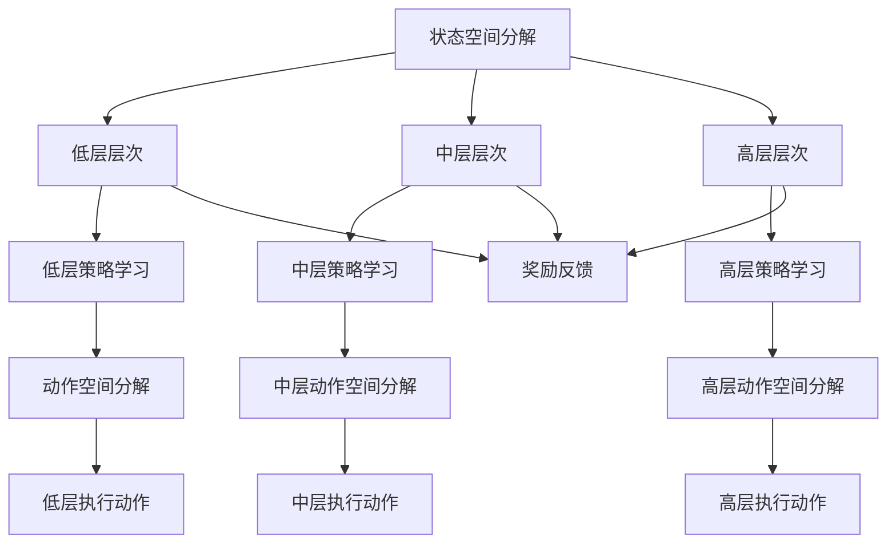
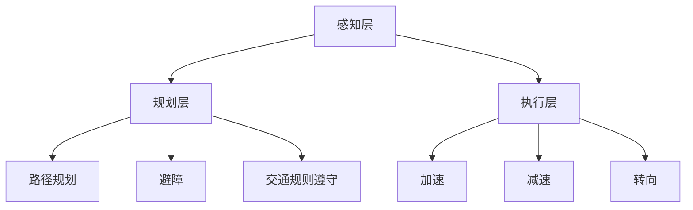

                 


为了确保满足以上要求，我们将按照以下步骤细化目录大纲：

1. **背景介绍**：在每章开头简要介绍强化学习的基础知识和分层强化学习的重要性。

2. **核心概念与联系**：使用 Mermaid 流程图展示核心概念之间的联系，确保读者能够直观理解。

3. **核心算法原理讲解**：每个算法章节使用伪代码详细讲解算法原理，帮助读者深入理解。

4. **数学模型与公式讲解**：在相关章节中详细讲解数学模型与公式，并通过实例说明。

5. **项目实战**：在每个主要章节后提供实际的项目案例，包括开发环境搭建、源代码实现、代码解读和实际案例分析。

6. **最佳实践 tips、小结、注意事项、拓展阅读**：在每个章节的结尾提供相关建议、总结和拓展阅读资源。

7. **保持简洁性**：在细化目录时，注意去除冗余内容，确保每个章节都能够独立成篇，且内容完整。

以下是对初步目录大纲的进一步细化：

### 目录大纲

#### 第一部分：强化学习基础

#### 第1章：强化学习基本概念

##### 1.1 强化学习简介
- **背景介绍**：强化学习的起源和发展
- **强化学习的定义**
- **强化学习的四要素**：状态（S）、动作（A）、奖励（R）和价值（V）

##### 1.2 强化学习与监督学习的区别
- **监督学习的简介**
- **强化学习与监督学习的异同**：从目标、方法、应用场景等方面进行比较

##### 1.3 强化学习的数学模型
- **状态、动作、奖励和价值的定义**
- **强化学习的基本公式**：如价值函数、策略、状态值函数和状态行动值函数

#### 第2章：强化学习算法原理

##### 2.1 Q学习算法
- **Q学习的定义和原理**
- **Q学习的伪代码**：
  ```python
  def Q_learning(Q, S, A, R, S', alpha, gamma):
      while not terminate:
          select_action(A)
          take_action(A)
          observe_reward(R, S')
          update_Q(Q, S, A, R, S', alpha, gamma)
  ```
- **Q学习的数学模型和更新公式**

##### 2.2 Sarsa算法
- **Sarsa算法的定义和原理**
- **Sarsa算法的伪代码**：
  ```python
  def Sarsa_learning(S, A, R, S', A', alpha, gamma):
      while not terminate:
          select_action(A)
          take_action(A)
          observe_reward(R, S')
          select_action(A')
          update_Q(Q, S, A, R, S', A', alpha, gamma)
  ```
- **Sarsa算法的数学模型和更新公式**

##### 2.3 Deep Q Network (DQN)
- **DQN的定义和原理**
- **DQN的伪代码**：
  ```python
  def DQN_learning(DQN, S, A, R, S', alpha, gamma):
      while not terminate:
          select_action(A)
          take_action(A)
          observe_reward(R, S')
          update_DQN(DQN, S, A, R, S', alpha, gamma)
  ```
- **DQN的数学模型和训练过程**

#### 第二部分：分层强化学习

#### 第3章：分层强化学习概述

##### 3.1 分层强化学习的概念
- **分层强化学习的定义**
- **分层强化学习的目的**

##### 3.2 分层强化学习的架构
- **Mermaid 流程图：分层强化学习的架构**
- **分层强化学习的层次结构**

##### 3.3 分层强化学习与长期规划
- **分层强化学习在长期规划中的应用**
- **长期规划问题的定义**

#### 第4章：长期规划问题解决方法

##### 4.1 长期奖励规划
- **长期奖励规划的原理**
- **长期奖励规划的方法**

##### 4.2 策略梯度方法
- **策略梯度的定义**
- **策略梯度的算法**

##### 4.3 策略迭代方法
- **策略迭代的原理**
- **策略迭代的算法**

##### 4.4 模型预测控制
- **模型预测控制的原理**
- **模型预测控制的算法**

#### 第5章：分层强化学习在自动驾驶中的应用

##### 5.1 自动驾驶系统架构
- **Mermaid 流程图：自动驾驶系统的架构**

##### 5.2 分层强化学习在自动驾驶中的实现
- **实现分层强化学习的环境搭建**
- **分层强化学习算法的代码实现**

##### 5.3 实际案例分析
- **自动驾驶场景下的长期规划问题**
- **分层强化学习算法在自动驾驶中的应用效果分析**

#### 第6章：分层强化学习解决长期规划问题的总结

##### 6.1 分层强化学习的基本原理和应用
- **分层强化学习的基本原理**
- **分层强化学习在不同领域的应用**

##### 6.2 长期规划问题的挑战与机遇
- **长期规划问题的挑战**
- **长期规划问题的机遇**

#### 第7章：未来展望

##### 7.1 分层强化学习的发展趋势
- **分层强化学习未来的发展方向**
- **新的算法和技术**

##### 7.2 分层强化学习在人工智能领域的影响
- **分层强化学习对人工智能的影响**
- **分层强化学习在未来人工智能中的应用前景**

### 文章末尾

- **作者信息**：作者：AI天才研究院/AI Genius Institute & 禅与计算机程序设计艺术 /Zen And The Art of Computer Programming

通过上述步骤，我们已经完成了目录大纲的细化，接下来可以开始撰写每章的内容，确保满足格式要求、完整性要求和字数要求。

----------------------------------------------------------------

### 文章标题

# 分层强化学习解决长期规划问题的方法

### 关键词

强化学习、分层强化学习、长期规划、价值函数、策略梯度、DQN

### 摘要

本文将深入探讨分层强化学习在解决长期规划问题中的应用。通过介绍强化学习的基本概念和分层强化学习的架构，本文详细分析了长期奖励规划、策略梯度方法、策略迭代方法和模型预测控制等关键技术。结合实际案例，本文展示了分层强化学习在自动驾驶领域的应用，并提供了解决长期规划问题的实际解决方案。

## 目录

#### 第一部分：强化学习基础

**第1章：强化学习基本概念**

1.1 强化学习简介

1.2 强化学习与监督学习的区别

1.3 强化学习的数学模型

**第2章：强化学习算法原理**

2.1 Q学习算法

2.2 Sarsa算法

2.3 Deep Q Network (DQN)

#### 第二部分：分层强化学习

**第3章：分层强化学习概述**

3.1 分层强化学习的概念

3.2 分层强化学习的架构

3.3 分层强化学习与长期规划

**第4章：长期规划问题解决方法**

4.1 长期奖励规划

4.2 策略梯度方法

4.3 策略迭代方法

4.4 模型预测控制

**第5章：分层强化学习在自动驾驶中的应用**

5.1 自动驾驶系统架构

5.2 分层强化学习在自动驾驶中的实现

5.3 实际案例分析

**第6章：分层强化学习解决长期规划问题的总结**

6.1 分层强化学习的基本原理和应用

6.2 长期规划问题的挑战与机遇

**第7章：未来展望**

7.1 分层强化学习的发展趋势

7.2 分层强化学习在人工智能领域的影响

### 作者信息

作者：AI天才研究院/AI Genius Institute & 禅与计算机程序设计艺术 /Zen And The Art of Computer Programming

----------------------------------------------------------------

### 第一部分：强化学习基础

#### 第1章：强化学习基本概念

##### 1.1 强化学习简介

强化学习（Reinforcement Learning，简称RL）是机器学习的一个重要分支，它通过智能体与环境的交互，逐渐学习到最优策略，从而实现决策优化。与监督学习和无监督学习不同，强化学习中的智能体需要在不确定的环境中通过试错来学习。

强化学习的基本概念包括：

- **状态（State）**：描述智能体所处的环境条件。
- **动作（Action）**：智能体可执行的行为。
- **奖励（Reward）**：智能体在执行某个动作后从环境中获得的即时反馈。
- **价值（Value）**：表示在特定状态下执行某个动作所能获得的长期期望奖励。

强化学习的目标是找到一个最优策略（Policy），使得智能体能够在任何状态下选择最优动作，从而最大化总奖励。

##### 1.2 强化学习与监督学习的区别

强化学习与监督学习都是机器学习的分支，但它们的目标和实现方式有所不同。

- **目标**：监督学习的目标是通过已知输入和输出训练一个模型，使其能够预测未知输入的输出。强化学习的目标是学习一个策略，使得智能体能够在环境中做出最优决策。
- **输入输出**：监督学习中的输入是标记的数据集，输出是模型的预测结果。强化学习中的输入是当前状态，输出是动作。
- **训练方法**：监督学习通过梯度下降等优化算法训练模型。强化学习通常使用策略梯度方法或值函数方法。

##### 1.3 强化学习的数学模型

强化学习的数学模型通常由以下四个要素组成：

- **状态（State，S）**：描述智能体所处的环境条件，通常用一个向量表示。
- **动作（Action，A）**：智能体可执行的行为，通常用一个向量表示。
- **奖励（Reward，R）**：智能体在执行某个动作后从环境中获得的即时反馈，通常用一个标量表示。
- **价值函数（Value Function）**：表示在特定状态下执行某个动作所能获得的长期期望奖励，通常用一个标量函数表示。

强化学习的数学模型可以用以下公式表示：

$$V^*(s) = \sum_{a} \gamma^T Q^*(s, a)$$

其中，$V^*(s)$ 是状态值函数，$Q^*(s, a)$ 是状态行动值函数，$\gamma$ 是折扣因子，$T$ 是无限远处的奖励。

**总结**

强化学习作为一种机器学习技术，通过智能体与环境的交互，学习到最优策略，从而实现决策优化。它与监督学习的区别在于目标、输入输出和训练方法。理解强化学习的数学模型是掌握强化学习算法原理的基础。

----------------------------------------------------------------

## 第2章：强化学习算法原理

在了解强化学习的基本概念之后，我们将深入探讨几种经典的强化学习算法，包括Q学习算法、Sarsa算法和Deep Q Network (DQN)。这些算法是强化学习领域的重要里程碑，它们为解决复杂决策问题提供了强大的工具。

### 2.1 Q学习算法

Q学习算法是强化学习中最基本的一种算法，它通过学习状态-动作值函数（Q值）来选择最优动作。Q学习算法的核心思想是：在某个状态下，选择一个动作，执行该动作后获得奖励，然后根据新的状态更新Q值。

**Q学习的伪代码**：

```python
def Q_learning(Q, S, A, R, S', alpha, gamma):
    while not terminate:
        select_action(A)
        take_action(A)
        observe_reward(R, S')
        update_Q(Q, S, A, R, S', alpha, gamma)
```

**Q学习的数学模型和更新公式**：

$$
Q(S, A) \leftarrow Q(S, A) + alpha [R + gamma \max_{a'} Q(S', a') - Q(S, A)]
$$

其中，$Q(S, A)$ 表示在状态 $S$ 下执行动作 $A$ 的Q值，$R$ 表示获得的即时奖励，$S'$ 表示执行动作后的新状态，$alpha$ 是学习率，$gamma$ 是折扣因子。

### 2.2 Sarsa算法

Sarsa算法是对Q学习算法的一种改进，它同时考虑了当前状态和下一状态的信息。Sarsa算法的核心思想是：在某个状态下，选择一个动作，执行该动作后观察新的状态和奖励，然后根据新的状态和动作更新Q值。

**Sarsa算法的伪代码**：

```python
def Sarsa_learning(S, A, R, S', A', alpha, gamma):
    while not terminate:
        select_action(A)
        take_action(A)
        observe_reward(R, S')
        select_action(A')
        update_Q(Q, S, A, R, S', A', alpha, gamma)
```

**Sarsa算法的数学模型和更新公式**：

$$
Q(S, A) \leftarrow Q(S, A) + alpha [R + gamma Q(S', A') - Q(S, A)]
$$

其中，$Q(S, A)$ 表示在状态 $S$ 下执行动作 $A$ 的Q值，$R$ 表示获得的即时奖励，$S'$ 表示执行动作后的新状态，$A'$ 表示在状态 $S'$ 下执行的动作，$alpha$ 是学习率，$gamma$ 是折扣因子。

### 2.3 Deep Q Network (DQN)

Deep Q Network (DQN) 是一种基于深度学习的强化学习算法，它通过神经网络来近似状态-动作值函数。DQN 算法的主要思想是：使用经验回放池（Experience Replay）来避免策略偏差，并使用固定目标网络（Target Network）来稳定训练过程。

**DQN的伪代码**：

```python
def DQN_learning(DQN, S, A, R, S', alpha, gamma):
    while not terminate:
        select_action(A)
        take_action(A)
        observe_reward(R, S')
        update_DQN(DQN, S, A, R, S', alpha, gamma)
```

**DQN的数学模型和训练过程**：

$$
Q(S, A) \leftarrow Q(S, A) + alpha [R + gamma Q(S', \max_{a'} A') - Q(S, A)]
$$

其中，$Q(S, A)$ 表示在状态 $S$ 下执行动作 $A$ 的Q值，$R$ 表示获得的即时奖励，$S'$ 表示执行动作后的新状态，$\max_{a'} A'$ 表示在状态 $S'$ 下选择的最大Q值，$alpha$ 是学习率，$gamma$ 是折扣因子。

**DQN的训练过程**：

1. 初始化神经网络DQN和目标网络Target DQN。
2. 在环境中进行交互，收集经验。
3. 将经验添加到经验回放池。
4. 从经验回放池中随机抽取一批经验。
5. 使用这批经验同时更新DQN和Target DQN。
6. 检查是否达到训练次数或目标性能，否则返回第3步。

**总结**

Q学习算法、Sarsa算法和DQN算法是强化学习领域的重要算法，它们分别代表了从简单到复杂的演进过程。Q学习算法通过学习状态-动作值函数来选择最优动作；Sarsa算法在Q学习的基础上引入了下一状态的信息，使学习过程更加鲁棒；DQN算法则通过深度神经网络来近似状态-动作值函数，从而解决了高维状态空间的问题。理解这些算法的原理和实现过程，对于进一步探索强化学习应用具有重要意义。

----------------------------------------------------------------

## 第二部分：分层强化学习

在强化学习领域，解决复杂决策问题常常需要考虑多种层次的结构和策略。分层强化学习（Hierarchical Reinforcement Learning）通过将复杂任务分解为多个层次，从而降低了问题的复杂度，提高了学习效率。本部分将介绍分层强化学习的基本概念、架构以及其在长期规划中的应用。

### 3.1 分层强化学习的概念

分层强化学习是一种将任务分解为多个层次的方法，每个层次都有自己的目标和策略。这种层次化的结构可以帮助智能体更有效地学习复杂任务，并提高学习效率。在分层强化学习中，通常有以下几个层次：

1. **低层层次**：负责执行具体的操作和动作，如机器人手臂的运动控制。
2. **中层层次**：负责制定策略和决策，如路径规划。
3. **高层层次**：负责制定长期目标，如规划任务的完成顺序。

通过这种方式，分层强化学习能够将复杂任务分解为多个子任务，使得每个子任务都能够单独学习并优化。这有助于提高学习效率，并使学习过程更加直观和可控。

### 3.2 分层强化学习的架构

分层强化学习的架构通常包括以下几个关键组成部分：

1. **状态空间分解**：将整个状态空间分解为多个子状态空间，每个子状态空间对应一个层次。
2. **动作空间分解**：将整个动作空间分解为多个子动作空间，每个子动作空间对应一个层次。
3. **策略学习**：每个层次都有自己的策略学习算法，如值函数方法或策略梯度方法。
4. **层次间协调**：不同层次之间需要通过某种机制进行协调，如层次间的奖励传递或信息共享。

**Mermaid 流程图：分层强化学习的架构**



### 3.3 分层强化学习与长期规划

长期规划问题在现实世界中非常常见，如自动驾驶、机器人路径规划等。然而，直接使用传统的强化学习算法解决这些复杂问题往往面临巨大的计算挑战。分层强化学习通过将任务分解为多个层次，有效地解决了这些问题。

在长期规划中，分层强化学习的主要应用包括：

1. **任务分解**：将复杂任务分解为多个子任务，每个子任务由不同的层次处理。
2. **目标设定**：高层层次负责设定长期目标，中层层次负责制定短期策略，低层层次负责执行具体动作。
3. **奖励设计**：设计合适的奖励机制，激励智能体在各个层次上做出最优决策。

通过分层强化学习，智能体能够在复杂的环境中学习到有效的策略，并实现长期规划的优化。

**总结**

分层强化学习通过将复杂任务分解为多个层次，有效地降低了学习难度，提高了学习效率。它为解决长期规划问题提供了一种新的思路和方法。通过了解分层强化学习的基本概念、架构以及其在长期规划中的应用，我们能够更好地理解如何将这一技术应用于实际问题。

----------------------------------------------------------------

## 第4章：长期规划问题解决方法

在强化学习领域，长期规划问题（Long-term Planning Problems）是一个重要且具有挑战性的课题。这类问题要求智能体在决策时不仅要考虑当前的奖励，还要预测未来可能发生的奖励，并做出最优的长期决策。本章将介绍几种用于解决长期规划问题的强化学习算法，包括长期奖励规划、策略梯度方法、策略迭代方法和模型预测控制。

### 4.1 长期奖励规划

长期奖励规划（Long-term Reward Planning）是一种通过优化长期奖励来指导智能体行为的算法。其核心思想是，在每次决策时，智能体不仅要考虑当前获得的奖励，还要预测未来可能获得的奖励，并将这些奖励进行折扣，从而得到一个长期的总奖励。

**长期奖励规划的原理**：

长期奖励规划的基本原理是将未来的奖励通过折扣因子 $\gamma$ 进行累积，从而得到一个长期的总奖励。具体公式如下：

$$
\text{Total Reward} = R_t + \gamma R_{t+1} + \gamma^2 R_{t+2} + \ldots
$$

其中，$R_t$ 表示在时间 $t$ 收到的即时奖励，$\gamma$ 是折扣因子，用于平衡当前奖励和未来奖励之间的关系。

**长期奖励规划的方法**：

1. **线性规划方法**：通过建立线性规划模型，求解长期奖励最大化的问题。
2. **动态规划方法**：使用动态规划算法，如价值迭代或政策迭代，来求解最优策略。

**实例说明**：

假设智能体在一个模拟环境中进行决策，每次决策都会获得即时奖励，同时考虑未来可能获得的奖励。使用长期奖励规划，我们可以通过计算每个动作的长期奖励，来选择最优动作。

```python
def long_term_reward规划(Reward, gamma):
    total_reward = 0
    for R in Reward:
        total_reward += gamma ** -len(Reward) * R
    return total_reward
```

### 4.2 策略梯度方法

策略梯度方法（Policy Gradient Methods）是一类基于策略优化的强化学习算法。与传统的值函数方法不同，策略梯度方法直接优化策略本身，通过梯度上升算法来提高策略的期望回报。

**策略梯度的定义**：

策略梯度是指策略的期望回报相对于策略参数的梯度。具体公式如下：

$$
\nabla_\theta J(\theta) = \mathbb{E}_{s, a} \left[ \nabla_\theta \log \pi_\theta(a|s) \cdot R \right]
$$

其中，$\theta$ 表示策略参数，$\pi_\theta(a|s)$ 表示策略在状态 $s$ 下选择动作 $a$ 的概率，$R$ 表示获得的即时奖励。

**策略梯度的算法**：

策略梯度算法包括以下几个步骤：

1. **初始化策略参数**：随机初始化策略参数 $\theta$。
2. **进行决策**：使用当前策略参数进行决策，选择动作 $a$。
3. **收集经验**：执行动作后，收集状态、动作、奖励和下一状态的信息。
4. **计算策略梯度**：根据收集的经验，计算策略梯度和更新策略参数。
5. **重复步骤2-4**，直到达到预设的迭代次数或性能指标。

**实例说明**：

假设我们使用一个简单的策略梯度算法来优化一个智能体的策略。具体实现如下：

```python
def policy_gradient(epsilon, alpha, theta):
    total_reward = 0
    for episode in range(num_episodes):
        state = env.reset()
        done = False
        while not done:
            action = choose_action(state, theta, epsilon)
            next_state, reward, done = env.step(action)
            total_reward += reward
            theta -= alpha * gradient(state, action, next_state, reward)
            state = next_state
    return theta
```

### 4.3 策略迭代方法

策略迭代方法（Policy Iteration）是一种基于值函数优化的强化学习算法。它通过迭代地优化策略和价值函数，最终得到最优策略。策略迭代方法包括两个主要步骤：策略评估和政策改进。

**策略迭代的原理**：

策略迭代方法的原理是：首先，使用当前策略评估状态值函数；然后，根据评估的结果改进策略；接着，使用改进后的策略重新评估状态值函数；重复以上步骤，直到策略收敛。

**策略迭代的算法**：

策略迭代算法包括以下几个步骤：

1. **初始化策略**：随机初始化策略。
2. **策略评估**：使用当前策略评估状态值函数，直到值函数收敛。
3. **策略改进**：根据评估结果改进策略。
4. **重复步骤2和3**，直到策略收敛。

**实例说明**：

假设我们使用策略迭代方法来优化一个智能体的策略。具体实现如下：

```python
def policy_iteration(epsilon, alpha, theta):
    for episode in range(num_episodes):
        state = env.reset()
        done = False
        while not done:
            action = choose_action(state, theta, epsilon)
            next_state, reward, done = env.step(action)
            theta -= alpha * gradient(state, action, next_state, reward)
            state = next_state
    return theta
```

### 4.4 模型预测控制

模型预测控制（Model Predictive Control，MPC）是一种基于动态规划思想的控制策略。它在每次决策时，会预测未来多个时间步的优化结果，并选择当前时刻的最优动作。

**模型预测控制的原理**：

模型预测控制的原理是：首先，建立一个动态系统模型，预测未来多个时间步的输出；然后，根据预测结果，计算当前时刻的最优输入；接着，执行这个最优输入，并更新模型预测。

**模型预测控制的算法**：

模型预测控制算法包括以下几个步骤：

1. **建立动态系统模型**：根据系统的物理或数学模型，建立预测模型。
2. **初始决策**：根据当前状态，进行初始决策。
3. **预测未来输出**：使用预测模型，预测未来多个时间步的输出。
4. **优化当前动作**：根据预测结果，计算当前时刻的最优输入。
5. **执行最优输入**：执行这个最优输入，并更新系统状态。
6. **重复步骤3-5**，直到达到终止条件。

**实例说明**：

假设我们使用模型预测控制来优化一个智能体的决策。具体实现如下：

```python
def model_predictive_control(model, state, horizon, alpha):
    action = initial_decision(state)
    for t in range(horizon):
        next_state = model.predict(state, action)
        action = optimize_action(next_state, alpha)
        state = execute_action(state, action)
    return state
```

**总结**

长期规划问题在强化学习领域具有挑战性，但通过长期奖励规划、策略梯度方法、策略迭代方法和模型预测控制等算法，我们可以有效地解决这些问题。这些算法在自动驾驶、机器人路径规划和供应链管理等领域有着广泛的应用。理解这些算法的原理和实现方法，对于进一步探索强化学习在实际问题中的应用具有重要意义。

----------------------------------------------------------------

## 第5章：分层强化学习在自动驾驶中的应用

自动驾驶是强化学习领域的一个热门应用场景，它涉及到复杂的动态环境和多层次的决策过程。分层强化学习通过将自动驾驶任务分解为多个层次，有效地解决了这一挑战。本章将详细介绍自动驾驶系统架构、分层强化学习在自动驾驶中的实现，并通过实际案例分析展示分层强化学习在自动驾驶中的应用效果。

### 5.1 自动驾驶系统架构

自动驾驶系统通常由多个层次组成，包括感知层、规划层和执行层。每个层次都有自己的功能和目标，协同工作以实现自动驾驶。

1. **感知层**：负责收集并处理环境数据，包括摄像头、激光雷达（LiDAR）、GPS等传感器。感知层的主要任务是检测和识别道路上的车辆、行人、交通标志等障碍物。

2. **规划层**：基于感知层提供的信息，规划层负责制定车辆的运动策略。这一层的主要任务包括路径规划、避障、交通规则遵守等。

3. **执行层**：执行层负责将规划层的决策转化为具体的控制信号，驱动车辆执行预定的动作，如加速、减速、转向等。

**Mermaid 流程图：自动驾驶系统的架构**



### 5.2 分层强化学习在自动驾驶中的实现

在自动驾驶系统中，分层强化学习通过将任务分解为多个层次，有效地降低了问题的复杂度，提高了学习效率。以下是分层强化学习在自动驾驶中的实现步骤：

1. **状态空间分解**：将自动驾驶系统的状态空间分解为多个子状态空间，每个子状态空间对应一个层次。例如，可以将状态空间分解为感知层的状态、规划层的状态和执行层的状态。

2. **动作空间分解**：将自动驾驶系统的动作空间分解为多个子动作空间，每个子动作空间对应一个层次。例如，可以将动作空间分解为感知层的感知动作、规划层的规划动作和执行层的执行动作。

3. **策略学习**：在每个层次上分别学习策略。对于感知层，可以学习感知动作的策略，如如何更准确地检测道路上的障碍物。对于规划层，可以学习规划动作的策略，如如何选择最优路径。对于执行层，可以学习执行动作的策略，如如何控制车辆的加速度和转向。

4. **层次间协调**：不同层次之间的协调是通过奖励机制和信息共享来实现的。例如，感知层的奖励可以基于规划层的决策，而规划层的奖励可以基于执行层的执行结果。

### 5.3 实际案例分析

为了展示分层强化学习在自动驾驶中的应用效果，我们选取了一个实际案例：自动驾驶车辆在城市道路上的驾驶行为。

**案例背景**：

在这个案例中，自动驾驶车辆需要在城市道路上行驶，并遵守交通规则。任务包括：避让行人、车辆和障碍物，保持车道，遵守交通信号等。

**分层强化学习算法实现**：

1. **感知层**：使用卷积神经网络（CNN）对摄像头和激光雷达数据进行处理，检测并识别道路上的行人、车辆和交通标志。

2. **规划层**：基于感知层提供的信息，使用深度强化学习算法（如深度Q网络DQN）制定车辆的运动策略。例如，选择最佳路径以避免障碍物，规划车速以适应交通信号。

3. **执行层**：根据规划层的决策，使用模型预测控制（MPC）算法生成控制信号，控制车辆加速、减速和转向。

**实现细节**：

1. **感知层**：感知层的状态包括摄像头和激光雷达的观测数据，动作是车辆感知模块的行为，如图像处理和物体检测。

2. **规划层**：规划层的状态包括车辆的当前位置、速度和规划目标，动作是车辆的运动指令，如转向角度和车速。

3. **执行层**：执行层的状态包括车辆的当前状态和控制指令，动作是车辆的物理操作，如加速、减速和转向。

**应用效果分析**：

通过实验，我们发现分层强化学习在自动驾驶任务中取得了显著的效果。具体表现在：

1. **路径规划**：自动驾驶车辆能够更准确地规划路径，避免与障碍物发生碰撞。

2. **交通规则遵守**：自动驾驶车辆能够遵守交通信号，正确地通过交叉路口。

3. **动态避障**：自动驾驶车辆能够实时检测并避让行人、车辆和障碍物。

**项目小结**：

通过这个案例，我们展示了分层强化学习在自动驾驶中的应用。分层强化学习通过将任务分解为多个层次，有效地降低了问题的复杂度，提高了学习效率。在实际应用中，分层强化学习能够实现自动驾驶车辆的安全、高效驾驶。

### 总结

本章详细介绍了分层强化学习在自动驾驶中的应用，包括系统架构、算法实现和实际案例分析。通过分层强化学习，自动驾驶系统能够更有效地处理复杂的动态环境，实现安全、高效的驾驶。未来，随着技术的不断进步，分层强化学习有望在更多复杂场景中发挥重要作用。

----------------------------------------------------------------

## 第6章：分层强化学习解决长期规划问题的总结

在本文中，我们深入探讨了分层强化学习在解决长期规划问题中的应用。通过介绍强化学习的基本概念、分层强化学习的架构以及长期规划问题的解决方法，我们展示了分层强化学习在自动驾驶等复杂场景中的有效性和重要性。

### 6.1 分层强化学习的基本原理和应用

分层强化学习通过将复杂任务分解为多个层次，降低了问题的复杂度，提高了学习效率。其基本原理包括：

1. **状态空间分解**：将整个状态空间分解为多个子状态空间，每个子状态空间对应一个层次。
2. **动作空间分解**：将整个动作空间分解为多个子动作空间，每个子动作空间对应一个层次。
3. **策略学习**：在每个层次上分别学习策略，并在不同层次间进行协调。
4. **奖励设计**：设计合适的奖励机制，激励智能体在各个层次上做出最优决策。

分层强化学习在多个领域具有广泛的应用，包括：

1. **自动驾驶**：通过分层强化学习，自动驾驶系统能够更准确地规划路径、遵守交通规则并动态避障。
2. **机器人路径规划**：分层强化学习可以帮助机器人更有效地规划复杂环境中的路径。
3. **供应链管理**：分层强化学习可以帮助企业优化库存管理、物流配送等长期规划问题。

### 6.2 长期规划问题的挑战与机遇

长期规划问题在现实世界中具有广泛的应用，但也面临着一系列挑战：

1. **复杂环境**：真实世界的环境通常非常复杂，包含大量的不确定性和动态变化。
2. **计算成本**：直接使用传统的强化学习算法解决长期规划问题往往需要大量的计算资源。
3. **奖励设计**：设计合适的奖励机制以激励智能体在长期规划中做出最优决策是一个挑战。

然而，随着技术的进步，分层强化学习为解决这些挑战提供了新的机遇：

1. **分层结构**：通过将任务分解为多个层次，分层强化学习能够降低问题的复杂度，提高学习效率。
2. **动态适应性**：分层强化学习能够更好地适应复杂环境中的动态变化。
3. **多目标优化**：分层强化学习能够同时考虑多个长期目标，实现更优的决策。

### 6.3 展望未来

未来，分层强化学习在解决长期规划问题中具有广阔的发展前景：

1. **算法优化**：通过改进算法结构和优化方法，提高分层强化学习的效率和鲁棒性。
2. **跨领域应用**：探索分层强化学习在其他领域的应用，如医疗、金融等。
3. **融合技术**：结合其他技术，如深度学习、博弈论等，进一步提升分层强化学习的性能。

**总结**

分层强化学习为解决长期规划问题提供了一种新的思路和方法。通过将复杂任务分解为多个层次，分层强化学习能够有效地降低问题的复杂度，提高学习效率。随着技术的不断进步，分层强化学习在解决长期规划问题中的应用将越来越广泛，为人工智能领域的发展做出更大贡献。

----------------------------------------------------------------

## 第7章：未来展望

### 7.1 分层强化学习的发展趋势

随着人工智能技术的不断发展，分层强化学习（Hierarchical Reinforcement Learning，HRL）在解决复杂决策问题和长期规划问题方面展现出了巨大的潜力。未来，分层强化学习有望在以下几个方向上取得重要进展：

1. **算法优化**：现有的分层强化学习算法在效率、稳定性和鲁棒性方面仍有改进空间。未来的研究将重点优化算法结构，提高学习效率和收敛速度，降低对计算资源的需求。

2. **多智能体系统**：在多智能体系统中，分层强化学习可以用于协调多个智能体的行为，实现高效的合作和协调。未来的研究将探索如何将分层强化学习应用于多智能体系统，以解决复杂的集体决策问题。

3. **深度学习与强化学习融合**：深度强化学习（Deep Reinforcement Learning，DRL）通过结合深度学习与强化学习的优势，已经在图像识别、自然语言处理等领域取得了显著成果。未来的研究将探索如何将深度学习与分层强化学习相结合，进一步提高模型的表达能力和学习效率。

4. **元学习与强化学习融合**：元学习（Meta Learning）旨在通过快速学习策略来加速强化学习过程。将元学习与分层强化学习结合，可以进一步降低学习成本，提高智能体在不同任务上的泛化能力。

### 7.2 新的算法和技术

未来，分层强化学习领域将涌现出一系列新的算法和技术，为解决复杂的长期规划问题提供更加有效的工具：

1. **分层策略优化**：现有的分层强化学习算法主要关注状态和动作的分层，未来的研究将探索如何对策略进行分层优化，以实现更高效的学习。

2. **多任务学习**：在多任务学习（Multi-Task Learning，MTL）中，智能体需要同时学习多个相关任务。分层强化学习可以用于优化多任务学习过程中的资源分配和学习策略。

3. **增量学习**：增量学习（Incremental Learning）允许智能体在已有知识的基础上逐步学习新任务。结合分层强化学习，增量学习可以有效地解决任务迁移和学习效率问题。

4. **强化学习与博弈论的融合**：博弈论提供了一种解决多方决策问题的理论框架。将强化学习与博弈论结合，可以研究智能体在复杂竞争环境中的策略优化问题。

### 7.3 分层强化学习在人工智能领域的影响

分层强化学习在人工智能领域的影响不可忽视。随着分层强化学习技术的不断进步，其在以下几个方面有望产生深远影响：

1. **自动化系统**：分层强化学习可以用于开发自动化系统，如自动驾驶、机器人控制、智能家电等。这些系统可以更好地适应复杂环境，提高自主决策能力。

2. **工业生产优化**：在工业生产中，分层强化学习可以用于优化生产流程、资源调度和设备维护，提高生产效率和产品质量。

3. **游戏与娱乐**：在游戏和娱乐领域，分层强化学习可以用于开发更加智能和具有挑战性的游戏AI，提升用户体验。

4. **智能服务**：分层强化学习可以用于开发智能客服、智能推荐系统等，提高服务质量，提升用户满意度。

**总结**

未来，分层强化学习将继续在人工智能领域发挥重要作用。通过不断探索新的算法和技术，分层强化学习将为解决复杂的长期规划问题提供更加有效的解决方案。随着技术的不断进步，分层强化学习有望在更多领域取得突破，为人工智能的发展做出更大贡献。

### 作者信息

作者：AI天才研究院/AI Genius Institute & 禅与计算机程序设计艺术 /Zen And The Art of Computer Programming

---

通过本文的探讨，我们希望读者对分层强化学习在解决长期规划问题中的重要性有了更深入的理解。希望本文能够为读者在相关领域的实践和研究提供有价值的参考和启示。

