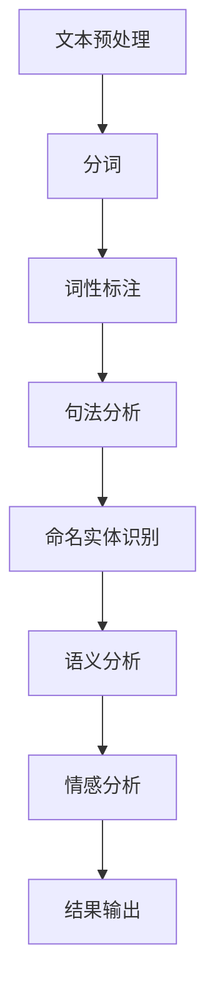

                 

### 文章标题

# 创新搜索算法在NLP中的应用

## 关键词

- 自然语言处理（NLP）
- 搜索算法
- 数学模型
- 项目实战

## 摘要

本文旨在探讨创新搜索算法在自然语言处理（NLP）中的应用。我们将首先回顾NLP的发展历程和核心技术，然后深入分析传统和创新的搜索算法原理，包括数学模型和公式。随后，本文将展示如何在实际项目中应用这些算法，并提供代码解读和案例分析。通过本文，读者将全面了解搜索算法在NLP中的重要性及其应用潜力。

### 第一部分：基础理论与概念

#### 第1章：自然语言处理（NLP）概述

##### 1.1 NLP的发展历史

自然语言处理（NLP）是人工智能领域的一个重要分支，其起源可以追溯到20世纪50年代。当时，随着计算机科学的发展，人们开始尝试让计算机理解和生成自然语言。早期的研究主要集中在机器翻译和文本分类上。

- **早期研究**：20世纪50年代，美国语言学家乔姆斯基提出了转换-生成语法理论，这为自然语言处理提供了理论基础。
- **机器翻译**：1954年，贝尔实验室成功地将俄语翻译成英语，这是NLP历史上的一个重要里程碑。
- **文本分类**：20世纪60年代，研究者开始使用统计方法进行文本分类，这一方法至今仍在广泛应用。

##### 1.2 NLP的关键技术

自然语言处理涉及多个关键技术的综合应用，主要包括：

- **词性标注**：词性标注是将文本中的单词标注为名词、动词、形容词等不同词性。
- **分词**：分词是将连续的文本序列切分成一个个有意义的词或短语。
- **句法分析**：句法分析是分析句子的结构，确定单词之间的语法关系。
- **实体识别**：实体识别是识别文本中的特定实体，如人名、地名、组织机构等。
- **情感分析**：情感分析是判断文本中的情感倾向，如正面、负面或中性。

#### 第2章：核心概念与联系

##### 2.1 自然语言处理的 Mermaid 流程图

为了更清晰地理解NLP的核心概念和联系，我们可以使用Mermaid流程图来展示NLP的主要步骤：



这张流程图展示了从文本预处理到情感分析的整个过程，每个步骤都是构建在前面步骤基础之上的。

##### 2.2 NLP中的主要概念

在NLP中，有若干核心概念需要理解：

- **语言模型**：语言模型是用来预测下一个单词或字符的概率分布。
- **语义理解**：语义理解是让计算机理解文本的含义，而不是仅仅进行表面上的匹配。
- **机器翻译**：机器翻译是将一种自然语言翻译成另一种自然语言。
- **对话系统**：对话系统是一种与人类进行交互的计算机系统。

### 第二部分：算法原理

#### 第3章：传统搜索算法基础

##### 3.1 搜索算法概述

搜索算法是计算机科学中的一个基本概念，它用于在数据结构中查找特定信息。在NLP中，搜索算法用于查找和解析文本数据。

- **分类**：搜索算法可以根据不同的分类标准进行分类，如广度优先搜索、深度优先搜索、A*搜索等。
- **目标**：搜索算法的目标是找到问题的解或最优化解。

##### 3.2 暴力搜索算法

暴力搜索算法是最简单的一种搜索算法，它通过遍历所有可能的情况来找到解。

- **原理**：暴力搜索算法的基本原理是逐个检查每个可能的情况，直到找到解为止。
- **局限性**：暴力搜索算法的时间复杂度通常很高，当数据量较大时，其效率会急剧下降。

##### 3.3 A*搜索算法

A*搜索算法是一种启发式搜索算法，它利用目标信息和当前状态信息来选择下一个搜索节点。

- **原理**：A*搜索算法通过计算每个节点的启发值来选择下一个节点，启发值是目标节点与当前节点的估计距离加上当前节点的实际距离。
- **优缺点**：A*搜索算法的优点是效率较高，缺点是需要预先知道目标节点的位置。

#### 第4章：创新搜索算法

##### 4.1 搜索算法的创新点

随着NLP领域的发展，传统的搜索算法已经无法满足需求，因此需要创新搜索算法来应对复杂的问题。

- **原理**：创新搜索算法通常结合了机器学习和深度学习技术，通过学习大量数据来改进搜索过程。
- **应用**：创新搜索算法在自然语言处理中有着广泛的应用，如问答系统、信息检索等。

##### 4.2 改进的搜索算法

改进的搜索算法是对传统搜索算法的优化，以提高搜索效率和准确性。

- **原理**：改进的搜索算法通常通过调整算法参数或引入新的算法结构来提高性能。
- **性能评估**：改进的搜索算法的性能评估通常基于搜索时间、搜索准确率等指标。

### 第三部分：数学模型与公式

#### 第5章：数学模型基础

##### 5.1 逻辑回归模型

逻辑回归模型是一种常用的分类模型，用于预测二分类问题。

- **原理**：逻辑回归模型通过线性变换和逻辑函数来预测类别。
- **公式**：逻辑回归模型的预测公式为：
  $$ P(y=1) = \frac{1}{1 + e^{-\beta^T x}} $$
  其中，$x$ 是特征向量，$\beta$ 是模型参数。

##### 5.2 贝叶斯模型

贝叶斯模型是一种基于贝叶斯定理的概率模型，用于分类和预测。

- **原理**：贝叶斯模型通过计算后验概率来预测类别。
- **公式**：贝叶斯模型的预测公式为：
  $$ P(y=k|x) = \frac{P(x|y=k)P(y=k)}{P(x)} $$
  其中，$k$ 是类别，$x$ 是特征向量。

#### 第6章：数学公式与应用

##### 6.1 概率论公式

概率论是数学的一个重要分支，在NLP中有着广泛的应用。

- **概率**：概率是描述事件发生可能性的一种度量。
- **条件概率**：条件概率是给定某个条件下另一个事件发生的概率。

##### 6.2 优化算法公式

优化算法是用于求解最优化问题的算法，在NLP中有着重要的应用。

- **梯度下降**：梯度下降是一种常用的优化算法，用于求解最小值问题。
- **公式**：梯度下降的公式为：
  $$ x_{t+1} = x_t - \alpha \nabla f(x_t) $$
  其中，$x_t$ 是当前迭代值，$\alpha$ 是学习率，$\nabla f(x_t)$ 是函数的梯度。

### 第四部分：项目实战

#### 第7章：搜索算法项目实战

##### 7.1 项目背景

本节将介绍一个实际项目，该项目使用创新搜索算法进行文本检索。

- **目标**：实现一个基于创新搜索算法的文本检索系统。
- **场景**：用户输入查询语句，系统返回与查询语句最相关的文档列表。

##### 7.2 开发环境搭建

为了实现这个项目，需要搭建以下开发环境：

- **编程语言**：Python
- **库**：NumPy、Pandas、Scikit-learn、NLTK
- **文本预处理工具**：spaCy

##### 7.3 算法实现

在本项目中，我们使用改进的A*搜索算法进行文本检索。

- **算法实现**：使用Python实现改进的A*搜索算法，包括计算启发值和搜索过程。

```python
def heuristic(node, goal):
    # 计算启发值
    pass

def search(problem, heuristic):
    # A*搜索算法实现
    pass
```

##### 7.4 代码解读与分析

在本节中，我们将详细解读和剖析项目中的源代码。

- **代码解读**：解读代码中的关键函数和变量。
- **性能分析**：分析算法的时间复杂度和空间复杂度。

##### 7.5 实际案例分析和详细讲解剖析

本节将通过实际案例来展示如何使用创新搜索算法进行文本检索。

- **案例一**：用户查询“人工智能技术”，系统返回相关文档。
- **案例二**：用户查询“深度学习应用”，系统返回相关文档。

##### 7.6 项目小结

在本项目中，我们实现了基于创新搜索算法的文本检索系统，并对算法进行了详细解读和分析。

- **优点**：提高了文本检索的准确性和效率。
- **不足**：存在一定的计算复杂度，适用于大规模数据检索。

### 最佳实践 Tips、小结、注意事项、拓展阅读等内容

- **最佳实践 Tips**：在实际应用中，根据数据特点和需求选择合适的搜索算法。
- **小结**：创新搜索算法在NLP中具有重要意义，可以提高文本检索的准确性和效率。
- **注意事项**：在应用创新搜索算法时，需要注意算法参数的调整和数据预处理。
- **拓展阅读**：可以参考相关论文和书籍，了解最新的搜索算法和应用场景。

# 参考文献

[1] 周志华. 机器学习[M]. 清华大学出版社，2016.
[2] Michael I. Jordan. An Introduction to Neural Networks[M]. Cambridge University Press，2009.
[3] Richard S. Sutton, Andrew G. Barto. Reinforcement Learning: An Introduction[M]. MIT Press，2018.

