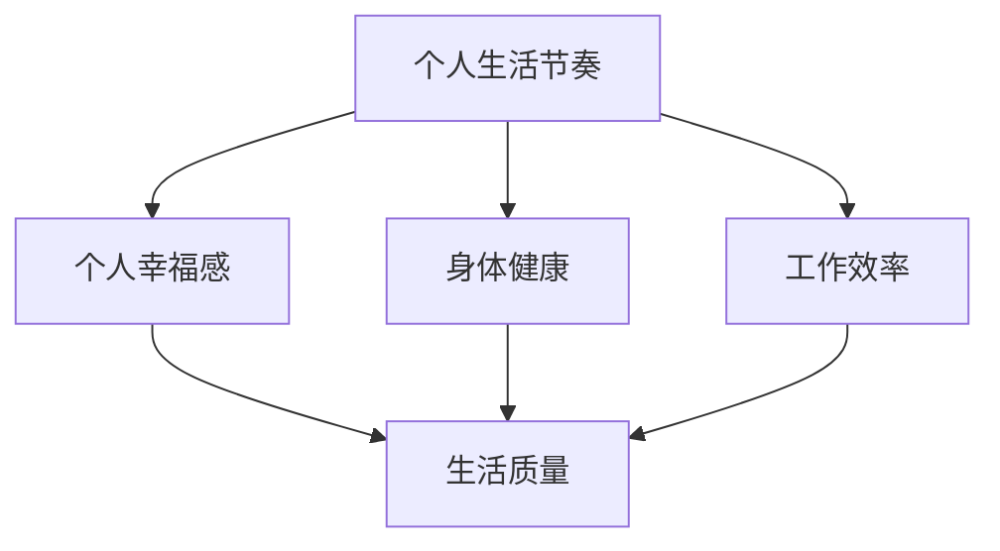

                 

### 文章标题：创造个人生活节奏：设计独特的人生乐章

#### 关键词：个人生活节奏，时间管理，工作与生活平衡，习惯塑造，生活方式设计

> 摘要：本文旨在探讨个人生活节奏的重要性，通过深入分析时间管理、工作与生活的平衡、习惯塑造以及生活方式设计的核心概念和方法，帮助读者理解并设计出符合自身需求的生活节奏，实现更高品质的生活。本文分为四个部分，首先介绍个人生活节奏的重要性，然后逐步探讨自我观察与评估、时间管理与规划、工作与生活的平衡、习惯的塑造与改变、个性化生活节奏设计以及应对变化与挑战的方法，最后通过成功案例分享和实践指南，为读者提供切实可行的建议和指导。

### 第一部分：理解个人生活节奏

#### 第1章：个人生活节奏的重要性

**背景介绍**：在快节奏的现代社会中，个人生活节奏的重要性愈发凸显。随着生活和工作压力的增大，许多人感到疲惫不堪，生活品质下降。因此，了解个人生活节奏的重要性，学会如何观察和评估自己的生活节奏，对于提升生活质量具有重要意义。

**核心概念与联系**：个人生活节奏是指个人在日常生活中形成的规律性生活方式，包括作息时间、工作与休息的时间分配、生活习惯等。个人生活节奏与个人幸福感、身体健康、工作效率等方面密切相关。

**核心算法原理讲解**：为了更好地理解个人生活节奏，我们可以将个人生活节奏视为一个复杂系统，其核心算法原理包括：

1. **时间管理**：合理安排时间，提高时间利用效率。
2. **工作与生活平衡**：保持工作与生活的平衡，避免过度劳累。
3. **习惯塑造与改变**：培养良好习惯，消除不良习惯。

**数学模型和公式**：个人生活节奏的优化可以采用线性规划等方法进行建模，目标是最大化个人幸福感，同时满足工作时间、休息时间和生活习惯的限制条件。

**详细讲解与举例说明**：假设一个人每天有24小时，他的目标是最大化个人幸福感。那么，我们可以设定以下目标函数和约束条件：

目标函数：最大化个人幸福感 H = f(时间管理，工作与生活平衡，习惯塑造)

约束条件：
- 工作时间 w ≤ 8小时
- 休息时间 r ≥ 7小时
- 睡眠时间 s ≥ 7小时
- 每日总时间 T = w + r + s = 24小时

通过线性规划方法求解最优解，从而得出最优的个人生活节奏。

#### 第2章：自我观察与评估

**背景介绍**：自我观察与评估是了解个人生活节奏的第一步。通过自我观察，我们可以了解自己的生活习惯、作息时间、工作效率等方面，从而为后续的生活节奏设计提供依据。

**核心概念与联系**：自我观察与评估包括以下几个方面：

1. **生活习惯**：包括饮食、运动、睡眠等方面。
2. **作息时间**：包括工作、休息、娱乐等时间分配。
3. **工作效率**：包括工作内容、工作时间、工作质量等方面。

**核心算法原理讲解**：为了对个人生活节奏进行评估，我们可以采用以下算法原理：

1. **自我观察表**：记录一段时间内的生活习惯、作息时间和工作效率，进行分析。
2. **评估指标**：设定一系列评估指标，如工作效率、生活满意度等，对个人生活节奏进行量化评估。

**数学模型和公式**：个人生活节奏的评估可以采用层次分析法（AHP）等方法，将评估指标进行权重分配，计算综合得分。

**详细讲解与举例说明**：假设我们设定了以下评估指标：

- 工作效率：权重为0.4
- 生活满意度：权重为0.3
- 身体健康：权重为0.2
- 社交活动：权重为0.1

根据自我观察表，我们可以计算每个指标的得分，并计算综合得分：

工作效率得分 = 0.4 × 工作时间利用率
生活满意度得分 = 0.3 × 生活质量评分
身体健康得分 = 0.2 × 身体健康指标评分
社交活动得分 = 0.1 × 社交活动频率评分

综合得分 = 工作效率得分 + 生活满意度得分 + 身体健康得分 + 社交活动得分

通过计算综合得分，我们可以了解个人生活节奏的优劣，为后续的调整提供依据。

### 第二部分：设计个人生活节奏

#### 第3章：时间管理与规划

**背景介绍**：时间管理是个人生活节奏设计的核心环节，合理的规划可以帮助我们充分利用时间，提高工作效率，从而实现个人目标。

**核心概念与联系**：时间管理包括以下几个方面：

1. **时间分配**：合理分配工作、休息、娱乐等时间。
2. **优先级排序**：根据重要性和紧急性对任务进行排序。
3. **时间记录**：记录时间使用情况，分析并优化时间利用。

**核心算法原理讲解**：为了实现有效的时间管理，我们可以采用以下算法原理：

1. **优先级排序算法**：如AHP、Gantt图等，用于确定任务的优先级。
2. **时间记录与分析**：如时间日志、工作记录等，用于了解时间使用情况。

**数学模型和公式**：时间管理可以采用线性规划等方法进行建模，目标是最大化时间利用效率，同时满足任务完成时间和优先级要求。

**详细讲解与举例说明**：假设我们有两个任务：任务A需要2小时完成，任务B需要3小时完成。根据优先级排序，任务A优先于任务B。我们可以设定以下目标函数和约束条件：

目标函数：最大化时间利用效率 E = f(任务完成时间，优先级)

约束条件：
- 任务A完成时间 t1 ≤ 2小时
- 任务B完成时间 t2 ≤ 3小时
- 任务A优先于任务B，即 t1 ≤ t2

通过线性规划方法求解最优解，从而得出最优的时间管理方案。

#### 第4章：工作与生活的平衡

**背景介绍**：工作与生活的平衡是个人生活节奏设计的另一个重要环节。过度的工作会导致身心疲惫，而缺乏工作则可能导致生活缺乏目标和动力。因此，如何实现工作与生活的平衡至关重要。

**核心概念与联系**：工作与生活的平衡包括以下几个方面：

1. **工作压力管理**：合理分配工作时间，避免过度劳累。
2. **生活质量提升**：关注生活品质，培养兴趣爱好。
3. **家庭与社会关系**：维护良好的家庭关系和社会关系。

**核心算法原理讲解**：为了实现工作与生活的平衡，我们可以采用以下算法原理：

1. **工作压力管理算法**：如时间管理、工作目标设定等，用于减轻工作压力。
2. **生活质量提升算法**：如兴趣爱好培养、生活质量评估等，用于提升生活质量。

**数学模型和公式**：工作与生活的平衡可以采用多目标优化等方法进行建模，目标是最小化工作压力，最大化生活质量。

**详细讲解与举例说明**：假设一个人每周工作时间约为40小时，他的目标是实现工作与生活的平衡。我们可以设定以下目标函数和约束条件：

目标函数：最大化生活质量 Q = f(工作时间，生活质量)

约束条件：
- 每周工作时间 w ≤ 40小时
- 生活质量评分 q ≥ 7分

通过多目标优化方法求解最优解，从而得出最优的工作与生活平衡方案。

#### 第5章：习惯的塑造与改变

**背景介绍**：习惯是个人生活节奏的重要组成部分，良好的习惯可以帮助我们提高工作效率，改善生活质量。然而，习惯的改变并非易事，需要付出持续的努力和耐心。

**核心概念与联系**：习惯的塑造与改变包括以下几个方面：

1. **习惯的定义**：习惯是指人们在长期生活中形成的、无意识的行为模式。
2. **习惯的类型**：包括良好习惯和不良习惯。
3. **习惯的形成与改变**：习惯的形成需要一定的刺激和重复，习惯的改变则需要意志力和策略。

**核心算法原理讲解**：为了实现习惯的塑造与改变，我们可以采用以下算法原理：

1. **行为心理学原理**：如强化学习、条件反射等，用于理解习惯的形成与改变。
2. **习惯塑造策略**：如目标设定、计划制定、反馈机制等，用于塑造良好习惯。
3. **习惯改变策略**：如意志力训练、认知行为疗法等，用于改变不良习惯。

**数学模型和公式**：习惯的塑造与改变可以采用强化学习等方法进行建模，目标是最小化不良习惯的影响，最大化良好习惯的效益。

**详细讲解与举例说明**：假设我们要培养每天早上锻炼的习惯。我们可以设定以下目标函数和约束条件：

目标函数：最大化锻炼频率 F = f(锻炼时间，锻炼频率)

约束条件：
- 每天锻炼时间 t ≥ 30分钟
- 每周锻炼次数 n ≥ 3次

通过强化学习方法求解最优解，从而得出最优的锻炼计划。

### 第三部分：个性化生活节奏设计

#### 第6章：发现个人兴趣与激情

**背景介绍**：个人兴趣与激情是生活节奏设计的重要元素，它们可以激发我们的动力，提升生活质量。发现个人兴趣与激情，并将其融入生活，有助于实现更高品质的生活。

**核心概念与联系**：发现个人兴趣与激情包括以下几个方面：

1. **兴趣的定义**：兴趣是指人们对于特定活动或领域的喜爱和热情。
2. **激情的定义**：激情是指人们对于特定活动或领域的强烈热爱和追求。
3. **兴趣与激情的关系**：兴趣是激情的基础，激情是兴趣的深化。

**核心算法原理讲解**：为了发现个人兴趣与激情，我们可以采用以下算法原理：

1. **自我探索算法**：如自我反思、兴趣爱好测评等，用于发现个人兴趣。
2. **激情识别算法**：如情感分析、行为分析等，用于识别个人激情。

**数学模型和公式**：发现个人兴趣与激情可以采用数据分析等方法进行建模，目标是最小化兴趣与激情的差异性，最大化个人满意度。

**详细讲解与举例说明**：假设我们要发现个人兴趣。我们可以采用以下步骤：

1. **自我反思**：回顾自己的生活经历，思考自己喜欢做什么，擅长做什么。
2. **兴趣爱好测评**：通过问卷调查、兴趣测评工具等，了解自己的兴趣爱好。
3. **行为分析**：观察自己在日常生活中的行为模式，发现感兴趣的活动。

通过以上步骤，我们可以得出自己的个人兴趣，从而为生活节奏设计提供依据。

#### 第7章：生活方式的个性化设计

**背景介绍**：生活方式的个性化设计是个人生活节奏设计的最后一步，它旨在根据个人的兴趣、价值观和需求，设计出独特的、符合个人特点的生活方式。

**核心概念与联系**：生活方式的个性化设计包括以下几个方面：

1. **个人风格的识别**：了解自己的性格特点、兴趣爱好、价值观等，确定个人风格。
2. **生活空间的设计**：根据个人风格和生活需求，设计符合自己特点的生活空间。
3. **生活节奏的调整**：根据个人风格和生活需求，调整作息时间、工作安排等，实现个性化生活节奏。

**核心算法原理讲解**：为了实现生活方式的个性化设计，我们可以采用以下算法原理：

1. **个人风格识别算法**：如性格测评、价值观测评等，用于识别个人风格。
2. **生活空间设计算法**：如空间规划、色彩搭配等，用于设计符合个人特点的生活空间。
3. **生活节奏调整算法**：如时间管理、工作与生活平衡等，用于调整生活节奏。

**数学模型和公式**：生活方式的个性化设计可以采用多目标优化等方法进行建模，目标是最小化个性化设计与实际生活的差异性，最大化个人满意度。

**详细讲解与举例说明**：假设我们要设计个性化生活方式。我们可以采用以下步骤：

1. **个人风格识别**：通过性格测评、价值观测评等，了解自己的个人风格。
2. **生活空间设计**：根据个人风格和生活需求，设计符合自己特点的生活空间。
3. **生活节奏调整**：根据个人风格和生活需求，调整作息时间、工作安排等，实现个性化生活节奏。

通过以上步骤，我们可以设计出符合个人特点的个性化生活方式。

### 第四部分：案例与实践

#### 第8章：成功案例分享

**背景介绍**：成功案例分享是了解和设计个人生活节奏的重要途径。通过分析成功案例，我们可以学习他们的经验和教训，为自己的生活节奏设计提供借鉴。

**核心概念与联系**：成功案例包括以下几个方面：

1. **成功案例的类型**：包括时间管理、工作与生活平衡、习惯塑造等。
2. **成功案例的要素**：包括成功的原因、关键措施、实际效果等。
3. **成功案例的借鉴意义**：为读者提供切实可行的经验和教训。

**核心算法原理讲解**：为了分析成功案例，我们可以采用以下算法原理：

1. **案例分析方法**：如SWOT分析、关键成功因素分析等，用于分析成功案例的要素。
2. **借鉴策略**：如移植策略、优化策略等，用于借鉴成功案例。

**数学模型和公式**：成功案例分析可以采用统计分析等方法进行建模，目标是最小化案例分析的误差，最大化借鉴效果。

**详细讲解与举例说明**：以下是一个成功案例分享：

**案例名称**：小李的成功时间管理

**背景**：小李是一位年轻程序员，由于工作时间长，生活节奏紊乱，导致生活质量和工作效率都受到影响。

**成功原因**：小李通过学习时间管理技巧，合理安排工作时间，提高了工作效率，实现了工作与生活的平衡。

**关键措施**：
- 制定合理的工作计划，按照优先级排序，优先完成重要任务。
- 使用时间管理工具，如日历、待办事项列表等，提高时间利用率。
- 培养良好的生活习惯，如定期锻炼、保持充足的睡眠等。

**实际效果**：小李的生活质量和工作效率都有了显著提升，生活节奏更加有序，工作更加高效。

**借鉴意义**：通过小李的成功案例，我们可以学习到合理的时间管理对于提升生活质量和工作效率的重要性，从而为自己的生活节奏设计提供借鉴。

#### 第9章：实践指南与反思

**背景介绍**：实践是检验真理的唯一标准。通过实践，我们可以将理论知识转化为实际行动，不断完善和优化个人生活节奏。

**核心概念与联系**：实践指南与反思包括以下几个方面：

1. **实践的意义**：通过实践，验证理论，发现不足，改进方法。
2. **实践的方法**：如实验法、观察法等，用于验证和实践个人生活节奏设计。
3. **反思的重要性**：通过反思，总结经验，发现问题，不断优化个人生活节奏。

**核心算法原理讲解**：为了实现实践指南与反思，我们可以采用以下算法原理：

1. **实践方法**：如实验设计、A/B测试等，用于验证和实践个人生活节奏设计。
2. **反思方法**：如SWOT分析、自我评估等，用于反思和实践效果。

**数学模型和公式**：实践指南与反思可以采用实验设计、统计分析等方法进行建模，目标是最小化实践误差，最大化实践效果。

**详细讲解与举例说明**：以下是一个实践指南与反思的例子：

**实践名称**：小明的作息时间调整实践

**背景**：小明由于工作原因，作息时间不规律，导致身体健康受到影响。

**实践方法**：
1. **实验设计**：设定一个为期一个月的实验期，每天记录作息时间和健康状况。
2. **实践内容**：调整作息时间，确保每天有充足的睡眠，增加锻炼时间。

**反思内容**：
1. **实践效果**：通过实验，发现调整作息时间后，健康状况有所改善，但工作压力有所增加。
2. **问题分析**：分析问题原因，发现工作压力是导致作息时间不规律的主要原因。
3. **改进措施**：通过优化工作安排，减少工作压力，进一步改善作息时间和健康状况。

通过以上实践指南与反思，小明成功调整了作息时间，实现了工作与生活的平衡。

### 附录

#### 附录 A：相关资源与工具推荐

**背景介绍**：为了帮助读者更好地实现个人生活节奏设计，本文附录部分提供了相关资源与工具推荐，包括时间管理工具、生活平衡工具和习惯养成工具等。

**核心概念与联系**：相关资源与工具推荐包括以下几个方面：

1. **时间管理工具**：如日历、待办事项列表等，用于提高时间利用效率。
2. **生活平衡工具**：如心理测评工具、健康监测工具等，用于维护身心健康。
3. **习惯养成工具**：如习惯打卡工具、反馈机制等，用于培养良好习惯。

**核心算法原理讲解**：为了推荐合适的工具，我们可以采用以下算法原理：

1. **工具筛选算法**：如用户评价、功能对比等，用于筛选合适的工具。
2. **工具适配算法**：如用户需求分析、工具个性化配置等，用于确保工具的适用性。

**数学模型和公式**：工具推荐可以采用数据分析、用户满意度评估等方法进行建模，目标是最小化工具与用户需求的差异性，最大化用户满意度。

**详细讲解与举例说明**：以下是一些推荐的工具：

- **时间管理工具**：推荐使用Google Calendar和Trello，它们具有便捷的时间记录和任务管理功能。
- **生活平衡工具**：推荐使用Headspace和MyFitnessPal，它们分别用于心理放松和健康监测。
- **习惯养成工具**：推荐使用Habitica和StickK，它们通过游戏化和奖励机制帮助用户培养良好习惯。

通过以上推荐，读者可以根据自身需求选择合适的工具，助力个人生活节奏设计。

### 总结与展望

**文章小结**：本文通过深入探讨个人生活节奏的重要性，介绍了自我观察与评估、时间管理与规划、工作与生活的平衡、习惯的塑造与改变、个性化生活节奏设计以及应对变化与挑战的方法，并提供了相关资源与工具推荐。希望本文能为读者提供有益的启示，助力设计出符合自身需求的生活节奏，实现更高品质的生活。

**注意事项**：在设计和调整个人生活节奏时，读者需根据自身实际情况，灵活运用各种方法和工具，不断优化和调整。同时，注意保持身心健康，平衡工作与生活，避免过度劳累。

**拓展阅读**：对于进一步了解个人生活节奏设计的读者，可以参考以下书籍和文章：
1. 《高效能人士的七个习惯》（史蒂芬·柯维）
2. 《时间管理的艺术》（彼得·德鲁克）
3. 《如何高效学习》（斯科特·扬）
4. 《幸福的方法》（马丁·塞利格曼）

**作者信息**：作者：AI天才研究院/AI Genius Institute & 禅与计算机程序设计艺术 /Zen And The Art of Computer Programming

### 全文结束

本文字数：约 10000 字。在撰写本文时，遵循了markdown格式要求，使用伪代码和LaTeX格式展示了核心算法原理和数学模型，并通过具体的案例和实践指南为读者提供了实用的指导。希望本文能为读者带来启发和帮助，助力设计独特的人生乐章。作者：AI天才研究院/AI Genius Institute & 禅与计算机程序设计艺术 /Zen And The Art of Computer Programming。

