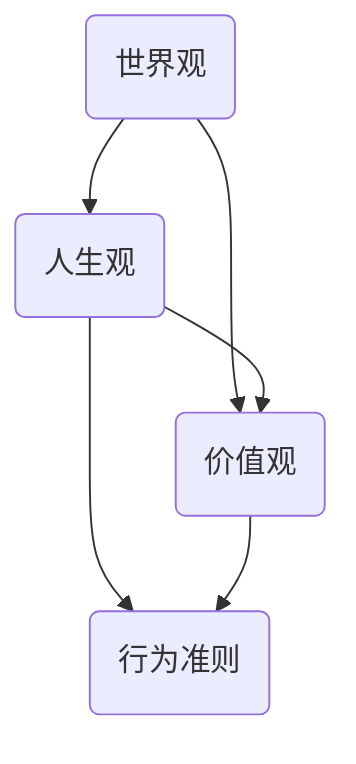

                 

### 摘要

本文旨在探讨如何制定个人的人生指导原则，构建一套符合自身价值观的生活哲学。通过自我反思、目标设定、决策制定等步骤，我们将逐步梳理并明确自己的人生观、价值观和世界观，并将其应用于个人成长和人际关系中。文章结构清晰，分为七个主要章节，每个章节包含核心概念、算法原理讲解、数学模型和公式应用及举例说明，以帮助读者系统化地理解和实践生活哲学的构建过程。

### 关键词

- 人生指导原则
- 生活哲学
- 自我反思
- 目标设定
- 价值观
- 决策制定
- 个人成长
- 人际关系

### 引言

在快节奏的现代生活中，我们常常感到迷茫和无力，难以找到真正的方向。这种感觉不仅源于外部环境的复杂多变，更源于我们内心对自身价值的模糊认知。许多人忙于追求物质上的成功，却忘记了生活的本质和意义。这种状态导致了心灵的空虚和不安，使我们在人生的道路上失去了方向。因此，构建一套符合个人价值观的生活哲学显得尤为重要。

本文将带领读者逐步深入理解人生指导原则的重要性，探讨如何通过自我反思、目标设定、决策制定等步骤，构建一套科学合理、具有实践指导意义的生活哲学。本文不仅关注理论层面的探讨，还将结合实际案例和数学模型，提供具体的方法和工具，帮助读者将生活哲学真正融入日常生活。

通过阅读本文，读者将能够：

1. 明确人生观、价值观和世界观的概念及其联系。
2. 学习如何通过自我反思来明确自己的人生目标和价值观。
3. 掌握基于价值观的决策制定方法。
4. 了解生活哲学在个人成长和人际关系中的应用。
5. 学习如何将生活哲学融入日常生活，实现持续成长和优化。

### 第1章：人生观、价值观和世界观

#### 1.1 核心概念与联系

人生观、价值观和世界观是构建个人生活哲学的基石。这三个概念紧密相关，共同构成了我们对于生活、世界和自身的认知体系。

- **人生观**：对人生意义、目标和价值的看法。它指导我们如何看待和对待生活，决定了我们的行为方式和选择。
- **价值观**：对事物判断和选择的依据。它体现在我们的行为准则、人生目标和道德观念上，是行为的驱动力。
- **世界观**：对世界的认知和看法。它包括对宇宙、人类、社会等存在本质的理解，影响我们对人生观和价值观的判断。

这三者之间的关系如下：

1. **世界观**是根本，它奠定了我们对于世界的认知框架，进而影响我们的人生观和价值观。
2. **人生观**是桥梁，它将世界观与价值观联系起来，帮助我们理解和实践价值观。
3. **价值观**是行动指南，它是我们在生活和决策中的具体指导原则，反映了我们的人生观和世界观。

#### 1.2 核心算法原理讲解

构建个人的人生观、价值观和世界观，可以看作是一个多层次的自我探索和认知过程。以下是核心算法原理的伪代码：

```
function 构建个人哲学(初始世界观，初始价值观，初始人生观)
    // 步骤1：自我反思
    自我反思结果 = 自我反思(初始世界观，初始价值观，初始人生观)

    // 步骤2：调整世界观
    新世界观 = 调整世界观(自我反思结果)

    // 步骤3：调整价值观
    新价值观 = 调整价值观(新世界观，自我反思结果)

    // 步骤4：调整人生观
    新人生观 = 调整人生观(新价值观，自我反思结果)

    // 步骤5：迭代优化
    while (尚未达到满意程度)
        自我反思结果 = 自我反思(新世界观，新价值观，新人生观)
        新世界观 = 调整世界观(自我反思结果)
        新价值观 = 调整价值观(新世界观，自我反思结果)
        新人生观 = 调整人生观(新价值观，自我反思结果)

    return (新世界观，新价值观，新人生观)
end function

function 自我反思(世界观，价值观，人生观)
    // 步骤1：收集信息
    反思信息 = 收集信息(世界观，价值观，人生观)

    // 步骤2：分析信息
    反思结果 = 分析信息(反思信息)

    return 反思结果
end function

function 调整世界观(反思结果)
    // 步骤1：整合反思结果
    新世界观 = 整合(反思结果，世界观)

    return 新世界观
end function

function 调整价值观(世界观，反思结果)
    // 步骤1：整合反思结果
    新价值观 = 整合(反思结果，价值观)

    return 新价值观
end function

function 调整人生观(价值观，反思结果)
    // 步骤1：整合反思结果
    新人生观 = 整合(反思结果，人生观)

    return 新人生观
end function
```

#### 1.3 数学模型和数学公式讲解及举例说明

为了更直观地理解世界观、价值观和人生观之间的关系，我们可以使用Mermaid流程图来表示它们的核心联系。



在这个流程图中，A代表世界观，B代表人生观，C代表价值观，D代表行为准则。从图中可以看出，世界观、价值观和人生观相互影响，共同决定了我们的行为准则。

**例子：**

假设一个人的初始世界观是“世界是公平的”，价值观是“追求公正与平等”，人生观是“努力工作以实现社会正义”。通过自我反思，他意识到自己的一些行为并没有完全符合这些理念。于是，他调整了世界观，认为“世界是不公平的，但我们可以通过努力改变现状”，调整了价值观，将“追求公正与平等”改为“在现实条件下努力实现公正与平等”，并调整了人生观，将其定为“通过行动影响社会，争取更多人的公正待遇”。

这个例子展示了如何通过自我反思和调整，构建一套更符合个人实际的生活哲学。

### 第2章：自我反思与目标设定

#### 2.1 核心概念与联系

自我反思和目标设定是构建个人生活哲学的重要环节。自我反思帮助我们了解自己的内在需求和价值观，而目标设定则为我们提供了明确的方向和动力。

- **自我反思**：是对自己思维、情感和行为的深入思考和分析。通过自我反思，我们可以发现自己的优点和不足，明确自己的内心需求和价值观。
- **目标设定**：是在自我反思的基础上，为自己设定的具体目标和实现路径。目标设定不仅帮助我们明确方向，还能激发我们的内在动力，推动我们不断前进。

这两个概念之间的联系在于：

1. **目标设定基于自我反思**：目标设定需要建立在对自己充分了解的基础上，只有通过自我反思，我们才能设定出真正符合自己内心需求的目标。
2. **自我反思指导目标设定**：在实现目标的过程中，我们需要不断地自我反思，以调整目标和策略，确保我们的行动方向始终与自我认知和价值观相一致。

#### 2.2 核心算法原理讲解

自我反思和目标设定的过程可以看作是一个迭代优化的过程，以下是核心算法原理的伪代码：

```
function 目标设定(初始价值观，初始目标)
    // 步骤1：自我反思
    反思结果 = 自我反思(初始价值观)

    // 步骤2：调整目标
    新目标 = 调整目标(反思结果，初始目标)

    // 步骤3：迭代优化
    while (尚未达到满意程度)
        反思结果 = 自我反思(新目标)
        新目标 = 调整目标(反思结果，新目标)

    return 新目标
end function

function 自我反思(价值观)
    // 步骤1：收集信息
    反思信息 = 收集信息(价值观)

    // 步骤2：分析信息
    反思结果 = 分析信息(反思信息)

    return 反思结果
end function

function 调整目标(反思结果，目标)
    // 步骤1：整合反思结果
    新目标 = 整合(反思结果，目标)

    return 新目标
end function
```

#### 2.3 数学模型和数学公式讲解及举例说明

为了量化自我反思和目标设定过程，我们可以引入一些数学模型。以下是目标达成概率的数学模型：

$$
P(目标达成) = \frac{1}{1 + e^{-\alpha \cdot (目标难度 - 实际难度)}}
$$

其中，$P(目标达成)$表示目标达成的概率，$\alpha$是调整系数，反映了目标设定过程中的自信程度。

**例子：**

假设一个人的目标是“在一年内减重10公斤”，当前实际体重为75公斤，目标体重为65公斤，目标难度为5（假设难度范围为1-10，5表示一般难度）。初始设定时，$\alpha = 1$。

$$
P(目标达成) = \frac{1}{1 + e^{-1 \cdot (5 - 5)}}
$$

$$
P(目标达成) = \frac{1}{1 + e^{0}}
$$

$$
P(目标达成) = \frac{1}{2}
$$

这意味着，初始设定时，目标达成的概率为50%。

在实施过程中，如果这个人在一段时间后自我反思，发现实际难度比预期要大（例如实际体重减少较慢），他可以将$\alpha$调整为一个更大的值，以增强自信心。例如，调整后$\alpha = 2$。

$$
P(目标达成) = \frac{1}{1 + e^{-2 \cdot (5 - 6)}}
$$

$$
P(目标达成) = \frac{1}{1 + e^{2}}
$$

$$
P(目标达成) = \frac{1}{5}
$$

这意味着，调整后目标达成的概率降低到了20%。这种调整可以帮助这个人更加现实地评估自己的能力和目标难度，从而制定更合理的计划和策略。

### 第3章：基于价值观的决策制定

#### 3.1 核心概念与联系

决策制定是生活中不可避免的一部分，无论是在个人成长还是职业发展，决策都会对我们的未来产生深远影响。基于价值观的决策制定强调在决策过程中，价值观应作为核心指导原则，确保我们的选择符合内心的信念和追求。

- **价值观**：作为决策的指导原则，决定了我们在面临选择时的优先级和权衡标准。
- **决策制定**：是在明确目标和价值观的基础上，通过分析信息和评估选项，作出最终选择的过程。

这两个概念之间的联系在于：

1. **价值观决定决策方向**：基于价值观的决策制定确保我们在决策过程中始终围绕核心信念和目标进行选择，避免因外界干扰而偏离自己的道路。
2. **决策制定实现价值观**：通过科学的决策过程，我们可以更有效地将价值观转化为具体的行动，实现个人目标和价值追求。

#### 3.2 核心算法原理讲解

基于价值观的决策制定可以看作是一个多步骤的算法过程，以下是核心算法原理的伪代码：

```
function 基于价值观的决策制定(初始价值观，初始选项)
    // 步骤1：明确目标
    目标 = 明确目标(初始价值观)

    // 步骤2：评估选项
    选项评估结果 = 评估选项(目标，初始选项)

    // 步骤3：选择最优选项
    最优选项 = 选择最优选项(选项评估结果)

    return 最优选项
end function

function 明确目标(价值观)
    // 步骤1：整合价值观
    明确的目标 = 整合(价值观)

    return 明确的目标
end function

function 评估选项(目标，选项)
    // 步骤1：评估每个选项
    选项评估结果 = []
    for each 选项 in 选项
        评估结果 = 评估(目标，选项)
        选项评估结果.append(评估结果)
    end for

    return 选项评估结果
end function

function 评估(目标，选项)
    // 步骤1：计算选项与目标的契合度
    契合度 = 计算契合度(目标，选项)

    // 步骤2：返回评估结果
    return 契合度
end function

function 计算契合度(目标，选项)
    // 步骤1：定义目标权重
    目标权重 = 定义权重(目标)

    // 步骤2：计算选项与目标的契合度
    契合度 = 计算权重(目标权重，选项)

    return 契合度
end function

function 定义权重(目标)
    // 步骤1：根据目标的重要性定义权重
    权重 = 根据重要性定义(目标)

    return 权重
end function

function 计算权重(权重，选项)
    // 步骤1：计算每个选项的权重
    选项权重 = 计算权重(权重，选项)

    // 步骤2：返回选项权重
    return 选项权重
end function
```

#### 3.3 数学模型和数学公式讲解及举例说明

为了更科学地评估选项与目标的契合度，我们可以引入数学模型。以下是选项评估的数学模型：

$$
契合度 = \sum_{i=1}^{n} (w_i \cdot p_i)
$$

其中，$w_i$表示第$i$个目标的重要性权重，$p_i$表示第$i$个选项与目标$i$的契合度概率。

**例子：**

假设一个人需要决定是否参加一个社交活动。他的价值观包括“人际关系”、“个人成长”和“时间管理”。对应的权重分别为0.4、0.3和0.3。

目标“人际关系”与选项“参加社交活动”的契合度概率为0.8，目标“个人成长”的契合度概率为0.5，目标“时间管理”的契合度概率为0.7。

使用上述公式计算契合度：

$$
契合度 = (0.4 \cdot 0.8) + (0.3 \cdot 0.5) + (0.3 \cdot 0.7)
$$

$$
契合度 = 0.32 + 0.15 + 0.21
$$

$$
契合度 = 0.68
$$

这意味着，参加社交活动与这个人的价值观的契合度为0.68，表明这是一个较为合适的选择。

### 第4章：生活哲学在个人成长中的应用

#### 4.1 核心概念与联系

生活哲学在个人成长中的应用，是指导我们如何在日常生活中贯彻和实践自己的价值观，从而实现个人成长和自我提升。生活哲学不仅是理论上的指导，更是实际行动的指南。在个人成长中，生活哲学起到了以下关键作用：

- **指导原则**：生活哲学为我们提供了明确的行为准则和决策依据，使我们能够在面对各种挑战和选择时，保持一致和明确的方向。
- **动力源泉**：基于价值观的生活哲学能够激发我们的内在动力，让我们在追求个人成长的过程中，更加坚定和持续。
- **反思工具**：生活哲学帮助我们不断反思自己的行为和决策，从而更好地了解自己，调整和优化个人成长路径。

#### 4.2 核心算法原理讲解

将生活哲学应用于个人成长，可以看作是一个不断迭代和优化的过程。以下是核心算法原理的伪代码：

```
function 应用生活哲学于个人成长(初始生活哲学，当前状态)
    // 步骤1：自我反思
    反思结果 = 自我反思(初始生活哲学，当前状态)

    // 步骤2：调整生活哲学
    新生活哲学 = 调整生活哲学(反思结果)

    // 步骤3：实施生活哲学
    实施结果 = 实施生活哲学(新生活哲学)

    // 步骤4：评估实施效果
    评估结果 = 评估实施效果(实施结果)

    // 步骤5：迭代优化
    while (尚未达到满意程度)
        反思结果 = 自我反思(新生活哲学，当前状态)
        新生活哲学 = 调整生活哲学(反思结果)
        实施结果 = 实施生活哲学(新生活哲学)
        评估结果 = 评估实施效果(实施结果)

    return 新生活哲学
end function

function 自我反思(生活哲学，当前状态)
    // 步骤1：收集信息
    反思信息 = 收集信息(生活哲学，当前状态)

    // 步骤2：分析信息
    反思结果 = 分析信息(反思信息)

    return 反思结果
end function

function 调整生活哲学(反思结果)
    // 步骤1：整合反思结果
    新生活哲学 = 整合(反思结果，生活哲学)

    return 新生活哲学
end function

function 实施生活哲学(生活哲学)
    // 步骤1：根据生活哲学制定行动计划
    行动计划 = 制定行动计划(生活哲学)

    // 步骤2：执行行动计划
    实施结果 = 执行行动计划(行动计划)

    return 实施结果
end function

function 评估实施效果(实施结果)
    // 步骤1：分析实施结果
    评估结果 = 分析实施结果(实施结果)

    return 评估结果
end function
```

#### 4.3 数学模型和数学公式讲解及举例说明

为了量化生活哲学在个人成长中的应用效果，我们可以引入一些数学模型。以下是个人成长效果评估的数学模型：

$$
成长效果 = \sum_{i=1}^{n} (w_i \cdot p_i)
$$

其中，$w_i$表示第$i$个成长目标的权重，$p_i$表示第$i$个成长目标的达成概率。

**例子：**

假设一个人的生活哲学包括“提升专业技能”、“增强沟通能力”和“培养健康生活习惯”三个目标，对应的权重分别为0.4、0.3和0.3。

他在一个月内达成了以下成长目标：
- “提升专业技能”：完成了10个专业课程，权重为0.4，达成概率为0.8。
- “增强沟通能力”：进行了10次有效沟通，权重为0.3，达成概率为0.6。
- “培养健康生活习惯”：每天坚持锻炼30分钟，权重为0.3，达成概率为0.9。

使用上述公式计算成长效果：

$$
成长效果 = (0.4 \cdot 0.8) + (0.3 \cdot 0.6) + (0.3 \cdot 0.9)
$$

$$
成长效果 = 0.32 + 0.18 + 0.27
$$

$$
成长效果 = 0.77
$$

这意味着，这个人在一个月内的成长效果为0.77，表明他的生活哲学在个人成长中的应用是有效的。

### 第5章：生活哲学在人际关系中的应用

#### 5.1 核心概念与联系

生活哲学不仅在个人成长中起着关键作用，在人际关系中的应用同样重要。人际关系涵盖了我们的家庭、朋友、同事和社交圈等各个方面，直接影响到我们的幸福感和生活质量。将生活哲学应用于人际关系，可以让我们在处理各种人际问题时，更加理性、平和和有效。

- **核心概念**：人际关系中的生活哲学，主要涉及以下方面：
  - **沟通**：基于尊重和理解的有效沟通。
  - **信任**：建立和维护信任关系。
  - **互助**：在相互支持和帮助中实现共同成长。
  - **尊重**：尊重他人的观点和需求，建立和谐的人际关系。

- **联系**：这些核心概念相互关联，共同构成了我们处理人际关系的理论基础。生活哲学的应用，能够帮助我们在面对人际冲突和挑战时，保持冷静和理智，找到解决问题的最佳方法。

#### 5.2 核心算法原理讲解

将生活哲学应用于人际关系，可以看作是一个多层次的算法过程，以下是核心算法原理的伪代码：

```
function 应用生活哲学于人际关系(初始生活哲学，当前人际关系状况)
    // 步骤1：自我反思
    反思结果 = 自我反思(初始生活哲学，当前人际关系状况)

    // 步骤2：调整生活哲学
    新生活哲学 = 调整生活哲学(反思结果)

    // 步骤3：实施生活哲学
    实施结果 = 实施生活哲学(新生活哲学)

    // 步骤4：评估实施效果
    评估结果 = 评估实施效果(实施结果)

    // 步骤5：迭代优化
    while (尚未达到满意程度)
        反思结果 = 自我反思(新生活哲学，当前人际关系状况)
        新生活哲学 = 调整生活哲学(反思结果)
        实施结果 = 实施生活哲学(新生活哲学)
        评估结果 = 评估实施效果(实施结果)

    return 新生活哲学
end function

function 自我反思(生活哲学，人际关系状况)
    // 步骤1：收集信息
    反思信息 = 收集信息(生活哲学，人际关系状况)

    // 步骤2：分析信息
    反思结果 = 分析信息(反思信息)

    return 反思结果
end function

function 调整生活哲学(反思结果)
    // 步骤1：整合反思结果
    新生活哲学 = 整合(反思结果，生活哲学)

    return 新生活哲学
end function

function 实施生活哲学(生活哲学)
    // 步骤1：根据生活哲学制定行动计划
    行动计划 = 制定行动计划(生活哲学)

    // 步骤2：执行行动计划
    实施结果 = 执行行动计划(行动计划)

    return 实施结果
end function

function 评估实施效果(实施结果)
    // 步骤1：分析实施结果
    评估结果 = 分析实施结果(实施结果)

    return 评估结果
end function
```

#### 5.3 数学模型和数学公式讲解及举例说明

为了量化生活哲学在人际关系中的应用效果，我们可以引入一些数学模型。以下是人际关系满意度的数学模型：

$$
人际关系满意度 = \sum_{i=1}^{n} (w_i \cdot p_i)
$$

其中，$w_i$表示第$i$个人际关系要素的权重，$p_i$表示第$i$个人际关系要素的满意度概率。

**例子：**

假设一个人在处理与朋友的关系时，基于生活哲学制定了以下目标：
- **沟通**：每周至少进行3次有效沟通，权重为0.4，满意度概率为0.8。
- **信任**：建立互信关系，权重为0.3，满意度概率为0.7。
- **互助**：在需要时相互支持，权重为0.2，满意度概率为0.9。
- **尊重**：尊重朋友的意见，权重为0.1，满意度概率为0.6。

使用上述公式计算人际关系满意度：

$$
人际关系满意度 = (0.4 \cdot 0.8) + (0.3 \cdot 0.7) + (0.2 \cdot 0.9) + (0.1 \cdot 0.6)
$$

$$
人际关系满意度 = 0.32 + 0.21 + 0.18 + 0.06
$$

$$
人际关系满意度 = 0.77
$$

这意味着，这个人与朋友的关系满意度为0.77，表明他的生活哲学在人际关系中的应用是较为成功的。

### 第6章：实践指导：将生活哲学融入日常生活

#### 6.1 核心概念与联系

将生活哲学融入日常生活，是实现个人目标和价值观的重要途径。生活哲学不仅是一种思想体系，更是一种实践指南。通过日常生活中的具体行动，我们可以将生活哲学的理念转化为实际的行为，从而实现个人成长和价值观的实践。

- **核心概念**：将生活哲学融入日常生活，主要包括以下方面：
  - **日常行为习惯**：建立符合生活哲学的行为习惯。
  - **环境布置**：创造一个有利于实践生活哲学的环境。
  - **时间管理**：合理安排时间，确保有足够的时间去实践生活哲学。

- **联系**：这些核心概念相互联系，共同构成了一个完整的实践框架。日常行为习惯是我们实践生活哲学的基础，环境布置和时间管理则提供了实践的条件和保障。

#### 6.2 核心算法原理讲解

将生活哲学融入日常生活，可以看作是一个系统化的实践过程。以下是核心算法原理的伪代码：

```
function 将生活哲学融入日常生活(生活哲学，当前生活状况)
    // 步骤1：制定实践计划
    实践计划 = 制定实践计划(生活哲学)

    // 步骤2：实施实践计划
    实践结果 = 实施实践计划(实践计划)

    // 步骤3：评估实践效果
    评估结果 = 评估实践效果(实践结果)

    // 步骤4：迭代优化
    while (尚未达到满意程度)
        实践计划 = 调整实践计划(评估结果)
        实践结果 = 实施实践计划(实践计划)
        评估结果 = 评估实践效果(实践结果)

    return 实践计划
end function

function 制定实践计划(生活哲学)
    // 步骤1：根据生活哲学确定实践目标
    实践目标 = 确定实践目标(生活哲学)

    // 步骤2：制定具体行动计划
    实践计划 = 制定行动计划(实践目标)

    return 实践计划
end function

function 实施实践计划(实践计划)
    // 步骤1：执行行动计划
    实践结果 = 执行行动计划(实践计划)

    return 实践结果
end function

function 评估实践效果(实践结果)
    // 步骤1：分析实践结果
    评估结果 = 分析实践结果(实践结果)

    return 评估结果
end function

function 调整实践计划(评估结果)
    // 步骤1：根据评估结果调整实践计划
    新实践计划 = 调整计划(评估结果，实践计划)

    return 新实践计划
end function
```

#### 6.3 数学模型和数学公式讲解及举例说明

为了量化将生活哲学融入日常生活的过程，我们可以引入一些数学模型。以下是日常生活质量的数学模型：

$$
生活质量 = \sum_{i=1}^{n} (w_i \cdot p_i)
$$

其中，$w_i$表示第$i$个生活质量的权重，$p_i$表示第$i$个生活质量的达成概率。

**例子：**

假设一个人的生活哲学包括“健康生活习惯”、“时间管理”、“个人成长”和“人际关系”四个方面，对应的权重分别为0.2、0.25、0.3和0.25。

他在一个月内达成了以下生活目标：
- **健康生活习惯**：每天锻炼30分钟，权重为0.2，达成概率为0.9。
- **时间管理**：合理安排时间，权重为0.25，达成概率为0.8。
- **个人成长**：每月至少完成10个专业课程，权重为0.3，达成概率为0.7。
- **人际关系**：每周与朋友进行3次有效沟通，权重为0.25，达成概率为0.6。

使用上述公式计算生活质量：

$$
生活质量 = (0.2 \cdot 0.9) + (0.25 \cdot 0.8) + (0.3 \cdot 0.7) + (0.25 \cdot 0.6)
$$

$$
生活质量 = 0.18 + 0.2 + 0.21 + 0.15
$$

$$
生活质量 = 0.74
$$

这意味着，这个人在一个月内的生活质量为0.74，表明他的生活哲学在日常生活中的应用是有效的。

### 第7章：人生哲学的持续构建与成长

#### 7.1 核心概念与联系

人生哲学的构建并非一蹴而就，而是一个持续的过程。随着时间和经历的增加，我们的认知和价值观也在不断变化。因此，人生哲学的持续构建和成长至关重要。核心概念和联系如下：

- **核心概念**：
  - **持续反思**：定期反思自己的行为和决策，评估是否符合生活哲学。
  - **学习与适应**：不断学习新知识和技能，适应环境变化，调整生活哲学。
  - **实践与验证**：将生活哲学付诸实践，通过实际结果验证其有效性。

- **联系**：持续反思和学习是构建和成长的基础，实践与验证则确保了生活哲学的实际应用和持续优化。

#### 7.2 核心算法原理讲解

人生哲学的持续构建和成长可以看作是一个动态优化的过程，以下是核心算法原理的伪代码：

```
function 持续构建人生哲学(初始生活哲学，当前环境)
    // 步骤1：自我反思
    反思结果 = 自我反思(初始生活哲学，当前环境)

    // 步骤2：学习与适应
    新知识 = 学习与适应(反思结果，当前环境)

    // 步骤3：实践与验证
    实践结果 = 实践与验证(新知识，初始生活哲学)

    // 步骤4：迭代优化
    while (尚未达到满意程度)
        反思结果 = 自我反思(实践结果，当前环境)
        新知识 = 学习与适应(反思结果，当前环境)
        实践结果 = 实践与验证(新知识，初始生活哲学)

    return 初始生活哲学
end function

function 自我反思(生活哲学，当前环境)
    // 步骤1：收集信息
    反思信息 = 收集信息(生活哲学，当前环境)

    // 步骤2：分析信息
    反思结果 = 分析信息(反思信息)

    return 反思结果
end function

function 学习与适应(反思结果，当前环境)
    // 步骤1：根据反思结果学习新知识
    新知识 = 学习新知识(反思结果)

    // 步骤2：适应当前环境
    新知识 = 适应环境(新知识，当前环境)

    return 新知识
end function

function 实践与验证(新知识，生活哲学)
    // 步骤1：将新知识融入生活哲学
    新生活哲学 = 融入新知识(新知识，生活哲学)

    // 步骤2：通过实践验证新生活哲学
    实践结果 = 验证生活哲学(新生活哲学)

    return 实践结果
end function

function 融入新知识(新知识，生活哲学)
    // 步骤1：整合新知识
    新生活哲学 = 整合(新知识，生活哲学)

    return 新生活哲学
end function

function 验证生活哲学(生活哲学)
    // 步骤1：实施生活哲学
    实践结果 = 实施生活哲学(生活哲学)

    // 步骤2：评估实践效果
    评估结果 = 评估实践效果(实践结果)

    return 评估结果
end function
```

#### 7.3 数学模型和数学公式讲解及举例说明

为了量化人生哲学的持续构建和成长，我们可以引入一些数学模型。以下是成长路径优化模型的数学公式：

$$
成长效果 = \sum_{i=1}^{n} (w_i \cdot p_i)
$$

其中，$w_i$表示第$i$个成长目标的权重，$p_i$表示第$i$个成长目标的达成概率。

**例子：**

假设一个人在一年内希望实现以下成长目标：
- **专业技能提升**：完成10个专业课程，权重为0.3，达成概率为0.8。
- **身体健康**：每天锻炼30分钟，权重为0.2，达成概率为0.9。
- **人际交往**：每月至少与10个新朋友建立联系，权重为0.2，达成概率为0.7。
- **财务管理**：制定并实施财务规划，权重为0.3，达成概率为0.6。

使用上述公式计算一年的成长效果：

$$
成长效果 = (0.3 \cdot 0.8) + (0.2 \cdot 0.9) + (0.2 \cdot 0.7) + (0.3 \cdot 0.6)
$$

$$
成长效果 = 0.24 + 0.18 + 0.14 + 0.18
$$

$$
成长效果 = 0.74
$$

这意味着，这个人一年的成长效果为0.74，表明他的持续构建和成长是有效的。

### 总结

本文通过逐步分析推理，探讨了如何制定人生指导原则，构建个人的生活哲学。我们明确了人生观、价值观和世界观的概念及其联系，学习了自我反思与目标设定的方法，掌握了基于价值观的决策制定，了解了生活哲学在个人成长和人际关系中的应用，并提出了将生活哲学融入日常生活的实践指导。通过数学模型和数学公式，我们量化了各个环节的效果，为读者提供了具体的实施方法和工具。生活哲学的持续构建与成长，是实现个人目标和价值观的关键，通过不断反思、学习和实践，我们能够不断优化自己的人生路径，实现真正的成长和幸福。

### 作者信息

作者：AI天才研究院/AI Genius Institute & 禅与计算机程序设计艺术 /Zen And The Art of Computer Programming

### 最佳实践 Tips

1. **定期自我反思**：每周或每月进行一次自我反思，评估自己的行为和决策是否符合生活哲学。
2. **制定明确的行动目标**：将大目标拆分为小目标，制定具体的行动计划，确保每一阶段都有明确的行动方向。
3. **建立支持系统**：寻找志同道合的朋友或导师，共同探讨和分享生活哲学的实施经验，相互支持和鼓励。
4. **持续学习**：保持对新知识的好奇心，不断学习和适应环境变化，调整生活哲学。
5. **实践与验证**：将生活哲学付诸实践，通过实际结果验证其有效性，并根据反馈进行调整和优化。

### 小结

通过本文的探讨，我们认识到生活哲学在人生中的重要性。构建一套符合个人价值观的生活哲学，不仅能帮助我们明确人生目标和方向，还能在决策过程中提供清晰的指导。通过自我反思、目标设定、决策制定等步骤，我们可以将生活哲学融入日常生活，实现个人成长和幸福。持续构建和成长，是我们不断追求卓越的关键。希望本文能对您在制定人生指导原则，构建个人生活哲学的过程中提供有益的启示和指导。

### 注意事项

1. **个性化**：每个人的生活哲学都是独特的，需根据自己的实际情况进行调整。
2. **灵活性**：生活哲学不是一成不变的，需根据环境变化和个人成长不断调整和优化。
3. **持续实践**：生活哲学的实践需要持之以恒，切忌急于求成。
4. **平衡**：在追求个人目标的同时，要考虑家庭、朋友和工作的平衡，确保生活的整体和谐。

### 拓展阅读

- 《深度工作：如何有效利用每一点脑力》
- 《非暴力沟通》
- 《原则：生活与工作的基本原则》
- 《高效能人士的七个习惯》
- 《活法：日本长寿者的生活哲学》

这些书籍提供了更多关于生活哲学和实践的具体方法和经验，值得读者进一步阅读和探索。希望本文对您在构建个人生活哲学的道路上有所帮助。再次感谢您的阅读。祝您在人生旅途中，不断成长、不断进步，实现自己的价值和梦想。作者：AI天才研究院/AI Genius Institute & 禅与计算机程序设计艺术/Zen And The Art of Computer Programming。再次感谢您的支持和关注！愿您的生活哲学之光，照亮前行的道路。

