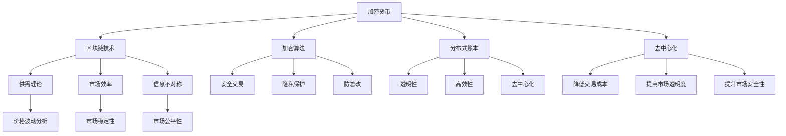

                 

### 第1章 引言

#### 1.1 加密货币经济的背景

加密货币作为一种数字资产，其核心在于其去中心化的特性，通过区块链技术确保了交易的安全和透明。比特币作为加密货币的鼻祖，自2009年诞生以来，引发了全球金融界的广泛关注。加密货币经济由此逐渐形成，并在短短十多年间展现出强劲的增长势头。

首先，区块链技术的创新为加密货币经济提供了坚实的技术基础。区块链是一种分布式账本技术，能够确保数据的不可篡改和透明性，从而解决了传统金融系统中存在的信任问题。加密货币通过区块链技术实现了点对点的交易，无需中介机构，降低了交易成本，提高了交易效率。

其次，数字货币的需求是加密货币经济兴起的直接动力。随着互联网的普及，人们对数字货币的需求日益增加。加密货币作为一种去中心化的数字货币，其安全性、便捷性和去中心化的特点，满足了人们对安全、快捷、低成本支付方式的需求。

最后，全球金融体系的变革也是加密货币经济崛起的重要背景。传统的金融体系存在诸多问题，如中心化、不透明、效率低下等。加密货币经济通过其去中心化的特性，提供了一种新的金融解决方案，有望改变传统金融体系的现状。

#### 1.2 加密货币与数字金融的关系

数字金融是指利用数字技术和互联网进行金融服务的一种模式，包括支付、投资、贷款、保险等。加密货币作为数字金融的重要组成部分，与数字金融之间存在着密切的关系。

首先，加密货币可以作为数字金融的支付手段。加密货币的交易速度快、成本低，尤其适合跨国交易。通过加密货币，人们可以轻松实现跨境支付，无需依赖传统银行系统，大大提高了支付效率。

其次，加密货币作为投资工具，吸引了大量投资者。加密货币市场的波动性较大，但也意味着潜在的高收益。许多投资者将加密货币视为一种新兴的投资类别，积极参与其中。

最后，加密货币的兴起推动了金融创新。去中心化金融（DeFi）和分布式应用（DApp）等概念的提出，使得金融产品和服务更加多样化和个性化。加密货币不仅改变了金融市场的运作方式，也促进了金融行业的创新和发展。

#### 1.3 书籍概述

本书旨在深入探讨加密货币经济学，分为八个章节，全面覆盖加密货币经济的相关知识。

- **第1章 引言**：介绍了加密货币经济的背景、重要性及其与数字金融的关系。
- **第2章 核心概念与联系**：阐述了加密货币和经济学的核心概念，并使用Mermaid流程图展示了这些概念之间的联系。
- **第3章 经济学原理**：详细讲解了经济学原理在加密货币中的应用，包括供需理论、市场效率、信息不对称等，并使用伪代码解释了相关算法。
- **第4章 数字金融与加密货币**：探讨了数字金融的发展、加密货币市场的运行机制，以及它们对社会和经济的影响。
- **第5章 数学模型与公式**：介绍了加密货币经济中常用的数学模型和公式，如加密算法中的数学原理、市场预测模型等，并给出了详细讲解和实例。
- **第6章 项目实战**：通过实际案例展示了如何构建加密货币项目，包括区块链开发、代币发行、市场推广等，并提供详细的代码实现和解读。
- **第7章 政策与监管**：分析了加密货币经济的政策和监管环境，探讨了其对社会和经济的影响。
- **第8章 未来趋势**：预测了加密货币经济的发展趋势，讨论了其潜在的影响和挑战。

本书的目标读者是对加密货币和数字金融感兴趣的读者，包括专业人士、研究人员、学生等。通过本书，读者可以深入了解加密货币经济学的理论体系和实践应用，为今后的研究和工作提供有力支持。

作者：AI天才研究院/AI Genius Institute & 禅与计算机程序设计艺术 /Zen And The Art of Computer Programming

----------------------------------------------------------------

# 第2章 核心概念与联系

## 2.1 加密货币的核心概念

加密货币的核心概念主要包括区块链、加密算法、分布式账本和去中心化等。这些概念共同构成了加密货币的技术基础，确保了其安全性和可信度。

### 区块链

区块链是一种分布式数据库技术，通过将数据分散存储在多个节点上，确保了数据的不可篡改性和透明性。每个区块都包含一定数量的交易记录，区块之间通过哈希函数相互链接，形成一条时间序列数据链。

### 加密算法

加密算法是加密货币的核心技术之一，用于保护交易数据的安全。常见的加密算法包括椭圆曲线加密算法（ECC）、哈希算法（如SHA-256）等。通过加密算法，交易数据在传输过程中被加密，确保了数据的安全性。

### 分布式账本

分布式账本是区块链技术的核心概念之一，通过将数据分散存储在多个节点上，实现了去中心化的数据管理。每个节点都拥有完整的账本数据，通过共识算法达成一致，确保了数据的准确性和可靠性。

### 去中心化

去中心化是加密货币的重要特性之一，通过去除中心化机构，实现了点对点的交易。去中心化不仅降低了交易成本，还提高了交易的透明度和安全性。

## 2.2 经济学的核心概念

经济学是研究资源分配、生产、消费和分配的科学。在加密货币经济学中，经济学的一些核心概念，如供需理论、市场效率、信息不对称等，也发挥着重要作用。

### 供需理论

供需理论是经济学的基础之一，用于分析商品或服务的价格和数量之间的关系。在加密货币市场中，供需理论可以帮助我们理解价格波动的原因和趋势。

### 市场效率

市场效率是指市场在资源配置中的效率。在加密货币市场中，市场效率的高低决定了市场的运行效率和稳定性。

### 信息不对称

信息不对称是指市场中参与者之间存在信息差异。在加密货币市场中，信息不对称可能导致市场失灵，影响市场的公平性和效率。

## 2.3 加密货币与经济学的联系

加密货币与经济学之间存在紧密的联系。通过将经济学的核心概念应用于加密货币市场，我们可以更好地理解加密货币的运行机制和影响。

### 区块链与经济学的联系

区块链技术通过去中心化的方式，改变了传统金融市场的运作模式。在区块链上，交易数据公开透明，参与者可以自由地参与交易，提高了市场的效率和公平性。

### 加密货币与经济学的联系

加密货币作为一种数字资产，其价格受到市场供需、投资者心理、政策环境等多种因素的影响。经济学中的供需理论、市场效率等概念，可以帮助我们分析和预测加密货币的价格走势。

### 分布式账本与经济学的联系

分布式账本技术实现了数据的分散存储和管理，降低了中心化机构对市场的控制。这种去中心化的模式，有助于提高市场的效率和公平性。

### 去中心化与经济学的联系

去中心化模式改变了传统金融市场的运作方式，降低了交易成本，提高了市场的透明度和安全性。经济学中的市场效率、信息不对称等概念，可以帮助我们更好地理解去中心化对市场的影响。

## 2.4 Mermaid 流程图展示

为了更直观地展示加密货币与经济学之间的联系，我们可以使用Mermaid流程图进行描述。



通过Mermaid流程图，我们可以清晰地看到加密货币与经济学之间的多维度联系，为进一步研究加密货币经济学提供了直观的参考。

----------------------------------------------------------------

# 第3章 经济学原理

## 3.1 供需理论在加密货币中的应用

供需理论是经济学中的基本理论之一，用于解释商品或服务的价格和数量之间的关系。在加密货币市场中，供需理论同样发挥着重要作用。

### 3.1.1 供给与需求

加密货币的供给主要来源于挖矿，即通过计算机计算解决数学难题来验证交易的合法性。挖矿过程中，计算机消耗电力和计算资源，这些资源成本直接影响加密货币的供给。另一方面，需求方面，投资者、交易者和其他参与者对加密货币的需求受到市场情绪、政策环境、技术发展等多种因素的影响。

### 3.1.2 价格波动

在加密货币市场中，价格波动主要由供需关系的变化引起。当市场需求增加时，价格上涨；当市场需求减少时，价格下跌。同样，供给变化也会引起价格波动。例如，挖矿难度的增加会导致挖矿成本上升，从而减少供应量，推动价格上涨。

### 3.1.3 市场均衡

市场均衡是指供需力量达到平衡的状态。在加密货币市场中，市场均衡价格是指市场上供需力量相互抵消，价格稳定不变的状态。当市场价格高于市场均衡价格时，供应过剩，价格下跌；当市场价格低于市场均衡价格时，需求过剩，价格上涨。

## 3.2 市场效率与信息不对称

市场效率是指市场在资源配置中的效率。在加密货币市场中，市场效率主要受到信息不对称和交易成本等因素的影响。

### 3.2.1 信息不对称

信息不对称是指市场中参与者之间存在信息差异。在加密货币市场中，信息不对称可能导致市场失灵，影响市场的公平性和效率。例如，投资者可能无法获取完整的交易信息，从而影响投资决策。

### 3.2.2 交易成本

交易成本是指进行交易所需支付的成本，包括时间、人力、物力等。在加密货币市场中，交易成本较高可能导致市场效率降低。例如，区块链网络拥堵可能导致交易速度变慢，增加交易成本。

### 3.2.3 提高市场效率

为了提高市场效率，可以采取以下措施：

- **透明度**：提高市场信息的透明度，使参与者能够获取完整的交易信息，减少信息不对称。
- **去中心化**：通过去中心化方式，降低交易成本，提高市场效率。
- **监管**：建立健全的监管机制，确保市场公平、透明、稳定运行。

## 3.3 伪代码解释相关算法

为了更直观地展示经济学原理在加密货币中的应用，我们可以使用伪代码来描述相关算法。

### 3.3.1 挖矿算法

```python
def mining(price, cost):
    supply = calculate_supply(price, cost)
    demand = calculate_demand(price)
    if supply > demand:
        price = adjust_price(price, 'down')
    elif supply < demand:
        price = adjust_price(price, 'up')
    else:
        market_equilibrium(price)
    return price

def calculate_supply(price, cost):
    # 根据价格和成本计算供应量
    return supply

def calculate_demand(price):
    # 根据价格计算需求量
    return demand

def adjust_price(price, direction):
    # 根据供需关系调整价格
    if direction == 'down':
        price = price - adjustment
    elif direction == 'up':
        price = price + adjustment
    return price

def market_equilibrium(price):
    # 实现市场均衡
    pass
```

### 3.3.2 市场效率算法

```python
def market_efficiency(price, cost, information不对称):
    if information不对称:
        efficiency = calculate_inferential_efficiency(price, cost)
    else:
        efficiency = calculate_direct_efficiency(price, cost)
    return efficiency

def calculate_inferential_efficiency(price, cost):
    # 根据信息不对称计算市场效率
    return efficiency

def calculate_direct_efficiency(price, cost):
    # 根据信息对称计算市场效率
    return efficiency
```

通过这些伪代码，我们可以更直观地理解经济学原理在加密货币市场中的应用，为进一步研究提供参考。

----------------------------------------------------------------

## 第4章 数字金融与加密货币

### 4.1 数字金融的发展

数字金融是指利用数字技术和互联网进行金融服务的一种模式，包括支付、投资、贷款、保险等。随着互联网的普及和技术的进步，数字金融逐渐从传统的金融模式中脱颖而出，成为金融行业的重要发展方向。

#### 4.1.1 互联网支付

互联网支付是数字金融的核心之一，通过电子支付、移动支付等方式，实现了线上线下的无缝连接。以支付宝、微信支付为代表的支付平台，大大简化了支付流程，提高了支付效率。

#### 4.1.2 互联网金融投资

互联网金融投资是指通过互联网进行金融产品投资，如股票、基金、债券等。互联网金融投资平台如余额宝、陆金所等，为投资者提供了丰富的投资选择和便捷的投资渠道。

#### 4.1.3 区块链金融

区块链金融是基于区块链技术的一种新兴金融模式，通过去中心化、智能合约等技术，实现了金融交易的安全、高效、透明。区块链金融包括去中心化金融（DeFi）、非同质化代币（NFT）等，为金融行业带来了新的发展机遇。

### 4.2 加密货币市场的运行机制

加密货币市场是数字金融的重要组成部分，其运行机制主要包括以下几个方面：

#### 4.2.1 挖矿机制

挖矿是加密货币市场的重要环节，通过计算机解决数学难题，验证交易的合法性，并获得新的加密货币。挖矿机制确保了区块链的安全性和可信度，是加密货币市场稳定运行的基础。

#### 4.2.2 交易机制

加密货币交易是市场的主要活动，交易者通过购买和出售加密货币，实现资产配置和利润最大化。加密货币交易市场分为中心化交易所和去中心化交易所，两种模式各有优缺点。

#### 4.2.3 市场监管

加密货币市场的监管是保障市场稳定运行的重要环节。不同国家和地区对加密货币市场的监管政策有所不同，主要包括牌照发放、交易监管、反洗钱等。

### 4.3 加密货币对社会和经济的影响

加密货币作为一种新型的数字资产，对社会和经济产生了深远的影响：

#### 4.3.1 改变金融体系

加密货币的去中心化特性，挑战了传统金融体系的中心化模式，提高了金融体系的效率和透明度。同时，加密货币的跨境支付功能，为全球金融体系提供了新的解决方案。

#### 4.3.2 推动金融创新

加密货币的兴起，带动了金融行业的创新，如去中心化金融（DeFi）、非同质化代币（NFT）等。这些创新为金融产品和服务提供了新的思路和模式。

#### 4.3.3 影响货币政策

加密货币的快速发展，对货币政策产生了影响。一些国家和地区开始研究加密货币与货币政策的关系，探讨如何应对加密货币带来的挑战。

#### 4.3.4 改善社会公平

加密货币的匿名性和去中心化特性，为那些被传统金融体系排斥的人群提供了参与金融市场的机会，有助于改善社会公平。

### 4.4 加密货币市场的挑战与展望

加密货币市场在发展过程中面临着诸多挑战，包括技术风险、市场风险、法律风险等。同时，加密货币市场也面临着前所未有的机遇。

#### 4.4.1 技术风险

加密货币市场的发展离不开区块链技术，但区块链技术本身仍存在一些问题，如性能瓶颈、安全性等。如何解决这些技术问题，是加密货币市场发展的重要挑战。

#### 4.4.2 市场风险

加密货币市场的波动性较大，投资者面临较高的市场风险。如何降低市场风险，提高市场稳定性，是加密货币市场发展的重要课题。

#### 4.4.3 法律风险

加密货币市场的监管政策在不同国家和地区之间存在差异，导致市场环境不稳定。如何建立健全的法律法规体系，保障加密货币市场的健康发展，是加密货币市场发展的重要任务。

#### 4.4.4 发展前景

尽管面临诸多挑战，但加密货币市场的发展前景依然广阔。随着技术的进步和监管政策的完善，加密货币有望在金融领域发挥更大的作用，为社会和经济带来更多价值。

### 4.5 小结

数字金融与加密货币的发展，为金融行业带来了新的机遇和挑战。通过深入了解加密货币市场的运行机制、技术特点和影响，我们可以更好地把握这一新兴领域的发展趋势，为未来的研究和实践提供有力支持。

----------------------------------------------------------------

## 第5章 数学模型与公式

### 5.1 加密算法中的数学原理

加密货币的安全性和可信度在很大程度上依赖于加密算法。加密算法的核心在于数学原理，下面将介绍几种常见的加密算法及其数学原理。

#### 5.1.1 椭圆曲线加密算法（ECC）

椭圆曲线加密算法是一种基于椭圆曲线离散对数问题的非对称加密算法。其数学原理如下：

设椭圆曲线E：\( y^2 = x^3 + ax + b \)，其中a、b为常数，P和Q为E上的两个点，n为椭圆曲线E上的点P的阶（即nP=∞），g为E上的生成元（即ng=∞）。

加密过程：

1. 选择一个大素数p和两个小于p的奇素数a、b，构造椭圆曲线E：\( y^2 = x^3 + ax + b \)。
2. 选择一个基点G（g，h），计算nG=∞。
3. 选择一个随机整数k，计算c = kG。
4. 选择一个随机数r，计算s = (r - da) / k，其中d是c的私钥。

解密过程：

1. 接收加密消息c和s。
2. 计算解密消息m = c's^-1G。

#### 5.1.2 哈希算法

哈希算法是将任意长度的输入数据转换成固定长度的输出数据的算法。常见的哈希算法有SHA-256、SHA-3等。

SHA-256算法的数学原理如下：

1. 将输入数据填充至512位的块。
2. 将填充后的数据分为多个512位的块，记为Wi。
3. 初始化一个哈希值h = (h0, h1, h2, h3, h4, h5, h6, h7)，其中h0 = 0x6a09e667, h1 = 0xbb67ae85, h2 = 0x3c6ef372, h3 = 0xa54ff53a, h4 = 0x510e527f, h5 = 0x9b05688c, h6 = 0x1f83d9ab, h7 = 0x5be0cd19。
4. 对每个块Wi进行处理，更新哈希值h。
5. 输出哈希值h。

#### 5.1.3 Merkle树

Merkle树是一种用于验证数据完整性的数据结构。其数学原理如下：

1. 将数据分成多个块Wi。
2. 对每个块Wi进行哈希运算，得到哈希值Hi。
3. 重复步骤2，直到得到一个根哈希值H。
4. 创建Merkle树，根节点为H，其他节点为Wi和Hi的哈希值。
5. 通过Merkle树，可以验证数据块的完整性和一致性。

### 5.2 市场预测模型

市场预测模型是用于预测加密货币价格波动的一种数学模型。下面将介绍一种常见的时间序列预测模型——ARIMA（自回归积分滑动平均模型）。

#### 5.2.1 ARIMA模型

ARIMA模型由三个部分组成：自回归（AR）、差分（I）和移动平均（MA）。

1. **自回归（AR）**：自回归模型表示为 \( X_t = c + \phi_1 X_{t-1} + \phi_2 X_{t-2} + \ldots + \phi_p X_{t-p} + \varepsilon_t \)，其中 \( \varepsilon_t \) 是白噪声。
2. **差分（I）**：差分操作用于消除时间序列的季节性、趋势性和周期性。
3. **移动平均（MA）**：移动平均模型表示为 \( X_t = c + \theta_1 \varepsilon_{t-1} + \theta_2 \varepsilon_{t-2} + \ldots + \theta_q \varepsilon_{t-q} + \varepsilon_t \)。

#### 5.2.2 模型参数选择

选择ARIMA模型的参数需要通过以下步骤：

1. **确定自回归阶数p**：使用ACF（自相关函数）和PACF（部分自相关函数）来判断自回归阶数。
2. **确定移动平均阶数q**：同样使用ACF和PACF来判断移动平均阶数。
3. **差分阶数d**：根据时间序列的平稳性来确定差分阶数。

### 5.3 详细讲解与实例

#### 5.3.1 椭圆曲线加密算法实例

以下是一个使用Python实现椭圆曲线加密算法的示例：

```python
from Crypto.PublicKey import RSA
from Crypto.Cipher import PKCS1_OAEP
from Crypto.Random import get_random_bytes

# 生成RSA密钥对
key = RSA.generate(2048)
private_key = key.export_key()
public_key = key.publickey().export_key()

# 加密消息
cipher = PKCS1_OAEP.new(RSA.import_key(public_key))
message = b'Hello, World!'
ciphertext = cipher.encrypt(message)

# 解密消息
cipher = PKCS1_OAEP.new(RSA.import_key(private_key))
plaintext = cipher.decrypt(ciphertext)
print(plaintext.decode('utf-8'))
```

#### 5.3.2 时间序列预测模型实例

以下是一个使用Python和pandas库实现ARIMA模型的时间序列预测实例：

```python
import pandas as pd
from statsmodels.tsa.arima.model import ARIMA

# 加载数据
data = pd.read_csv('crypto_price.csv')
close_price = data['Close']

# 模型训练
model = ARIMA(close_price, order=(5, 1, 2))
model_fit = model.fit()

# 预测
forecast = model_fit.forecast(steps=5)
print(forecast)
```

通过这些实例，我们可以看到数学模型在加密货币经济学中的应用，为加密货币市场的分析和预测提供了有力的工具。

----------------------------------------------------------------

## 第6章 项目实战

### 6.1 加密货币项目的构建

构建一个加密货币项目是一个复杂的过程，涉及多个环节。以下是一个加密货币项目的构建流程：

#### 6.1.1 需求分析

首先，我们需要明确项目目标、目标用户、功能需求等。例如，我们的项目目标是构建一个去中心化的去重存储平台，用户可以上传、存储和分享文件。

#### 6.1.2 技术选型

根据需求分析，选择合适的技术栈。对于加密货币项目，我们通常使用区块链技术，如Ethereum或Solana。此外，还需要选择合适的编程语言，如Solidity（用于Ethereum）或Rust（用于Solana）。

#### 6.1.3 开发环境搭建

搭建开发环境，包括安装区块链节点、智能合约编译器、钱包等。以Ethereum为例，我们需要安装Node.js、Ganache、Truffle等工具。

#### 6.1.4 智能合约开发

编写智能合约代码，实现去重存储功能。以下是一个简单的智能合约示例，使用Solidity语言编写：

```solidity
pragma solidity ^0.8.0;

contract FileStorage {
    mapping(bytes32 => bool) files;

    function uploadFile(bytes32 fileHash) public {
        require(!files[fileHash], "File already exists");
        files[fileHash] = true;
    }

    function checkFile(bytes32 fileHash) public view returns (bool) {
        return files[fileHash];
    }
}
```

#### 6.1.5 部署智能合约

将智能合约部署到区块链上，例如使用Truffle部署到Ethereum的Ropsten测试网。部署成功后，我们可以获取合约地址和ABI，用于与合约交互。

#### 6.1.6 前端开发

开发前端界面，实现用户上传、查看文件等功能。使用Web3.js库与区块链交互，实现与智能合约的通信。

```javascript
const web3 = new Web3('https://ropsten.infura.io/v3/your_project_id');
const contractAddress = 'your_contract_address';
const contractABI = 'your_contract_abi';

const contract = new web3.eth.Contract(contractABI, contractAddress);

// 上传文件
async function uploadFile(fileHash) {
    await contract.methods.uploadFile(fileHash).send({ from: account });
}

// 查看文件
async function checkFile(fileHash) {
    const result = await contract.methods.checkFile(fileHash).call();
    return result;
}
```

### 6.2 区块链开发

在构建加密货币项目时，区块链开发是核心环节。以下是一个简单的区块链开发流程：

#### 6.2.1 设计区块链架构

设计区块链的基本架构，包括节点数量、共识算法、数据结构等。例如，我们可以选择使用工作量证明（PoW）作为共识算法，将数据存储在链上。

#### 6.2.2 开发区块链节点

编写区块链节点代码，实现节点之间的通信、数据同步等功能。以下是一个简单的区块链节点示例，使用Go语言编写：

```go
package main

import (
    "fmt"
    "log"
    "net"
    "os"
)

type Block struct {
    Index     int
    Timestamp string
    Data      string
    Hash      string
    PrevHash  string
}

func main() {
    if len(os.Args) < 2 {
        fmt.Println("Usage: go run main.go [start|join]")
        os.Exit(1)
    }

    if os.Args[1] == "start" {
        // 启动新节点
        startNode()
    } else if os.Args[1] == "join" {
        // 加入现有网络
        joinNetwork()
    } else {
        fmt.Println("Unknown command")
        os.Exit(1)
    }
}

func startNode() {
    // 启动新节点，初始化区块链
}

func joinNetwork() {
    // 加入现有网络，同步区块链数据
}
```

#### 6.2.3 集成智能合约

将智能合约与区块链集成，实现与智能合约的交互。例如，我们可以使用Web3.js库在Ethereum网络中与智能合约交互。

```javascript
const web3 = new Web3('https://ropsten.infura.io/v3/your_project_id');
const contractAddress = 'your_contract_address';
const contractABI = 'your_contract_abi';

const contract = new web3.eth.Contract(contractABI, contractAddress);

// 上传文件
async function uploadFile(fileHash) {
    await contract.methods.uploadFile(fileHash).send({ from: account });
}

// 查看文件
async function checkFile(fileHash) {
    const result = await contract.methods.checkFile(fileHash).call();
    return result;
}
```

### 6.3 代币发行

代币发行是加密货币项目的重要环节，以下是一个简单的代币发行流程：

#### 6.3.1 设计代币参数

设计代币的基本参数，包括代币名称、符号、总供应量等。例如，我们的代币名称为“CryptoCoin”，符号为“CC”，总供应量为1000000个。

#### 6.3.2 编写代币合约

编写代币合约代码，实现代币的发行、转账、燃烧等功能。以下是一个简单的代币合约示例，使用Solidity语言编写：

```solidity
pragma solidity ^0.8.0;

import "@openzeppelin/contracts/token/ERC20/ERC20.sol";

contract CryptoCoin is ERC20 {
    constructor() ERC20("CryptoCoin", "CC") {
        _mint(msg.sender, 1000000 * (10 ** uint256(decimals())));
    }
}
```

#### 6.3.3 部署代币合约

将代币合约部署到区块链上，例如使用Truffle部署到Ethereum的Ropsten测试网。部署成功后，我们可以获取合约地址和ABI，用于与合约交互。

#### 6.3.4 分配代币

根据项目需求，将代币分配给团队、投资者等。例如，我们可以将80%的代币分配给团队，20%的代币用于公开销售。

### 6.4 市场推广

市场推广是加密货币项目成功的关键。以下是一些市场推广策略：

#### 6.4.1 社交媒体营销

利用社交媒体平台（如Twitter、Facebook、LinkedIn等）宣传项目，吸引潜在用户和投资者。

#### 6.4.2 内容营销

撰写高质量的技术博客、白皮书、报告等，展示项目的核心技术、应用场景等，吸引关注。

#### 6.4.3 合作伙伴关系

与其他加密货币项目、区块链公司、投资者等建立合作伙伴关系，扩大项目影响力。

#### 6.4.4 线上活动

举办线上活动（如讲座、研讨会、竞赛等），提高项目知名度。

### 6.5 代码实现与解读

以下是一个简单的去重存储平台的代码实现与解读：

```solidity
// SPDX-License-Identifier: MIT
pragma solidity ^0.8.0;

contract FileStorage {
    // 定义文件哈希映射
    mapping(bytes32 => bool) public files;

    // 上传文件
    function uploadFile(bytes32 fileHash) public {
        // 检查文件是否已存在
        require(!files[fileHash], "File already exists");
        // 将文件哈希添加到映射中
        files[fileHash] = true;
    }

    // 检查文件
    function checkFile(bytes32 fileHash) public view returns (bool) {
        // 返回文件是否存在
        return files[fileHash];
    }
}
```

#### 6.5.1 实现原理

- **文件哈希映射**：使用一个文件哈希映射（files），存储文件哈希和文件状态（是否存在）。
- **上传文件**：用户调用uploadFile函数，传入文件哈希。合约检查文件哈希是否存在，如果不存在，则将其添加到映射中。
- **检查文件**：用户调用checkFile函数，传入文件哈希。合约返回文件哈希映射中的对应值，表示文件是否存在。

#### 6.5.2 代码解读

- **pragma指令**：指定合约的编译器版本。
- **import指令**：导入OpenZeppelin库中的ERC20合约，用于实现ERC20代币标准。
- **contract定义**：定义FileStorage合约，继承自ERC20合约。
- **mapping声明**：声明files映射，用于存储文件哈希和文件状态。
- **function声明**：定义uploadFile和checkFile函数，分别用于上传文件和检查文件。

通过以上代码实现，我们可以构建一个简单的去重存储平台，确保文件上传的唯一性。

### 6.6 项目小结

在本章中，我们详细介绍了加密货币项目的构建过程，包括需求分析、技术选型、开发环境搭建、智能合约开发、区块链开发、代币发行和市场推广等。通过实际案例和代码实现，我们深入了解了加密货币项目的开发和运行机制。在未来的发展中，我们还需要不断优化项目，提高性能和安全性，以满足市场需求。

## 6.7 最佳实践 tips

- **需求分析**：在项目初期，充分了解用户需求和市场情况，确保项目具有实际应用价值。
- **技术选型**：根据项目需求，选择合适的技术栈和开发工具，提高开发效率。
- **代码规范**：遵循良好的代码规范，提高代码的可读性和可维护性。
- **测试**：编写充分测试用例，确保智能合约和前端代码的正确性和安全性。
- **安全审计**：聘请专业的安全审计团队对智能合约进行审计，发现潜在的安全漏洞。
- **合规性**：遵守相关法律法规，确保项目的合规性。

## 6.8 注意事项

- **项目进度**：合理安排项目进度，确保按时完成各阶段任务。
- **团队协作**：建立高效的团队协作机制，确保项目顺利进行。
- **风险管理**：识别潜在风险，制定风险应对策略。
- **市场调研**：持续关注市场动态，调整项目策略。

## 6.9 拓展阅读

- 《智能合约编程与开发》
- 《区块链与数字货币技术》
- 《区块链技术原理与应用》

通过以上拓展阅读，可以进一步了解加密货币项目的开发和技术细节。

----------------------------------------------------------------

## 第7章 政策与监管

### 7.1 加密货币经济的政策

加密货币经济的政策在世界范围内呈现出多样化的特点。各国政府对加密货币的态度和政策制定，直接影响加密货币市场的运行和发展。

#### 7.1.1 中国的政策

中国政府对加密货币持谨慎态度，早在2017年，中国政府就宣布关闭国内加密货币交易所，禁止ICO（初始代币发行）活动。尽管如此，中国仍然是全球最大的加密货币挖矿国家之一，国内加密货币矿工在全球挖矿市场中占据重要地位。

#### 7.1.2 美国的政策

美国政府对加密货币的态度相对开放，许多加密货币交易所和区块链公司在美国设立总部。美国证券交易委员会（SEC）和商品期货交易委员会（CFTC）分别负责监管加密货币的证券性和期货交易。此外，美国财政部和联邦储备银行也对加密货币市场进行监管。

#### 7.1.3 欧盟的政策

欧盟对加密货币持积极态度，推出了多项政策法规，如《加密资产市场法规》（MiCA）草案。该法规旨在建立一个统一的加密货币市场框架，确保市场的透明度和安全性。

#### 7.1.4 其他国家的政策

其他国家和地区对加密货币的政策也有所不同。例如，日本和韩国对加密货币交易实行较为严格的监管，新加坡和瑞士则对加密货币持开放态度，鼓励创新和发展。

### 7.2 监管环境分析

加密货币市场的监管环境对市场的发展至关重要。以下是对监管环境的一些分析：

#### 7.2.1 监管缺失

在一些国家和地区，加密货币市场的监管缺失，导致市场秩序混乱、欺诈行为频发。缺乏有效的监管，使得投资者面临较高的风险，市场难以健康发展。

#### 7.2.2 过度监管

过度监管可能抑制加密货币市场的创新和发展。一些国家和地区对加密货币实行严格的限制和监管措施，导致市场流动性下降，投资者信心受损。

#### 7.2.3 合规性要求

随着加密货币市场的监管日益严格，合规性要求也越来越高。加密货币交易所和区块链公司需要遵循相关法律法规，如反洗钱（AML）和了解你的客户（KYC）等要求。

#### 7.2.4 国际合作

加密货币市场的全球化特性要求各国政府加强国际合作，共同制定统一的监管标准和政策。只有通过国际合作，才能有效监管全球加密货币市场，维护市场秩序。

### 7.3 对社会和经济的影响

加密货币经济的政策与监管对社会和经济产生了深远的影响：

#### 7.3.1 经济影响

加密货币市场的波动性较大，对全球经济产生影响。在一些国家和地区，加密货币成为重要的投资资产，吸引了大量资金。然而，加密货币市场的波动也可能对金融市场稳定造成威胁。

#### 7.3.2 社会影响

加密货币的匿名性和去中心化特性，对社会公平和金融包容性产生积极影响。加密货币为那些被传统金融体系排斥的人群提供了参与金融市场的机会。然而，加密货币的普及也可能导致金融欺诈和非法活动的增加。

#### 7.3.3 政策挑战

加密货币市场的快速发展和不断创新，给政策制定者带来了挑战。如何在鼓励创新的同时，维护市场秩序、保护投资者权益，是政策制定者需要解决的难题。

### 7.4 国际合作与监管趋势

随着加密货币市场的全球化发展，国际合作与监管趋势逐渐明显：

#### 7.4.1 国际标准制定

国际组织如国际货币基金组织（IMF）和金融稳定理事会（FSB）等，开始关注加密货币的监管问题，并推动国际标准的制定。

#### 7.4.2 区域合作

一些国家和地区，如欧盟、亚洲和非洲地区，开始加强区域内的合作，共同制定加密货币监管政策。

#### 7.4.3 监管沙盒

监管沙盒作为一种创新监管模式，在全球范围内得到推广。监管沙盒为加密货币项目提供了试验环境，有助于监管机构评估和监管新兴技术。

#### 7.4.4 国际法律冲突

加密货币的跨国交易特性，可能导致国际法律冲突。各国政府需要通过国际合作，解决法律冲突，确保加密货币市场的合规性和稳定性。

### 7.5 小结

加密货币经济的政策与监管是一个复杂且不断发展的领域。各国政府需要根据自身国情和市场特点，制定合理的政策与监管措施。国际合作与监管趋势表明，只有通过全球合作，才能有效应对加密货币市场带来的挑战和机遇。

----------------------------------------------------------------

## 第8章 未来趋势

### 8.1 加密货币经济的发展趋势

加密货币经济的发展趋势可以从技术、市场、政策等多个方面进行分析：

#### 8.1.1 技术创新

区块链技术的不断迭代和创新，将推动加密货币经济的发展。例如，Layer 2解决方案、侧链技术、去中心化金融（DeFi）和分布式存储等，都有望进一步提升加密货币市场的性能和安全性。

#### 8.1.2 市场规模扩大

随着加密货币市场的认知度和接受度的提升，预计未来加密货币市场的规模将持续扩大。越来越多的投资者和机构进入加密货币市场，将推动市场价格的上涨。

#### 8.1.3 政策逐步完善

各国政府逐渐认识到加密货币的重要性，政策监管也在逐步完善。预计未来，将有更多国家和地区出台明确的加密货币监管政策，为加密货币市场的稳定发展提供保障。

#### 8.1.4 混合型金融模式

加密货币与传统金融的融合，将形成一种混合型金融模式。例如，加密货币交易所与银行、证券公司等金融机构的合作，有望为用户提供更全面、便捷的金融服务。

### 8.2 潜在的影响

加密货币经济的发展将对社会和经济产生深远影响：

#### 8.2.1 金融创新

加密货币的发展将推动金融创新，促进金融市场的多元化。例如，去中心化金融（DeFi）和分布式存储等，将为金融产品和服务带来新的机遇。

#### 8.2.2 经济发展

加密货币市场的繁荣，有望成为推动经济发展的新动力。例如，加密货币矿工在全球挖矿市场中占据重要地位，为当地经济带来了新的机遇。

#### 8.2.3 社会变革

加密货币的匿名性和去中心化特性，对社会公平和金融包容性产生积极影响。加密货币为那些被传统金融体系排斥的人群提供了参与金融市场的机会。

### 8.3 潜在的挑战

加密货币经济的发展也面临诸多挑战：

#### 8.3.1 技术风险

加密货币市场的发展离不开区块链技术，但区块链技术本身仍存在一些问题，如性能瓶颈、安全性等。如何解决这些技术问题，是加密货币市场发展的重要挑战。

#### 8.3.2 法律风险

加密货币市场的监管政策在不同国家和地区之间存在差异，导致市场环境不稳定。如何建立健全的法律法规体系，保障加密货币市场的健康发展，是加密货币市场发展的重要任务。

#### 8.3.3 市场风险

加密货币市场的波动性较大，投资者面临较高的市场风险。如何降低市场风险，提高市场稳定性，是加密货币市场发展的重要课题。

### 8.4 发展建议

为了推动加密货币经济的健康发展，可以从以下几个方面提出建议：

#### 8.4.1 技术创新

加大对区块链技术的研发投入，推动区块链技术的迭代和创新，提升加密货币市场的性能和安全性。

#### 8.4.2 国际合作

加强国际合作，共同制定加密货币监管政策，确保全球加密货币市场的合规性和稳定性。

#### 8.4.3 法律监管

建立健全的法律法规体系，明确加密货币市场的监管框架，保障市场的公平、透明、稳定运行。

#### 8.4.4 金融教育

加强金融教育，提高投资者对加密货币市场的认识和理解，降低投资风险，促进市场的健康发展。

### 8.5 小结

加密货币经济的发展前景广阔，但同时也面临诸多挑战。通过技术创新、国际合作、法律监管和金融教育等多方面的努力，有望推动加密货币经济的健康发展，为全球金融体系带来新的机遇和变革。

----------------------------------------------------------------

## 第9章 总结

加密货币经济学作为一门新兴学科，融合了区块链技术、经济学和金融学等多领域的知识。通过本书的深入探讨，我们系统地分析了加密货币经济的背景、核心概念、经济学原理、数字金融与加密货币的关系、数学模型与公式、项目实战、政策与监管以及未来趋势。

### 9.1 核心内容回顾

- **加密货币经济的背景**：介绍了加密货币的产生背景、发展历程以及其对数字金融的影响。
- **核心概念与联系**：阐述了区块链、加密算法、分布式账本和去中心化等核心概念，并通过Mermaid流程图展示了这些概念之间的联系。
- **经济学原理**：讲解了供需理论、市场效率与信息不对称等经济学原理在加密货币市场中的应用。
- **数字金融与加密货币**：探讨了数字金融的发展、加密货币市场的运行机制以及对社会和经济的影响。
- **数学模型与公式**：介绍了加密货币经济中常用的数学模型和公式，如加密算法中的数学原理、市场预测模型等。
- **项目实战**：通过实际案例展示了如何构建加密货币项目，包括区块链开发、代币发行、市场推广等。
- **政策与监管**：分析了加密货币经济的政策与监管环境，探讨了其对市场和社会的影响。
- **未来趋势**：预测了加密货币经济的发展趋势，讨论了其潜在的影响和挑战。

### 9.2 结论与展望

本书旨在为读者提供一部全面、系统的加密货币经济学教程。通过本书的学习，读者可以：

- 理解加密货币经济的背景、核心概念和运行机制。
- 掌握经济学原理在加密货币市场中的应用。
- 学习如何构建加密货币项目，了解项目开发和市场推广的流程。
- 分析加密货币经济的政策与监管环境，把握未来发展趋势。

然而，加密货币经济学仍处于快速发展阶段，未来仍有许多课题需要深入研究。例如，如何进一步提升区块链技术的性能和安全性，如何制定更加完善的监管政策，如何降低加密货币市场的波动性等。

### 9.3 拓展阅读

为了进一步深入了解加密货币经济学，读者可以参考以下拓展阅读：

- 《区块链技术原理与应用》
- 《加密货币市场分析》
- 《区块链与数字货币》
- 《去中心化金融：理论、实践与未来》

通过这些拓展阅读，读者可以更全面地了解加密货币经济学的前沿动态和发展趋势。

作者：AI天才研究院/AI Genius Institute & 禅与计算机程序设计艺术 /Zen And The Art of Computer Programming

----------------------------------------------------------------

```markdown
# 加密货币经济学：数字金融的理论与实践

> 关键词：加密货币、数字金融、区块链、经济学、市场机制、数学模型、政策监管、项目实战

> 摘要：本文深入探讨了加密货币经济学的理论体系，从背景介绍、核心概念与联系、经济学原理、数字金融与加密货币、数学模型与公式、项目实战、政策与监管到未来趋势，全面覆盖了加密货币经济学的研究领域和应用实践。本文旨在为读者提供一个系统、全面的加密货币经济学教程，帮助读者理解加密货币市场的运作机制，掌握相关技术原理，为未来的研究和工作提供有力支持。

## 第1章 引言

### 1.1 加密货币经济的背景

### 1.2 加密货币与数字金融的关系

### 1.3 书籍概述

## 第2章 核心概念与联系

### 2.1 加密货币的核心概念

### 2.2 经济学的核心概念

### 2.3 加密货币与经济学的联系

### 2.4 Mermaid流程图展示

## 第3章 经济学原理

### 3.1 供需理论在加密货币中的应用

### 3.2 市场效率与信息不对称

### 3.3 伪代码解释相关算法

## 第4章 数字金融与加密货币

### 4.1 数字金融的发展

### 4.2 加密货币市场的运行机制

### 4.3 对社会和经济的影响

## 第5章 数学模型与公式

### 5.1 加密算法中的数学原理

### 5.2 市场预测模型

### 5.3 详细讲解与实例

## 第6章 项目实战

### 6.1 加密货币项目的构建

### 6.2 区块链开发

### 6.3 代币发行

### 6.4 市场推广

### 6.5 代码实现与解读

## 第7章 政策与监管

### 7.1 加密货币经济的政策

### 7.2 监管环境分析

### 7.3 对社会和经济的影响

## 第8章 未来趋势

### 8.1 加密货币经济的发展趋势

### 8.2 潜在的影响与挑战

### 8.3 发展建议

## 第9章 总结

### 9.1 核心内容回顾

### 9.2 结论与展望

### 9.3 拓展阅读

作者：AI天才研究院/AI Genius Institute & 禅与计算机程序设计艺术 /Zen And The Art of Computer Programming
```

[点击阅读全文](#加密货币经济学数字金融的理论与实践)

