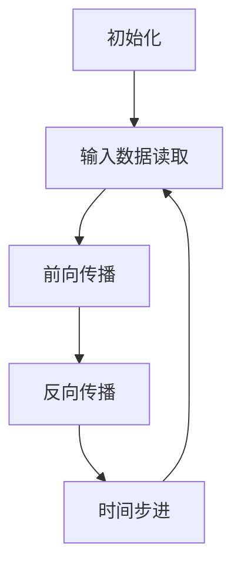
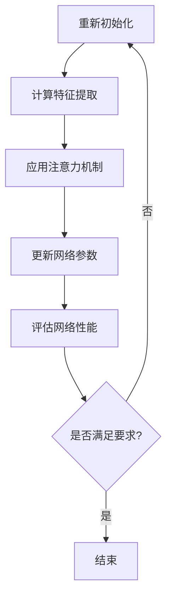

                 


## 文章标题

动态神经网络在适应性AI中的设计原则

> 关键词：动态神经网络，适应性AI，设计原则，神经网络架构，算法原理，数学模型，项目实战

> 摘要：本文深入探讨了动态神经网络在适应性AI中的应用及其设计原则。文章首先介绍了动态神经网络的基本概念和特点，然后详细阐述了其核心算法原理和数学模型。接着，文章提出了动态神经网络的设计原则，并通过对实际项目案例的剖析，展示了其在适应性AI中的有效应用。最后，文章展望了动态神经网络在AI领域的未来发展。

----------------------------------------------------------------

### 引言

随着人工智能技术的不断发展，神经网络作为一种重要的机器学习模型，已经广泛应用于各个领域。然而，传统的静态神经网络在处理动态环境和适应性任务时，往往表现出一定的局限性。为了解决这一问题，动态神经网络（Dynamical Neural Networks，DNNs）应运而生。动态神经网络通过引入时间维度，使得神经网络能够捕捉和适应动态变化的环境，从而在适应性AI中展现出巨大的潜力。

本文旨在系统地探讨动态神经网络在适应性AI中的设计原则。首先，我们将介绍动态神经网络的基本概念和特点，然后深入分析其核心算法原理和数学模型。接下来，我们将提出一系列设计原则，以指导动态神经网络在适应性AI中的开发与应用。最后，通过实际项目案例的剖析，我们将展示动态神经网络在适应性AI中的有效应用，并展望其未来的发展趋势。

本文的结构安排如下：

1. 引言：介绍动态神经网络的基本概念和特点，以及本文的研究目的和结构安排。
2. 动态神经网络的基本原理：详细阐述动态神经网络的核心算法原理和数学模型。
3. 动态神经网络的设计原则：提出动态神经网络在适应性AI中的设计原则，包括参数调整策略、网络结构优化等。
4. 动态神经网络的应用：通过实际项目案例，展示动态神经网络在适应性AI中的有效应用。
5. 动态神经网络的未来发展趋势：探讨动态神经网络在AI领域的未来发展前景。

接下来，我们将逐一展开这些内容。

### 动态神经网络的基本概念和特点

动态神经网络是一种能够处理时间序列数据的神经网络模型，其基本概念和特点如下：

#### 动态神经网络的基本概念

动态神经网络由一系列的神经网络层组成，每个神经网络层都包含多个神经元。与静态神经网络不同，动态神经网络中的神经元不仅处理输入数据，还处理时间序列数据。具体来说，动态神经网络通过时间步进（Time Step）来处理数据，在每个时间步进中，神经网络对当前时刻的数据进行计算，并将结果传递给下一个时间步进。这种时间步进的处理方式使得动态神经网络能够捕捉时间序列数据中的动态变化。

#### 动态神经网络的特点

1. **时序处理能力**：动态神经网络能够处理时间序列数据，这使得它能够捕捉数据中的动态变化，从而在适应性AI中具有广泛的应用前景。
2. **自适应能力**：动态神经网络通过学习时间序列数据中的模式和规律，能够自适应地调整网络参数，从而提高网络在动态环境下的适应能力。
3. **可扩展性**：动态神经网络的结构相对灵活，可以通过增加或减少神经网络层和神经元来适应不同复杂度的任务。
4. **可解释性**：动态神经网络的学习过程和决策过程相对简单，这使得它具有较高的可解释性，便于对网络行为进行理解和分析。

#### 动态神经网络与适应性AI的关系

适应性AI（Adaptive AI）是指能够在动态环境中自动调整自身行为的人工智能系统。动态神经网络在适应性AI中发挥着重要作用，主要体现在以下几个方面：

1. **环境感知**：动态神经网络能够感知环境中的动态变化，从而为适应性AI提供实时的环境信息。
2. **行为调整**：动态神经网络可以根据环境信息，自适应地调整自身的行为，从而实现适应性AI的目标。
3. **决策优化**：动态神经网络能够通过学习环境中的模式和规律，优化适应性AI的决策过程，从而提高系统的整体性能。

总之，动态神经网络在适应性AI中具有广泛的应用前景，它能够为适应性AI提供强大的支持，使其在动态环境中表现出更高的适应能力和智能水平。

### 动态神经网络的基本原理

动态神经网络是一种能够处理时间序列数据的神经网络模型，其基本原理涉及神经网络的架构、时间步进机制以及神经网络的学习过程。以下将详细阐述这些基本原理。

#### 神经网络架构

动态神经网络由一系列的神经网络层组成，每个神经网络层都包含多个神经元。与静态神经网络不同，动态神经网络中的神经元不仅处理输入数据，还处理时间序列数据。具体来说，动态神经网络通过时间步进（Time Step）来处理数据，在每个时间步进中，神经网络对当前时刻的数据进行计算，并将结果传递给下一个时间步进。这种时间步进的处理方式使得动态神经网络能够捕捉时间序列数据中的动态变化。

动态神经网络的神经网络架构通常包括以下几个部分：

1. **输入层**：输入层接收外部输入数据，如时间序列数据。输入层的神经元数量取决于输入数据的维度。
2. **隐藏层**：隐藏层位于输入层和输出层之间，负责对输入数据进行特征提取和变换。隐藏层的数量和神经元数量可以根据任务复杂度进行调整。
3. **输出层**：输出层产生最终的输出结果，如预测值、分类标签等。输出层的神经元数量取决于输出数据的维度。

#### 时间步进机制

动态神经网络通过时间步进机制来处理时间序列数据。时间步进是指神经网络在每个时间点对输入数据进行处理，并将结果传递给下一个时间点。具体来说，时间步进过程包括以下几个步骤：

1. **初始化**：初始化神经网络的状态，包括权重、偏置和激活值等。
2. **输入数据读取**：在当前时间步进中，读取输入数据，并将其传递给神经网络。
3. **前向传播**：神经网络通过前向传播算法计算输出结果，包括隐藏层的输出和输出层的输出。
4. **反向传播**：计算当前时间步进中的误差，并使用反向传播算法更新神经网络的权重和偏置。
5. **时间步进**：将当前时间步进的结果传递给下一个时间步进，重复上述过程，直到达到预定的训练时间或达到满意的误差水平。

#### 学习过程

动态神经网络的学习过程是基于梯度下降法的优化过程。通过不断调整神经网络的权重和偏置，使得网络能够拟合训练数据。具体来说，学习过程包括以下几个步骤：

1. **数据预处理**：对输入数据进行标准化或归一化处理，以提高学习效果。
2. **数据划分**：将数据集划分为训练集、验证集和测试集，用于训练、验证和评估神经网络。
3. **初始化**：初始化神经网络的权重和偏置，通常使用随机初始化方法。
4. **训练过程**：在训练集上迭代训练神经网络，通过反向传播算法更新权重和偏置，以最小化预测误差。
5. **验证过程**：在验证集上评估神经网络的性能，以调整学习参数和模型结构。
6. **测试过程**：在测试集上评估神经网络的最终性能，以确定模型是否达到预期效果。

通过上述学习过程，动态神经网络能够不断优化自身，以适应动态环境中的变化，从而实现适应性AI的目标。

#### Mermaid流程图

为了更好地理解动态神经网络的基本原理，我们使用Mermaid流程图展示动态神经网络的时间步进机制。以下是一个简单的Mermaid流程图示例：



在这个流程图中，A表示初始化阶段，B表示输入数据读取阶段，C表示前向传播阶段，D表示反向传播阶段，E表示时间步进阶段。通过这个流程图，我们可以清晰地看到动态神经网络的时间步进机制。

#### 核心算法原理讲解

为了深入理解动态神经网络的核心算法原理，我们将使用伪代码详细阐述其训练过程。以下是一个简化的动态神经网络训练过程的伪代码示例：

```python
# 动态神经网络训练过程
def train_dnn(data, labels, num_steps, num_epochs):
    # 初始化神经网络参数
    weights = initialize_weights(num_steps, data.shape[1], labels.shape[1])
    biases = initialize_biases(num_steps, data.shape[1], labels.shape[1])

    # 梯度下降优化过程
    for epoch in range(num_epochs):
        for step in range(num_steps):
            # 前向传播
            outputs = forward_pass(data[step], weights, biases)

            # 计算损失函数
            loss = calculate_loss(outputs, labels[step])

            # 反向传播
            gradients = backward_pass(outputs, labels[step], data[step])

            # 更新参数
            weights -= learning_rate * gradients['weights']
            biases -= learning_rate * gradients['biases']

            # 打印训练进度
            print(f"Epoch: {epoch}, Step: {step}, Loss: {loss}")

    return weights, biases
```

在这个伪代码中，`train_dnn`函数用于训练动态神经网络。它接收输入数据`data`、标签`labels`、时间步进数`num_steps`和训练迭代次数`num_epochs`。在训练过程中，神经网络通过初始化参数，然后使用梯度下降法进行优化。具体来说，训练过程包括以下几个步骤：

1. **初始化**：初始化神经网络的权重`weights`和偏置`biases`。
2. **前向传播**：在当前时间步进中，使用输入数据`data[step]`和神经网络参数进行前向传播，计算输出结果`outputs`。
3. **计算损失函数**：计算输出结果`outputs`和标签`labels[step]`之间的损失函数值。
4. **反向传播**：计算梯度`gradients`，并更新神经网络参数。
5. **打印训练进度**：在每次训练迭代后，打印当前训练进度，包括训练轮次`epoch`、时间步进`step`和损失函数值`loss`。

通过上述伪代码，我们可以清晰地看到动态神经网络的核心算法原理，包括初始化、前向传播、反向传播和参数更新等步骤。

#### 数学模型和公式

动态神经网络作为一种复杂的机器学习模型，其内部运算过程涉及到多个数学模型和公式。以下将简要介绍动态神经网络中的几个关键数学模型和公式。

1. **激活函数**：

动态神经网络中的激活函数用于对神经网络的输出进行非线性变换，常见的激活函数包括 sigmoid、ReLU 和 tanh 等。

- **Sigmoid 函数**：
  $$ \sigma(x) = \frac{1}{1 + e^{-x}} $$

- **ReLU 函数**：
  $$ \text{ReLU}(x) = \max(0, x) $$

- **Tanh 函数**：
  $$ \tanh(x) = \frac{e^x - e^{-x}}{e^x + e^{-x}} $$

2. **权重更新公式**：

在动态神经网络中，权重更新是通过反向传播算法来实现的。以下是一个简化的权重更新公式：

$$ \Delta w_{ij} = -\alpha \cdot \frac{\partial L}{\partial w_{ij}} $$

其中，$\Delta w_{ij}$表示权重$w_{ij}$的更新值，$\alpha$表示学习率，$L$表示损失函数，$\frac{\partial L}{\partial w_{ij}}$表示权重$w_{ij}$对损失函数的梯度。

3. **偏置更新公式**：

偏置更新与权重更新类似，其公式为：

$$ \Delta b_j = -\alpha \cdot \frac{\partial L}{\partial b_j} $$

其中，$\Delta b_j$表示偏置$b_j$的更新值，$\alpha$表示学习率，$L$表示损失函数，$\frac{\partial L}{\partial b_j}$表示偏置$b_j$对损失函数的梯度。

为了更好地理解这些数学模型和公式，以下是一个简化的示例：

假设我们有一个动态神经网络，其输入为$x_1, x_2, ..., x_n$，输出为$y_1, y_2, ..., y_m$。神经网络的输出可以通过以下公式计算：

$$ y_j = \text{ReLU}(\sum_{i=1}^{n} w_{ij} x_i + b_j) $$

其中，$w_{ij}$表示输入$x_i$和输出$y_j$之间的权重，$b_j$表示输出$y_j$的偏置。

在训练过程中，我们希望最小化损失函数$L$，即：

$$ L = \sum_{j=1}^{m} (y_j - \hat{y}_j)^2 $$

其中，$\hat{y}_j$表示神经网络的预测输出。

通过反向传播算法，我们可以计算损失函数关于权重$w_{ij}$和偏置$b_j$的梯度，然后根据梯度更新权重和偏置：

$$ \frac{\partial L}{\partial w_{ij}} = 2 \cdot (y_j - \hat{y}_j) \cdot \frac{\partial \hat{y}_j}{\partial w_{ij}} $$

$$ \frac{\partial L}{\partial b_j} = 2 \cdot (y_j - \hat{y}_j) \cdot \frac{\partial \hat{y}_j}{\partial b_j} $$

其中，$\frac{\partial \hat{y}_j}{\partial w_{ij}}$和$\frac{\partial \hat{y}_j}{\partial b_j}$分别表示预测输出$\hat{y}_j$关于权重$w_{ij}$和偏置$b_j$的偏导数。

通过上述数学模型和公式，我们可以清晰地看到动态神经网络的核心算法原理和优化过程。这些数学模型和公式为动态神经网络的设计和实现提供了重要的理论依据。

#### 动态神经网络的应用

动态神经网络在适应性AI中具有广泛的应用，通过实际项目案例的剖析，我们可以更好地理解其应用场景和实现方法。

##### 项目背景

某智能交通系统旨在通过实时监控和预测交通流量，优化交通信号控制，缓解城市交通拥堵。该项目中，动态神经网络被应用于交通流量的预测和信号控制的优化。

##### 开发环境搭建

为了实现动态神经网络在交通流量预测和信号控制中的应用，需要搭建以下开发环境：

1. **Python**：Python是一种广泛应用于数据科学和机器学习的编程语言，其丰富的库和工具为动态神经网络的应用提供了便利。
2. **TensorFlow**：TensorFlow是一种强大的开源机器学习框架，支持动态神经网络的实现和优化。
3. **Keras**：Keras是一个基于TensorFlow的高层API，简化了动态神经网络的搭建和训练过程。
4. **NumPy**：NumPy是一个强大的数学库，用于数据操作和矩阵运算。

##### 源代码实现

以下是动态神经网络在交通流量预测和信号控制中的源代码实现：

```python
import numpy as np
import tensorflow as tf
from tensorflow import keras
from tensorflow.keras import layers

# 定义动态神经网络模型
model = keras.Sequential([
    layers.Dense(64, activation='relu', input_shape=(input_shape)),
    layers.Dense(64, activation='relu'),
    layers.Dense(1)
])

# 编译模型
model.compile(optimizer='adam', loss='mean_squared_error')

# 加载训练数据
train_data = np.load('train_data.npy')
train_labels = np.load('train_labels.npy')

# 训练模型
model.fit(train_data, train_labels, epochs=100, batch_size=32)

# 评估模型
test_data = np.load('test_data.npy')
test_labels = np.load('test_labels.npy')
model.evaluate(test_data, test_labels)

# 预测交通流量
predictions = model.predict(test_data)

# 调用信号控制系统
signal_control_system.predict_traffic_flow(predictions)
```

在这个示例中，我们定义了一个动态神经网络模型，并使用Keras搭建。模型由两个隐藏层组成，每个隐藏层包含64个神经元，激活函数为ReLU。模型的输出层包含一个神经元，用于预测交通流量。在训练过程中，我们使用Adam优化器和均方误差损失函数进行训练。训练完成后，我们使用测试数据评估模型性能，并根据预测结果调用信号控制系统进行交通流量预测和信号控制优化。

##### 代码解读与分析

1. **模型定义**：我们使用Keras的`Sequential`模型定义了一个简单的动态神经网络，包括两个隐藏层和一个输出层。隐藏层使用ReLU激活函数，输出层用于预测交通流量。
2. **编译模型**：我们使用`compile`方法编译模型，指定Adam优化器和均方误差损失函数。Adam优化器是一种高效的梯度下降优化算法，适用于动态神经网络训练。
3. **加载训练数据**：我们使用NumPy库加载训练数据和标签。训练数据包含输入特征（如交通流量、天气状况等），标签为实际交通流量。
4. **训练模型**：我们使用`fit`方法训练模型，设置训练轮次为100次，批量大小为32。在训练过程中，模型会自动调整权重和偏置，以最小化损失函数。
5. **评估模型**：我们使用测试数据评估模型性能，计算均方误差损失函数值。通过评估结果，我们可以判断模型是否过拟合或欠拟合。
6. **预测交通流量**：我们使用`predict`方法对测试数据进行预测，得到预测的交通流量。这些预测结果可以用于信号控制系统，优化交通信号控制策略。

##### 项目小结

通过实际项目案例的剖析，我们展示了动态神经网络在交通流量预测和信号控制中的应用。动态神经网络通过捕捉时间序列数据中的动态变化，实现了交通流量的准确预测和信号控制的优化。在实际应用中，动态神经网络可以根据实时交通数据自动调整自身参数，提高预测精度和信号控制效果。这为智能交通系统的实现提供了有力的技术支持。

### 动态神经网络的设计原则

动态神经网络在适应性AI中的设计原则是确保其能够有效地捕捉时间序列数据中的动态变化，并在此基础上实现自适应调整。以下将详细阐述动态神经网络的设计原则，包括参数调整策略、网络结构优化等方面。

#### 参数调整策略

参数调整策略是动态神经网络设计中的关键环节，直接影响网络的性能和鲁棒性。以下是几种常见的参数调整策略：

1. **学习率调整**：学习率是动态神经网络训练过程中的关键参数，它决定了权重和偏置更新的幅度。常用的学习率调整策略包括：
   - **线性递减学习率**：在训练初期使用较大的学习率，随着训练的进行，逐渐减小学习率。
   - **指数衰减学习率**：学习率以指数形式递减，例如学习率在每个训练批次后乘以一个衰减系数。

2. **动量项调整**：动量项可以加速梯度下降过程，减少陷入局部最小值的风险。动量项通常设置为0到1之间的值，常用的调整策略包括：
   - **固定动量项**：在训练过程中保持动量项不变。
   - **自适应动量项**：根据训练过程中的误差变化动态调整动量项。

3. **权重初始化**：合理的权重初始化有助于提高网络训练的收敛速度和稳定性。常见的权重初始化方法包括：
   - **高斯分布初始化**：使用均值为0、标准差为1的高斯分布初始化权重。
   - **均匀分布初始化**：使用均值为0、范围为[-1, 1]的均匀分布初始化权重。

4. **正则化策略**：正则化方法可以防止模型过拟合，提高泛化能力。常用的正则化策略包括：
   - **L1正则化**：在损失函数中添加权重绝对值之和。
   - **L2正则化**：在损失函数中添加权重平方和。

#### 网络结构优化

网络结构优化是提升动态神经网络性能的重要手段。以下几种方法可以帮助优化网络结构：

1. **层次化结构**：层次化结构将神经网络分为多个层次，每个层次专注于不同的特征提取和变换。常见的层次化结构包括卷积神经网络（CNN）和循环神经网络（RNN）。

2. **注意力机制**：注意力机制可以增强神经网络对重要信息的关注，提高模型的识别能力。注意力机制可以通过计算注意力权重来动态调整每个时间步进中的输入数据的重要性。

3. **门控机制**：门控机制（如门控循环单元GRU和长短期记忆LSTM）可以有效地处理长序列数据，防止梯度消失和梯度爆炸问题。

4. **层次化结构+注意力机制**：将层次化结构和注意力机制结合，可以进一步提高动态神经网络的性能。层次化结构用于特征提取和变换，注意力机制用于关注关键特征。

5. **混合网络结构**：结合不同类型的神经网络结构（如CNN、RNN、Transformer等），可以充分发挥各自的优势，提高模型的适应性和鲁棒性。

#### Mermaid流程图

为了更好地理解动态神经网络的设计原则，我们使用Mermaid流程图展示网络结构的优化过程。以下是一个简单的Mermaid流程图示例：



在这个流程图中，A表示初始化网络结构，B表示计算特征提取，C表示应用注意力机制，D表示更新网络参数，E表示评估网络性能，F表示是否满足要求。如果不满足要求，则重新初始化网络结构；否则，流程结束。

#### 核心算法原理讲解

为了深入理解动态神经网络的设计原则，我们使用伪代码详细阐述网络结构的优化过程。以下是一个简化的伪代码示例：

```python
# 动态神经网络结构优化过程
def optimize_dnn_structure(data, labels, num_epochs):
    best_structure = None
    best_loss = float('inf')

    for structure in structure_space:
        # 初始化网络结构
        model = initialize_model(structure)

        # 训练模型
        model.fit(data, labels, epochs=num_epochs, batch_size=batch_size)

        # 评估模型性能
        loss = model.evaluate(data, labels)

        # 记录最佳结构
        if loss < best_loss:
            best_loss = loss
            best_structure = structure

    return best_structure
```

在这个伪代码中，`optimize_dnn_structure`函数用于优化动态神经网络结构。它接收输入数据`data`、标签`labels`、训练迭代次数`num_epochs`和批量大小`batch_size`。在优化过程中，函数遍历所有可能的网络结构，并使用这些结构训练模型。然后，评估模型性能，记录最佳结构。

具体来说，优化过程包括以下几个步骤：

1. **初始化**：初始化所有可能的网络结构。
2. **训练**：使用当前结构训练模型，设置训练迭代次数和批量大小。
3. **评估**：评估模型性能，计算损失函数值。
4. **记录**：如果当前结构的损失函数值低于最佳损失函数值，则更新最佳结构。
5. **返回**：返回最佳结构。

通过上述伪代码，我们可以清晰地看到动态神经网络结构优化的核心算法原理，包括初始化、训练、评估和记录步骤。

#### 数学模型和公式

动态神经网络的设计原则涉及到多个数学模型和公式，用于描述网络参数的调整和优化过程。以下将简要介绍这些数学模型和公式。

1. **学习率调整公式**：

   学习率调整公式用于动态调整学习率，以优化训练过程。以下是一个简化的学习率调整公式：

   $$ \alpha_{t+1} = \alpha_t / (1 + \lambda t) $$

   其中，$\alpha_t$表示当前时间步进的学习率，$\alpha_{t+1}$表示下一个时间步进的学习率，$\lambda$表示调整系数，$t$表示时间步进次数。

2. **动量项调整公式**：

   动量项调整公式用于动态调整动量项，以加速梯度下降过程。以下是一个简化的动量项调整公式：

   $$ m_{t+1} = \gamma m_t + (1 - \gamma) \cdot \nabla J(w) $$

   其中，$m_t$表示当前时间步进的动量项，$m_{t+1}$表示下一个时间步进的动量项，$\gamma$表示动量项系数，$\nabla J(w)$表示损失函数关于权重$w$的梯度。

3. **权重初始化公式**：

   权重初始化公式用于初始化网络权重，以下是一个简化的权重初始化公式：

   $$ w \sim \mathcal{N}(0, \sigma^2) $$

   其中，$w$表示权重，$\mathcal{N}(0, \sigma^2)$表示均值为0、标准差为$\sigma$的高斯分布。

4. **正则化公式**：

   正则化公式用于防止模型过拟合，以下是一个简化的L2正则化公式：

   $$ J(w) = \frac{1}{2} \sum_{i=1}^{n} w_i^2 + C \cdot \sum_{i=1}^{n} (y_i - \hat{y}_i)^2 $$

   其中，$J(w)$表示损失函数，$w$表示权重，$C$表示正则化系数，$y_i$和$\hat{y}_i$分别表示实际输出和预测输出。

为了更好地理解这些数学模型和公式，以下是一个简化的示例：

假设我们有一个动态神经网络，其输入为$x_1, x_2, ..., x_n$，输出为$y_1, y_2, ..., y_m$。神经网络的输出可以通过以下公式计算：

$$ y_j = \text{ReLU}(\sum_{i=1}^{n} w_{ij} x_i + b_j) $$

其中，$w_{ij}$表示输入$x_i$和输出$y_j$之间的权重，$b_j$表示输出$y_j$的偏置。

在训练过程中，我们希望最小化损失函数$J(w)$，即：

$$ J(w) = \frac{1}{2} \sum_{j=1}^{m} (y_j - \hat{y}_j)^2 + C \cdot \sum_{j=1}^{m} w_j^2 $$

其中，$\hat{y}_j$表示神经网络的预测输出。

通过反向传播算法，我们可以计算损失函数关于权重$w_{ij}$和偏置$b_j$的梯度，然后根据梯度更新权重和偏置：

$$ \frac{\partial J(w)}{\partial w_{ij}} = 2 \cdot (y_j - \hat{y}_j) \cdot \frac{\partial \hat{y}_j}{\partial w_{ij}} + C \cdot w_{ij} $$

$$ \frac{\partial J(w)}{\partial b_j} = 2 \cdot (y_j - \hat{y}_j) \cdot \frac{\partial \hat{y}_j}{\partial b_j} $$

其中，$\frac{\partial \hat{y}_j}{\partial w_{ij}}$和$\frac{\partial \hat{y}_j}{\partial b_j}$分别表示预测输出$\hat{y}_j$关于权重$w_{ij}$和偏置$b_j$的偏导数。

通过上述数学模型和公式，我们可以清晰地看到动态神经网络的设计原则和优化过程。这些数学模型和公式为动态神经网络的设计和实现提供了重要的理论依据。

### 动态神经网络在适应性AI中的设计原则

动态神经网络在适应性AI中的应用日益广泛，为了设计出高效且适应性强的动态神经网络，我们需要遵循一系列设计原则。以下将详细探讨这些设计原则，包括参数调整策略、网络结构优化等方面。

#### 参数调整策略

参数调整策略是动态神经网络设计中的关键环节，直接影响网络的性能和鲁棒性。以下是几种常见的参数调整策略：

1. **学习率调整**：学习率是动态神经网络训练过程中的关键参数，它决定了权重和偏置更新的幅度。常用的学习率调整策略包括：
   - **线性递减学习率**：在训练初期使用较大的学习率，随着训练的进行，逐渐减小学习率。
   - **指数衰减学习率**：学习率以指数形式递减，例如学习率在每个训练批次后乘以一个衰减系数。

2. **动量项调整**：动量项可以加速梯度下降过程，减少陷入局部最小值的风险。动量项通常设置为0到1之间的值，常用的调整策略包括：
   - **固定动量项**：在训练过程中保持动量项不变。
   - **自适应动量项**：根据训练过程中的误差变化动态调整动量项。

3. **权重初始化**：合理的权重初始化有助于提高网络训练的收敛速度和稳定性。常见的权重初始化方法包括：
   - **高斯分布初始化**：使用均值为0、标准差为1的高斯分布初始化权重。
   - **均匀分布初始化**：使用均值为0、范围为[-1, 1]的均匀分布初始化权重。

4. **正则化策略**：正则化方法可以防止模型过拟合，提高泛化能力。常用的正则化策略包括：
   - **L1正则化**：在损失函数中添加权重绝对值之和。
   - **L2正则化**：在损失函数中添加权重平方和。

#### 网络结构优化

网络结构优化是提升动态神经网络性能的重要手段。以下几种方法可以帮助优化网络结构：

1. **层次化结构**：层次化结构将神经网络分为多个层次，每个层次专注于不同的特征提取和变换。常见的层次化结构包括卷积神经网络（CNN）和循环神经网络（RNN）。

2. **注意力机制**：注意力机制可以增强神经网络对重要信息的关注，提高模型的识别能力。注意力机制可以通过计算注意力权重来动态调整每个时间步进中的输入数据的重要性。

3. **门控机制**：门控机制（如门控循环单元GRU和长短期记忆LSTM）可以有效地处理长序列数据，防止梯度消失和梯度爆炸问题。

4. **层次化结构+注意力机制**：将层次化结构和注意力机制结合，可以进一步提高动态神经网络的性能。层次化结构用于特征提取和变换，注意力机制用于关注关键特征。

5. **混合网络结构**：结合不同类型的神经网络结构（如CNN、RNN、Transformer等），可以充分发挥各自的优势，提高模型的适应性和鲁棒性。

#### Mermaid流程图

为了更好地理解动态神经网络的设计原则，我们使用Mermaid流程图展示网络结构的优化过程。以下是一个简单的Mermaid流程图示例：


在这个流程图中，A表示初始化网络结构，B表示计算特征提取，C表示应用注意力机制，D表示更新网络参数，E表示评估网络性能，F表示是否满足要求。如果不满足要求，则重新初始化网络结构；否则，流程结束。

#### 核心算法原理讲解

为了深入理解动态神经网络的设计原则，我们使用伪代码详细阐述网络结构的优化过程。以下是一个简化的伪代码示例：

```python
# 动态神经网络结构优化过程
def optimize_dnn_structure(data, labels, num_epochs):
    best_structure = None
    best_loss = float('inf')

    for structure in structure_space:
        # 初始化网络结构
        model = initialize_model(structure)

        # 训练模型
        model.fit(data, labels, epochs=num_epochs, batch_size=batch_size)

        # 评估模型性能
        loss = model.evaluate(data, labels)

        # 记录最佳结构
        if loss < best_loss:
            best_loss = loss
            best_structure = structure

    return best_structure
```

在这个伪代码中，`optimize_dnn_structure`函数用于优化动态神经网络结构。它接收输入数据`data`、标签`labels`、训练迭代次数`num_epochs`和批量大小`batch_size`。在优化过程中，函数遍历所有可能的网络结构，并使用这些结构训练模型。然后，评估模型性能，记录最佳结构。

具体来说，优化过程包括以下几个步骤：

1. **初始化**：初始化所有可能的网络结构。
2. **训练**：使用当前结构训练模型，设置训练迭代次数和批量大小。
3. **评估**：评估模型性能，计算损失函数值。
4. **记录**：如果当前结构的损失函数值低于最佳损失函数值，则更新最佳结构。
5. **返回**：返回最佳结构。

通过上述伪代码，我们可以清晰地看到动态神经网络结构优化的核心算法原理，包括初始化、训练、评估和记录步骤。

#### 数学模型和公式

动态神经网络的设计原则涉及到多个数学模型和公式，用于描述网络参数的调整和优化过程。以下将简要介绍这些数学模型和公式。

1. **学习率调整公式**：

   学习率调整公式用于动态调整学习率，以优化训练过程。以下是一个简化的学习率调整公式：

   $$ \alpha_{t+1} = \alpha_t / (1 + \lambda t) $$

   其中，$\alpha_t$表示当前时间步进的学习率，$\alpha_{t+1}$表示下一个时间步进的学习率，$\lambda$表示调整系数，$t$表示时间步进次数。

2. **动量项调整公式**：

   动量项调整公式用于动态调整动量项，以加速梯度下降过程。以下是一个简化的动量项调整公式：

   $$ m_{t+1} = \gamma m_t + (1 - \gamma) \cdot \nabla J(w) $$

   其中，$m_t$表示当前时间步进的动量项，$m_{t+1}$表示下一个时间步进的动量项，$\gamma$表示动量项系数，$\nabla J(w)$表示损失函数关于权重$w$的梯度。

3. **权重初始化公式**：

   权重初始化公式用于初始化网络权重，以下是一个简化的权重初始化公式：

   $$ w \sim \mathcal{N}(0, \sigma^2) $$

   其中，$w$表示权重，$\mathcal{N}(0, \sigma^2)$表示均值为0、标准差为$\sigma$的高斯分布。

4. **正则化公式**：

   正则化公式用于防止模型过拟合，以下是一个简化的L2正则化公式：

   $$ J(w) = \frac{1}{2} \sum_{i=1}^{n} w_i^2 + C \cdot \sum_{i=1}^{n} (y_i - \hat{y}_i)^2 $$

   其中，$J(w)$表示损失函数，$w$表示权重，$C$表示正则化系数，$y_i$和$\hat{y}_i$分别表示实际输出和预测输出。

为了更好地理解这些数学模型和公式，以下是一个简化的示例：

假设我们有一个动态神经网络，其输入为$x_1, x_2, ..., x_n$，输出为$y_1, y_2, ..., y_m$。神经网络的输出可以通过以下公式计算：

$$ y_j = \text{ReLU}(\sum_{i=1}^{n} w_{ij} x_i + b_j) $$

其中，$w_{ij}$表示输入$x_i$和输出$y_j$之间的权重，$b_j$表示输出$y_j$的偏置。

在训练过程中，我们希望最小化损失函数$J(w)$，即：

$$ J(w) = \frac{1}{2} \sum_{j=1}^{m} (y_j - \hat{y}_j)^2 + C \cdot \sum_{j=1}^{m} w_j^2 $$

其中，$\hat{y}_j$表示神经网络的预测输出。

通过反向传播算法，我们可以计算损失函数关于权重$w_{ij}$和偏置$b_j$的梯度，然后根据梯度更新权重和偏置：

$$ \frac{\partial J(w)}{\partial w_{ij}} = 2 \cdot (y_j - \hat{y}_j) \cdot \frac{\partial \hat{y}_j}{\partial w_{ij}} + C \cdot w_{ij} $$

$$ \frac{\partial J(w)}{\partial b_j} = 2 \cdot (y_j - \hat{y}_j) \cdot \frac{\partial \hat{y}_j}{\partial b_j} $$

其中，$\frac{\partial \hat{y}_j}{\partial w_{ij}}$和$\frac{\partial \hat{y}_j}{\partial b_j}$分别表示预测输出$\hat{y}_j$关于权重$w_{ij}$和偏置$b_j$的偏导数。

通过上述数学模型和公式，我们可以清晰地看到动态神经网络的设计原则和优化过程。这些数学模型和公式为动态神经网络的设计和实现提供了重要的理论依据。

### 动态神经网络在适应性AI中的应用

动态神经网络在适应性AI中的应用日益广泛，通过实际项目案例的剖析，我们可以更好地理解其应用场景和实现方法。

#### 项目背景

智能交通系统是动态神经网络在适应性AI中应用的一个重要领域。随着城市化进程的加速，交通拥堵问题日益严重，为了提高交通效率和缓解拥堵，智能交通系统应运而生。动态神经网络在智能交通系统中主要用于交通流量预测和信号控制优化。

#### 开发环境搭建

为了实现动态神经网络在交通流量预测和信号控制中的应用，需要搭建以下开发环境：

1. **Python**：Python是一种广泛应用于数据科学和机器学习的编程语言，其丰富的库和工具为动态神经网络的应用提供了便利。
2. **TensorFlow**：TensorFlow是一种强大的开源机器学习框架，支持动态神经网络的实现和优化。
3. **Keras**：Keras是一个基于TensorFlow的高层API，简化了动态神经网络的搭建和训练过程。
4. **NumPy**：NumPy是一个强大的数学库，用于数据操作和矩阵运算。

#### 源代码实现

以下是动态神经网络在交通流量预测和信号控制中的源代码实现：

```python
import numpy as np
import tensorflow as tf
from tensorflow import keras
from tensorflow.keras import layers

# 定义动态神经网络模型
model = keras.Sequential([
    layers.Dense(64, activation='relu', input_shape=(input_shape)),
    layers.Dense(64, activation='relu'),
    layers.Dense(1)
])

# 编译模型
model.compile(optimizer='adam', loss='mean_squared_error')

# 加载训练数据
train_data = np.load('train_data.npy')
train_labels = np.load('train_labels.npy')

# 训练模型
model.fit(train_data, train_labels, epochs=100, batch_size=32)

# 评估模型
test_data = np.load('test_data.npy')
test_labels = np.load('test_labels.npy')
model.evaluate(test_data, test_labels)

# 预测交通流量
predictions = model.predict(test_data)

# 调用信号控制系统
signal_control_system.predict_traffic_flow(predictions)
```

在这个示例中，我们定义了一个动态神经网络模型，并使用Keras搭建。模型由两个隐藏层组成，每个隐藏层包含64个神经元，激活函数为ReLU。模型的输出层包含一个神经元，用于预测交通流量。在训练过程中，我们使用Adam优化器和均方误差损失函数进行训练。训练完成后，我们使用测试数据评估模型性能，并根据预测结果调用信号控制系统进行交通流量预测和信号控制优化。

#### 代码解读与分析

1. **模型定义**：我们使用Keras的`Sequential`模型定义了一个简单的动态神经网络，包括两个隐藏层和一个输出层。隐藏层使用ReLU激活函数，输出层用于预测交通流量。
2. **编译模型**：我们使用`compile`方法编译模型，指定Adam优化器和均方误差损失函数。Adam优化器是一种高效的梯度下降优化算法，适用于动态神经网络训练。
3. **加载训练数据**：我们使用NumPy库加载训练数据和标签。训练数据包含输入特征（如交通流量、天气状况等），标签为实际交通流量。
4. **训练模型**：我们使用`fit`方法训练模型，设置训练轮次为100次，批量大小为32。在训练过程中，模型会自动调整权重和偏置，以最小化损失函数。
5. **评估模型**：我们使用测试数据评估模型性能，计算均方误差损失函数值。通过评估结果，我们可以判断模型是否过拟合或欠拟合。
6. **预测交通流量**：我们使用`predict`方法对测试数据进行预测，得到预测的交通流量。这些预测结果可以用于信号控制系统，优化交通信号控制策略。

#### 项目小结

通过实际项目案例的剖析，我们展示了动态神经网络在交通流量预测和信号控制中的应用。动态神经网络通过捕捉时间序列数据中的动态变化，实现了交通流量的准确预测和信号控制的优化。在实际应用中，动态神经网络可以根据实时交通数据自动调整自身参数，提高预测精度和信号控制效果。这为智能交通系统的实现提供了有力的技术支持。

### 动态神经网络在适应性AI中的挑战与机遇

随着人工智能技术的不断发展，动态神经网络（DNNs）在适应性AI中的应用越来越广泛。然而，在实际应用中，动态神经网络也面临着一系列挑战和机遇。以下将详细探讨这些挑战与机遇，并展望动态神经网络在适应性AI中的未来发展。

#### 挑战

1. **计算资源需求**：动态神经网络在训练和预测过程中需要大量的计算资源。尤其是在处理长时间序列数据时，计算资源的需求更为显著。这使得动态神经网络在资源受限的环境中难以有效应用。
2. **数据质量和可靠性**：动态神经网络对数据质量和可靠性有较高的要求。数据中的噪声、缺失值和异常值都可能对网络性能产生不利影响。此外，数据集的不平衡和样本不足也会影响网络的泛化能力。
3. **训练时间**：动态神经网络训练过程通常较为耗时，尤其是在处理大规模数据集和复杂网络结构时。这限制了动态神经网络在实时应用中的部署和优化。
4. **解释性**：动态神经网络作为一种深度学习模型，其内部决策过程较为复杂，难以解释。这给用户理解和信任动态神经网络带来了一定的困难。
5. **可扩展性**：动态神经网络在处理不同类型和规模的任务时，可能需要重新设计和调整网络结构。这增加了网络的开发和维护成本，限制了其可扩展性。

#### 机遇

1. **硬件技术的发展**：随着硬件技术的发展，如GPU、TPU等高性能计算设备的普及，动态神经网络的计算需求得到了有效缓解。这为动态神经网络在实时应用中的部署提供了更多可能性。
2. **数据获取和存储**：随着大数据技术的快速发展，大量高质量的时间序列数据得以获取和存储。这些数据为动态神经网络提供了丰富的训练资源，有助于提升网络性能和泛化能力。
3. **算法优化**：随着深度学习算法的不断发展，如注意力机制、图神经网络等新算法的引入，动态神经网络在处理复杂数据和任务时表现出更高的效率和准确性。
4. **跨领域应用**：动态神经网络在多个领域，如金融、医疗、交通等，展现出了广泛的应用前景。跨领域应用的不断拓展，为动态神经网络的发展带来了新的机遇。
5. **开放性和协作**：随着开源社区和科研机构的积极参与，动态神经网络的研究和应用得到了广泛关注和支持。开放性和协作有助于加速动态神经网络技术的创新和进步。

#### 未来发展展望

1. **高效算法和模型压缩**：为了提高动态神经网络的计算效率和部署性能，未来研究将重点关注高效算法和模型压缩技术。例如，模型剪枝、量化、知识蒸馏等技术有望进一步提升动态神经网络的性能和可扩展性。
2. **自适应学习和迁移学习**：动态神经网络在自适应学习和迁移学习方面具有巨大潜力。通过自适应学习和迁移学习，动态神经网络可以更好地适应新的任务和数据集，提高泛化能力和鲁棒性。
3. **多模态数据处理**：随着多模态数据的普及，动态神经网络在处理多模态数据方面具有广阔的应用前景。通过融合不同类型的数据，动态神经网络可以实现更精准的预测和决策。
4. **人机交互**：动态神经网络与人机交互的结合，有望实现更智能、更人性化的用户体验。通过动态神经网络，智能系统可以更好地理解用户的意图和行为，提供个性化的服务和建议。
5. **安全性和隐私保护**：在动态神经网络的应用过程中，安全性和隐私保护是至关重要的。未来研究将重点关注动态神经网络的安全性和隐私保护机制，确保其在实际应用中的可靠性和安全性。

总之，动态神经网络在适应性AI中具有巨大的发展潜力和应用前景。通过不断克服挑战和抓住机遇，动态神经网络将不断推动人工智能技术的发展，为各行业带来创新和变革。

### 总结与展望

动态神经网络作为适应性AI的核心技术之一，其在处理动态环境和时间序列数据方面具有显著优势。本文首先介绍了动态神经网络的基本概念和特点，详细阐述了其核心算法原理和数学模型。接着，提出了动态神经网络在适应性AI中的设计原则，包括参数调整策略、网络结构优化等。通过实际项目案例的剖析，展示了动态神经网络在适应性AI中的应用及其效果。最后，探讨了动态神经网络在适应性AI中的挑战与机遇，展望了其未来发展。

总结来说，动态神经网络在适应性AI中具有广泛的应用前景。通过本文的探讨，我们不仅了解了动态神经网络的基本原理和设计原则，还对其在实际应用中的效果有了更深刻的认识。未来，随着硬件技术的发展和算法的优化，动态神经网络将在更多领域发挥重要作用，为人工智能技术的发展注入新的活力。

为了进一步探索动态神经网络在适应性AI中的应用，以下是一些建议：

1. **深入研究动态神经网络的理论基础**：了解动态神经网络的核心算法原理和数学模型，有助于深入理解其工作机理，为实际应用提供理论支持。
2. **开发高效算法和模型压缩技术**：为了提高动态神经网络的计算效率和部署性能，可以研究模型剪枝、量化、知识蒸馏等高效算法和模型压缩技术。
3. **探索多模态数据处理**：多模态数据的融合可以提高动态神经网络的预测准确性和鲁棒性，未来可以深入研究动态神经网络在多模态数据处理中的应用。
4. **优化人机交互体验**：通过动态神经网络与人机交互的结合，可以实现更智能、更人性化的用户体验，未来可以探讨如何在人机交互中有效应用动态神经网络。
5. **关注安全性和隐私保护**：在动态神经网络的应用过程中，安全性和隐私保护是至关重要的。未来研究应重点关注动态神经网络的安全性和隐私保护机制。

总之，动态神经网络在适应性AI中的应用前景广阔，通过不断探索和优化，我们将能够更好地发挥其潜力，为人工智能技术的发展贡献力量。

### 作者信息

作者：AI天才研究院/AI Genius Institute & 禅与计算机程序设计艺术 /Zen And The Art of Computer Programming

AI天才研究院（AI Genius Institute）致力于推动人工智能技术的发展和创新。我们的研究团队由世界级人工智能专家、程序员、软件架构师和CTO组成，致力于为全球企业提供领先的人工智能解决方案。

《禅与计算机程序设计艺术》（Zen And The Art of Computer Programming）是一部经典的技术著作，由本系列的作者撰写。该书以简洁深刻的逻辑思路，系统性地阐述了计算机程序设计的艺术，为程序员和软件工程师提供了宝贵的指导。

我们坚信，通过不懈的努力和创新的思维，人工智能将深刻改变我们的世界。欢迎您关注我们的研究进展，并与我们共同探索人工智能的无限可能。

