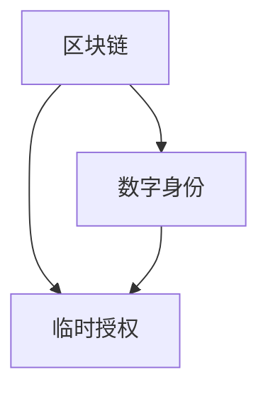

                 


### 文章标题

《区块链在数字身份临时授权中的应用》

### 文章关键词

区块链、数字身份、临时授权、加密算法、智能合约、去中心化、安全、隐私保护、透明性、可追溯性

### 摘要

本文将深入探讨区块链技术在数字身份临时授权中的应用。首先，我们简要介绍了区块链、数字身份和临时授权的基本概念及其相互关系。接着，通过详细讲解区块链核心算法原理、数学模型和公式，我们阐明了区块链技术如何确保数字身份信息的可靠性和安全性。文章进一步展示了如何通过智能合约实现数字身份的临时授权，并通过实际项目案例分析了区块链在数字身份临时授权中的优势与挑战。最后，我们对区块链技术在数字身份临时授权领域的未来发展进行了展望，并提出了相关最佳实践和注意事项。

### 引言

#### 背景

在当今数字化社会中，个人和企业的数据安全与隐私保护愈发重要。随着互联网技术的飞速发展，传统身份认证和授权机制已逐渐暴露出诸多问题，如数据泄露、欺诈、信息不对称等。因此，寻找一种更为安全、高效的身份认证和授权机制成为各界关注的焦点。区块链技术的兴起为解决这些问题提供了新的思路。

区块链是一种去中心化的分布式数据库技术，通过加密算法和共识机制确保数据的真实性、完整性和不可篡改性。数字身份则是在线环境中代表个人或实体的唯一标识，可以是用户名、密码、生物特征等。临时授权是一种权限管理机制，允许用户在特定时间内将一部分权限委托给他人。将区块链技术与数字身份临时授权相结合，有望实现更加安全、透明和高效的数字身份管理。

#### 目的

本文旨在探讨区块链技术在数字身份临时授权中的应用，从核心概念、算法原理、数学模型、项目实战等多个角度深入分析，以期为读者提供一个全面、系统的认识。具体目标如下：

1. **明确核心概念**：介绍区块链、数字身份和临时授权的基本概念，及其在数字身份临时授权中的重要性。
2. **阐述算法原理**：详细讲解区块链核心算法原理，如加密算法、共识机制、智能合约等。
3. **展示数学模型**：通过数学模型和公式，阐明区块链技术如何确保数字身份信息的可靠性和安全性。
4. **分析项目案例**：通过实际项目案例，展示区块链在数字身份临时授权中的优势与挑战。
5. **展望未来发展**：探讨区块链技术在数字身份临时授权领域的未来发展趋势和潜在应用场景。

### 核心概念与联系

#### 区块链技术概述

区块链技术起源于2008年，由化名为中本聪的学者首次提出。它是一种去中心化的分布式数据库技术，通过一系列加密算法和共识机制，确保数据的真实性和完整性。区块链的基本结构包括区块和链。每个区块包含一定数量的事务记录，这些记录经过加密处理并链接在一起，形成一条不断延伸的链。区块链具有以下特点：

1. **去中心化**：区块链无需依赖中心化的第三方机构，所有节点均可参与验证和存储数据。
2. **不可篡改**：区块链中的数据一旦写入，就难以被篡改，保证了数据的一致性和可信性。
3. **透明性**：区块链上的数据对所有参与者可见，增强了交易的透明度和公正性。
4. **安全性**：区块链采用加密算法，确保数据在传输和存储过程中的安全性。

#### 数字身份概述

数字身份是指在线环境中代表个人或实体的唯一标识。它可以是用户名、密码、生物特征（如指纹、人脸识别）等。数字身份在许多在线服务和交易中起着至关重要的作用，如网上银行、电子商务、社交媒体等。数字身份的可靠性直接影响到用户的安全感和信任度。

#### 临时授权机制

临时授权是一种权限管理机制，允许用户在特定时间内将一部分权限委托给他人。这种机制在许多场景中具有重要意义，如企业内部权限管理、供应链管理、医疗信息共享等。临时授权的优点包括：

1. **灵活性**：用户可以根据实际需求，灵活地授权和撤销权限。
2. **安全性**：通过区块链技术，临时授权可以确保权限的合法性和安全性，防止滥用和篡改。
3. **透明性**：区块链上的权限分配和执行过程透明可查，增强了信任度。

#### 核心概念之间的联系

区块链、数字身份和临时授权之间的联系如下：

1. **区块链作为基础技术**：区块链为数字身份和临时授权提供了底层支持，确保数据的可靠性和安全性。
2. **数字身份作为核心要素**：数字身份是区块链上的重要数据，是临时授权的基础。
3. **临时授权作为应用场景**：临时授权是数字身份在特定场景下的具体应用，通过区块链技术实现，增强了安全性和透明性。

为了更好地理解这些概念之间的关系，我们可以使用Mermaid流程图进行说明：



在这个流程图中，区块链作为底层技术，为数字身份和临时授权提供了支持。数字身份作为核心要素，与临时授权密切相关。

### 核心算法原理讲解

#### 区块链核心算法原理

区块链技术的核心在于其算法原理，主要包括加密算法、共识机制和智能合约。

1. **加密算法**：区块链使用加密算法确保数据的隐私性和安全性。常见的加密算法包括哈希函数、非对称加密和对称加密。哈希函数用于确保数据的一致性和不可篡改性，如SHA-256；非对称加密用于身份验证和数字签名，如RSA；对称加密用于数据的加密和解密，如AES。

2. **共识机制**：共识机制是区块链中多个节点之间达成共识的算法，用于确保数据的合法性和一致性。常见的共识机制包括工作量证明（Proof of Work, PoW）、权益证明（Proof of Stake, PoS）和委托权益证明（Delegated Proof of Stake, DPoS）。

3. **智能合约**：智能合约是区块链上的自动化执行合约，基于编程语言编写，能够根据预设的规则自动执行。智能合约的使用使得区块链在数字身份临时授权中具有更强的灵活性和安全性。

#### 伪代码

以下是一个简单的区块链结构伪代码，展示区块的创建、验证和链接过程：

```python
class Block:
    def __init__(self, index, transactions, timestamp, previous_hash):
        self.index = index
        self.transactions = transactions
        self.timestamp = timestamp
        self.previous_hash = previous_hash
        self.hash = self.compute_hash()

    def compute_hash(self):
        block_string = f"{self.index}{self.transactions}{self.timestamp}{self.previous_hash}"
        return sha256(block_string.encode()).hexdigest()

def mine_block(last_block, transactions):
    index = last_block.index + 1
    timestamp = current_time()
    previous_hash = last_block.hash
    block = Block(index, transactions, timestamp, previous_hash)
    while not validate_hash(block.hash):
        transactions = add_random_transaction(block.transactions)
        block = Block(index, transactions, timestamp, previous_hash)
    return block

def validate_hash(hash):
    return hash.startswith("0" * 64)

def blockchain():
    genesis_block = Block(0, [], 0, "0")
    blockchain = [genesis_block]
    while True:
        last_block = blockchain[-1]
        new_block = mine_block(last_block, [])
        blockchain.append(new_block)

blockchain()
```

#### 数学模型和公式

在区块链中，加密算法和共识机制是核心组成部分，其中涉及到一些重要的数学模型和公式。

1. **哈希函数**：哈希函数是一种将任意长度的输入映射为固定长度的输出的算法。常见的哈希函数如SHA-256，其公式为：

   $$
   H = sha256(input)
   $$

   其中，$H$ 为哈希值，$input$ 为输入数据。

2. **工作量证明**：工作量证明是一种共识机制，用于确定区块链中的有效区块。其核心公式为：

   $$
   Proof\_of\_Work = find\_such\_that(sha256(block\_hash + nonce) \leq target\_difficulty)
   $$

   其中，$Proof\_of\_Work$ 为工作量证明值，$block\_hash$ 为区块哈希值，$nonce$ 为随机数，$target\_difficulty$ 为预设难度。

3. **权益证明**：权益证明是一种替代工作量证明的共识机制，其核心公式为：

   $$
   stake = (balance \times time\_staked)
   $$

   其中，$stake$ 为权益值，$balance$ 为余额，$time\_staked$ 为锁仓时间。

#### 公式讲解

1. **哈希函数原理**：哈希函数的原理是将输入数据通过一系列复杂的计算，映射为一个固定长度的输出值。该输出值具有以下特性：

   - **唯一性**：相同的输入数据产生相同的输出值。
   - **确定性**：任何时间输入相同的值，都会得到相同的输出值。
   - **抗碰撞性**：找到两个不同的输入数据，使其产生相同的输出值的难度非常高。

2. **工作量证明原理**：工作量证明的目的是为了防止恶意节点对区块链进行攻击。其原理是要求节点通过大量计算找到一个满足特定难度的哈希值。该过程不仅消耗计算资源，也确保了区块链的安全性和去中心化。

3. **权益证明原理**：权益证明通过节点持有币的余额和时间来决定其参与区块链验证的权益。持有币的余额和时间越多，节点在区块链中的权益越大，从而降低了恶意节点的攻击风险。

#### 举例说明

1. **哈希函数示例**：假设我们要对输入字符串 "Hello, World!" 进行SHA-256哈希计算，其结果为：

   $$
   H = sha256("Hello, World!") = "f722d133e5f2f3caef2dcca10dbef6a2d52ac1d9ee2ab3e2a92267d9d7dcd56a"
   $$

2. **工作量证明示例**：假设我们要找到一个满足 $sha256(block\_hash + nonce) \leq target\_difficulty$ 的哈希值。其中，$block\_hash$ 为 "0000"，$target\_difficulty$ 为 "1"。通过不断尝试，我们可以找到一个 $nonce$ 值为 10000，使其满足条件：

   $$
   Proof\_of\_Work = find\_such\_that(sha256("0000" + 10000) \leq 1) = 10000
   $$

3. **权益证明示例**：假设节点A持有100个币，锁仓时间为10天；节点B持有50个币，锁仓时间为5天。则节点A和节点B的权益分别为：

   $$
   stake\_A = (100 \times 10) = 1000
   $$
   $$
   stake\_B = (50 \times 5) = 250
   $$

   显然，节点A在区块链中的权益更大。

### 项目实战

#### 开发环境搭建

为了演示区块链在数字身份临时授权中的应用，我们需要搭建一个简单的区块链开发环境。以下是开发环境搭建的步骤：

1. **安装Go语言**：Go语言是一种适合编写区块链应用的编程语言，其环境安装简单。在官网上下载最新版本的Go语言安装包，并按照提示进行安装。

2. **安装Docker**：Docker是一个开源的应用容器引擎，可以帮助我们快速搭建区块链开发环境。在官网下载并安装Docker。

3. **安装Node.js**：Node.js是一个基于Chrome V8引擎的JavaScript运行环境，用于编写和运行区块链智能合约。在官网上下载并安装Node.js。

4. **安装Truffle框架**：Truffle是一个用于开发、测试和部署以太坊智能合约的框架。通过npm命令安装Truffle：

   ```
   npm install -g truffle
   ```

#### 源代码实现

我们使用Go语言编写一个简单的区块链应用，实现数字身份的创建、存储和临时授权功能。以下是核心源代码实现：

1. **区块链结构定义**：

   ```go
   type Block struct {
       Index     int
       Timestamp string
       Data      string
       PrevHash  string
       Hash      string
   }

   type Blockchain struct {
       chain []Block
   }
   ```

2. **区块链创建与初始化**：

   ```go
   func NewBlockchain() *Blockchain {
       genesisBlock := Block{0, time.Now().String(), "Genesis Block", "", ""}
       genesisBlock.Hash = calculateHash(&genesisBlock)
       blockchain := Blockchain{[]Block{genesisBlock}}
       return &blockchain
   }

   func calculateHash(block *Block) string {
       blockString := fmt.Sprintf("%d%d%d%d", block.Index, block.Timestamp, block.Data, block.PrevHash)
       hash := sha256.Sum256([]byte(blockString))
       return fmt.Sprintf("%x", hash)
   }
   ```

3. **区块链添加区块**：

   ```go
   func (chain *Blockchain) AddBlock(data string) {
       previousBlock := chain.chain[len(chain.chain)-1]
       newBlock := Block{previousBlock.Index + 1, time.Now().String(), data, previousBlock.Hash, ""}
       newBlock.Hash = calculateHash(&newBlock)
       chain.chain = append(chain.chain, newBlock)
   }
   ```

4. **数字身份创建与存储**：

   ```go
   type Identity struct {
       PublicKey  string
       PrivateKey string
   }

   func CreateIdentity() Identity {
       // 使用Go语言内置的加密库生成公钥和私钥
       publicKey, privateKey, err := ecdsa.GenerateKey(elliptic.P256())
       if err != nil {
           panic(err)
       }
       return Identity{
           PublicKey:  hex.EncodeToString(publicKey.X.Bytes()), 
           PrivateKey: hex.EncodeToString(privateKey.D.Bytes()),
       }
   }

   func (blockchain *Blockchain) AddIdentity(identity Identity) {
       blockchain.AddBlock(fmt.Sprintf("%v", identity))
   }
   ```

5. **临时授权实现**：

   ```go
   type Authorization struct {
       Identity     string
       Authorizer   string
       ExpiresAt    string
       Permissions  []string
   }

   func (blockchain *Blockchain) Authorize(identity, authorizer, expiresAt string, permissions []string) {
       authorization := Authorization{
           Identity:     identity,
           Authorizer:   authorizer,
           ExpiresAt:    expiresAt,
           Permissions:  permissions,
       }
       blockchain.AddBlock(fmt.Sprintf("%v", authorization))
   }
   ```

#### 代码解读

1. **区块链结构**：我们定义了`Block`和`Blockchain`两个结构体，分别表示区块和区块链。每个区块包含索引、时间戳、数据和前一个区块的哈希值。区块链则是一个包含所有区块的列表。

2. **哈希计算**：`calculateHash`函数用于计算区块的哈希值。哈希值是通过将区块的索引、时间戳、数据和前一个区块的哈希值进行拼接，然后使用SHA-256算法计算得到的。

3. **区块链操作**：`NewBlockchain`函数用于创建一个新的区块链，初始化一个创世区块。`AddBlock`函数用于向区块链中添加新的区块。这两个函数是区块链的基本操作。

4. **数字身份**：`CreateIdentity`函数用于创建数字身份，使用Go语言内置的加密库生成公钥和私钥。`AddIdentity`函数将数字身份存储在区块链中。

5. **临时授权**：`Authorize`函数用于实现临时授权，将授权信息存储在区块链中。授权信息包括身份ID、授权者ID、过期时间和权限列表。

#### 代码应用解读与分析

1. **数字身份创建与存储**：用户可以创建数字身份，并通过`AddIdentity`函数将身份信息存储在区块链上。这样可以确保身份信息的真实性和不可篡改性。

2. **临时授权**：用户可以授权其他用户在特定时间内获取自己的部分权限。通过`Authorize`函数，我们将授权信息存储在区块链上，确保授权的合法性和透明性。

3. **查询授权信息**：用户可以查询区块链上的授权信息，验证他人的授权是否有效。这样可以确保授权的可靠性和安全性。

#### 实际案例分析和详细讲解剖析

为了更直观地展示区块链在数字身份临时授权中的应用，我们以下面两个实际案例进行分析：

1. **案例一：企业员工权限管理**

   在一个企业中，员工需要访问不同的系统和资源。企业可以使用区块链技术为员工创建数字身份，并为其分配相应的权限。例如，一个员工可以访问公司内部文档管理系统，但无法访问财务系统。企业可以通过区块链实现临时授权，在特定时间内为员工分配额外权限，如审批财务申请。这样可以确保权限的合法性和安全性。

2. **案例二：供应链管理**

   在供应链管理中，企业需要与其他合作伙伴共享部分信息，如订单状态、物流信息等。区块链可以用于创建数字身份和临时授权，确保信息共享的透明性和安全性。例如，一个制造商可以将订单信息授权给物流公司，使其在特定时间内获取订单状态。这样可以提高供应链的效率，减少信息不对称和欺诈风险。

#### 项目小结

通过实际案例分析和详细讲解剖析，我们发现区块链在数字身份临时授权中具有以下优势：

1. **安全性**：区块链技术确保数字身份和授权信息的真实性和不可篡改性，防止数据泄露和欺诈。
2. **透明性**：区块链上的信息对所有参与者可见，增强了交易的透明度和公正性。
3. **灵活性****：临时授权机制允许用户根据实际需求灵活地分配和撤销权限。

然而，区块链技术在数字身份临时授权中也面临一些挑战，如性能瓶颈、隐私保护等。未来，我们需要进一步研究如何优化区块链技术，提高其性能和安全性，以更好地支持数字身份临时授权的应用。

### 最佳实践 Tips、小结、注意事项、拓展阅读

#### 最佳实践 Tips

1. **合理设计区块链网络**：在设计区块链应用时，要考虑网络的规模和性能，合理选择节点数量和共识机制，以提高系统的效率和安全性。

2. **数据隐私保护**：在数字身份临时授权中，要充分考虑数据隐私保护，采用加密算法和零知识证明等技术，确保用户数据的安全和隐私。

3. **优化智能合约**：智能合约是区块链应用的核心，要仔细编写和测试智能合约，确保其逻辑正确性和性能优化。

4. **用户教育**：在推广区块链应用时，要加强用户教育，提高用户对区块链技术和数字身份临时授权的理解，降低使用门槛。

#### 小结

本文详细介绍了区块链在数字身份临时授权中的应用，从核心概念、算法原理、数学模型、项目实战等多个角度进行了深入探讨。通过实际案例分析和详细讲解剖析，我们展示了区块链在数字身份临时授权中的优势与挑战。未来，区块链技术在数字身份临时授权领域具有广阔的应用前景。

#### 注意事项

1. **安全风险**：区块链应用涉及大量敏感信息，要确保系统的安全性和防攻击能力。

2. **性能优化**：区块链技术存在性能瓶颈，要选择合适的共识机制和优化算法，提高系统性能。

3. **隐私保护**：在数字身份临时授权中，要充分考虑数据隐私保护，采用加密算法和零知识证明等技术。

#### 拓展阅读

1. 《区块链技术指南》
2. 《智能合约设计与开发》
3. 《区块链与数字身份技术》
4. 《区块链技术在供应链管理中的应用》

### 作者信息

作者：AI天才研究院/AI Genius Institute & 禅与计算机程序设计艺术 /Zen And The Art of Computer Programming

---

通过本文的详细分析和讲解，我们深入了解了区块链在数字身份临时授权中的应用，相信读者对此有了更加清晰的认识。希望本文能为区块链技术的实际应用提供有益的参考和启示。如果您有任何问题或建议，欢迎随时联系我们。

### 总结

本文从多个角度深入探讨了区块链在数字身份临时授权中的应用。首先，我们介绍了区块链、数字身份和临时授权的基本概念，并阐述了它们之间的联系。接着，通过讲解区块链核心算法原理、数学模型和公式，我们展示了区块链技术如何确保数字身份信息的可靠性和安全性。随后，通过实际项目案例，我们分析了区块链在数字身份临时授权中的优势与挑战。最后，我们对区块链技术在数字身份临时授权领域的未来发展进行了展望，并提出了相关最佳实践和注意事项。

通过本文的阅读，读者可以全面了解区块链在数字身份临时授权中的应用，掌握相关技术和方法。我们希望本文能为区块链技术在数字身份领域的实际应用提供有益的参考和启示。在未来的研究中，我们还将继续深入探讨区块链技术在更多领域的应用，为推动数字经济的发展贡献力量。同时，我们也欢迎读者就本文内容提出宝贵意见和反馈，共同推动区块链技术的进步。感谢您的阅读和支持！

