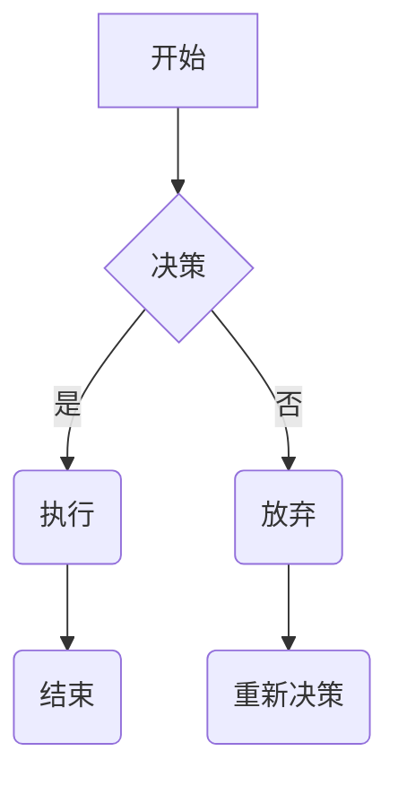
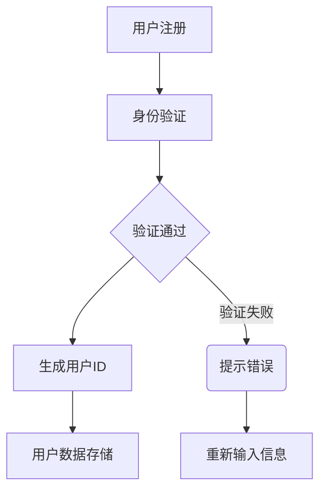

                 


### 文章标题
《去中心化共享平台：新经济模式的技术基础》

### 文章关键词
去中心化共享平台、区块链技术、新经济模式、共享经济、技术基础

### 文章摘要
本文将深入探讨去中心化共享平台作为新经济模式的技术基础。通过分析其背景、核心概念、技术原理、实现路径、安全隐私保护、法律法规及未来展望，本文旨在为读者提供一个全面的技术视角，帮助理解和应用这一新兴经济模式。

---

## 引言

去中心化共享平台是近年来兴起的一种新型经济模式，它依托于区块链等分布式技术，打破了传统的中心化模式，实现了数据的分布式存储、交易的点对点进行以及智能合约的自动化执行。这一模式不仅革新了传统经济模式，也为各行各业带来了新的机遇。

### 书籍背景介绍

去中心化共享平台的兴起与区块链技术的发展密不可分。区块链作为一种分布式数据库技术，其核心优势在于数据的不可篡改性和透明性，这使得区块链成为去中心化共享平台的技术基础。随着区块链技术的不断成熟，越来越多的应用场景涌现出来，如数字货币、智能合约、供应链管理、身份认证等。

### 去中心化共享平台的优势

去中心化共享平台具有以下优势：

1. **数据安全与隐私保护**：通过区块链技术，数据可以在分布式节点上存储，确保数据的安全性和隐私性。
2. **高效的交易与协作**：去中心化的交易模式使得交易过程更加高效，减少了中介环节，降低了交易成本。
3. **激励机制与治理结构**：去中心化共享平台通过智能合约和代币激励，鼓励参与者积极贡献资源，形成了自组织的治理结构。

### 读者对象与预期收获

本篇文章面向对去中心化共享平台和区块链技术感兴趣的读者，包括技术从业者、创业者、政策制定者等。通过阅读本文，读者可以：

1. 了解去中心化共享平台的基本概念和优势。
2. 掌握区块链技术的基础原理和实现机制。
3. 理解去中心化共享平台在新经济模式中的应用和挑战。
4. 获取实际案例和最佳实践经验，为后续研究和应用提供参考。

---

## 去中心化共享平台概述

去中心化共享平台是一种基于区块链等分布式技术的共享经济模式，它通过去中心化的方式实现了资源的高效利用和价值的最大化。本节将介绍去中心化共享平台的基本架构、共享经济的理论基础及其应用领域。

### 平台架构设计

去中心化共享平台的核心在于其去中心化的架构设计。这种架构消除了传统的中心化控制节点，使得平台的数据存储、交易处理和治理都分布在整个网络中的各个节点上。以下是去中心化共享平台的基本架构设计：

1. **节点与网络的组成**：去中心化共享平台由多个节点组成，每个节点都是平等的一员，负责数据的存储、验证和传输。
2. **数据存储与处理**：平台的数据存储在分布式数据库中，通过加密和分布式存储技术确保数据的安全性和隐私性。数据处理也通过分布式计算完成，提高了系统的效率和容错能力。
3. **共识机制与交易验证**：平台采用共识机制来确保所有节点的数据一致性。交易验证则通过加密算法和智能合约实现，确保交易的合法性和安全性。

### 共享经济的理论基础

共享经济是一种基于共享、协作和共赢理念的经济模式，它通过共享资源、知识和技能来创造价值。共享经济的理论基础主要包括以下几个方面：

1. **资源利用最大化**：共享经济通过共享闲置资源，使得资源的利用效率最大化，减少了资源浪费。
2. **协作共赢**：共享经济强调协作和共赢，通过建立一个信任和激励机制，鼓励参与者共享资源、知识和技能。
3. **去中心化治理**：共享经济模式中的治理结构通常是去中心化的，通过智能合约和代币激励实现自治和治理。

### 去中心化共享平台的应用领域

去中心化共享平台已经应用于多个领域，包括但不限于：

1. **金融科技**：如数字货币、去中心化金融（DeFi）、供应链金融等。
2. **物流与供应链**：通过区块链技术实现供应链的可视化和透明化，提高物流效率。
3. **房地产与共享住宿**：如Airbnb、去中心化的房地产交易平台等。
4. **交通出行**：如Uber、Lyft等共享出行平台。
5. **能源领域**：如去中心化的能源交易平台，通过区块链实现能源的分布式管理和交易。

### 案例研究

- **金融科技**：Ethereum上的去中心化金融（DeFi）应用，如Aave和Compound，通过智能合约实现去中心化的借贷和交易。
- **物流与供应链**：VeChain的区块链平台用于食品供应链管理，确保食品来源的透明和安全。
- **房地产与共享住宿**：去中心化的房地产交易平台如Propy，使得房地产交易更加透明和高效。

通过以上案例分析，我们可以看到去中心化共享平台在不同领域的应用，以及其带来的变革和机遇。

---

## 区块链技术基础

区块链技术是去中心化共享平台的核心支柱，理解区块链技术的基本原理对于掌握去中心化共享平台至关重要。本节将详细介绍区块链的基本原理、分布式账本技术、常见区块链平台与协议。

### 区块链的基本原理

区块链是一种分布式数据库，其核心特点是数据的不可篡改性和透明性。区块链由一系列按时间顺序排列的“区块”组成，每个区块包含一定数量的交易记录。以下是区块链的基本原理：

1. **区块**：区块是区块链的基本单元，每个区块包含一定数量的交易记录和区块头。区块头包括时间戳、随机数、前一个区块的哈希值等。
2. **链**：区块链是由多个区块按时间顺序链接而成的链条。每个区块通过其前一个区块的哈希值与区块链的其他部分连接起来，形成了一个不可篡改的数据结构。
3. **共识算法**：共识算法是区块链网络中节点达成共识的关键机制。常见的共识算法有工作量证明（PoW）、权益证明（PoS）、委托权益证明（DPoS）等。

### 分布式账本技术

分布式账本技术是区块链的核心技术之一，它通过分布式节点存储和同步数据，实现了数据的不可篡改性和透明性。以下是分布式账本技术的关键组成部分：

1. **分布式节点**：分布式节点是区块链网络中的基本单元，每个节点都存储了一份完整的区块链数据，并参与数据的验证和同步。
2. **数据存储**：分布式账本技术通过加密和分布式存储技术确保数据的安全性和隐私性。数据存储在分布式节点上，任何单个节点的故障都不会影响整个系统的运行。
3. **数据同步**：分布式节点通过P2P网络同步数据。每个节点接收其他节点的数据更新，并验证数据的合法性和一致性。

### 常见区块链平台与协议

以下是几个常见的区块链平台与协议：

1. **Ethereum**：以太坊是一个开源的区块链平台，支持智能合约和去中心化应用（DApp）。其采用的共识算法是权益证明（PoS）。
2. **Bitcoin**：比特币是一个去中心化的数字货币，其采用的共识算法是工作量证明（PoW）。
3. **Hyperledger Fabric**：Hyperledger Fabric 是一个开源的企业级区块链框架，适用于供应链金融、物联网等领域。
4. **Ripple**：Ripple 是一个去中心化的支付网络，旨在提高跨境支付的速度和效率。

通过以上介绍，我们可以看到区块链技术的基础原理和实现机制，以及常见区块链平台与协议的特点和应用。

### 区块链交易流程

区块链的交易流程包括交易创建、验证、广播和确认等步骤。以下是区块链交易流程的详细解析：

1. **交易创建**：交易是由区块链网络中的用户创建的。交易通常包含发送方的地址、接收方的地址、交易金额以及交易内容等信息。
2. **交易验证**：交易创建后，需要经过验证才能被添加到区块中。验证过程包括检查交易的有效性、确认发送方账户余额是否足够支付交易金额等。
3. **交易广播**：验证后的交易会被广播到整个区块链网络。每个节点都会接收并验证广播的交易，确保交易的有效性和一致性。
4. **交易确认**：交易被多个节点验证后，会被添加到区块链中的新区块中。一旦交易被确认，就不可被篡改。

通过以上交易流程，我们可以看到区块链交易的安全性和可靠性。

### 智能合约的基础

智能合约是一种自动执行的合约，它基于区块链技术，通过代码实现了合同条款的自动化执行。以下是智能合约的基础：

1. **智能合约的基本概念**：智能合约是一种自执行的合约，其条款和条件被嵌入到代码中，一旦触发条件，就会自动执行。
2. **智能合约的实现机制**：智能合约通常基于特定的区块链平台，如Ethereum。智能合约的实现包括编写智能合约代码、部署智能合约以及调用智能合约。
3. **智能合约的安全性**：智能合约的安全性至关重要，任何漏洞都可能被恶意利用。因此，智能合约的设计和开发需要严格的安全审核。

通过以上介绍，我们可以了解智能合约的基础知识，以及其在去中心化共享平台中的应用。

### 常见区块链平台与协议

以下是几个常见的区块链平台与协议：

1. **Ethereum**：以太坊是一个开源的区块链平台，支持智能合约和去中心化应用（DApp）。其采用的共识算法是权益证明（PoS）。
2. **Bitcoin**：比特币是一个去中心化的数字货币，其采用的共识算法是工作量证明（PoW）。
3. **Hyperledger Fabric**：Hyperledger Fabric 是一个开源的企业级区块链框架，适用于供应链金融、物联网等领域。
4. **Ripple**：Ripple 是一个去中心化的支付网络，旨在提高跨境支付的速度和效率。

这些平台与协议各有特点，适用于不同的应用场景。通过了解这些平台与协议，我们可以更好地选择适合自己项目的区块链解决方案。

### 总结

通过本节的介绍，我们了解了区块链技术的基础原理、分布式账本技术、常见区块链平台与协议以及区块链交易流程和智能合约的基础。这些知识为我们深入理解去中心化共享平台奠定了基础。

---

## 共享经济模式与去中心化平台的实现

共享经济模式与去中心化平台相结合，形成了一种新的经济生态系统。本节将探讨共享经济模式与去中心化平台的实现路径、业务流程以及案例分析。

### 共享经济模式的实现路径

去中心化共享平台的实现路径包括以下几个关键步骤：

1. **平台搭建**：首先需要搭建一个去中心化的共享平台，包括前端用户界面、后端服务器以及区块链网络。
2. **用户行为与激励机制的设计**：为了鼓励用户参与共享经济，需要设计合理的用户行为激励机制，如代币奖励、积分制度等。
3. **数据隐私与安全保护**：保护用户数据的隐私和安全是去中心化共享平台的重要任务，需要采用加密和分布式存储技术。
4. **治理结构与决策机制**：去中心化共享平台需要建立一套有效的治理结构和决策机制，以确保平台的可持续发展。

### 去中心化平台的业务流程

去中心化平台的业务流程通常包括以下几个阶段：

1. **资源注册**：用户将闲置资源（如房产、车辆、劳动力等）注册到平台上，平台对这些资源进行认证和标记。
2. **交易请求**：用户在平台上发布交易请求，说明所需资源的需求和条件。
3. **交易匹配**：平台通过智能合约和共识算法，自动匹配供需双方，确保交易的高效和公平。
4. **交易执行**：供需双方通过区块链网络完成交易，资金和资源在区块链上进行转移。
5. **交易确认**：交易完成后，平台记录交易信息，确保交易的可追溯性和不可篡改性。

### 案例研究

1. **共享住宿平台**：Airbnb 是共享住宿平台的代表。Airbnb 通过去中心化的方式，将房东和房客连接起来，实现了闲置房屋的共享和高效利用。用户可以在平台上注册、发布房源，并通过智能合约完成交易。
   
   **案例分析**：
   - **优点**：Airbnb 通过去中心化的方式，降低了中介费用，提高了交易效率，同时也为房东和房客提供了更多的选择。
   - **挑战**：隐私保护和安全问题仍然是Airbnb面临的主要挑战，特别是在用户数据的保护和交易的安全性方面。

2. **共享出行平台**：Uber 和 Lyft 是共享出行平台的代表。这些平台通过去中心化的方式，将乘客和司机连接起来，实现了出行服务的共享和高效利用。

   **案例分析**：
   - **优点**：Uber 和 Lyft 通过去中心化的方式，提高了出行服务的效率和灵活性，同时也为司机提供了更多的工作机会。
   - **挑战**：在法律和政策方面，共享出行平台面临监管和合规性的挑战。

3. **共享办公平台**：WeWork 是共享办公平台的代表。WeWork 通过去中心化的方式，将办公室空间共享给创业者和小型企业，实现了办公空间的共享和高效利用。

   **案例分析**：
   - **优点**：WeWork 通过去中心化的方式，为创业者和小型企业提供了灵活的办公空间，降低了创业成本。
   - **挑战**：在管理和运营方面，WeWork 面临着如何保证办公空间的质量和服务水平的问题。

通过以上案例研究，我们可以看到共享经济模式与去中心化平台的实现路径、业务流程以及面临的挑战。这些案例为我们提供了实际操作的经验和教训，也为未来去中心化共享平台的发展提供了参考。

---

## 去中心化共享平台的安全与隐私保护

去中心化共享平台在带来巨大潜力和机会的同时，也面临着一系列安全与隐私保护问题。本节将深入探讨去中心化共享平台在安全与隐私保护方面所面临的威胁、防护措施及隐私保护机制。

### 安全性威胁分析

去中心化共享平台可能面临以下几种主要安全性威胁：

1. **DDoS攻击**：分布式拒绝服务攻击（DDoS）是一种常见的网络攻击方式，攻击者通过大量虚假请求使平台服务瘫痪，导致平台无法正常提供服务。
2. **51%攻击**：在区块链网络中，如果一个实体控制了网络中超过50%的算力，它可以发动51%攻击，篡改区块链数据，从而对整个网络造成威胁。
3. **智能合约漏洞**：智能合约代码可能存在漏洞，恶意用户可以利用这些漏洞执行非法操作，从而对平台造成损失。

### 安全防护措施

针对上述安全性威胁，去中心化共享平台可以采取以下安全防护措施：

1. **防火墙与入侵检测**：通过设置防火墙和入侵检测系统，对平台进行实时监控，及时阻止恶意攻击。
2. **非对称加密与数字签名**：使用非对称加密和数字签名技术，确保数据的机密性和完整性，防止数据在传输过程中被篡改。
3. **安全审计与合规性检查**：定期对智能合约和系统进行安全审计，确保其符合安全标准和合规要求。

### 隐私保护机制

去中心化共享平台在隐私保护方面也需要采取一系列措施：

1. **隐私计算技术**：利用隐私计算技术，如同态加密、安全多方计算等，确保在数据处理过程中保护用户隐私。
2. **匿名交易与零知识证明**：采用匿名交易和零知识证明技术，确保用户在交易过程中的隐私不受泄露。
3. **隐私数据的利用与限制**：对用户数据进行严格的管理和限制，仅在使用时才进行读取和处理，防止数据滥用。

通过以上措施，去中心化共享平台可以在确保数据安全的同时，保护用户的隐私。

### 案例研究

- **案例一：以太坊的DAO攻击**：2016年，以太坊上的DAO（去中心化自治组织）遭受了攻击，黑客利用智能合约漏洞盗取了大量以太币。此次攻击揭示了智能合约安全性的重要问题，促使以太坊社区进行了硬分叉，以挽回损失。
- **案例二：Coinbase的DDoS攻击**：2021年，Coinbase遭受了一次大规模的DDoS攻击，导致其服务中断。Coinbase通过快速响应和部署额外的防御措施，最终恢复了服务。

通过这些案例分析，我们可以看到去中心化共享平台在安全与隐私保护方面所面临的挑战，以及如何通过技术和管理手段应对这些挑战。

### 总结

通过本节的探讨，我们了解了去中心化共享平台在安全与隐私保护方面所面临的威胁、防护措施及隐私保护机制。这些措施和机制为去中心化共享平台的稳定运行提供了保障，同时也为用户提供了更加安全和隐私的保护。

---

## 法律法规与政策环境

去中心化共享平台作为新兴经济模式，其发展受到各国法律法规及政策环境的影响。本节将探讨区块链与共享经济的法律法规、政策环境及其对去中心化共享平台的影响。

### 区块链与共享经济的法律法规

不同国家对区块链和共享经济的法律法规存在较大差异。以下是一些主要国家和地区的相关法律法规：

1. **美国**：美国对区块链和共享经济的监管相对严格，主要涉及证券法、消费者保护法等。例如，证券交易委员会（SEC）对首次代币发行（ICO）进行了严格监管。
2. **中国**：中国政府对区块链技术持支持态度，但同时对加密货币进行严格监管。中国禁止加密货币交易和ICO，并对区块链项目进行严格审查。
3. **欧洲**：欧盟推出了《市场滥用条例》、《反洗钱指令》等法律法规，对区块链和共享经济进行规范。此外，欧盟还在研究《数字市场法》和《数字服务法》等新法规。
4. **澳大利亚**：澳大利亚证券和投资委员会（ASIC）对加密货币和区块链项目进行监管，要求项目必须注册或豁免注册。

### 政策环境与行业发展趋势

政策环境对去中心化共享平台的发展具有重要影响。以下是一些国家和地区在政策环境方面的举措：

1. **新加坡**：新加坡政府积极推动区块链技术的发展，通过立法和政策支持，吸引了大量区块链企业和项目落地。
2. **瑞士**：瑞士政府推出了“区块链山谷”计划，旨在打造全球领先的区块链生态系统。瑞士的税收优惠政策和金融监管沙盒为区块链项目提供了良好的发展环境。
3. **加拿大**：加拿大政府通过《数字货币与交换法》对加密货币进行监管，同时支持区块链技术的发展和应用。
4. **中国**：中国政府在严格监管加密货币的同时，鼓励区块链技术在供应链金融、电子政务等领域的应用。

### 去中心化共享平台的合规性要求

去中心化共享平台在运营过程中需要遵守相关法律法规，以确保合规性。以下是一些关键合规性要求：

1. **数据保护**：平台需要确保用户数据的安全和隐私，遵守数据保护法律法规，如《通用数据保护条例》（GDPR）。
2. **反洗钱（AML）**：平台需要建立AML系统，监测并报告可疑交易，以防止洗钱等违法行为。
3. **税务合规**：平台需要遵守所在地区的税务法规，对交易和收入进行正确申报。

### 法律风险与管理策略

去中心化共享平台面临的法律风险主要包括：

1. **法律不确定性**：由于区块链技术尚处于发展初期，相关法律法规尚未完善，平台面临法律不确定性的风险。
2. **监管合规风险**：平台需要密切关注法律法规的变化，确保合规运营。
3. **知识产权风险**：平台需要保护自己的知识产权，防止侵权行为。

为应对法律风险，平台可以采取以下管理策略：

1. **合规性审计**：定期进行合规性审计，确保平台符合相关法律法规要求。
2. **法律咨询**：聘请专业法律顾问，及时获取法律建议，降低法律风险。
3. **技术合规**：采用技术手段确保平台在技术层面符合法律法规要求，如数据加密、隐私保护等。

### 行业发展趋势

随着区块链技术的不断成熟和广泛应用，去中心化共享平台的发展趋势包括：

1. **行业融合**：去中心化共享平台与其他行业（如金融、物流、医疗等）的融合，推动跨行业应用的发展。
2. **跨境合作**：全球范围内的跨境合作和贸易，推动去中心化共享平台的国际化发展。
3. **技术创新**：不断涌现的新技术和应用场景，为去中心化共享平台带来新的发展机遇。

### 案例研究

- **案例一：美国SEC对加密货币的监管**：美国证券交易委员会（SEC）对加密货币和区块链项目进行了严格监管，要求项目必须遵守证券法，对首次代币发行（ICO）进行审查。
- **案例二：中国对加密货币的禁令**：中国政府禁止加密货币交易和ICO，并对相关平台进行了严厉打击，以防范金融风险。

通过以上分析，我们可以看到法律法规和政策环境对去中心化共享平台的发展具有重要影响。平台需要密切关注政策变化，确保合规运营，同时把握行业发展趋势，寻求创新和发展机遇。

---

## 未来展望与挑战

去中心化共享平台作为新经济模式的核心技术，其发展前景广阔，但也面临诸多挑战。本节将探讨去中心化共享平台的技术发展趋势、面临的挑战以及长期发展展望。

### 技术发展趋势

去中心化共享平台的技术发展趋势包括以下几个方面：

1. **区块链技术的演进**：随着区块链技术的不断成熟，未来将出现更多高性能、高可扩展性的区块链平台。例如，基于分层架构的区块链、分布式存储技术等，将进一步提升区块链的性能和可扩展性。
2. **智能合约的进步**：智能合约技术的不断发展将使其功能更加丰富，支持更复杂的业务逻辑。例如，基于智能合约的自动化交易、智能合约治理等，将提高去中心化共享平台的安全性和效率。
3. **隐私保护技术的应用**：随着隐私保护需求的增加，隐私计算技术、零知识证明等将在去中心化共享平台中得到更广泛的应用，确保用户隐私和数据安全。
4. **跨链技术的发展**：跨链技术将实现不同区块链平台之间的互操作性和数据共享，推动区块链生态系统的融合与发展。

### 面临的挑战

去中心化共享平台在发展过程中面临以下主要挑战：

1. **技术成熟度**：尽管区块链技术在不断发展，但其性能和可扩展性仍需提升，以满足大规模商业应用的需求。
2. **监管合规**：不同国家和地区的法律法规存在差异，去中心化共享平台需要应对复杂的监管环境，确保合规运营。
3. **用户隐私保护**：在去中心化共享平台中，用户隐私保护是一项重要任务。如何平衡数据共享和用户隐私保护，是一个亟待解决的问题。
4. **安全风险**：去中心化共享平台面临各种安全威胁，如DDoS攻击、智能合约漏洞等，如何确保平台的安全性和稳定性，是一个重要挑战。

### 长期发展展望

去中心化共享平台的长期发展展望包括以下几个方面：

1. **行业融合**：随着区块链技术的普及，去中心化共享平台将在更多行业得到应用，如金融、物流、医疗等，推动行业变革和创新。
2. **国际化发展**：全球范围内的跨境合作和贸易将推动去中心化共享平台的国际化发展，为全球用户和商家提供更加高效和透明的服务。
3. **技术创新**：不断涌现的新技术和应用场景将为去中心化共享平台带来新的发展机遇，推动平台不断演进和优化。
4. **治理模式创新**：去中心化共享平台将探索更加高效和公正的治理模式，通过智能合约和代币激励等手段，实现平台自治和可持续发展。

通过以上分析，我们可以看到去中心化共享平台在未来将面临诸多挑战，但同时也拥有广阔的发展前景。随着技术的不断进步和行业生态的完善，去中心化共享平台有望成为新经济模式的重要驱动力，为全球用户和商家创造更多价值。

---

## 附录

### 附录A 常用工具与资源

以下是去中心化共享平台开发和研究中常用的一些工具和资源：

1. **区块链开发框架**：Ethereum、Hyperledger Fabric、Ripple、EOSIO等。
2. **智能合约开发工具**：Truffle、Remix、Hardhat等。
3. **区块链节点工具**：Geth、Parity、Nodle等。
4. **区块链浏览器**：Etherscan、BscScan、Blockchair等。
5. **加密货币钱包**：MetaMask、MyEtherWallet、Ledger等。
6. **区块链开源项目**：IPFS、LibP2P、The Graph等。
7. **法律法规与政策研究**：CoinDesk、Blockchain Association、国际电信联盟等。

### 附录B Mermaid 流程图

以下是几个常用的Mermaid流程图示例：





### 附录C 伪代码与数学模型

以下是去中心化共享平台中常见的一些伪代码和数学模型：

**伪代码：智能合约执行**

```
function executeContract(transaction) {
  if (validateTransaction(transaction)) {
    performAction(transaction);
    log("Transaction executed successfully");
  } else {
    log("Invalid transaction");
  }
}

function validateTransaction(transaction) {
  return transaction.amount > 0 && transaction.senderAddress != transaction.receiverAddress;
}

function performAction(transaction) {
  transferFunds(transaction.senderAddress, transaction.receiverAddress, transaction.amount);
}

function transferFunds(sender, receiver, amount) {
  // 转账逻辑
}
```

**数学模型：去中心化共享平台的交易费用**

$$ C = \alpha \cdot T + \beta \cdot N $$

其中，\( C \) 是交易费用，\( \alpha \) 和 \( \beta \) 是与网络流量和节点数量相关的参数，\( T \) 是交易次数，\( N \) 是参与节点的数量。

### 附录D 实际案例代码解读

以下是一个基于Ethereum的智能合约示例，用于去中心化共享平台的资源租赁：

```solidity
// SPDX-License-Identifier: MIT
pragma solidity ^0.8.0;

contract ResourceRental {
    mapping(address => mapping(address => uint256)) public rentals;

    function rentResource(address resourceOwner, uint256 amount) external payable {
        require(resourceOwner != msg.sender, "Cannot rent from oneself");
        require(msg.value > 0, "Amount must be greater than zero");

        rentals[resourceOwner][msg.sender] += amount;
        payable(resourceOwner).transfer(amount);
    }

    function returnResource(address resourceOwner, uint256 amount) external {
        require(rentals[resourceOwner][msg.sender] >= amount, "Insufficient balance");

        rentals[resourceOwner][msg.sender] -= amount;
        msg.sender.transfer(amount);
    }

    function getResourceBalance(address resourceOwner, address renter) public view returns (uint256) {
        return rentals[resourceOwner][renter];
    }
}
```

**代码解读**：

- **rentResource**：用户通过调用此函数向资源所有者支付租赁费用，并更新租赁记录。
- **returnResource**：用户通过调用此函数退还资源，并退还租赁费用。
- **getResourceBalance**：用于查询用户在某资源上的租赁余额。

### 附录E 最佳实践 Tips

以下是去中心化共享平台开发中的最佳实践建议：

1. **安全性优先**：在设计智能合约和平台架构时，优先考虑安全性，确保系统稳健可靠。
2. **用户隐私保护**：在设计平台时，充分考虑到用户隐私保护，采用加密和匿名交易等技术。
3. **合规性审查**：定期对智能合约和平台进行合规性审查，确保符合相关法律法规要求。
4. **测试与审计**：进行充分的测试和第三方审计，确保平台的性能和安全性。
5. **社区参与**：鼓励社区参与，提高平台的透明度和可信度。

通过以上最佳实践，可以帮助开发者和运营者构建更加安全、可靠和可持续发展的去中心化共享平台。

---

## 结语

作者：AI天才研究院/AI Genius Institute & 禅与计算机程序设计艺术 /Zen And The Art of Computer Programming

本文详细探讨了去中心化共享平台作为新经济模式的技术基础，包括其背景、核心概念、技术原理、实现路径、安全与隐私保护、法律法规及未来展望。通过对区块链技术、共享经济模式以及实际案例的研究，本文为读者提供了一个全面的技术视角，帮助理解这一新兴经济模式。随着技术的不断进步和行业生态的完善，去中心化共享平台有望成为推动经济发展的重要力量，为全球用户和商家创造更多价值。希望本文能够为读者带来启发和思考，共同探索去中心化共享平台的未来发展。

