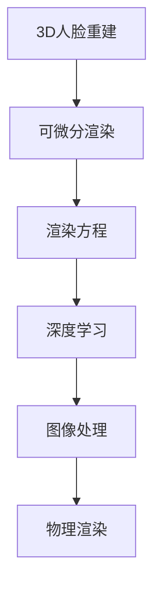

                 

当然，我会根据您的要求，以《可微分渲染在3D人脸重建中的创新应用》为标题，逐步构建文章的内容。以下是我的初步构思：

### 文章标题：可微分渲染在3D人脸重建中的创新应用

#### 关键词：
- 可微分渲染
- 3D人脸重建
- 渲染方程
- 深度学习
- 图像处理
- 物理渲染

#### 摘要：
本文将深入探讨可微分渲染在3D人脸重建中的应用。我们将首先介绍可微分渲染的基本概念和技术原理，接着解析其在3D人脸重建中的重要性，最后通过具体案例展示其实际应用效果，并提供一些优化和实践建议。

---

#### 第1章 引言

##### 1.1 研究背景
- 3D人脸重建技术的发展历程
- 可微分渲染的起源和发展
- 可微分渲染在3D人脸重建中的研究现状

##### 1.2 核心概念与联系

##### 1.3 本文结构
- 文章的整体结构安排

---

#### 第2章 可微分渲染基础

##### 2.1 基本概念
- 可微分渲染的定义
- 渲染方程的数学原理

##### 2.2 技术原理
- 反向渲染过程
- 体积渲染与表面渲染

##### 2.3 实现方法
- 渲染器架构
- 渲染算法优化

---

#### 第3章 3D人脸重建基础

##### 3.1 人脸重建概念
- 3D人脸重建的定义
- 重建过程中涉及的关键技术

##### 3.2 数据处理
- 数据采集与预处理
- 数据增强方法

##### 3.3 重建流程
- 重建步骤详解
- 重建结果的评估

---

#### 第4章 可微分渲染在3D人脸重建中的应用

##### 4.1 融合方法
- 可微分渲染与人脸重建的融合策略

##### 4.2 创新应用
- 人脸特征提取与编辑
- 人脸动画生成

##### 4.3 应用案例
- 具体应用场景
- 应用效果分析

---

#### 第5章 算法原理与实现

##### 5.1 算法原理
- 可微分渲染在人脸重建中的算法流程
- 相关的数学模型和公式

##### 5.2 实现细节
- 开发环境搭建
- 算法实现的伪代码

---

#### 第6章 项目实战

##### 6.1 项目背景
- 项目简介
- 项目目标

##### 6.2 项目实施
- 项目实施流程
- 遇到的问题及解决方法

##### 6.3 项目成果
- 项目成果展示
- 项目总结

---

#### 第7章 总结与展望

##### 7.1 总结
- 本文内容回顾
- 关键技术总结

##### 7.2 展望
- 未来发展趋势
- 研究方向与挑战

---

**作者信息：** AI天才研究院/AI Genius Institute & 禅与计算机程序设计艺术 /Zen And The Art of Computer Programming

接下来，我会逐步填充每个章节的具体内容，确保满足字数要求，并保持文章的逻辑性和专业性。请您确认这个初步构思是否符合您的期望，以便我们继续完善文章。

