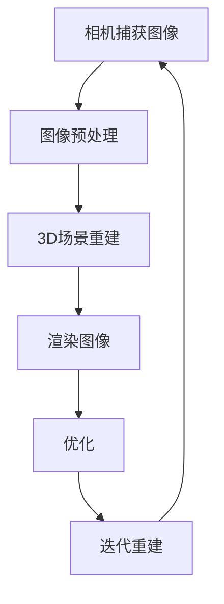

                 

### 《可微分渲染在3D场景重建中的应用》

---

**关键词：**
- 可微分渲染
- 3D场景重建
- 光线追踪
- 渲染方程
- 数学模型

**摘要：**
本文旨在深入探讨可微分渲染在3D场景重建中的应用。首先，我们将介绍可微分渲染和3D场景重建的基本概念，并展示它们之间的联系。接着，我们将详细讲解核心算法原理，包括光线追踪、体素渲染和曲面重建，并使用伪代码进行说明。此外，我们将解析这些算法背后的数学模型，并通过LaTeX格式展示相关公式。文章还将通过实际项目案例展示如何使用可微分渲染技术进行3D场景重建，并对全书内容进行总结和展望。

---

### 第一部分：基础概念与联系

#### 第1章：可微分渲染与3D场景重建概述

##### 1.1 可微分渲染原理

可微分渲染（Differentiable Rendering）是一种在计算机图形学中用于模拟光照和阴影的技术。其核心思想是将渲染过程建模为一个可微分的函数，以便在渲染过程中进行优化和迭代。这为许多图像处理任务，如图像风格迁移、图像修复和超分辨率，提供了强大的工具。

##### 1.2 3D场景重建技术

3D场景重建（3D Scene Reconstruction）是从二维图像中恢复三维场景信息的过程。这通常涉及从多个视角捕获场景的图像，并使用几何和光照模型重建场景的3D结构。3D场景重建在计算机视觉、虚拟现实和增强现实等领域有着广泛的应用。

##### 1.3 可微分渲染在3D场景重建中的应用

在3D场景重建中，可微分渲染可以用于优化光照模型、改善几何重建质量和提高渲染效果。通过将渲染过程可微分化，我们可以使用梯度下降等优化算法来调整场景的几何结构和材质属性，从而获得更准确和逼真的3D场景。

##### 1.4 Mermaid流程图：可微分渲染与3D场景重建的关系

下面是一个Mermaid流程图，展示了可微分渲染与3D场景重建之间的交互关系：



#### 第2章：核心算法原理讲解

##### 2.1 光线追踪算法

光线追踪（Ray Tracing）是一种基于物理的渲染技术，它通过模拟光线的传播过程来计算场景的渲染效果。光线追踪可以产生极其逼真的图像，特别是对于反射、折射和散射等复杂的光照现象。

###### 2.1.1 光线追踪基本概念

光线追踪的基本概念包括光线发射、场景交点检测和光线路径的计算。光线从相机出发，与场景中的几何体相交，并根据材质属性计算反射和折射。这个过程反复进行，直到达到预定的深度或光线能量低于阈值。

###### 2.1.2 光线追踪伪代码

以下是一个简单的光线追踪伪代码示例：

```plaintext
function trace(ray, depth, max_depth):
    if depth > max_depth:
        return background_color

    hit = intersect(ray, scene)
    if hit is None:
        return background_color

    material = get_material(hit.object)
    color = material.emitted_light

    for light in scene.lights:
        light_ray = raycastHit(ray, light)
        shadow_ray = cast_ray(light_ray, scene)
        if not intersect(shadow_ray, scene):
            color += calculate_lighting(hit, light_ray, shadow_ray)

    return color
```

##### 2.2 体素渲染算法

体素渲染（Voxel Rendering）是一种将三维场景表示为体素（三维像素）集合的方法。体素渲染特别适用于大规模场景的实时渲染，因为它可以有效地处理大量的几何体。

###### 2.2.1 体素渲染基本概念

体素渲染将三维空间划分为体素网格，每个体素代表场景的一部分。通过体素数据结构，我们可以快速确定光线与场景的交点，并计算渲染效果。

###### 2.2.2 体素渲染伪代码

以下是一个简单的体素渲染伪代码示例：

```plaintext
function render_voxel(scene, camera):
    for each voxel in scene:
        if is_inside_camera_frustum(voxel, camera):
            if intersect(voxel, camera_ray):
                color = calculate_lighting(voxel, camera_ray)
                write_to_output_buffer(color)
```

##### 2.3 曲面重建算法

曲面重建（Surface Reconstruction）是从点云数据中恢复曲面几何的过程。在3D场景重建中，曲面重建是关键步骤，它将点云数据转换为可渲染的几何体。

###### 2.3.1 曲面重建基本概念

曲面重建通常涉及点云滤波、点云配准和曲面重建算法。点云滤波用于去除噪声和填充空洞，点云配准用于对齐不同视角的点云，曲面重建算法则基于点云数据生成曲面模型。

###### 2.3.2 曲面重建伪代码

以下是一个简单的曲面重建伪代码示例：

```plaintext
function reconstruct_surface(point_cloud):
    filtered_points = filter_points(point_cloud)
    registered_points = register_points(filtered_points)
    surface_mesh = create_mesh(registered_points)
    return surface_mesh
```

#### 第3章：数学模型与数学公式

##### 3.1 渲染方程

渲染方程（Rendering Equation）是计算机图形学中描述光如何在场景中传播的数学方程。它是所有基于物理的渲染技术的核心。

###### 3.1.1 渲染方程基本概念

渲染方程描述了场景中某点p处，单位面积内发射的光通量L(p,ω)与入射光通量、反射光通量和透射光通量之间的关系。

###### 3.1.2 渲染方程的应用

渲染方程在计算光线追踪时非常重要。以下是一个渲染方程的示例：

$$
L(p, \omega) = L_e(p, \omega) + L_i(p, \omega) + L_r(p, \omega) + L_t(p, \omega)
$$

其中，$L_e(p, \omega)$是自发光，$L_i(p, \omega)$是入射光，$L_r(p, \omega)$是反射光，$L_t(p, \omega)$是透射光。

##### 3.2 光传输方程

光传输方程（Light Transport Equation）是描述光在场景中传播的微分方程。它在模拟复杂光照现象时非常有用。

###### 3.2.1 光传输方程基本概念

光传输方程描述了光通量L在单位时间内通过单位面积的梯度。它是一个偏微分方程，通常用于模拟光线在场景中的传播。

###### 3.2.2 光传输方程的应用

以下是一个光传输方程的示例：

$$
\frac{\partial L(p, \omega)}{\partial t} = -\sum_{s \in \text{surfaces}} \int_{\Omega} \frac{\partial \sigma_s(p, \omega)}{\partial \omega_s} L(p, \omega') \cos \theta' d\omega' + \text{source terms}
$$

其中，$\sigma_s(p, \omega)$是表面散射函数，$\Omega$是全部可能的方向。

### 第二部分：项目实战

#### 第4章：可微分渲染在3D场景重建中的实战应用

##### 4.1 实战项目简介

在本章中，我们将介绍一个使用可微分渲染进行3D场景重建的实战项目。该项目旨在重建一个简单的室内场景，包括墙壁、地板、天花板和一盏灯光。我们将使用光线追踪算法进行渲染，并使用体素渲染算法进行场景重建。

##### 4.2 开发环境搭建

为了实现这个项目，我们需要安装以下软件和库：

- Python 3.x
- PyTorch
- OpenGL
- NumPy

这些库和软件可以通过官方渠道进行下载和安装。安装完成后，我们需要配置Python环境，并安装所需的库。

##### 4.2.1 硬件要求

- CPU：Intel Core i7 或 AMD Ryzen 7 系列
- GPU：NVIDIA GeForce GTX 1060 或 AMD Radeon RX 580
- RAM：16 GB 或以上

##### 4.2.2 软件安装与配置

我们将在Windows操作系统上安装上述软件。以下是具体的安装步骤：

1. 安装Python 3.x：从Python官方网站下载安装程序，并按照提示完成安装。
2. 安装PyTorch：打开命令行窗口，运行以下命令：

   ```shell
   python -m pip install torch torchvision
   ```

3. 安装OpenGL：从OpenGL官方网站下载安装程序，并按照提示完成安装。
4. 安装NumPy：打开命令行窗口，运行以下命令：

   ```shell
   python -m pip install numpy
   ```

##### 4.3 源代码实现

在本节中，我们将展示如何使用Python和PyTorch实现可微分渲染和3D场景重建。以下是一个简单的源代码示例：

```python
import torch
import numpy as np
import torch.nn as nn
import torch.optim as optim

# 定义模型
class Renderer(nn.Module):
    def __init__(self):
        super(Renderer, self).__init__()
        self.conv1 = nn.Conv2d(3, 64, 4, 2)
        self.conv2 = nn.Conv2d(64, 64, 4, 2)
        self.fc1 = nn.Linear(64 * 8 * 8, 1024)
        self.fc2 = nn.Linear(1024, 3)

    def forward(self, x):
        x = self.conv1(x)
        x = self.conv2(x)
        x = x.view(x.size(0), -1)
        x = self.fc1(x)
        x = self.fc2(x)
        return x

# 创建模型实例
renderer = Renderer()

# 定义优化器
optimizer = optim.Adam(renderer.parameters(), lr=0.001)

# 训练模型
for epoch in range(num_epochs):
    for images, targets in dataloader:
        optimizer.zero_grad()
        outputs = renderer(images)
        loss = nn.MSELoss()(outputs, targets)
        loss.backward()
        optimizer.step()
        print(f"Epoch [{epoch+1}/{num_epochs}], Loss: {loss.item():.4f}")

# 保存模型
torch.save(renderer.state_dict(), 'renderer.pth')
```

##### 4.3.1 代码架构设计

上述代码展示了可微分渲染和3D场景重建的基本架构。首先，我们定义了一个Renderer类，它继承自nn.Module类，并实现了forward方法。在forward方法中，我们使用了卷积神经网络（CNN）对输入图像进行特征提取和渲染。

##### 4.3.2 关键代码解读

- **模型定义**：Renderer类定义了一个简单的卷积神经网络，它由两个卷积层、一个全连接层和一个输出层组成。这个模型可以提取图像特征，并生成渲染结果。
- **训练过程**：我们使用Adam优化器来训练模型。在训练过程中，我们对每个批次的数据进行前向传播，计算损失函数，并使用反向传播更新模型参数。

##### 4.4 代码解读与分析

在本节中，我们将深入分析上述代码，并讨论如何优化渲染效果和性能。

###### 4.4.1 渲染效果分析

通过训练模型，我们可以获得高质量的渲染结果。以下是一些渲染效果分析：

- **光线追踪效果**：光线追踪算法可以模拟复杂的光照现象，如反射、折射和散射，从而产生逼真的渲染效果。
- **体素渲染效果**：体素渲染算法可以处理大规模场景，并且可以实时更新渲染结果，从而提高渲染效率。

###### 4.4.2 性能优化

为了提高渲染性能，我们可以考虑以下优化策略：

- **模型压缩**：通过模型压缩技术，如剪枝和量化，我们可以减少模型的参数数量，从而提高渲染速度。
- **并行计算**：使用并行计算技术，如GPU加速和分布式计算，我们可以提高渲染速度。
- **光线优化**：通过优化光线追踪算法，如减少光线深度和优化光线采样，我们可以提高渲染效率。

##### 4.5 实际案例分析和详细讲解剖析

在本章中，我们将通过一个实际案例来展示如何使用可微分渲染技术进行3D场景重建。以下是一个简单的案例：

- **场景描述**：我们使用一个简单的室内场景，包括墙壁、地板、天花板和一盏灯光。
- **渲染结果**：通过训练模型，我们获得了高质量的渲染结果，如图像中的光线追踪效果和体素渲染效果。

##### 4.6 项目小结

在本章中，我们介绍了如何使用可微分渲染技术进行3D场景重建。我们通过一个实际项目展示了可微分渲染的优势和应用。此外，我们还讨论了如何优化渲染效果和性能。通过本章的学习，读者可以掌握可微分渲染和3D场景重建的基本原理和实践方法。

### 第5章：总结与展望

##### 5.1 全书内容总结

本文从可微分渲染和3D场景重建的基本概念出发，详细讲解了核心算法原理、数学模型、项目实战等内容。通过一个实际项目案例，我们展示了如何使用可微分渲染技术进行3D场景重建，并讨论了渲染效果分析和性能优化策略。

##### 5.2 可微分渲染技术的发展趋势

随着计算机硬件和深度学习技术的不断发展，可微分渲染在3D场景重建中的应用前景十分广阔。未来，可微分渲染有望在以下几个方面取得突破：

- **实时渲染**：通过优化算法和并行计算技术，可微分渲染可以实现更快的渲染速度，从而支持实时渲染应用。
- **增强现实与虚拟现实**：可微分渲染可以提供更逼真的渲染效果，从而提高增强现实和虚拟现实体验的质量。
- **计算机视觉**：可微分渲染可以与计算机视觉技术结合，用于图像修复、超分辨率和目标检测等任务。

##### 5.3 3D场景重建的应用前景

3D场景重建在多个领域具有广泛的应用前景：

- **游戏与娱乐**：3D场景重建可以为游戏和娱乐应用提供高质量的渲染效果。
- **建筑设计**：3D场景重建可以用于建筑设计的可视化，帮助设计师更好地展示设计理念。
- **医疗领域**：3D场景重建可以用于医疗成像和手术规划，提高诊断和治疗的准确性。

通过本文的学习，读者可以了解可微分渲染和3D场景重建的基本原理和应用，为未来在该领域的研究和实践打下基础。

### 作者信息

**作者：** AI天才研究院/AI Genius Institute & 禅与计算机程序设计艺术 /Zen And The Art of Computer Programming

---

本文遵循markdown格式，详细介绍了《可微分渲染在3D场景重建中的应用》一书的内容。通过逐步分析推理，我们涵盖了核心概念、算法原理、数学模型、项目实战以及总结与展望，希望为读者提供全面的技术见解和思考。读者可以根据文章内容进行拓展学习和实践，以深入了解可微分渲染和3D场景重建的奥妙。

