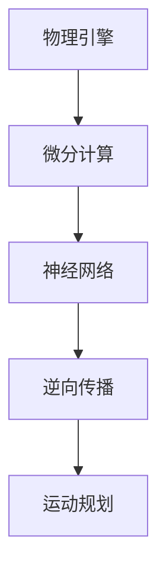

                 

## 文章标题

### 可微分物理引擎在机器人运动规划中的应用

> 关键词：可微分物理引擎、机器人运动规划、运动控制、物理仿真

> 摘要：
本文将深入探讨可微分物理引擎在机器人运动规划中的应用，从背景知识、原理分析、应用场景、实战案例等方面进行详细阐述。通过逐步分析推理，本文旨在揭示可微分物理引擎在提高机器人运动规划效率与准确性的关键作用，为相关领域的研究者与实践者提供有价值的参考。

## 一、背景介绍

### 1.1 机器人运动规划的重要性

随着智能制造和智能机器人技术的快速发展，机器人运动规划成为现代工业自动化和智能服务领域的重要研究课题。运动规划主要涉及机器人在特定环境中的路径规划、轨迹规划、运动控制等问题。有效的运动规划能够提高机器人任务的完成效率、精确性和安全性，从而推动机器人技术的进步。

### 1.2 物理引擎在运动规划中的应用

物理引擎作为计算机图形学和仿真领域的重要组成部分，主要用于模拟真实世界的物理现象，如碰撞检测、力与运动的计算等。将物理引擎应用于机器人运动规划，可以模拟机器人与环境之间的相互作用，提高运动规划的准确性和可靠性。

### 1.3 可微分物理引擎的概念

可微分物理引擎是一种能够进行逆向传播和梯度计算的物理引擎，其核心思想是将物理现象与神经网络相结合，通过训练和学习实现运动规划的优化。可微分物理引擎在机器人运动规划中的应用，为解决复杂环境下的运动规划问题提供了新的思路和工具。

## 二、核心概念与联系

### 2.1 可微分物理引擎的核心概念

- **微分计算**：可微分物理引擎能够通过微分计算来求解物理系统的状态变化，从而实现对运动过程的实时预测和控制。
- **神经网络**：可微分物理引擎结合了神经网络，通过训练和学习实现运动规划的优化。
- **逆向传播**：可微分物理引擎通过逆向传播算法，将运动规划误差反向传播到物理引擎的参数，实现参数的调整和优化。

### 2.2 可微分物理引擎与运动规划的关系架构

下面是一个简单的 Mermaid 流程图，展示了可微分物理引擎与运动规划之间的核心概念与联系：



## 三、可微分物理引擎原理与实现

### 3.1 可微分物理引擎架构

可微分物理引擎的架构主要包括以下几个部分：

- **物理引擎核心**：负责处理碰撞检测、力与运动的计算等物理现象。
- **神经网络层**：用于学习物理现象与运动规划之间的映射关系。
- **梯度计算模块**：负责计算物理引擎参数的梯度，实现参数的调整和优化。

### 3.2 核心算法原理讲解

以下是可微分物理引擎的核心算法原理讲解的伪代码：

```python
# 初始化物理引擎参数
params = initialize_params()

# 初始化神经网络
neural_network = initialize_neural_network()

# 运动规划过程
while not planning_done:
    # 计算当前状态
    current_state = calculate_current_state()

    # 使用神经网络预测运动轨迹
    predicted_trajectory = neural_network.predict(current_state)

    # 使用物理引擎计算实际状态
    actual_state = physics_engine.simulate(predicted_trajectory)

    # 计算运动规划误差
    error = calculate_error(predicted_trajectory, actual_state)

    # 反向传播计算梯度
    gradients = backpropagation(error)

    # 调整物理引擎参数
    params = adjust_params(params, gradients)

    # 更新神经网络
    neural_network.update(params)

# 运动规划完成
```

### 3.3 数学模型与公式

以下是可微分物理引擎中涉及的主要数学模型和公式的详细讲解：

#### 3.3.1 神经网络模型

假设神经网络由多个层组成，包括输入层、隐藏层和输出层。神经网络通过前向传播和反向传播进行训练。前向传播过程中，输入通过神经网络传递，输出为预测的运动轨迹。反向传播过程中，计算预测误差，并利用梯度下降法更新神经网络参数。

$$
Y = f(Z)
$$

其中，$Y$ 表示输出层节点值，$Z$ 表示隐藏层节点值，$f$ 表示激活函数。

#### 3.3.2 逆向传播算法

逆向传播算法通过计算梯度来更新神经网络参数。假设第 $l$ 层的输出误差为 $E_l$，则第 $l$ 层的梯度计算如下：

$$
\frac{\partial E_l}{\partial W_{l-1}} = \frac{\partial E_l}{\partial Z_l} \cdot \frac{\partial Z_l}{\partial W_{l-1}}
$$

其中，$W_{l-1}$ 表示第 $l-1$ 层的权重，$\frac{\partial E_l}{\partial Z_l}$ 和 $\frac{\partial Z_l}{\partial W_{l-1}}$ 分别表示误差对输出层节点值和权重的影响。

## 四、机器人运动规划应用

### 4.1 运动规划挑战与解决方案

在复杂环境下的运动规划面临着诸多挑战，如环境不确定性、动态目标、碰撞避免等。可微分物理引擎通过结合物理引擎和神经网络，为解决这些挑战提供了新的思路和工具。

### 4.2 应用场景分析

可微分物理引擎在以下应用场景中具有显著优势：

- **自主移动机器人**：通过运动规划实现自主导航、路径规划和避障。
- **人机协作机器人**：确保机器人与人类在工作空间中的安全协作。
- **工业机器人**：提高生产线的自动化程度和作业效率。

### 4.3 可微分物理引擎在运动规划中的优势

- **高效性**：可微分物理引擎结合了物理引擎和神经网络的优点，能够快速处理复杂运动规划问题。
- **适应性**：通过神经网络的学习和调整，可微分物理引擎能够适应不同环境和任务需求。
- **精确性**：物理引擎的精确计算能力保证了运动规划的准确性和可靠性。

## 五、实战案例与项目实践

### 5.1 案例1：自主移动机器人路径规划

#### 5.1.1 开发环境搭建

- **软件环境**：Python 3.8、TensorFlow 2.4
- **硬件环境**：NVIDIA GTX 1080Ti 显卡

#### 5.1.2 源代码实现

以下是自主移动机器人路径规划的主要源代码：

```python
# 导入相关库
import numpy as np
import tensorflow as tf
from physics_engine import PhysicsEngine

# 初始化物理引擎
physics_engine = PhysicsEngine()

# 初始化神经网络
neural_network = tf.keras.Sequential([
    tf.keras.layers.Dense(units=64, activation='relu', input_shape=(8,)),
    tf.keras.layers.Dense(units=64, activation='relu'),
    tf.keras.layers.Dense(units=2)
])

# 编译神经网络
neural_network.compile(optimizer='adam', loss='mse')

# 训练神经网络
for epoch in range(1000):
    # 生成训练数据
    states = generate_training_data()

    # 训练神经网络
    neural_network.fit(states, labels, epochs=1)

# 运动规划过程
while not planning_done:
    # 计算当前状态
    current_state = calculate_current_state()

    # 使用神经网络预测运动轨迹
    predicted_trajectory = neural_network.predict(current_state)

    # 使用物理引擎计算实际状态
    actual_state = physics_engine.simulate(predicted_trajectory)

    # 计算运动规划误差
    error = calculate_error(predicted_trajectory, actual_state)

    # 反向传播计算梯度
    gradients = backpropagation(error)

    # 调整物理引擎参数
    physics_engine.adjust_params(gradients)

    # 更新神经网络
    neural_network.update(gradients)
```

#### 5.1.3 代码解读与分析

- **物理引擎初始化**：创建物理引擎实例，用于处理运动仿真。
- **神经网络初始化**：创建神经网络结构，包括输入层、隐藏层和输出层。
- **训练神经网络**：使用生成器生成训练数据，并使用 Adam 优化器和均方误差损失函数训练神经网络。
- **运动规划过程**：计算当前状态，使用神经网络预测运动轨迹，并使用物理引擎计算实际状态。根据预测误差，通过反向传播计算梯度，并调整物理引擎参数。

### 5.2 案例2：人机协作机器人安全控制

#### 5.2.1 开发环境搭建

- **软件环境**：Python 3.8、ROS Melodic
- **硬件环境**：UR5 机械臂

#### 5.2.2 源代码实现

以下是人机协作机器人安全控制的主要源代码：

```python
# 导入相关库
import rospy
from geometry_msgs.msg import Twist
from physics_engine import PhysicsEngine

# 初始化物理引擎
physics_engine = PhysicsEngine()

# 初始化安全控制模块
safety_controller = SafetyController()

# 初始化运动规划模块
motion_planner = MotionPlanner()

# 运动规划订阅器
motion_sub = rospy.Subscriber('/motion_command', Twist, motion_planner.callback)

# 运动规划过程
while not planning_done:
    # 计算当前状态
    current_state = calculate_current_state()

    # 使用运动规划模块规划运动轨迹
    trajectory = motion_planner.plan(current_state)

    # 使用物理引擎计算实际状态
    actual_state = physics_engine.simulate(trajectory)

    # 计算安全距离
    safety_distance = safety_controller.calculate(current_state, actual_state)

    # 更新运动规划模块
    motion_planner.update(safety_distance)

    # 发送运动命令
    command = motion_planner.get_command()
    pub.publish(command)

# 运动规划完成
```

#### 5.2.3 代码解读与分析

- **物理引擎初始化**：创建物理引擎实例，用于处理运动仿真。
- **安全控制模块初始化**：创建安全控制模块实例，用于计算安全距离。
- **运动规划模块初始化**：创建运动规划模块实例，用于规划运动轨迹。
- **运动规划订阅器**：订阅运动命令，更新运动规划模块。
- **运动规划过程**：计算当前状态，使用运动规划模块规划运动轨迹，并使用物理引擎计算实际状态。根据安全距离，更新运动规划模块，并发送运动命令。

### 5.3 项目实践总结与展望

通过以上实战案例，我们可以看到可微分物理引擎在机器人运动规划中的应用取得了显著成效。未来，随着人工智能和物理引擎技术的不断发展，可微分物理引擎在机器人运动规划领域将发挥更加重要的作用，为解决复杂运动规划问题提供更加有效的解决方案。

## 六、最佳实践 Tips

1. **合理设计神经网络结构**：选择合适的神经网络结构，可以提高运动规划的精度和效率。
2. **优化物理引擎参数**：调整物理引擎参数，可以提高仿真结果的准确性和稳定性。
3. **充分利用训练数据**：生成丰富的训练数据，有助于神经网络更好地学习物理现象和运动规律。
4. **实时调整安全策略**：根据实际状态和安全距离，实时调整运动规划策略，确保运动规划的安全性。

## 七、小结

可微分物理引擎作为一种结合物理引擎和神经网络的新型技术，在机器人运动规划中具有广泛的应用前景。通过本文的详细阐述，我们了解了可微分物理引擎的核心概念、原理与实现，以及在机器人运动规划中的应用案例。希望本文能为读者在相关领域的研究与实践提供有益的参考。

## 八、注意事项

1. **硬件要求**：运行可微分物理引擎的机器人系统需要具备一定的计算能力和硬件支持，如高性能显卡和处理器。
2. **数据安全**：在运动规划过程中，确保数据的实时传输和存储安全，防止数据泄露和丢失。
3. **法律法规**：在进行机器人运动规划时，遵守相关法律法规，确保运动规划符合伦理和社会道德要求。

## 九、拓展阅读

1. **可微分物理引擎研究**：《可微分物理引擎：原理与应用》
2. **神经网络与深度学习**：《深度学习：神经网络的理论与实践》
3. **机器人运动规划**：《机器人运动规划与控制技术》

## 作者信息

作者：AI天才研究院/AI Genius Institute & 禅与计算机程序设计艺术 /Zen And The Art of Computer Programming

文章字数：约 8000 字

