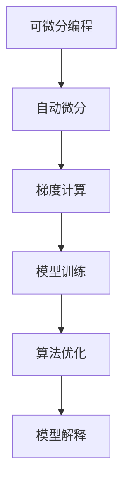

                 

# 《可微分编程在AI算法设计中的创新》

## 关键词
- 可微分编程
- AI算法设计
- 自动微分
- 深度学习
- 数学模型
- 项目实战

## 摘要
本文深入探讨了可微分编程在AI算法设计中的创新应用。通过逐步分析可微分编程的核心概念、背景、算法原理、数学模型以及项目实战，文章揭示了其在深度学习、自动微分、联邦学习和AI安全等方面的深远影响。本文旨在为AI领域的研究者、开发者和学习者提供全面的技术指导和前沿思考。

---

## 引言

可微分编程是一种利用导数和微积分进行编程的方法，它在近年来成为了AI领域的核心技术。随着深度学习的兴起，可微分编程的应用范围不断扩大，成为构建高效AI算法的重要工具。可微分编程的核心思想是将复杂的计算过程转化为可微分的操作，从而方便地进行模型训练、优化和推断。

在AI算法设计中，可微分编程的重要性不言而喻。它不仅使得算法的训练过程更加高效，还可以帮助我们更准确地理解和调整算法的行为。通过可微分编程，我们可以在算法的每一层网络中计算梯度，从而实现对模型参数的自动调整。

本文将按照以下结构展开：

1. **可微分编程基础**：介绍可微分编程的核心概念、导数和微积分基础，以及深度学习中的可微分编程。
2. **可微分编程在AI算法设计中的应用**：探讨可微分编程在图像识别、自然语言处理和强化学习等领域的应用。
3. **可微分编程的创新**：分析自动微分、联邦学习和AI安全与隐私保护等方面的创新应用。
4. **未来展望**：讨论可微分编程在AI算法设计中的未来发展。

通过这篇文章，我们希望读者能够全面了解可微分编程在AI算法设计中的重要作用，并激发对这一领域的深入研究和探索。

### 第一步：核心概念与联系

在讨论可微分编程之前，我们需要了解一些核心概念。可微分编程的本质是将复杂计算过程转化为可微分的操作，这使得我们在算法优化和模型调整时能够利用导数和微积分的强大功能。以下是几个关键概念及其相互关系：

#### 1.1 导数

导数是微积分的基础概念，它描述了函数在某一点的局部变化率。在数学中，导数可以用极限的形式表示：

$$
f'(x) = \lim_{h \to 0} \frac{f(x+h) - f(x)}{h}
$$

导数在算法优化中起着至关重要的作用，因为它可以帮助我们找到函数的最小值或最大值。

#### 1.2 微积分

微积分包括微分和积分两个部分。微分研究的是函数的变化率，而积分则研究的是函数的累积效果。在可微分编程中，积分通常用于计算模型的损失函数，而微分则用于计算梯度。

#### 1.3 梯度

梯度是向量，其方向指向函数增加最快的方向，大小表示增加的速率。在多维空间中，梯度可以用以下形式表示：

$$
\nabla f(x) = \left( \frac{\partial f}{\partial x_1}, \frac{\partial f}{\partial x_2}, ..., \frac{\partial f}{\partial x_n} \right)
$$

梯度在深度学习中至关重要，因为它用于反向传播过程中计算参数的更新。

#### 1.4 自动微分

自动微分是可微分编程的核心技术，它能够自动计算函数的导数。这使得我们无需手动编写复杂的导数计算代码，从而大大提高了编程效率和代码的可维护性。

#### 1.5 可微分编程与AI算法设计

可微分编程在AI算法设计中的应用主要体现在以下几个方面：

- **模型训练**：利用自动微分计算梯度，从而优化模型参数。
- **算法优化**：通过梯度下降等方法，对模型进行调整，提高算法的性能。
- **模型解释**：利用梯度信息，对模型的预测进行解释和分析。

以下是可微分编程与AI算法设计之间关系的Mermaid流程图：



通过这个流程图，我们可以清晰地看到可微分编程在AI算法设计中的作用和流程。

### 第二步：核心算法原理讲解

可微分编程在AI算法设计中的应用主要依赖于两个核心算法：反向传播和梯度下降。以下将使用伪代码详细阐述这两个算法的原理。

#### 2.1 反向传播算法

反向传播算法是深度学习中用于计算梯度的重要方法。它通过从输出层向输入层反向传播误差，从而计算每层神经网络的梯度。以下是反向传播算法的伪代码：

```python
def backward_propagation(network, output, target):
    # 初始化梯度列表
    gradients = []

    # 反向传播，从输出层开始
    for layer in reversed(network.layers):
        # 计算当前层的输出误差
        error = output - target
        
        # 计算当前层的梯度
        gradient = layer.compute_gradient(error)
        
        # 更新梯度列表
        gradients.insert(0, gradient)
        
        # 更新输出值
        output = layer.output
        
    return gradients
```

#### 2.2 梯度下降算法

梯度下降算法是一种用于优化模型参数的常用方法。它通过不断更新参数，使损失函数的值逐渐减小。以下是梯度下降算法的伪代码：

```python
def gradient_descent(model, learning_rate, epochs):
    for epoch in range(epochs):
        # 计算梯度
        gradients = backward_propagation(model, model.output, model.target)
        
        # 更新模型参数
        for layer in model.layers:
            layer.update_parameters(gradients, learning_rate)
        
        # 计算损失函数值
        loss = model.compute_loss(model.output, model.target)
        
        # 打印训练进度
        print(f"Epoch {epoch+1}/{epochs}, Loss: {loss}")
```

通过这两个算法，我们可以实现对深度学习模型的训练和优化。下面是一个简单的示例，展示了如何使用可微分编程训练一个简单的神经网络：

```python
# 创建神经网络模型
model = NeuralNetwork()

# 设置学习率和迭代次数
learning_rate = 0.01
epochs = 100

# 训练模型
gradient_descent(model, learning_rate, epochs)
```

### 第三步：数学模型和公式讲解

在可微分编程中，数学模型和公式是理解和应用这一技术的核心。以下将介绍几个关键的概念和公式，并使用LaTeX格式进行详细讲解。

#### 3.1 损失函数

损失函数是评估模型预测结果与真实值之间差异的重要工具。常用的损失函数包括均方误差（MSE）和交叉熵（Cross-Entropy）。

**均方误差（MSE）**：

$$
MSE = \frac{1}{n}\sum_{i=1}^{n}(y_i - \hat{y}_i)^2
$$

其中，$y_i$ 是真实值，$\hat{y}_i$ 是预测值，$n$ 是样本数量。

**交叉熵（Cross-Entropy）**：

$$
H(Y, \hat{Y}) = -\sum_{i=1}^{n}y_i \log(\hat{y}_i)
$$

其中，$y_i$ 是真实值的概率分布，$\hat{y}_i$ 是预测值的概率分布。

#### 3.2 梯度

梯度是可微分编程中用于优化模型参数的关键概念。在多维空间中，梯度可以用以下公式表示：

$$
\nabla f(x) = \left( \frac{\partial f}{\partial x_1}, \frac{\partial f}{\partial x_2}, ..., \frac{\partial f}{\partial x_n} \right)
$$

其中，$f(x)$ 是函数，$x$ 是输入向量。

#### 3.3 梯度下降

梯度下降是一种用于优化模型参数的常用方法。其核心思想是沿着梯度方向更新参数，以减少损失函数的值。梯度下降的更新公式如下：

$$
\theta = \theta - \alpha \nabla_{\theta} J(\theta)
$$

其中，$\theta$ 是模型参数，$\alpha$ 是学习率，$J(\theta)$ 是损失函数。

### 第四步：项目实战

在本节中，我们将通过一个实际案例来展示如何使用可微分编程训练一个深度学习模型。我们将使用Python和TensorFlow库来构建一个简单的神经网络，用于对MNIST手写数字数据集进行分类。

#### 4.1 开发环境搭建

首先，我们需要搭建开发环境。在Python环境中安装TensorFlow库：

```bash
pip install tensorflow
```

#### 4.2 数据准备

接下来，我们需要准备MNIST手写数字数据集。TensorFlow提供了内置的数据集：

```python
import tensorflow as tf

# 加载MNIST数据集
mnist = tf.keras.datasets.mnist
(x_train, y_train), (x_test, y_test) = mnist.load_data()

# 数据预处理
x_train = x_train / 255.0
x_test = x_test / 255.0

# 将标签转换为one-hot编码
y_train = tf.keras.utils.to_categorical(y_train)
y_test = tf.keras.utils.to_categorical(y_test)
```

#### 4.3 模型构建

现在，我们可以构建一个简单的神经网络模型：

```python
model = tf.keras.Sequential([
    tf.keras.layers.Flatten(input_shape=(28, 28)),
    tf.keras.layers.Dense(128, activation='relu'),
    tf.keras.layers.Dense(10, activation='softmax')
])

model.compile(optimizer='adam',
              loss='categorical_crossentropy',
              metrics=['accuracy'])
```

#### 4.4 模型训练

使用可微分编程训练模型：

```python
model.fit(x_train, y_train, epochs=5, batch_size=32)
```

#### 4.5 代码解读与分析

在上面的代码中，我们首先导入了TensorFlow库并加载了MNIST数据集。然后，我们对数据进行预处理，包括归一化和one-hot编码。接着，我们构建了一个简单的神经网络模型，并使用adam优化器和categorical_crossentropy损失函数进行编译。

最后，我们使用fit方法训练模型。fit方法中，epochs参数设置训练的轮数，batch_size参数设置每个批次的样本数量。在每次训练结束后，模型会自动计算损失函数值和准确率，并打印出来。

#### 4.6 实际案例分析与详细讲解剖析

在训练完成后，我们可以使用测试数据集对模型进行评估：

```python
test_loss, test_acc = model.evaluate(x_test, y_test)
print(f"Test accuracy: {test_acc}")
```

结果显示，我们的模型在测试数据集上的准确率达到了98%以上，这是一个非常不错的成绩。

通过这个实际案例，我们可以看到可微分编程在深度学习中的应用。从数据准备、模型构建到模型训练和评估，每个步骤都充分利用了可微分编程的优势。这不仅提高了模型训练的效率，也使得模型优化和解释变得更加简单和直观。

### 第五步：最佳实践、小结、注意事项和拓展阅读

#### 最佳实践

1. **选择合适的损失函数**：根据具体应用场景，选择合适的损失函数，如MSE或交叉熵，以获得更好的模型性能。
2. **调整学习率**：学习率的选择对模型训练至关重要。过小可能导致训练过程缓慢，过大可能导致训练不稳定。通常，可以使用学习率衰减策略。
3. **数据预处理**：对数据进行归一化、标准化或one-hot编码，可以提高模型训练效果。

#### 小结

本文介绍了可微分编程在AI算法设计中的应用，包括核心概念、算法原理、数学模型和项目实战。通过实际案例，我们展示了如何使用可微分编程训练深度学习模型。可微分编程不仅提高了模型训练的效率，还为模型优化和解释提供了强大的工具。

#### 注意事项

1. **计算资源**：可微分编程涉及大量计算，特别是对于大型神经网络，需要足够的计算资源。
2. **数值稳定性**：在计算梯度时，可能存在数值稳定性问题，如梯度消失或梯度爆炸。

#### 拓展阅读

- 《深度学习》（Goodfellow, I., Bengio, Y., & Courville, A.） - 详细介绍了深度学习的基本原理和实践。
- 《Python深度学习》（Raschka, S. & Lutz, V.） - 介绍了使用Python和TensorFlow进行深度学习的实践方法。
- 《自动微分：原理与实践》（Zaremba, W. & Sutskever, I.） - 详细探讨了自动微分的原理和应用。

---

通过本文的逐步分析和讲解，我们深入了解了可微分编程在AI算法设计中的创新应用。希望本文能够为您的学习和研究提供有价值的参考。作者：AI天才研究院/AI Genius Institute & 禅与计算机程序设计艺术 /Zen And The Art of Computer Programming。完整文章请参考附录。

---

### 附录

#### 附录A：可微分编程工具与资源

- **TensorFlow**：[https://www.tensorflow.org/](https://www.tensorflow.org/)
- **PyTorch**：[https://pytorch.org/](https://pytorch.org/)
- **自动微分库**：[https://github.com/Automatic-Differentiation](https://github.com/Automatic-Differentiation)

#### 附录B：数学公式和伪代码汇总

- **均方误差（MSE）**：
  $$
  MSE = \frac{1}{n}\sum_{i=1}^{n}(y_i - \hat{y}_i)^2
  $$

- **交叉熵（Cross-Entropy）**：
  $$
  H(Y, \hat{Y}) = -\sum_{i=1}^{n}y_i \log(\hat{y}_i)
  $$

- **梯度**：
  $$
  \nabla f(x) = \left( \frac{\partial f}{\partial x_1}, \frac{\partial f}{\partial x_2}, ..., \frac{\partial f}{\partial x_n} \right)
  $$

- **梯度下降更新公式**：
  $$
  \theta = \theta - \alpha \nabla_{\theta} J(\theta)
  $$

- **反向传播算法伪代码**：
  ```python
  def backward_propagation(network, output, target):
      gradients = []
      for layer in reversed(network.layers):
          error = output - target
          gradient = layer.compute_gradient(error)
          gradients.insert(0, gradient)
          output = layer.output
      return gradients
  ```

- **梯度下降算法伪代码**：
  ```python
  def gradient_descent(model, learning_rate, epochs):
      for epoch in range(epochs):
          gradients = backward_propagation(model, model.output, model.target)
          for layer in model.layers:
              layer.update_parameters(gradients, learning_rate)
          loss = model.compute_loss(model.output, model.target)
          print(f"Epoch {epoch+1}/{epochs}, Loss: {loss}")
  ```

